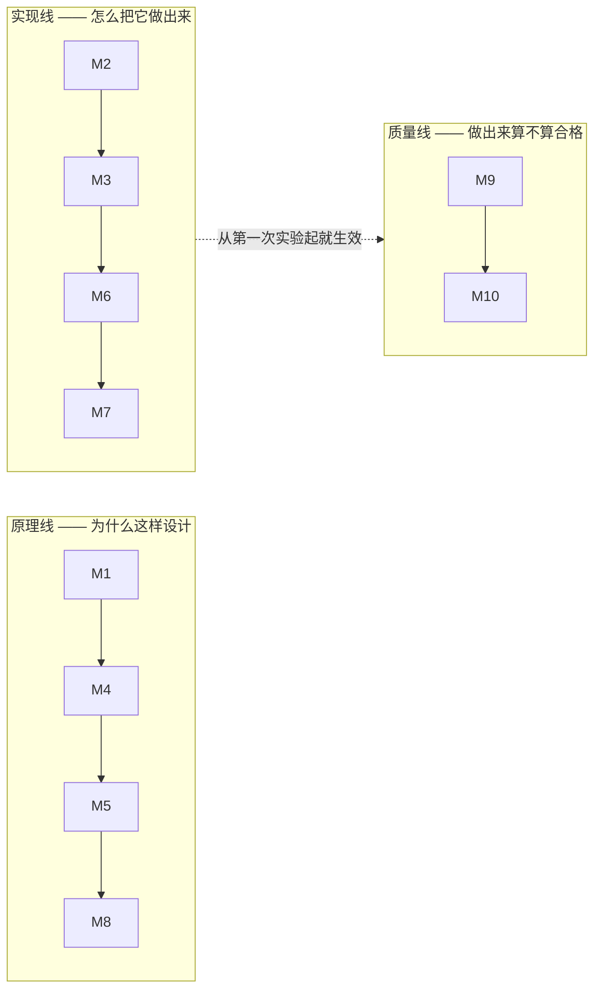
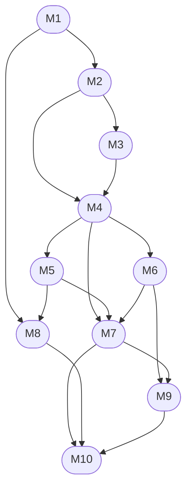
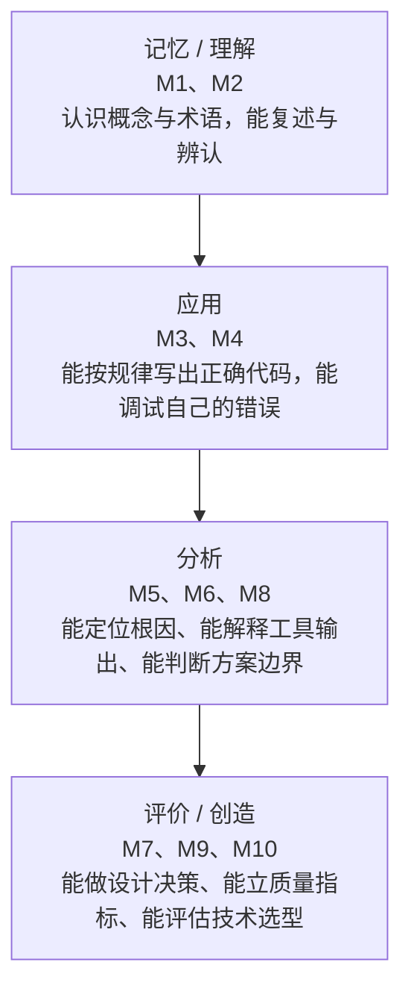

# Web 前端技术 · 课程大纲

> 一句话：这门课不是教「会用某个框架」，而是教**从协议到界面的每一层为什么是这样**，以及**工程上如何做出可维护、可验证、能被别人接手的东西**。
> 本大纲是全局口径的唯一出处：模块编号、学时、考核权重、资料分级都以这里为准；各模块教案只写本模块内容，不重复定义总则。

## 一、课程信息

| 项 | 内容 |
|---|---|
| 课程名 | Web 前端技术 |
| 学分/学时 | 建议 4 学分 / 96 学时（讲授 64 + 实验上机 32） |
| 对象 | 计算机、软件工程专业本科生（三年级为宜） |
| 先修 | 程序设计基础（C/C++ 或 Python 任一）、数据结构、计算机网络（可并行修） |
| 教学形式 | 讲授 + 现场演示（浏览器开发者工具全程在场）+ 上机实验 + 课程项目 |
| 考核 | 平时 10% · 编程作业 20% · 实验 15% · 课程项目 25% · 期末闭卷笔试 30% |
| 教材口径 | **不指定单一教材**。以现行规范与官方文档为权威（见第七节），教材作参考读物 |

**为什么"不指定教材"**：Web 技术的权威文本是活的（WHATWG Living Standard、ECMA-262 年度版本、IETF 的 RFC），任何纸质教材出版即滞后。教材适合当**导读与习题来源**，不适合当**判据**。这一点必须在第一节课讲清楚，否则学生会拿五年前的博客当标准。

## 二、课程定位

### 2.1 这门课解决什么

前端是这个时代最容易被低估的工程领域：入门门槛低，导致大量"能跑就算完"的代码；但它的**正确性、性能、安全、可访问性**都直接面对真实用户与真实攻击面。本课程按三条线组织：

| 线 | 内容 | 对应模块 |
|---|---|---|
| **原理线** | 协议、浏览器、语言语义——为什么这样设计 | M1、M4、M5、M8 |
| **实现线** | 结构、样式、组件、工程化——怎么把它做出来 | M2、M3、M6、M7 |
| **质量线** | 性能、可访问性、测试、安全、部署、职业判断 | M9、M10（并贯穿全部模块） |

> **图 1**：三条线的模块分工。原理线与实现线**交替推进**（先知道为什么，再动手做出来）；质量线集中在课程后段，但它的要求从第一次实验就生效——**图上那条虚线就是"提前生效"的意思**。

### 2.2 不做什么

- **不做框架速成培训**：M7 只讲清组件化的心智模型与两条主流路线，不追求覆盖某个框架的全部 API。
- **不做"抄一个商城后台"**：项目考核看重的是**能解释的设计决策**与**可验证的质量指标**，不是页面数量。
- **不回避规范原文**：从 M1 起就带学生读 W3C / WHATWG / IETF / Ecma 文档的形态与状态字段（CR、REC、Living Standard 各自意味着什么）。

## 三、学习成果（可考核）

修完本课程，学生应能：

1. **解释**一次页面请求从地址栏到首屏经过了哪些环节，并说出每一环节的失败后果。（M1、M5、M8）
2. **写出**结构与表现分离、语义正确、键盘可操作的静态页面，并用开发者工具与无障碍检查证明其正确性。（M2、M3）
3. **解释** JavaScript 的作用域、闭包、`this`、原型与事件循环，并据此**定位**一段代码为何输出与预期不符。（M4）
4. **判断**一段样式为何不生效、一个 `z-index` 为何失效、一次交互为何卡顿，并给出证据（工具截图或数据）。（M3、M5、M9）
5. **从零建立**一个 TypeScript 工程：脚手架、类型检查、lint、格式化、构建、部署，并说明每一步解决了什么问题。（M6）
6. **用**组件化方式实现一个带路由、请求、状态管理的中型单页应用，并能说出"状态该放哪里"的判断依据。（M7）
7. **设计并实现**一次符合 HTTP 语义与安全边界的接口交互，包括缓存、跨域、鉴权与错误处理。（M8）
8. **测量并改进**性能指标，写出可复现的"改前—改动—改后"证据链；为关键逻辑写自动化测试。（M9）
9. **读**一份真实规范文档，判断某特性当前是否该用于生产。（M10）
10. **遵守**工程伦理与学术诚信：标注代码与资料来源、不使用未经审查的生成内容作为交付。（贯穿）

## 四、模块地图与学时

| 模块 | 名称 | 讲授 | 实验/上机 | 合计 | 先修 | 教案 |
|---|---|---|---|---|---|---|
| M1 | Web 的起源与技术基础 | 6 | 2 | 8 | — | [[01-教案 M1 Web 的起源与技术基础]] |
| M2 | HTML 与语义化 | 4 | 2 | 6 | M1 | [[02-教案 M2 HTML 与语义化]] |
| M3 | CSS 与布局 | 8 | 4 | 12 | M2 | [[03-教案 M3 CSS 与布局]] |
| M4 | JavaScript 语言核心 | 8 | 4 | 12 | M2、M3 | [[04-教案 M4 JavaScript 语言核心]] |
| M5 | 浏览器原理与运行时 | 7 | 3 | 10 | M4 | [[05-教案 M5 浏览器原理与运行时]] |
| M6 | 前端工程化 | 6 | 4 | 10 | M4 | [[06-教案 M6 前端工程化]] |
| M7 | 组件化与框架 | 9 | 5 | 14 | M4、M5、M6 | [[07-教案 M7 组件化与框架]] |
| M8 | 网络与数据 | 6 | 2 | 8 | M1、M5 | [[08-教案 M8 网络与数据]] |
| M9 | 性能、可访问性、测试与部署 | 6 | 4 | 10 | M6、M7 | [[09-教案 M9 性能可访问性测试与部署]] |
| M10 | 现代前端与前沿 | 4 | 2 | 6 | M7、M8、M9 | [[10-教案 M10 现代前端与前沿]] |
| — | **合计** | **64** | **32** | **96** | | |

> **自校验**：讲授 6+4+8+8+7+6+9+6+6+4 = **64** ✓；实验 2+2+4+4+3+4+5+2+4+2 = **32** ✓；合计 **96** ✓。改动任何一行学时，请同步改本行与第五节明细表。

**模块之间的先修关系**（读法：箭头 = "左边必须在右边之前"，不是学时先后）：

> **图 2**：十个模块的先修关系。M1 是唯一入口；**M4 是主干枢纽**（M5／M6／M7 三条线都从它出发）；M10 汇聚 M7／M8／M9。上表的「先修」列与本图逐条对应，改表就要改图。
**难度与认知层次的爬升**（"从浅到深"的量化口径）：

| 层次 | 模块 | 学生行为特征 |
|---|---|---|
| 记忆/理解 | M1、M2 | 认识概念与术语，能复述与辨认 |
| 应用 | M3、M4 | 能按规律写出正确代码，能调试自己的错误 |
| 分析 | M5、M6、M8 | 能定位根因、能解释工具输出、能判断方案边界 |
| 评价/创造 | M7、M9、M10 | 能做设计决策、能立质量指标、能评估技术选型 |

> **图 3**：认知层次的爬升路线。习题集里每道题标的 `[记忆]`／`[应用]`／`[分析]`／`[评价]` 就是按这条路线的位置标的——**同一模块的作业会跨两到三个层次**，越往后"背下来就能得分"的题越少。
**模块依赖不能随意调序**：M4 之前不要上 M7（否则学生只能背框架 API，遇到报错无从下手）；M5 之后才讲 M7 的响应式原理（否则无法解释"为什么不能直接改 state"）；M6 必须在 M7 之前（否则项目无法落地与协作）。

## 五、四种拼法（按实际学时裁剪）

四种拼法**不是把同一张表乘以系数**，而是逐模块重新分配讲授与实验学时。下表每一列相加都等于标称学时——**开学前照此核一遍**。

| 模块 | 32 学时 讲+实=计 | 48 学时 讲+实=计 | 64 学时 讲+实=计 | 96 学时（标准） 讲+实=计 |
|---|---|---|---|---|
| M1 Web 的起源与技术基础 | 6+0=6 | 6+2=8 | 4+2=6 | 6+2=8 |
| M2 HTML 与语义化 | 4+2=6 | 4+2=6 | 4+2=6 | 4+2=6 |
| M3 CSS 与布局 | 8+2=10 | 8+2=10 | 6+2=8 | 8+4=12 |
| M4 JavaScript 语言核心 | 6+4=10 | 8+4=12 | 6+2=8 | 8+4=12 |
| M5 浏览器原理与运行时 | —（讲座 1 次） | 2+2=4 | 4+2=6 | 7+3=10 |
| M6 前端工程化 | — | 2+2=4 | 4+2=6 | 6+4=10 |
| M7 组件化与框架 | —（讲座 1 次） | 2+2=4 | 6+2=8 | 9+5=14 |
| M8 网络与数据 | — | — | 6+2=8 | 6+2=8 |
| M9 性能、可访问性、测试与部署 | — | — | 6+2=8 | 6+4=10 |
| M10 现代前端与前沿 | — | — | —（结课讲座） | 4+2=6 |
| **合计（讲+实）** | **24+8=32 ✓** | **32+16=48 ✓** | **46+18=64 ✓** | **64+32=96 ✓** |

| 拼法 | 覆盖模块 | 适合 | 取舍说明 |
|---|---|---|---|
| **32 学时** | M1–M4 | 小学期 / 通识选修 / 非计算机专业压缩版 | 只到"能做出来"；M5/M7 各以一次讲座穿插（不计学时）；不做工程化与质量线，项目改为个人小作品 |
| **48 学时** | M1–M7 | 一学期每周 3 学时（16 周 × 2 理论 + 双周 2 实验） | 主干完整；周历见 [[17-教学日历与开场钩子]]；期末笔试降到 25%，差额并入编程作业与课程项目（编程作业 25%、实验 15%、课程项目 25%，详见 [[13-考核方案与评分量规]]） |
| **64 学时** | M1–M9 | 一学期每周 4 学时 | 质量线进入考核；M10 改为结课讲座 |
| **96 学时（标准）** | M1–M10 全部 | 每周 6 学时或理论+上机分课头 | 本大纲默认形态，含完整实验与项目评审 |

裁剪原则：**可以砍模块，不能砍每模块的实验与验收判据**。前端的知识只有在手上过一遍才留得住。

### 5.1 学时不足时的删减顺序（从先砍到后砍）

| 顺序 | 可删内容 | 为什么先砍 |
|---|---|---|
| 1 | M10 全部前沿内容（改为 1 次结课讲座） | 前沿变化快，学生入职后自学成本低 |
| 2 | M7 的第二条框架路线（Vue 与 React **只留一条**） | 两条路线的价值在对比，压缩时对比可换成教师演示 |
| 3 | M6 的 lint/格式化工具细节（只保留"为什么要"，不讲配置项） | 配置细节可查文档，心智模型不可查 |
| 4 | M9 的 Playwright 端到端测试（保留 Vitest 单元测试与指标测量） | 端到端测试依赖环境稳定性，课时紧时收益最低 |
| 5 | M9 的图片与字体优化专题 | 可在项目评审中以点评形式补齐 |

**四项不可删（删了课就不成立）**：

| 不可删 | 理由 |
|---|---|
| M2 的**无样式文档可读性检查** | 它是"语义化不是风格问题"的唯一硬证据，也是可访问性的入口 |
| M3 的**盒模型与层叠的现场调试演示** | 学生"看着会、写起来崩"的根因就在这里，读讲义替代不了 |
| M4 的**闭包、`this`、事件循环**三处 | 后续一切异步与框架行为都建立在这三处之上 |
| M9 的**"改前—改动—改后"证据链**（若开 M9） | 本课程的质量观全部落在"能不能给出证据"上 |

### 5.2 按学生基础调整深度

| 学生基础 | 调整办法 |
|---|---|
| 计算机类、**有**编程基础 | 按标准表执行；M4 的语言基础部分（类型、运算符、流程控制）改为**课前自学 + 课堂测验**，省下的学时给 M4 的异步与 M7 的性能边界 |
| 计算机类、**无**前端经验但会编程 | 压缩 M1 的历史部分至 1 学时；M2/M3 的实验判据不变（这是底线）；M7 双线改为单线 |
| 通识类 / 非计算机专业 | 用 32 学时拼法；M4 只保留"能读懂并改对"的深度，不要求手写闭包与原型；考核改为作品 + 上机，取消闭卷笔试 |

## 六、考核结构

> 五个考核模块的权重、门槛与评分量规，完整口径见 [[13-考核方案与评分量规]]。

| 项目 | 权重 | 形式 | 考核什么 |
|---|---|---|---|
| 平时 | 10% | 出勤、课堂提问抽答、随堂小测（每模块 1 次，5–8 分钟） | 跟进度、能否现场解释 |
| 编程作业 | 20% | 每模块 1 次，共 9 次，取前 8 次计入 | 编程与调试能力、代码规范 |
| 实验 | 15% | 8 次实验报告（含证据：截图、指标前后对比、失败记录），**各次权重不等** | 动手与证据意识 |
| 课程项目 | 25% | 2–3 人一组，含中期检查、最终演示、个人贡献答辩 | 设计决策与协作 |
| 期末笔试 | 30% | 闭卷，2 小时（题型与样卷见 [[14-期末样卷与参考答案要点]]） | 原理与判断力，不考 API 记忆 |

**及格线**：总分 60 分；**单科门槛**：期末笔试须 ≥ 45/100，实验与项目不得为 0，否则总评不及格（防止"作业代做、笔试空卷"）。
**学术诚信**：代码查重与来源标注按 [[13-考核方案与评分量规]] 第二节执行；引用他人代码必须注明出处与许可；把生成式工具产出当作自己交付的成果，按抄袭处理。
**一件作品只计一次分**：课程项目与期末作品若为同一件，按 [[13-考核方案与评分量规]] 的"两个口径二选一"执行，不得既算项目分又算期末分。

## 七、资料分级（权威性从高到低，课堂上必须按此顺序引用）

| 级别 | 资料类型 | 例子 | 用法 |
|---|---|---|---|
| **一级（判据）** | 标准与规范原文 | WHATWG Living Standard、ECMA-262、IETF RFC、W3C 规范（注意其状态字段） | 有争议时以此为准 |
| **二级（权威解释）** | 平台厂商与标准组织的官方文档 | MDN、web.dev 的 Learn 系列、各框架官方文档 | 教学主线材料 |
| **三级（参考读物）** | 教材、系统性教程 | 现代 JavaScript 教程、ES6 入门、Pro Git 类 | 复习与练习来源 |
| **四级（谨慎）** | 博客、问答、AI 生成内容 | — | 只用于找线索，**不得作为依据引用**；结论必须回到一级或二级验证 |

> 这条分级本身就是教学内容：M10 会专门讲"如何判断一个说法可信"。学生作业中若出现四级资料当作依据，按规范问题扣分。
> **这些资料在 [[21-操作与资料速查（全可点）]] 里都有可直接点开的链接**（含开发者工具快捷键与各面板用法、本地开发命令、库内所有文件的锚点直达）。正文里提到资料名而不方便给链接的地方，回那张表点开即可。

## 八、教学法与课堂形态

1. **讲—演—练三段式**：每 2 学时中，讲授不超过 45 分钟，其余为现场演示与当堂练习。**演示必须在浏览器开发者工具里做**（打开方式：`F12` 或 `Ctrl+Shift+I`；完整快捷键与各面板用法见 [[21-操作与资料速查（全可点）]]），不许只放 PPT。
2. **错误优先**（本课程的核心教学法）：先给学生一段"能跑但有问题"的代码，让他找到问题根因，再讲正确做法。理由：前端的技能主体是**诊断**，不是记忆。
3. **证据意识**：任何结论都要能给出证据——工具截图、指标数据、复现步骤。口头断言（"我感觉这样更快"）在实验报告里不算结论。
4. **不回避不确定**：规范状态与浏览器支持面是会变的，遇到拿不准的问题，课堂上的正确回答是"我们查一下，并说明查的是哪一级资料"。
5. **课堂提问用法**：每节的提问不是考记忆，而是让学生**预测结果**（这段代码输出什么 / 这个样式会不会生效），预测与实测的差就是教学点。
6. **开场钩子**：每模块配一个 1 分钟的开场动作（现场制造一个反直觉现象），清单见 [[17-教学日历与开场钩子]]。钩子点到即止，用来制造"我想知道为什么"，不是用来娱乐。

## 九、与库内自学笔记的关系

本库另有 [[00-前端索引]] 一套**自学用**的四阶段路线（面向自学者，重路线与练习）。两者的关系：

| | 自学笔记（[[00-前端索引]]） | 本教学区 |
|---|---|---|
| 读者 | 一个人自学 | 教师 + 一个班 |
| 组织 | 四阶段 + 练习 | 十个模块 + 教案 + 作业 + 考核 |
| 有无考核 | 无，自测清单 | 有，含评分量规与笔试卷 |
| 口径一致性 | 版本口径与资料来源分级与教学区一致 | 以本大纲为准 |

## 十、配套文件与使用者

| 文件 | 内容 | 主要使用者 |
|---|---|---|
| [[01-教案 M1 Web 的起源与技术基础]] … [[10-教案 M10 现代前端与前沿]] | 十个模块的逐节教案（含学时节奏、误区诊断、出处依据） | **教师**（教案是教师自用书，不发给学生自读） |
| [[11-习题集 M1-M5]] · [[12-习题集 M6-M10]] | 按模块与认知层次出题，每题带 `[对应节][认知层次][难度]`，附答案要点与双向细目表 | **学生**（练习）＋教师（组卷） |
| [[19-加练题库与答案要点]] | 130 题加练题库（并入自 48 学时版本，按章组织） | **学生**（期末复习） |
| [[13-考核方案与评分量规]] | 考核细则、五维评分量规、实验内部权重、学术诚信与迟交政策 | **教师**（部分量规需提前公布给学生） |
| [[14-期末样卷与参考答案要点]] | 期末样卷、双向细目表、评分标准；含上机+答辩备选方案 | **教师**（保密）；题型样例可给学生 |
| [[15-实验与大作业指导]] | 八次实验与课程项目的任务书、验收判据、提交物要求、报告模板 | **学生**（主要实验用书）＋教师 |
| [[16-技术演进时间线]] | 从 1989 到现在的技术演进年表（含一手/二手/存疑标注） | 教师＋学生（M1、M10） |
| [[17-教学日历与开场钩子]] | 16 周周历（48 学时版）与每章开场钩子 | **教师** |
| [[18-教案补充 教学准备·板书设计·课程思政]] | 教学准备清单、板书设计、课程思政融入点、课后作业与预习 | **教师** |
| [[20-材料审核报告]] | 学生视角与同行视角的双重审核结论、修订记录、复审触发条件 | **教师**（备课自查，不发给学生） |
| [[21-操作与资料速查（全可点）]] | 开发者工具快捷键与四大面板用法、资料总表（57 条全可点）、本地开发命令、库内文件锚点直达 | **学生**（查工具与资料）＋教师 |
| [[22-前端安全专章（OWASP × ATT&CK）]] | 前端安全专章：信任边界 / OWASP × ATT&CK 分类防御 / 供应链 / CSP / 法律与伦理边界 / 自测 | **学生**（选修专题）＋教师 |
| [[23-安全审视报告（初学 + 网安视角）]] | 安全方向材料的双视角审视（19 条问题清单） | **教师**（备课自查） |
| [[24-JavaScript 脚本实战专章（Node 与浏览器）]] | 脚本实战专章：三种宿主 / Node 起步与模块系统 / 用户脚本 / 抓取边界 / 排错表 / 附加实验（第 9 次，选修） / 学时与插入点建议 | **教师**＋**学生**（选修专题） |

## 十一、教师备课进度表（可勾选）

- [ ] M1 Web 的起源与技术基础 —— 讲授 6 + 上机 2
- [ ] M2 HTML 与语义化 —— 讲授 4 + 上机 2
- [ ] M3 CSS 与布局 —— 讲授 8 + 上机 4
- [ ] M4 JavaScript 语言核心 —— 讲授 8 + 上机 4
- [ ] M5 浏览器原理与运行时 —— 讲授 7 + 上机 3
- [ ] M6 前端工程化 —— 讲授 6 + 上机 4
- [ ] M7 组件化与框架 —— 讲授 9 + 上机 5
- [ ] M8 网络与数据 —— 讲授 6 + 上机 2
- [ ] M9 性能、可访问性、测试与部署 —— 讲授 6 + 上机 4
- [ ] M10 现代前端与前沿 —— 讲授 4 + 上机 2
- [ ] 期末命题与评分标准审定
- [ ] 项目中期检查安排
- [ ] **开学前**：按第四节与第五节两张表核一遍学时自洽
- [ ] **开学前**：按 [[20-材料审核报告]] 的复审触发条件核版本号与数字
- [ ] （选修专题）JavaScript 脚本实战专章 —— [[24-JavaScript 脚本实战专章（Node 与浏览器）]]；若要纳入考核，先按 [[13-考核方案与评分量规]] 定实验权重

## 十二、依据说明（重要）

- 本大纲的**知识体系划分、学时分配、四种拼法、删减顺序、基础适配、考核权重、资料四级分级、教学法**，均为课程组的教学编排判断，**没有官方依据**——官方文档不规定怎么教一门课。凡引用本大纲的学时与权重，应视为课程组口径。
- **有官方依据的部分**：各项技术概念与规范状态；版本号取自 2026-10-01 实测的 npm registry（Vite 8.3.1 / React 19.3.0 / Vue 3.5.43 / Next.js 16.3.8 / Nuxt 4.5.2 / TypeScript 7.0.2 等），不是网络文章转述；技术史年份见 [[16-技术演进时间线]]，逐条标注了来源与存疑项。
- **本大纲刻意保留的不确定项**：部分规范的状态字段（例如 CSS Grid Layout Level 1 在公开资料中仍标为 Candidate Recommendation）与个别发布日期在不同来源间存在冲突。这些不做"统一成一句话"处理，而是作为教学案例保留——学生必须学会在来源冲突时说明冲突，而不是随便挑一个。
- 学时与周数的关系：本大纲按**模块 + 学时建议**组织，不绑定周数；转换为周历（如 16 周 × 6 学时）时，请保持模块依赖顺序（见第四节末）。48 学时拼法的周历已并入 [[17-教学日历与开场钩子]]。
- **并入说明**：第十节中的 [[17-教学日历与开场钩子]]、[[18-教案补充 教学准备·板书设计·课程思政]]、[[19-加练题库与答案要点]] 三份文件并入自另一套 48 学时《Web 网页技术》材料；并入内容的口径已按本大纲重核（原文中与之冲突的学时口径已作废，以本大纲为准）。审核与修订过程见 [[20-材料审核报告]]。

---

相关：[[00-前端索引]]（自学路线） · 本笔记属 `Web前端/教学/` 区，与其它笔记区各自独立。
