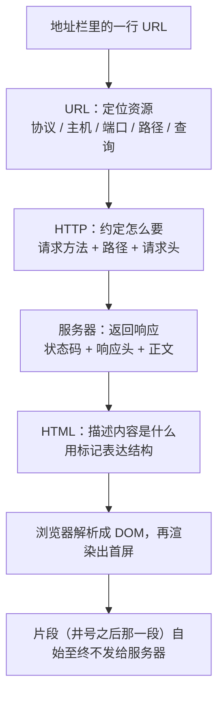
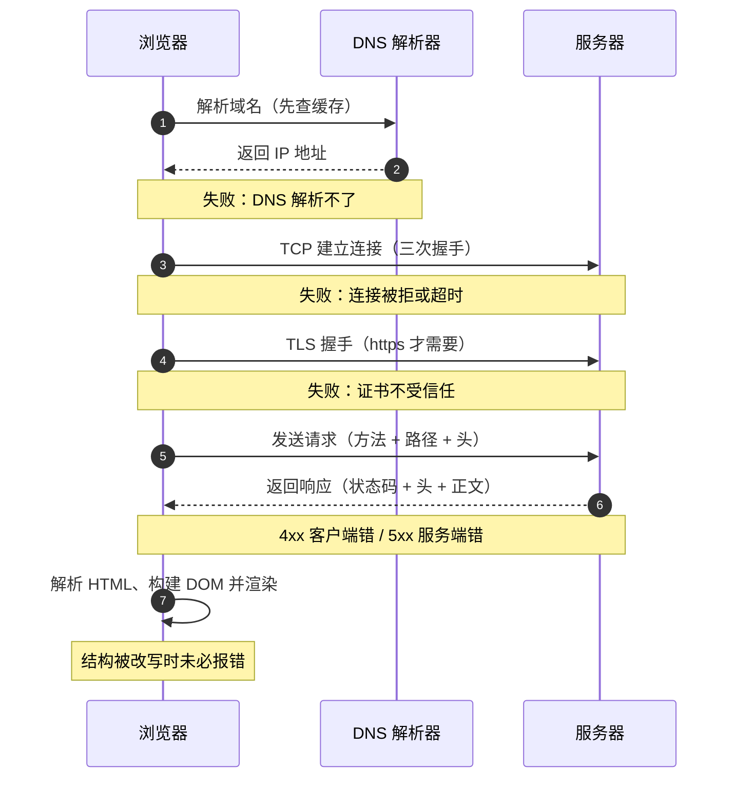
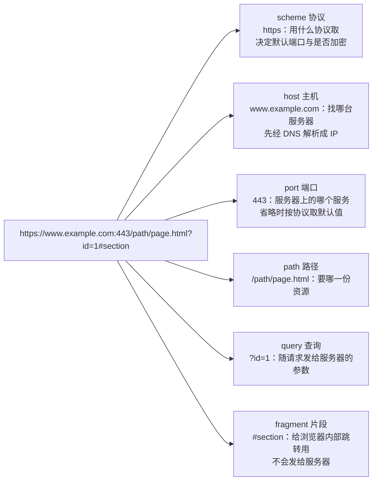

# M1 Web 的起源与技术基础

> 一句话：**网页不是"自然长出来的东西"，是 1989 年为了管理一堆互相找不到的文档而设计出来的一套分布式超文本系统**——理解了它当年要解决什么问题，后面每一层"为什么要这样"才有答案。
> 对应《Web 前端技术》课程大纲模块 M1（[[00-课程大纲]]）。本模块是唯一一个"从原来到现在"讲全了的模块，后续模块只补自己那一块的历史。

## 0. 这一块是怎么来的（历史一则）

1989 年 3 月，在瑞士 CERN 工作的 Tim Berners-Lee 提交了一份备忘录《Information Management: A Proposal》，要解决的不是"做一个网页"，而是 CERN 内部的文档灾难：几万台设备、几万名研究员、文档格式与存放位置五花八门，换一个人就找不到东西。他提出的方案是**分布式超文本**：文档之间用链接互相指向，读者点一下就跳过去。1990 年底，浏览器、服务器、协议、标记语言四件事一起做出来了；1991 年 8 月他把项目摘要贴到新闻组，1993 年浏览器源码公开，Mosaic 与 Netscape 把图形化网页带给了普通人。此后是十年混乱（浏览器各自为政），再往后是二十年的标准化与工程化——**这条线的每一个转折，都是"互操作性"与"厂商利益"之间的拉扯**，也是本模块真正要讲的东西。

## 1. 教学目标

| 层次 | 目标（可考核，用行为动词） |
|---|---|
| **知识** | 能区分 Internet 与 WWW；能说出 URL 各部分含义；能画出一次页面请求从地址栏到首屏经过的环节；能复述标准化史上的三个关键转折及其后果 |
| **能力** | 能在浏览器开发者工具里读出一份完整的请求与响应（方法、状态码、关键头部、协议版本）；能用一条命令起本地静态服务器并访问自己的页面；能独立搭好本课程所需的开发环境 |
| **素养/工程规范** | 能对一条流传的技术说法给出**可核查的来源**，并区分一级资料（规范原文）与四级资料（博客/问答/生成内容）；对拿不准的事实能明确说"不确定，需要核实"，而不是编一个看起来合理的年份或人名 |

**本模块学完后应能独立完成的一件事**：把"我电脑上的一个 HTML 文件"变成"同一局域网内的同学能用手机打开的一个网址"，并说清这中间是哪一步在起作用。

## 2. 学时分配与讲授节奏

合计 360 分钟（讲授 270 + 实验上机 90）。

| 序 | 主题 | 讲授分钟 | 实验上机分钟 | 教学形式 |
|---|---|---|---|---|
| 1 | 万维网之前：互联网、超文本、文档灾难 | 45 | 0 | 讲授 + 史料展示 |
| 2 | 标准化史与三次教训 | 45 | 0 | 讲授 + 课堂辩论 |
| 3 | 客户端-服务器模型与三层结构 | 45 | 0 | 讲授 + 板书画图 |
| 4 | URL 与一次 HTTP 往返的解剖 | 60 | 0 | 现场演示（开发者工具全程在场） |
| 5 | 浏览器、渲染引擎、站点发布的最小闭环 | 45 | 0 | 演示 + 逐行讲解 |
| 6 | 工程伦理与学术诚信（含引用规范） | 30 | 0 | 案例讨论 |
| 7 | 上机一：环境搭建与最小页面（file:// 与 http:// 的差别） | 0 | 45 | 上机 + 逐人验收 |
| 8 | 上机二：一次请求的完整解剖 + 史料溯源 | 0 | 45 | 上机 + 报告 |
| — | **合计** | **270** | **90** | |

## 3. 逐节讲授要点

### 3.1 万维网之前：互联网、超文本、文档灾难（45 分钟）

要讲什么：

- **互联网先于万维网**：互联网是网络与网络互联的**基础设施**（传输层及以下），电子邮件、文件传输、域名系统都比万维网更早，而且今天仍然活着。万维网只是跑在它上面的**一个应用**。
- **超文本的想法更早**：把文档之间用链接连起来、让读者"跳着读"，是几十年前的构想，Berners-Lee 的贡献是把"超文本" + "互联网地址" + "客户端-服务器"三件事拼成了一个可运行的系统。
- **他当时要解决的具体问题**：文档格式与位置不统一、换人接手就失传、人员流动导致信息流失。**关键点**：万维网的第一性目标是"让人能找到并打开别人放的文档"，不是"做出漂亮的界面"。

必须现场的演示/操作：

- 打开 [1989 年提案原页（W3C 存档）](https://www.w3.org/History/1989/proposal-msw.html)，**当面念出备忘录里的原始措辞**，让学生看到"网页"最初长什么样（纯文本 + 超链接）。
- 在终端里 `nslookup` 一个域名（Windows：开始菜单搜 `cmd` 打开终端，或按 `Win+R` 输入 `cmd`；在其中运行 `nslookup example.com`），说明域名系统早于万维网存在，与网页无关。

要提问学生的问题及期望答案：

1. "没有万维网，互联网还能用吗？反过来呢？" —— 期望：前者能（邮件、域名、文件传输照旧）；后者不能（万维网必须有网络与寻址作底座）。
2. "为什么第一版浏览器是**浏览器兼编辑器**？" —— 期望：因为最初的使用者是研究者，既要读也要写；把它想成"浏览工具"是后人的窄化。

学生一定会犯的错：把"上网"等同于"打开网页"；以为浏览器是"互联网的窗口"而不是"运行在互联网上的一个程序"。

### 3.2 标准化史与三次教训（45 分钟）

要讲什么：讲三个转折，每个都问"如果不标准化，代价是什么"。

| 转折 | 发生了什么 | 代价 / 教训 |
|---|---|---|
| **浏览器战争与私有扩展** | 1990 年代中期各家浏览器各自加特性，同一段 HTML 在不同浏览器里表现不同 | 开发者要写多套代码；催生了后来的兼容层类库（jQuery 于 2006 年 1 月 14 日发布就是这段历史的产物）→ **教训：没有标准，成本会转移到每一个开发者身上** |
| **XHTML 的严格路线受挫** | 2000 年 XHTML 1.0 成为 W3C 推荐标准，要求文档严格合法 | 现实网页大量不合规，严格性把规范推离了实践 → **教训：规范必须贴着现实实现走，否则会被绕过** |
| **WHATWG 与 Living Standard** | 2004 年多家浏览器厂商成立 WHATWG，走"先实现、后标准化、持续更新"的路线；HTML5 于 2014-10-28 成为 W3C 推荐标准；2019 年 5 月 W3C 与 WHATWG 签署备忘录，HTML 的权威版本归 WHATWG 的 Living Standard | **教训：标准的形态本身是博弈的结果**，"现在到底以哪一份为准"是必须会查的问题 |

必须现场的演示/操作：现场打开 [WHATWG 的 HTML Living Standard](https://html.spec.whatwg.org/multipage/) 与 [W3C 的历史推荐标准页面](https://www.w3.org/TR/)，**对比同一话题在两处的表述与状态标注**；让学生看到"标准文档有状态字段（Working Draft / Candidate Recommendation / Recommendation）"这件事。

要提问学生的问题及期望答案：

1. "浏览器都支持某个特性了，是不是就说明它是标准？" —— 期望：不是。要看规范状态；反过来，规范是 Recommendation 也不代表所有浏览器实现一致。
2. "标准化对厂商是纯好事吗？" —— 期望：不是。标准化降低互操作成本、扩大市场，但也限制厂商用私有特性锁定用户。

学生一定会犯的错：认为"标准就是官方规定、大家都得听"（实际是协商产物）；把某个博客里的一句话当成规范。

### 3.3 客户端-服务器模型与三层结构（45 分钟）

要讲什么：

- **请求-响应模型**：浏览器（客户端）发请求，服务器回响应。服务器**不知道你的电脑上有什么文件**，所以本地文件与服务器文件是两件不同的事（这一条为第 7 节的上机埋雷）。
- **三层结构**：结构（HTML）、表现（CSS）、行为（JavaScript）。强调这是**职责分离**，不是文件分离——实践中一个组件可能同时包含三者，但职责边界必须清楚。
- **"前端"这个词的边界**：跑在浏览器里的部分叫前端；但前端的正确性依赖服务端返回什么，所以本课程要讲 HTTP 与跨域（M8）。
- 板书画出：`浏览器 --请求--> 服务器 --响应--> 浏览器`，并标出"这一层是 HTTP"。



> **图 1**：URL、HTTP、HTML 在一次页面请求里的分工——URL 说「在哪」，HTTP 说「怎么要」，HTML 说「拿到的是什么」。
> **看图要点**：地址栏里输入的那一行就是 URL；请求按 HTTP 的规则发出；响应正文通常就是 HTML，浏览器把它解析成 DOM 才有页面。

必须现场的演示/操作：

- 在地址栏输入 `view-source:` 加网址，看服务器真正发过来的内容；再对比开发者工具的 Elements 面板（按 `F12` 或 `Ctrl+Shift+I` 打开开发者工具后点顶部 Elements，或按 `Ctrl+Shift+C` 直接点选元素；这里看到的是已被浏览器解析改动过的 DOM）。**这个对比是理解"源码 ≠ DOM"的起点，到 M5 会再次用到。**

要提问学生的问题及期望答案：

1. "双击一个 HTML 文件能打开，为什么还要服务器？" —— 期望：本地打开缺少 HTTP 语义（没有状态码、没有头部、跨域与模块加载受限、别人访问不到）。
2. "把 CSS 写进 HTML 的 `style` 属性里，违反了哪一条原则？" —— 期望：结构（HTML）里不要写表现（CSS），即关注点分离。

学生一定会犯的错：把所有东西塞进一个文件；认为"服务器"是某种特殊机器（其实是运行着服务程序的普通计算机）。

### 3.4 URL 与一次 HTTP 往返的解剖（60 分钟）

要讲什么：

- **URL 的解剖**：`https://www.example.com:443/path/page.html?id=1#section` → 协议 / 主机 / 端口 / 路径 / 查询 / 片段。**片段（`#` 之后）不会发给服务器**（这一条最容易被忽略）。
- **一次往返的环节**：解析域名 → 建立连接（含 TLS 握手，定性）→ 发送请求（方法 + 路径 + 头部）→ 服务器处理 → 返回响应（状态码 + 头部 + 正文）→ 浏览器解析并渲染。
- **状态码分类**：1xx 信息、2xx 成功、3xx 重定向、4xx 客户端错、5xx 服务端错。**只要求记住分类与 200/301/304/404/500 的含义**，细节留给 M8。
- **协议版本**：在开发者工具里能直接看到 `http/1.1`、`h2`、`h3`（按 `F12` → Network → 按 `F5` 刷新 → 点开请求看 Protocol / 协议列），当场指出这三者对应 M8 要讲的演进。



> **图 2**：一次 HTTP 往返的完整时序，以及每一步失败时用户在页面上看到什么。
> **看图要点**：DNS、TCP、TLS 三步都发生在请求报文发出之前——Network 面板里看不到它们，所以「网页打不开」要先分清是基础设施问题还是应用层问题。
> **每一步失败时页面上看到什么**（图内为压缩标签，完整说法在此）：① 「解析域名（先查缓存）」指先查浏览器与系统缓存；失败时页面报「无法访问此网站」。② TCP 失败（连接被拒或超时）：页面一直转圈直到报「连接超时」。③ TLS 证书不受信任：浏览器先给安全警告页。④ 状态码：4xx 是客户端错、5xx 是服务端错，页面显示的是服务器给的错误内容。⑤ 解析 HTML、构建 DOM 并渲染这一步被容错改写或渲染异常时，页面看起来「不对劲」却未必报错。



> **图 3**：一个 URL 的六段结构，以及每一段在请求里各自承担什么职责。
> **看图要点**：只有 fragment 这一段不参与请求；查询字符串会发给服务器，片段只留给浏览器自己。

必须现场的演示/操作（本模块的核心演示，必须做满 20 分钟）：

1. 打开开发者工具 Network 面板（按 `F12` 或 `Ctrl+Shift+I` → 顶部点 Network，中文界面叫「网络」），勾选保留日志（Preserve log），按 `F5` 或 `Ctrl+R` 刷新一次真实网站；
2. 点开第一个文档请求（点请求行展开详情，按 `Esc` 关掉下方详情栏），**逐行指认**：Request Method、Status Code、Request Headers（Host / User-Agent / Accept / Cookie）、Response Headers（Content-Type / Cache-Control / Set-Cookie）；
3. 找到协议版本那一栏，指出是 h2 还是 h3；
4. 用 `curl -I <网址>` 在终端里复现同一个请求（Windows 10/11 自带 curl：打开终端输入 `curl -I https://example.com` 回车），对照两者的头部**哪些一致、哪些不一致**；
5. 把 URL 加上 `#abc`，证明片段不出现在请求里。

要提问学生的问题及期望答案：

1. "状态码 304 表示出错了吗？" —— 期望：不是，表示"资源没变、用你本地的缓存"。
2. "为什么 URL 里的 `#` 后面部分服务器收不到？" —— 期望：片段是给浏览器内部跳转用的，不参与请求。
3. "请求头里的 User-Agent 是干什么的？" —— 期望：服务端据此判断客户端能力；也因此可以被伪装，所以不能作为安全依据（为 M8 的边界意识铺垫）。

学生一定会犯的错：把 404 当成"网络断了"；以为 `#` 之后的参数会传给后端；以为响应头不重要（实际缓存、跨域、Cookie 全靠它）。

### 3.5 浏览器、渲染引擎与站点发布的最小闭环（45 分钟）

要讲什么：

- **渲染引擎**：主流的几个引擎与浏览器种类的对应关系（定性描述，不背版本号）。
- **浏览器做的事**：解析 HTML → 构建 DOM → 计算样式 → 布局 → 绘制 → 合成。**只给流程与直觉，原理细节在 M5。**
- **站点发布的最小闭环**：写文件 → 用静态服务器把它挂出来 → 访问 IP/端口 → 别人能打开。**先只做这一条，不引入任何框架与构建工具**——这是本课程"地基优先"的第一次体现。
- 提到"部署"到托管平台时，先说清它本质上也是"把文件放到一台能被公网访问的服务器上"。

必须现场的演示/操作：在本机用一条命令起静态服务器（Python 自带的 `http.server` 即可：打开终端 → `cd` 到页面所在目录 → 运行 `python -m http.server 8000` → 浏览器访问 `http://127.0.0.1:8000/`；换手机访问要改用本机在局域网里的 IP），当场用手机连同一局域网访问，让学生看到"发布"这件事的真实形态。

要提问学生的问题及期望答案：

1. "为什么开发者工具里的 Elements 面板看到的和 view-source 看到的不一样？" —— 期望：一个是解析后的 DOM，一个是服务器发来的源码；JS 可以改 DOM。
2. "换成手机访问，需要改什么？" —— 期望：绑定地址不能只是 `127.0.0.1`，要监听所有网卡；并且要知道本机在局域网里的 IP。

学生一定会犯的错：服务只绑 `127.0.0.1` 却以为手机能访问；把浏览器缓存导致的"改了没生效"当成代码错误。

### 3.6 工程伦理与学术诚信（30 分钟）

要讲什么（本节是课程思政与学术规范的落点，必须讲够）：

- **代码与资料的来源标注**：借鉴了谁的代码、参考了哪篇文档、用了什么开源许可，都要写清。许可不兼容的代码不能直接抄进作业。
- **生成式工具的使用边界**：可以用它解释报错、解释概念、检查自己的代码；**不能把它的产出直接作为自己的交付**。凡在作业里使用，必须在提交物里说明"哪部分用了、用来做什么、自己做了哪些验证"。
- **不确定的表达**：学术表达里，"我不确定，来源是 X，需要核实"是可接受的；编一个具体年份、人名或论文名来让论述完整，是不可接受的。
- 案例讨论（用第 2 节里的史实当材料）：网上流传的技术史说法经常互相矛盾——例如 TypeScript 1.0 的发布日期在不同公开来源里不一致；Tim Berners-Lee 1989 年那份提案本身只写了"March 1989"，后来的具体日期是回忆性材料补充的。**遇到这种冲突时，正确做法是说明冲突并给出各自来源，而不是挑一个看起来顺眼的。**

要提问学生的问题及期望答案：

1. "作业里用了别人的一段代码，怎么算合规？" —— 期望：注明来源与许可，说明自己改了什么，不把它说成自己写的。
2. "AI 写的代码跑通了，算是你完成的作业吗？" —— 期望：不算；跑通不等于理解，且必须声明使用情况，最终由自己负责。

学生一定会犯的错：整段复制不注明；把"资料来源"写成"百度一下"；把不确定的史实编圆。

### 3.7 上机一：环境搭建与最小页面（45 分钟）

任务：按本节「上机一」的条目执行（即本模块 §6 的「实验一 · 环境体检与最小站点发布」）；[[15-实验与大作业指导]] 的实验一组属 M2，M1 的上机不在其列。

- 环境体检：编辑器、浏览器与开发者工具、版本控制工具、Node 运行时都装上并**报出版本号**（Node 从 [Node.js 中文官网](https://nodejs.org/zh-cn) 装 LTS 版，装完在终端跑 `node -v` 与 `npm -v` 验证）。
- 写一个最小页面（语义正确、含标题与一段正文、一张带替代文本的图片）。
- **分别用两种方式打开它**：双击文件（`file://`）与通过本地静态服务器（`http://`），**记录两种方式下出现的差异**（至少找出两处，例如脚本模块加载、跨域、地址栏协议）。（起本地服务器：终端 `cd` 到目录 → `python -m http.server 8000` → 浏览器访问 `http://127.0.0.1:8000/`；起法见 [[21-操作与资料速查（全可点）]]）
- 验收判据：能用局域网内另一台设备访问到自己的页面；能说出为什么必须用服务器方式。

### 3.8 上机二：一次请求的完整解剖 + 史料溯源（45 分钟）

任务：

1. **请求解剖**：抓一次自己的页面请求（**不得用 `file://` 打开页面**，用本地服务器访问 `http://127.0.0.1:<端口>/`，起法见 [[21-操作与资料速查（全可点）]]；按 `F12` → Network → 按 `F5` 刷新即抓到首屏请求），把请求头与响应头逐行抄进报告并解释每一行；再用 `curl` 复现（终端里 `curl -I <网址>`），指出两者差异。
2. **史料溯源**（本课程从第一天起就练的能力）：从下面三条说法中任选一条，判定真伪并给出可核查的来源：

   - 说法 A："万维网是 1991 年由美国人发明的。"
   - 说法 B："HTML 从一开始就是 W3C 制定的标准。"
   - 说法 C："浏览器支持某特性就说明它是正式标准。"

   要求：结论 + **来源分级**（一级规范 / 二级官方文档 / 三级教程 / 四级其他）+ 如果来源冲突要写出冲突。

验收判据：报告里每条结论后面都必须有来源；出现"网上说"而无可核查出处，该项不得分。

## 4. 关键概念讲透

### 4.1 万维网 ≠ 互联网

- **是什么**：互联网是网络的互联（基础设施）；万维网是跑在它之上、以 HTTP 与超文本为媒介的**应用系统**。
- **为什么这样设计**：把应用与基础设施分离，应用才能各自演进——邮件、域名系统、文件传输都不需要为网页改版让路。
- **边界**：电子邮件、域名解析、文件传输、视频通话都**不是**万维网；它们用互联网，但不用（或不只用）HTTP 与浏览器。
- **最小示例**：`nslookup` 能工作的时候，你并没有打开任何网页。
- **可背下来的判据**：**"网页打不开" 不等于 "网络断了"**——先分清是基础设施问题还是应用层问题。

### 4.2 客户端-服务器与"服务器不知道你本地有什么"

- **是什么**：请求由客户端发起，资源由服务器提供；二者之间约定的是**协议**，不是文件路径。
- **为什么这样设计**：只有这样，一份内容才能被任意多的客户端访问，而不必把文件复制到每台机器上。
- **边界**：`file://` 协议下浏览器直接读本地磁盘，没有服务器、没有 HTTP 语义，因此很多能力被限制；这不是"浏览器坏了"。
- **最小示例**：同一个 HTML，双击打开与经服务器打开，行为不同。
- **可背下来的判据**：**"地址栏里有没有 `http`"** 决定了很多能力能不能用。

### 4.3 结构、表现、行为的职责分离

- **是什么**：HTML 管内容语义，CSS 管外观，JavaScript 管交互。
- **为什么这样设计**：三层各自可替换——换皮不动内容、改交互不重写样式。职责混在一起，改动成本会指数上升。
- **边界**：分离是**职责**分离，不是**文件**分离；一个组件把三者写在一起仍然是好设计，只要边界清楚。
- **最小示例**：把 `style="color:red"` 从 HTML 里挪到 CSS 文件里，页面外观不变，但可维护性变了。
- **可背下来的判据**：**"改这个颜色，我要动几个文件？"** 答案应该是"一个样式文件"，不是"所有页面"。

### 4.4 标准的形态：Recommendation 与 Living Standard

- **是什么**：标准文档有阶段（工作草案 / 候选推荐 / 推荐标准），也有的标准形态是"永不冻结、持续更新"（Living Standard）。
- **为什么这样设计**：冻结的规范带来稳定性但滞后于实践；持续更新的规范贴近现实但难以引用"第几版"。
- **边界**：规范状态回答的是"这份文档成熟到什么程度"，不直接等于"浏览器实现到什么程度"；两者要分别查。
- **最小示例**：HTML 的权威版本现在是 WHATWG 的 Living Standard，而 W3C 历史推荐标准页仍在网上可访问，两者并存但不冲突。
- **可背下来的判据**：**引用前先看状态字段**；引用后要写清是哪一份、什么状态、什么日期。

## 5. 常见误区与诊断

| 学生症状 | 真实病根 | 课堂怎么纠正 |
|---|---|---|
| 报告里写"万维网 1991 年由美国人发明" | 把"互联网的起源"与"万维网的起源"混为一谈，且未查来源 | 用第 3.8 节的说法 A 当堂对照 [w3.org 的原始备忘录](https://www.w3.org/History/1989/proposal.html)与官方历史页，要求写出国别与年份的出处 |
| 认为"HTML 是编程语言，浏览器会执行它" | 混淆标记语言与编程语言，也混淆"解析"与"执行" | 对比 `<p>` 标签与一段 JS：前者被解析成结构，后者才被求值执行 |
| 双击 HTML 能打开，就认为"不需要服务器" | 没理解 `file://` 与 `http://` 的能力差异 | 上机一当场演示：脚本模块加载与跨域请求在两种方式下的不同表现，并让他记录差异 |
| "标准就是厂商必须遵守的规定，写错了就不合规" | 把标准理解成行政规定，忽略它是协商产物与实现驱动 | 讲 XHTML 受挫与 WHATWG 兴起：不合规的网页照样活着，规范要贴现实 |
| 认为浏览器都支持就等于正式标准 | 混淆规范状态与实现状态 | 举一个"浏览器已支持但规范状态仍在候选"的例子，并演示怎么查规范状态字段 |
| 把 404 说成"网络故障"，把 500 说成"我的代码错了" | 没记住状态码分类，也没看响应头 | 现场构造一次 404 与一次 500，让他从 Network 面板读出是谁的问题（按 `F12` → Network → 看 Status / 状态列，点开请求看响应头） |
| 认为"网上教程都这么写"可以作为依据 | 没有资料分级意识 | 要求所有结论标注来源级别；四级资料只允许当线索，不当依据 |
| 把"能跑通"当成"理解并掌握" | 评价标准错位（跑通是验收的下限，不是目标） | 每次实验都要求写"为什么这样能跑"与"如果去掉某一行会怎样" |

## 6. 本模块实验

### 实验一 · 环境体检与最小站点发布（必做，45 分钟）

| 项 | 内容 |
|---|---|
| 目的 | 建立可复现的开发环境；理解 `file://` 与 `http://` 的能力差异；完成第一次"发布" |
| 环境 | 现代浏览器（含开发者工具）、编辑器、版本控制工具、Node 运行时；同一局域网内的另一台设备（手机即可） |
| 任务描述 | ① 逐项安装并**报告版本号**，一项缺失都要说明原因；② 写一个语义正确的最小页面；③ 用两种方式打开并记录差异（不少于两处）；④ 让另一台设备通过局域网访问到该页面 |
| 验收判据（可自测） | 能随口说出四个工具的版本号；能指出两种打开方式的两处差异并说清原因；另一台设备确实打开了页面（附截图） |
| 提交物 | 页面源码 + 环境版本清单 + 差异记录（含截图） |
| 评分要点 | 环境完整性 30%；差异分析是否说清机理（而不是只写"打不开"）40%；可复现性（别人照你的记录能不能做到）30% |

### 实验二 · 一次请求的完整解剖与史料溯源（必做，45 分钟）

| 项 | 内容 |
|---|---|
| 目的 | 建立"用证据说话"的习惯；练资料分级与引用规范 |
| 环境 | 浏览器开发者工具、终端（支持 curl） |
| 任务描述 | ① 抓一次真实请求，逐行解释请求头与响应头，并标出协议版本；② 用 curl 复现并对比差异；③ 对给定的三条技术史说法判定真伪，给出分级来源；④ 若有来源冲突，写出冲突与各自出处 |
| 验收判据（可自测） | 每条结论后都跟着可核查来源；至少一条结论引用了规范或官方页面；没有出现无出处的"网上说" |
| 提交物 | 请求解剖表 + 溯源结论表（说法 / 判定 / 来源 / 级别 / 是否冲突） |
| 评分要点 | 请求解剖的准确性 40%；来源分级是否正确 30%；对冲突的处理是否如实 30%（**编造来源本题直接 0 分**） |

### 实验三（选做）· 用纯文本工具访问一次网页

用终端命令（curl 或等价工具）把某个网页的响应头取下来（例如在终端运行 `curl -I https://example.com`，Windows 10/11 自带 curl），找出：它的协议版本、是否有缓存相关头部、是否设置了 Cookie。写下你的观察。**目的**：建立"网页不只是给浏览器看的"这一层认知，为 M8 铺垫。

## 7. 本模块作业与自测题

> 标注格式：`[对应节]` `[认知层次]` `[难度]`。编程题只给验收要点，不给参考实现。

1. `[3.1]` `[记忆/理解]` `[★]` 判断并说明理由：**"没有互联网就没有万维网，但没有万维网互联网照样能工作。"**
2. `[3.4]` `[理解]` `[★★]` 给定 URL `https://example.com:8443/docs/page.html?v=2#top`，写出：协议、主机、端口、路径、查询字符串、片段。并回答：其中哪一部分**不会**出现在请求报文里？
3. `[3.2]` `[分析]` `[★★]` XHTML 的严格路线为什么在实践中受挫？请从"规范制定者"与"网页作者"两个角度各给一条理由。**（要求给出依据，不能只凭感觉）**
4. `[3.4]` `[应用]` `[★★]` 用 curl 抓一个真实网站的响应头，找出并解释其中三个头部的作用；若其中包含协议版本，说明它是哪一版。
5. `[3.3/3.5]` `[分析]` `[★★]` 下面这段 HTML 能跑，但违反了本模块讲的三条原则中的哪几条？请逐条指出并改写（只给改写思路与验收标准，不要求完整代码）：
   ```html
   <div style="color:#f00" onclick="alert(1)">
     <b>最新通知</b><br><br>点击查看
   </div>
   ```
6. `[3.6]` `[评价]` `[★★★]` 你在一篇博客里读到"某特性从某年起就是标准"，但该博客没有给任何出处。请写出你的核查步骤（至少三步），并说明什么样的来源才算得上"一级资料"。
7. `[3.4/3.5]` `[分析]` `[★★]` 同学说："我的页面在浏览器里能打开，所以不需要服务器。"请给出两条反驳理由，并设计一个**能让他自己看到差别**的实验。
8. `[编程]` `[应用]` `[★★]` 写一个最小页面并通过本地服务器发布，要求：语义正确；含一张带替代文本的图片；页面标题与内容一致；能被同一局域网内的设备访问。
   **验收要点（评分用，不给参考代码）**：语义标签使用是否正确；替代文本是否描述了图片内容而不是文件名；是否绑定了正确的监听地址；提交物里是否说明了"为什么必须用服务器方式"。

## 8. 自我检查清单（学生用）

- [ ] 我能一句话说清互联网与万维网的区别，并各举一个不属于万维网的例子
- [ ] 我能拆解一个真实 URL 的六个组成部分，并指出哪一部分不发给服务器
- [ ] 我能在开发者工具里读出一份请求的方法、状态码、协议版本与三个关键头部
- [ ] 我知道 4xx 与 5xx 分别该找谁的原因
- [ ] 我能说清 `file://` 与 `http://` 打开同一个文件的差别，并各举一例
- [ ] 我知道双击打开与用服务器打开，哪一种才是"发布"
- [ ] 我能说出标准化史上的三个转折，以及每个转折的教训
- [ ] 我知道规范文档有状态字段，并知道去哪里查它
- [ ] 我给出的每条技术史结论都能附上来源，并说出它属于哪一级资料
- [ ] 我遇到互相矛盾的资料时，会说"这里有冲突"，而不是随便挑一个
- [ ] 我知道作业里使用他人代码与生成式工具产出必须声明，以及如何声明

## 9. 出处与依据说明

### 9.1 出处表

| 本模块小节 | 内容 | 出处 |
|---|---|---|
| 3.1 / 0 | 万维网起源与 1989 年备忘录原文 | [W3C 1989 年提案原页](https://www.w3.org/History/1989/proposal-msw.html) |
| 3.2 | HTML5 作为 W3C 推荐标准（2014-10-28）原文 | [W3C HTML5 推荐标准（2014-10-28）](https://www.w3.org/TR/2014/REC-html5-20141028) |
| 3.4 | URL 结构与各部分含义 | [MDN HTTP 概览](https://developer.mozilla.org/zh-CN/docs/Web/HTTP/Guides/Overview) |
| 3.4 / 3.5 | HTTP 请求响应与头部、状态码分类 | [MDN HTTP 概览](https://developer.mozilla.org/zh-CN/docs/Web/HTTP/Guides/Overview) |
| 3.3 / 3.5 | 结构与表现分离、学习路径与练习 | [MDN 学习区](https://developer.mozilla.org/zh-CN/docs/Learn_web_development) |
| 4.4 / 3.2 | 规范文档的形态与阶段命名 | 以 [W3C 规范索引](https://www.w3.org/TR/) 与 [WHATWG HTML 现行标准](https://html.spec.whatwg.org/multipage/) 站点当前页面为准（本轮未逐页核对状态字段，引用时须现查） |
| 全模块 | 各技术版本号 | 2026-10-01 实测 [npm registry](https://registry.npmjs.org/)（见 [[00-课程大纲#七、资料分级（权威性从高到低，课堂上必须按此顺序引用）]] 资料分级与版本口径） |
| 全模块 | 技术史年份与来源分级 | [[16-技术演进时间线]]（逐条标注来源与存疑项） |

### 9.2 依据说明（哪些没有官方直接依据）

- **属课程组教学编排判断、无官方依据的部分**：
  - 本模块的**学时分配与节奏**（各节分钟数）、把"工程伦理与学术诚信"放在 M1 而非期末的**位置选择**；
  - **"错误优先"教学法**与"每节必须先让学生预测结果"的设计；
  - 实验的**验收判据与评分要点**（含"编造来源直接 0 分"这类处理口径）；
  - 作业与自测题的**认知层次与难度标注**（属课程组自定的标注体系）；
  - M1 与后续模块的**历史详略分配**（M1 讲全，后续模块只补自己那一块）；
  - M1 上机按**随堂观察型任务**处理（不单独提交实验报告，观测并入相邻实验或课堂抽查），并据此让 §3.7 指回本节任务、而不是 [[15-实验与大作业指导]] 的「实验一」（该文档的实验一组属 M2）——与 [[15-实验与大作业指导]] 的课程组口径一致，非官方要求。
- **需现查、本教案不当作判据的部分**：
  - W3C 与 WHATWG 各份规范文档的**当前状态字段**——规范会改状态，引用时必须打开页面现看，本教案只训练"要看状态字段"这个动作，不固化具体状态；
  - 技术史的具体日期——见 [[16-技术演进时间线]] 的**存疑标注**，凡有冲突的（如 TypeScript 1.0 发布日期）已在时间线中标出，课堂上当作"来源冲突"案例使用，**不得当作确定事实讲授**。
- **本教案明确不做的**：不提供任何可直接提交的完整代码实现；示例代码只示形态。所有实验都要求给出"为什么这样做"的说明与证据。

---

上一个：[[00-课程大纲]] · 下一个：[[02-教案 M2 HTML 与语义化]]
