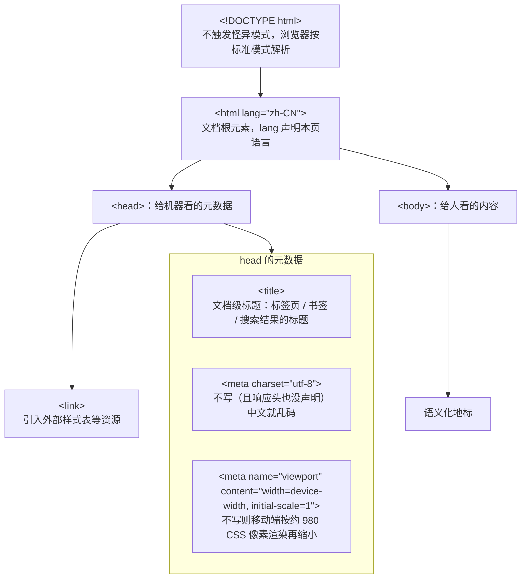
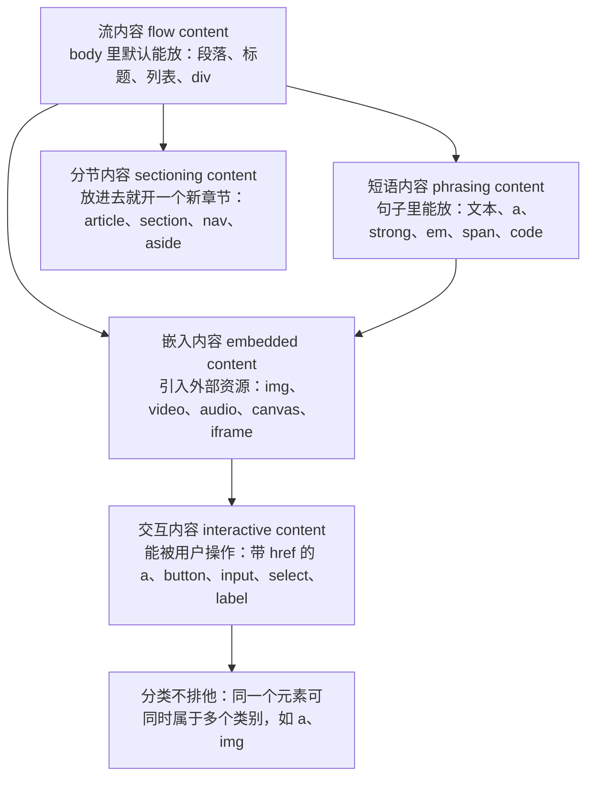
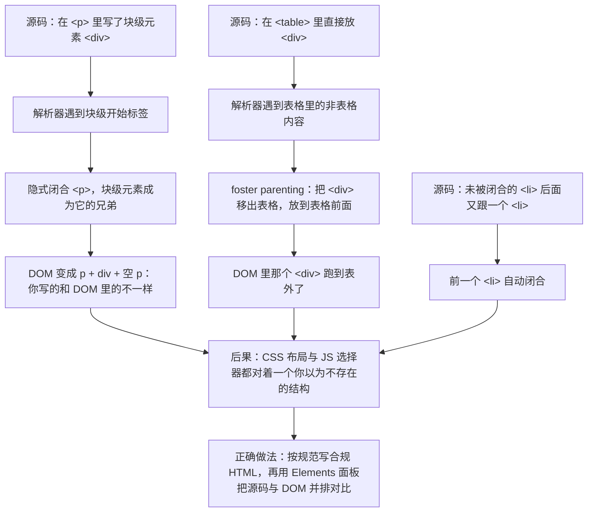

# M2 HTML 与语义化

> 一句话：本模块要解决的是「**同一份内容，浏览器、屏幕阅读器、搜索引擎、AI 抓取器都能正确读懂**」——标签选用不是审美问题，是接口契约问题。
> 对应《Web 前端技术》课程大纲模块 M2（[[00-课程大纲]]）。

> 备课口径提醒：本模块**不教新语法**（HTML 只有一种标记法），教的是**判断力**：这个内容该用哪个元素、这个属性删掉会出什么事、这段代码别人（机器或残障用户）能不能用。判断力只能靠"拆掉东西看后果"来建立，所以本模块的实验量必须压住讲授量。

## 0. 这一块是怎么来的（历史一则）

HTML 的血统是 **SGML**（一种更早的、用于描述文档结构的通用标记语言），它把「文档 = 元素 + 属性 + 内容模型」这套思路带进了万维网。后来几件事一步步把「语义化」从一个学术词变成了工程要求：

- **HTML 4 发布于 1997 年**。它的态度是「描述结构」。但当时的现实是：网页里塞满了用 `<table>` 和 `<font>` 拼版式的做法，规范说什么基本没人管。
- **XHTML 1.0 于 2000 年成为 W3C 推荐标准**。它要求网页必须是合法的 XML——标签闭合、大小写敏感、属性必须带引号，**一个错就整页解析失败**。方向很纯，代价是：现实的网页大量不合规，浏览器做不到把不合规页面全判死刑，于是浏览器继续各行其是地写容错逻辑。这是本模块 §3.7「容错解析」的历史根因。
- **WHATWG 于 2004 年由多家浏览器厂商成立**。厂商们的结论是：与其先定一个完美规范再让大家实现，不如**先看浏览器实际怎么做，再把稳定的行为写成规范**——即「Living Standard（活标准）」路线。这条路线的副产品就是：**解析器的错误恢复行为被写进了规范**，不再是浏览器的私事。
- **HTML5 于 2014-10-28 成为 W3C 推荐标准**（原文：[W3C HTML5 推荐标准（2014-10-28）](https://www.w3.org/TR/2014/REC-html5-20141028)）。这一版正式引入了现代表单控件、`<video>`/`<audio>`、`<canvas>`，以及本模块的重点——**语义化地标元素**（`header`/`nav`/`main`/`article`/`section`/`aside`/`footer`）。
- **2019 年，W3C 与 WHATWG 签署备忘录**，HTML 的权威版本归 **[WHATWG Living Standard](https://html.spec.whatwg.org/multipage/)**。

**课堂上从这个故事里要拿走的两个判断**：

1. 规范为什么"松"？因为浏览器厂商在 2004 年后赢了话语权，生存优先于纯洁。
2. 松不等于随便。**语义化之所以是硬要求，是因为它被后续一连串机器消费方依赖**——屏幕阅读器的地标导航、搜索引擎的标题提取、站点地图与结构化数据的抽取。XHTML 追求的"机器严格可读"，在 HTML5 里换了一条更现实的路实现：**结构靠语义标签约定，容错交给规范化的解析算法**。

## 1. 教学目标

学完本模块，学生应当能用**可观察、可复核**的行为证明自己掌握了下面三层目标。

| 层次 | 目标 | 可考核的行为（考核时就看这个动作能不能做出来） |
|---|---|---|
| 知识 | 说清文档骨架三件套的作用域与后果 | 能分别说明 `charset`、`viewport`、`lang` **缺失时页面会出现什么可观察的错误**，并能在开发者工具里复现其中一个 |
| 知识 | 分清内容模型的三个主类别 | 给出 6 个具体元素，能**归类**到流内容 / 短语内容 / 分节内容，并说明一个短语内容元素为什么不能直接包住一个分节内容元素 |
| 知识 | 掌握表单的原生能力和提交语义 | 能列举 5 种 `input` 类型及其自带的校验行为；能说明一个没写 `name` 的输入框为什么在提交数据里"消失" |
| 能力 | 用语义化地标写出可导航的文档 | **断开 CSS 后**，文档仍能被顺序读通，标题层级不跳级，地标元素覆盖页头/主导航/主内容/页脚 |
| 能力 | 写出可访问的图片与表格 | 为信息图/装饰图/功能按钮图分别写出正确的 `alt`；为数据表格正确关联表头，并能用屏幕阅读器或无障碍面板验证关联生效 |
| 能力 | 用工具定位结构缺陷 | 能跑一遍结构校验与无障碍检查，**读懂报错原文**，定位到具体行并修复，复跑通过 |
| 素养与工程规范 | 把语义当作提交前的检查项 | 交付前主动执行「无样式可读性检查」和「表单无障碍自查」两个清单，并把结果贴进提交说明 |
| 素养与工程规范 | 分清 SEO/结构化数据的边界 | 能说明语义化对可访问性的收益是**确定的**、对排名的收益是**间接且不可承诺的**，不把结构化数据当排名技巧推销 |

**本模块学完后应能独立完成的一件事**：拿到一份只给内容的纯文本素材（标题、正文、图片说明、一组表单字段），**不查资料**写出一份语义正确的 HTML 文档，并在断 CSS 与无障碍自查两项检查中一次性通过。

## 2. 学时分配与讲授节奏

总学时 6 学时 = 270 分钟（每学时按 45 分钟计）。讲授 180 分钟（4 学时），实验上机 90 分钟（2 学时）。

| 序 | 主题 | 讲授分钟 | 实验上机分钟 | 教学形式 |
|---|---|---|---|---|
| 1 | 文档骨架与元数据（`charset` / `viewport` / `lang`） | 25 | 0 | 讲授 + 现场复现乱码与缩放 |
| 2 | 内容模型与元素分类（流 / 短语 / 分节） | 15 | 0 | 讲授 + 卡片归位练习 |
| 3 | 语义化地标与标题层级 | 30 | 0 | 讲授 + 现场「一键拆 CSS」 |
| 4 | 链接与资源（`a` 的语义、`img` 的 `alt`、`srcset`/`sizes`） | 25 | 10 | 讲授 + 上机改图 |
| 5 | 列表与数据表格 | 15 | 10 | 讲授 + 上机改表 |
| 6 | 表单（`label` 关联、输入类型、原生校验、`fieldset`/`legend`、`name`） | 30 | 10 | 讲授 + 上机表单自查 |
| 7 | 容错解析与错误恢复规则 | 15 | 0 | 讲授 + DevTools 对比源码与 DOM |
| 8 | 文档结构验证工具与无障碍检查 | 15 | 20 | 演示 + 上机跑工具 |
| 9 | SEO 基础与结构化数据的边界 | 10 | 0 | 讲授 |
| — | 综合实验（无样式可读性 + 表单无障碍自查） | 0 | 40 | 上机，双人互评 |
| **合计** | | **180** | **90** | **总 270 分钟** |

**节奏提醒**：第 4、5、6 节的 10 分钟上机是「趁热改一下」，不是完整练习；真正动手的量在综合实验。**第 3 节讲完立刻做拆 CSS 演示**——这是整模块的"开窍时刻"，压到下次课效果减半。

## 3. 逐节讲授要点

### 3.1 文档骨架与元数据（25 分钟）

**要讲什么**：`<!DOCTYPE html>` 的作用（不触发怪异模式，让浏览器按标准模式解析）；`<head>` 里的三件套各自的作用域。要点是**讲后果，不是讲语法**：

- `charset="utf-8"`：不写（且 HTTP 响应头也没声明）时，中文按平台默认编码猜，结果就是**乱码**。注意：本地双击文件打开时更容易出问题，因为少了响应头兜底。
- `viewport`：不写时移动浏览器按约 980 CSS 像素的"桌面视口"渲染再缩小，字细到看不清、点击区域错位。写 `width=device-width, initial-scale=1` 才是真·移动视口。
- `lang`：不写时，屏幕阅读器用**默认语言的发音和断词规则**读中文，朗读错误；同时影响浏览器断词、拼写校对和翻译/朗读功能的判断。

最小骨架（**仅示形态**，10 行）：

```html
<!DOCTYPE html>
<html lang="zh-CN">
  <head>
    <meta charset="utf-8">
    <meta name="viewport" content="width=device-width, initial-scale=1">
    <title>页面标题（这个页面是什么）</title>
  </head>
  <body></body>
</html>
```



> **图 1**：文档骨架的树形结构——`head` 装给机器读的元数据，`body` 装给人读的内容。
> **看图要点**：`charset`、`viewport`、`lang` 三件套缺一个都对应一个可观察的错误，不是可选项。
> **图中各节点的完整说明**（图内为压缩写法，完整内容在此）：`head` 的四个子节点是 `<title>`（文档级标题：标签页 / 书签 / 搜索结果的标题）、`<meta charset="utf-8">`（不写，且响应头也没声明时，中文就乱码）、`<meta name="viewport" content="width=device-width, initial-scale=1">`（不写则移动端按约 980 CSS 像素渲染再缩小）、`<link>`（引入外部样式表等资源）；图中前三者收进「head 的元数据」框内显示（仅为排版拆行），`<link>` 直接挂在 `head` 下，它们都是 `head` 的子元素。`body` 下的「语义化地标」指 header / nav / main / article / section / aside / footer 这一组元素。

**必须现场的演示 / DevTools 操作**：

1. 把 `charset` 那行注释掉，刷新，中文变乱码；用 DevTools 的 Network 面板看响应头里有没有 `content-type: text/html; charset=...`（按 `F12` → Network（中文界面叫「网络」）→ 按 `F5` 刷新 → 点第一个文档请求 → 看 Response Headers），讲清"两处声明的关系"。
2. 打开设备工具栏（先按 `F12` 打开开发者工具，再按 `Ctrl+Shift+M`），对着**不加 viewport** 的页面截图，再对比加了的页面。
3. 在 Elements 面板选中 `<html>`（先按 `F12`，顶部点 Elements），看 Accessibility 面板里 lang 的影响（用 `document.documentElement.lang` 在 Console 里取一次值：按 `Ctrl+Shift+J` 打开 Console）。

**要提问学生的问题**：

- Q：`<title>` 和 `<h1>` 有什么区别？
  A：`<title>` 是**文档级**的、给浏览器标签页/书签/搜索结果标题用的；`<h1>` 是**文档内容**里的最高级标题。两者通常内容相近但不是替代关系，`<title>` 不能省。
- Q：`lang="zh-CN"` 写在 `<html>` 上，能不能写到某个 `<p>` 上？
  A：能，`lang` 是全局属性，写在局部元素上表示"这段内容用这个语言"，用于一篇中文页面里夹一段英文的情况。
- Q：把 `<meta charset>` 放到 `<head>` 的最后一行有什么风险？
  A：解析到它之前的内容已经按默认编码处理过了，可能已经在标题区域产生乱码；规范建议尽早出现。

**学生一定会犯的错**：把 `viewport` 那行写进 `<body>`；`lang` 写成 `zh_CN`（下划线，不是连字符）；`HTML` 大小写乱写；以为本地能看就不用写 `charset`。

### 3.2 内容模型与元素分类（15 分钟）

**要讲什么**：元素不是平的清单，是有**嵌套规则**的。三个主类别：

- **流内容（flow content）**：`<body>` 里默认能放的东西，段落、标题、列表、`<div>` 都是。绝大多数内容元素属于这一类。
- **短语内容（phrasing content）**：出现在**句子内部**的标记，文本、`<a>`、`<strong>`、`<em>`、`<span>`、``、`<code>`。判别法：**能不能合理地出现在一句话里**。
- **分节内容（sectioning content）**：**划定大纲层级**的元素——`<article>`、`<section>`、`<nav>`、`<aside>`。放进去就等于开了一个新章节。

关键规矩：**`<p>` 只能包含短语内容**。把 `<div>` 直接放进 `<p>` 是非法的，浏览器会替你"修正"（见 §3.7）。



> **图 2**：内容模型的几个类别之间是包含与交叠关系，不是一张平铺的元素清单。
> **看图要点**：判别某个元素属于哪一类，问的是「它能不能出现在这个位置」——例如 `<p>` 里只能放短语内容，所以块级的 `<div>` 放进去会被浏览器修正。

**必须现场的演示 / DevTools 操作**：在 Console 里（按 `Ctrl+Shift+J` 打开）对一段"`<p>` 里套 `<div>`"的页面取 `document.querySelector('p').innerHTML`，看浏览器已经把它拆成了两个 `<p>` 加一个 `<div>`——**你写的和 DOM 里的不一样**。

**要提问学生的问题**：

- Q：`<a>` 是哪一类？
  A：取决于上下文。有 `href` 时是短语内容（通常也是流内容，视父元素）；没 `href` 就是占位。判别时看它在句子里的角色。
- Q：`<section>` 和 `<div>` 都能包一堆内容，区别在哪？
  A：`<div>` 无语义，只用于没有更合适元素时；`<section>` 声明"这是一个有主题的章节"，通常应当有标题。
- Q：`` 属于什么内容？
  A：短语内容（可以出现在句子中），但因为它替换了行内文本，也会成为流内容的一部分。

**学生一定会犯的错**：把 `<div>` 当万能容器塞进 `<p>`；认为"HTML 里什么都能套"；把 `<br>` 当换段工具。

### 3.3 语义化地标与标题层级（30 分钟）

**要讲什么**：先立**唯一判据**，再讲元素清单。

> **判据（可背）：断开 CSS 后，这份文档仍然像一篇排版朴素的文章一样读得通——有层级、有导航、有主次，就是语义对了；如果变成一坨看不清结构的字，就是错了。**

地标元素清单（每个讲"谁会用它"）：

- `<header>` / `<footer>`：页头/页脚，也可用于 `<article>` 内部。
- `<nav>`：主要导航链接组。**不是每个链接组都要 `nav`**，主导航和目录才需要。
- `<main>`：**一页只能有一个**，且应与 `header`/`footer` 同级，不含全站重复的导航。
- `<article>`：**能独立分发/被订阅的内容单元**（一篇文章、一个商品卡、一条评论）。判据是"单独拎出去还成立吗"。
- `<section>`：有主题的分组，通常带标题。
- `<aside>`：与主内容相关但可独立省略的补充内容。

标题层级：`<h1>`~`<h6>` 表示**大纲层级**，不是字号。跳级（`h2` 直接跳 `h4`）会让依赖大纲的屏幕阅读器用户丢失结构。一页通常只有一个 `<h1>`，且 `<h1>` 应描述本页主题。

**必须现场的演示 / DevTools 操作**：

1. 在 Rendering 面板勾选 **Disable local CSS**（按 `F12` → `Ctrl+Shift+P` 打开命令菜单 → 输入 `Rendering` 打开该面板；或临时注释样式表），投影上展示"断样式后的页面"。让学生亲眼看到语义化版本 vs `div` 版本的差别——这是本模块最有冲击力的 3 分钟。
2. 在 Accessibility 面板看 **landmark 列表**（`F12` → Elements → 选中元素后切到 Accessibility 面板），或直接用屏幕阅读器的地标跳转快捷键走一遍（Windows 上 Narrator 可演示）。
3. 用 Elements 面板展开 outline 相关视图（`F12` → Elements → 展开 DOM 树查看标题嵌套），展示 `h1`~`h6` 的层级结构。

**要提问学生的问题**：

- Q：把 `<main>` 里的内容删掉，剩下的地标有哪些？
  A：`header`（含 `nav`）、`footer`。这说明 `<main>` 是"本页独有内容"的边界。
- Q：一个商品列表页，每个商品卡应该用 `<article>` 还是 `<div>`？
  A：如果每张卡可独立分发（有独立标题和链接），用 `<article>`；只是网格里的一格、无独立意义，用 `<div>` 更诚实。
- Q：为什么要"一页一个 `<h1>`"，多几个行不行？
  A：一句"通常一个 `<h1>`"是为了让"本页主题"唯一可识别；写多个不会报错，但会让依托大纲工具的用户和设备分不清本页主体。教学口径按"一个"要求。

**学生一定会犯的错**：为了字号选 `h` 标签（"`h4` 看起来大小合适就用 `h4`"）；把所有链接组都套 `nav`；`<main>` 写在一页里多次；`<section>` 里没有标题。

### 3.4 链接与资源（25 分钟 + 10 分钟上机）

**要讲什么**：

- **`<a>` 的语义**：它代表"**跳转到另一个资源/位置**"。有 `href` 才叫链接（可获得焦点、可被右键新标签打开、可被复制链接）。`<a href="#" onclick="...">` 是反模式——**要执行动作就用 `<button>`**。
- **可访问名**：链接文字就是它的可访问名。写"点击这里""了解更多"在屏幕阅读器链接列表里全是无意义重复；要写"查看 M2 实验指导"。
- `target="_blank"` 时应带 `rel="noopener"`。
- **`img` 的 `alt` 必填（三种写法）**：
  1. **信息图**：`alt` 写"这张图传达了什么信息"，而不是"图里有什么"。如 `alt="2024 到 2026 年移动端流量占比升至 62%"`。
  2. **装饰图**：`alt=""`（空字符串），告诉辅助技术"跳过它"。**注意 `alt=""` 和完全不写 `alt` 不是一回事**——后者会让屏幕阅读器可能去读文件名。
  3. **功能性图**（作为按钮/链接内容）：`alt` 写"这个控件做什么"，如 `alt="提交搜索"`。
- **`srcset` / `sizes`**：`srcset` 给候选图，`w` 描述符写**图片真实像素宽度**；`sizes` 描述**在不同视口宽度下这张图会占多宽**（CSS 像素），浏览器据此挑候选。两者必须配对：只写 `srcset` 不写 `sizes`，浏览器会按"占满视口"假设，选出来的图常偏大。
- `loading="lazy"`、`width`/`height`（防布局抖动）。

**必须现场的演示 / DevTools 操作**：Network 面板开设备工具栏（`F12` → Network → 按 `Ctrl+Shift+M`），按 `F5` 重载后切换屏幕宽度，观察同一张 `srcset` 图**实际下载了哪个候选**；再删掉 `sizes` 复现一次"下了个大图"。

**要提问学生的问题**：

- Q：一个"关闭弹窗"的 × 图标，用 `` 还是 `<button>`？
  A：用 `<button>` 包一个图标（或 `` 放进 `<button>`）。核心是可聚焦、可用键盘触发、有可访问名。
- Q：`alt=""` 和 `` 不写 `alt`，屏幕阅读器的行为一样吗？
  A：不一样。`alt=""` 是"明确声明装饰性，请跳过"；不写 `alt` 在一些实现里会退化成读图片文件名/URL。
- Q：只写 `srcset` 不写 `sizes` 会怎样？
  A：浏览器缺少布局宽度信息，按"图片占满视口宽度"估算，可能对窄列场景选到过大的图，浪费带宽。

**学生一定会犯的错**：`alt` 直接抄文件名（`hero-banner-1024.jpg`）；把 `alt` 当 `title` 用；`w` 描述符写成显示宽度；用 `div` 加 `onclick` 冒充链接。

### 3.5 列表与数据表格（15 分钟 + 10 分钟上机）

**要讲什么**：

- **列表**：`<ul>` 无序、`<ol>` 有序（顺序有意义时用，比如步骤）、`<dl>`/`<dt>`/`<dd>` 描述列表（术语—解释，如名词表、FAQ）。导航用 `<ul>` 包 `<li>` 包 `<a>` 是标准做法，方便屏幕阅读器播报"共 5 项，第 2 项"。
- **表格只用于数据**。排版的格子用 CSS Grid/Flex，不用 `<table>`。
- **表头关联**：`<th>` 配 `scope="col"`（列头）或 `scope="row"`（行头）。这是让屏幕阅读器在读到单元格时能报出"列：月份，行：中国"的关键。复杂表格才需要 `headers`/`id` 关联。
- `<caption>` 给表格标题——它把"这张表是什么"直接交给辅助技术，而不是靠旁边一句普通文字。
- 合并单元格 `colspan`/`rowspan` 要谨慎，越多越难关联。

**必须现场的演示 / DevTools 操作**：在本模块实验页的数据表格上，用 Accessibility 面板看某一个 `<td>` 的"计算名称/表头关联"信息；把 `<th>` 改成 `<td>` 再刷新（`F12` → Elements 选中单元格 → 切到 Accessibility 面板看「计算名称/表头关联」；改 HTML 可在 Elements 里按 `F2` 直接编辑，改完按 `F5` 刷新），观察表头关联消失。

**要提问学生的问题**：

- Q：为什么导航列表要用 `<ul>` 而不是一串 `<a>` 直接排？
  A：列表语义会让辅助技术播报"列表，5 项"，用户知道边界；一串裸链接没有数量感。
- Q：`<table>` 里第一行是"表头样式"的行，该用 `<td>` 还是 `<th>`？
  A：`<th>`。样式像不像表头不重要，重要的是它是不是表头——`<th>` 还自带表头的可访问语义。
- Q：什么时候用 `<dl>`？
  A：成对的"名称—值"关系，且不是普通文本流。比如课程信息表（学分—3）。不是所有两列内容都算。

**学生一定会犯的错**：用 `<table>` 做页面布局（"三栏对齐方便"）；表头用 `<td>` 加粗；表格没有 `<caption>`；`<ul>` 里直接放文本不放 `<li>`。

### 3.6 表单（30 分钟 + 10 分钟上机）

**要讲什么**（本节是本模块分量最重的一节，"能用的表单"和"看起来能用的表单"差别最大）：

- **`label` 关联**：两种方式——`<label for="id">` 配 `<input id="...">`，或把 `<input>` 包在 `<label>` 里。作用是：**点文字也能聚焦输入框**（鼠标命中区域变大）、屏幕阅读器能读出字段名。**`placeholder` 不是标签**：一输入就消失，且对比度常不达标，不能替代 `label`。
- **输入类型**：`type` 决定键盘布局、校验行为、语义。`email`/`url`/`tel`/`number`/`date`/`search`/`password` 各有不同行为；移动端键盘会随类型变化。
- **原生校验属性**：`required`、`minlength`/`maxlength`、`min`/`max`/`step`、`pattern`、`type` 自带格式校验。这些**免费**且对辅助技术创新友好；能用原生就用原生，别一上来手写一堆 JS 校验。
- **`fieldset` / `legend`**：把相关控件分组并给组名。单选组、地址块、支付信息都该分组——屏幕阅读器会播报"收货地址，组"。
- **`name` 与提交语义**：**只有带 `name` 的控件才会出现在提交数据里**（键就是 `name`）。这是"我的表单怎么少了一个字段"最常见的原因。`<form method>`/`action` 决定提交方式与目标；提交靠 `type="submit"` 的按钮或表单里的 `<button>`。
- `autocomplete` 帮用户自动填充；`<input type="hidden">` 传不可见值。

**必须现场的演示 / DevTools 操作**：

1. 现场手敲一个没有 `<label>` 的表单，用 Accessibility 面板看输入框的**可访问名是空的**（`F12` → Elements → 选中输入框 → 切到 Accessibility 面板看 Name）；加上 `label for/id` 后重看，名字出现。
2. 故意漏写一个输入的 `name`，用 Network 面板抓提交请求体（`F12` → Network → 勾选保留日志 → 提交表单 → 点请求 → 看请求体 / Payload），让学生看到**那个字段根本没出现**。
3. 触发一次原生校验：留空必填项点提交，观察浏览器自带的提示气泡。

**要提问学生的问题**：

- Q：`placeholder="请输入邮箱"` 能不能当标签用？
  A：不能。它是提示不是名称：输入后消失，屏幕阅读器不能稳定地把它当字段名，对比度通常也不足。`label` 必须存在。
- Q：一个输入框 UI 上明明有，提交后服务端收不到，最可能是什么原因？
  A：缺 `name`；其次是它不在 `<form>` 内，或 `disabled` 了。
- Q：三个单选框要"必须选一个"，`required` 该写在哪个上？
  A：写在同组同名控件上（或用 `fieldset` + `legend` 组织），并给组一个名称，否则用户不知道这组在问什么。

**学生一定会犯的错**：`label` 写了但 `for` 和 `id` 对不上（复制粘贴留下的错）；用 `placeholder` 顶替 `label`；一组单选按钮各自 `checked` 或 `name` 写得不一致；提交按钮用 `<div>` 加样式冒充；忘记 `fieldset`/`legend` 导致组名缺失。

### 3.7 容错解析与错误恢复（15 分钟）

**要讲什么**：

- **为什么标签没闭合也能跑**：HTML 解析器不是"遇到错就停"，而是内置一整套**错误恢复算法**，来自 **[WHATWG Living Standard](https://html.spec.whatwg.org/multipage/)** 的解析规范——也就是说，**这些"修正"行为是被规范规定的、可预测的**，不是浏览器的自由发挥。
- 典型恢复规则（讲 3 个就够）：
  1. `<p>` 里遇到 `<div>` 等块级开始标签 → **隐式闭合 `<p>`**，块级元素成为其兄弟。
  2. `<table>` 里直接放非表格内容（如 `<div>`）→ **foster parenting**：把它**移出表格**，放到表格前面。这就是"我写在表里的 div 跑到表外了"。
  3. 未闭合的 `<li>` 遇到下一个 `<li>` → 前一个自动闭合。
- **关键判断**：容错是为了**不让老网页坏掉**，不是为了让你偷懒。**依赖容错写出来的 DOM 往往和你以为的不一样**，而"你以为的结构"正是 CSS 布局和 JS 选择器的依据。



> **图 3**：三条典型的错误恢复规则——它们的产出都是规范规定、可预测的，但都不是你写下的结构。
> **看图要点**：容错是为了不让老网页坏掉；遇到「我写的元素跑位了」，先看 Elements 面板里的 DOM，不要只对着源码调 CSS。

**必须现场的演示 / DevTools 操作**：写一段"`<p>` 里塞 `<div>`"和"`<table>` 里塞 `<div>`"的页面，打开 Elements 面板（`F12` → Elements 看解析后的 DOM；源码用编辑器或地址栏 `view-source:` 打开，两边并排），**把源码和 DOM 并排截图**。这是唯一能让"浏览器会改我的代码"这件事变得可见的方法。

**要提问学生的问题**：

- Q：既然浏览器会修，为什么还要写合规的 HTML？
  A：因为它修的方式是规范规定的、可能不是你想要的（如 foster parenting 把元素移走）；而且不同消费方（非浏览器解析器、抓取器）容错能力不一定相同。
- Q：错误恢复规则是谁定的？浏览器自己随便定的吗？
  A：不是。它是 **WHATWG Living Standard** 解析算法的一部分，被规范固定下来，所以各家浏览器对同样的错误产出同样的 DOM。
- Q：`<p>这是一段<div>块</div></p>` 解析后是什么？
  A：大致是 `<p>这是一段</p><div>块</div><p></p>`——`p` 被隐式闭合。

**学生一定会犯的错**：把"浏览器能跑"当"我写对了"；用容错行为解释自己忘记闭合标签；不看 Elements 面板，只对着源码调 CSS。

### 3.8 文档结构验证工具与无障碍检查（15 分钟 + 20 分钟上机）

**要讲什么**：

- **结构校验**：用 W3C 的 **Nu Html Checker**（在线版或本地工具）把文档跑一遍，它按规范报**结构错误**（未闭合、非法嵌套、重复 id）。要教的是"**读报错原文**再定位行号"，而不是看到红字就慌。
- **格式化工具**：HTML 也可纳入 [Prettier](https://prettier.io/docs/)（本机统一用 Prettier 3.9.9）保持团队格式一致——注意**格式化不校验语义**，别把它当检查器。
- **无障碍检查**：浏览器自带审计（[Lighthouse](https://developer.chrome.com/docs/lighthouse/overview)/无障碍面板）能给出一批自动可查的问题（图片缺 `alt`、`label` 缺失、对比度、地标缺失、标题层级）。**必须讲清边界**：自动工具只能查"机器查得出的"，查不出"alt 写得对不对""标题层级合不合逻辑"这类需要人判断的问题。
- 手工检查两项（本模块实验的硬判据）：
  1. **无样式文档可读性检查**：断 CSS 后顺序读一遍。
  2. **表单无障碍自查**：逐项核对 label 关联、组名、必填、错误提示是否可达。
- **SEO 基础与结构化数据的边界（10 分钟，第 9 节并讲）**：语义化标签让**机器更好理解结构**，这是确定的；但**排名提升不可承诺**。结构化数据（如基于 Schema.org 的标注）能让搜索引擎更好地呈现结果，但它是"表达方式"，不是"排名开关"。教学口径：**做语义化是为了可访问性和可维护性，顺带对 SEO 友好；不要反向把 SEO 当动机**。

**必须现场的演示 / DevTools 操作**：现场把一份故意写错（未闭合标签、`img` 无 `alt`、`label` 无 `for`）的文件过一遍校验与审计，**投影报错原文**（浏览器审计：按 `F12` → `Ctrl+Shift+P` 命令菜单 → 输入 `Lighthouse` 打开并运行页面分析），再逐条修到全绿，让学生看到"从报错到修复"的完整闭环。

**要提问学生的问题**：

- Q：自动无障碍审计全绿，是不是就无障碍了？
  A：不是。工具只能查规则化的部分；`alt` 内容是否等效、标题层级是否合逻辑、键盘顺序是否合理，都要人判断。
- Q：语义化能提高搜索排名吗？
  A：它让机器更容易理解结构，这是确定的；排名受很多因素影响，不能承诺。教学上只讲"结构清晰对机器友好"，不讲"做了就涨排名"。
- Q：校验器报的每一个错都必须改吗？
  A：绝大多数要改；但要学会分辨"真错"（非法嵌套、重复 id）和"风格建议"。改之前先读懂它在说什么。

**学生一定会犯的错**：把格式化工具的输出当"检查通过"；看到一堆报错就整段重写而不看行号；审计全绿就宣布无障碍达标。

## 4. 关键概念讲透

### 4.1 内容模型：流内容 / 短语内容 / 分节内容

- **是什么**：元素按"能出现在哪里"分成若干类别；三个最常用的类别是流内容（body 里默认能放）、短语内容（句子里能放）、分节内容（划定大纲层级）。
- **为什么这样设计**：嵌套规则是"让机器可推导结构"的前提。机器要知道 `<p>` 里出现 `<div>` 是意外，才能替你修正；要知道 `<article>` 开了新章节，才能正确建大纲。
- **与相邻概念的边界**：内容模型 ≠ 显示效果。`<span>`（短语）和 `<div>`（流）默认都没样式，区别在**允许出现的位置**。分类也不是排他的——很多元素同时属于多个类别（如 `<a>`）。
- **最小示例（仅示形态，4 行）**：

```html
<p>正常：<strong>强调</strong>与<a href="/m2">链接</a>都是短语内容</p>
<p>非法：<div>块级不能直接放进 p</div></p>
```

- **可背的判据**：**「它能不能合理地出现在一句话中间？」能 → 短语内容；「它是 `<body>` 的候选子元素吗？」能 → 流内容；「放进去就开了一个新章节吗？」是 → 分节内容。**

### 4.2 语义化地标（landmarks）

- **是什么**：`header`/`nav`/`main`/`article`/`section`/`aside`/`footer` 等表达文档"大块结构"的元素，在无障碍树里映射为地标（landmark），可供快速跳转。
- **为什么这样设计**：屏幕阅读器用户不是"从头听到尾"，而是**按地标跳转**。地标齐全 = 一份可导航的目录。这也是历史上 XHTML 想要的"机器可读结构"的现代实现方式。
- **与相邻概念的边界**：`<section>` 必须有主题（通常有标题），`<div>` 没有语义；`<article>` 的判据是"**能独立分发**"，不是"看起来像一张卡"。`<nav>` 只给主要导航，侧栏一堆标签云不一定要 `nav`。
- **最小示例（仅示形态，7 行）**：

```html
<header><nav><ul><li><a href="/">首页</a></li></ul></nav></header>
<main>
  <h1>课程概览</h1>
  <article><h2>M2 HTML 与语义化</h2><p>正文…</p></article>
</main>
<footer><p>版权所有</p></footer>
```

- **可背的判据**：**「断开 CSS，还能一眼看出页头、导航、主体、页脚——语义就对了。」**

### 4.3 `img` 的 `alt`：三种写法

- **是什么**：`alt` 替代文本描述图片所承载的内容或功能，供图片不可见时使用（屏幕阅读器、加载失败、纯文本环境）。
- **为什么这样设计**：图片对机器是一坨像素，`alt` 是它唯一的"文字接口"。写得好，信息不丢；写不好，用户要么听不到信息，要么被噪声淹没。
- **与相邻概念的边界**：`alt=""`（装饰性，明确跳过）≠ 省略 `alt`（可能被读文件名）≠ 写文件名（对用户零信息）。`alt` 也不是图片标题——图片标题是显示出来的说明文字，不是替代文本。
- **最小示例（仅示形态，3 行）**：

```html


```

- **可背的判据**：**「把眼睛闭上，让别人替你读这页——这个位置该听到什么，`alt` 就写什么；什么都不用听到，就写 `alt=""`。」**

### 4.4 表单的两个名字：可访问名与提交名

- **是什么**：同一输入框在无障碍树里有个**可访问名**（常来自 `label`），在提交数据里有个**提交名**（来自 `name`）。两者来源不同、用途不同，**都要有**。
- **为什么这样设计**：`label` 解决"这个框是问什么的"（给人），`name` 解决"这格数据叫什么"（给服务器）。这两件事历史上被混在一起，是初学者最常踩的坑。
- **与相邻概念的边界**：`placeholder` 是提示不是名称；`id`/`for` 配对建立关联，但 `id` 不参与提交；`value` 是值，`name` 是键。
- **最小示例（仅示形态，5 行）**：

```html
<form action="/subscribe" method="post">
  <label for="email">邮箱</label>
  <input type="email" id="email" name="email" required>
  <button type="submit">订阅</button>
</form>
```

- **可背的判据**：**「`label` 决定用户（和读屏）怎么称呼这个框，`name` 决定服务器怎么叫这个值——少一个，要么听不明白，要么收不到。」**

## 5. 常见误区与诊断

| 学生症状 | 真实病根 | 课堂怎么纠正 |
|---|---|---|
| 页面结构全是 `<div class="header">`、`<div class="main">`，功能也能跑 | 把 HTML 当"给 CSS 挂钩子的容器"，只考虑样式没考虑语义 | 现场断 CSS 投影：div 版变成一坨。要求用 `header`/`nav`/`main`/`footer` 重写同一页，对比可读性 |
| 表单能填能交，但读屏时输入框只报"编辑框"没有名字 | `label` 不关联（没写 `for`/`id`，或用了 `placeholder` 顶替） | 用 Accessibility 面板展示"可访问名为空"，加 `for`/`id` 后名字出现；课堂规则：**没有 `label` 的输入框不算完成** |
| 用 `<table>` 排整页版式（两三栏布局） | 停在表格布局时代，没学过 Flex/Grid，用见过的方式凑 | 讲清"表格只用于数据"，同一布局用 CSS Grid 现场重排；实验里把 table 排版判为不合格 |
| `alt` 写成 `hero-banner-1024.jpg` 或直接抄 `src` | 把 `alt` 理解成"图片说明/文件说明"，没意识到它是给听不见图的人的信息接口 | 课堂练习：让同桌闭眼，读原始文件名给他听，问"你获得了什么信息"——答案是零。再对比等效描述 |
| 为了字号选标题：`h4` 字号正好就写 `h4`，文档里出现 `h1`→`h4` 跳级 | 把 `h` 当字号工具，把层级当视觉选择 | 立规矩：**字号归 CSS，`h` 只管层级**。断 CSS 演示跳级后大纲断裂；校验/大纲工具演示层级问题 |
| 一组单选框不给组名，用户不知道这三个选项是回答哪个问题的 | 缺 `fieldset`/`legend`，只想着"能选中就行" | 用读屏实听"单选按钮"没有上下文，加上 `fieldset`+`legend` 后播报出组名 |
| 输入框 UI 上有、提交后服务端死活收不到某一项 | 漏写 `name`；或控件在 `<form>` 之外；或 `disabled` | Network 面板抓请求体，对比前后；写成诊断口诀："收不到 → 先查 `name`，再查是否在 form 里" |
| 本地能看就以为不用写 `charset`/`viewport`，手机上字小到看不清 | 只在本机桌面浏览器验证，没做多设备检查 | 设备工具栏现场演示不加 viewport 的移动端渲染；规定实验必须过一遍移动视图 |
| `<a href="#" onclick="...">` 当按钮用，键盘和右键体验都不对 | 不理解 `a` 的语义是"导航"、`button` 的语义是"动作" | 演示右键"在新标签打开"一个假链接的结果；课堂规则：**导航用 `a`，动作一律 `button`** |
| 标签没闭合、"浏览器也能跑"，于是不检查结构 | 把容错当成合规，不看 Elements 面板 | §3.7 的源码 vs DOM 并排截图；规定提交前必须过一遍结构校验器 |

## 6. 本模块实验

三项实验，建议在 2 学时上机内完成实验一、二，实验三与综合自查同步进行。统一环境：Windows 11 + VS Code 或任意编辑器 + 本机 [Node.js](https://nodejs.org/zh-cn) **v26.7.0** / npm **11.19.0**（如需本地服务器可用 `npx vite@8.3.1`，或用 [Vite](https://vite.dev/guide/) 8.3.1 起一个静态预览：在项目目录打开终端执行）；**不要求任何框架**。若纳入团队格式统一，可选 [Prettier](https://prettier.io/docs/) **3.9.9**。

### 实验一：语义化地标重写 + 无样式文档可读性检查

- **目的**：把"用 div 堆结构"的习惯改掉，建立"语义优先"的默认动作。
- **环境**：任意编辑器 + 浏览器（Chrome/Edge/Firefox 任一，需有 Elements、Accessibility、Rendering 面板）。
- **任务描述**：
  1. 拿到的初始文件是一份"全 div"的页面（三栏布局、页头、页脚、侧栏）；
  2. 在不改变可见内容的前提下，把结构改写为语义化地标（`header`/`nav`/`main`/`article`/`section`/`aside`/`footer`）并整理标题层级；
  3. 用 Rendering 面板关闭 CSS（`F12` → `Ctrl+Shift+P` 打开命令菜单 → 输入 `Rendering` → 勾选 Disable local CSS），通读整页。
- **验收判据（可自测）**：
  - [ ] 关闭 CSS 后，从上到下能读出：页头、主导航、主内容、侧栏（若有）、页脚，且顺序与视觉顺序一致；
  - [ ] 标题层级连续，无跳级（`h1`→`h2`→`h3`，不出现 `h1`→`h4`）；
  - [ ] `<main>` 在页面中只出现一次；
  - [ ] 每处 `<section>` 都有对应的标题；
  - [ ] Accessibility 面板能列出页头/导航/主内容/页脚地标。
- **提交物**：改写后的 HTML 文件 + 关闭 CSS 后的整页截图 + 上述勾选清单（逐条写明"如何验证的"）。
- **评分要点**：语义元素选用是否恰当（占主要）；`<main>` 唯一性与地标完整性；标题层级；勾选清单是否能对应到具体证据（无证据的勾选不得分）。

### 实验二：链接、响应式图片与数据表格

- **目的**：把 `alt` 的三种写法、`srcset`/`sizes` 配对、表格表头关联从"听过"变成"写过并通过验证"。
- **环境**：同实验一；准备同一张源图的两个以上尺寸版本（可临时用任意工具导出）。
- **任务描述**：
  1. 页面里有三张图：一张承载数据的图表、一张纯装饰分隔图、一个作为链接内容的搜索图标，分别为它们写正确的 `alt`；
  2. 给图表配上 `srcset`（含 `w` 描述符）与 `sizes`，使其在宽屏取大图、窄屏取小图；
  3. 页面里有一个数据表（含行头与列头），正确使用 `<caption>`、`<th scope>`；
  4. 用 Network 面板与 Accessibility 面板各验证一次（`F12` → Network → 按 `F5` 重载看实际下载的图片；Elements 里选中单元格后切到 Accessibility 面板看表头关联）。
- **验收判据（可自测）**：
  - [ ] 三张图的 `alt` 分别是"等效信息""空字符串""功能名"，符合各自场景；
  - [ ] 切换设备宽度时，Network 面板显示的**实际下载文件**随宽度变化；
  - [ ] 删掉 `sizes` 后能观察到下载尺寸变大（说明你理解了两者配对关系，实验报告里写清这一现象）；
  - [ ] 数据表用 `<th>` 做表头并带 `scope`，`<caption>` 存在；
  - [ ] Accessibility 面板中，单元格能关联到对应的行/列表头。
- **提交物**：HTML 文件 + 两张 Network 截图（含/不含 `sizes` 的对比）+ 表格在 Accessibility 面板里的截图 + 一段不超过 150 字的说明。
- **评分要点**：三种 `alt` 场景判断是否准确（易错在把装饰图写成信息图）；`srcset`/`sizes` 是否配对且 `w` 值是否为图片真实像素宽；表格语义是否完整。

### 实验三：表单无障碍自查

- **目的**：能独立跑完一份表单的"可访问性自查"，并修到通过。
- **环境**：同实验一。
- **任务描述**：
  1. 拿到一份"看起来能用"的注册/订阅表单（含姓名、邮箱、单选组、多选、提交）；
  2. 先做一遍自查初检，把结果记在表里；
  3. 修复后复跑自查，直到通过。
- **验收判据（可自测，逐条勾选）**：
  - [ ] 每个输入控件都有**关联**的 `label`（`for`/`id` 配对或包裹），不存在只靠 `placeholder` 的字段；
  - [ ] 每个要提交的控件都有 `name`，且 `name` 无重复冲突；
  - [ ] 每个输入框的 `type` 与其数据内容匹配（邮箱 `email`、电话 `tel`、日期 `date` 等），且这些类型在提交时被实际触发过校验；
  - [ ] 单选/多选组、地址块等用 `fieldset` + `legend` 分组，读屏时能播报组名；
  - [ ] 必填项用 `required`（或等效原生约束）标注，且存在可见的必填提示（不只靠颜色）；
  - [ ] 触发一次校验失败，浏览器提供的错误提示能被看到；且错误信息有文字说明，不只靠红色边框；
  - [ ] 提交按钮使用 `<button type="submit">` 或 `<input type="submit">`，不是用 `div` 冒充；
  - [ ] 只用键盘（Tab/Shift+Tab/Enter）能完成整表填写与提交。
- **提交物**：修复前/后两份 HTML + 自查表（每条判据写"修复前的问题 + 修复动作 + 验证方式"）+ 无障碍面板截图。
- **评分要点**：自查表是否逐条给出**证据**（能复现的验证方式）而非打钩了事；`label`、`name`、分组三项为本实验核心，任一缺失不通过；用键盘完成填写与提交是硬门槛。

## 7. 本模块作业与自测题

全部题目标注格式：`[对应节] [认知层次] [难度]`。难度 ★ 基础 / ★★ 应用 / ★★★ 综合。

**1（选择题）** `[3.1] [理解] [★]`
下列哪一项**不是** `lang` 不写会造成的可观察后果？
A. 屏幕阅读器可能用非中文发音规则朗读
B. 浏览器断词、拼写校对判断错误
C. 中文字符可能显示为乱码
D. 页面可能被翻译工具误判语言
（答案要点：C。乱码主要由 `charset` 声明与编码不匹配造成，与 `lang` 无直接因果。答题要能说出各自病根。）

**2（选择题）** `[3.6] [理解] [★]`
一个 `<input type="text" id="user">` 没有 `name` 属性，提交时会发生什么？
A. 提交键名自动取 `id`
B. 该字段不出现在提交数据里
C. 表单提交被浏览器拦截
D. 提交键名自动取 `type`
（答案要点：B。`id` 不参与提交；要能顺手说出如何验证——用 Network 面板看请求体。）

**3（简答题）** `[3.7] [理解] [★★]`
既然浏览器会做错误恢复，为什么本课程仍强制要求写合规的 HTML？请至少给出两个理由，并各举一个具体的错误恢复行为作为例子。
（评分要点：①恢复行为是 WHATWG Living Standard 规定、可预测的，但**不一定是你想要的结构**（如 `<p>` 隐式闭合、`<table>` 内容的 foster parenting）；②其他消费方（非浏览器解析器、抓取器）不保证同样的容错；③DOM 与源码不一致会让 CSS/JS 调试失效。只答"为了规范"不给分，必须有具体例子。）

**4（简答题）** `[3.3] [分析] [★★]`
一段 HTML 里标题写作 `h1`→`h2`→`h4`→`h3`，且全页有 4 个 `h1`。请分别指出这两处问题会让**哪类用户**遇到什么困难，并给出修复方案。
（评分要点：跳级破坏大纲的连续性；多个 `h1` 让"本页主题"不可唯一识别；应说明受影响的是依赖标题导航的用户（屏幕阅读器用户、机器抽取方）；修复方案是把层级改为连续、并只保留一个描述本页主题的 `h1`，字号交给 CSS。）

**5（读代码题）** `[3.4] [分析] [★★]`
下面两行（题干代码，仅示形态，2 行），哪一行对屏幕阅读器用户更友好？请说明判断依据，并写出被判为"不友好"那一行的两种正确改法（分属不同场景）。

```html


```

（评分要点：第二行友好——`alt` 承载了等效信息，第一行等于把文件名读给用户，信息量为零；正确改法：若图承载数据 → 写等效信息描述；若纯装饰 → 写 `alt=""`。要能说清"信息来源不同、改法不同"。）

**6（读代码题）** `[3.5] [分析] [★★]`
一个表格用 `<td>` 加粗做表头，另有三个 `<div>` 直接放在 `<table>` 和第一个 `<tr>` 之间当"说明"。请指出两处结构问题及其后果，说明第二个问题要用什么工具观察。
（评分要点：①表头应为 `<th>` 并配 `scope`，否则单元格失去表头关联，读屏无法报出"列 X、行 Y"；②非表格内容放在表格内会被 foster parenting 移到表格外，结构被浏览器改写；观察工具：Elements 面板对比源码与 DOM。）

**7（编程题）** `[3.3 + 3.6] [应用/创造] [★★★]`
给一段纯文本素材（含标题、正文、一张图表、一个侧栏提示、一组订阅表单字段），写出完整 HTML 文档。
**不给参考实现。** 验收判据（逐条自测）：
- [ ] 关闭 CSS 后整页可顺序读通，地标齐全，`<main>` 唯一，标题层级连续；
- [ ] 图表 `alt` 为等效信息描述；纯装饰元素不产生噪声（`alt=""`）；
- [ ] 表单每个控件有 `label` 关联、有 `name`、`type` 与数据匹配，单选项有 `fieldset`/`legend`；
- [ ] 通过结构校验器（零结构错误）与浏览器无障碍审计（无自动可查问题）；
- [ ] 所有链接文字脱离上下文仍能读懂（不出现"点击这里"）。
**评分要点**：语义元素选用的恰当性（占比最高）；无障碍自查两项判据必须逐条通过；结构校验与审计结果截图；代码中不得出现 `style` 内联样式与 `<table>` 排版。

**8（编程题）** `[3.4] [应用] [★★]`
为一组图片（一张信息图表、一张装饰分隔图、一个作为链接内容的图标）写标记，要求宽屏与窄屏下载不同尺寸的图片。
**不给参考实现。** 验收判据：
- [ ] `srcset` 使用 `w` 描述符且数值等于图片真实像素宽度；
- [ ] 配有 `sizes` 描述布局占用宽度；
- [ ] 切换视口宽度时，Network 面板显示实际下载文件发生变化；
- [ ] 三张图的 `alt` 分别符合"信息 / 装饰 / 功能"三种场景。
**评分要点**：`srcset`/`sizes` 是否配对（只写其一不通过）；`w` 描述符是否写错成显示宽度；`alt` 场景判断是否准确。

**9（简答题）** `[3.8] [评价] [★★]`
"自动无障碍审计全绿"能否作为无障碍达标的证明？请说明理由，并举出至少两个自动工具查不出、必须人工判断的问题。
（评分要点：不能。工具只能覆盖可规则化的检查项；人工判断项举例——`alt` 的信息是否等效、标题层级是否合乎内容逻辑、Tab 顺序是否与视觉顺序一致、表单错误提示是否清晰。要能区分"通过审计"与"真的能用"。）

## 8. 自我检查清单（学生用）

交付前逐条勾选，**每条都要能说出你是如何验证的**；说不出验证方式的勾选视为未完成。

- [ ] 文档有 `<!DOCTYPE html>`，`<html>` 上有正确的 `lang`（如 `zh-CN`），`<head>` 里有 `charset` 与 `viewport`。
- [ ] 我实际用设备工具栏（移动视图）看过页面，字符不乱码、字不缩小到不可读。
- [ ] 页面结构使用语义化地标（`header`/`nav`/`main`/`article`/`section`/`aside`/`footer`），而不是一层层 `<div>` 堆出来。
- [ ] **无样式文档可读性检查通过**：关闭 CSS 后，整页仍能按顺序读通，页头/导航/主体/页脚可辨识。
- [ ] `<main>` 全页唯一；每个 `<section>` 都有标题。
- [ ] 标题层级连续、无跳级；字号来自 CSS，不是靠挑 `h` 标签实现的。
- [ ] 每张图片的 `alt` 都经过场景判断：信息图写等效信息、装饰图写 `alt=""`、功能图标写功能名；没有出现文件名。
- [ ] 需要响应式的图片使用了 `srcset` + `sizes`，并已在 Network 面板确认实际下载随宽度变化。
- [ ] 导航与功能控件语义正确：导航用 `<a>`，执行动作用 `<button>`；不出现 `<a href="#" onclick>` 这种假链接。
- [ ] 表格只用于展示数据；表头用 `<th>` 且带 `scope`，有 `<caption>`；没有用 `<table>` 做页面布局。
- [ ] **表单无障碍自查通过**：每个控件都有 `label` 关联、有 `name`、`type` 与数据匹配、单选/多选有 `fieldset`+`legend`。
- [ ] 只用键盘就能完成整页表单填写与提交，焦点顺序与视觉顺序一致。
- [ ] 我跑过结构校验器（如 Nu Html Checker），能读懂报错原文并已修到无结构错误。
- [ ] 我跑过浏览器无障碍审计，并明白"全绿 ≠ 无障碍达标"，人工判断项我也逐条核对过。
- [ ] 我没有用 `style` 内联样式、没有用 `<br>` 调间距、没有用标签做纯视觉效果。

## 9. 出处与依据说明

### 9.1 对应到本模块小节的出处（仅白名单链接）

| 本模块小节 | 出处 |
|---|---|
| §3.1 文档骨架与元数据；§3.2 内容模型 | [MDN 学习 Web 开发（中文）](https://developer.mozilla.org/zh-CN/docs/Learn_web_development) |
| §3.2 元素分类；§3.4 `a`/`img`/`srcset`；§3.5 列表与表格；§3.6 表单元素与属性 | [MDN HTML 元素参考](https://developer.mozilla.org/zh-CN/docs/Web/HTML/Reference/Elements) |
| §3.3 语义化地标与标题层级；§3.6 表单 `label` 关联；§3.8 无障碍检查（含表单无障碍自查） | [MDN 无障碍学习模块](https://developer.mozilla.org/zh-CN/docs/Learn_web_development/Core/Accessibility) |
| §3.4 图片与响应式图片；§3.5 数据表格；§3.6 表单与提交语义 | [web.dev Learn HTML](https://web.dev/learn/html) |
| §0 历史一则（HTML5 成为推荐标准）；§3.7 容错解析的规范来源 | [W3C HTML5 推荐标准（2014-10-28）](https://www.w3.org/TR/2014/REC-html5-20141028) |

> **表外资料**只写名称、不给链接：**Schema.org** 结构化数据词表（其官方站点不在白名单内，需要时按名称检索）。
> 另有几项常被当作「课外工具」，但它们的官方站点**已在链接白名单内**（见 [[15-实验与大作业指导]] §1.2），正文可按白名单给出链接：W3C **Nu Html Checker**（validator.w3.org）、**WHATWG HTML Living Standard**（html.spec.whatwg.org）、浏览器**内置无障碍审计面板**（开发者工具内的功能，无需外链）。

### 9.2 属教师经验的编排判断、无官方直接依据

下面这些是课程组基于教学经验做出的**编排与教学口径判断**，不是规范或标准的直接规定；学生复习时把它们当"本课程的要求"，不要当成规范条文引用：

1. **学时分配与"讲授 4 + 上机 2"的比例**——规范与教材不规定课时切分，这是按"判断力靠动手建立"设计的。
2. **"一页一个 `<h1>`"的教学口径**——规范并未硬性禁止多个 `h1`；此处按"本页主题唯一可识别"的教学简化处理，便于考核统一。
3. **"导航用 `a`、动作用 `button`"作为课堂硬规则**——这是把语义原则落成可执行的检查项，便于初学者记住。
4. **"没有 `label` 的输入框不算完成"这条验收线**——把可访问性要求前置成完成条件，属于本课程的工程规范约定。
5. **两项硬判据（无样式可读性检查、表单无障碍自查）的清单条目与勾选方式**——清单是课程组编的，用于自测与互评，不是官方检查表。
6. **把"无样式可读性"作为语义化的唯一课堂判据**——这是一种便于教学的操作化定义，语义化的完整含义比这更宽。
7. **§5 误区表的"症状—病根—纠正"对应关系与排序**——按课堂实际出现频率与纠正成本排序的经验结果。
8. **SEO 与结构化数据"只讲边界、不讲技巧"的口径**——出于不让课程变成排名技巧课的教学判断。
9. **实验的评分要点权重**（如"语义元素选用占主要"）——评分量规细节以 [[13-考核方案与评分量规]] 为准，本模块只给要点方向。
10. **版本口径引用**（本机 Node v26.7.0 / npm 11.19.0、可选 Prettier 3.9.9、可用 Vite 8.3.1 起预览服务）——取自课程版本基准，与本模块的 HTML 教学内容无因果关系，只是环境约定，详见 [[16-技术演进时间线]] 与 [[00-课程大纲#七、资料分级（权威性从高到低，课堂上必须按此顺序引用）]]。

> 相关笔记：[[13-考核方案与评分量规]]（本模块实验如何计入总评）、[[14-期末样卷与参考答案要点]]（本模块在期末卷中的题型占比）、[[15-实验与大作业指导]]（实验一「无样式文档可读性检查与表单无障碍自查」如何并入大作业的表单模块）。
