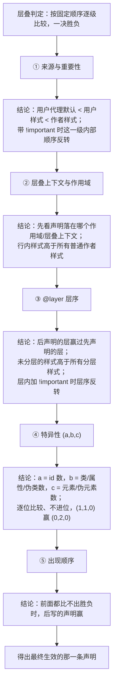
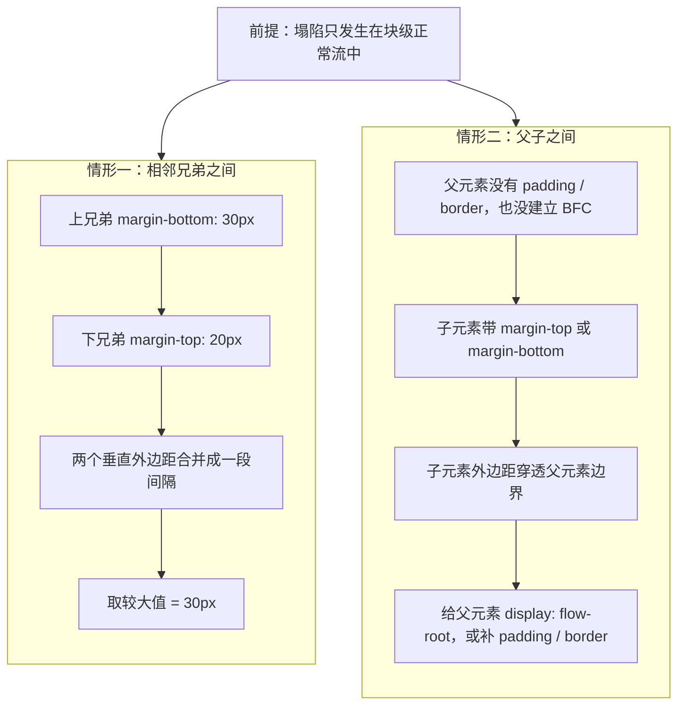
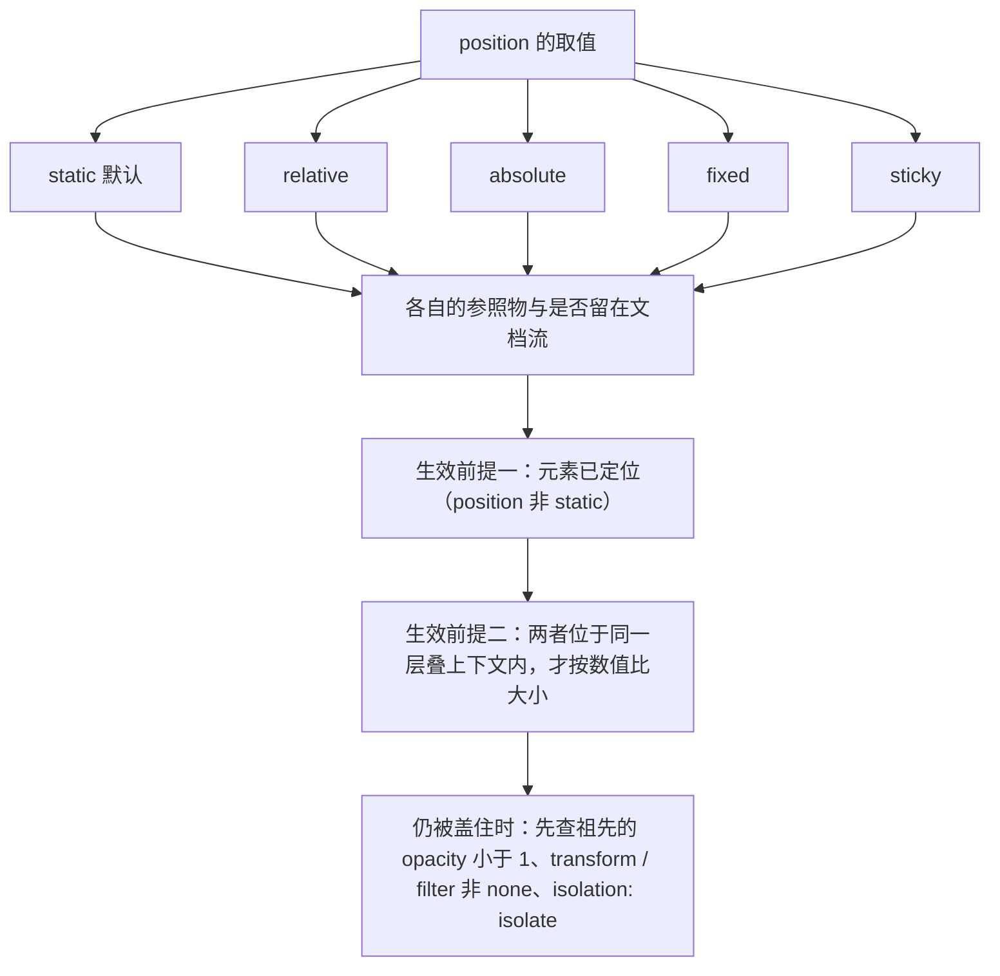

# M3 CSS 与布局

> 一句话：CSS 不是给元素刷颜色的装饰语言，而是一套决定「规则谁赢、盒子多大、二维空间怎么分」的排版系统；学不会它，页面就永远在「改了半天不生效」和「换个屏幕就散架」之间打转。
> 对应《Web 前端技术》课程大纲模块 M3（[[00-课程大纲]]）。评分口径见 [[13-考核方案与评分量规]]，实验交付与验收流程见 [[15-实验与大作业指导]]，本模块在期末的题型分布见 [[14-期末样卷与参考答案要点]]，历史脉络可对照 [[16-技术演进时间线]]。

## 0. 这一块是怎么来的（历史一则）

1996 年 CSS1 发布，1998 年 CSS2 发布。这两版是「一份大而全的规范」，想加一个新特性就得等整份规范重走一遍流程，于是推进极慢。1999 年起，CSS3 放弃「整版打包」的路子，改成**模块化推进**：把规范拆成「选择器」「盒模型」「多列」「颜色」等独立模块，各模块自己定稿、自己升级。今天你听到的 CSS Grid Layout Level 1、CSS Color Level 4，名字里的「Level」就是模块化留下的痕迹——**CSS 没有「第 3 版」这个整体版本号**，张口就说「我支持 CSS3」是外行话。

布局能力的三次跃迁，讲课拿这条线串：

- **2000 年代**：靠 `float` + `clear` + `margin` 硬凑，垂直居中得靠 `table` 或负 margin 黑魔法；
- **2010 年代初**：Flexbox 在一维（一行或一列）内布局，陆续被各浏览器实现；
- **2011 年**：CSS Grid 的完整草案由微软团队提出，并率先在 IE10 里以 `-ms-` 前缀实现；**2017 年 3 月起**，主流浏览器相继默认支持。

关于 Grid 有一件必须讲给学生的事：CSS Grid Layout Level 1 的规范状态，截至公开资料**仍标为 W3C Candidate Recommendation（候选推荐）**，而不是最终 Recommendation。也就是说浏览器全都支持了，规范自己还挂在 CR。这不是旧闻，而是「实现进度可以跑在规范定稿前面」的活标本——工程上我们按「能用、可查、有测试」来判断一项特性能不能上，而不是按规范封面上的状态。

这段历史的教学价值只有一句：**今天你嫌 Flex 和 Grid 麻烦，是因为前人替你把 20 年的弯路走完了。**

## 1. 教学目标

| 层次 | 目标（用可考核的行为动词写） | 考核方式 |
|---|---|---|
| 知识 | 能默写层叠的判定顺序；能说出盒模型的四层构成与 `box-sizing` 两种取值的差异；能列举 Flex 主轴/交叉轴属性与 Grid 轨道函数各自的用途 | 随堂小测、期末选择与简答题 |
| 能力 | 能对着设计图用 Flex 或 Grid 独立完成一个响应式页面区块；能用开发者工具在 3 分钟内定位「样式不生效」的真实原因；能读出别人页面里某元素为何盖不住另一个 | 实验一至三的验收、[[15-实验与大作业指导]] |
| 素养（工程规范） | 提交的样式表无 `!important` 滥用、无行内样式、无全局 `outline: none`；命名有规律可维护；改动后自行在键盘操作与深色模式下各检查一遍 | 实验评分量规、[[13-考核方案与评分量规]] |

**学完本模块应能独立完成的一件事**：拿到移动端 + 桌面端两版设计稿，**从零手写** HTML 结构与 CSS，做到——单一样式文件内组织清晰、卡片区不写媒体查询也能自适应换排、主流屏幕宽度下不出现横向滚动条、键盘 Tab 时焦点清晰可见。做不到的，回到第 3、4、6 节逐条对照。

## 2. 学时分配与讲授节奏

| 序 | 主题 | 讲授分钟 | 实验上机分钟 | 教学形式 |
|---|---|---|---|---|
| 1 | 层叠、优先级、继承与 @layer | 40 | 0 | 讲授 + 开发者工具现场读优先级 |
| 2 | 盒模型、box-sizing、外边距塌陷、BFC | 40 | 0 | 讲授 + 盒模型图现场标注 |
| 3 | 单位体系与自定义属性 | 35 | 0 | 讲授 + 现场换肤 |
| 4 | 选择器体系（:is / :where / :has / :nth-child） | 35 | 0 | 讲授 + 选择器实时匹配演示 |
| 5 | Flexbox 一维布局 | 45 | 0 | 讲授 + 手搓导航栏与居中 |
| 6 | Grid 二维布局 | 45 | 0 | 讲授 + 网格线可视化 |
| 7 | 定位与层叠上下文 | 35 | 0 | 讲授 + z-index 失效复现 |
| 8 | 响应式与现代特性 | 45 | 0 | 讲授 + 缩窗演示多端适配 |
| 9 | 过渡动画与性能、可访问性、调试方法 | 40 | 0 | 讲授 + 动画性能面板对比 |
| 10 | 实验一：层叠与盒模型诊断 | 0 | 45 | 上机 |
| 11 | 实验二：Flex 组件复原 | 0 | 45 | 上机 |
| 12 | 实验三：Grid 卡片墙 + 响应式与无障碍自检 | 0 | 90 | 上机（含验收演示） |
| 合计 | —— | **360** | **180** | **总计 540 分钟（12 学时 × 45 分钟）** |

节奏说明：讲授按「先规则（1~4）→ 再布局（5~7）→ 后适配（8~9）」推进。规则部分一旦含糊，后面所有布局故障都会被误诊成「浏览器 bug」。实验一紧跟第 2 节、实验二紧跟第 5 节、实验三紧跟第 6 节，趁热做。

## 3. 逐节讲授要点

### 3.1 层叠、优先级、继承与 @layer

**要讲什么**

- 层叠判定顺序（按顺序比，一决胜负）：① 来源与重要性（用户代理/用户/作者，配 `!important`）→ ② 层叠上下文与作用域 → ③ `@layer` 层序 → ④ 特异性 → ⑤ 出现顺序（后写的赢）。
- 特异性算法：用三元组 `(a,b,c)` = （id 数，类/属性/伪类数，元素/伪元素数）比较，不进位。
- 继承：可继承的（`color`、`font-*`、`line-height`、`visibility` 等）与不可继承的（`margin`、`border`、`padding`）；四个关键字 `inherit`/`initial`/`unset`/`revert` 的差别。
- `@layer`：先声明层序，后写的代码也压不过更靠前的层；**未分层的样式优先级高于所有分层样式（`!important` 反向）**。
- `!important` 在层内翻转层序：这是它唯一还能被原谅的用法。

**必须现场的演示 / 开发者工具操作**

- Styles 面板看被划掉的声明（按 `F12` 或 `Ctrl+Shift+I` 打开开发者工具 → 顶部点 Elements → 右侧 Styles 面板；按 `Ctrl+Shift+C` 可直接在页面上点选元素），点开右侧链接定位到「谁赢的」。
- Computed 面板看最终生效值（Elements 面板里 Styles 旁边的 Computed 标签），并展开它是从哪条规则继承/计算来的。
- 在 Styles 面板切换「显示层叠层 / 层」视图（Styles 面板里跟 `@layer` 相关的开关），让学生亲眼看分层后的排序。

**要提问学生的问题（含期望答案）**

1. `.a .b` 和 `#x .b` 谁赢？——期望：`#x .b`，特异性 `(1,1,0)` 大于 `(0,2,0)`，id 一票顶十个类。
2. 给 `.card` 写 `color: red` 改不动，先查什么？——期望：先在面板看有没有更高特异性、更靠后的声明、`@layer` 或 `!important` 压制，而不是急着再加一条。
3. 为什么写在 `@layer` 里的样式反而输给了没分层的样式？——期望：未分层样式的优先级高于所有分层样式，分层设计的就是让「默认/库样式」可被业务样式覆盖。

**学生一定会犯的错**

- 用 `!important` 救火，越救越乱。
- 以为「后写的一定赢」，忽略特异性。
- 给 `body` 设 `font-size: 14px`，子元素用 `rem` 时对不上自己心里的数。
- 把 `@layer` 当加载顺序，以为先声明先赢。



> **图 1**：层叠的五级判定流程——① 来源与重要性 → ② 层叠上下文与作用域 → ③ @layer 层序 → ④ 特异性 → ⑤ 出现顺序，逐级比较、一决胜负。看图要点：越靠前的判据越硬，特异性只在**同一层内**才轮到它出场；未分层样式高于所有分层样式，层内加 `!important` 时层序反转。

### 3.2 盒模型、box-sizing、外边距塌陷与 BFC

**要讲什么**

- 四层：content → padding → border → margin；`content-box`（默认）与 `border-box` 的宽度计算差异。
- 全局 reset 一行，讲清它为什么是「第一课第一条」。
- 外边距塌陷：相邻兄弟的垂直 margin 合并取**较大值**；父子之间首个/末个子元素的 margin 会「溢出」到父元素外。
- BFC（块级格式化上下文）：**先给白话**——它相当于给一块区域划出「**独立的小世界**」：里面的布局怎么折腾都不影响外面，外面的也不渗进来。形成条件（`display: flow-root`、`overflow` 非 visible、`float`、`position` 非 static 且无固定高度等），用它阻断塌陷、清除浮动。
- 百分比高度与 `height: auto` 的坑：父无确定高度时子百分比高度失效。

**必须现场的演示 / 开发者工具操作**

- 悬停盒模型图，看 padding / margin 高亮（Elements → Styles 面板底部的盒模型示意图）；打开 Calculated 视图核对实际占地（同面板的 Computed 标签）。
- 给父元素加一行 `display: flow-root`（在 Elements → Styles 里直接加，页面实时更新），让学生看父与子之间的塌陷当场消失。

**要提问学生的问题（含期望答案）**

1. 设 `width: 200px; padding: 20px; border: 1px`，实际占多宽？——期望：`content-box` 下 `200+40+2 = 242px`；`border-box` 下就是 `200px`。
2. 上下两个 div 分别是 `margin-bottom: 30px` 和 `margin-top: 20px`，间距多少？——期望：`30px`，取大值不是相加。
3. 子元素的 `margin-top` 跑到父元素外面了怎么办？——期望：让父形成 BFC（如 `display: flow-root`），或改用父的 `padding`。

**学生一定会犯的错**

- 忘了全局 `box-sizing: border-box`，后面所有尺寸都对不上。
- 用负 margin 硬凑，越凑越乱。
- 为了清塌陷随手 `overflow: hidden`，结果把需要溢出的下拉/提示层也裁掉了。


> **图 2**：盒模型的四层结构，由内到外是 content / padding / border / margin。看图要点：`width` 默认只算 content（`content-box`）；改成 `border-box` 后算到 border 外沿，padding 与 border 从里面扣——写死尺寸前先确认用的是哪种口径。


> **图 3**：外边距塌陷的两种情形——相邻兄弟之间两个垂直外边距合并为一段间隔，取**较大值**（30px 而非 30+20=50px）；父子之间子元素的外边距会「溢出」到父元素之外。看图要点：两种塌陷都只发生在块级正常流里，给父元素写 `display: flow-root` 建立 BFC、或补上 padding / border 即可阻断。

### 3.3 单位体系与自定义属性

**要讲什么**

- 绝对 `px`；相对 `rem`（参照根元素字号）、`em`（参照当前元素或父级字体大小）、`%`、`vw`/`vh`、`ch`。
- 约定：**尺寸和间距用 rem，组件内部需要随自身字号缩放时用 em**。
- 自定义属性（CSS 变量）：定义在哪个作用域就只在哪个作用域及后代可用；`var(--x, 回退值)`；`@property` 做类型化的意义（定性讲，不写完整代码）。
- `clamp(最小值, 首选值, 最大值)` 做流式字号与间距。

**必须现场的演示 / 开发者工具操作**

- 改 `:root` 上一条 `--brand` 变量（Elements → Styles 里找到 `:root` 规则后直接改颜色值），让整页按钮、链接、边框同时变色。
- 调 `html { font-size }`（在 Elements → Styles 里改，页面实时联动），让学生看所有用 rem 的尺寸成比例联动。

**要提问学生的问题（含期望答案）**

1. `rem` 和 `em` 各参照谁？——期望：`rem` 参照根元素，`em` 参照当前元素（涉及自身 `font-size` 时）或其父级。
2. 为什么全站字号和间距优先用 rem？——期望：能跟随用户在浏览器里放大的默认字号，兼顾可读性与无障碍。
3. `var()` 取不到值怎么办？——期望：写第二个参数给回退值，如 `var(--x, #333)`。

**学生一定会犯的错**

- 全站字号用 px，用户放大字号时页面不跟随。
- 变量定义在某个组件内部，却想在全局引用。
- 不清楚百分比高度参照谁，遇到父无高度时想不明白。

### 3.4 选择器体系

**要讲什么**

- 基础选择器、属性选择器、伪类与伪元素（`::before`/`::after`）。
- `:is()` 的特异性取参数中最高的那个；`:where()` 的特异性恒为 0，用来写「好被覆盖」的默认样式。
- `:has()`：能根据后代状态选中祖先，是迟迟才来的「父选择器」；代价是匹配复杂、动态场景下开销高。
- `:nth-child(An+B)` 的写法与语义（按**兄弟中位置**计数）。

**必须现场的演示 / 开发者工具操作**

- 在 Elements 里输入 `:has()` 选择器观察命中（`F12` → Elements → 用面板里的搜索框输入选择器，看命中的节点），对比「用 JS 加类」的旧写法。
- 写一个 `:where()` 版本的默认按钮样式，再用普通类覆盖它，展示特异性为 0 的好处。

**要提问学生的问题（含期望答案）**

1. `:is()` 和 `:where()` 特异性差在哪？——期望：`:is()` 取参数中最高特异性，`:where()` 恒为 0。
2. `:has()` 为什么叫父选择器，代价是什么？——期望：能由后代反选祖先；匹配成本高，别在大范围、频繁变动的列表里滥用。
3. `:nth-child(2n+1)` 选什么？——期望：兄弟中第 1、3、5… 个（注意是同类位置的一种，不要与 `:nth-of-type` 混）。

**学生一定会犯的错**

- 用 id 选择器写样式，后期无法覆盖。
- 把 `:nth-of-type` 与 `:nth-child` 混用，数错元素。
- 以为 `:has()` 能顺着 DOM 任意向上匹配到任意深度。

### 3.5 Flexbox 一维布局

**要讲什么**

- 主轴与交叉轴；`flex-direction` 改变的正是哪条轴是主轴。
- 容器属性：`justify-content`（主轴）、`align-items`（交叉轴）、`gap`、`flex-wrap`。
- 子项属性：`flex: 1` 展开是 `flex-grow:1; flex-shrink:1; flex-basis:0%`；`flex-basis: auto` 与 `0` 的差异；`align-self`、`order`。
- 用 Flex 做导航栏、按钮组、水平垂直居中。

**必须现场的演示 / 开发者工具操作**

- 在 Styles 面板展开 `flex` 的简写（Elements → Styles，点 `flex` 声明左侧的小箭头展开），让学生看到它其实是三个属性。
- 用面板里的 flex 徽章（元素是 flex 容器时，Styles 里 `display: flex` 旁会出现徽章），悬停看每个子项的 grow/shrink/basis 值。

**要提问学生的问题（含期望答案）**

1. `flex: 1` 展开是什么？——期望：`flex-grow:1; flex-shrink:1; flex-basis:0%`。
2. 子项明明写了 `width`，为什么还会被压缩？——期望：`flex-shrink` 默认是 1，空间不够时会收缩。
3. `justify-content` 和 `align-items` 分别管哪条轴？——期望：前者主轴，后者交叉轴。

**学生一定会犯的错**

- 用 margin 挤间距，最后一列总是多出一块。
- 把 Flex 当二维网格用，套了三层 flex。
- 写了 `flex: 1` 又惊讶它收缩成很小。
- 在 Flex 子项上找 `align-items`（它是容器属性）。


> **图 4**：Flex 的主轴（`justify-content`）与交叉轴（`align-items`）。看图要点：主轴方向由 `flex-direction` 决定，改成 `column` 后两根轴互换；`flex: 1` 展开是 `flex-grow:1; flex-shrink:1; flex-basis:0%`，所以「三个 `flex:1` 等宽」是剩余空间等分的结果，不是平均分配。

### 3.6 Grid 二维布局

**要讲什么**

- `display: grid`、`grid-template-columns`/`-rows`、`fr` 单位、`repeat()`、`minmax()`。
- `auto-fit` 与 `auto-fill` 的关键区别：`auto-fit` 会折叠空轨道让项目拉伸铺满，`auto-fill` 保留空轨道。
- `gap`、隐式轨道 `grid-auto-rows`、命名区域 `grid-template-areas` + `grid-area`。
- 对齐：容器上的 `justify-content`/`align-content`（整体轨道）与 `justify-items`/`align-items`（格内项目）别混。

**必须现场的演示 / 开发者工具操作**

- 一行 `repeat(auto-fit, minmax(240px, 1fr))` 做卡片墙，缩放窗口看列数自动变化。
- 打开 Styles 面板里的 grid 徽章（`F12` → Elements → Styles，`display: grid` 旁），把网格线、轨道编号可视化，讲「画格子、摆东西」。

**要提问学生的问题（含期望答案）**

1. `auto-fit` 与 `auto-fill` 差在哪？——期望：`auto-fit` 把空轨道折叠，项目被拉伸铺满；`auto-fill` 保留空轨道，项目保持原宽。
2. `fr` 是什么单位？——期望：剩余空间按比例分配的弹性单位。
3. `grid-template-areas` 用来做什么？——期望：用命名的区域名把整页布局「画」出来，可读性最好。

**学生一定会犯的错**

- 只有一行内容也上 Grid，杀鸡用牛刀（该用 Flex）。
- 忘了 `gap`，又回去用 margin 挤。
- 混用 `auto-fit`/`auto-fill`，效果不符预期。
- 给 grid 项目不定位置，却惊讶它按文档流自动落格。


> **图 5**：Grid 的网格线从 1 开始编号，轨道是两条线之间的区域。看图要点：`grid-column: 1 / span 2` 是「从第 1 条线起跨 2 个轨道」；`gap` 属于轨道之间、不占轨道；区域命名法与线号法别混着数格子。

### 3.7 定位与层叠上下文

**要讲什么**

- 五种 `position`：`static`（默认）/ `relative`（相对自身偏移，常作定位参照）/ `absolute`（参照最近一个「已定位」祖先）/ `fixed`（相对视口，滚动不动）/ `sticky`（滚到阈值粘住）。
- `absolute` 的参照物是「最近的已定位祖先」，找不到就退回初始包含块。
- 层叠上下文：创建条件包括根元素、`position` 非 static 且有 `z-index`、`opacity` 小于 1、`transform`/`filter`/`will-change` 非 none、`isolation: isolate`、`contain` 等。
- **只有同一层叠上下文内的元素才按 `z-index` 比较数值**——这是 z-index 失效的根本原因。

**必须现场的演示 / 开发者工具操作**

- 复现 `z-index: 9999` 不生效：给其中一个的父元素加 `opacity: .99` 或 `transform`（在 Elements → Styles 里直接加，页面实时更新），制造新上下文，子元素数值再大也盖不过另一个上下文里的兄弟。
- 在 Elements 里逐层往上找（从该元素沿 DOM 树向上点选，看 Styles / Computed 里的 `transform`、`opacity`、`filter`），找出是哪条属性创建了上下文。

**要提问学生的问题（含期望答案）**

1. `absolute` 元素为什么没贴着预期的祖先？——期望：那个祖先的 `position` 是默认的 static，不算「已定位」。
2. `z-index` 写 9999 还不生效，先查什么？——期望：查它和要盖住的对象是否在同一层叠上下文里。
3. `sticky` 不生效的常见原因？——期望：父链上有 `overflow` 非 visible 的祖先，或根本没有可滚动容器。

**学生一定会犯的错**

- 只把 `z-index` 往上加，不加不动就继续加。
- 父级加了 `transform` 后，子元素的 `fixed` 变成相对父级定位，还以为是浏览器坏了。



> **图 6**：五种 `position` 各自的包含块与定位参照，以及 `z-index` 生效的两个前提。**static** 留在文档流、不参与定位参照；**relative** 相对自身偏移、仍占原空间；**absolute** 参照最近的已定位祖先（找不到则退回初始包含块）；**fixed** 参照视口；**sticky** 滚到阈值粘住（父链上有 `overflow` 非 visible 的祖先会失效）。看图要点：`z-index` 只对已定位（`position` 非 static）的元素有意义，而且**只有位于同一层叠上下文内的元素才按 `z-index` 数值比大小**——写 `z-index: 9999` 仍被盖住时，先查祖先是否用 `opacity`、`transform`、`filter`、`isolation` 悄悄建了另一个层叠上下文。

### 3.8 响应式与现代特性

**要讲什么**

- `<meta name="viewport" content="width=device-width, initial-scale=1">` 是移动适配的前提。
- 媒体查询 + **移动优先**：默认样式写给窄屏，再用 `min-width` 往上叠加。
- 容器查询：给容器 `container-type: inline-size`，让组件按**自身容器宽度**换排，而不是按视口。
- `aspect-ratio` 固定宽高比；`clamp()` 流式字号；`color-scheme` 声明配色方案让内置控件跟随深浅色；`prefers-color-scheme` 跟随系统；原生嵌套（可读性便利，非必需）。

**必须现场的演示 / 开发者工具操作**

- 拖窄/拉宽窗口，展示断点处布局如何变化；用设备模式切换手机/平板（按 `F12` 打开开发者工具后按 `Ctrl+Shift+M`）。
- 给卡片容器设 `container-type: inline-size`，在**同一视口**下让侧栏内的卡片按容器宽度换排，展示容器查询跟媒体查询的区别。

**要提问学生的问题（含期望答案）**

1. 移动优先为什么用 `min-width` 而不是 `max-width`？——期望：默认样式就是窄屏，媒体查询只做「往上加」的叠加，覆盖链更短、更好维护。
2. `clamp()` 的三个参数是什么？——期望：最小值、首选值、最大值。
3. `color-scheme` 做什么？——期望：声明页面支持的颜色方案，让滚动条、表单控件等内置 UI 跟随深浅色，避免自绘样式突兀。

**学生一定会犯的错**

- 桌面优先，写一堆 `max-width` 断点，越改越乱。
- 按具体设备型号设断点，新机型一出就失效。
- 深色模式只改了自己画的颜色，忘了声明 `color-scheme`，表单控件还是亮的。

### 3.9 过渡动画与性能、可访问性、调试方法

**要讲什么**

- `transition` / `animation` 的基本用法。
- 为什么动画优先动 `transform` 和 `opacity`：它们可以只走**合成**阶段，不触发 Layout（重排）与 Paint（重绘）；动 `left`/`top`/`width` 会让浏览器每一步都重新算布局。
- `will-change` 是提示不是银弹，滥用会浪费内存。
- `prefers-reduced-motion`：尊重系统里「减少动态效果」的设置，避免部分用户前庭不适。
- 可访问性硬线：正文文本对比度不小于 **4.5:1**，大字号不小于 3:1；焦点必须可见，**不要移除 outline**。
- 调试方法：Styles 面板读优先级与盒模型；Performance 面板录一段动画，比对有没有 Layout 栏。

**必须现场的演示 / 开发者工具操作**

- 录两段动画：一段动 `left`，一段动 `transform`，在 Performance 面板里对比帧里出现了什么工作（`F12` → Performance → 点左上角录制圆点开始，操作页面后停止，看主线程帧里有没有 Layout 区块）。
- 只用键盘 Tab 走一遍有 `outline: none` 的页面，让学生看到「焦点在哪看不出来」。

**要提问学生的问题（含期望答案）**

1. 动 `left` 和动 `transform` 的差别？——期望：前者触发 Layout（重排），后者可以只走合成，性能更好。
2. 为什么不能随手 `outline: none`？——期望：键盘用户会失去焦点指示，根本不知道当前操作在哪。
3. `prefers-reduced-motion` 的用途？——期望：尊重用户的减少动效偏好，降低不适与眩晕风险。

**学生一定会犯的错**

- `outline: none` 图「界面干净」。
- 用低对比度的浅灰字，自己屏幕看着还行，投影仪/阳光下读不清。
- 所有元素一律 `transition: all`，把不需要的过渡全带上。

## 4. 关键概念讲透

### 4.1 层叠与层叠层（Cascade & Cascade Layers）

- **是什么**：一套按固定顺序比较所有冲突声明的规则。顺序是来源与重要性 → 上下文 → `@layer` 层序 → 特异性 → 出现顺序，逐级比，一决胜负就不再往下看。
- **为什么这样设计**：让「浏览器默认样式 / 第三方库 / 业务样式 / 用户自定义」能按层排队，不再靠 `!important` 军备竞赛。
- **与相邻概念的边界**：特异性只在**同一层内**参与比较；行内样式高于所有普通作者样式；`@layer` 里加 `!important` 时层序会**反转**。
- **最小示例（仅示形态，不是答案）**：

```css
@layer reset, base, components;      /* 先声明层的先后 */
@layer base       { .btn { color: #333; } }
@layer components { .btn { color: #2563eb; } }  /* 特异性相同，靠层序取胜 */
```

- **一句可背下来的判据**：同层比特异性、特异性相同比先后；跨层只看层的先后。

### 4.2 盒模型与 BFC

- **是什么**：元素由 content → padding → border → margin 四层构成；BFC 是一块独立的布局作用域，内外互不干扰。
- **为什么这样设计**：`border-box` 让「设的宽度」等于「看到的宽度」，与设计稿的心智一致；BFC 给「隔离」提供了标准手段。
- **与相邻概念的边界**：外边距塌陷只发生在块级正常流里，Flex/Grid 的子项不塌陷；父子塌陷可用父元素的 padding/border 或建立 BFC 阻断。
- **最小示例（仅示形态）**：

```css
*, *::before, *::after { box-sizing: border-box; } /* 全局第一行 */
.panel { display: flow-root; }                      /* 显式建立 BFC，阻断父子塌陷 */
```

- **一句可背下来的判据**：宽度算不对先查 `box-sizing`；间距莫名合并先想外边距塌陷。

### 4.3 一维 Flex 与二维 Grid 的边界

- **是什么**：Flex 在一个维度里分配与对齐（一行**或**一列）；Grid 同时在两个维度里划轨道、摆项目（行**和**列）。
- **为什么分成两套**：一维问题用一维模型表达最简；拿 Flex 硬凑二维会陷入层层嵌套。
- **与相邻概念的边界**：两者可以互相嵌套，但别用 Flex 硬撑二维、也别给只有一行内容的地方上 Grid；边界不在「能不能」，在「哪种表达更短更好懂」。
- **最小示例（仅示形态）**：

```css
.nav  { display: flex; gap: .5rem; }              /* 一行内怎么分 → Flex */
.wall { display: grid; gap: 1rem;                 /* 行列怎么摆 → Grid */
        grid-template-columns: repeat(auto-fit, minmax(240px, 1fr)); }
```

- **一句可背下来的判据**：问自己「要控的是行内分布还是行列定位」——前者 Flex，后者 Grid。

### 4.4 层叠上下文（Stacking Context）

- **是什么**：一个独立的比较作用域，**只有同一上下文内的元素才按 `z-index` 比大小**。
- **为什么这样设计**：隔离。组件内部的层级不应该污染全局，否则每加一个组件都要重算整站层级。
- **与相邻概念的边界**：创建上下文的条件很多（`position` + `z-index`、`opacity < 1`、`transform`/`filter`/`will-change` 非 none、`isolation: isolate` 等），常常是被无意触发的。
- **最小示例（仅示形态）**：

```css
.card { transform: translateZ(0); } /* 顺手一个 transform，就造出了新上下文 */
/* 此后 .card 里的子元素 z-index 再高，也压不过 .card 外另一个上下文里的元素 */
```

- **一句可背下来的判据**：先确认两者在不在同一层叠上下文，再谈 `z-index` 数值大小。


> **图 7**：两个各自成层的父元素，子元素的 `z-index` 只在所属层内比较。看图要点：`z-index` 不是全局比数值——先比父级所在层叠上下文的先后，层内再比 `z-index`；`opacity` 小于 1、`transform` / `filter` 非 none 都会新建层叠上下文。

## 5. 常见误区与诊断

| 学生症状 | 真实病根 | 课堂怎么纠正 |
|---|---|---|
| 设了 `width: 200px`，实际占宽却是 240px 以上 | 没设全局 `box-sizing: border-box`，仍是默认的 content-box | 现场给盒子加 padding，让学生看它「变胖」；要求样式表第一行必须是那条全局 reset |
| 用 margin 挤间距，最后一列总多出一块 | 没改用 `gap` | 改写成 flex 或 grid 并用 `gap`，删掉兄弟选择器上的 margin，前后对比截图 |
| 把 Flex 当二维布局用，套了三层 flex | 没分清一维与二维的边界 | 让同一效果改用 Grid 重写，比较两版代码行数与可读性 |
| `z-index: 9999` 还是盖不住 | 两者不在同一层叠上下文（祖先有 transform 或 opacity < 1 等） | 在 Elements 里逐层找创建上下文的属性，现场删掉后复现「盖住了」 |
| 为了字号大小把 h1~h6 层层套用 | 把标题标签当字号工具 | 强调标题表达的是文档大纲层级；字号由 CSS 控制，语义错会让屏幕阅读器和目录结构混乱 |
| 为了界面干净写了 `outline: none` | 移除了焦点可见性 | 只用键盘 Tab 走一遍页面，让学生亲身体会「不知道焦点在哪」；改用 `:focus-visible` 自定义而非删除 |
| 样式改不动，反复追加 `!important` | 被更高特异性、`@layer` 或行内样式压制，没查真因 | 先看 Styles 面板上是谁划的删除线，再谈改法；把 `!important` 当最后手段并说明代价 |
| hover 弹出的浮层被裁掉一半 | 某个祖先元素有 `overflow: hidden` | 把浮层改为 `fixed` 定位或提升到裁剪容器之外，讲清裁剪与定位的关系 |
| 移动端出现横向滚动条 | 固定宽度或漏设 `box-sizing`，内容溢出 | 用 `max-width: 100%` 配合 border-box；在设备模式里找出溢出的那个元素 |
| 深色模式下表单控件、滚动条格格不入 | 没声明 `color-scheme` | 加上 `color-scheme: light dark`，让浏览器内置控件跟随系统深浅色 |

## 6. 本模块实验

### 实验一 · 层叠与盒模型诊断（45 分钟）

- **目的**：把「样式不生效」从玄学变成可复现的诊断流程；建立 `box-sizing` 与塌陷的直觉。
- **环境**：本机 [Node.js](https://nodejs.org/zh-cn) v26.7.0 + npm 11.19.0；VS Code；Chrome/Edge 的开发者工具（按 `F12` 或 `Ctrl+Shift+I` 打开）；一个静态 HTML 文件即可（本实验不需要构建工具）。
- **任务描述**：教师提供一个**故意写坏**的页面（内含高特异性覆盖、`@layer` 顺序错误、漏设全局 `box-sizing`、父子外边距塌陷、被 `overflow: hidden` 裁掉的浮层等 5~6 处问题）。学生逐处定位、写出「病根—依据—改法」的诊断记录，并实际修复。
- **验收判据（可自测）**：诊断记录里每一处都写明了它被哪条规则/哪个属性压住（能指出面板上的位置）；修复后再打开页面，目标效果与题面一致；样式表里没有新增 `!important`；全局 reset 一行存在。
- **提交物**：`diagnose.md`（含每处的病根与依据）+ 修复后的 `index.html` 与 `style.css`。
- **评分要点**：定位准确性（能否说出真因而非症状）占 50%，修复是否最小改动占 30%，记录的规范性（术语用对、无 `!important` 救火）占 20%。

### 实验二 · Flex 组件复原（45 分钟）

- **目的**：掌握主轴/交叉轴思维与 `flex` 简写；把「用 margin 挤间距」的习惯换成 `gap`。
- **环境**：同实验一；提供的设计稿为一张导航栏 + 一行工具栏 + 一个垂直水平居中的按钮组。
- **任务描述**：只用 Flexbox 复原给定组件在三档窗口宽度下的排布，禁用 `!important`，禁用行内样式，间距一律用 `gap`。
- **验收判据（可自测）**：三个组件在 375 / 768 / 1280 三档宽度下排布均与设计稿一致；样式表中 grep 不到兄弟选择器上用于挤间距的 margin（在编辑器里全局搜索，如 VS Code 按 `Ctrl+Shift+F` 搜 `margin`；或在项目目录打开终端用 grep）；`flex` 简写不作玄学使用（能说清它的三个子属性各是多少）；导航项增减数量时布局不破。
- **提交物**：`flex-lab/index.html` + `flex-lab/style.css` + 一段 3~5 行的说明，写出你用到的每个 Flex 属性负责哪条轴。
- **评分要点**：功能与视觉还原占 60%，属性选用的正确性（主轴/交叉轴是否用对）占 25%，间距方案（用 gap 而非 margin）占 15%。

### 实验三 · Grid 卡片墙 + 响应式与无障碍自检（90 分钟，含验收演示）

- **目的**：用二维思维搭一个自适应且无障碍达标的页面区块，并养成自查习惯。
- **环境**：同前；页面需包含一个卡片区、一个两栏内容区（用 `grid-template-areas` 描述）与一个页脚。
- **任务描述**：

  1. 用 Grid 完成整页骨架，用 `grid-template-areas` 命名主内容、侧栏、页脚；
  2. 卡片墙用**一行** `grid-template-columns: repeat(auto-fit, minmax(240px, 1fr))` 实现自适应；
  3. 补齐响应式与深色模式（`prefers-color-scheme` + `color-scheme`）；
  4. 做无障碍自查：文本对比度 4.5:1、保留可见焦点、动画尊重 `prefers-reduced-motion`（对比度：`F12` → Elements 选中文本，Styles 里的颜色值会给出对比度数值；或跑 [Lighthouse](https://developer.chrome.com/docs/lighthouse/overview)）。

- **验收判据（可自测）**：

  - **卡片墙的 CSS 里完全不出现任何媒体查询（`@media`）与容器查询，仅靠那一行 `repeat(minmax)` 完成从 1 列到多列的自动换排**——这是本实验的硬指标，用搜索关键字 `@media` 应搜不到作用于卡片墙的规则（在 VS Code 里按 `Ctrl+Shift+F` 搜 `@media` 自查）；
  - 页面在浏览器窗口从窄到宽连续缩放时，卡片列数平滑变化，无横向滚动条；
  - 键盘只用 Tab 能走完全部可交互元素，每一步焦点都清晰可见；
  - 深色模式下所有自绘颜色与内置控件配色一致；
  - 正文文本对比度经工具检测不低于 4.5:1。

- **提交物**：`grid-lab/` 目录（HTML + CSS）+ `a11y-check.md`（列出你检查对比度、焦点、动效的具体做法与结论）。
- **评分要点**：卡片墙是否**零媒体查询**达标（一票否决项）占 30%；整页 Grid 骨架的清晰度（区域命名是否可读）占 25%；响应式与深浅色一致性占 25%；无障碍自查的完整与真实占 20%。

## 7. 本模块作业与自测题

**题 1〔对应 3.1〕〔理解〕〔难度 ★★〕** 判断并说明理由：一段代码先写了 `@layer` 内部的 `.btn { color }`，后写了未分层的同类选择器 `.btn { color }`，最终生效的是哪一个？
（期望：未分层的赢——未分层样式优先级高于所有分层样式。）

**题 2〔对应 3.1/4.1〕〔应用〕〔难度 ★★〕** 给出三条互相冲突的声明（一条含 id、一条含两个类、一条用 `!important`），要求按层叠顺序排出胜负并写出比较链条。

**题 3〔对应 3.2〕〔理解〕〔难度 ★〕** 写出把盒子设为 `border-box` 后，`width: 200px; padding: 20px; border: 1px` 的元素内容区实际宽度是多少，并解释为什么。

**题 4〔对应 3.2〕〔分析〕〔难度 ★★〕** 读代码：两个相邻块各有 `margin-bottom: 30px`、`margin-top: 40px`，问间距是多少；再问若把父元素改为 `display: flow-root` 会改变什么。

**题 5〔对应 3.3〕〔应用〕〔难度 ★★〕** 用一条 `clamp()` 写出一段在窄屏不小于 16px、宽屏不超过 24px、中间随视口变化的字号规则，并说明三个参数各自的含义。

**题 6〔对应 3.4〕〔理解〕〔难度 ★★〕** 说明 `:is()` 与 `:where()` 在特异性上的差别，并各举一个应该优先用它的场景。

**题 7〔对应 3.5〕〔读代码〕〔难度 ★★〕** 读代码：容器 `display: flex` 含三个子项，其中两个写了 `flex: 1`。问最终三者占宽关系，并解释 `flex: 1` 展开后的三个子属性值。

**题 8〔对应 3.6〕〔分析〕〔难度 ★★★〕** 同一段卡片墙代码，把 `repeat(auto-fit, minmax(240px, 1fr))` 改成 `repeat(auto-fill, minmax(240px, 1fr))`，在一行装不满的场景下视觉上会出现什么差别？为什么？

**题 9〔对应 3.7〕〔分析〕〔难度 ★★★〕** 读代码：外层 `.wrap` 有 `transform: scale(1)`，内部浮层写了 `z-index: 9999`，却仍被另一个同级的浮层盖住。请指出真因与两种可行改法。

**题 10〔对应 3.8/3.9〕〔理解/评价〕〔难度 ★★〕** 判断以下做法是否达标并说明理由：为了「界面干净」，给所有元素加 `* { outline: none; }`。

**题 11〔对应 3.6/6.实验三〕〔创造〕〔难度 ★★★〕·编程题** 实现一个卡片墙 + 两栏内容区的响应式页面区块。
**只给验收判据与评分要点，不给完整代码**：
验收判据——卡片墙的 CSS 中不出现任何 `@media`；连续缩放窗口时卡片列数平滑变化且无横向滚动条；两栏区用 `grid-template-areas` 描述；键盘可完整 Tab 走通且焦点可见；正文对比度不低于 4.5:1。
评分要点——零媒体查询达标为一票否决项；网格区域命名可读性；响应式与深浅色一致性；无障碍自检记录的真实性。
（严禁照抄第 4 节示例，示例仅示语法形态。）

## 8. 自我检查清单

- [ ] 能不查资料默写出层叠的五级判定顺序，并解释 `@layer` 与 `!important` 的反向关系
- [ ] 样式表第一行就是全局 `box-sizing: border-box`，且能说清它解决什么问题
- [ ] 能解释相邻元素外边距为什么会合并、父子塌陷怎么阻断
- [ ] 全站尺寸与间距使用相对单位，改根字号时整页按比例联动
- [ ] 分得清 `:is()` 与 `:where()` 的特异性差异，并知道何时该用后者
- [ ] 能一句话说清 Flex 与 Grid 各自的适用边界，动手前先判断是一维还是二维
- [ ] 间距一律用 `gap`，没有用兄弟选择器的 margin 硬挤
- [ ] 遇到 `z-index` 不生效时，第一步是查层叠上下文而不是把数值加大
- [ ] 页面在只用键盘 Tab 时可完整操作，焦点每一步都看得见
- [ ] 深色模式跟随系统，且声明了 `color-scheme`，内置控件配色一致
- [ ] 动画优先使用 `transform`/`opacity`，并尊重 `prefers-reduced-motion`

## 9. 出处与依据说明

| 本模块小节 | 对应内容 | 出处链接 |
|---|---|---|
| M3 全模块、3.1~3.4 | 层叠与优先级、选择器、单位、现代特性的系统讲解 | [web.dev Learn CSS](https://web.dev/learn/css) |
| 3.5、4.3 | Flexbox 的轴、对齐与子项属性等基本概念 | [MDN Flexbox 基本概念](https://developer.mozilla.org/zh-CN/docs/Web/CSS/Guides/Flexible_box_layout/Basic_concepts) |
| 3.6、4.3 | Grid 的轨道、`fr`、`minmax`、区域等基本概念 | [MDN Grid 布局基本概念](https://developer.mozilla.org/zh-CN/docs/Web/CSS/Guides/Grid_layout/Basic_concepts) |
| 3.9、4.4 | 渲染主路径与「哪些改动触发重排、哪些只走合成」 | [MDN 关键渲染路径](https://developer.mozilla.org/zh-CN/docs/Web/Performance/Guides/Critical_rendering_path) |
| 3.9、6.实验三 | 对比度、焦点可见、动效克制等可访问性要求 | [MDN 无障碍](https://developer.mozilla.org/zh-CN/docs/Learn_web_development/Core/Accessibility) |
| 第 1、8 节及全部练习 | 学习路径、练习的定位与「从萌新到舒适而非到专家」的界定 | [MDN 学习 Web 开发](https://developer.mozilla.org/zh-CN/docs/Learn_web_development) |

**依据说明**：

- 上表内容均可在对应官方页面找到直接支撑；本模块只引用上述白名单链接，其余资料（教师讲义、教材、厂商文档等）只写名称不写网址。
- **属教师经验的编排判断、无官方直接依据的部分**：
  1. 第 2 节的学时切分（各主题 35~45 分钟的具体分配）与「先规则、再布局、后适配」的推进顺序，是本课程组的编排决定，官方资料没有这种课时规定；
  2. 第 5 节误区的排列、第 6 节三个实验的难度梯度与时间估计，是教学经验总结；
  3. 第 4 节各条「可背下来的判据」是为便于记忆而归纳的口诀，非规范原文表述；
  4. 3.3 节「尺寸用 rem、局部缩放用 em」的约定、3.9 节「动画优先 transform/opacity」的性能建议，是把官方对渲染路径与单位的描述**用于工程判断**后的经验结论；
  5. 第 7 节各题的认知层次标注与难度星级、实验评分权重，均为本课程组设定。
- 关于 Grid 规范状态：截至公开资料，CSS Grid Layout Level 1 仍标为 W3C Candidate Recommendation；本教案只陈述这一事实，不对其后续进度作预测。

---

上一个：[[00-课程大纲]] · 相关：[[13-考核方案与评分量规]] · [[14-期末样卷与参考答案要点]] · [[15-实验与大作业指导]] · [[16-技术演进时间线]]
