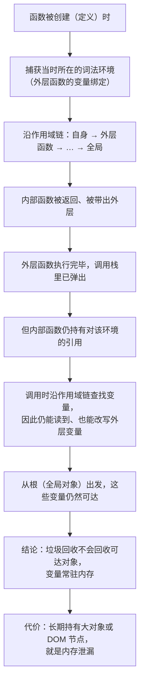
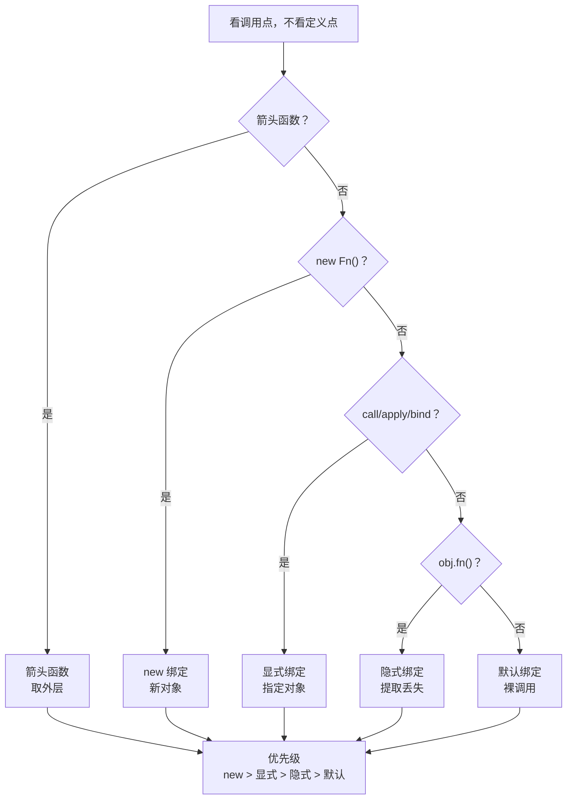
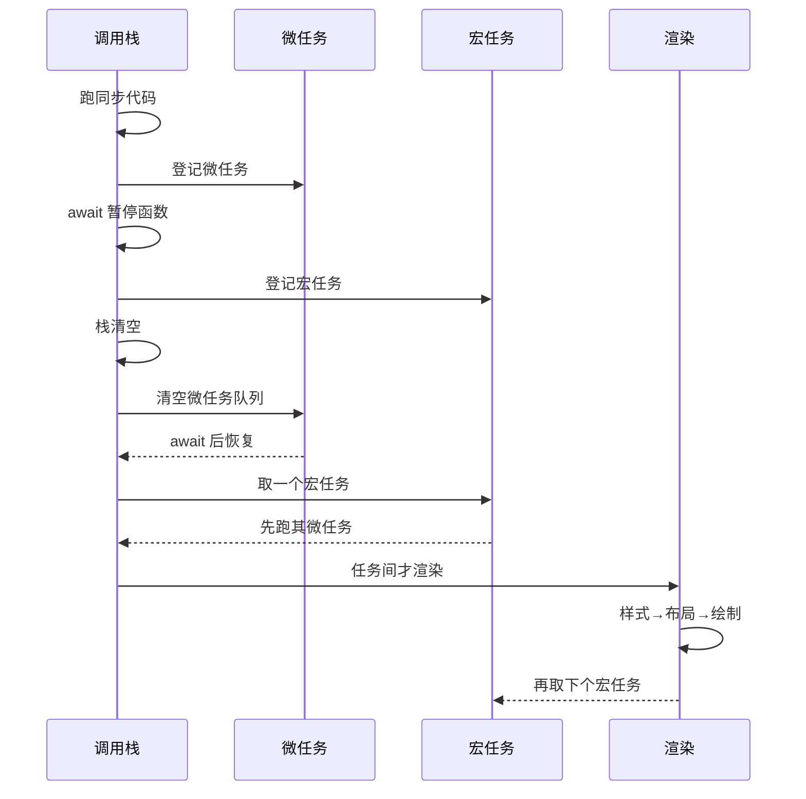

# M4 JavaScript 语言核心

> 一句话：本模块只干一件事——把「JS 为什么这样跑」变成能**先写下答案再运行验证**的可预测规则；相等性、作用域、`this`、输出顺序一旦能被预测，前端大半「玄学 bug」就变成可定位的工程问题。
> 对应《Web 前端技术》课程大纲模块 M4（[[00-课程大纲]]）。

## 0. 这一块是怎么来的（历史一则）

1995 年，Brendan Eich 在网景（Netscape）用大约十天做出了这门语言的原型。它最初叫 Mocha，随后叫 LiveScript，最终为配合当时的市场宣传被改名为 JavaScript——**它与 Java 没有语言血缘**，名字是营销产物，不是设计关系。这段仓促出身解释了两件至今仍在影响我们的事：语言带着若干历史遗留行为（`typeof null` 就是其中之一），以及它在早期没有任何标准化约束。

1996 年微软推出 JScript，市场上出现互不兼容的多个实现，分裂直接推动了标准化。1997 年 6 月，ECMA 大会通过了 ECMA-262 第 1 版；1999 年发布第 3 版，此后语言长期停滞。直到第 5 版由 2009 年 12 月的 ECMA 大会通过，才带来严格模式与 JSON 支持，语言重新活跃起来。

真正的转折是第 6 版（ES2015），由 2015-06-17 的 ECMA 大会通过：模块、`class`、词法作用域（`let`/`const`）、Promise、解构等一次性进入语言，此后改为**年度版本制**。本模块讲授的所有「现代语法」，源头基本都在这里；而 ECMAScript 2026 已是第 17 版（2026 年 6 月）。换句话说：你在课上打交道的，是一门每年仍在演进、但直到 2015 年才重新对齐的语言。

**讲这一段的用意**：让学生接受「JS 的怪不是随机怪」。`typeof null === 'object'`、`NaN !== NaN`、`==` 的隐式转换，都能追溯到早期设计取舍与后续兼容承诺——记住结论、理解成因，比死记更不容易出错。

## 1. 教学目标

### 1.1 三层目标（用可考核的行为动词描述）

| 层次 | 目标 | 可考核的行为动词（学生做到即达标） |
|---|---|---|
| 知识 | 掌握 JS 的类型与转换规则、作用域与提升、闭包、`this`、原型链、ES6+ 语法、数组函数式方法、迭代器与生成器、错误处理、模块与内存回收的基础模型 | 说出、区分、复述、指出、解释 |
| 能力 | 能对给定代码**先预测输出/`this`/相等性结果再运行验证**；能用调试器断点与 watch 定位类型转换类、作用域类 bug；能把一段用 `==`、`var`、错误 `sort` 写坏的代码改成正确且可读的版本 | 预测、手写、改写、定位、调试、验证 |
| 素养·工程规范 | 默认 `const`/`let`、默认 `===`、默认 `??`、异常不吞、不污染原型、以断点而非 `console.log` 作为主要调试手段 | 遵守、审查、指出、重构 |

认知层次上，本模块**以「理解 → 分析 → 应用」为主线**：能背规则只算及格，能对没见过的代码段预测结果才算过关。

### 1.2 学完后应能独立完成的一件事

独立写出一个**不依赖任何框架**的「待办清单核心模块」（`.mjs`）：用闭包封装私有状态，方法内 `this` 绑定正确，增删改用 `map`/`filter`/`find` 等函数式方法，数字排序传比较函数，异常分支不吞，用 ESM 导出；并能在浏览器 [DevTools](https://developer.chrome.com/docs/devtools/) 中对**一处隐式转换 bug 下断点、加 watch、单步定位后改对**。

## 2. 学时分配与讲授节奏

| 序 | 主题 | 讲授分钟 | 实验上机分钟 | 教学形式 |
|---|---|---|---|---|
| 1 | 类型系统、隐式转换与相等性（`==` / `===`） | 50 | 0 | 讲授 + 控制台逐条现场演示 + 即时问答 |
| 2 | 作用域、暂时性死区与提升、严格模式 | 40 | 0 | 讲授 + 代码推演 |
| 3 | 闭包 | 45 | 30 | 讲授 + 实验一（闭包工厂、循环捕获） |
| 4 | `this` 的四种绑定与箭头函数 | 45 | 30 | 讲授 + 实验一续（方法提取、`bind`） |
| 5 | 原型链与 `class`、`instanceof` | 45 | 0 | 讲授 + 对象原型链图推演 |
| 6 | ES6+ 语法与数组函数式方法 | 60 | 40 | 讲授 + 实验二（调试改错） |
| 7 | 迭代器与生成器 | 30 | 0 | 讲授 + 手写可迭代对象 |
| 8 | 错误处理、调试器断点与 watch | 25 | 40 | 讲授 + 实验三（异步顺序预测） |
| 9 | ESM 与 CJS 差别、内存回收基础、串讲 | 20 | 40 | 讲授 + 实验三验证与讲评 |
| — | **合计** | **360** | **180** | **540 分钟 = 12 学时** |

**节奏说明**：讲授 360 分钟 + 上机 180 分钟，合计 540 分钟，与 12 学时严格对齐。前两节不给上机时间，用于把「相等性」和「作用域」这两块地基一次讲透；第 3、4 节连排、边讲边写；第 6 节是承重墙（语法糖 + 数组方法），必须给足 60 分钟；第 8、9 节把调试、异步预测与模块串起来收尾。若课时被压缩，**只能砍第 7 节（迭代器与生成器）的讲授时间，不能砍第 1 节与第 6 节**。

## 3. 逐节讲授要点

### 3.1 类型系统、隐式转换与相等性（50 分钟）

**要讲什么**

- 七种原始类型（`number` `string` `boolean` `null` `undefined` `symbol` `bigint`）+ 一种对象类型；`typeof` 的结果表，特别标出 `typeof null === 'object'`、`typeof function === 'function'` 两个例外。
- `NaN` 的来源与判等：`NaN !== NaN`，判 NaN 用 `Number.isNaN(x)`（不做转换）而非全局 `isNaN`（先做数字转换）；`Object.is(NaN, NaN)` 为 `true`、`Object.is(0, -0)` 为 `false`。
- 抽象相等 `==` 的转换链（定性讲清：同类型直接比、`null`/`undefined` 互等、数字与字符串比会把字符串转数字、涉及对象会先做 ToPrimitive），严格相等 `===` 不做转换。
- 结论落到规范：**默认永远用 `===`**；`==` 只在明确知道两边同为 `null`/`undefined` 需要「一箭双雕」时谨慎使用，且要在评语里写清意图。

**必须现场的演示**（浏览器控制台逐条敲：按 `Ctrl+Shift+J` 直接打开 Console，清空用 `Ctrl+L`；先让学生喊答案再回车）

```js
1 == '1'          // true
0 == false        // true
'' == 0           // true
null == undefined // true
null == 0         // false  ← 反直觉，讲清 null 只与 undefined 相等
[] == false       // true   ← ToPrimitive 转成 ''，再转 0
[] == ![]         // true   ← 两边都变 0
NaN === NaN       // false
typeof null       // "object"
```

**要提问学生的 2-3 个问题及期望答案**

- Q：`typeof null` 为什么是 `"object"`？——期望：早期实现按类型标签判定，`null` 的标签位恰好落在对象分支上，属历史遗留；**记住结论，判空用 `x === null`，别用 `typeof`**。
- Q：`isNaN('abc')` 和 `Number.isNaN('abc')` 结果一样吗？——期望：不一样。`isNaN` 先把参数转数字，`'abc'` 转成 `NaN`，返回 `true`；`Number.isNaN` 不转换，只对真正的 `NaN` 返回 `true`，所以返回 `false`。
- Q：`[] == false` 为真的推理链是什么？——期望：`[]` 通过 ToPrimitive 变成 `''`，`''` 转数字为 `0`，`false` 转数字为 `0`，故相等。

**学生一定会犯的错**：以为 `==` 只是「宽松一点的比较」，没意识到它会做 ToPrimitive 与数字转换；用 `typeof x === 'object'` 判空导致 `null` 也进分支；用 `x !== NaN` 或 `x === NaN` 判 NaN，永远为 `true`/`false` 写反逻辑。

### 3.2 作用域、暂时性死区与提升、严格模式（40 分钟）

**要讲什么**

- 词法作用域（看代码写在哪儿）与动态作用域的区别；函数作用域 vs 块级作用域（`{}` 在 `let`/`const` 下成块）。
- 提升：`var` 的声明被提到作用域顶部并初始化为 `undefined`；函数声明整体提升；`let`/`const` 也「被创建」但**未初始化**，声明前访问落进暂时性死区（TDZ），抛 `ReferenceError`。
- 严格模式：`'use strict'` 的效果（未声明赋值抛错、裸调用函数 `this` 为 `undefined`、禁止删除不可删属性）；**ESM 与 `class` 体默认就是严格模式**，不必手写。

**必须现场的演示**

```js
console.log(a) // undefined（var 提升）
var a = 1

console.log(b) // ReferenceError：Cannot access 'b' before initialization
let b = 2

function f() { 'use strict'; return this }
f()            // undefined（非严格模式下是全局对象）
```

**要提问学生的 2-3 个问题及期望答案**

- Q：`let` 到底有没有提升？——期望：有「创建」但没有「初始化」，所以处于 TDZ；这恰恰是它比 `var` 安全的地方——把「用了还没赋值的变量」从静默 `undefined` 变成响亮报错。
- Q：严格模式下裸调用函数，`this` 是什么？——期望：`undefined`；非严格模式是全局对象。这也是「模块里 `this` 是 `undefined`」的原因。
- Q：为什么类里的方法不会把 `this` 悄悄指向全局？——期望：`class` 体和 ESM 默认严格，裸调用得 `undefined`，问题当场暴露而不是悄悄写坏全局对象。

**学生一定会犯的错**：继续用 `var`，导致循环变量与函数作用域混在一起；以为 `let` 不提升、把 TDZ 报错当成「变量不存在」；在脚本里手写 `'use strict'` 却不知道模块本就严格、写成自我安慰。

### 3.3 闭包（45 分钟）

**要讲什么**

- 定义：内部函数记住了它被定义时所在的词法环境，即使外层函数已经执行完，那个环境里的变量依然可达、可写。
- 两个经典用途：**私有变量**（外部拿不到、只能通过闭包暴露的方法改）与**函数工厂**（用参数生成行为不同的函数）。
- 代价：被闭包引用的变量不会被回收；长期持有大对象或 DOM 节点会造成内存泄漏——这也是「防抖节流、事件监听器」需要注意生命周期的地方。
- 框架里的表现：[React](https://zh-hans.react.dev/learn) 的 `useEffect` 依赖数组与「旧值」问题、事件回调、防抖节流，本质都是闭包捕获了某个时刻的绑定。

**必须现场的演示**

```js
function counter() { let n = 0; return () => ++n }
const next = counter(); next(); next() // 1 2

const fns = []
for (var i = 0; i < 3; i++) fns.push(() => i)
fns.map(f => f())  // [3, 3, 3] ← var：共享同一个绑定
// 把 var 换成 let：(0, 1, 2)
```

**要提问学生的 2-3 个问题及期望答案**

- Q：为什么 `n` 在外层函数执行完后还没被回收？——期望：返回的箭头函数持有对外层词法环境的引用，这条引用链让 `n` 从根可达，垃圾回收器不会回收可达对象。
- Q：循环里用 `var` 为什么三个函数都输出 `3`？——期望：`var` 只有一个函数级绑定，所有闭包共享它；`let` 每轮迭代新建一个绑定，各自被自己的闭包捕获。
- Q：闭包的内存代价具体是什么？——期望：被引用变量常驻内存；若引用了大对象或 DOM 节点且闭包长期存活，就等于泄漏。

**学生一定会犯的错**：在循环里用 `var` 捕获旧值；以为闭包「复制」了变量（其实是引用同一个绑定，改一处全变）；在事件回调里隐式共享状态，导致所有按钮行为一样。



> **图 1**：作用域链与闭包——函数创建时捕获外层词法环境 → 内部函数被带出后仍持有该引用 → 调用时沿作用域链仍可读写外层变量 → 这些变量从根可达、不被回收。看图要点：闭包捕获的是**绑定**而不是值的快照，所以 `var` 循环里所有回调共享同一个 `i`，输出才是 `[3, 3, 3]`。

### 3.4 `this` 的四种绑定与箭头函数（45 分钟）

**要讲什么**

| 调用方式 | 绑定类型 | `this` 指向 |
|---|---|---|
| `obj.fn()` | 隐式绑定 | `obj` |
| `fn()` 裸调用 | 默认绑定 | 严格模式 `undefined`，非严格全局对象 |
| `fn.call(x)` / `fn.apply(x)` / `fn.bind(x)` | 显式绑定 | 指定的 `x`（`bind` 返回新函数且不可再被覆盖） |
| `new Fn()` | new 绑定 | 新创建的对象 |

- **优先级**：`new` > 显式（`bind`）> 隐式 > 默认。判 `this` 只看**调用点**，不看定义点。
- 箭头函数：**没有自己的 `this`/`arguments`/`prototype`**，`this` 取自定义时外层；因此不能被 `call`/`apply`/`bind` 改变，也不能当构造函数。

**必须现场的演示**

```js
const obj = { name: 'A', hi() { return this.name } }
obj.hi()            // 'A'
const f = obj.hi
f()                 // undefined（非严格：全局对象）← 方法被「提取」后隐式绑定丢失

function G() { this.x = 1 }
const bound = G.bind({ x: 0 })
new bound().x       // 1  ← new 优先于 bind

const o = { name: 'B', hi: () => this.name }
o.hi()              // undefined ← 箭头函数不看调用点
```

**要提问学生的 2-3 个问题及期望答案**

- Q：`new` 和 `bind` 谁优先？——期望：`new` 优先；`bind` 改不了 `new` 时的 `this`。
- Q：箭头函数的 `this` 能被 `call` 改吗？——期望：不能，它没有自己的 `this`，`call` 传的只是参数。
- Q：把对象方法当回调传给 `setTimeout`，`this` 是谁？——期望：取决于写法；普通函数会丢隐式绑定（严格模式 `undefined`），改用 `bind` 或提前缓存 `self`，或写成箭头函数以取外层 `this`。

**学生一定会犯的错**：把对象方法当回调传出去导致 `this` 丢失；在对象方法里用箭头函数却想拿对象自身；以为 `bind` 后还能被再次 `bind` 覆盖；把箭头函数当构造函数 `new` 报错却不知原因。



> **图 2**：`this` 的逐级判定流程——先判是不是箭头函数，不是再按 **new 绑定 > 显式绑定（`call`/`apply`/`bind`）> 隐式绑定 > 默认绑定** 由高到低判一遍。看图要点：判 `this` 只看**调用点**、不看定义点；方法被提取成 `f = obj.fn` 再裸调时隐式绑定当场丢失（严格模式得 `undefined`），而箭头函数没有自己的 `this`，`call`/`apply`/`bind` 都改不了它。各分支的绑定结果：箭头函数取定义处外层的 `this`；`new Fn()` 时 `this` = 新创建的对象（优先级最高）；显式绑定时 `this` = 指定的那个对象，且 `bind` 返回的新函数不可再被覆盖；隐式绑定时 `this` = 那个 `obj`；默认绑定即裸调用 `fn()`，严格模式 `this` = `undefined`、非严格模式 = 全局对象。

### 3.5 原型链与 `class`、`instanceof`（45 分钟）

**要讲什么**

- 三个名字要分清：实例的 `[[Prototype]]`（`__proto__` 是它的访问器）、构造函数的 `prototype`、`constructor`。
- 属性查找顺序：先找实例自有属性，再沿 `[[Prototype]]` 逐级上溯，直到 `null` 仍未命中则 `undefined`。
- **实例属性 vs 原型方法**：数据（每个实例不同）放实例；方法（所有实例共用）放原型——方法写进构造器里会给每个实例各造一份，白白吃内存。
- `class` 是语法糖：方法落在 `prototype` 上，实例字段落在实例上；`extends`/`super` 建立原型链；`instanceof` 沿对象的原型链查构造函数的 `prototype` 是否出现。

**必须现场的演示**

```js
class Animal { speak() { return '...' } }
class Dog extends Animal { speak() { return 'woof' } }
const d = new Dog()
Object.getPrototypeOf(d) === Dog.prototype        // true
Object.getPrototypeOf(Dog.prototype) === Animal.prototype // true
d instanceof Animal                               // true（原型链上有 Animal.prototype）
```

**要提问学生的 2-3 个问题及期望答案**

- Q：为什么方法要放原型上？——期望：一份共享，省内存，且改一处对所有实例生效。
- Q：`instanceof` 到底在比什么？——期望：沿对象的原型链上溯，看有没有某一环等于右侧构造函数的 `prototype`。
- Q：`class` 和「构造函数 + 原型」有本质区别吗？——期望：主要是语法糖；额外差异是 `class` 体默认严格、必须用 `new` 调用、不存在「函数声明整体提升」的调用方式。

**学生一定会犯的错**：直接改 `__proto__` 或往 `Object.prototype` 上挂东西，污染全局；把箭头函数当方法（箭头没有 `prototype`，写成实例字段会给每个实例造一份）；以为 `class` 里写的方法在实例上，用 `hasOwnProperty` 一查发现不在就以为没生效。

### 3.6 ES6+ 语法与数组函数式方法（60 分钟）

**要讲什么**

- 解构（对象/数组、默认值、重命名、嵌套）、展开与 rest、模板字符串、可选链 `?.`、空值合并 `??`。
- **`??` 与 `||` 的差别是本节的最高优先级**：`??` 只在左操作数为 `null`/`undefined` 时取右；`||` 把所有假值（`0`、`''`、`false`、`NaN`）都取右——分页参数传 `0` 会被 `||` 悄悄吃掉。
- 函数式数组方法：`map`（一对一映射，返回新数组）、`filter`（筛选）、`reduce`（归约）、`find`/`findIndex`（找第一个）、`some`/`every`（存在/全部）；`forEach` 只遍历、**忽略返回值、不能中断**。
- 易错三项：`sort` 原地排序且**默认按字符串比较**；`slice` 不原地、`splice` 原地（改原数组）；`toSorted`/`toReversed` 返回新数组不改原数组。

**必须现场的演示**

```js
[10, 1, 2].sort()                 // [1, 10, 2] ← 默认转字符串比较
[10, 1, 2].sort((a, b) => a - b)  // [1, 2, 10]

const list = [1, 2, 3]
list.slice(1, 3)  // [2,3]，list 不变
list.splice(1, 2) // [2,3]，list 变成 [1]

0 ?? 20   // 0   ← 只在 null/undefined 取右
0 || 20   // 20  ← 假值统统取右，真实 bug 源头
'' ?? 'x' // ''
'' || 'x' // 'x'
```

**要提问学生的 2-3 个问题及期望答案**

- Q：`??` 和 `||` 什么时候结果不同？——期望：左操作数是 `0`、`''`、`false`、`NaN` 这些假值但不是 `null`/`undefined` 时不同；此时 `||` 会取右，`??` 保留左。
- Q：`[10, 1, 2].sort()` 为什么排错？——期望：默认把元素转字符串按 UTF-16 码元比较，`"10" < "2"`；数字排序必须传比较函数。
- Q：`forEach` 里写 `return` 有用吗？——期望：没用，返回值被丢弃且不能提前中断；要映射用 `map`、要查找用 `find`、要提前停用 `some`/`every` 或 `for...of`。

**学生一定会犯的错**：`sort` 数字不传比较函数；用 `forEach` + `push` 代替 `map`；混淆 `slice`/`splice` 以为 `slice` 会改原数组（或反之）；给「可以为 0/false/空串」的配置项用 `||` 兜默认值。

### 3.7 迭代器与生成器（30 分钟）

**要讲什么**

- 可迭代协议：对象上实现 `Symbol.iterator` 方法，返回一个迭代器；迭代器协议：`next()` 返回 `{ value, done }`。
- `for...of` 消费的是可迭代对象；普通对象默认不可迭代（要遍历用 `Object.keys`/`Object.values`/`Object.entries`）。
- 生成器 `function*` 与 `yield`：调用生成器函数不立即执行，返回一个迭代器，每次 `next()` 才推进到下一个 `yield`；用于惰性序列、无限序列、分段遍历。

**必须现场的演示**

```js
function* range(start, end) {
  for (let i = start; i < end; i++) yield i
}
[...range(1, 4)]              // [1, 2, 3]

const it = range(1, 3)
it.next()                     // { value: 1, done: false }

// 普通对象直接 for...of 会报错：不是可迭代对象
for (const v of { a: 1 }) {}  // TypeError
```

**要提问学生的 2-3 个问题及期望答案**

- Q：普通对象能用 `for...of` 吗？——期望：不能，默认没有 `Symbol.iterator`；要么自己实现，要么用 `Object.entries` 等先转成数组。
- Q：调用生成器函数会立刻执行吗？——期望：不会，返回迭代器；每次 `next()` 才执行到下一个 `yield`。
- Q：迭代器什么时候 `done` 为 `true`？——期望：序列耗尽后；此后 `value` 通常为 `undefined`。

**学生一定会犯的错**：对普通对象 `for...of` 报错却不知是「缺 `Symbol.iterator`」；以为生成器是「立刻全部跑完的数组」；忘记 `yield` 会把值交出去、`next()` 的入参语义。

### 3.8 错误处理、调试器断点与 watch（25 分钟）

**要讲什么**

- `try`/`catch`/`finally`；`throw` 应抛 `Error` 或其子类（可带 `name`/自定义字段），不要抛裸字符串。
- **不要吞异常**：空 `catch {}` 是最坏实践——异常被静默消失，后续状态不一致且无日志，排障成本极高；至少记录并上抛，或明确降级处理。
- 异步错误的边界：`try/catch` 抓不住 `setTimeout` 回调里的错误（回调在之后的任务里执行，已脱离当前同步栈），需在其内部捕获或用 Promise 链路兜。
- 调试器：断点、条件断点、step over/into/out、**watch 表达式**、Call Stack 面板、Scope 面板（可直接看到闭包捕获的变量）。

**必须现场的演示**：在学生写的一段含隐式转换 bug 的代码上下断点（按 `F12` 打开开发者工具 →点 Sources →在行号上点一下下断点），加 watch `typeof x`、`x === y`、`arr.length`，用 `F8` 继续、`F10` 单步跳过、`F11` 进入函数、`Shift+F11` 跳出，单步走完，当场定位问题——用以证明「断点 + watch」比满屏 `console.log` 快。

**要提问学生的 2-3 个问题及期望答案**

- Q：为什么空 `catch` 是坏习惯？——期望：异常被静默吞掉，程序带着错误状态继续跑，出问题时既没日志也没上下文。
- Q：`try/catch` 能抓住 `setTimeout` 里的错误吗？——期望：不能，那时已不在同一个同步调用栈上。
- Q：断点停住时，怎么确认某变量此刻的值与类型？——期望：用 watch 表达式或 Scope 面板，比往代码里塞 `console.log` 更精确且不污染代码。

**学生一定会犯的错**：`catch` 里什么都不做；`catch (e)` 只 `console.log` 不处理也不上抛；抛字符串而非 `Error`；只会 `console.log` 调试，不学断点与 watch。

### 3.9 ESM 与 CJS 差别、内存回收基础、串讲（20 分钟）

**要讲什么**

- ESM：`import`/`export` 的**结构在解析期就确定**（必须是顶层、不能写在条件里），打包器不执行代码就能建依赖图（利于摇树）；导入是**实时绑定**而非值拷贝；支持顶层 `await`；默认严格模式；同一模块被多处导入只求值一次（单例）。
- CJS：`require` 运行时同步加载、`module.exports` 是对象（近似值拷贝）、不支持顶层 `await`。
- 调用栈与内存：调用栈是同步、后进先出（递归过深即栈溢出）；堆放对象。垃圾回收的两个定性模型：**引用计数**（简单，但互相引用的对象无法归零，会漏）与**标记清除**（从根出发标记可达对象，能处理循环引用）。常见泄漏：未解绑的事件监听、闭包长期持有大对象、往全局乱挂。

**必须现场的演示**：同一模块被两处 `import` 只打印一次；写一个顶层 `await` 的 ESM 说明它必须用在 ESM 中；在 Memory 面板做一次堆快照（定性演示即可：按 `F12` 打开开发者工具 →点 Memory →选中 Heap snapshot →点 Take snapshot）。**不得用 `file://` 打开页面**，用本地服务器访问 `http://127.0.0.1:<端口>/`（起法见 [[21-操作与资料速查（全可点）]]）。

**要提问学生的 2-3 个问题及期望答案**

- Q：ESM 的 `import` 为什么能被静态分析？——期望：语法是静态的、必须在顶层，打包器不必运行代码就能建立依赖关系。
- Q：标记清除为什么能回收循环引用？——期望：它不靠引用计数，而是从根集合出发标记可达对象，互相引用但整体不可达的对象会被回收。
- Q：顶层 `await` 只能在哪种模块里用？——期望：ESM；CJS 不支持。

**学生一定会犯的错**：同一文件里混用 `require` 与 `import`；以为 `import` 拿到的是值的拷贝（其实是实时绑定）；把「没报错」当成「没内存泄漏」；从不用断点调试。



> **图 3**：事件循环的执行时序——同步代码在调用栈上跑完 → 清空整个微任务队列（`await` 之后的代码就在这里恢复执行）→ 才取出一个宏任务执行 → 一个任务结束、下一个宏任务开始前才轮到渲染。看图要点：**微任务先于宏任务**，且宏任务内部新产生的微任务也要在当前这一轮先跑完，才会走到渲染。图内短标注对应的细节：同步代码例如 `console.log('1')`；微任务的登记来源是 `Promise.then` / `queueMicrotask`（回调入队）；`await` 会暂停该 async 函数、把其后的代码登记为微任务；宏任务的登记来源是 `setTimeout`（回调入队）；清空微任务队列时，期间新产生的微任务也一并跑完；渲染三步为样式 → 布局 → 绘制，没有变化可跳过。

## 4. 关键概念讲透

### 4.1 隐式类型转换与 `==` / `===`

- **是什么**：`===` 先比类型，类型不同直接 `false`；`==` 在类型不同时会按一套转换规则「努力让它们相等」，涉及字符串转数字、布尔的数字化、对象的 ToPrimitive（先调 `valueOf`/`toString`）。
- **为什么这样设计**：早期语言要方便处理表单输入（一切都是字符串）与松散的数据来源，`==` 的宽松在当时是「方便」；但宽松带来不可预测，标准化后主流规范转向只用 `===`。
- **与相邻概念的边界**：`==` 的例外是 `null == undefined` 为 `true` 而 `null == 0` 为 `false`（`null` 只与 `undefined` 宽松相等）；`Object.is` 比 `===` 更「严格」——`Object.is(NaN, NaN)` 为 `true`、`Object.is(0, -0)` 为 `false`。
- **最小示例（仅示形态）**：

```js
// 仅示形态
const input = '0'
console.log(input == 0)   // true  ← 字符串被转数字，坑
console.log(input === 0)  // false ← 类型不同，符合预期
console.log(null == 0)    // false
console.log(null == undefined) // true
```

- **一句可背下来的判据**：**类型不同就别比；要「同时命中 `null` 和 `undefined`」才用 `==`，其余一律 `===`。**

### 4.2 闭包

- **是什么**：函数连同它定义时所在的词法环境一起被保存下来；外层函数返回后，内部函数仍能读写那些变量。
- **为什么这样设计**：让「状态」能安全地藏在函数里，不必挂到全局；也是回调、模块私有变量、函数式组合的基础机制。
- **与相邻概念的边界**：闭包 ≠ 全局变量（状态不可被外部随意改）；闭包 ≠ 块级作用域（块级作用域限制可见范围，闭包是「记住并可继续访问」）；闭包捕获的是**绑定**而非值的快照。
- **最小示例（仅示形态）**：

```js
// 仅示形态
function createCounter(start = 0) {
  let n = start
  return {
    inc: () => ++n,
    get value() { return n },   // 只读出口
  }
}
const c = createCounter()
c.inc(); c.inc()
console.log(c.value) // 2；外部无法直接改 n
```

- **一句可背下来的判据**：**函数里用到了外层变量并且要被「带出去」——那就是闭包；此时先问一句：它会把什么长期留在内存里？**

### 4.3 `this` 的绑定规则

- **是什么**：`this` 是函数被调用时确定的一个隐式参数，指向「调用点的相关对象」，由调用方式决定。
- **为什么这样设计**：让同一个函数能被不同对象复用（如各种事件处理器、原型方法），指向当前执行上下文的对象。
- **与相邻概念的边界**：`this` 看**调用点**，词法作用域看**定义点**——这两者常被混为一谈；箭头函数反其道而行，不绑定 `this`，取定义处外层的 `this`。
- **最小示例（仅示形态）**：

```js
// 仅示形态
const user = {
  name: 'Ada',
  greet() { return `hi ${this.name}` },          // 隐式绑定
  bad: () => `hi ${this?.name}`.toString(),       // 箭头：无自身 this
}
const g = user.greet.bind({ name: 'Lin' })
console.log(g())          // 'hi Lin'（显式绑定）
console.log(user.greet()) // 'hi Ada'（隐式绑定）
```

- **一句可背下来的判据**：**「谁在调用它」决定 `this`：`obj.fn()` 是 `obj`，裸调用严格模式下是 `undefined`，`bind` 之后不再变，箭头函数里根本没有它。**

### 4.4 `??` 与 `||`（空值合并 vs 逻辑或）

- **是什么**：`a ?? b` 只在 `a` 是 `null` 或 `undefined` 时给出 `b`；`a || b` 在 `a` 为任意假值时给出 `b`。
- **为什么这样设计**：`||` 的语义是「逻辑或」，天生把 `0`/`''`/`false` 当假值；但配置、计数、分页这些场景里 `0` 是**合法值**，于是引入了只针对空值的 `??` 来补这个缺口。
- **与相邻概念的边界**：`??` 与 `||`/`&&` 不能不加括号混用（语法限制），需要时用括号明确优先级；`?.` 是可选的**取值**，`??` 是**兜底**，两者常搭配：`a?.b ?? def`。
- **最小示例（仅示形态）**：

```js
// 仅示形态
function pageSize(input) {
  const n = input ?? 20   // 传 0 时保留 0；若写 || 会变成 20
  return n
}
console.log(pageSize(0))    // 0
console.log(pageSize(undefined)) // 20
```

- **一句可背下来的判据**：**只有「空」该被替换就用 `??`；只有「假」该被替换才用 `||`——默认写 `??`。**

## 5. 常见误区与诊断

| 学生症状 | 真实病根 | 课堂怎么纠正 |
|---|---|---|
| 循环里绑的多个回调，输出全是最后一个值 | `var` 是函数级作用域，所有回调共享同一个绑定；闭包捕获的是绑定不是快照 | 现场把 `var` 换成 `let` 跑一遍对照，追问「每轮迭代有没有新建绑定」 |
| `if (x == 0)` 把 `''`、`false` 也放进来了 | `==` 做隐式转换，两边都向数字靠 | 用 `===` 重写，让学生列出该分支「本以为」命中哪些值，再实测 |
| `[1, 10, 2].sort()` 排出来是 `[1, 10, 2]` | `sort` 默认把元素转字符串按 UTF-16 码元比较 | 必传比较函数 `(a, b) => a - b`；现场打印转换前后的中间值 |
| `map` 里 `return` 了却没收集到结果 | 错用了 `forEach`（忽略返回值、不能中断） | 讲清 `map`/`forEach`/`find`/`some` 各自的返回语义，现场各写一遍 |
| 分页/数量配置传 `0`，被默认值顶掉 | 用了 `\|\|` 而非 `??`；`0` 是合法值却是假值 | 讲 `??` 与 `\|\|` 的差别，用 `0 \|\| 20` 与 `0 ?? 20` 对照演示 |
| `typeof x === 'object'` 判空，`null` 也进分支后报错 | `typeof null === 'object'` 是历史遗留 | 判空统一写 `x === null`（要一箭双雕用 `x == null` 并写注释） |
| `if (NaN === NaN)` 判断永远不成立 | `NaN` 与自身不相等 | 用 `Number.isNaN(x)`；需要更严格相等语义时用 `Object.is` |
| `catch {}` 空着，出错后毫无线索 | 吞异常：异常被静默丢弃，状态不一致且无日志 | 立规矩：要么记录并上抛，要么明确降级；空 `catch` 一律退回重写 |
| 事件回调里 `this` 是 `undefined` 或全局对象 | 方法被「提取」传递，隐式绑定丢失 | 三种修法现场对照：`bind`、提前缓存 `self`、改箭头取外层 `this` |
| 每个实例都存了一份同名方法（内存翻倍） | 方法写在构造器/实例字段里，没放原型 | 讲「数据在实例、方法在原型」，用 `hasOwnProperty` 验证 |
| 改 `slice` 的结果，原数组却变了（或反之） | 混淆 `slice`（不原地）与 `splice`（原地） | 讲「破坏性方法」概念，引出 `toSorted`/`toReversed` 这类不改原数组的新方法 |
| 对象方法写成箭头函数，拿不到对象属性 | 箭头函数不绑定自身 `this`，取定义处外层 | 对象方法用简写语法；只在回调里需要外层 `this` 时才用箭头 |

## 6. 本模块实验

### 实验一：闭包与 `this` 的可预测性（对应 3.3 / 3.4）

- **目的**：把闭包与 `this` 从「背规则」变成「能预测、能复现」。
- **环境**：本机 Node v26.7.0（npm 11.19.0）；浏览器 DevTools 控制台（按 `Ctrl+Shift+J` 直接打开 Console）；纯 `.mjs` 或单个 `.html` 均可；**不引入任何框架**（Vite 8.3.1 仅作可选的本地预览环境）。**不得用 `file://` 打开页面**，用本地服务器访问 `http://127.0.0.1:<端口>/`（起法见 [[21-操作与资料速查（全可点）]]）。
- **任务描述**
  1. 写一个 `createCounter(start)` 函数工厂，返回带 `inc`/`reset` 的对象，状态用闭包私有；再用同一工厂生成两个互不影响的计数器。
  2. 构造「循环里绑回调」的两种版本（`var` 与 `let`），先写下各自预期输出，再运行核对。
  3. 写一个对象方法，把它作为回调传给 `setTimeout`，分别用「直接传、`bind`、`self` 缓存、箭头」四种写法，写下并验证四种 `this`。
- **验收判据（可自测）**：两个计数器互不干扰；`var`/`let` 两组预期输出与实际一致（不一致的必须写一行原因）；四种 `this` 写法各自标注实际指向且与预测一致；代码中不出现 `var`（除对照用那一组并注释标明）。
- **提交物**：`.mjs`（或 `.html`）+ 一张「预测 vs 实际」对照表（纯文本即可）。
- **评分要点**：闭包正确性与封装性 40%；预测表与实际一致性 30%；`this` 四种写法覆盖度 20%；命名与注释 10%。**只看行为与自测表，不要求与教师示例逐行相同。**

### 实验二：调试题——把隐式转换与 `==` 造成的 bug 改对（对应 3.1 / 3.6 / 3.8）

- **目的**：以「修 bug」的方式固化相等性、默认值与排序规则，并强制使用调试器而非盲改。
- **环境**：同上；教师提供一份含若干缺陷的单文件脚本（约 40-60 行，**学生版只给现象与期望输入/输出，不给答案**）。
- **任务描述**：脚本内部至少埋入以下类型缺陷（教师按实际题面增减，不在此处给出具体代码）：
  - 用 `==` 比较用户输入与数字 ID，导致 `'0'` 与 `0` 混淆；
  - 用 `||` 给可为 `0` 的配置兜默认值；
  - 数字数组 `sort` 未传比较函数；
  - 用 `typeof x === 'object'` 判空（`null` 也会进分支）；
  - `forEach` 里 `return` 想收集结果却没拿到数组；
  - `parseInt` 未给进制 / 直接用 `Number` 与预期不符；
  - 至少一处 `catch` 吞异常。
  学生须：对每处缺陷**先用断点 + watch 复现**（按 `F12` →点 Sources →在行号上点一下下断点；`F8` 继续、`F10` 单步跳过、`F11` 进入、`Shift+F11` 跳出；watch 在右侧面板添加表达式），再改成正确写法，并为每处写一行「病根 + 修法」说明。
- **验收判据（可自测）**：题面给定的输入→期望输出表全部通过；对外函数名与参数不变（不得靠改题面签名绕过）；逐条给出病根说明；不得使用 `==`（判 `null`/`undefined` 的合法用法需加注释）；调试过程中留下至少一次断点/watch 的截图或文字记录。
- **提交物**：修好的脚本 + 缺陷清单说明表（病根 / 修法 / 验证方式）。
- **评分要点**：缺陷全部改对 50%；病根说明准确 25%；保留题面 API 且未引入 `==`/`var` 25%。

### 实验三：事件循环与异步输出顺序预测（前置：3.8 / 3.9）

> **指向说明**：事件循环本身不在本模块讲——它的系统讲解在 [[05-教案 M5 浏览器原理与运行时]] 的 §3.5；本实验在本模块只用得上两处前置：§3.8「错误处理、调试器断点与 watch」（回调在之后的同步栈之外执行，以及断点 + watch 这套「先预测、后运行」的验证手段）与 §3.9「ESM 与 CJS 差别、内存回收基础」（调用栈是同步、后进先出；顶层 `await`）。

- **目的**：建立「同步栈 → 微任务 → 宏任务」的模型；训练「先预测、后运行」的工程习惯。
- **环境**：浏览器 DevTools 控制台（按 `Ctrl+Shift+J` 直接打开）或本机 Node v26.7.0。
- **任务描述**：教师给出三段代码（混合 `setTimeout(..., 0)`、`Promise.then`、`queueMicrotask`、`await` 与同步 `console.log`；至少一段含 `await` 后的续执行）。学生须**先在注释或纸上写出预期输出顺序，再运行**；对每一处预测与实际不符的地方，写两行解释。
- **验收判据（可自测）**：三段各有一份「预期顺序」与「实际顺序」；差异处均有解释，且解释中体现出「微任务先于宏任务」「`await` 之后的代码被排进微任务」这两条；不得先运行再倒着编预期（以提交顺序与录屏/截图时间戳为准）。
- **提交物**：三段预测表（预期 / 实际 / 差异解释）。
- **评分要点**：预测覆盖率 30%；与实际一致性 30%；差异解释质量 40%（能说清「为什么」才算分，只抄答案不给分）。

## 7. 本模块作业与自测题

标注格式：`[对应节] [认知层次] [难度★-★★★]`。选择题与简答给判据，编程题只给验收判据与评分要点（**不提供可直接提交的完整代码**）。

**题 1（选择）** `[3.1] [记忆] [★]` 下列表达式的值依次是什么：`typeof null`、`NaN === NaN`、`null == undefined`、`null == 0`？
判据：`"object"`、`false`、`true`、`false`。

**题 2（选择）** `[3.1] [理解] [★★]` 哪些表达式为 `true`？① `[] == false` ② `[] == ![]` ③ `0 == ''` ④ `Object.is(0, -0)`
判据：①②③ 为 `true`，④ 为 `false`；答对需说明转换链，只写对错不给满分。

**题 3（简答）** `[3.2] [理解] [★★]` 说明 `var` 的变量提升与 `let` 的暂时性死区的差别，并解释为什么 `let` 更安全。
判据：答出「`var` 提升并初始化为 `undefined`」「`let` 被创建但未初始化，声明前访问抛 `ReferenceError`」「TDZ 把静默错误变成显式错误」三点。

**题 4（简答）** `[3.3] [理解] [★★★]` 闭包的内存代价是什么？举一个会造成泄漏的真实场景并给出规避方式。
判据：指出「被闭包引用的变量常驻内存、阻止回收」；场景合理（如未解绑的监听器长期持有大对象/DOM）；规避方式具体（如在卸载时解绑、及时把引用置空、缩小捕获范围）。

**题 5（读代码）** `[3.3] [分析] [★★]` 给一段在 `for (var i = 0; i < 3; i++)` 里把 `() => i` 推进数组的代码，问输出结果，并给出两种正确改法。
判据：输出 `[3, 3, 3]`；改法一用 `let`，改法二用 IIFE/`forEach` 新建作用域；能说清「共享绑定 vs 每轮新绑定」。

**题 6（读代码）** `[3.4] [分析] [★★]` 判断下列调用的 `this`（严格模式）：`obj.fn()`、裸调用 `fn()`、`fn.call(x)`、`const f = obj.fn; f()`、`new Fn()`、箭头函数 `() => this`。
判据：依次为 `obj`、`undefined`、`x`、`undefined`（隐式绑定丢失）、新实例、定义处外层的 `this`。

**题 7（读代码）** `[3.6] [分析] [★★]` 给定数组，预测 `sort()`、`sort((a,b)=>a-b)`、`slice(1,3)`、`splice(1,2)` 四种操作的结果，并说明哪些改变了原数组。
判据：`sort` 默认按字符串比较结果错误；比较函数结果正确；`slice` 不改原数组、`splice` 改原数组；能点出「原地」概念。

**题 8（读代码）** `[3.1, 3.6] [分析] [★★★]` 给 `n ?? 20` 与 `n || 20` 在 `n` 取 `0`、`''`、`false`、`null`、`undefined` 时的结果对照，指出哪几种情况两者不同。
判据：`0`、`''`、`false` 时不同（`??` 保留左值，`||` 取右）；`null`、`undefined` 时相同；能联系到「分页参数 0 被吃掉」的真实 bug。

**题 9（编程）** `[3.6, 3.7] [应用] [★★]` 用 `reduce` 实现 `groupBy(list, keyFn)`，并实现一个可迭代的 `range(start, end)`（支持 `for...of` 与展开）。
验收判据：`groupBy` 返回以键为属性、值为数组的对象，空输入返回 `{}`，不修改入参；`range` 可被 `for...of` 与 `[...]` 消费，`start >= end` 时为空序列；不使用 `var`、不使用 `==`。
评分要点：`reduce` 用法正确 40%；可迭代协议实现正确（`Symbol.iterator` + `next` 返回 `{value, done}`）40%；边界与不可变性 20%。

**题 10（编程）** `[3.3, 3.4] [创造] [★★★]` 基于闭包实现 `once(fn)`（只生效一次）与 `debounce(fn, ms)`（合并短时间内的连续调用），并保证 `this` 与入参正确透传。
验收判据：`once` 第二次及以后返回首次结果且不再执行原函数；`debounce` 在连续调用后仅执行最后一次，且执行时的 `this` 与调用方一致；能用一个测试用例证明 `this` 未丢失。
评分要点：闭包状态正确 40%；`this`/参数透传 40%；可测性与命名 20%。

**题 11（简答）** `[3.8] [评价] [★★]` 为什么空 `catch` 是坏实践？给出至少两种可接受的替代处理方式。
判据：指出「异常被静默吞掉、状态不一致、排障无据」；替代方式如记录日志后上抛、转换为用户可读的错误、明确降级并留下埋点。

**题 12（简答）** `[3.9] [理解] [★★]` 列出 ESM 与 CJS 至少三点差别。
判据：从「静态 vs 运行时加载」「实时绑定 vs 值/对象导出」「是否支持顶层 `await`」「是否默认严格模式」中答对三点即可。

## 8. 自我检查清单（学生用）

- [ ] 我能不看资料说出 `typeof null` 的结果，并知道判空该写什么。
- [ ] 我能解释 `NaN !== NaN`，并用 `Number.isNaN` 正确判 NaN。
- [ ] 我默认写 `===`，只有在确需同时命中 `null`/`undefined` 时才用 `==` 并加注释。
- [ ] 我能区别 `var` 的变量提升与 `let` 的暂时性死区，并解释 TDZ 为什么更安全。
- [ ] 我能用闭包写私有状态，并说清它会把什么长期留在内存里。
- [ ] 我能预测循环里 `var`/`let` 绑定回调各自的输出。
- [ ] 我能仅凭调用点判断 `this`，并说出四种绑定的优先级。
- [ ] 我知道箭头函数没有自己的 `this`，不能当构造函数。
- [ ] 我能解释实例属性与原型方法的区别，以及 `instanceof` 的判断依据。
- [ ] 我能不假思索地给数字 `sort` 传比较函数，并分清 `slice` 与 `splice`。
- [ ] 我给「可以为 0/`''`/`false`」的值兜默认值时用 `??` 而不是 `||`。
- [ ] 我不会在 `forEach` 里 `return` 收集结果，而是用 `map`/`find`/`some`。
- [ ] 我能手写一个可迭代对象，并在代码里用生成器产出惰性序列。
- [ ] 我的 `catch` 从不空着——要么记录并上抛，要么明确降级。
- [ ] 我调试时先下断点、加 watch，而不是靠满屏 `console.log`。
- [ ] 我能对一段含异步的代码**先写下输出顺序再运行验证**。

## 9. 出处与依据说明

### 9.1 出处表（仅使用白名单链接，逐条对应本模块小节）

| 本模块小节 | 依据资料（白名单链接） | 说明 |
|---|---|---|
| 3.1 类型与相等性 | [MDN JavaScript 指南](https://developer.mozilla.org/zh-CN/docs/Web/JavaScript/Guide) | 类型、转换与相等比较的概念性参考 |
| 3.2 作用域、提升、严格模式 | [ES6 入门](https://es6.ruanyifeng.com/) | `let`/`const`、块级作用域与 TDZ 的成体系讲解 |
| 3.3 闭包 | [现代 JavaScript 教程](https://zh.javascript.info/) | 闭包的定义、用途与内存表现的教程式组织 |
| 3.4 `this` 与箭头函数 | [现代 JavaScript 教程](https://zh.javascript.info/) | 四种绑定与箭头函数 `this` 语义 |
| 3.5 原型链与 `class` | [MDN JavaScript 指南](https://developer.mozilla.org/zh-CN/docs/Web/JavaScript/Guide) | 原型继承与 `class` 语法说明 |
| 3.6 ES6+ 与数组方法 | [web.dev Learn JS](https://web.dev/learn/javascript) | 现代语法与现代数组方法（含不改原数组的 `toSorted` 等） |
| 3.7 迭代器与生成器 | [MDN JavaScript 指南](https://developer.mozilla.org/zh-CN/docs/Web/JavaScript/Guide) | 可迭代协议与迭代器协议参考 |
| 3.8 错误处理与调试 | [web.dev Learn JS](https://web.dev/learn/javascript) | 错误对象、异常处理与调试入门 |
| 3.9 ESM 与内存回收 | [MDN JavaScript 指南](https://developer.mozilla.org/zh-CN/docs/Web/JavaScript/Guide) | 模块机制与内存管理/垃圾回收的定性说明 |
| §0 历史一则 | 无白名单链接，依据课程组核实的公开史实 | 仅采用已核实年份；凡不能确证的具体人名、专利、会议细节一律不写入 |

### 9.2 属教师经验的编排判断、无官方直接依据

以下内容是本课程组为教学效果所作的**编排取舍**，非官方文档结论，学生复习时以 3 节正文与 9.1 资料为准即可：

- 12 学时在 9 节主题之间的分钟数切分，以及「压缩课时只能砍第 7 节」的优先级约定。
- 用「先预测输出、再运行验证」作为贯穿全模块的主训法，并把它作为实验一、实验三的核心验收方式。
- 实验二缺陷清单的**具体条目与「只给现象不给答案」的给法**（题面不公开修订后的完整代码）。
- 常见误区表的症状归纳与课堂纠正话术。
- 三层教学目标中行为动词的选择。
- 把「事件循环/异步顺序预测」放在 M4 作为 M5 异步模块引子，而非独立成节；实验三的前置只挂本模块 3.8 与 3.9（事件循环的系统讲解在 M5 §3.5，本模块不承担其讲授）。

### 9.3 与其他笔记的接口

- 模块定位与学时归属：[[00-课程大纲]]。
- 本模块的考核方式与评分量规：[[13-考核方案与评分量规]]。
- 期末样卷中与本模块相关的题型与参考答案要点：[[14-期末样卷与参考答案要点]]。
- 实验与大作业的统一提交与验收规范：[[15-实验与大作业指导]]。
- 本模块语言特性在时间线上的位置（ES5 / ES2015 及之后的年度版本）：[[16-技术演进时间线]]。
