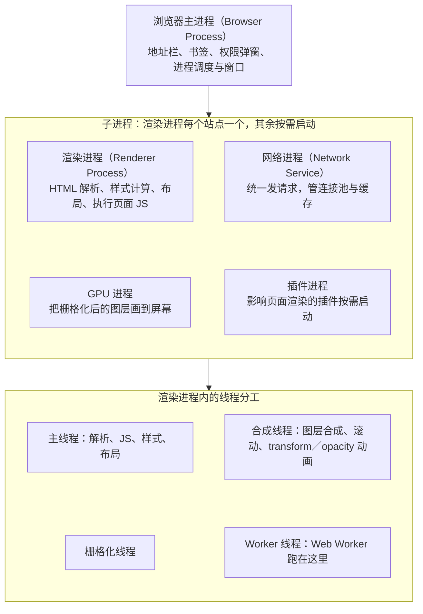
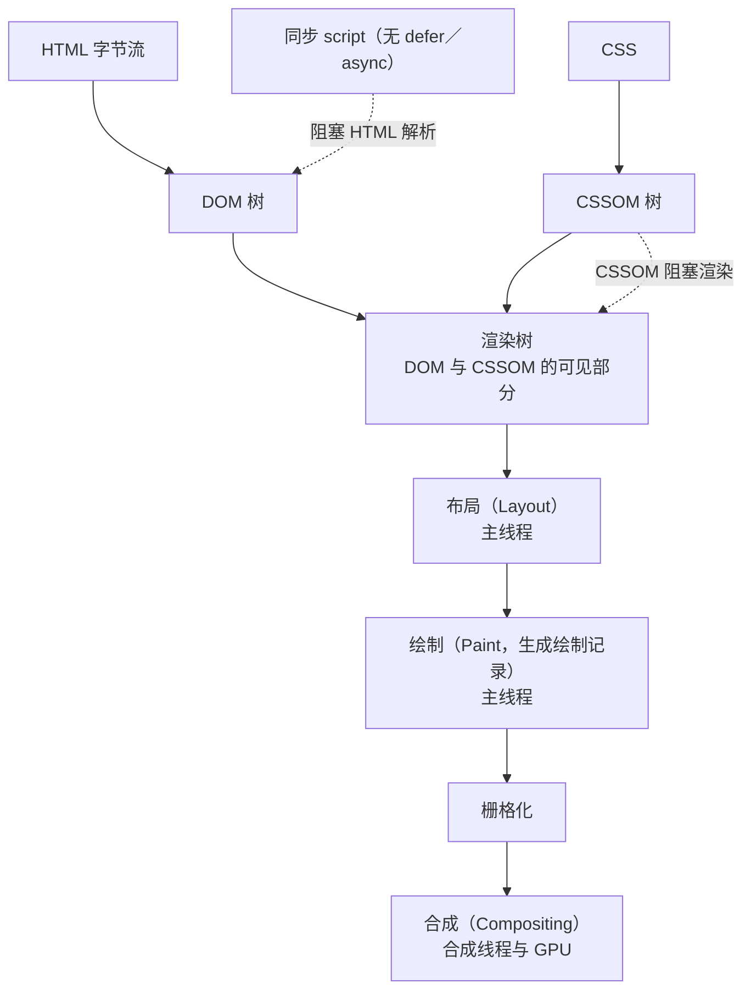
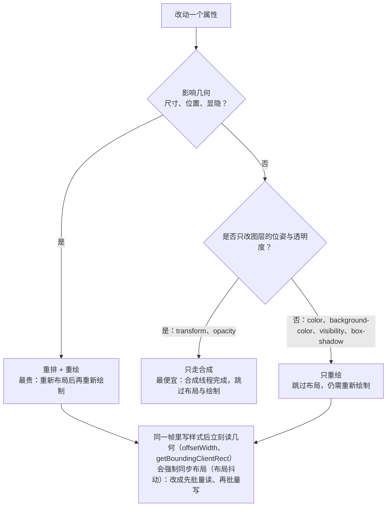

# M5 浏览器原理与运行时

> 一句话：把浏览器从"黑盒"变成可观察、可测量的运行时——让学生遇到卡顿、事件失灵、缓存不生效、跨域被拦、账号被盗这五类问题时，先取证再改代码，而不是靠猜。
> 对应《Web 前端技术》课程大纲模块 M5（[[00-课程大纲]]）。

## 0. 这一块是怎么来的（历史一则）

早期浏览器各自为政。1995 年前后，各大浏览器厂商在自己的产品里各自扩展 DOM 接口，同一段脚本在不同浏览器里能拿到的东西不一样：节点怎么找、事件怎么挂、样式怎么改，各家一套。写一个页面要在多套接口之间做分支判断，前端工作的大量时间花在"兼容"而不是"功能"上。

转机是标准化。1998 年 W3C 发布 DOM Level 1（规范索引见 [W3C 规范索引](https://www.w3.org/TR/)），从此"文档对象模型"才有了一份各方要共同遵循的规范——节点类型、遍历方式、事件模型第一次被写成条款，而不是厂商各自的实现约定。但规范落地需要时间，浏览器对同一份标准仍有实现差异（属性名、事件对象的字段、盒子模型的解释都可能不同）。

这种差异催生了兼容层库。2006 年 1 月 14 日，在 BarCamp NYC 上诞生的 jQuery 就是这一路线的代表：它把"选元素、挂事件、改样式、发请求"四件事抹平成一套在主流浏览器里行为一致的接口，让开发者不必再逐浏览器判断。此后标准 DOM 逐步统一，jQuery 的历史使命——抹平 DOM 与事件接口的碎片——大部分被原生 API 接管，但它的调用风格至今仍能在现代框架的 API 命名里看到影子。

再往后，浏览器在标准 DOM 之上继续生长出更细的能力：Shadow DOM 把一棵子树封装起来，让样式与选择器不越界；自定义元素允许开发者定义自己的标签名并绑定生命周期。这两项结合起来的组件化模型，是今天 Web Components 的基础（这一段的年份跨度较大，此处只作定性描述，不写具体年份）。

这段历史给课堂的直接启示：**前端的大部分"最佳实践"，历史上都曾经是"兼容性的妥协"或"性能的现实约束"。** 讲 M5 时不要把它讲成一堆记忆点，而要讲成"每一步都是在解决一个具体的、可复现的问题"。教学节奏上与 [[16-技术演进时间线]] 对齐。

## 1. 教学目标

### 1.1 知识（能复述并解释）

| 编号 | 目标（行为动词开头） | 考核方式 |
| --- | --- | --- |
| K1 | 描述浏览器多进程架构与渲染进程内主线程、合成线程、GPU 进程、网络进程的分工 | 简答／口头抽查 |
| K2 | 按顺序复述从地址栏输入到首屏的链路：DNS、TCP、TLS（均只需定性）、导航、解析、DOM／CSSOM／渲染树、布局、绘制、合成 | 排序题／画流程图 |
| K3 | 说明重排、重绘、合成三档代价的差别，并指出各档对应的属性类型 | 选择题／读代码 |
| K4 | 解释事件循环中宏任务、微任务、渲染时机的先后关系，并给出长任务的判定阈值 | 输出顺序题 |
| K5 | 区分 `target` 与 `currentTarget`，区分 `preventDefault` 与 `stopPropagation` 的语义 | 简答 |
| K6 | 列举四种以上浏览器存储方式（cookie、localStorage、sessionStorage、IndexedDB、Cache API）的容量、同步性、生命周期与适用场景 | 表格填空 |
| K7 | 区分强缓存与协商缓存，说出 `Cache-Control` 与 `ETag` 各自的作用位置 | 简答／DevTools 取证 |
| K8 | 说明同源策略的三要素，描述 CORS 简单请求与预检请求的差别 | 简答／抓包 |
| K9 | 说明 XSS、CSRF 的作用机制与 CSP 的作用位置 | 简答 |

### 1.2 能力（独立操作，可现场验收）

| 编号 | 目标 | 验收证据 |
| --- | --- | --- |
| A1 | 用 Performance 面板录制一段交互，在 Main 轨道定位一个长任务并读出其耗时 | 导出的 trace 截图 + 耗时数字 |
| A2 | 在 Elements 面板的 Event Listeners 标签里数出某容器上的监听器数量，并用事件委托把 N 个降为 1 个 | 改造前后监听器计数对比 |
| A3 | 在 Network 面板识别一次 304 协商缓存，指出 `ETag` 与 `If-None-Match` 的对应关系 | 请求头／响应头截图 |
| A4 | 在 Network 面板识别一次 CORS 预检 `OPTIONS` 请求，读出 `Access-Control-Request-*` 与 `Access-Control-Allow-*` | 预检请求截图 |
| A5 | 在 Application 面板读写 localStorage 与 cookie，并指出 `HttpOnly` 项在 Console 中为何读不到 | 操作记录 |
| A6 | 把一段耗时计算搬进 Web Worker，使主线程在计算期间仍能响应点击 | 前后 Performance 对比 |
| A7 | 用 Memory 面板拍堆快照，指出一次内存泄漏的候选（如持续增长的 detached DOM 节点） | 快照对比 |

### 1.3 素养与工程规范（可观察的行为）

| 编号 | 目标 | 课堂观察点 |
| --- | --- | --- |
| E1 | 性能结论必须先有测量、后有改动，改动后再测一次 | 实验报告里是否出现"改前／改后"两组数字 |
| E2 | 不把敏感凭据写进可被脚本读取的存储；对"放哪儿更安全"能说出理由 | 代码评审时对 token 存放位置的解释 |
| E3 | 用户输入一律按"不可信"处理，默认转义，确需富文本时走白名单 | 是否出现 `innerHTML` 直接拼接 |
| E4 | 用官方文档而非博客片段确认 API 行为，能贴出出处 | 作业中是否给出来源 |
| E5 | 描述问题用可复现的步骤，不用"卡""崩""不好使"这类词 | 提问与 issue 描述的措辞 |

### 1.4 学完后应能独立完成的一件事

**给定一个"点击按钮后列表卡顿 1 秒且新增项点击无反应"的页面，独立完成一次完整诊断并交付：** 用 Performance 面板定位长任务与耗时函数 → 用事件委托把监听器数量降下来 → 给出改前／改后两组测量数据 → 用一段不超过 300 字的技术说明指出根因（长任务阻塞主线程 + 逐项绑定监听器），并说明为什么这样改有效。评分量规见 [[13-考核方案与评分量规]]。

## 2. 学时分配与讲授节奏

合计 450 分钟（10 学时 × 45 分钟），其中讲授 315 分钟、实验上机 135 分钟。

| 序 | 主题 | 讲授分钟 | 实验上机分钟 | 教学形式 |
| --- | --- | --- | --- | --- |
| 1 | 多进程架构与渲染进程内分工（§3.1） | 45 | 0 | 讲授 + 任务管理器现场演示 |
| 2 | 从地址栏到首屏：网络定性、导航、解析与渲染树（§3.2、§3.3） | 60 | 0 | 讲授 + Network 面板逐段读 Timing |
| 3 | 布局、绘制、合成与三档代价（§3.4） | 45 | 0 | 讲授 + Paint flashing 现场对照 |
| 4 | 事件循环与长任务（§3.5） | 45 | 0 | 讲授 + Console 输出顺序实测 |
| 5 | 事件模型：捕获冒泡、委托、默认行为（§3.6） | 45 | 0 | 讲授 + Event Listeners 面板点数 |
| 6 | 存储体系与 HTTP 缓存（§3.7） | 45 | 0 | 讲授 + Application／Network 面板对照 |
| 7 | 同源、跨域与安全模型；Web Worker；证据意识（§3.8） | 30 | 0 | 讲授 + 双端口跨域现场复现 |
| 8 | 实验 5-1：用 Performance 面板录一次交互并指出长任务 | 0 | 45 | 上机 |
| 9 | 实验 5-2：事件委托把 N 个监听器降到 1 个并验证 | 0 | 45 | 上机 |
| 10 | 实验 5-3：观察一次 304 协商缓存 + 存储与同源观察 | 0 | 45 | 上机 |
| — | **合计** | **315** | **135** | 合计 450 分钟 |

节奏提示：第 2 讲（60 分钟）与第 4 讲（60 分钟）内容最密，中间各留 5 分钟现场动手；第 7 讲压到 30 分钟，只讲判据不讲延伸，细节下放到实验 5-3 的讲义。

## 3. 逐节讲授要点

### 3.1 多进程架构与渲染进程内分工

**要讲什么**

- 四大角色：浏览器主进程（Browser Process，管地址栏、书签、权限弹窗、进程调度与窗口，用户"看得见的壳"由它负责）、渲染进程（Renderer Process，每个站点一个，负责 HTML 解析、样式计算、布局与执行页面 JS）、网络进程（Network Service，统一发请求，管连接池与缓存）、GPU 进程（把栅格化后的图层画到屏幕）。
- 渲染进程内部再分工：**主线程**（解析、JS、样式、布局）、**合成线程**（图层合成、滚动、`transform`／`opacity` 动画）、栅格化线程、Worker 线程（`Web Worker` 跑在这里）。
- 强调三条结论：① JS 与 DOM 在同一线程（主线程），所以长计算必然卡交互；② 已合成的滚动和 `transform`／`opacity` 动画不占主线程，所以不掉帧；③ 进程隔离使一个页面崩溃不带走整个浏览器。



> **图 1**：浏览器多进程架构与渲染进程内的线程分工。看图要点：主线程同时管解析、JS、样式与布局，所以一段长计算必然卡住交互；滚动与 `transform`／`opacity` 动画由合成线程承担，因此主线程忙时它们仍跟手。图中主进程用一条箭头指向「子进程」分组，表示渲染、网络、GPU、插件这四个子进程都由主进程启动与调度（渲染进程每个站点一个，其余按需启动）；由「子进程」分组再指向「线程分工」分组，表示主线程、合成线程、栅格化线程与 Worker 线程都跑在渲染进程内部。

**必须现场的演示**

1. 打开 4~5 个标签页 + 一个内嵌 `iframe` 的页面，用浏览器任务管理器（菜单 → 更多工具 → 任务管理器）观察：每个标签页占一个渲染进程、内存与 CPU 各自独立；再给页面加第二个 `iframe`，观察是否新增一条进程记录。
2. 在 Console 里执行一个死循环（按 `Ctrl+Shift+J` 打开 Console 后粘贴；例如连续递增计数若干秒，课上用 3~5 秒即可），让学生同时拖动鼠标、点按钮、拖滚动条，观察"点击无效但滚动仍可拖"的分离现象——这是合成线程与主线程分工的最直观证据。演示完务必关掉该标签页。

**要提问学生的问题及期望答案**

1. 为什么 JS 里一段死循环会让按钮点不动，但滚动条还能拖？ **期望**：循环占满了主线程，事件处理与布局都在主线程排队；滚动由合成线程处理已合成的图层，不依赖主线程。
2. 为什么改 `left`／`top` 的动画比改 `transform` 更费？ **期望**：`left`／`top` 改变几何信息，每帧都要重新布局并重新绘制；`transform` 可以在合成阶段完成，不触发布局与绘制。
3. `setTimeout` 的回调会跑在另一个线程吗？ **期望**：不会。定时器只是把回调排进主线程的任务队列，仍在主线程执行。

**学生一定会犯的错**

- 把"渲染进程"与"渲染线程"当成一回事，答题时混用；或以为 JS 与 DOM 在不同线程，因此认为"改 DOM 是异步的"。
- 认为改用 `setTimeout` 就能让重计算"不卡"，因为它"是异步的"。

### 3.2 从地址栏到首屏：网络定性、导航、解析与渲染树

**要讲什么**

- 链路顺序（只讲定性，不讲握手细节与报文格式）：DNS 解析域名得到 IP → 建立 TCP 连接 → 若是 HTTPS 再做 TLS 握手（证书校验、协商密钥）→ 发出 HTTP 请求并等待响应 → 浏览器拿到字节流开始导航与解析；跨文档导航时旧文档先走卸载流程，新文档被提交后浏览器开始接收响应流。
- 缓存各层级：浏览器缓存、系统缓存、hosts 文件、递归解析器，命中越靠前越快；HTTP 语义（方法、状态码分族的含义、请求头与响应头各管什么）详见 [MDN 的 HTTP 概述](https://developer.mozilla.org/zh-CN/docs/Web/HTTP/Guides/Overview)（§9 表），规范原文见 [RFC 9110](https://www.rfc-editor.org/rfc/rfc9110.html)。
- **关键点：解析不必等整个 HTML 到齐**，字节流一到就开始解析，这也是"首屏时间短于完整下载时间"的原因。
- 阻塞关系：`<script>` 不加 `defer`／`async` 会暂停解析（解析器必须等它下载并执行完，因为它可能写出文档）；CSSOM 阻塞渲染（避免无样式内容闪烁），并会间接影响脚本执行。
- 阻塞关系：`<script>` 不加 `defer`／`async` 会暂停解析（解析器必须等它下载并执行完，因为它可能写出文档）；CSSOM 阻塞渲染（避免无样式内容闪烁），并会间接影响脚本执行。

**必须现场的演示**

1. Network 面板（按 `Ctrl+Shift+I` 打开开发者工具 →点 Network；`Ctrl+R` 重载以记录一次请求，`Esc` 关闭底部详情抽屉；面板用法见 [Network 面板教程](https://developer.chrome.com/docs/devtools/network)）：勾选／取消 Disable cache，各刷新一次，对比静态资源的耗时；右键列头打开 Timing 列，点开文档请求 → Timing 标签页，逐段读 Queued、DNS、Initial connection、TLS、Request、Response。
2. 同一次刷新里点开一个静态资源的 Response Headers，读出 `Cache-Control` 与 `ETag`（为 §3.7 埋伏笔）。
3. 用一个含同步 `<script>`（放在 `<head>`，无 `defer`）的页面，在 Performance 面板录一次加载，在 Main 轨道指出解析被暂停、等待脚本执行的那一段。

**要提问学生的问题及期望答案**

1. 每次访问都要重新做 DNS 解析吗？ **期望**：不必，有多级缓存；缓存失效或过期才重新解析。
2. HTML 里不加 `defer` 的 `<script>` 为什么让首屏变慢？ **期望**：它阻塞 HTML 解析（还可能需要等 CSSOM），解析停住，后续元素无法构树与布局。
3. 为什么建议把 CSS 放在 `<head>` 里，而不是放页尾？ **期望**：CSSOM 参与渲染树的构成，样式到位前不渲染；放页尾会出现无样式内容闪烁，且可能阻塞脚本。

**学生一定会犯的错**

- 以为 DNS／TCP／TLS 与前端"没关系"，只关注代码；也以为要等 HTML 全部下载完才开始解析。
- 把 `defer` 与 `async` 的差异记反（`defer` 保持顺序且在文档解析完成后执行；`async` 下载完就执行，顺序不保证）。

### 3.3 HTML 解析与容错、DOM／CSSOM／渲染树

**要讲什么**

- HTML 解析器是**容错**的（修复规则见 [WHATWG HTML 现行标准](https://html.spec.whatwg.org/multipage/)）：标签未闭合、嵌套错位、属性引号缺失，解析器会按既定规则修复，而不是报错停摆——这正是"标签写错也能显示"的原因。要现场展示"写错的源码"与"修复后的 DOM"不是同一棵树。
- DOM 是接口规范，不是源码文本；它把文档表成一棵对象树，并提供读写接口（见 [MDN：Document Object Model（DOM）](https://developer.mozilla.org/zh-CN/docs/Web/API/Document_Object_Model) 与 [WHATWG DOM 标准](https://dom.spec.whatwg.org/)，§9 表）。
- CSS 解析产出 CSSOM，规则按层叠与优先级计算成每个节点的最终样式。
- 渲染树（Layout Tree）：DOM ∩ CSSOM 的可见部分。`display: none` 的节点**在 DOM 里、不在渲染树里**；`visibility: hidden` 的节点两者都在。
- `<script>` 的三种加载方式（默认同步阻塞、`defer`、`async`；ES module 默认具有 `defer` 语义）与两个时机事件（`DOMContentLoaded` 表 DOM 解析完成、`load` 表所有资源加载完成）都容易记混，不能互换使用。



> **图 2**：从 HTML 与 CSS 到首屏的关键渲染路径，并标出两处会阻塞的环节。看图要点：解析不必等整个 HTML 到齐，字节流一到就开始建 DOM；同步 script 阻塞解析、CSSOM 阻塞渲染，而布局与绘制都在主线程上，主线程一忙整条链路都会往后排。

**必须现场的演示**

1. 在 Elements 面板里粘贴一段错位嵌套（用 `Ctrl+Shift+C` 可在页面上直接选中元素，按 `F2` 可把选中的节点改成 HTML 直接编辑；例如块级元素写在段落里、标签不闭合），观察浏览器"修好"之后的结构，与写下的源码逐行对比。
2. Console 里 `document.querySelectorAll('*').length`，与 Elements 面板展开数出的元素数量对照，说明"DOM 是运行时的一棵树"。
3. 给一个 `display: none` 的容器，用 Console 读取它的 `offsetHeight`（为 0）、`getClientRects()`（为空），说明"它在 DOM 里但没进渲染管线"。
4. 在 Performance 面板录一次加载（按 `Ctrl+E` 开始／停止录制），指出 Main 轨道上的 Parse HTML、Recalculate Style、Layout 三段，把 §3.2／§3.3 的抽象链条落到时间轴上。

**要提问学生的问题及期望答案**

1. `display: none` 的元素还在 DOM 里吗？在渲染树里吗？ **期望**：在 DOM 里，不在渲染树里；因此不参与布局，读取尺寸为空。
2. 浏览器遇到写坏的标签为什么不报错？ **期望**：HTML 解析算法定义了容错规则，解析器按规则修复而不是中止。
3. `DOMContentLoaded` 和 `load` 分别在什么时候触发？ **期望**：前者在 DOM 解析完成、`defer` 脚本执行后；后者在图片等全部资源加载完成后，更晚。

**学生一定会犯的错**

- 以为 HTML 必须完全符合规范浏览器才认，遇到"能显示"就认为代码没问题。
- 把 `display: none` 与"元素不存在"混为一谈；或在 `load` 之前就操作尚未解析到的节点，然后归因于"框架的 bug"。

### 3.4 布局、绘制、合成与三档代价

**要讲什么**

- 渲染管线五步：样式计算 → 布局（Layout，旧称 Reflow）→ 绘制（Paint，生成绘制记录）→ 栅格化 → 合成（Compositing，交给合成线程与 GPU）。
- **三档代价（本节的骨架）**：
  - 只触发合成：`transform`、`opacity`。跳过布局与绘制，由合成线程完成，最便宜。
  - 触发重绘：`color`、`background-color`、`visibility`、`box-shadow` 等。跳过布局，仍需重新绘制。
  - 触发重排 + 重绘：`width`／`height`、`top`／`left`／`margin`／`padding`、`border-width`、`font-size`、`display` 切换、插入／删除节点、读取 `offsetWidth` 等几何属性导致的强制同步布局。最贵。
- 布局抖动（layout thrashing）：在同一帧里交替"写样式 → 读几何 → 再写"，每次读都迫使浏览器立即完成布局。修法是先批量读、再批量写。
- `will-change`、`content-visibility` 能减少代价，但滥用会占用显存或造成图层爆炸；合成层也不是越多越好，每层都有内存与合成开销——定性讲，不鼓励提前优化。



> **图 3**：三档代价的判定流程——哪些属性改动触发重排、哪些只触发重绘、哪些可以两样都跳过。看图要点：判据只有两个问题——「影响几何吗」「是否只改图层位姿与透明度」；能走到只改 `transform`／`opacity` 那一路的最便宜，读写交替则会把代价再抬高一层。

**必须现场的演示**

1. 同一动效做两版：一版动 `left`，一版动 `transform: translateX()`。在 Performance 面板录制（按 `Ctrl+E` 开始／停止录制），在 Rendering 面板（开发者工具右上角 ⋮ →More tools→Rendering）打开 Paint flashing（绿色闪烁代表重绘）与 Layout Shift regions，直观对照谁在闪。
2. 在 Elements 面板的 Styles 里逐条勾选／取消 `transform`、`opacity`、`background-color`、`width`，每次在 Performance 面板录一小段，对照 Layout／Paint 事件的有无。
3. 现场写一个读写交替的循环（读一次几何属性、写一次样式，重复若干次），录制后指出每一轮都被强制布局。

**要提问学生的问题及期望答案**

1. 为什么说"动画只用 transform 与 opacity"？ **期望**：这两者只走合成阶段，不触发布局与绘制，可交给合成线程，避免主线程忙时掉帧。
2. `getBoundingClientRect()` 连续调用会付出什么代价？ **期望**：它需要最新布局结果，若此前有样式改动会强制同步布局，读一次算一次。
3. 把 `display: none` 换成 `visibility: hidden` 能省掉代价吗？ **期望**：不能省掉重绘；`visibility` 仍占布局空间，元素仍在渲染树里，只是不可见。

**学生一定会犯的错**

- 用 `left`／`top`／`width` 做动画，然后在代码里"优化"别的部分。
- 在 `requestAnimationFrame` 里先读布局再写布局，反而更抖；或给大量元素随手加 `will-change`，导致内存与合成开销上升。

### 3.5 事件循环、微任务与长任务

**要讲什么**

- 单线程 + 任务队列：一轮循环取一个**宏任务**执行 → 执行结束后**清空整个微任务队列**（清空过程中新入队的微任务也在本轮继续执行）→ 浏览器决定是否**渲染**（不是每个宏任务后都渲染，取决于刷新节奏与是否有视觉变化）→ 进入下一轮。
- 宏任务（脚本最初执行、`setTimeout`／`setInterval`、I/O 回调、`postMessage`、事件回调）与微任务（`Promise` 的 `then`／`catch`／`finally`、`queueMicrotask`、`MutationObserver` 回调）。
- 渲染时机：`requestAnimationFrame` 的回调在渲染前执行，适合做视觉改动；**`setTimeout` 不参与渲染时机**，它只是在某个时间点之后尽快入队；`requestIdleCallback` 在浏览器空闲时执行、不保证准时，不适合对时间敏感的视觉工作。
- 长任务：主线程被连续占用超过 50 毫秒，期间输入事件排队、动画掉帧、用户感知为"卡"。用 Performance 面板 Main 轨道上的红色标记识别。
- 拆分长任务的手段：把大循环切块、用 `postMessage` 或 `requestIdleCallback` 让出主线程、把纯计算搬进 Web Worker（§3.8）。

**必须现场的演示**

1. Console 里现场打一段宏微任务混合代码（`Ctrl+Shift+J` 打开 Console，`Ctrl+L` 清空后重来），先让学生写下预测顺序，再运行对照（示例见 §4.2，仅示形态）。
2. Performance 面板（按 `Ctrl+E` 开始／停止录制）：录制一次"点击按钮 → 同步更新 5000 个节点"的交互，在 Main 轨道点开红色三角（长任务）读出耗时，展开看是哪个函数占的。
3. 在 Performance 面板打开 Performance monitor（性能监视器），观察 JS heap size 与 DOM Nodes 在交互中的变化（为实验 5-1 与内存话题做铺垫）。

**要提问学生的问题及期望答案**

1. `Promise.then` 的回调与 `setTimeout(fn, 0)` 谁先执行？ **期望**：微任务先。当前宏任务结束后先清空微任务队列，再取下一个宏任务。
2. 每次宏任务之后一定会渲染吗？ **期望**：不一定。浏览器按刷新节奏与是否有视觉变化决定，多个宏任务可能在同一帧内跑完。
3. 想在"页面已经画出来之后"再做事，用 `setTimeout(fn, 0)` 行不行？ **期望**：不行，它不保证在渲染之后；要在下一帧渲染后执行，可在 `requestAnimationFrame` 里再套一层 `requestAnimationFrame`（或监听过渡／动画完成事件）。

**学生一定会犯的错**

- 用 `setTimeout` 猜渲染时机（本模块重点误区之一），靠调延时数值"让它看起来对"。
- 认为 `await` 之后的代码一定在"另一帧"里；或把 `Promise` 当成多线程，以为计算会并行。

### 3.6 事件模型：传播、委托与默认行为

**要讲什么**

- 三个阶段：捕获（从根向下）→ 目标 → 冒泡（向上）。`addEventListener(type, fn, options)` 的第三个参数决定在捕获阶段还是冒泡阶段监听。
- `event.target` 是实际触发的那个节点，`event.currentTarget` 是当前正在执行监听器的节点（等价于回调里的 `this`）。委托场景下二者几乎从不相同。
- **事件委托**：把监听器挂在共同的父容器上，在回调里用 `event.target.closest('选择器')` 找到目标项。收益三条：监听器数量从 N 降到 1；动态新增的节点自动生效（不用重新绑定）；内存与解绑成本下降。
- `preventDefault()`：取消浏览器的**默认行为**（链接跳转、表单提交、右键菜单），不影响传播。
- `stopPropagation()`：阻止事件继续传播（`stopImmediatePropagation()` 还会拦下同一节点上后续监听器，定性），不取消默认行为；二者语义正交——要"不做默认动作"用前者，要"别让别人听见"用后者，需要时两者都用。
- `{ passive: true }`：告诉浏览器"这个监听器不会调用 `preventDefault`"，浏览器因此不必等它返回就能开始滚动。已默认对 `touchstart`／`touchmove`／`wheel` 在部分元素上生效（定性）；在 passive 监听器里调用 `preventDefault` 无效并会在 Console 告警。
- `{ once: true }` 与 `{ signal }`（配合 `AbortController` 批量解绑）作为工程化收尾。

**必须现场的演示**

1. 用几个嵌套容器搭三层结构，点最内层，用 Console 打印事件流顺序（先打印捕获、再打印目标、再打印冒泡），现场改 `capture` 参数再跑一次。
2. 打开 Elements 面板（用 `Ctrl+Shift+C` 在页面上直接选中某个容器）→ Event Listeners 标签，数出它现在挂着几个监听器；这正是实验 5-2 的测量方式。
3. 现场对比：给一个长列表的每一项各绑一个点击监听器 → 看 Event Listeners 面板里的数量随项数增长；改成父容器一个委托监听器 → 数量降为 1，且新追加的项仍可点击。

**要提问学生的问题及期望答案**

1. 点击子元素时，绑在父元素上的点击监听器会被触发吗？顺序如何？ **期望**：会。默认在冒泡阶段触发，先捕获（父 → 子），后冒泡（子 → 父）。
2. `preventDefault` 能阻止事件继续冒泡吗？ **期望**：不能。它只取消默认行为，传播照旧。
3. 为什么 `passive: true` 能让滚动更跟手？ **期望**：浏览器知道监听器不会阻止默认行为，无需等回调返回即可开始滚动，避免输入延迟。

**学生一定会犯的错**

- 给每个列表项各绑一个监听器，列表一长就慢，还忘了解绑。
- 混用 `event.target` 与 `event.currentTarget`，在委托回调里拿错节点；或用 `stopPropagation` 掩盖 bug（例如某处有个全局点击监听器，于是把无关的传播掐掉）。
- 在 `passive` 监听器里调 `preventDefault`，行为不生效还留一堆告警。

### 3.7 存储体系与 HTTP 缓存

**要讲什么**

- **cookie**：单条约 4KB 的上限，随同源请求自动发送（所以能省一次手动取 token，也所以会白占带宽）；受同源与路径/域约束；`HttpOnly` 让 JS 读不到（防的是 XSS 窃取会话，不防 CSRF）；`SameSite` 取 `Lax`／`Strict`／`None`，`None` 必须同时具备 `Secure`；`Secure` 只在 HTTPS 下发送（规范原文见 [RFC 6265](https://www.rfc-editor.org/rfc/rfc6265.html)）。
- **localStorage**（[MDN：Window.localStorage](https://developer.mozilla.org/zh-CN/docs/Web/API/Window/localStorage)）：同源、持久、字符串键值、同步 API、容量约 5MB 量级（各浏览器略有差异），读写大对象会阻塞主线程；**sessionStorage** 与之相同的存取 API，但生命周期绑定当前标签页，复制标签页会各自独立、不跨标签共享。
- **IndexedDB**：异步、大容量、可建索引、存结构化数据；适合离线数据与大批量记录，代价是 API 较繁琐（配合 idb 之类的薄封装，资料名在此列出，不写链接）。
- **Cache API**：以 Request/Response 为粒度存储网络响应，配合 **Service Worker** 才能拦截请求、实现离线与自定义缓存策略；Service Worker 只能在 HTTPS 或 localhost 下注册（定性）。
- **HTTP 缓存**：
  - 强缓存：`Cache-Control: max-age=...`（另有 `immutable` 等指令，定性），命中则不发请求，Network 面板显示从磁盘／内存缓存读取。
  - 协商缓存：`ETag` → 下次请求带 `If-None-Match`；`Last-Modified` → 带 `If-Modified-Since`。命中返回 304，无响应体。
  - 指令辨析：`no-store` 完全不存；`no-cache` 可以存但每次必须校验；`private` 只允许浏览器存；`public` 允许中间缓存存（语义见 [RFC 9111（HTTP 缓存）](https://www.rfc-editor.org/rfc/rfc9111.html)）。
  - 工程惯例：静态资源用带内容哈希的文件名 + 长 `max-age`，HTML 用短缓存或 `no-cache` 每次校验；这样"内容变则文件名变"，不必等缓存过期。
- 选型判据（一句话版）：要自动随请求发送 → cookie；要简单的同源持久数据 → localStorage；要随标签页走 → sessionStorage；要大量结构化数据 → IndexedDB；要接管网络请求 → Service Worker + Cache API。**敏感凭据不放 localStorage**，优选 HttpOnly + Secure 的 cookie，或内存中保存短期访问令牌并按需刷新。

**必须现场的演示**

1. 取消 Disable cache，刷新页面，在 Network 面板（`Ctrl+Shift+I` 打开开发者工具 →点 Network；`Ctrl+R` 重载一次）找出显示"(disk cache)"或 304 的静态资源；点开它，在 Response Headers 找 `ETag`、在 Request Headers 找 `If-None-Match`，指出这是一次协商缓存。**不得用 `file://` 打开页面**，用本地服务器访问 `http://127.0.0.1:<端口>/`（起法见 [[21-操作与资料速查（全可点）]]）。
2. 在同一资源的 Network 记录里对比：强缓存命中时"没有请求"，协商缓存命中时有请求但响应为 304 且无 body——这是实验 5-3 的验收点。
3. Application 面板：往 localStorage 写一条再看实时刷新；写一条 cookie，指出带 `HttpOnly` 的项在 Console 里 `document.cookie` 读不到。再在 Console 里连续写入并读回一个较大的 JSON（几百 KB 量级），观察主线程短暂的响应延迟，说明同步 API 的代价。

**要提问学生的问题及期望答案**

1. 304 响应有 body 吗？它省下的是什么？ **期望**：没有 body；省的是响应体传输与服务器渲染／查询成本，网络往返仍然发生。
2. 为什么不该把大 JSON 塞进 localStorage？ **期望**：同步 API + 字符串序列化会阻塞主线程，容量也有限。
3. `HttpOnly` 防的是什么？那 CSRF 靠什么防？ **期望**：`HttpOnly` 防的是脚本读取 cookie（XSS 场景下的会话窃取）；CSRF 靠 `SameSite`、CSRF token 与校验 Origin/Referer。

**学生一定会犯的错**

- 把访问令牌（token）放进 localStorage（本模块重点误区之一）。
- 以为 `sessionStorage` 在同源的所有标签页间共享。
- 把 `no-cache` 理解成"不要缓存"（实际是"可缓存但每次校验"）；或看到 304 以为是请求失败或缓存出错。

### 3.8 同源策略、跨域与安全模型；Web Worker；证据意识

**要讲什么**

- **同源** = 协议 + 主机 + 端口三者完全相同（同一主机用 HTTP 与 HTTPS 访问不算同源，端口 80 与 8080 也不算）；同源策略拦的是"读取"，不拦"发送"与"嵌入"——`img`／`script`／`link` 可以跨源加载（这也是 JSONP 这类历史方案能存在的原因，此处作定性描述）。
- **CORS**（详见 [MDN：跨源资源共享（CORS）](https://developer.mozilla.org/zh-CN/docs/Web/HTTP/Guides/CORS)，§9 表）：
  - 简单请求：方法是 GET／HEAD／POST 之一，且请求头都在安全列表内、`Content-Type` 属于安全值（如 `application/x-www-form-urlencoded`、`multipart/form-data`、`text/plain`）。**不触发预检**，直接发出，靠响应头 `Access-Control-Allow-Origin` 决定能否读取。
  - 非简单请求（如 `Content-Type: application/json`、自定义头、PUT／DELETE）：先发预检 `OPTIONS`，带 `Access-Control-Request-Method` 与 `Access-Control-Request-Headers`；服务器以 `Access-Control-Allow-Methods`／`Allow-Headers`／`Max-Age` 回应，浏览器据此放行后续真实请求。
  - 带凭据（cookie）：前端要 `credentials: 'include'`，服务端 `Access-Control-Allow-Credentials: true` 且 `Access-Control-Allow-Origin` 必须是**具体源**，不能是 `*`。
  - CORS 报错是**浏览器**拦下来的，前端改代码通常解决不了，要让服务端加正确的响应头。
- **安全模型**：
  - XSS：注入点包括 `innerHTML`、模板里的"原样输出"指令（如 Vue 的 `v-html`、React 的 `dangerouslySetInnerHTML`）、`eval`／`new Function`、把 URL 参数直接拼进 HTML 字符串。现代框架的插值默认做 HTML 转义，所以"写 `{{ msg }}` 是安全的，写 `v-html` 才危险"；确需富文本要走白名单清洗。
  - CSRF：利用浏览器会**自动**带上目标站 cookie 的特性发起伪造请求。防御：`SameSite` 限制第三方场景下的 cookie 发送、服务端校验 CSRF token、校验 Origin。
  - CSP：作用位置是**响应的 `Content-Security-Policy` 头**（也可用 `<meta>`，但能力与优先级都不如响应头，定性），由浏览器强制执行，用来限制脚本、样式、连接、图片来源，并支持 `nonce`／`hash` 让内联脚本按白名单执行。CSP 是纵深防御的一层，**不能替代输出转义**。
- **Web Worker**：`new Worker(url)` 在独立线程运行脚本，与主线程用 `postMessage` 通信，数据走结构化克隆（可转移的对象走转移语义，定性）；Worker 里**没有 DOM**，适合大计算与大数据解析。它解决的是 §3.5 的长任务问题，不是"并发写 DOM"。
- **证据意识**（本模块的收尾，也是贯穿实验的主线）：
  - Performance 面板：录 trace → Main 轨道看长任务与调用栈 → Bottom-Up 视图看谁最耗时 → 改代码 → 再录一次对比。
  - Memory 面板：拍堆快照对比，重点看 detached DOM 节点是否持续增长；Allocation instrumentation 看分配热点（定性）。
  - Performance monitor：实时看 JS heap、DOM Nodes、事件监听器数量曲线。
  - 结论纪律：先测量、后改动、再复测；报"改前 X 毫秒 / 改后 Y 毫秒"，不报"感觉快了"。

**必须现场的演示**

1. 本机起两个不同端口的静态服务（同一份 HTML），从一个页面用 `fetch` 请求另一个页面的接口，Console 里出现 CORS 拦截报错；在 Network 面板找出预检 `OPTIONS` 请求，读出 `Access-Control-Request-*` 与 `Access-Control-Allow-*`（若服务端未配置，读不到 Allow-* 本身就是结论）。
2. 把 `Content-Type` 从 `text/plain` 改成 `application/json` 再发一次，观察"简单请求"与"预检请求"在 Network 面板中的差别（多出一个 OPTIONS）。
3. 在 Console 里对一个已知存在 XSS 的输入框拼一段含标签的字符串（课上用无害字符串演示），观察 `innerHTML` 与 `textContent` 的结果差异。
4. Memory 面板（按 `F12` 打开开发者工具 →点 Memory →选 Heap snapshot →点 Take snapshot）：连续拍 3 次堆快照，中间反复创建／移除一批节点但把引用留在一个全局数组里，观察 detached 节点数量只增不减；随后演示 Web Worker 的最小形态（仅示形态，见 §4 示例）：大循环放进 Worker 后，主线程在计算期间仍能响应点击。

**要提问学生的问题及期望答案**

1. 同一主机分别用 HTTP 与 HTTPS 访问，这两次访问同源吗？为什么？ **期望**：不同源。同源要求协议、主机、端口三者全同，协议不同即跨源。
2. 服务端设置 `Access-Control-Allow-Origin: *` 时，为什么带 cookie 的请求被拒？ **期望**：凭据请求下浏览器要求显式指定允许的源并配合 `Allow-Credentials: true`，`*` 不被接受。
3. 加了 CSP 还需要做输出转义吗？ **期望**：需要。CSP 是纵深防御，配置不当仍有绕过空间，转义才是根上的处理。

**学生一定会犯的错**

- 把 CORS 报错一律归因于后端"写错了"，说不出浏览器在拦什么。
- 以为前端有办法"绕过"同源策略。
- 把访问令牌放进 localStorage（第三次出现，因为这是最常见的实际事故）；或以为 Worker 里可以操作 DOM、能直接共享主线程的变量。

### 3.9 安全视角：同源不是"前端安全"的全部（插入节 · 建议 20 分钟）

> **定位**：§3.8 讲完同源与安全模型后接本节，把学生从"跨域能不能通"带到"前端到底在保护什么"。完整内容、图与自测见 [[22-前端安全专章（OWASP × ATT&CK）]] §1–§3。

**（1）先破三个误解（学生原话就是这三种）**
- 「前端代码都公开了，还谈什么安全」→ **保护对象不是代码，而是代码能碰到的东西**：用户的数据与设备、用户的会话、你的服务端。
- 「我把按钮隐藏了」→ 判据只有一句：**这个请求换一个客户端发过来，服务端还认不认？** 这也是 OWASP 长期把"失效的访问控制"排在第一位的含义。
- 「CSP 和转义谁管谁」→ 转义管**数据不被当成代码**，CSP 管**代码从哪来**；**两条独立防线，不是一条防线的两个档次**。

**（2）"谁管哪一层"对照表（板书建议）**

| 框架 | 回答的问题 | 本课程用法 |
|---|---|---|
| OWASP Top 10:2025 | 最常被利用的**风险类别** | A01 失效访问控制／A03 软件供应链失效／A05 注入 |
| MITRE CWE | 这是**哪一类代码缺陷** | CWE-79 XSS／CWE-352 CSRF／CWE-1321 原型污染 |
| MITRE ATT&CK | 攻击者**用它做什么行为** | T1190 利用公开面向的应用／T1539 窃取会话 Cookie／T1195.001 依赖与开发工具被投毒 |

**（3）ATT&CK 的边界（必须讲，否则学生会硬套）**：官方 Get Started 写明"**矩阵只记录已观测到的真实对手行为**"，Tactics 是"为什么"、Techniques 是"怎么做"；因此 **XSS／CSRF 这类代码缺陷在 ATT&CK 里没有条目**，由 CWE 承载——而 ATT&CK 的 T1190 页面**自己就把读者指向 "OWASP Top 10 与 CWE Top 25"**。

**（4）注入类的共同病根与三层防御**：同一串字符，在一个位置是数据、在另一个位置是代码。防御按三层检查——**编码层**（按上下文转义；富文本必须用经过考验的净化器，不自己写过滤）→ **配置层**（CSP：先 `report-only` 收集违规 → 消内联脚本 → 收窄来源 → 加 `frame-ancestors`／`base-uri` → 上 Trusted Types）→ **架构层**（`HttpOnly`、最小权限，承认第一层会失手）。

**（5）课堂纪律**：本节**不演示任何攻击载荷**；演示只在本地靶场（OWASP Juice Shop）做，并当场讲清未授权测试的法律边界（[[22-前端安全专章（OWASP × ATT&CK）]] §9）。

> **本节出处**：框架名、编号与官方表述（ATT&CK "只记录已观测行为"、T1190 页面指向 OWASP／CWE）取自 22 号 §2 已核实的一手来源；"三个误解"的选材与三层防御的归纳属教学编排，无官方直接依据。

## 4. 关键概念讲透

### 4.1 渲染管线与三档代价

**是什么** 浏览器把"文档 → 像素"这件事拆成五步：样式计算 → 布局 → 绘制 → 栅格化 → 合成。改动的属性落在哪一步，决定了这一帧要重做多少工作。

**为什么这样设计** 每帧全部重算不可行，所以浏览器把管线切段，尽量复用前一帧的结果：几何没变就不重新布局，绘制记录没变就不重新绘制，只有图层合成交给合成线程与 GPU。这套"能复用就复用"的设计，是"动画只用 `transform` 与 `opacity`"这条经验的真正来源。

**与相邻概念的边界** 重排 ≠ 重绘 ≠ 合成：重排改几何（影响自己与其后兄弟、父级），重绘改外观（不影响几何），合成只改图层的位姿。`display: none` 进出渲染树属于重排；`visibility: hidden` 属于重绘；`transform` 通常只走合成。

**最小示例（仅示形态）**

```css
/* 仅示形态：两版位移动画的代价对照 */
.card-expensive {
  position: relative;
  left: 0;
  transition: left .3s;        /* 每帧触发布局 + 绘制 */
}
.card-cheap {
  transition: transform .3s;   /* 只走合成阶段 */
  will-change: transform;      /* 谨慎使用，数量多会吃显存 */
}
```

**一句判据** **能用 `transform` 与 `opacity` 完成的动画，绝不碰会触发布局的属性。**

### 4.2 事件循环与渲染时机

**是什么** 主线程反复执行："取一个宏任务执行 → 清空全部微任务 → 浏览器决定是否渲染 → 下一轮"。微任务队列在同一轮里必须清空，渲染则取决于刷新节奏与是否有视觉变化。

**为什么这样设计** 单线程保证 DOM 不会被并发改写（省掉了全局锁）；把回调分成两档，是为了让"逻辑上的收尾工作"（Promise 链）能在一个宏任务内连续完成，避免被渲染或下一个定时器打断，从而保证状态一致。

**与相邻概念的边界** `requestAnimationFrame` 的回调在渲染前、属于渲染时机；`setTimeout` 只保证"到期后入队"，与渲染时机无关；`queueMicrotask` 与 `Promise.then` 同档，都是微任务；`requestIdleCallback` 在空闲时段执行，不保证时间点。

**最小示例（仅示形态，13 行）**

```js
// 仅示形态：预测输出顺序，再运行对照
console.log('1 sync');
setTimeout(() => console.log('2 macrotask'), 0);
Promise.resolve().then(() => console.log('3 microtask'));
queueMicrotask(() => console.log('4 microtask'));
console.log('5 sync');
// 输出：1 sync, 5 sync, 3 microtask, 4 microtask, 2 macrotask
```

**一句判据** **微任务在渲染前清空；要"等渲染之后"做事，`setTimeout` 不可靠，用 `requestAnimationFrame` 嵌套。**

### 4.3 事件传播与事件委托

**是什么** 事件从根向下（捕获）走到目标，再向上（冒泡）回到根；监听器挂在哪个节点、哪个阶段，决定了它何时被调用。委托就是利用冒泡，把 N 个监听器压成 1 个。

**为什么这样设计** 早期需要"父容器预知子元素事件"（表单校验、菜单收起）；宿主环境无法预知会插入哪些子节点，于是让事件自下而上冒泡，父级就能统一处理。委托正是这个机制的工程化用法。

**与相邻概念的边界** `preventDefault` 管默认行为，`stopPropagation` 管传播，两件事互不代替；`target` 是触发者，`currentTarget` 是挂监听器的节点；`passive` 只影响浏览器能否提前开始滚动，不改变事件流。

**最小示例（仅示形态，14 行）**

```js
// 仅示形态：一个容器一个监听器，替代逐项绑定
list.addEventListener('click', (e) => {
  const item = e.target.closest('li[data-id]');
  if (!item || !list.contains(item)) return;
  console.log('clicked', item.dataset.id);
});
// 反例：list.querySelectorAll('li').forEach(li =>
//   li.addEventListener('click', onItemClick));   // N 个监听器，且新增项需重绑
```

**一句判据** **同类型、同处理逻辑的一组子元素，用一个父容器监听器 + `closest` 分发。**

### 4.4 同源策略、CORS 预检与凭据

**是什么** 同源 = 协议 + 主机 + 端口全同。跨源请求默认不能读响应，除非服务端用 CORS 响应头明确授权；非简单请求要先过一道 `OPTIONS` 预检，带 cookie 时用 `Allow-Origin: *` 一律无效。

**为什么这样设计** 浏览器会自动携带目标站 cookie，若不做限制，任意站点都能读取用户在其他站的数据（CSRF 与数据泄露的根源）。因此限制加在"读"和"凭据"上，而不是禁止一切跨源请求——否则 CDN、开放 API 都不存在了。

**与相邻概念的边界** CORS 是浏览器侧的**读取授权**，不是认证；JSONP 是历史绕过方案（定性），与 CORS 不是同一机制；`no-cors` 模式能发出请求但读不到响应内容；代理或服务端转发不属于 CORS 范畴。

**最小示例（仅示形态）**

```js
// 仅示形态：带凭据的跨源请求（需服务端显式允许具体源 + Allow-Credentials: true）
const res = await fetch(API_BASE + '/profile', {   // API_BASE 指向另一源
  method: 'GET',
  credentials: 'include',
  headers: { Accept: 'application/json' }
});
```

**一句判据** **简单请求不预检；非简单请求先 `OPTIONS`；带凭据时 `Allow-Origin` 必须是具体源，不能是 `*`。**

## 5. 常见误区与诊断

| 学生症状 | 真实病根 | 课堂怎么纠正 |
| --- | --- | --- |
| 用 `innerHTML` 拼用户输入，页面"能跑"就交 | 不知道插值会被解析为 HTML，把字符串当成文本节点 | 现场同屏对比 `innerHTML` 与 `textContent` 的结果；讲清框架插值默认转义、`v-html`／`dangerouslySetInnerHTML` 是显式放弃转义 |
| 手改 DOM 与框架状态不同步，改完过一会又"变回去" | 框架按自己的虚拟树重渲染，绕开框架的写入会在下次渲染被覆盖 | 演示一次手动改文本后被状态更新覆盖；给出判据：DOM 由框架写，业务只改状态 |
| 用 `setTimeout(fn, 0)`／固定延时"等渲染完" | 误以为 `setTimeout` 参与渲染时机 | 在 Performance 面板把该回调与渲染帧对齐，指出先后不定；给正解：`requestAnimationFrame` 或过渡完成事件 |
| 给每个列表项绑点击监听器，列表长了就卡 | 监听器数量与节点数成正比，且未随节点销毁解绑 | Elements → Event Listeners 面板现场点数；改成一个委托监听器，数量 1000 → 1 |
| 把登录 token 放 localStorage | 图方便，忽略了同源脚本可读，XSS 下等于直接送会话 | 用 Console 演示 `localStorage.getItem` 直接读出；对照 `HttpOnly` cookie 在 Console 读不到 |
| 用 `left`／`top` 做动画，再用别的手段"优化" | 把动画开销归因到别的代码上，没测过 | Paint flashing + Performance 录制对照 `left` 与 `transform` 两版，用数字说话 |
| 在 `forEach` 里读写交错访问布局属性 | 不知道读取几何会强制同步布局 | 现场录制读写交替循环，指出每轮都被强制布局；改成批量读、批量写 |
| 看到 CORS 报错就改前端代码 | 不知道拦截方是浏览器，授权方是服务端 | 在 Network 面板找出预检请求与缺失的 `Access-Control-Allow-*`，指出要改的是响应头 |
| 以为 304 是报错／以为强缓存命中会发请求 | 混同强缓存与协商缓存 | 并排对比两条记录：一条"(disk cache)"无请求，一条 304 有请求无 body |
| 遇到"卡"直接开始重写代码 | 缺少测量步骤，把性能问题当成代码风格问题 | 强制流程：先录 trace 定位长任务，报出耗时数字，再动手；报告里必须有改前／改后两组数据 |

## 6. 本模块实验

实验总要求：所有结论必须附 DevTools 证据（截图或导出的 trace），并写出改前／改后两组数字。实验讲义与提交规范见 [[15-实验与大作业指导]]，评分量规见 [[13-考核方案与评分量规]]。

### 实验 5-1 用 Performance 面板录一段交互并指出长任务

- **目的**：建立"先测量、后改动"的证据习惯；能把"卡"翻译成主线程上的一段耗时。
- **环境**：本机 Node v26.7.0、pnpm 12.8.1、Vite 8.3.1；学生自选 Vue 3.5.43 或 React 19.3.0 起一个页面；浏览器 DevTools 的 Performance 与 Rendering 面板。
- **任务描述**：
  1. 页面准备一个"生成 5000 条列表项"的按钮，点击后在主线程同步构造并插入。
  2. 打开 Performance 面板（按 `F12` 打开开发者工具 →点 Performance），开启 Screenshots，用 `Ctrl+E` 开始／停止录制，录制"点击到页面稳定"的完整过程，停止录制。
  3. 在 Main 轨道定位至少一个长任务（红色标记），读出其耗时，展开调用栈写出耗时函数名。
  4. 在 Bottom-Up 视图里列出占用最高的两个函数。
  5. 用 Performance monitor 记录交互前后的 JS heap size 与 DOM Nodes 数值。
  6. 写出结论：这次交互让主线程连续占用了多少毫秒，超过 50ms 的阈值几倍。
- **验收判据（可自测）**：① 提交 trace 文件或截图，能在 Main 轨道指认出长任务；② 报出具体耗时数字（毫秒），而非"很久"；③ 指出耗时函数的名称；④ 说明为何该耗时会导致点击无响应（主线程排队）；⑤ 结论中出现"50ms 阈值"这一判据。
- **提交物**：trace 文件（或长任务局部截图）+ 一份不超过一页的结论说明（含耗时数字与函数名）。
- **评分要点**：能定位长任务并给出数字（40%）｜调用栈归因正确（25%）｜结论与概念对应准确（20%）｜记录规范、时间点与操作步骤可复现（15%）。

### 实验 5-2 事件委托：把一个列表的监听器从 N 个降到 1 个并验证

- **目的**：把 §3.6 的委托从"知道"变成"能用证据证明"；理解监听器数量与节点数无关的意义。
- **环境**：同上；需要一个可动态追加项的长列表（初始不少于 200 项）。
- **任务描述**：
  1. 先写"逐项绑定"版本：给每个 `<li>` 各绑一个点击处理函数，点击任意项在 Console 打印该项目的 id。
  2. 用 Elements 面板（用 `Ctrl+Shift+C` 在页面上直接选中列表容器）→ Event Listeners 标签，记录监听器数量；也统计逐项绑定下的监听器总数。
  3. 改写成委托版本：只在容器上绑一个监听器，用 `event.target.closest('li[data-id]')` 定位并分发；注意在回调里校验目标确实在容器内。
  4. 在委托版本下追加 100 个新项，验证新项无需重新绑定即可响应。
  5. 在 Event Listeners 面板重新计数，给出"改前 N 个 / 改后 1 个"的对照。
  6. 附加：为容器监听器设置 `passive` 场景（换成 `wheel` 或 `touchmove` 事件）并说明为何该场景下不需要 `preventDefault`。
- **验收判据（可自测）**：① 委托版本监听器数量确为 1（面板可数）；② 新增项点击有效，无需重绑；③ 打印出的 id 与所点项一致（无错位、无父容器误判）；④ 逐项版本与委托版本行为一致（同一组用例全部通过）；⑤ 报告中出现改前监听器总数与 `N → 1` 的对照数字；⑥ 组件卸载后监听器被移除（可用 `AbortController` 的 `signal` 或框架生命周期验证）。
- **提交物**：两个版本的可运行代码（或分支）+ Event Listeners 面板计数截图 + 一句说明"为什么委托能处理动态新增的节点"。
- **评分要点**：委托实现正确、`closest` 目标校验到位（35%）｜计数证据与对照数字（25%）｜动态新增项验证（20%）｜解绑与边界处理（`once`／`signal`／容器校验）（20%）。

### 实验 5-3 观察一次 304 协商缓存，并核对存储与同源

- **目的**：把 §3.7 与 §3.8 的抽象规则落到可观察的报文上；形成"缓存与跨域都是服务端响应头在说话"的判断力。
- **环境**：同上；另需一个能配置响应头的小型静态服务（用本机 Node v26.7.0 直接写入口，不引入额外框架）；同一台机器上开两个不同端口。**不得用 `file://` 打开页面**，用本地服务器访问 `http://127.0.0.1:<端口>/`（起法见 [[21-操作与资料速查（全可点）]]）。
- **任务描述**：
  1. 为某个静态资源配置 `ETag`（不要配置长 `max-age`），刷新页面两次，在 Network 面板找出一条 304 记录。
  2. 在该记录里指出 `ETag`（响应头）与 `If-None-Match`（请求头）的对应关系，并说明 304 响应无 body。
  3. 再为同一资源（或另一个资源）配置 `Cache-Control: max-age=600`，刷新两次，找出一条显示从磁盘缓存读取且**没有新请求**的记录，与上一步的 304 并排对比。
  4. 在 Application 面板：写一条 localStorage、写一条 sessionStorage、写一条带 `HttpOnly` 的 cookie；在 Console 用 `document.cookie` 确认读不到 `HttpOnly` 项。
  5. 从一个端口页面 `fetch` 另一个端口的接口：在 Network 面板找出预检 `OPTIONS` 请求；记录请求头 `Access-Control-Request-Method` 与响应头 `Access-Control-Allow-Origin`；再换成简单请求（`Content-Type: text/plain`）对比是否还有预检。
  6. 给主文档加一个 `Content-Security-Policy` 响应头（限制脚本来源），观察 Console 的控制台拦截报告；说明它拦的是哪类资源。
- **验收判据（可自测）**：① 能提交一条 304 记录截图并正确指认 `ETag`／`If-None-Match` 的对应；② 能提交一条强缓存命中记录并说明"没有网络请求"与 304 的区别；③ 能提交一条预检 `OPTIONS` 记录并指出至少一个 `Access-Control-Allow-*`；④ 能提交 `document.cookie` 读不到 `HttpOnly` 项的截图；⑤ 能说明 CSP 由响应头下发、由浏览器强制执行，且它不替代输出转义；⑥ 六项观测中至少五项留下证据。
- **提交物**：一份观测记录（六项，每项配一张面板截图 + 一句结论）+ 对"为什么 `no-cache` 不等于不缓存"的一句话回答。
- **评分要点**：304 与强缓存的区分正确（30%）｜预检请求与简单请求的对比正确（25%）｜存储与 `HttpOnly` 观察到位（20%）｜CSP 作用位置描述准确（15%）｜记录完整可复现（10%）。

## 7. 本模块作业与自测题

说明：编程题只给验收判据与评分要点，不提供可直接提交的完整代码。

**1.［§3.1］［记忆］［★］（选择）** 下列哪一项**不是**渲染进程内主线程的工作？
A. 解析 HTML 并构建 DOM　B. 执行页面 JavaScript　C. 对已合成的图层做页面滚动　D. 计算布局 （答案：C。滚动与合成属于合成线程的职责。）

**2.［§3.2］［理解］［★］（选择）** 关于 `<script>` 的加载方式，说法正确的是：
A. `async` 保证脚本按文档顺序执行　B. 不加 `defer`／`async` 的脚本会阻塞 HTML 解析　C. `defer` 脚本在 `load` 事件之后执行　D. ES module 脚本默认与同步脚本相同 （答案：B。）

**3.［§3.3］［理解］［★★］（简答）** `display: none` 的元素与 `visibility: hidden` 的元素，在 DOM 树、渲染树、布局阶段分别有什么差别？读取 `offsetHeight` 会得到什么？ （要点：前者在 DOM 不在渲染树、不参与布局、`offsetHeight` 为 0；后者两者都在、参与布局、只是不可见，`offsetHeight` 为实际值。）

**4.［§3.4］［应用］［★★］（读代码）** 下面这段代码在滚动时表现明显掉帧，指出至少两处代价来源并给出改法（只描述改动，不写完整代码）。
```js
// 仅示形态
panel.addEventListener('scroll', () => {
  const w = inner.offsetWidth;              // 读几何
  inner.style.width = (w + 1) + 'px';       // 写样式
  inner.style.left = inner.offsetLeft + 1 + 'px';
  progress.style.width = (w / total * 100) + '%';
});
``` （要点：读写交替导致每轮强制同步布局；改 `left`／`width` 每帧触发布局与绘制。改法：批量读后批量写、用 `transform: translateX` 与 `scaleX` 代替、把滚动回调节流到 `requestAnimationFrame`，并对滚动监听器使用 `passive: true`。）

**5.［§3.5］［分析］［★★★］（读代码）** 写出下列代码的输出顺序，并说明理由。
```js
// 仅示形态
console.log('A');
setTimeout(() => console.log('B'), 0);
Promise.resolve().then(() => {
  console.log('C');
  return Promise.resolve();
}).then(() => console.log('D'));
queueMicrotask(() => console.log('E'));
console.log('F');
``` （答案：A、F、C、E、D、B。要点：同步代码先跑完；当前宏任务结束后清空微任务队列，微任务中新增的微任务也在本轮执行完；`B` 属下一个宏任务。）

**6.［§3.6］［应用］［★★］（编程）** 给定一个由服务端渲染、且运行时会动态追加条目的待办列表，要求把"逐项绑定点击监听器"重构为事件委托。
- 验收判据：① 容器上的监听器数量为 1（可用 Elements → Event Listeners 面板自测）；② 动态追加的条目点击有效，无需重新绑定；③ 点击条目输出其 id，点击空白区域不产生输出；④ 嵌套子元素（如条目内的删除按钮）点击时能被正确归因到所属条目；⑤ 列表移除后监听器随之释放（组件卸载后面板计数归零）。
- 评分要点：委托目标定位（`closest`）是否稳妥、是否误把容器自身当成条目（30%）｜动态追加项验证（20%）｜嵌套子元素归因（20%）｜解绑与生命周期处理（20%）｜不引入 `stopPropagation` 之类的掩盖手法（10%）。

**7.［§3.7］［分析］［★★］（简答）** 一条静态资源被配置为强缓存并命中，与同一条资源走协商缓存返回 304，这两种情况在"是否有网络请求""是否有响应体""省下了什么"三个维度上分别如何？ （要点：强缓存命中无网络请求、无响应体、省掉往返；304 有请求无体，省掉的是响应体传输与服务器生成成本。）

**8.［§3.7］［评价］［★★★］（编程）** 为一个实现"静态资源长缓存 + HTML 每次校验"的站点设计并落地缓存策略。
- 验收判据：① 静态资源响应头出现长 `max-age`（或 `immutable` 定性说法）且文件名带内容哈希；② HTML 响应头为 `no-cache`（可缓存但每次校验）或等效策略；③ 改动静态资源内容后，新部署的文件名变化，旧文件名不再被引用；④ 在 Network 面板能用记录证明：未改动的资源命中强缓存（无请求），HTML 仍发请求并可能返回 304；⑤ 报告中说明为什么"文件名带哈希"就不必担心缓存不失效。
- 评分要点：两类资源策略分离正确（35%）｜用面板记录证明（25%）｜哈希与缓存失效关系的解释（20%）｜不把 `no-store` 无差别套在全部资源上（10%）｜文档可复现（10%）。

**9.［§3.8］［应用］［★★★］（编程）** 搭建两个不同端口的页面，实现一个"简单请求"和一个"触发预检的请求"，并让两者都能被正确授权。
- 验收判据：① 简单请求（GET，`Content-Type: text/plain`）在 Network 面板中**没有** `OPTIONS` 记录；② `Content-Type: application/json` 的请求前面有一条 `OPTIONS`，且请求头含 `Access-Control-Request-Method`；③ 预检响应头含 `Access-Control-Allow-Origin`（具体源）与 `Access-Control-Allow-Methods`；④ 带凭据请求时前端设 `credentials: 'include'`，服务端不允许用 `*`，测试通过；⑤ 单独说明哪一端需要修改才能让请求通过。
- 评分要点：简单／预检两类请求构造正确（30%）｜预检报文识别准确（25%）｜凭据场景的约束处理（25%）｜能指出"改服务端响应头"这一正确归因（20%）。

**10.［§3.8］［分析］［★★］（简答）** 列出至少三个 XSS 注入点，并说明 CSP 与输出转义在防御链条上的分工。 （要点：`innerHTML`、`v-html`／`dangerouslySetInnerHTML`、`eval`／`new Function`、URL 参数拼进 HTML。分工：转义从源头让内容不能被解析为代码；CSP 在浏览器侧限制可执行脚本，属纵深防御，不能替代转义。）

**11.［§3.5、§3.8］［综合］［★★★］（编程）** 把一个耗时不少于 300 毫秒的纯计算（如大数组聚合）从主线程搬到 Web Worker，要求计算期间页面仍能响应点击与滚动。
- 验收判据：① 计算运行期间点击按钮的响应延时主观无卡顿，且 Performance 面板 Main 轨道上不再出现该段长任务；② 计算输入与输出通过 `postMessage` 传递，结果与在主线程计算时一致（同输入同输出）；③ 错误路径有处理：Worker 抛错或文件加载失败时页面给出可见提示、不静默失败；④ 页面卸载或重复触发时，旧 Worker 被终止（不产生多个仍在运行的 Worker，可用 Performance monitor 或计数验证）；⑤ 说明 Worker 内为何不能直接操作 DOM。
- 评分要点：长任务是否真的从主线程消失（35%）｜结果一致性验证（20%）｜错误与终止处理（25%）｜对"Worker 无 DOM"的解释（10%）｜代码里没有"留一个全局引用导致 Worker 无法回收"的写法（10%）。

**12.［§3.6］［评价］［★★］（简答）** 三个场景分别应该用 `preventDefault`、`stopPropagation`，还是两者都不用？说理由：① 表单提交前先做本地校验，校验不过则不提交；② 一个模态框内的点击不应触发页面级的"点击外部关闭"逻辑；③ 一个链接需要在同标签页内跳转。 （要点：① 用 `preventDefault`（取消默认提交）；② 用 `stopPropagation`（阻止冒泡到文档级监听器），更稳的写法是让文档级监听器判断 `closest` 是否在模态框内；③ 不用（默认行为就是需要的）。）

## 8. 自我检查清单

- [ ] 我能画出"地址栏 → 首屏"的完整链路，并说清每一步阻塞什么、不阻塞什么。
- [ ] 我能说出渲染进程内主线程、合成线程、GPU 进程、网络进程各自负责什么。
- [ ] 我能给出"哪些属性触发合成、哪些触发重绘、哪些触发重排"的例子，且动画里不碰会触发布局的属性。
- [ ] 我能预测一段包含宏任务与微任务的代码的输出顺序，并解释渲染时机为何不一定在每次宏任务之后。
- [ ] 我能用 `requestAnimationFrame` 代替 `setTimeout` 来处理"渲染之后"的需求。
- [ ] 我能在 DevTools 里数出某容器的监听器数量，并用一个委托监听器替代逐项绑定。
- [ ] 我能准确区分 `event.target` 与 `event.currentTarget`，并说清 `preventDefault` 与 `stopPropagation` 的不同。
- [ ] 我能说出 cookie、localStorage、sessionStorage、IndexedDB、Cache API 各自适合什么，并解释为什么访问令牌不进 localStorage。
- [ ] 我能在 Network 面板区分强缓存命中与 304 协商缓存，并指出 `ETag` 与 `If-None-Match` 的对应关系。
- [ ] 我能说出同源的三要素，并解释 CORS 预检为什么会被触发、凭据场景为什么不能用 `*`。
- [ ] 我能说出 XSS 与 CSRF 的作用机制，并指出 CSP 作用在响应头上、且不替代输出转义。
- [ ] 我的实验报告里有改前／改后两组数字，取舍有依据，没有出现"感觉快了"。

## 9. 出处与依据说明

### 9.1 白名单出处表

| 本模块小节 | 依据资料 | 链接 | 用在哪里 |
| --- | --- | --- | --- |
| §3.2、§3.3、§3.4 | MDN：关键渲染路径 | [MDN：关键渲染路径](https://developer.mozilla.org/zh-CN/docs/Web/Performance/Guides/Critical_rendering_path) | 渲染管线各阶段与顺序、阻塞关系的权威表述 |
| §3.3 | MDN：Document Object Model（DOM） | [MDN：Document Object Model（DOM）](https://developer.mozilla.org/zh-CN/docs/Web/API/Document_Object_Model) | DOM 作为接口规范的定义与节点／树结构 |
| §3.2、§3.7 | MDN：HTTP 概述 | [MDN：HTTP 概述](https://developer.mozilla.org/zh-CN/docs/Web/HTTP/Guides/Overview) | 请求／响应结构、方法、状态码分族、头部作用 |
| §3.8 | MDN：跨源资源共享（CORS） | [MDN：跨源资源共享（CORS）](https://developer.mozilla.org/zh-CN/docs/Web/HTTP/Guides/CORS) | 简单请求与预检请求、凭据请求的约束 |
| §3.7 | MDN：Window.localStorage | [MDN：Window.localStorage](https://developer.mozilla.org/zh-CN/docs/Web/API/Window/localStorage) | localStorage 的同源与持久性、同步 API 特征 |
| §3.5、§3.6 | MDN：JavaScript 指南 | [MDN：JavaScript 指南](https://developer.mozilla.org/zh-CN/docs/Web/JavaScript/Guide) | 事件与异步相关概念的基础表述 |

用法要求：课堂引用时给出条目名即可；学生作业中引用这些资料时需注明访问日期与所读小节。

### 9.2 版本与工具口径

本模块涉及的版本号仅使用以下取值：Vite 8.3.1、React 19.3.0、Vue 3.5.43、Next.js 16.3.8、Nuxt 4.5.2、TypeScript 7.0.2、Tailwind 4.3.3、Pinia 4.0.3、vue-router 5.3.1、react-router 8.4.0、zustand 5.0.15、ESLint 10.11.0、Prettier 3.9.9、Biome 2.5.15、Vitest 5.0.3、Playwright 1.63.0、pnpm 12.8.1、esbuild 0.28.2、webpack 5.111.1、sass 1.105.1；本机运行环境为 Node v26.7.0、npm 11.19.0。课件与实验讲义中不得出现其他版本号；本模块用到的是 Vite 8.3.1、pnpm 12.8.1、Node v26.7.0，框架仅作承载页面之用（Vue 3.5.43 或 React 19.3.0 二选一）。

### 9.3 属教师经验的编排判断、无官方直接依据

以下内容是本课程组的教学编排决定，资料中并无"必须这样做"的直接条款，属于课堂落地经验，学生答题时按课程口径执行：

1. **长任务阈值取 50 毫秒**作为课堂判定与作业报告的统一口径（用于"是否构成阻塞交互"的讨论），并为作业中的量化标准。
2. **"动画只用 `transform` 与 `opacity`"作为一根判据反复使用**——这是性能常识的工程化表述，属于本课程统一给出的默认规则，而非规范条文。
3. **§3.1～§3.8 的切分与顺序**：把"渲染管线"拆在 §3.3 与 §3.4 两节讲、把网络定性压缩在 §3.2 一节内、把安全与跨域合并到 §3.8 一起讲，是本课程按学时与先修（M4）做的取舍。
4. **三个实验的观测清单**（长任务、委托计数、304／预检／HttpOnly／CSP 六项观测）由课程组自行设计，作为最低验收要求。
5. **实验环境固定在 Vite 8.3.1 + pnpm 12.8.1 + Node v26.7.0**，是为了统一排障口述步骤，便于课堂上一人讲全员跟做。
6. **要求报告必须含"改前／改后"两组数字**，以及**禁止在作业中出现可直接提交的完整参考代码**（只给判据），是考核设计上的决定，见 [[13-考核方案与评分量规]]。
7. **课程内部术语统一**：本模块统一称"渲染树""布局""绘制""合成"，不使用"回流"等旧称谓；统一称"监听器计数"而不称"事件绑定个数"。
8. **与相邻模块的边界**：浏览器原理只讲"是什么、代价在哪、怎么取证"，具体构建工具与打包产物的性能优化放到工程化模块；见 [[00-课程大纲]] 与 [[16-技术演进时间线]]。期末相关题型与评分口径见 [[14-期末样卷与参考答案要点]]。
