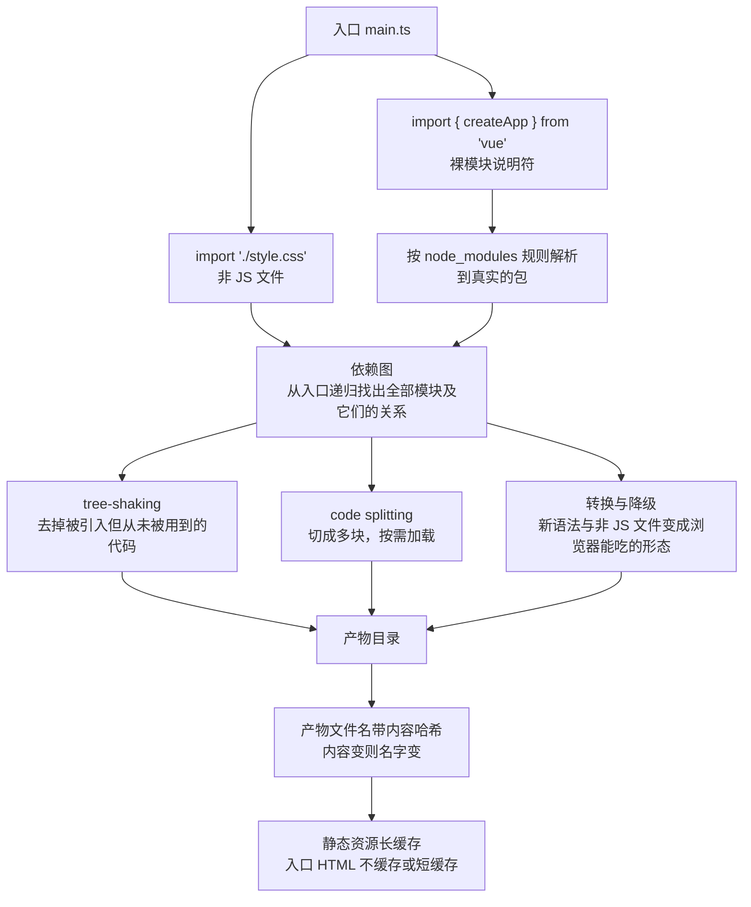
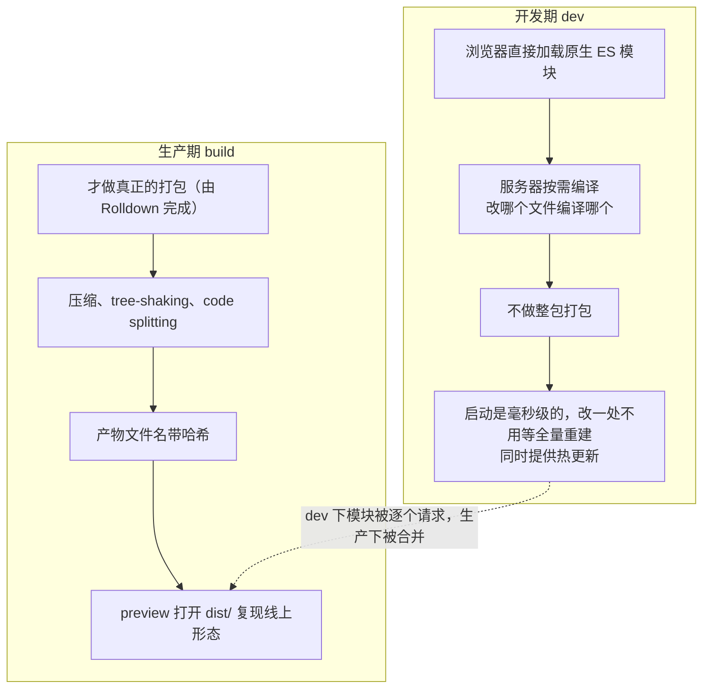
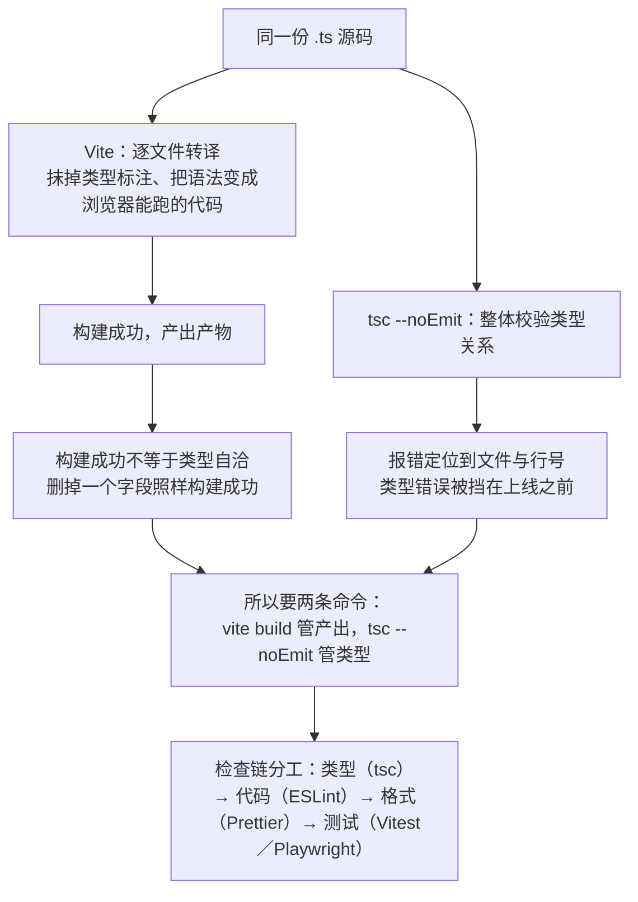

# M6 前端工程化

> 一句话：本模块解决的是「代码从**一个文件**变成**一个项目**」之后的问题——让任何一台机器、任何一个人拿到你的仓库后，能装出同样的依赖、跑出同样的产物、在提交前被同一套检查拦住；构建工具只是这套默认动作里最容易被误当成主角的一环。
> 对应《Web 前端技术》课程大纲模块 M6（[[00-课程大纲]]）。

## 0. 这一块是怎么来的（历史一则）

2009 年，Node.js 出现。它常被说成「让 JavaScript 能写服务端」，但对前端来说真正的影响是另一件事：**前端工具链终于能用同一种语言写了**。在这之前，压缩、打包、语法转换这类工具大多要用前端工程师不熟的另一种语言实现，想改一行构建配置，先得搭一个自己看不懂的环境。

2012 年 3 月，Webpack 发布。它把「一个入口文件 → 顺着 import 找到全部依赖 → 输出若干产物」这套模型做成了通用可配置的工具，此后很多年前端工程的默认形态就是一份 Webpack 配置文件。同年 10 月 1 日，TypeScript 公开了 0.8 版。

这里有一个**值得当堂讲的细节**：TypeScript 的 1.0 通常说成「2014 年发布」，但你去翻不同来源，具体日期是互相矛盾的。**二手来源对不上时，正确做法不是赌哪一个对，而是把口径降级**：讲课时只说「2014 年发布 1.0」，不写具体日期，并在备课本上记下这处分歧。这就是本模块要培养的素养的一部分——版本、日期、结论都要能追到一手来源（官方文档、包注册表、本机实测），追不到就降低表达的确定性。

2020 年 2 月，Evan You 等人发布 Vite。它换了一条路：开发期不再「先打包再启动」，而是让浏览器直接加载原生 ES 模块、由服务器按需编译（详见 §3.4）。**此后构建工具整体走向原生实现**——esbuild、SWC、Oxc 这类用编译型语言写的工具，把「用 JS 写工具、跑不动了再想办法」的路线换掉了；Vite 8 的生产打包交给 Rolldown，也在这条线上。


## 1. 教学目标

### 1.1 三层目标（全部用可考核的行为动词写）

| 维度 | 目标（课堂上可当场检验） |
|---|---|
| 知识 | ① **默写** `package.json` 中 5 个必懂字段并说明各自作用（`name`/`type`/`scripts`/`dependencies`/`devDependencies`）<br>② **判断** `^3.5.43`、`~3.5.43`、`3.5.43` 三种写法分别允许装到什么范围<br>③ **列出**构建工具解决的 4 类问题，并对每一类举一个不构建就会失败的最小例子<br>④ **解释**「Vite 开发期不打包、生产期才打包」这句话的技术含义<br>⑤ **说出**为什么 `node_modules` 不能提交而 lockfile 必须提交，两者理由不是同一个<br>⑥ **区分** `any` 与 `unknown` 的边界，并说明 `strict` 打开后哪些写法会直接报错<br>⑦ **说出** ESLint、Prettier、Biome 三者在职责上的分界 |
| 能力 | ① 从零用脚手架建立 Vite + TypeScript 工程，**两条命令内**跑通 dev / build / preview，并能逐条解释生成目录里每个文件为何存在<br>② **手写**不超过约 50 行的脚本，把两个互相 import 的模块合成一个文件，并在讲台上说明它替浏览器做了哪三件事<br>③ **故意**写一个类型错误，用 `tsc --noEmit` 把它抓到，并在 CI 或钩子里复现同一结果<br>④ 为一个真实项目写出 `.gitignore`，至少挡住 4 类不该入库的文件<br>⑤ **读懂**一条构建报错，定位到具体文件的具体行并说出修法 |
| 素养（工程规范） | ① **可复现优先**：拒绝「在我机器上是好的」，用 lockfile 与固定 Node 版本说话<br>② **最小暴露**：默认「凡是打进前端产物的东西，用户都能看到」，密钥一律不进源码<br>③ **可检查**：能自动化的检查绝不靠自觉，类型检查与格式检查必须在提交前自动跑<br>④ **可协作**：提交信息说清「为什么改」，分支与评审让改动可被讨论<br>⑤ **降级表达**：来源不一致时降低确定性，不乱写日期、编号、出处 |

### 1.2 学完本模块应能独立完成的一件事

**拿到一台只装了 Node v26.7.0 与 git 的机器，独立从零交付一个可提交的工程骨架**：用脚手架建立 Vite + TypeScript 项目，跑通 dev / build / preview 三条命令，配好 lint 与格式化，写好 `.gitignore` 与 `.env` 规则，让类型检查与代码检查在提交前自动执行，并用一条命令产出带内容哈希的构建产物。

## 2. 学时分配与讲授节奏

合计 **450 分钟 = 10 学时 × 45 分钟**（讲授 270 + 实验上机 180）。

| 序 | 主题 | 讲授分钟 | 实验上机分钟 | 教学形式 |
|---|---|---|---|---|
| 1 | 为什么需要构建：裸模块说明符、非 JS 文件、新语法、请求数与体积 | 45 | 0 | 讲授 + 现场对比「不构建 vs 构建」 |
| 2 | Node 与包管理：package.json 各字段、semver、lockfile、deps 与 devDeps、npm 与 pnpm | 45 | 0 | 讲授 + 现场改版本号看装出来什么 |
| 3 | 模块格式与打包器职责：ESM 与 CJS、`type: module`、依赖图、tree-shaking、code splitting、产物哈希与缓存 | 45 | 0 | 讲授 + 现场读产物文件名 |
| 4 | Vite 的两阶段与环境变量：开发期原生 ESM 按需编译、生产期由 Rolldown 打包、`VITE_` 前缀、多环境 | 45 | 0 | 讲授 + 双窗口对比 dev 与 preview |
| 5 | TypeScript 与检查链：类型标注、interface 与 type、泛型、联合与收窄、类型守卫、any 与 unknown、strict、declare 文件；类型检查与转译分离（`tsc --noEmit`） | 45 | 0 | 讲授 + 现场制造类型错误 |
| 6 | 质量与协作：ESLint / Prettier / Biome 分工、Git 分支策略与提交信息、PR 与评审、pre-commit 钩子、`.gitignore`、Source Map 与调试 | 45 | 0 | 讲授 + 现场改坏再修 |
| 7 | 实验一：从零建 Vite + TS 工程，跑通 dev / build / preview | 0 | 90 | 上机，教师巡场逐个验收 |
| 8 | 实验二：手写最小 bundler，把两个互相 import 的模块打成一个文件 | 0 | 45 | 上机 + 成品当堂互评 |
| 9 | 实验三：制造类型错误并证明检查链抓得到 | 0 | 45 | 上机 + 提交检查记录 |
| — | **合计** | **270** | **180** | **450 分钟** |

> 节奏提醒：序 1 到序 6 每次课讲两块、留 5 分钟回顾；**不要把实验全部堆到学期末**——实验一必须在序 2 讲完后的当周做，否则学生会用「背下来的命令」冒充理解。

## 3. 逐节讲授要点

### 3.1 为什么需要构建（对应序 1）

**要讲什么**

- 构建要解决的四类问题，每一类都要举「不解决会怎样」的最小例子：
  1. **裸模块说明符**：`import { createApp } from 'vue'` 里的 `'vue'` 浏览器不认识——它不知道要去 `node_modules` 里找，也不知道补什么路径与扩展名。
  2. **非 JS 文件**：`.css`、`.scss`、`.vue`、`.svg`、图片被 import 进来时，浏览器只会把它当 JS 解析。
  3. **较新的语法**：可选链、空值合并这类写法，在不支持的浏览器上直接是语法错误（不是运行时报错，是整个文件不执行）。
  4. **请求数与体积**：几百个小文件逐个请求，在网络层就是几百次往返；同时源码里带着注释、空格、没用到的分支，体积远大于实际需要。

**必须现场的演示**

1. 在终端起一个静态服务器（在页面所在目录执行 `python -m http.server 8000` 之类均可，浏览器访问 `http://127.0.0.1:8000/`；**不得用 `file://` 打开页面**），打开一个写着 `from 'vue'` 的页面，**打开控制台让学生念出第一条报错**（按 `Ctrl+Shift+J` 直接打开 Console）。不要替他们念。
2. 再把同一个页面用 `curl` 看它的原始响应，指出「服务器发出去的就是你写的源码，一个字节没少」。

**要提问学生的 3 个问题**

- 问：「`import { createApp } from 'vue'` 和 `import { createApp } from './vue.js'` 有什么本质区别？」
  - 期望答案：前者的 `'vue'` 是**裸模块说明符**，不是路径，浏览器无从解析；后者是相对于当前文件的真实路径。裸说明符必须由工具（Node 或打包器）按 `node_modules` 规则解析。
- 问：「为什么不支持的可选链会**整个文件**不执行，而不是那一行不执行？」
  - 期望答案：浏览器拿到的是整个脚本模块，解析阶段就先做语法检查，语法不合法则整个模块不被执行——所以「老浏览器上白屏」经常是语法层面的问题，不是逻辑 bug。
- 问：「如果我们什么都不构建，只是把文件数降到 5 个，是不是就够了？」
  - 期望答案：不够。省的是请求数，裸说明符、非 JS 文件、新语法三个问题一个都没解决；构建本质上是**编译**，不只是合并。

**学生一定会犯的错**

- 把「构建」等同于「打包压缩」，以为只是省体积。
- 看到 `file://` 打开报 CORS 错误，以为代码写错了。

### 3.2 Node 与包管理（对应序 2）

**要讲什么**

- [Node.js](https://nodejs.org/zh-cn) 的定位：**让 JS 脱离浏览器运行的运行时**，本课程只把它当工具链的宿主，不写服务端。
- `package.json` 各字段逐条读一遍（现场打开文件，不要放 PPT 截图）：`name`、`private`、`type`、`scripts`、`dependencies`、`devDependencies`、`engines`、`packageManager`。
- **semver 语义**：`主.次.修订`；主版本变 = 不兼容改动，次版本变 = 向后兼容的新功能，修订号变 = 修 bug。
- **判定依赖该放哪一档**（这是全课最高频的实际判断）：问自己一句「**这个包会被打进给用户的前端产物吗**」——
  - 会被打进产物的（Vue 3.5.43、React 19.3.0、`vue-router` 5.3.1、`pinia` 4.0.3、`zustand` 5.0.15、Tailwind 4.3.3 之类）→ `dependencies`；
  - 只在你写代码、检查代码、构建产物时用到的（TypeScript 7.0.2、Vite 8.3.1、ESLint 10.11.0、Prettier 3.9.9、Biome 2.5.15、Vitest 5.0.3、Playwright 1.63.0、sass 1.105.1）→ `devDependencies`。
- **lockfile 与 `node_modules` 的命运完全相反**：
  - lockfile 记录**实际装到的确切版本 + 整棵依赖树 + 校验信息**，必须提交——它是「可复现」的唯一凭据；
  - `node_modules` 是可再生的产物，体积大、含二进制、跨平台不通用、还可能被投毒，**绝不能提交**。
- **npm 与 [pnpm](https://pnpm.io/zh/) 的差别**（只讲机制差异，不讲谁更好）：
  - npm 的 `node_modules` 是每个项目一份的实体目录（npm 11.19.0 为本机口径）；
  - pnpm 12.8.1 用全局内容寻址存储 + 硬链接/符号链接，多项目共享同一份包内容，磁盘占用小、安装快，但**依赖必须显式声明**（不写进 `package.json` 就拿不到），这对学生其实是好事；
  - 换包管理器会换 lockfile 文件名（`package-lock.json` 与 `pnpm-lock.yaml`），**不要一个项目里两种 lockfile 并存**。

**必须现场的演示**

1. 改一次版本范围，看装出来什么：把某个依赖临时写成 `^` 与 `~` 两种形式安装，`npm ls` 对照结果。
2. 删掉 `node_modules` 再 `npm ci`（不是 `npm install`），指出「同样输入 → 同样输出」，并把 `npm ci` 与 `npm install` 的行为差别讲清。

**要提问学生的 3 个问题**

- 问：「lockfile 删掉行不行？仓库小一点不是更好吗？」
  - 期望答案：不行。删掉之后每个人装到的版本可能不同，「在我机器上是好的」就回来了；体积问题靠 `.gitignore` 挡住 `node_modules` 解决，不是靠删 lockfile。
- 问：「`eslint` 该放 `dependencies` 还是 `devDependencies`？理由是什么？」
  - 期望答案：`devDependencies`。它不参与前端产物的运行，只在你检查和构建时出现；放错档会让别人 `npm i --production` 时白装一堆东西。
- 问：「`npm ci` 和 `npm install` 有什么区别？」
  - 期望答案：`ci` 严格按 lockfile 装、不修改 lockfile，专供自动化和干净复现；`install` 会在需要时更新 lockfile。

**学生一定会犯的错**

- 把 `node_modules` 提交进仓库（或反过来把 lockfile 加进 `.gitignore`）。
- 手工把依赖版本号改成 `latest` 或删掉前缀。

### 3.3 模块格式与打包器职责（对应序 3）

**要讲什么**

- **ESM 与 CJS 的互操作**：ESM 用静态的 `import`/`export`，CJS 用运行时的 `require`/`module.exports`。
  - ESM 能 `import` CJS（默认导出会被当成整个 `module.exports`）；
  - CJS **不能**同步 `require` 一个 ESM（只能走动态 `import()`），这是很多「明明装好了却报 ERR_REQUIRE_ESM」的根因；
  - 一句话判据：**能静态分析就能被打包器优化，运行时才知道就只能照搬**。
- **`type: "module"`**：写在 `package.json` 里，决定 `.js` 后缀按哪种格式解析；没有它，`.js` 默认按 CJS 解析，于是 `import` 报错。`.mjs` / `.cjs` 可以逐文件覆盖这个默认。
- **打包器的五项职责**（每一项都要给出产物层面的观察点）：

| 职责 | 做什么 | 现场怎么观察 |
|---|---|---|
| 依赖图解析 | 从入口递归找出全部模块及它们的关系 | 产物里出现了你没直接 import 的文件内容 |
| tree-shaking | 去掉「被引入但从未被用到」的代码 | 引入整个库 vs 只引一个函数，产物体积对比 |
| code splitting | 把代码切成多块，按需加载 | 产物目录里多出若干按路由或动态 import 命名的文件 |
| 产物哈希 | 文件名带上内容哈希，内容变则名字变 | 改一个字重新构建，文件名变化 |
| 转换与降级 | 把新语法、非 JS 文件处理成浏览器能吃的形态 | 源码 `.scss` 变成了产物 `.css` |

- **哈希与缓存的关系**（学生最容易漏的一环）：哈希让「不变的资源」可以被浏览器长期缓存；因此入口 HTML 必须**不缓存或短缓存**，否则用户永远拿到旧文件名。哈希 + 长缓存 + HTML 短缓存才算闭环。



> **图 1**：从入口到产物的构建路径与打包器的五项职责。看图要点：产物里会出现你没有直接 import 的模块内容，这就是依赖图解析到位；哈希是「内容变则文件名变」的凭据，但它必须配合入口 HTML 不缓存才构成闭环。

**必须现场的演示**

- 构建两次：第一次不改代码，第二次改一行字符串，对照 `dist/` 文件名。要求学生说出「为什么不能让 HTML 也长期缓存」。
- 现场把 `import { chunk } from 'lodash'` 与整体引入做一次体积对比（可用构建输出的体积提示或 `esbuild` 0.28.2 的打包输出做快速对照）。

**要提问学生的 3 个问题**

- 问：「产物加了哈希，那缓存全部设成一年行不行？」
  - 期望答案：静态资源可以（内容变则文件名变），但 HTML 不行——HTML 是入口，它被缓存住的话用户永远不知道新文件名存在。
- 问：「tree-shaking 生效的前提是什么？」
  - 期望答案：模块依赖能被静态分析（ESM）、以及库本身写出了无副作用声明；动态拼接的引入方式会让它失效。
- 问：「`type: module` 不写，就一定会报错吗？」
  - 期望答案：不一定。取决于你在文件里用什么语法、以及工具怎么解析；但用 `import` 却按 CJS 解析就是典型报错场景。它是**显式声明**，能省掉一类「环境猜错」的问题。

**学生一定会犯的错**

- 认为 code splitting 是「自动变快」，不理解它换来了额外的请求。
- 混用 `require` 与 `import`，靠报错提示反复试错而不理解格式边界。

### 3.4 Vite 的两阶段与环境变量（对应序 4）

**要讲什么**

- **两阶段模型**（本节是全模块的核心）：
  - **开发期**：浏览器直接加载原生 ES 模块，服务器**按需编译**（改哪个文件编译哪个），不做整包打包——所以启动是毫秒级的，改一处不用等全量重建；同时提供热更新。
  - **生产期**：才做真正的打包、压缩、tree-shaking、code splitting、产物哈希。[Vite](https://vite.dev/guide/) 8.3.1 的生产打包由 **Rolldown** 完成，与 dev 期的路径不同。
  - 由此推出一个必须讲清的后果：**dev 下的行为不能当成生产行为**。dev 下模块被逐个请求，生产下被合并；只在生产出现的顺序问题、只在大文件里出现的体积问题，都要在 **preview** 里复现。
- **环境变量与多环境**：
  - 只有以 **`VITE_` 前缀** 开头的变量会被注入到客户端代码，其余前缀（包含习惯上拿来放密钥的名字）**读不到**；
  - 但不要把它当安全机制：**只要它进了前端产物，用户就能看到**，前缀只是「允许暴露」的白名单，不是加密；
  - `.env`、`.env.local` 等文件一律**不入库**（`.gitignore` 挡住），提交 `.env.example` 交代需要哪些变量名；
  - 多环境用「文件 + 模式」组织：开发、预发、生产各一套变量，构建时按模式加载。



> **图 2**：Vite 的两阶段——开发期用原生 ES 模块按需编译、不打包；生产期才打包并由 Rolldown 完成，产物带哈希。看图要点：两条路径不同，所以 dev 下的行为不能当成生产行为；只在生产出现的顺序问题、体积问题，都要在 preview 里复现。

**必须现场的演示**

1. 并排两个窗口：左边 dev（终端跑 `npm run dev`），右边 preview（先跑 `npm run build`、再跑 `npm run preview`）。当场改一处样式与一处数据加载，让学生看着两边行为不同步——由此理解「dev 快但不等价」。
2. 加一个**不带 `VITE_` 前缀**的变量，在源码里读它，得到 `undefined`；再改成带前缀，立刻读到。**全过程不要讲解，先让他们看到结果**。
3. 打开 `dist/` 目录，指出「你的源码已经被改写过了」。

**要提问学生的 3 个问题**

- 问：「为什么 Vite 开发这么快？」
  - 期望答案：开发期不走整包打包，浏览器按原生 ES 模块逐个请求，服务器只按需编译被请求到的文件；省掉的是「每次启动都重建全量产物」这件事。
- 问：「我把接口密钥写成 `VITE_API_KEY`，用户就看不到啦，对吧？」
  - 期望答案：错。带前缀只代表**允许被注入客户端**，产物里是明文；正确做法是密钥留在服务端，前端用代理或后端服务转发。
- 问：「我怎么确认真的跑在和生产一样的行为上？」
  - 期望答案：先 build，再用 `preview` 打开 `dist/`；上线前还要在这个形态下过一遍关键流程。

**学生一定会犯的错**

- 以为 Vite 会做类型检查（见 §3.6，这是最顽固的一个）。
- 把 `.env` 提交进仓库，还理直气壮说「里面没什么秘密」。

### 3.5 TypeScript 类型系统（对应序 5）

**要讲什么**（讲够用就好，框架部分再深挖）

- **类型标注**：给参数、返回值、变量加类型；用上类型推断后，大部分局部变量不需要手写。
- **`interface` 与 `type` 的边界**：对象形状描述两者都能做；需要**声明合并**（同名 interface 自动合并）或描述类契约时用 `interface`；需要**联合类型、元组、条件类型**这类组合表达时用 `type`。课堂上不要争论「哪个更好」，只讲「什么场合选哪个」。
- **泛型**：类型作为参数传入，让函数/容器对多种类型都保持类型信息（判据：**「返回类型依赖入参类型」时就需要泛型**）。
- **联合与收窄**：`'idle' \| 'loading' \| 'done'` 这类联合是前端最有价值的用法之一；分支判断后类型自动收窄。
- **类型守卫**：用返回 `boolean` 且带类型谓词的函数，或 `in`、`typeof`、字面量判断，把宽类型收窄到具体分支。
- **`any` 与 `unknown` 的边界**：`any` 关掉检查、错误会流到运行时；`unknown` 是「还不知道是什么」，**必须先收窄才能使用**。判据：**接收外部数据（接口响应、localStorage、第三方回调）用 `unknown`，永远不用 `any`**。
- **`strict` 必开**：它是多项严格检查的总开关，关掉它就等于放弃了这层检查的价值；类型报错是**免费的 bug 检查**，不是老师在找麻烦。
- **`.d.ts` 声明文件**：为「没有类型的 JS 库」「全局注入的变量」「非代码资源」补类型；要能读懂报错里那种「找不到模块 xxx 的类型声明」并知道去哪里补。

**必须现场的演示**

- 当场写一段处理接口响应的代码：先用 `any` 一路顺手，再把数据源改成 `unknown`，让编译器逼你写收窄——**不写收窄，代码根本跑不下去**，这就是它的价值。
- 打开 `tsconfig.json` 里 `strict` 相关项，关掉再打开，看同一份代码报错数量变化。

**要提问学生的 3 个问题**

- 问：「`unknown` 比 `any` 麻烦这么多，为什么还要用它？」
  - 期望答案：`any` 把检查权交出去，错在运行时才炸；`unknown` 逼你在边界处确认形状，错误提前到写代码时。
- 问：「什么情况下必须用泛型？」
  - 期望答案：返回值的类型取决于入参类型，而你又不想为每种类型各写一个版本时。
- 问：「联合类型 + 收窄，比起写两个函数，好处在哪？」
  - 期望答案：状态空间的组合被类型系统枚举出来，漏掉的分支会被编译器指出来；重构时改动会被检查兜住。

**学生一定会犯的错**

- 见红就上 `any`（最常见的「让报错消失」手法之一）。
- 为了通过编译把 `strict` 关掉，从此所有类型错误都消失了。

### 3.6 类型检查与转译分离（对应序 5，单独强调）

**要讲什么**

- 这是本模块**最容易被误解的一句话**：**Vite 只转译，不做类型检查**。它把 `.ts` 里的类型标注抹掉、把语法变成浏览器能跑的代码，但**不校验类型是否自洽**——因为逐文件转译没法知道另一个文件的类型。
- 所以必须**单独跑类型检查**：在项目根目录跑 `npx tsc --noEmit`（只检查、不产出文件），并把它挂进 `scripts`（例如放进 `build` 前置、放进 pre-commit、放进 CI）；TypeScript 手册见 [TypeScript 官方手册](https://www.typescriptlang.org/docs/handbook/intro.html)。
- 由此形成的检查链分工要讲清：**类型检查（tsc）管类型自洽 → 代码检查（[ESLint](https://eslint.org/docs/latest/use/getting-started)）管会不会出错 → 格式化（[Prettier](https://prettier.io/docs/)）管好不好看 → 测试（[Vitest](https://vitest.dev/guide/) / [Playwright](https://playwright.dev/docs/intro)）管行为对不对**。四层各管一段，谁都不能替代谁。
- 反面案例：项目里「一切正常」，直到有人删掉一个字段，产物照样构建成功，线上才炸——因为从没人跑过 `tsc --noEmit`。



> **图 3**：Vite 只转译、不做类型检查，所以类型检查必须单独跑一条命令。看图要点：同一份源码走两条路——转译那条只管能不能跑，类型检查那条才管对不对；构建成功不等于类型自洽，这正是要把 `tsc --noEmit` 挂进 `scripts` 与 pre-commit 的原因。

**必须现场的演示**

- 当堂写下一行类型错误（例如把 `number` 传给只接 `string` 的参数），
  1. 先跑 `vite build`（在项目根目录用 `npx vite build` 或 `npm run build`）：**构建成功**——学生这时会惊讶；
  2. 再跑 `tsc --noEmit`：**报错定位到文件与行号**；
  3. 把这条检查写进脚本，再犯一次同样的错，证明它会被自动拦住。

**要提问学生的 3 个问题**

- 问：「构建过了是不是就说明代码没问题？」
  - 期望答案：不是。构建过只说明能转译与打包，类型是否自洽、逻辑是否对，它不管。
- 问：「为什么类型检查不能塞进转译里一起做？」
  - 期望答案：转译是逐文件、可以并行的；类型检查需要看到整个工程的类型关系，天然更慢、更全局。分开也让编辑器的反馈和构建的反馈各自更快。
- 问：「`--noEmit` 是干什么的？」
  - 期望答案：只做检查、不输出 `.js` 文件，避免类型检查的产物和打包器的产物打架。

**学生一定会犯的错**

- 以为构建通过 = 类型没问题（**最顽固的误区**）。
- 装了 `typescript` 却从不执行 `tsc`，`tsconfig.json` 里 `strict` 还开着也只是摆设。
- 用 `// @ts-ignore` 或 `as any` 抹掉报错，而不是修根因。

### 3.7 代码质量工具分工与 Git 协作规范（对应序 6）

**要讲什么**

- **三个工具，三段职责**（判据一句话说清）：

| 工具 | 管什么 | 一句话判据 | 典型规则举例 |
|---|---|---|---|
| ESLint 10.11.0 | 代码**对不对**（可能出错、可能有害的写法） | 「这条规则能指出一个 bug 风险吗」 | 用了未定义变量、Promise 没处理、React 依赖数组不全 |
| Prettier 3.9.9 | 代码**好不好看**（纯格式） | 「这条规则只是在争论排版吗」 | 引号、分号、缩进、换行、每行宽度 |
| [Biome](https://biomejs.dev/) 2.5.15 | 上面两件事**二合一** | 「想少装两套配置、想快」 | 一套配置同时给 lint 与格式化 |

- **Git 协作规范**（[Pro Git 中文版](https://git-scm.com/book/zh/v2)）：
  - 分支策略：主干稳定，功能走短分支，合并前必须过检查；
  - 提交信息：一句话说清**为什么改**，而不是「改了一下」「fix」；一条提交只做一件事（终端里典型三步：`git status` 看改动 → `git add <文件>` 暂存 → `git commit -m "<为什么改>"`）；
  - PR 与代码评审：PR 描述写清「改了什么 / 为什么 / 怎么验证」，评审看的是意图与风险，不是格式（格式交给工具）；
  - **pre-commit 钩子**：把类型检查、代码检查、格式化检查挂在提交前，让标准不靠自觉——挂在钩子里的检查要快，耗时长的（如全量测试）留给 CI；
  - **`.gitignore` 要挡住两类东西**：
    - 可再生的运行数据（`node_modules`、`dist`、构建缓存、测试产物、本地日志）；
    - **可能带密钥与本地状态的**（`.env*`、本地证书、编辑器配置里含敏感信息的部分）。
  - 提交前自问一句：**「这个文件里有没有密钥、有没有别人的机器上不成立的东西？」**

**必须现场的演示**

- 故意提交一次「带 `.env` 的仓库」，让 git 状态告诉大家这个文件进去了；然后补救（撤销提交、写入 `.gitignore`、**并强调密钥一旦推上去就等于泄露，必须立即更换**——删文件不等于撤回）。
- 现场配一个 pre-commit 钩子（在 `.git/hooks/pre-commit` 里写一段脚本，跑 `npx tsc --noEmit` 与代码检查、失败就 `exit 1`；Windows 下用 Git Bash 给它加可执行权限）：把带类型错误的代码拿去提交（终端里 `git add` 后 `git commit`），被拦下；修好再提交，通过。
- 让 Prettier 与 ESLint 各改一次同一文件，观察「谁改什么」。

**要提问学生的 3 个问题**

- 问：「为什么密钥写在源码里，前端用户就一定看得到？」
  - 期望答案：源码会被构建进产物并发送到浏览器，任何访问者都能在产物的 JS 里搜到；就算压缩混淆，字符串依然在那里。
- 问：「我把提交重新撤销了，密钥就安全了吧？」
  - 期望答案：不。提交历史、缓存、别人的本地克隆、CI 日志里都可能留有副本；正确动作是**立即轮换密钥**，再清理历史。
- 问：「pre-commit 里该放什么、不该放什么？」
  - 期望答案：放快速、确定、与本次改动强相关的检查（类型、lint、格式、暂存文件范围）；不放几分钟起步的全量测试与部署。

**学生一定会犯的错**

- 提交信息全是「更新」「修复」，半年后自己看不懂。
- 一个提交里混入格式重排 + 功能修改，评审无法分辨。
- 靠「记得」运行检查，而不是靠钩子。

### 3.8 Source Map 与调试（对应序 6）

**要讲什么**

- 生产产物的代码已经不是你写的代码（合并、压缩、改名），**Source Map 就是产物与源码之间的映射表**，让浏览器调试器能显示原始位置。
- **怎么开**：构建配置里生成 sourcemap；**要不要随产物一起部署到线上**是安全权衡——线上开着，等于把源码结构送给访问者；常见做法是**生成但不上传公开目录**，只在内部错误监控平台使用。
- **怎么用**：按 `F12` 打开开发者工具（[DevTools 文档](https://developer.chrome.com/docs/devtools/)）→点 Sources →在左侧文件树里展开原始源码目录；产物入口旁会出现原始源码目录，断点直接打在 `.ts` 文件上（`F8` 继续、`F10` 单步跳过、`F11` 进入、`Shift+F11` 跳出）。

**必须现场的演示**

- 在产物模式下触发一个错误（按 `Ctrl+Shift+J` 打开 Console 看堆栈），让学生看到「堆栈全是压缩后的列号」，打开 Source Map 后再看一次同样的错误——位置直接指回 `.ts` 文件。

**要提问学生的 2 个问题**

- 问：「Source Map 能不能让用户看到我的源码？该不该传到线上？」
  - 期望答案：会。它包含足够还原源码结构的信息；是否公开取决于你的权衡，常见做法是限制访问范围。
- 问：「线上出了问题，你怎么判断是构建配置的问题还是源码的问题？」
  - 期望答案：先用 preview 复现生产形态，再看错误位置是否能映射回源码，并核对环境变量与资源路径。

**学生一定会犯的错**

- 线上不生成 Source Map，出了错只能对着压缩代码猜。
- 反过来把 Source Map 和源码一起公开，毫无察觉。

### 3.9 安全视角：依赖即攻击面（插入节 · 建议 20 分钟）

> **定位**：§3.2 讲完 Node 与包管理、§3.8 讲完 Source Map 之后接本节——原来只有两个字的"投毒"与"密钥"，在这里展开成完整一节。完整内容见 [[22-前端安全专章（OWASP × ATT&CK）]] §6–§7。

**（1）2025 年必须改掉的口径**：OWASP Top 10:2025 已把 2021 版第 6 名「Vulnerable and Outdated Components」**升级为第 3 名的 Software Supply Chain Failures**——含义从"我的组件过期了"变成"**整条供应链都可能是攻击面**"。

**（2）供应链的六个环节（板书建议照抄 22 号图 3 的分组）**：包名层（拼写相似包名／幻觉包名）→ 解析层（dependency confusion）→ 安装期（安装脚本可执行任意命令）→ 维护者层（账号被攻破／恶意交接）→ 分发层（CDN 与第三方脚本）→ 构建产物层。
**其中四个与"包本身写得好不好"无关**：包名、解析、维护者、分发——所以"这个包很流行"不是安全论据。

**（3）三个课堂可讲的真实事件**（均有一手来源，表格见 22 号 §6.1）：**event-stream**（2018-11，社会工程取得维护权后注入恶意依赖）｜**polyfill.io**（2024-06，域名易主后经 CDN 向访问者注入恶意 JS）｜**npm 蠕虫 Shai-Hulud**（2025-09，自复制、窃取凭据、波及 500+ 包，官方建议把依赖固定到 2025-09-16 之前的安全版本）。

**（4）学生马上能做的六件事**：提交 lockfile 且 CI 用 `npm ci`｜新增依赖前先审（传递依赖数、最近发布时间、有无安装脚本）｜第三方脚本最小化并上 SRI｜跑 SCA 与 SBOM（Dependency-Check／Dependency-Track／CycloneDX）｜CI 禁止生命周期脚本｜不把"包很流行"当理由。

**（5）顺手补上密钥这条线**（接 §3.8 的 sourcemap）：把密钥放进前端**环境变量**再打进产物＝**公开发布**。要防的是渠道：`.env` 误提交、前缀变量进产物、**生产环境发布 sourcemap**、CI 日志、错误信息与调试端点。

> **本节出处**：Top 10:2025 的类名与位次、三个事件的日期与处置、工具名均取自 22 号 §6–§7 已核实的一手来源；"六件事"的取舍与板书建议属教学编排。

## 4. 关键概念讲透

### 4.1 构建的本质：依赖图 → 产物

- **是什么**：构建 = 从入口出发，把「你写的、以及你引用的」全部模块按依赖关系组织起来，转换成浏览器能执行的少量文件。打包只是它的一种输出形态。
- **为什么这样设计**：浏览器只认 URL + 一种能执行的语法，而现代项目要有引用关系、有非 JS 资源、有更舒服的语法，这些差口必须有人在中间补上。
- **边界**：它**不是**语法检查、不是类型检查、不是测试。构建成功 ≠ 代码正确（§3.6 整节都在说这件事）。
- **最小示例**（仅示形态，≤10 行）：

```js
// 仅示形态：不构建时它在浏览器里跑不起来
import { createApp } from 'vue';   // 裸模块说明符
import './style.css';              // 非 JS 文件
```

- **一句判据**：**能静态分析依赖就要静态分析**——能被分析的才有机会被优化（tree-shaking / splitting / 哈希缓存），只能运行时才知道的，工具一律照搬。

### 4.2 Vite 的两阶段：开发不打包、生产才打包

- **是什么**：Vite 8.3.1 在开发期用**原生 ES 模块 + 按需编译**提供页面，在生产期走完整打包（由 Rolldown 完成），两条路径不同。
- **为什么这样设计**：开发期要的是**反馈快**（改一个文件只编译这一个），生产期要的是**产物优**（体积、请求数、缓存）。把两件事的目标分开，就不必用同一个慢流程同时满足两个目标。
- **边界**：dev 不等于生产——**dev 下不存在的顺序问题、体积问题、路径问题，都可能在 build + preview 后才出现**。上线前必须在 preview 形态下过一遍，这不是谨慎，这是流程。
- **最小示例**（仅示形态）：

```json
// 仅示形态：package.json 的三条脚本
{
  "scripts": {
    "dev": "vite",
    "build": "tsc --noEmit && vite build",
    "preview": "vite preview"
  },
  "devDependencies": { "vite": "^8.3.1", "typescript": "^7.0.2" }
}
```

- **一句判据**：**开发看速度，上线看产物**——凡是「我这能跑」，都先问一句「你是在 dev 还是 preview 里跑的」。

### 4.3 类型检查与转译分离

- **是什么**：转译 = 把 TS 的语法与类型标注剥掉变成 JS（快、逐文件）；类型检查 = 校验整个工程的类型关系（慢、全局）。Vite 做前者，`tsc --noEmit` 做后者。
- **为什么这样设计**：逐文件转译可以被并行、被缓存，是 dev 快速启动的前提；类型检查要看到跨文件的信息，只能单独、整体地做。两者分开，各自才能做到极致。
- **边界**：类型检查也**不是**测试——它能保证「形状对」，保证不了「逻辑对」「性能够」。检查链是分工，不是替代：类型 → lint → 格式化 → 测试。
- **最小示例**（仅示形态，故意写错）：

```ts
// 仅示形态：vite build 会成功，tsc --noEmit 会报错
function greet(name: string): string {
  return 'hi ' + name;
}
const n: number = 42;
greet(n);            // 类型错误：number 不能赋给 string 参数
```

- **一句判据**：**构建通过只代表能打包，`tsc --noEmit` 通过才代表类型自洽**。

### 4.4 可复现：semver + lockfile + 依赖分档是一套

- **是什么**：`package.json` 声明「你要什么范围」，lockfile 记录「实际装到了什么」，`.gitignore` 决定「什么不进仓库」，`dependencies`/`devDependencies` 决定「什么算运行时」。四件事共同回答一个问题：**换一台机器、换一个人，能不能装出一模一样的环境。**
- **为什么这样设计**：范围写法给了升级空间（便利），lockfile 给了确定性（可复现），两者缺一不可；把 `node_modules` 排除在外，是因为它可以从上面两者再生，提交它只会带来体积、二进制、跨平台与投毒风险。
- **边界**：**可复现 ≠ 永不升级**。升级是一次有意的、需要跑检查的动作（改范围、装、跑 `tsc --noEmit` 与检查、跑测试、评审），而不是让 `^` 悄悄替你决定。
- **最小示例**（仅示形态）：

```jsonc
// 仅示形态：package.json 片段
{
  "packageManager": "pnpm@12.8.1",
  "engines": { "node": ">=26" },
  "dependencies": { "vue": "^3.5.43", "vue-router": "^5.3.1", "pinia": "^4.0.3" },
  "devDependencies": { "vite": "^8.3.1", "typescript": "^7.0.2", "eslint": "^10.11.0", "prettier": "^3.9.9" }
}
```

- **一句判据**：**能自动重装出来的东西不进仓库，装不回来的结论必须留成 lockfile。**

## 5. 常见误区与诊断

| 学生症状 | 真实病根 | 课堂怎么纠正 |
|---|---|---|
| **把 `node_modules` 提交进仓库**，一提交几千个文件 | 把「装好的环境」当成需要保存的成果，不知道它是可再生产物 | 让他删掉 `node_modules`，从 lockfile 重装一次并跑通全部命令——「它自己会回来」；再对照仓库体积与历史记录里的二进制文件 |
| **嫌仓库太大就删掉 lockfile**，还把 `.gitignore` 改成忽略它 | 用「体积」解释「可复现」，没意识到删掉的是唯一凭据 | 现场演示 `npm install` 先看 lockfile，再删掉它装一次，让学生 `npm ls` 对照版本差异；把「在我机器上是好的」这句话写在黑板上当反面教材 |
| **把密钥写在源码里**（`const API_KEY = '...'`），认为「前端看不到」 | 不清楚源码会被构建进产物、明文送到浏览器 | 让学生构建后在 `dist/` 里搜这个字符串**当场搜到**；再讲轮换流程（推上去就等于泄露） |
| **以为 Vite 会做类型检查**，构建通过就认为没问题 | 把「构建成功」与「类型正确」混为一谈 | 当堂写一行类型错误 → `vite build` 成功 → `tsc --noEmit` 报错；把这条命令写进 `scripts.build`，让习惯替代观念 |
| **用 `!important` 强压样式**让页面「看起来对」 | 选择性、层叠规则没搞清，用最高优先级盖住症状 | 让他用开发者工具关掉自己的 `!important` 再问「哪条规则本来该赢」；回到选择器权重与样式加载顺序（M4 内容） |
| **关掉 `strict` 让报错消失**，或在 `tsconfig.json` 里一路放宽 | 把类型系统当障碍物，不当检查器 | 同一份代码在 `strict` 开/关下各跑一次 `tsc --noEmit`，数报错；强调放宽配置只是把问题推到运行时 |
| **见红就 `any`**，或大段 `// @ts-ignore`、`as any` | 不理解边界处该用 `unknown` + 收窄 | 强制把数据源标成 `unknown`，要求他写出收窄分支才能继续；让他解释每个 `any` 处「如果类型错了，会在哪一行炸」 |
| **靠记忆跑检查**，从不配钩子，PR 里靠评审抓格式问题 | 把规范当成个人自觉，而不是流程 | 现场配 pre-commit 并演示拦截；把评审时间从「数空格」挪到「讨论设计」 |

## 6. 本模块实验

> 三个实验共用一套环境：Windows 11 + Node v26.7.0 + npm 11.19.0（或 pnpm 12.8.1），编辑器任选，终端可用 Git Bash。提交物一律**只提交源码与配置**，绝不提交 `node_modules` 与 `dist`。
> 凡标注「编程」的任务，本节只给**任务、验收判据与评分要点**，完整代码由学生自己写；教师不提供可直接提交的成品。

### 6.1 实验一：从零建立 Vite + TypeScript 工程并跑通三条命令（90 分钟）

- **目的**：把序 1–4 的知识变成手上动作；用「逐条解释生成的文件」验证学生是否真的理解，而不是照抄命令。
- **环境**：干净目录；Node v26.7.0；npm 11.19.0；能联网装包（脚手架的官方说明见 [create-vite 脚手架](https://www.npmjs.com/package/create-vite) 与 [Vite 官方指南](https://vite.dev/guide/) ）。
- **任务描述**：
  1. 用官方脚手架建立一个 Vite + TypeScript 项目（在目标目录的上一级执行 `npm create vite@latest 项目名 -- --template vue-ts`，React 则用 `react-ts`；框架可选 Vue 3.5.43 或 React 19.3.0；不需要路由与状态管理）；
  2. 依次跑通 `dev`、`build`、`preview` 三条命令（npm：`npm run dev` / `npm run build` / `npm run preview`；pnpm：`pnpm dev` / `pnpm build` / `pnpm preview`），并**各留下一次终端输出**；
  3. 逐行注释 `package.json`：哪些字段是你写的、哪些是工具写的；标出每个依赖属于 `dependencies` 还是 `devDependencies`，并写一句理由；
  4. 写 `.gitignore`，至少挡住：`node_modules`、构建产物目录、`.env*`、日志/缓存；
  5. 写一份 `.env`（含一个 `VITE_` 前缀变量与一个不带前缀的变量），**用一个页面把两者的读取结果对比出来**；确认 `.env` 未入库；
  6. 初始化 git 仓库，按规范提交（提交信息说明「为什么」），提交历史里不得出现 `node_modules` 与 `.env`。
- **验收判据（学生可自测）**：
  - `dev` 能启动并显示页面；`build` 退出码为 0 且产出产物目录；`preview` 下页面与 dev 表现一致（用「改一处数据源，两边都看」验证）；
  - 在 `package.json` 中能指着任意字段说出作用，说不出即为未完成；
  - 不带 `VITE_` 前缀的变量在客户端读到 `undefined`，带前缀的能读到值——**两个结果都出现在你的截图或记录里**；
  - `git status` 干净时，`git ls-files` 中不含 `node_modules/`、产物目录、任何 `.env` 文件；
  - 删掉 `node_modules` 后能用一条命令重装并再次跑通 build。
- **提交物**：项目源码与配置（含 `package.json`、lockfile、`.gitignore`、`.env.example`）、`README.md`（含三条命令的输出与逐条解释）、一次规范提交的历史。
- **评分要点**：能解释 > 能跑通（30 分：三条命令与产物解释；25 分：依赖分档理由；20 分：`.gitignore` 与 `.env` 处理正确；15 分：提交信息质量；10 分：可复现性演示）。**任何提交了 `node_modules` 或 `.env` 的，本实验该部分直接不得分**（须完成补救动作后再评）。

### 6.2 实验二：手写一个最小 bundler（45 分钟，编程）

- **目的**：把「打包器做了什么」从听讲变成亲手做一次。要求最终产物能在浏览器里直接跑。
- **环境**：Node v26.7.0 脚本即可，**不引入任何打包库**（不许直接调 Vite / esbuild 0.28.2 / webpack 5.111.1 来完成打包）；不得使用第三方解析器。
- **任务描述**：
  1. 准备两个**互相 import** 的模块（例如 A 引用 B 的一个导出，B 引用 A 的一个导出），放在独立目录里，先验证它们在**不打包**时不能被浏览器直接跑起来；
  2. 写一个脚本（**建议不超过约 50 行**），从入口出发：
     - 读文件、用正则或等价手段找出该文件里的 import 语句；
     - 把每条 import 解析成统一的项目内路径（模块表），并把整份产物写成一个独立的 `.js` 文件；
     - 把每个模块的内容包进一个能拿到「它自己需要的依赖」的位置，并记录它导出的东西；
     - 按正确的顺序执行，并把入口模块的结果暴露出来；
  3. 在页面里加载产物文件，**功能行为必须与概念上的原模块一致**；
  4. 在 `README.md` 里写一段说明（3–8 行）：你的脚本替浏览器做了哪几件事，且**其中至少两件是浏览器无论如何都做不到的**。
- **验收判据（学生可自测）**：
  - 不打包直接加载 → 失败；加载你的产物 → 成功，且**行为与手工按顺序执行等价**（例如把两边模块里的一次计数或一次字符串拼接结果打印对照）；
  - 模块表里每个模块只出现一次，**循环引用不会导致栈溢出或死循环**；
  - 产物是**单文件**，不依赖任何外部运行库；
  - `README.md` 中写明了下述四件事：裸说明符/路径解析、作用域与导出的承载方式、依赖的加载顺序、为什么浏览器单独做不到；
  - 把你的产物与「正规打包器的产物」并排比较，列出**至少两处你的脚本做不到的事**（例如 tree-shaking、代码分割、哈希）。
- **提交物**：源模块、你的脚本、产物文件、对照说明、`README.md`。
- **评分要点**：能跑通且行为一致（35 分）；循环引用处理正确（20 分）；脚本结构可读、有注释（15 分）；`README.md` 中对「打包器做了什么」与「你的实现缺什么」的说明是否具体（20 分）；不违反「不得引入打包库」的约束（10 分）。**把别人的 bundler 包一层冒充手写的，按零分处理。**

### 6.3 实验三：制造类型错误并证明检查链抓得到（45 分钟，编程）

- **目的**：用一次可复现的失败，把「Vite 只转译、不做类型检查」这条观念钉死；顺带把检查挂进提交动作。
- **环境**：实验一建好的 Vite + TS 工程（TypeScript 7.0.2）；ESLint 10.11.0 或 Biome 2.5.15 任选一套；Prettier 3.9.9 可选。
- **任务描述**：
  1. **故意**写三处错误，每处都要留证据：
     - 一处**类型错误**（例如把 `number` 传给只接 `string` 的函数）；
     - 一处**联合类型漏收窄**（例如一个 `'idle' \| 'loading' \| 'done'` 的状态只处理了两个分支）；
     - 一处**检查器能抓的代码问题**（例如定义后未使用的变量、未处理的异步结果——按你选的检查器所支持的范围）；
  2. 对每一处，**先跑 `vite build`** 并记录结果，**再跑 `tsc --noEmit`** 并记录结果，做一张「构建结果 vs 类型检查结果」的对照表；
  3. 在 `package.json` 里让类型检查成为构建或提交的必经一步（三条脚本至少要有一条会因此失败）；
  4. 配一个 pre-commit 钩子：带错误提交 → 被拦下 → 修好后提交成功，两个截图都要留下；
  5. 把错误全部修掉（**不许用 `any`、`@ts-ignore`、`as any`，也不许改 `tsconfig.json` 放宽 `strict`**），并说明每一处的修法与修的是不是根因；
  6. 写 3 行结论：为什么构建能过而类型检查不能过，以及这条检查链在团队里的价值。
- **验收判据（学生可自测）**：
  - 三处错误都有「构建通过 / 类型检查或代码检查报错」的成对证据；
  - `tsc --noEmit` 的报错信息**能定位到具体文件与行**，且你抄录了原文；
  - pre-commit 拦截记录存在，且「修好后能提交成功」；
  - 最终状态下 `tsc --noEmit` 与检查器都无报错，且 `git diff` 里**不含** `any`、`@ts-ignore`、`strict: false` 之类的逃逸手段；
- **提交物**：错误证据与修复对照表、钩子配置、前后两次提交记录、结论 3 行（含对失败与修复的说明）。
- **评分要点**：证据完整度（30 分）；修复是否触及根因、有无逃逸手段（30 分）；钩子与脚本接线正确（20 分）；结论的准确性与表达（20 分）。**凡是用 `any` / `@ts-ignore` / 关掉 `strict` 让报错消失的，本实验按未完成处理。**

## 7. 本模块作业与自测题

> 每题标注三件事：`[对应节] [认知层次：记忆/理解/应用/分析/评价] [难度 ★–★★★]`。编程题只给验收判据与评分要点，不提供可直接提交的完整代码。

**题 1（选择）** `[§3.2] [记忆] [★]`
下列哪个文件**必须**提交进 Git 仓库？
A. `node_modules/`　B. lockfile（`package-lock.json` 或 `pnpm-lock.yaml`）　C. 构建产物目录　D. `.env`
> 答案要点：B。A、C 是可再生产物，D 含本地/敏感配置；lockfile 是「可复现」的唯一凭据。

**题 2（选择）** `[§3.2] [理解] [★]`
`"vue": "^3.5.43"` 允许自动安装到的最高范围是：
A. 任意 3.x 及以上的版本　B. 3.5.x　C. 3.x.x（不跨主版本）　D. 只能是 3.5.43
> 答案要点：C。`^` 不跨主版本；`~` 才是 3.5.x；不写前缀才是锁定单版本。

**题 3（简答）** `[§3.1] [理解] [★★]`
说出构建工具解决的**四类**问题，每类各举一个「不解决就会失败」的最小例子。
> 答案要点：裸模块说明符（`from 'vue'` 浏览器无法解析）、非 JS 文件（import `.css` / `.vue`）、较新的语法（不支持时整个模块不执行）、请求数与体积（数百个小文件与远超必需的源码）。

**题 4（简答）** `[§3.4] [分析] [★★]`
为什么 Vite 开发快？为什么又必须用 `build` + `preview` 才能判断线上表现？
> 答案要点：dev 期浏览器加载原生 ES 模块、服务器按需编译单文件，不做全量打包；生产期要打包、压缩、切分、加哈希，模块合并与加载顺序都变了，所以只有 preview 形态才逼近线上。

**题 5（简答）** `[§3.6] [分析] [★★]`
「Vite 只转译，不做类型检查」——请解释这句话，并说明它带来的两个具体后果。
> 答案要点：转译逐文件抹掉类型与语法，不校验跨文件类型关系；后果：① 构建成功不代表类型自洽，必须单独跑 `tsc --noEmit`；② 没人跑类型检查时，字段被删改也能构建通过，问题推到了线上。

**题 6（读代码）** `[§3.3] [分析] [★★]`
读下面这段（仅示形态）：

```js
// util.cjs
module.exports = { id: (x) => x };
// main.js（package.json 中没有 type: module）
import { id } from './util.cjs';
console.log(id(1));
```
问：这段代码在按 CJS 解析的 `.js` 里会出什么问题？三种改法分别是什么？
> 答案要点：`.js` 未声明 `type: module` 时按 CJS 解析，`import` 语法不合法。改法任选：① 在 `package.json` 加 `"type": "module"`；② 把文件改名为 `.mjs`；③ 改用 CJS 的 `require`（若模块本身打算按 CJS 用）。要能指出改法③与「ESM 能 import CJS、CJS 不能同步 require ESM」的边界。

**题 7（读代码）** `[§3.5] [分析] [★★★]`
读下面这段类型签名（仅示形态）：

```ts
function handle(input: unknown) {
  return input.length;      // 报错
}
function handle2(input: any) {
  return input.length;      // 不报错
}
```
问：为什么第一个报错、第二个不报错？哪个更安全，为什么？把第一个改成正确写法需要加什么？
> 答案要点：`unknown` 使用前必须收窄（`typeof input === 'string'` 或断言为具体形状），`any` 直接放弃检查。`unknown` 更安全，因为它把错误挡在编译期而不是运行时。正确写法要加类型守卫/收窄分支，并在分支里使用收窄后的类型。

**题 8（编程）** `[§6.2] [应用] [★★★]`
写一个脚本，把两个**互相 import** 的模块打成一个单文件；产物必须能在浏览器里直接运行。
> 验收判据：① 不打包时加载失败、加载产物成功；② 模块表中每个模块仅出现一次，循环引用不死循环；③ 产物单文件、不依赖外部运行库；④ `README.md` 说明脚本替浏览器做了哪几件事，并列出你的实现做不到的至少两件事（如 tree-shaking、code splitting、哈希）。评分要点：行为一致性、循环引用处理、脚本可读性、说明的具体程度；引入现成打包库完成打包的不得分。

**题 9（编程）** `[§3.6] [应用] [★★★]`
在你的项目里制造一处类型错误并让检查链抓住它。
> 验收判据：① 留下「`vite build` 通过 / `tsc --noEmit` 报错」的成对证据，报错能定位到文件与行；② 类型检查是构建或提交的必经一步；③ pre-commit 有拦截记录且修复后能提交；④ 修复不得使用 `any`、`@ts-ignore` 或放宽 `strict`。评分要点：证据完整度、修复是否触及根因、脚本接线正确性。

## 8. 自我检查清单

学完 M6，逐条打勾；打不出勾的先回到对应节，别往下走。

- [ ] 我能判断一个包该进 `dependencies` 还是 `devDependencies`，判据是一句话（§3.2）
- [ ] 我的仓库里没有 `node_modules`、没有产物目录、没有任何 `.env` 文件（§3.2/§3.7）
- [ ] 我能解释「Vite 开发期不打包」，并说出生产期的打包由 Rolldown 完成（§3.4）
- [ ] 我上线前会先 `build` + `preview`，而不是只信 dev（§4.2）
- [ ] 我知道**构建成功 ≠ 类型正确**，并且我的项目里有一条命令会跑 `tsc --noEmit`（§3.6）
- [ ] 我从没用关掉 `strict`、`@ts-ignore` 或 `!important` 来「让报错消失」（§3.5/§5）
- [ ] 我的密钥不在源码与 `.env` 里，且我知道推上去就等于泄露、要立即轮换（§3.7）
- [ ] 我的 pre-commit 会拦住类型与代码检查失败，不靠自觉（§3.7）
- [ ] 删掉 `node_modules` 后，我能用一条命令重装并再次跑通全部脚本（§4.4）

## 9. 出处与依据说明

### 9.1 出处表（仅白名单链接；未列白名单的资料只写名称）

| 本模块小节 | 结论/操作 | 依据（白名单） |
|---|---|---|
| §0、§3.4、§4.2、§6.1 | Vite 的开发期与生产期两条路径、构建与预览三条命令、Rolldown 负责生产打包 | [Vite 官方指南](https://vite.dev/guide/) |
| §3.1、§3.2 | 用脚手架建立 Vite 项目的官方入口与参数 | [create-vite 脚手架](https://www.npmjs.com/package/create-vite) |
| §3.5、§4.3 | 类型标注、interface 与 type、泛型、联合与收窄、类型守卫、any 与 unknown、strict、`.d.ts` | [TypeScript 官方手册](https://www.typescriptlang.org/docs/handbook/intro.html) |
| §3.5、§4.3 | 同上内容的中文版手册（同一版本的翻译） | [TypeScript 手册中文版](https://ts.nodejs.cn/docs/handbook/intro.html) |
| §3.7 | ESLint 的安装与启用方式、配置入口 | [ESLint 官方文档](https://eslint.org/docs/latest/use/getting-started) |
| §3.7 | Prettier 的定位（格式化）与配置方式 | [Prettier 官方文档](https://prettier.io/docs/) |
| §3.1、§4.1 | JavaScript 语言与模块相关的基础表述 | [web.dev Learn JS](https://web.dev/learn/javascript) |
| §3.2、§3.3、§3.6、§3.8 | 语义化版本与 lockfile 的角色、ESM/CJS 互操作、类型检查与转译分离、Source Map 与调试 | 见下方「教师经验判断」——本节内容以本机实测与官方文档名称为准，白名单内无直接对应页面 |

**只写名称、不给 URL 的表外资料**（课堂可让学生自行检索官方站点）：**Rolldown 官方文档**——其官方站点不在链接白名单内（见 [[15-实验与大作业指导]] §1.2），故只写名称。

> 说明：Node.js、npm、Git、Vite 官方文档（含环境变量与构建章节）、Biome、pnpm、TypeScript 官方文档（含 tsconfig 参考页）与 MDN 的模块及 Source Map 条目，其域名都在链接白名单内（nodejs.org、docs.npmjs.com、www.npmjs.com、git-scm.com、vite.dev、biomejs.dev、pnpm.io、www.typescriptlang.org、developer.mozilla.org），不再属于「只写名称、不给 URL」的表外资料；正文已对其中多数给出可点链接。

### 9.2 属于教师经验的编排判断、无官方直接依据

以下内容是本课程组的教学判断，**不是官方文档的结论**，备课时可依班级情况调整：

1. **讲授顺序**：先「四类问题」再讲工具、把 dev 与 preview 的差异当作口头禅反复问——这是提高学生迁移能力的编排选择，官方文档按功能组织，不按认知顺序组织。
2. **`dependencies` 与 `devDependencies` 的判定口诀**（「会不会被打进用户下载的 JS 里」）：官方文档给的是定义，这句口诀是为了让大一/大二学生一步就能判断，属教学简化。
3. **学时切分**（6 + 4，且把实验一紧跟在序 2 之后）：依据是本校学情与机房排课，非官方建议。
4. **检查链的四层分工表述**（类型 → lint → 格式化 → 测试）：是对各工具职责的归纳，不是任何一份官方文档的原文。
5. **误区表第 5 行（`!important`）与第 8 行（靠记忆跑检查）**：来自历年作业与机房观察的常见现象，属经验归纳。
6. **实验二的规模约束**（不引打包库、建议约 50 行、必须处理互相 import 的模块）：为了一节课内可完成而设的教学约束，非工程标准。
7. **版本口径**：本教案所有版本号取自包注册表的 `latest` 标签与本机实测（2026-10-01：Node v26.7.0、npm 11.19.0），非文档承诺；教学时以当学期实测为准，**换版本前先跑一遍本模块全部实验**。
8. **TypeScript 1.0 发布日期的口径降级处理**（§0）：因公开来源对具体日期存在分歧，本教案只说年份；这是本课程对「二手来源不一致怎么办」的处理示范，不构成对任一来源的判定。

> 配套：考核口径见 [[13-考核方案与评分量规]]，期末题型见 [[14-期末样卷与参考答案要点]]，实验与大作业的通用要求见 [[15-实验与大作业指导]]，版本演进与本模块的历史位置见 [[16-技术演进时间线]]，先修内容见 [[00-课程大纲]]（M4）。
