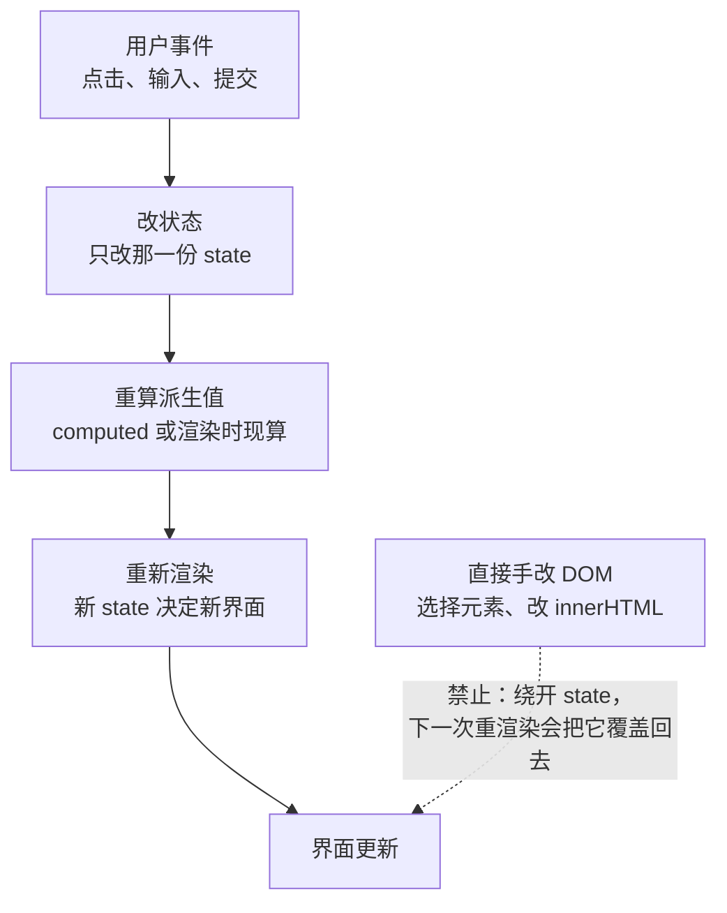
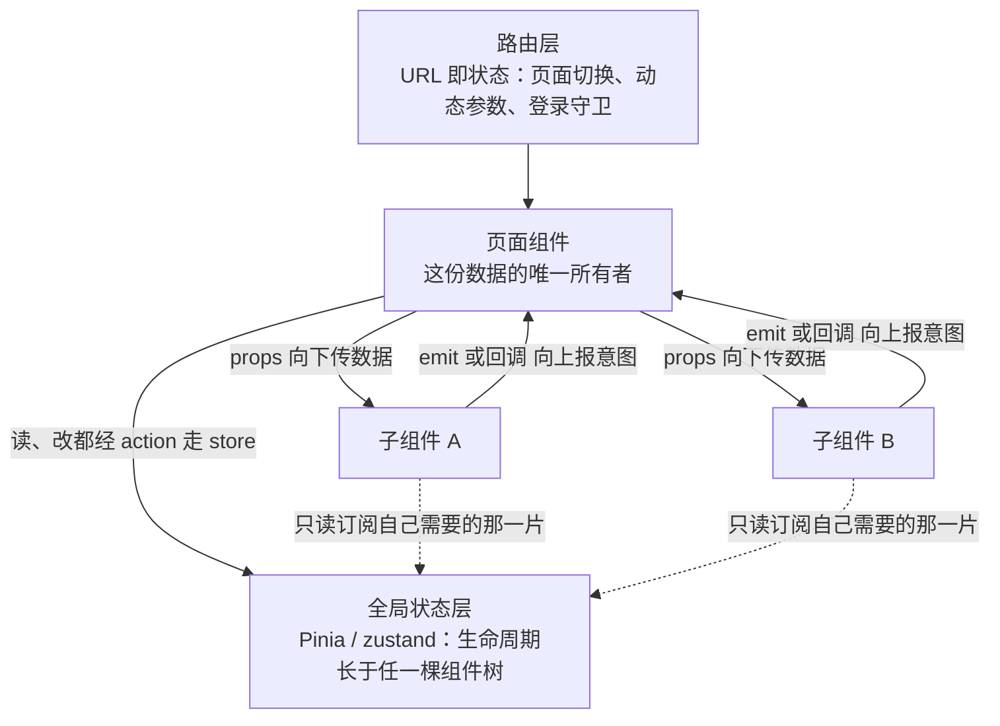
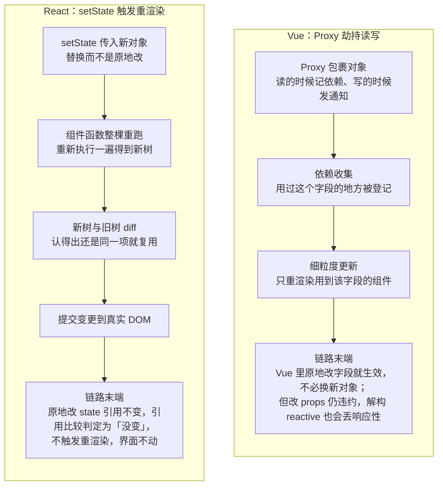

# M7 组件化与框架

> 一句话：把界面写成"状态的函数"（UI = f(state)），用组件拆分复杂度、用单向数据流约束谁来改数据，再用一条主流框架（Vue 3 或 React 19）把它落成能跑、能测、能维护的工程。
> 对应《Web 前端技术》课程大纲模块 M7（[[00-课程大纲]]）。

## 0. 这一块是怎么来的（历史一则）

M4–M6 你们写的是"把 DOM 当画布"的代码：`document.querySelector`、`innerHTML`、手工绑事件、手工清理节点。小页面没问题，一旦到"表格 + 筛选 + 分页 + 弹窗"，同一份数据会出现在五个地方，改一处漏四处。这不是你们手笨，是这种写法的**信息流向**本身就是散的。

行业解决这件事用了十几年：

- 早期 Google 内部的一个项目 AngularJS 起于 2009 年，2011 年发布 1.0。它第一次让很多人接受"在 HTML 里写声明式的绑定"，而不是手工找 DOM 改 DOM。
- Facebook 的 Jordan Walke 提出了 React。2013 年 5 月 29 日，React 在 JSConf US 上以 0.3.0 首次公开。当时最刺眼的争议是 JSX：把类似 HTML 的语法写进 JavaScript，被大量人认为方向错了。今天回头看，被质疑的其实是它最核心的那句话——**界面就是数据的函数**。
- 2014 年 2 月，Evan You 发布 Vue，把声明式模板 + 响应式数据做成了一个渐进式的方案：可以先在一个页面的一小块用，再慢慢扩到整个应用。
- 2019 年 2 月，React 引入 Hooks，函数组件从"只能用"变成"推荐用"，逻辑终于可以按"用途"而不是按"生命周期"来组织与复用。
- 2020 年 9 月，Vue 3 发布，用代理重写了响应式系统，并给出组合式 API（composable），让"按用途抽逻辑"这条思路在 Vue 侧也有了对称的解。
- 2024 年 12 月，React 19 发布，并把 Server Components 稳定下来。

三条线索贯穿整段历史：**声明式取代命令式；组件化取代页面级脚本；单向数据流取代散乱的双向修改**。M7 讲的就是这三条线索怎么落到今天的工程里。

## 1. 教学目标

### 1.1 知识层（能复述、能辨析）

| 目标 | 可考核的行为动词表述 |
| --- | --- |
| 心智模型 | 能用自己的话复述 UI = f(state)，并指出它和命令式 DOM 操作的三处本质差别 |
| 组件契约 | 能说明 props 向下、事件向上的数据流向，并判断一段代码是否违反单向数据流 |
| 响应式机制 | 能对比 Vue 的代理追踪与 React 的重渲染 + 引用比较，说明"为什么两边改数据的方式不一样" |
| 副作用 | 能说出 useEffect / watch 的清理时机，并指出什么情况会造成内存泄漏或竞态 |
| 渲染身份 | 能解释 key 在列表 diff 中的作用，说明为什么用索引当 key 会出错 |
| 路由与状态 | 能区分"局部状态"与"全局状态"，列举至少要上全局状态库的三个信号 |
| 工程规范 | 能说出组件命名、目录组织、请求四态（加载中/成功/空/失败）的约定 |

### 1.2 能力层（能动手、能交付）

| 目标 | 可考核的行为动词表述 |
| --- | --- |
| 搭建 | 能用 Vite 8.3.1 + pnpm 12.8.1 起一个 Vue 3 或 React 19 项目并跑通热更新 |
| 编码 | 能独立写出含 props、事件、插槽/children、条件与列表渲染的组件树 |
| 抽逻辑 | 能把筛选、请求、分页等逻辑抽成 composable 或自定义 hook，并在两个组件里复用 |
| 路由 | 能用 vue-router 5.3.1 或 react-router 8.4.0 实现嵌套路由、动态参数、懒加载与登录守卫 |
| 状态 | 能用 Pinia 4.0.3 或 zustand 5.0.15 管理跨页面共享状态，并说清为什么这块必须共享 |
| 请求 | 能实现加载中/成功/空/失败四种界面，并处理快速切换导致的竞态 |
| 性能 | 能用 DevTools 定位"渲染函数里的重活"，判断该不该加 memo/useMemo |
| 质量 | 能为关键组件写 Vitest 5.0.3 单测，并通过 ESLint 10.11.0 检查 |

### 1.3 素养与工程规范层（能自觉遵守）

| 目标 | 可考核的行为动词表述 |
| --- | --- |
| 不变量 | 在代码评审中主动指出"子组件直接改父状态""解构 reactive 丢响应性"这类问题 |
| 克制 | 面对"要不要引入全局状态库"，能先列出共享范围与改动频率再决定，而不是默认全上 |
| 可访问性 | 能为列表、按钮、表单补上语义标签与键盘可达性，用 Playwright 1.63.0 做一次基本回归 |
| 协作 | 能按 [[13-考核方案与评分量规]] 的量规给自己和同伴的实验打一次分并给出改进项 |

### 1.4 本模块学完后应能独立完成的一件事

独立交付一个"**列表 + 筛选 + 详情**"的小应用：自选 Vue 3 或 React 19 一条线，用 Vite 8.3.1 起项目；用 vue-router 5.3.1 或 react-router 8.4.0 做"列表页 → 详情页"的跳转与动态参数；筛选条件与请求逻辑抽成 composable / 自定义 hook；数据请求呈现加载中/成功/空/失败四种界面；列表 key 正确；至少两个组件从同一个 hook 复用逻辑；`pnpm lint` 与 `pnpm test` 全绿。

## 2. 学时分配与讲授节奏

合计 630 分钟 = 14 学时 × 45 分钟；讲授 405 分钟（9 学时）+ 实验上机 225 分钟（5 学时）。

| 序 | 主题 | 讲授分钟 | 实验上机分钟 | 教学形式 |
| --- | --- | --- | --- | --- |
| 1 | 声明式 UI 与 UI = f(state) 心智模型 | 45 | 0 | 讲授 + 现场对比演示（同一需求命令式 vs 声明式） |
| 2 | 组件化与单向数据流 | 45 | 0 | 讲授 + 板书拆组件 + 代码评审找违规 |
| 3 | Vue 3（上）：SFC、模板与指令、ref 与 reactive、computed 与 watch | 45 | 0 | 讲授 + 现场编码，每讲一段立刻改一次需求 |
| 4 | Vue 3（下）：props 与 emit、插槽、生命周期与清理、组合式函数 | 45 | 0 | 讲授 + 现场编码 + 学生上台补一个 composable |
| 5 | React 19（上）：JSX、useState 与不可变更新、受控组件与表单校验 | 45 | 0 | 讲授 + 现场编码，重点演示"不改原对象" |
| 6 | React 19（下）：useEffect 与清理、useRef、useMemo/useCallback 边界、Context 与 useReducer、Hooks 规则、useTransition | 45 | 0 | 讲授 + 现场编码 + 故意制造竞态再修 |
| 7 | 两条线响应式实现差别 + 条件与列表渲染、key 的语义 | 45 | 0 | 对比讲授 + DevTools 观察更新范围（按 `F12` 或 `Ctrl+Shift+I` 打开开发者工具，切到 Performance（性能）面板） |
| 8 | 路由：嵌套、动态参数、守卫、懒加载（30）+ 状态管理选型：Pinia/zustand 与"什么时候才上库"（15） | 45 | 0 | 讲授 + 小型选型辩论 |
| 9 | 数据请求与缓存四态（20）+ 性能边界（15）+ 组件库与设计系统一致性（10） | 45 | 0 | 讲授 + 现场改造一个"永远转圈"的页面 |
| 10 | 实验一（90 分钟）：同一需求的 Vue 与 React 双线实现——列表 + 筛选 + 详情 + 路由，含 composable/自定义 hook 重构 | 0 | 90 | 上机，教师巡场；主线做透、另线精读对照 |
| 11 | 实验二（45 分钟）：数据请求四态界面 + 表单校验 | 0 | 45 | 上机 + 同桌互检 |
| 12 | 实验三（90 分钟）：性能实测（key、memo/useMemo 边界、渲染里的重活）+ 两条线横向答辩 | 0 | 90 | 上机读数 + 分组答辩 + 教师点评 |
| — | **合计** | **405** | **225** | 总 630 分钟 |

节奏提醒：第 1–7 次课是前半程（心智模型 → Vue 两条 → React 两条 → 合流对比），第 8–9 次课把路由、状态管理、请求四态、性能与设计一致性四个工程话题收尾；随后 5 个上机学时按"实验一 90 分钟 / 实验二 45 分钟 / 实验三 90 分钟"三次落地，实验三的后半段做答辩，正好收束本模块。**只选一条线学透**的学生，在实验一里对自己选定的那条线做透，用另一条线做"对照精读 + 差异清单"，不做双线深度考核——见 [[13-考核方案与评分量规]]。

## 3. 逐节讲授要点

3.1–3.12 共 12 个小节，对应第 2 节表格中的 9 个讲授块（第 8 块含 3.9 与 3.10；第 9 块含 3.11 与 3.12）。

### 3.1 声明式 UI 与 UI = f(state)

**要讲什么**
- 命令式：我自己找元素、自己改、自己保证"改全了"。声明式：我只声明"数据是什么样，界面就该是什么样"，我改数据，框架负责把界面同步过去。
- 一句话形式化：`UI = f(state)`。组件是一个纯函数，输入是数据，输出是"这段界面应该长什么样"。
- 由此推出三个必然结果：① 想改界面，先改数据；② 同一份数据不该在代码里存两份（状态冗余是 bug 温床）；③ 渲染过程应该是纯的——同样的输入得到同样的输出。

**必须现场的演示**
- 同一个"待办清单 + 计数"需求写两遍：一遍用 M5 学过的原生 DOM 操作（`createElement`、`appendChild`、手工更新计数文本），一遍用声明式（数据数组 + 模板/JSX 渲染）。故意在原生版里制造"删除后计数没减"的 bug，让学生看到 bug 的来源是"忘了手工同步"，而不是逻辑写错。

**要提问学生的 3 个问题**
1. 问："在原生版里删掉一项后计数不对，请问是哪个函数写错了？" 期望答案：不是某个函数错，是**同步责任被摊给了人**——声明式里计数由 `list.length` 算出来，根本不存在"忘了同步"。
2. 问："如果界面由数据决定，那'用户点了按钮'算数据吗？" 期望答案：算。交互的结果要落成状态（state）的变化，再由状态驱动界面；事件本身不是界面的一部分。
3. 问："同一份列表数据，能不能在组件里再存一份 `localList` 用于渲染？" 期望答案：不能。两份数据就有了两个真相，必然不一致；要用派生值（computed / 直接计算），不要复制。

**学生一定会犯的错**
- 在"声明式"组件里继续写 `document.querySelector` 去改 DOM，导致框架下一次重渲染把它覆盖回去。
- 把"当前筛选关键词"这类临时状态没有放进 state，而是存在模块级变量里，界面不更新。



> **图 1**：UI = f(state) 的数据流——事件只负责改状态，界面是状态重新算出来的结果，全程没有任何一步需要手工去碰 DOM。
> **看图要点**：虚线那一支「直接手改 DOM」是必须避免的写法，它和「把同一份数据在组件里再存一份」是同一个病根——界面出现了两个真相，谁覆盖谁不可预测。

### 3.2 组件化与单向数据流

**要讲什么**
- 组件 = 可复用的界面单元 + 明确的对外契约（接收什么 props、发出什么事件、要不要插槽/children）。
- 拆分原则：先按"职责"拆，不按"格子"拆。判断标准是"这个组件能不能单独说清楚它是干什么的、能不能单独测"。
- **单向数据流的铁律**：数据只能从父组件往下传（props），子组件要改数据只能往上发事件（emit / 回调函数），由**数据的所有者**去改。
- 为什么不是双向：如果谁都能改，那"谁在什么时候改的"就查不出来，调试成本随组件数指数上升。

**必须现场的演示**
- 写一个 `TodoList`，父组件持有数组，子组件负责渲染每一行并携带"删除"按钮。第一次故意让子组件直接改传入的数组（`props.list.splice(...)`），指出这行代码"能跑但违约"，然后改成 emit，让父组件做删除。

**要提问学生的 2 个问题**
1. 问："子组件为什么不能直接改 props？" 期望答案：props 是**父组件数据的引用**，改它等于越权修改别人的状态，破坏"谁拥有谁修改"，会让父组件重渲染后的结果不可预测；而且在 React 里 props 是只读的，直接改会静默失效。
2. 问："一个'筛选框'组件，筛选关键词该由谁持有？" 期望答案：看谁需要这个值——如果列表页也需要，就放共同父组件；如果只有筛选框自己用（比如临时输入草稿），可以放子组件内部，但仍要通过事件把"最终值"报上去。

**学生一定会犯的错**
- `props` 直接赋值修改；Vue 里对传入的对象直接 `props.obj.x = 1`（能跑，但违约，且深度监听会乱）。
- 把父组件的数据用 `watch` 抄一份到子组件局部变量，形成双份真相。
- 事件命名混乱（Vue 里用 `@click` 而不是自定义 `emit` 把业务事件传出去），把子组件变成"只会点按钮的壳"。



> **图 2**：组件树与单向数据流——数据从父组件往下走（props），要改数据的意图从子组件往上报（emit / 回调），最终由**数据的所有者**执行修改。
> **看图要点**：路由层在组件树之上，它管的是「当前是哪一页、参数是什么」（URL 即状态）；全局状态层在页面组件之上、生命周期长于任一棵组件树，跨页面共享的数据（登录用户、主题、购物车）住在这里，子组件只读订阅、不径直改写。

### 3.3 条件与列表渲染、key 的语义

**要讲什么**
- Vue 的 `v-if` / `v-show` / `v-for`；React 的三元、`&&`、`map`。
- `key` 不是"给 React/Vue 看的编号"，而是**列表项的稳定身份**。框架靠 key 判断"这一项还是不是上一轮的那一项"，从而决定复用哪个组件实例、保留哪份内部状态。
- 用索引当 key 的后果：列表前插或重排时，身份错位，导致"输入框里的字跟着换行跑""动画播错元素""组件状态张冠李戴"。

**必须现场的演示**
- 做一个"可前插的输入行列表"，先渲染成 `<input>` 列表。第一次用 index 当 key，在上方插入一行，让学生看到输入内容发生了错位；改成用稳定的 id 当 key，问题消失。这是本节最有说服力的 30 秒。

**要提问学生的 2 个问题**
1. 问："什么时候可以用索引当 key？" 期望答案：当列表**只追加、不重排、不删除、每项没有内部状态**时，索引恰好稳定，此时勉强可接受；但只要不满足其中任一条，就必须用业务 id。
2. 问："key 需要全局唯一吗？" 期望答案：不需要，只需要**在同一父节点的兄弟之间唯一**。

**学生一定会犯的错**
- 忘记写 key，控制台报警告却当成噪音忽略。
- 用 `Math.random()` 当 key——每次渲染都变，等于每轮全部重建，性能与状态全丢。
- 在 Vue 里 `v-if` 和 `v-for` 写在同一个元素上，优先级含糊导致报错或行为不符预期。

### 3.4 Vue 3（上）：SFC、模板与指令、ref 与 reactive、computed 与 watch

**要讲什么**
- 单文件组件（SFC）：`<script setup>` / `<template>` / `<style>` 三块，一块文件一个组件，编译期拆解（Vite 8.3.1 用 esbuild 0.28.2 做快速转译，sass 1.105.1 处理样式预处理）。
- `ref` 与 `reactive` 的分工：`ref` 包裹任意值（读时 `.value`），`reactive` 只能包裹对象且**不能整体替换**；`reactive` 解构会丢响应性——这是本模块必须现场演示的坑。
- `computed` 是派生值：有依赖追踪、有缓存、**只读计算、不写副作用**；`watch` / `watchEffect` 是副作用：值变了要去做别的事（发请求、存本地、同步标题）。一句话判据：**"算出一个值"用 computed，"因为值变了去做事"用 watch。**
- 指令：`v-bind`（`:src`）、`v-on`（`@click`）、`v-model`（表单双向糖）、`v-if/v-show`、`v-for`。

**必须现场的演示**
```js
// 仅示形态（演示用，不是可提交代码）
const state = reactive({ list: [] });
const { list } = state;          // ❌ 解构：丢响应性
const listRef = ref([]);         // ✅ ref：整体替换也安全
const kw = ref('');
const filtered = computed(() => listRef.value.filter(i => i.name.includes(kw.value)));
```
讲完立刻让 `kw.value` 变一次，展示 `filtered` 自动更新；再把 `reactive` 解构那一行注释掉，展示解构后模板不再更新。

**要提问学生的 3 个问题**
1. 问："`computed` 里能不能发请求？" 期望答案：不能。computed 应是纯计算、可能在渲染中被多次求值；发请求属于副作用，放 watch 或事件处理里。
2. 问："`ref` 和 `reactive` 该选哪个？" 期望答案：默认用 `ref`：它能包基本类型、能整体替换、传递时不丢引用，团队一致性也更好；`reactive` 适合"天生就是一组固定字段的局部状态"，但别解构。
3. 问："`v-if` 和 `v-show` 的区别？" 期望答案：`v-if` 是条件渲染，元素真的被创建/销毁；`v-show` 只切 CSS display。频繁切换用 `v-show`，条件很少变或需要真正卸载用 `v-if`。

**学生一定会犯的错**
- 解构 `reactive` 后界面不更新，误以为是"Vue 的 bug"。
- 忘了 `.value`，或在模板里多写了 `.value`。
- computed 里做副作用（改别的状态），引发循环更新。
- 用 `watch` 去实现本可以直接算出来的派生值，代码绕还容易不同步。

### 3.5 Vue 3（下）：props 与 emit、插槽、生命周期与清理、组合式函数

**要讲什么**
- `defineProps` / `defineEmits`：组件的出入口契约。props 命名、类型与默认值要在定义处写清楚，别用注释代替校验。
- 插槽：默认插槽做"内容占位"，具名插槽做"多个可填区域"，作用域插槽把子组件的数据反向提供给父组件的模板使用（注意：这是模板层面的数据传递，不违反单向数据流）。
- 生命周期：`onMounted` 做初始化（订阅、拉取、测量 DOM），`onUnmounted` **必须**做对称清理（解绑事件、取消定时器、中断请求），`onUpdated` 慎用。
- 组合式函数（composable）：以 `use` 开头的函数，内部可以拥有自己的响应式状态与生命周期，返回可用的状态与方法。它是 Vue 侧的"逻辑复用单元"，用来替代 mixin。

**必须现场的演示**
- 写一个 `useMouse()` composable 监听窗口鼠标位置，在组件 A 与 B 里各用一次；然后故意先不写 `onUnmounted` 的 `removeEventListener`，用 DevTools 的 Event Listeners 面板展示监听器随组件挂载次数增长——现场把清理补上，数量归零。操作步骤：按 `F12` 打开开发者工具 → 切到 Elements（元素）面板 → 右侧栏选 Event Listeners（事件监听器）→ 重新挂载组件，看监听器条目随挂载次数增长（面板入口见 [DevTools 文档](https://developer.chrome.com/docs/devtools/)）。

**要提问学生的 3 个问题**
1. 问："`onMounted` 里 `addEventListener`，谁负责 `removeEventListener`？" 期望答案：同一个 composable 或组件自己，在 `onUnmounted` 里对称清理；**谁挂谁摘**，不要指望别人。
2. 问："插槽往上传数据，算不算违反单向数据流？" 期望答案：不算。插槽是模板组合，数据由父组件决定怎么用，子组件并没有去修改父组件的状态。
3. 问："composable 和普通工具函数的区别？" 期望答案：composable 内部可以使用 `ref`、`computed`、生命周期钩子，因此它有自己的响应式状态与挂载/卸载时机；普通工具函数不能。

**学生一定会犯的错**
- 组件卸载后定时器还在跑，回调里去改已经销毁的组件的状态。
- 把 composable 写成"必须按固定顺序调用、且只能调一次"，其实是在写伪装的工具函数，没利用好响应式。
- props 只写名字不写类型与默认值，组件被误用时静默出错。

### 3.6 React 19（上）：JSX、useState 与不可变更新、受控组件与表单校验

**要讲什么**
- JSX 是 `createElement` 的语法糖：`className`、表达式用 `{}`、必须有单一根（或用 Fragment）、注释写法不同。
- `useState` 的心智：**状态不可变**。改数组/对象必须返回新对象（`[...arr]`、`{...obj, x: 1}`、`map`/`filter`），因为 React 靠**引用比较**判断"变了没有"。这是与 Vue 最大的体感差异。
- 函数式更新：`setCount(c => c + 1)`——当新值依赖旧值时用它，避免闭包拿到过期值。
- 受控组件：输入框的 `value` 来自 state，`onChange` 更新 state，state 是唯一真相。非受控用 `useRef` 读 DOM 值（需要时用它，但表单校验逻辑放 state 里更可测）。
- 表单校验：把"校验结果"做成派生值（每次渲染现算），不要额外存一份 `isValid` state 再手工同步。

**必须现场的演示**
```jsx
// 仅示形态（演示用，不是可提交代码）
const [list, setList] = useState([]);
list.push(newItem);              // ❌ 同一个数组引用，React 认为没变
setList([...list, newItem]);     // ✅ 新引用
setList(prev => prev.filter(i => i.id !== id)); // ✅ 函数式更新
```
现场演示 `push` 版本界面不动（或时好时坏），再换 `[...list, x]`，界面立刻更新。

**要提问学生的 3 个问题**
1. 问："为什么 React 里 `list.push` 后界面不更新？" 期望答案：React 用 `Object.is` 比较新旧状态，同一个引用被判定为"没变"，不会触发重渲染。
2. 问："`setCount(count + 1)` 连写三次会加几？" 期望答案：加 1。三次读到的都是同一个渲染闭包里的旧 count；应改成函数式 `setCount(c => c + 1)` 三次。
3. 问："受控组件里，输入的值存在哪？" 期望答案：存在 React state 里，DOM 只反映它；这样校验、格式化、联动都走同一条数据链路。

**学生一定会犯的错**
- 直接 `state.arr.push(...)` / `state.obj.x = 1` 后调 setter，界面不更新。
- 深层对象只做了浅拷贝却改了内层，导致子组件 memo 失效或另一处引用被连带改掉。
- 把校验结果存成第二份 state，用 useEffect 去同步，造成时序错乱。

### 3.7 React 19（下）：useEffect 与清理、useRef、memo 边界、Context 与 useReducer、Hooks 规则、useTransition

**要讲什么**
- `useEffect` 心智模型：**不是生命周期，是"把渲染结果同步到外部系统"**。副作用（订阅、请求、DOM 操作、日志）放这里；渲染函数里必须保持纯净。
- 清理函数：`useEffect` 返回的函数在下次执行前与卸载时各调一次，用来撤销上一次的副作用。**请求的清理就是"声明这次请求已作废"**，这是消除竞态的标准做法。
- `useRef`：跨渲染保存值但不触发渲染（计时器句柄、DOM 引用、上一次的值）。
- `useMemo` / `useCallback`：只在"确有性能证据"时使用；它们有内存与依赖比对成本，加错依赖反而引入 bug。默认先不加。
- `Context` 传的是"低频率变化的全局型数据"（主题、当前用户、语言）；`useReducer` 适合状态转移复杂、需要集中描述"有哪些动作"的场景。
- Hooks 规则：只能在组件或自定义 hook 的顶层调用，不能放条件、循环里。原因是 React 靠调用顺序匹配状态槽位。
- `useTransition`：把"不急的更新"标成可打断，让输入保持顺滑——这是 React 19 并发特性里最常用的一颗。

**必须现场的演示**
- 写一个"按关键词搜索"的组件：快速切换关键词时，先返回的慢请求覆盖了后返回的慢请求，展示结果与输入框不一致的竞态；然后在 `useEffect` 里加"作废标记 + 清理函数"，问题消失。**这一节不做这个演示，学生在实验三、四里一定会踩。**

**要提问学生的 3 个问题**
1. 问："`useEffect(() => {...}, [])` 里发请求，组件卸载后请求回来会怎样？" 期望答案：回调仍会执行，可能调用已卸载组件的 setState，造成警告与内存泄漏；要在清理函数里作废这次请求（标记位或 `AbortController`）。
2. 问："依赖数组里的依赖，是'什么时候跑'还是'看见什么变量'？" 期望答案：它同时决定扫描时机与闭包内容；写全依赖，让 lint 提醒你不要漏。
3. 问："既然 memo 能省渲染，为什么不默认全加？" 期望答案：memo 的比较本身有成本，且会掩盖"父组件传了不稳定引用"的真实问题；应先修数据流，再按测量结果决定加不加。

**学生一定会犯的错**
- 用 `useEffect` 去"同步两个 state"，而不是把一个改成派生值。
- 依赖数组写空 `[]` 却使用了外部变量，拿到过期闭包。
- 在渲染函数里直接发请求 / 直接改 DOM / 写日志（见第 5 节误区表）。
- 把 Hooks 写在 `if` 里；或在自定义 hook 里没加 `use` 前缀，lint 直接报错。

### 3.8 两条线响应式实现差别

**要讲什么**
- Vue：用 `Proxy` 包裹对象，**读的时候记依赖、写的时候通知**具体用到了它的地方（细粒度追踪），因此你改 `state.list[0].name = 'x'` 是有效的，界面自动更新。
- React：不追踪你的写操作，只比较"这次渲染返回的树"和上次的差异（虚拟 DOM 比较 + 引用比较），因此你必须**用新对象替换旧对象**来"告诉"React 变了。
- 一句话对照：**Vue 你改数据它自己发现；React 你换对象它才知道。**这解释了两边所有看起来矛盾的写法差异。
- 边界澄清：两者都需要"数据是唯一真相"；差别在"变更的传播方式"，不在"要不要组件化"。

**必须现场的演示**
- 同一个数组，分别用两条线做"改第 3 项的名字"：Vue 里 `arr[2].name = 'new'` 直接生效；React 里必须 `setList(l => l.map(...))`。开两个 DevTools 性能录制（按 `F12` 打开开发者工具 → 按 `Ctrl+Shift+P` 打开命令菜单，输入 `Performance` 回车切到性能面板 → 点左上角录制按钮录一次，停止后看火焰图），对比更新时高亮重渲染的组件范围：Vue 只更新用到该字段的组件，React 通常从状态所在组件往下重渲染（再做剪枝）。

**要提问学生的 2 个问题**
1. 问："Vue 里 `arr.length = 0` 能清空并更新界面吗？" 期望答案：能，代理能捕获；但更好的写法是 `arr.splice(0)` 或替换整个 ref，语义更清晰。
2. 问："React 里为什么不能'直接改数据'？" 期望答案：React 不做依赖追踪，只能靠引用变化判断；直接改引用不变，它认为什么都没发生。

**学生一定会犯的错**
- 把 React 的不可变更新习惯带到 Vue（结果又多写一堆无意义的拷贝）。
- 把 Vue 的直接修改习惯带到 React（结果界面不更新）。
- 认为 React 比 Vue "慢"，其实差别在更新范围与调度策略，而多数业务页面的瓶颈在别处（见第 9 节）。



> **图 3**：两条路线的响应式机制对比——Vue 用 Proxy 劫持读写、按依赖细粒度更新；React 用 setState 换引用触发组件函数重跑，再 diff 出新树。
> **看图要点**：两条链路都要求「数据只有一个真相」，差别只在**变更怎么被发现**：Vue 原地改字段就生效（但改 props、解构 reactive 依然违约）；React 原地改 state 会因引用没变被判为「没变」而界面不动，必须 `setObj({...obj, x: 1})` 这样换引用——这就是「Vue 改数据、React 换对象」的全部由来。

### 3.9 路由：嵌套、动态参数、守卫、懒加载

**要讲什么**
- 路由解决的问题：URL 即状态。刷新能回到同一页、能分享链接、能后退前进。
- `vue-router 5.3.1` 与 `react-router 8.4.0` 的对应概念：路由表 / 嵌套路由（父级布局 + `<Outlet>` / `<RouterOutlet>`）、动态参数（`/user/:id` / `useParams`）、查询参数（`?kw=`）、编程式导航。
- 导航守卫做登录拦截：判断"是否有登录态"，没有就重定向到登录页，并把原目标地址带上（登录后跳回去）。守卫里**只读判断、不做重活**。
- 路由懒加载：按路由拆包，首屏只下必需的代码，用动态 `import()` 实现。

**必须现场的演示**
- 给列表页加 `/list/:id` 详情路由，点一行跳过去；再用浏览器后退键验证 URL 与界面同步。然后加一个 `requireAuth` 守卫，未登录访问详情页被弹回登录页，登录后自动回到原目标。

**要提问学生的 3 个问题**
1. 问："守卫里能不能直接发请求判断登录态？" 期望答案：最好不。守卫要同步、快速返回；登录态应在应用启动时取一次并放进状态，守卫只读状态。
2. 问："动态参数变化时，同一个组件实例会被复用吗？" 期望答案：会（同一路由、仅参数变），所以要在参数变化时重新取数，而不是只在挂载时取一次——这是本节最常翻车的点。
3. 问："懒加载的边界放在哪一层？" 期望答案：路由级优先；其次是大体积的、非首屏必需的组件（图表、编辑器）。

**学生一定会犯的错**
- 只在 `onMounted` / `useEffect([])` 里取数，导致"从详情 A 点进详情 B"页面不刷新。
- 守卫里写成无限重定向（登录页本身也要求登录）。
- 懒加载与预加载混写，首屏反而请求变多。

### 3.10 状态管理选型：Pinia 4.0.3 与 zustand 5.0.15

**要讲什么**
- 先分清三类数据：**局部状态**（一个组件自己用）、**跨组件共享状态**（同一子树内，用 props/事件或 Context 解决）、**全局应用状态**（多页面共享、生命周期长于某棵组件树，如登录用户、购物车、主题）。
- 上全局状态库的三个信号：① 相距很远的组件要用同一份数据；② 这份数据要在路由跳转之间存活；③ 多个组件都要"改"它，且改动逻辑最好集中管理。**不满足就别上。**
- Pinia 4.0.3：`defineStore` 里 state / getters / actions 三块，天然融入 Vue 响应式；zustand 5.0.15：用 `create` 定义一个 store，组件用选择器订阅，按需重渲染。
- 共同纪律：store 里放"数据与数据操作"，不放 DOM 与请求实例细节；组件从 store 取"自己需要的那一小片"，避免整店订阅导致误重渲染。

**必须现场的演示**
- 一个"登录用户 + 主题色"两个需求：先用 props 硬穿三层，展示"中间层被污染"；再抽到 store，展示组件树的中间层恢复干净。再展示一个反面：把"弹窗是否打开"也放进全局 store，导致两个页面互相干扰。

**要提问学生的 2 个问题**
1. 问："一个只在列表页用的筛选条件，要不要放全局 store？" 期望答案：不要。它只在那一页活着，放路由查询参数或页面局部状态更合适（还能分享链接）。
2. 问："为什么建议从 store 里取最细的字段，而不是整个对象？" 期望答案：zustand 与 Pinia 都按订阅粒度决定重渲染范围；取整店会让无关更新也重渲染本组件。

**学生一定会犯的错**
- 一上手就装全局状态库，把所有状态都塞进去，包括弹窗开关、输入草稿。
- 在组件里直接改 store 的 state 字段（绕过 action），改动来源不可追踪。
- 把请求函数、路由跳转也写进 store，造成耦合与难以测试。

### 3.11 数据请求与缓存、表单校验

**要讲什么**
- 请求状态机：任何一次远程请求，界面上都有四种形态——**加载中 / 成功（有数据）/ 成功但为空 / 失败**。多数学生只写前两种，于是"空列表"看起来像"还在加载"，"失败"看起来像"永远转圈"。
- 竞态：快速切换条件时旧响应后到，覆盖新结果。做法是给每次请求编号或使用 `AbortController`，只接受"最新那次"的结果。
- 缓存与去重：把"最近一次相同参数的请求结果"复用一小段时间；避免同一数据在多个组件里各请求一遍（提取到上层或用缓存层）。
- 表单校验：即时校验与提交校验分开；错误信息挂在字段上而不是整表单；提交中禁用重复提交按钮。

**必须现场的演示**
- 把实验三的页面先用"只会转圈"的版本演示：断网 → 一直转圈；空数据 → 也转圈。然后补上四态与错误重试按钮，断网时给出可操作的错误提示。

**要提问学生的 3 个问题**
1. 问："空数组和'还没加载完'在界面上应该长得一样吗？" 期望答案：不能一样。空态要明确告诉用户"这里确实没有内容"并给出下一步动作，加载态要给进度感。
2. 问："请求失败后，用户能做什么？" 期望答案：至少能重试；错误信息要说清楚是网络、权限还是服务端问题。
3. 问："同一份用户信息在页头、侧边栏都用到，各请求一次有什么问题？" 期望答案：浪费、可能不一致、慢；应提取到上层或共用缓存。

**学生一定会犯的错**
- 只有 loading 与 data，没有 error 与 empty 分支。
- finally 里无条件 `setLoading(false)`，但已卸载的组件仍被 setState。
- 提交按钮不置忙，用户连点三次产生三条数据。

### 3.12 性能边界与组件库/设计系统一致性

**要讲什么**
- 渲染函数要保持"轻"：不要在里面做重计算、发请求、读布局属性。重活放到 computed / useMemo / 事件处理里。
- 性能排查顺序：先用 DevTools Performance 录制找到真正的瓶颈（按 `F12` 打开开发者工具 → 按 `Ctrl+Shift+P` 打开命令菜单，输入 `Performance` 回车 → 录制一次操作 → 看火焰图里最宽的那条），再决定手段（减少渲染范围、虚拟列表、懒加载、减少不必要状态提升）。**不要凭感觉加 memo。**
- `memo` 适用边界：① 组件渲染成本确实高；② props 引用稳定（不稳定就先修上游）；③ 出现在频繁更新的父组件下。三者不满足，加了也没收益。
- 组件库与设计系统一致性：颜色、间距、圆角、字号、交互态（hover/active/disabled/focus）来自**同一套设计令牌**，而不是各组件各写一个色值。Tailwind 4.3.3 通过主题变量维护令牌；自建组件库则把令牌导出为 CSS 变量。一致性不是为了好看，是为了减少认知成本与审查成本。

**必须现场的演示**
- 在一个列表渲染里放一段 O(n²) 的重计算，录制性能火焰图找到它，再抽到 `useMemo` / `computed`，对比帧时间。顺便演示"给所有子组件无脑加 memo"后，因为每次都传新函数，收益为零。

**要提问学生的 3 个问题**
1. 问："给所有子组件加 memo，性能会变好吗？" 期望答案：不一定。props 每次都是新引用时比较必然失败，白付比较成本；应先稳定引用或用更细的订阅。
2. 问："设计系统一致性和组件库是什么关系？" 期望答案：组件库是实现的载体，设计系统是规则与令牌；只有当组件都读同一套令牌时，一致性才可持续。
3. 问："性能优化第一步做什么？" 期望答案：测量，找到真实瓶颈，而不是先改代码。

**学生一定会犯的错**
- 在渲染里 `list.sort()`（原地改数组，还每次重算），引发顺序漂移与额外渲染。
- 只优化"看起来慢"的地方，优化完没有前后对比数据。
- 每个组件自己定义颜色与间距，最终全站十几种"差不多的蓝"。

## 4. 关键概念讲透

### 4.1 UI = f(state)

- **是什么**：界面是状态的函数。状态是输入，界面是输出；想改界面，就改状态。
- **为什么这样设计**：手工同步 DOM 的复杂度随界面规模超线性增长，责任太多且无法验证。把"同步"这件事交给框架，人只描述"数据长什么样"，代码量下降且可预测。
- **与相邻概念的边界**：它不等于"所有数据都放全局状态"；它是"界面里显示的一切，都应能追溯到某个状态或其派生值"。派生值不要另存一份。
- **最小示例（仅示形态）**：
```js
// 仅示形态
const keyword = ref('');
const shown = computed(() => all.value.filter(i => i.name.includes(keyword.value)));
```
- **一句判据**：**改界面之前先问"这背后是哪份状态变了"，答不出来就是写法出了问题。**

### 4.2 响应式追踪：代理劫持 vs 引用比较

- **是什么**：Vue 用 `Proxy` 在读写时记依赖、发通知（细粒度）；React 每次让组件函数重跑得到新树，再比较差异与引用。
- **为什么这样设计**：Vue 的目标是"改数据即更新"，用运行时代理换取写法的自然；React 的目标是"渲染是可预测的纯函数调用"，用不可变数据换取调度与并发能力（这也是 React 19 的并发特性得以成立的前提）。
- **与相邻概念的边界**：两者都要求单一数据源；差别只在"变更是怎么被发现的"。这决定了 Vue 写 `obj.x = 1` 有效，而 React 必须 `setObj({...obj, x: 1})`。
- **最小示例（仅示形态）**：
```js
// Vue：直接改即生效（仅示形态）
state.user.name = 'Ada';
// React：必须换引用（仅示形态）
setUser(u => ({ ...u, name: 'Ada' }));
```
- **一句判据**：**Vue 改数据，React 换对象；两边都别把数据存两份。**

### 4.3 副作用、清理与竞态

- **是什么**：副作用是"渲染之外的事"——订阅、请求、定时器、操作 DOM。清理是"撤销上一次副作用"。竞态是"旧请求的结果覆盖了新结果"。
- **为什么这样设计**：渲染必须可重复、可中断、可丢弃，因此不能夹带副作用；而副作用往往持有外部资源，所以必须与"生命周期"配对，撤销时机由框架统一给（`onUnmounted` / `useEffect` 的返回函数）。
- **与相邻概念的边界**：computed / useMemo 是**纯计算**，不产生副作用；watch / useEffect 是**副作用**，不该返回业务数据（返回函数的位置被清理占用）。
- **最小示例（仅示形态）**：
```js
// 仅示形态：作废标记消除竞态
useEffect(() => {
  let stale = false;
  fetchData(kw).then(d => { if (!stale) setData(d); });
  return () => { stale = true; };
}, [kw]);
```
- **一句判据**：**谁创建的，谁负责销毁；每次异步回来先问"我还是最新那次吗"。**

### 4.4 key 是列表项的身份

- **是什么**：key 是框架用来判断"这一项还是不是上一轮那一项"的稳定标识；不是显示用的编号，也不是渲染序号。
- **为什么这样设计**：diff 算法需要在 O(n) 内对齐新旧子节点，必须有一个不随顺序变化的身份锚点；有锚点才能复用组件实例与内部状态。
- **与相邻概念的边界**：key 解决"身份"，不解决"排序"；排序要改数组顺序，而不是改 key。
- **最小示例（仅示形态）**：
```jsx
// 仅示形态：key 用业务 id，不用索引
{list.map(item => <Row key={item.id} data={item} />)}
```
- **一句判据**：**列表会增删或重排时，key 必须是随数据走的业务 id；用索引等于告诉框架"每次都是我"。**

## 5. 常见误区与诊断

| 学生症状 | 真实病根 | 课堂怎么纠正 |
| --- | --- | --- |
| 直接改 state 或 props（React 里 `list.push` 后 set，Vue 里改 props 对象），界面不更新或行为诡异 | 把"数据"当成了可随意改写的东西，不知道 React 靠引用比较、props 是父组件的数据 | 现场跑最小对照：`push` 不动 vs `[...list]` 立刻动；再让学生自己判"这行代码谁是所有者" |
| 解构 `reactive` 后变量不再响应（`const { kw } = state`） | 解构取到的是**当时的普通值**，脱离了代理的读写追踪 | 当场解构、当场改值、当场看界面不动；给出规则"要解构就用 `toRefs`，或干脆用 `ref`" |
| 忘写 key，或用索引/随机数当 key | 没有把 key 理解成"身份"，只当成"消除警告的写法" | 用 3.3 的前插输入框演示：索引 key 下输入内容错位，随机 key 下整表重建 |
| `useEffect` 里不写清理，导致内存泄漏与请求竞态 | 只把 useEffect 当"挂载后执行一次"，不知道要成对撤销 | 快速切换关键词演示旧响应覆盖新结果；再补 stale 标记或 `AbortController`，问题消失 |
| 一上手就装全局状态库（Pinia/zustand），把弹窗开关也塞进去 | 把"组件之间要传值"直接等同于"要全局状态"，缺少对共享范围的判断 | 先让 props 硬穿三层感受中间层污染，再给出"上库三信号"，让学生自己判弹窗该不该上 |
| 在渲染函数里发请求 / 改 DOM / 写日志 | 分不清"渲染"与"副作用"，把渲染当成生命周期回调 | 讲清渲染可能被多次执行、可能被丢弃；把请求挪进 useEffect / watch / 事件处理，再跑一遍 |
| 在渲染函数里做重活（排序、深过滤、格式化整个列表） | 没有"渲染要轻"的意识，也从未测量过 | 用 Performance 录制找出火焰图，抽到 computed/useMemo 前后对比帧时长 |
| `useMemo` / `useCallback` / `memo` 无脑全加，收益为零甚至更慢 | 把优化当成风格，而不是结论 | 演示"每次传新函数 + memo"比较必然失败；立规矩：先测量，后优化，改动要留前后数据 |
| 只在挂载时取数，路由参数变化后页面不刷新 | 不知道同路由参数变化时组件实例会被复用 | 从详情 A 点进详情 B 演示数据不变；把取数依赖改成"参数"而不是"挂载" |
| 表单把校验结果另存一份 state，用 useEffect 同步 | 没区分"状态"与"派生值" | 让学生把 `isValid` 删掉改成每渲染现算，逻辑立即变短且不再时序错乱 |
| 请求只有 loading 与 data，没有空态与错误态（"永远转圈"） | 没有把请求看成一个状态机，只想着"成功路径" | 断网 + 造一个空列表，现场看到转圈不停；补上四态与重试按钮 |
| 每个组件自己定颜色与间距，按钮在三个页面长得都不一样 | 没有设计令牌的概念，组件库与设计系统被当成两回事 | 抽出一组 CSS 变量/主题令牌，改一次全站生效；让学生体会"一致性=可维护" |

## 6. 本模块实验

本模块共 3 个实验、合计 225 分钟（5 学时）：**实验一 90 分钟**（同一需求的 Vue 与 React 双线实现，主线做透、另线精读对照，含 composable / 自定义 hook 重构）、**实验二 45 分钟**（数据请求四态界面 + 表单校验）、**实验三 90 分钟**（性能实测 + 两条线横向答辩）。环境与提交规范见 [[15-实验与大作业指导]]。

### 实验一：同一需求的 Vue 与 React 双线实现（90 分钟）

- **目的**：把 3.2–3.11 的要点落到一个能跑的页面上。同一个需求用两条线各实现一遍，让"代理追踪 vs 引用比较"从讲义上的话变成你写代码时的体感；同时完成本模块要求的"把逻辑抽成 composable / 自定义 hook"的重构。
- **环境**：Node v26.7.0、npm 11.19.0、pnpm 12.8.1、Vite 8.3.1、Vitest 5.0.3、ESLint 10.11.0（本课程只用 Vue 3 与 React 19 两条稳定线：Vue 4 未发布；Nuxt 3 已 EOL，本模块不涉及服务端框架）。
  - Vue 线：Vue 3.5.43、vue-router 5.3.1、Pinia 4.0.3、Prettier 3.9.9；样式可用 [Tailwind 4.3.3](https://tailwindcss.com/docs/installation/using-vite) 或原生 CSS + sass 1.105.1。读物：[《Vue 3 官方指南》](https://cn.vuejs.org/guide/introduction)、[《vue-router 5.3.1 官方指南》](https://router.vuejs.org/zh/guide/)、[Pinia 4.0.3 官方文档](https://pinia.vuejs.org/)。
  - React 线：React 19.3.0、react-router 8.4.0、zustand 5.0.15、Biome 2.5.15（或 ESLint 10.11.0 + Prettier 3.9.9）；可用 [TypeScript 7.0.2](https://www.typescriptlang.org/docs/handbook/intro.html)。读物：[《React 官方入门》](https://zh-hans.react.dev/learn)。
  - 两条线都用 Vite 8.3.1 建项目：[《Vite 官方指南》](https://vite.dev/guide/) 。启动与校验命令都在项目根目录执行（`pnpm install` → `pnpm dev`）。
- **任务描述（两条线需求完全相同，共用同一份数据文件）**
  - **Part A 主线实现（做透）**：自选 Vue 或 React 一条线，按下面七条做完。
    1. 用 Vite 8.3.1 起项目，跑通开发服务器与热更新（在项目根目录执行 `pnpm dev`，用终端输出的本地地址打开页面，改一行代码看热更新生效）。
    2. 数据源用本地 JSON（不联网，避免课堂网络抖动）：约 30 条记录，字段至少含 id、名称、分类、日期。
    3. 列表页：关键词筛选（输入即筛）+ 分类筛选（下拉），两者可叠加，显示"当前筛出 N 条"。
    4. 详情页：路由 `/items/:id`，展示单条完整信息，带返回列表按钮，从列表点行进入。
    5. 筛选条件同步到查询参数（`?kw=&cat=`），刷新后不丢；**从详情 A 直接切到详情 B 时数据必须重新取**。
    6. 列表页呈现四种形态：加载中 / 成功 / 空 / 失败（失败用"模拟出错"开关触发，且能重试）。
    7. 快速连续切换关键词时，不出现"旧请求结果覆盖新结果"。
  - **Part B 对照线精读（另一条线，最小可用）**：用另一条线实现"列表 + 筛选 + 详情"的最小可用版（样式可粗糙），并在 `README.md` 写出**两线写法差异清单（≥5 条）**，至少覆盖：状态更新方式、key、取数依赖、清理方式、订阅粒度。
  - **Part C 重构项（必做，两条线都做）**：把筛选逻辑（关键词 + 分类 + 组合结果 + 计数）从页面组件抽成 `useItemFilter()`——Vue 侧是 composable，React 侧是自定义 hook。抽完后**必须有两个不同组件**通过它取得同一份派生结果（"筛选摘要"与"列表"），不得各写一份 filter 表达式。
- **验收判据（学生可自测）**
  - `pnpm dev` 起服务，首页可见列表；控制台无 key 缺失警告（按 `F12` 打开开发者工具 → 按 `Ctrl+Shift+J` 直接切到 Console（控制台），`Ctrl+L` 可清空）。
  - 改关键词后，"筛选摘要"里的条数与列表实际行数**始终一致**（证明共用同一派生值）。
  - 刷新页面后 URL 里保留筛选条件；浏览器后退可回到上一筛选状态；直接访问 `/items/3` 能打开详情页。
  - 从详情 3 直接跳到详情 7，页面显示 7 的数据（参数变化会重新取数，不是只在挂载时算一次）。
  - 数据文件临时改成 `[]` 显示明确空态文案；打开"模拟出错"开关显示错误态与"重试"按钮且重试有效；断网时不无限转圈。
  - 连续快速切换关键词 10 次，最终显示结果与最后一次输入一致（竞态验收）。
  - 全文搜索 `filter(`：筛选表达式只出现在 `useItemFilter()` 内部（重构彻底性验收）。
  - 语言一致性自测：React 侧代码中 state 更新无一处 `push` 或直接赋值属性；Vue 侧无一处解构 `reactive` 后继续使用。
  - 主线 `pnpm lint` 无 error；为 `useItemFilter()` 写的 Vitest 5.0.3 单测（≥3 个断言，覆盖组合筛选与空结果）全部通过。
- **提交物**：主线源码仓库 + 对照线源码（可同仓库分目录）+ `README.md`（启动命令、`useItemFilter` 的契约与职责、四态如何触发、两线差异清单 ≥5 条）+ 空态与错误态两张截图 + 单测输出截图 + 一段"两线体感差异"的 100 字小结。
- **评分要点**：主线功能完整 25%；响应式与单向数据流用法正确（无直接改 props、React 侧引用不变、无解构丢响应、无索引 key）25%；`useItemFilter` 抽取彻底且被两处复用 20%；四态与竞态处理 15%；对照线差异清单质量 10%；lint/测试与提交规范 5%。

### 实验二：数据请求四态界面 + 表单校验（45 分钟）

- **目的**：把 3.11 的"请求状态机"和"表单校验"做成可复用的界面契约，两条线共用同一份验收标准。
- **环境**：在实验一的仓库上继续（沿用你选的那条线）；可用 Vitest 5.0.3 + Playwright 1.63.0 做回归。
- **任务描述**
  1. 定义统一的数据取用形态：`{ status, data, error, retry }`，`status ∈ {loading, success, empty, error}`。
  2. 把这四种形态做成一个**可复用的组件/区域**：加载态给出进度感；空态给出明确文案与"新增一条"入口；错误态给出可读原因与"重试"按钮。
  3. 加一个"新建记录"表单：必填校验（名称长度限制、分类必须选）、字段级错误信息、提交中禁用按钮；成功后回到列表并在顶部可见新记录。
  4. 用"模拟开关"分别触发慢网络、空结果、500 错误三种情形，逐条走验收。
- **验收判据（学生可自测）**
  - 模拟 500 或断网时页面显示错误态（不是无限转圈），点"重试"能恢复。
  - 空结果时显示空态文案，且与"加载中"在视觉上明确可区分。
  - 表单不填点提交：字段级错误提示出现，焦点移到第一个错误字段。
  - 连续快速点提交三次，只产生一条记录；提交失败时按钮恢复可用且输入内容不丢失。
  - 有一条 Playwright 1.63.0 脚本覆盖"空态"与"错误重试"两条路径并通过。
- **提交物**：源码 + 加载/空/错误三张状态截图 + 表单校验截图 + Playwright 测试文件与运行结果。
- **评分要点**：四态齐全且可触发 35%；错误可重试 15%；表单校验与防重复提交 30%；可复用性（不是只在这一页写死）15%；测试与提交规范 5%。

### 实验三：性能实测 + 两条线横向答辩（90 分钟）

- **目的**：建立"先测量再优化"的习惯，用数据证明 memo 不是万能药；并通过横向答辩把两条线的差别讲清楚（这是本模块的收束环节）。
- **环境**：实验一的仓库（任选一条线）；浏览器 DevTools Performance 面板（按 `F12` 打开开发者工具 → 按 `Ctrl+Shift+P` 输入 `Performance` 回车）+ React DevTools 或 Vue DevTools。
- **任务描述**
  - **Part A 性能实测（约 60 分钟）**
    1. 把列表扩大到 2000 条，并在渲染路径里放一段可调的重计算（例如对每条做一次字符串拼接与过滤）。
    2. 用 Performance 录制一次筛选操作（点面板左上角录制按钮开始 → 在页面上做一次筛选 → 停止），截图火焰图，标出耗时最长的函数。
    3. 做三组对照并记录数据：① 重计算留在渲染里；② 抽到 computed / useMemo；③ 给子组件加 memo 且每次传入新函数（预期无收益）。
    4. 做第四组：把 key 从业务 id 改成 index，观察重排/前插时的更新耗时与状态错位现象。
  - **Part B 横向答辩（约 30 分钟）**：每组 3 分钟，讲四件事——① 你这条线怎么"发现数据变了"；② 你的 `useItemFilter` 契约长什么样、被哪两个组件复用；③ 性能对照表里哪一个改动最有效、为什么；④ 如果换另一条线实现同一需求，你会改哪三行代码。
- **验收判据（学生可自测）**
  - 有一张对照表：四组场景 × 至少两个指标（脚本耗时、更新耗时或帧数），数值来自实测而非估计。
  - 能指出第 ③ 组为什么收益为零（props 引用不稳定），并给出修复方向（稳定引用或用更细的订阅）。
  - 第 ④ 组能复现状态错位（输入框内容串行或高亮错位）。
  - 优化后功能回归不退化（重跑实验二的 Playwright 脚本仍通过）。
  - 答辩四问都能不看稿回答，且第 ① 问的回答里出现了"代理追踪"或"引用比较"这类机制层面的词。
- **提交物**：性能对照表（Markdown）+ 两张火焰图（优化前/后）+ 不超过 150 字的结论 + 答辩提纲一页。
- **评分要点**：测量方法正确 25%；对照数据完整可信 25%；结论与证据一致 15%；回归不退化 10%；答辩清晰度与机制理解 25%。

## 7. 本模块作业与自测题

标注格式：[对应节] [认知层次] [难度]。

**1（选择）** [3.8] [理解] [★]
下列关于 Vue 与 React 响应式实现的说法，正确的是：
A. React 通过代理追踪每个字段的读写，改对象属性即可触发更新
B. Vue 通过引用比较判断数据是否变化，因此必须返回新对象
C. Vue 用代理追踪访问，直接修改对象属性即可触发细粒度更新；React 依赖引用比较，需要返回新对象
D. 两者都必须使用不可变数据才能正确更新界面
> 答案 C。考点：4.2 的判据。

**2（选择）** [3.7] [应用] [★★]
在 React 中快速切换关键词时出现了"旧请求结果覆盖新结果"，下列哪种做法**不能**解决该问题？
A. 在 `useEffect` 里用 `let stale = false` 并在清理函数里置 `true`
B. 使用 `AbortController` 在清理时中断上一次请求
C. 给每次请求带上递增序号，只接受序号最大的响应
D. 把请求改到渲染函数里执行，保证每次渲染都拿最新数据
> 答案 D。在渲染里发请求本身就是误区（见第 5 节），且并不能消除竞态。

**3（简答）** [3.2] [理解] [★]
用三句话说明"单向数据流"的规则，并指出子组件想删除父组件持有的列表项时应该怎么做。
> 期望：props 向下传数据；子组件不改 props；子组件通过事件/回调把意图上报，由数据所有者执行修改。

**4（简答）** [3.3] [分析] [★★]
为什么用数组索引当 `key` 会在"列表前插"时出错？请描述一次你（或示例代码）会观察到的具体现象。
> 期望：索引是位置而非身份，前插后第 n 项的索引对应到了另一条数据，框架按 key 复用组件实例，导致输入框内容/局部状态跟着位置走而错位。

**5（简答）** [3.10] [评价] [★★]
列出至少三个"应该引入全局状态库"的信号，并各举一个**反例**（不该上库的场景）。
> 期望：信号见 3.10；反例：只在单页使用的筛选条件、弹窗开关、输入草稿、可以由 props 传递的父子数据。

**6（读代码）** [3.4] [分析] [★★]
下面这段 Vue 代码界面不更新，指出原因并给出两种修法（不写完整实现，只写关键改动）。
```js
// 仅示形态
const state = reactive({ keyword: '', list: [] });
const { keyword, list } = state;
const shown = computed(() => list.filter(i => i.name.includes(keyword)));
```
> 期望：解构脱离了代理，读到的是一次性普通值；修法一用 `ref` 包 keyword/list（改 `keyword.value`），修法二用 `toRefs(state)` 解构，或直接用 `state.keyword` 访问。

**7（读代码）** [3.7] [分析] [★★★]
下面这段 React 代码有两处问题（一处不更新、一处泄漏），指出并说明修法要点（只给关键改动方向，不给完整实现）。
```jsx
// 仅示形态
function List({ id }) {
  const [data, setData] = useState([]);
  useEffect(() => {
    fetch(`/api/items/${id}`).then(r => r.json()).then(setData);
  }, []);
  return data.map(d => <Row data={d} />);
}
```
> 期望：① 依赖数组为空、`id` 变化不重新取数，应把 `id` 放进依赖；② 缺少清理，快速切换时旧响应会覆盖且可能对已卸载组件 setState，应在清理里作废（stale 标记或 AbortController）；另可指出列表渲染缺 `key`。

**8（编程）** [3.4 / 3.5] [创造] [★★★]
把一段写在组件里的筛选逻辑重构成 `useItemFilter()`（Vue composable 或 React 自定义 hook，自选一线）。
> 验收判据与评分要点：① 抽出的函数内部不再依赖任何具体组件，输入是数据源与筛选条件，输出是筛选结果与计数；② 至少两个组件通过它取得同一份派生结果，运行时两者数值始终一致（可自测：改一个筛选条件，摘要与列表行数同步变化）；③ 组件代码中不再出现重复的 filter 表达式（可用全文搜索验证）；④ 有一段 Vitest 测试覆盖"组合筛选"与"空结果"两个用例并通过；⑤ 评分：契约清晰 30%、复用彻底 30%、行为正确 25%、测试与命名规范 15%。**本题不提供参考实现，重构后需现场讲解数据流。**

**9（编程）** [3.9 / 3.11] [创造] [★★★]
实现"列表 → 详情"的路由跳转，并保证详情页在四种请求状态下都有正确界面。
> 验收判据与评分要点：① 直接访问 `/items/:id` 能正确渲染该条（刷新不丢）；② 从详情 A 直接切到详情 B 时数据会重新获取（参数变化验收）；③ 断网时显示错误态且重试有效，空数据时显示空态，两者与加载态可区分；④ 未登录时被守卫拦到登录页，登录后回到原目标；⑤ 评分：路由与参数处理 35%、四态完整 35%、守卫与回跳 20%、代码规范 10%。**只给判据，不给实现代码。**

**10（编程）** [3.12] [应用] [★★]
针对你实验中的列表页做一次性能测量并提交对比数据。
> 验收判据与评分要点：① 给出优化前后的实测指标（脚本/渲染/帧时间任选两项，必须来自 DevTools 录制）；② 说明改动内容与为何有效；③ 若加了 memo/useMemo，须说明 props 引用是否稳定，若不稳定给出替代方案；④ 评分：测量方法 40%、数据与结论一致 40%、表述准确 20%。**不提供参考实现。**

**11（选择）** [3.6] [应用] [★★]
React 中 `setCount(count + 1)` 连续写三次，随后渲染显示的值是：
A. count + 1　B. count + 2　C. count + 3　D. 不确定，取决于父组件
> 答案 A。三次回调读到的是同一个渲染闭包中的旧值；应使用函数式更新 `setCount(c => c + 1)` 才能得到 +3。

**12（简答）** [3.1] [评价] [★★]
有人说："用了框架以后就不用管 DOM 了。" 这句话在什么意义下成立、在什么意义下是错的？请各举一个必须触碰 DOM 的场景。
> 期望：成立的边界是"日常视图同步"不必手写；错的地方是——测量元素尺寸（`getBoundingClientRect`）、管理焦点（`focus()`）、集成需要真实节点的第三方库、`ref` 转发，这些仍是必要且应放在副作用/生命周期里的操作。可关联 MDN 的 DOM 资料（[MDN：Document Object Model](https://developer.mozilla.org/zh-CN/docs/Web/API/Document_Object_Model)）。

## 8. 自我检查清单

学完本模块，逐条勾选（全部勾上才建议进入 M8）：

- [ ] 我能不看笔记说出 UI = f(state) 的含义，并举一个"界面没更新是因为状态没变"的自查例子。
- [ ] 我能判断一段代码有没有违反单向数据流，并说明谁应该持有那份数据。
- [ ] 我的项目里没有任何一处子组件直接修改 props 或父组件状态。
- [ ] 我不会再解构 `reactive` 后继续期待响应式；要解构时我知道用 `toRefs` 或改用 `ref`。
- [ ] 我所有的列表渲染都有 key，且 key 是随数据走的业务 id（不是索引、不是随机数）。
- [ ] 我写的每一个 `useEffect` / `watch` 都能说出"它的清理是什么"，且确实写了清理。
- [ ] 我能在快速切换条件时复现并修复竞态（stale 标记或 `AbortController`）。
- [ ] 我的页面有加载中/成功/空/失败四种界面，且断网时能给用户可操作的重试入口。
- [ ] 我能说出我为数不多的 `memo` / `useMemo` 分别解决了什么实测问题，而不是"加了感觉快"。
- [ ] 我能在 30 秒内说明当前项目里哪些状态是局部、哪些是全局，以及全局那份为什么必须全局。
- [ ] 我能把一段业务逻辑抽成 composable / 自定义 hook，并在两个地方复用它。
- [ ] 我的项目 `lint` 与 `test` 全绿，且我至少为一个自定义 hook 写了测试。
- [ ] 我能说清 Vue 与 React 在"改数据的方式"上为什么不同，而不只是背下两套写法。
- [ ] 我在评审别人的代码时，能指出至少一个响应式/数据流层面的隐患。

## 9. 出处与依据说明

### 9.1 白名单出处表

| 本模块小节 | 依据资料 | 链接 |
| --- | --- | --- |
| 3.4、3.5、3.8 | Vue 3 官方指南（介绍与响应式基础、组件基础、组合式函数） | [Vue 3 官方指南](https://cn.vuejs.org/guide/introduction) |
| 3.6、3.7、3.12 | React 官方学习文档（快速入门、状态管理、副作用、性能） | [React 官方学习文档](https://zh-hans.react.dev/learn) |
| 3.9、实验一 | vue-router 5.3.1 官方指南（嵌套路由、动态路由、导航守卫、懒加载） | [vue-router 5.3.1 官方指南](https://router.vuejs.org/zh/guide/) |
| 3.10、实验一 | Pinia 4.0.3 官方文档（定义 store、getters、actions） | [Pinia 4.0.3 官方文档](https://pinia.vuejs.org/) |
| 实验一、实验二 | Vite 8.3.1 官方指南（项目创建、开发服务器、构建） | [Vite 8.3.1 官方指南](https://vite.dev/guide/) |
| 3.12、实验一 | Tailwind 4.3.3 官方文档（与 Vite 集成的安装与主题变量） | [Tailwind 4.3.3 官方文档](https://tailwindcss.com/docs/installation/using-vite) |
| 3.1、第 7 题 12 | MDN 中文文档：Document Object Model（DOM 概念与 API 索引） | [MDN：Document Object Model](https://developer.mozilla.org/zh-CN/docs/Web/API/Document_Object_Model) |

### 9.2 表外资料：只写资料名、不给链接（不在链接白名单内）

下列来源的官方站点不在课程组链接白名单内（见 [[15-实验与大作业指导]] §1.2），本教案只写名称、不给 URL，需要时按名称自行检索官方站点：

- react-router 8.4.0 与 zustand 5.0.15 的官方文档条目。
- 校内既有讲义（原 48 学时《Web 网页技术》版，已并入本教学区）：[[18-教案补充 教学准备·板书设计·课程思政]]、[[15-实验与大作业指导]]、[[19-加练题库与答案要点]]、[[13-考核方案与评分量规]]。
- 库内关联笔记：[[00-课程大纲]]、[[13-考核方案与评分量规]]、[[14-期末样卷与参考答案要点]]、[[15-实验与大作业指导]]、[[16-技术演进时间线]]。

> Vue 3.5.43 官方文档中关于 `ref` / `reactive` / `toRefs` / 生命周期钩子 / `defineProps` 与 `defineEmits` / 插槽的条目（与本教案 3.4、3.5 一致）、React 19.3.0 官方文档中关于 `useState` / `useEffect` / `useRef` / `useMemo` / `useCallback` / `useReducer` / `useTransition` / Context 的条目（与会话 3.6、3.7 一致），以及 Vitest 5.0.3、Playwright 1.63.0、ESLint 10.11.0、Prettier 3.9.9、Biome 2.5.15 的官方文档，其域名都在链接白名单内（cn.vuejs.org、zh-hans.react.dev、vitest.dev、playwright.dev、eslint.org、prettier.io、biomejs.dev），不属于本节所列的表外资料。

### 9.3 属教师经验的编排判断、无官方直接依据

以下部分是课程组按教学经验做出的编排判断，官方资料中并没有直接规定，学生引用时不要当作行业标准：

1. **学时与切分**：14 学时中"讲授 9 + 上机 5"的比例、"先两条线各讲两节、再合流对比"的顺序，以及实验一/二做同需求双实现、只为答辩不双线考核的安排，是课程组基于"只选一条线学透"这一取向定的。
2. **Vue 侧默认推荐 `ref` 而不是 `reactive`**（除局部固定字段外），是为了团队一致性与避免解构丢响应性——这是一个偏保守的工程偏好，不是官方强制。
3. **"上全局状态库的三信号"与"反例清单"**（3.10、第 5 节）是课程组总结的判据，用于对抗"默认全上库"的倾向。
4. **memo/useMemo/generic 优化"先测量、后优化"**的课堂纪律，以及"加 memo 却传不稳定引用则收益为零"这个对照实验的设计，属教学简化后的结论。
5. **请求四态（加载中/成功/空/失败）被当作统一界面契约**来考核，是课程组选择的工程约定；具体项目的状态命名与文案策略可不同。
6. **设计系统与组件库"读同一套令牌"的说法**以及一致性考核口径，是课程组对"可维护性优先"的取舍，不是唯一正确答案。
7. **实验中的"模拟出错开关""2000 条数据""O(n²) 重计算"**等造数方式，是为课堂可控与可验收而设计的，与真实项目条件不同。
8. 第 0 节的历史叙述仅采用已核实的年份与事件轮廓（AngularJS 2009 年起于 Google 内部、2011 年发布 1.0；React 由 Jordan Walke 提出，2013 年 5 月 29 日于 JSConf US 以 0.3.0 首次公开，JSX 当时受到大量质疑；Vue 由 Evan You 于 2014 年 2 月发布；React Hooks 于 2019 年 2 月引入；Vue 3 于 2020 年 9 月发布；React 19 于 2024 年 12 月发布并稳定 Server Components），**不补充未经核实的年份、人名、论文与标准编号**；对争议只做定性描述。
