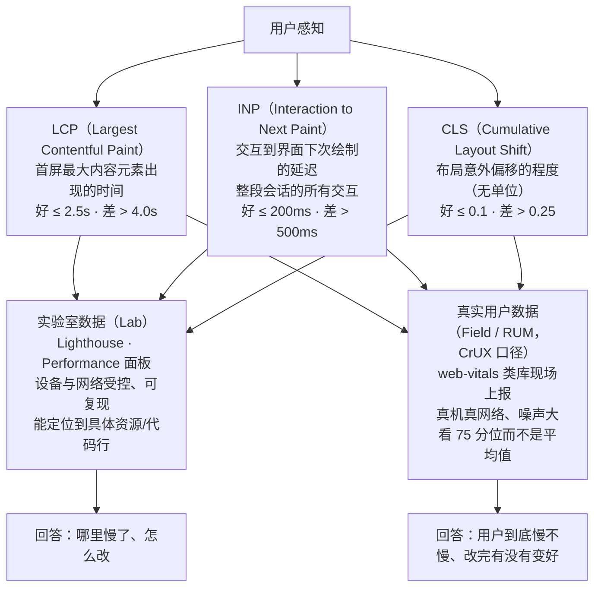
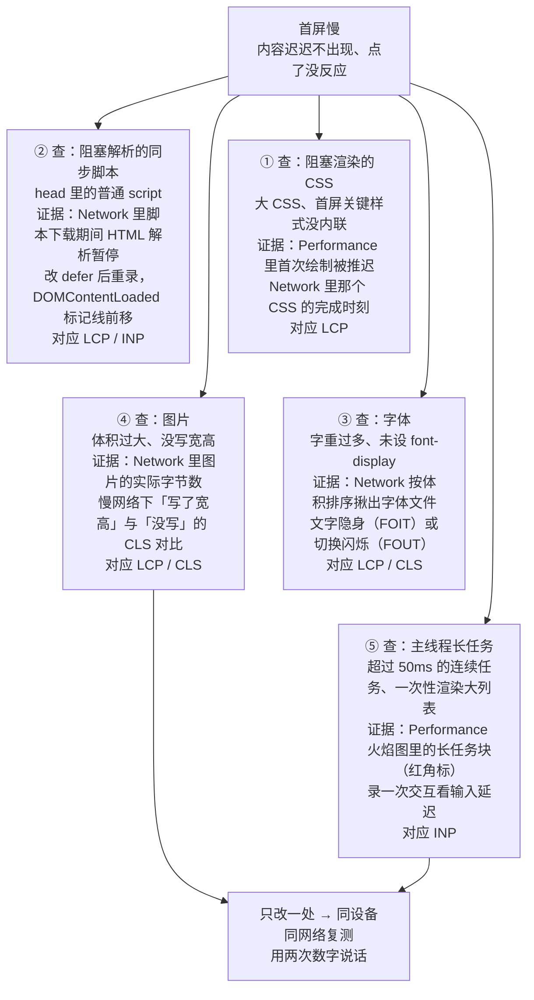
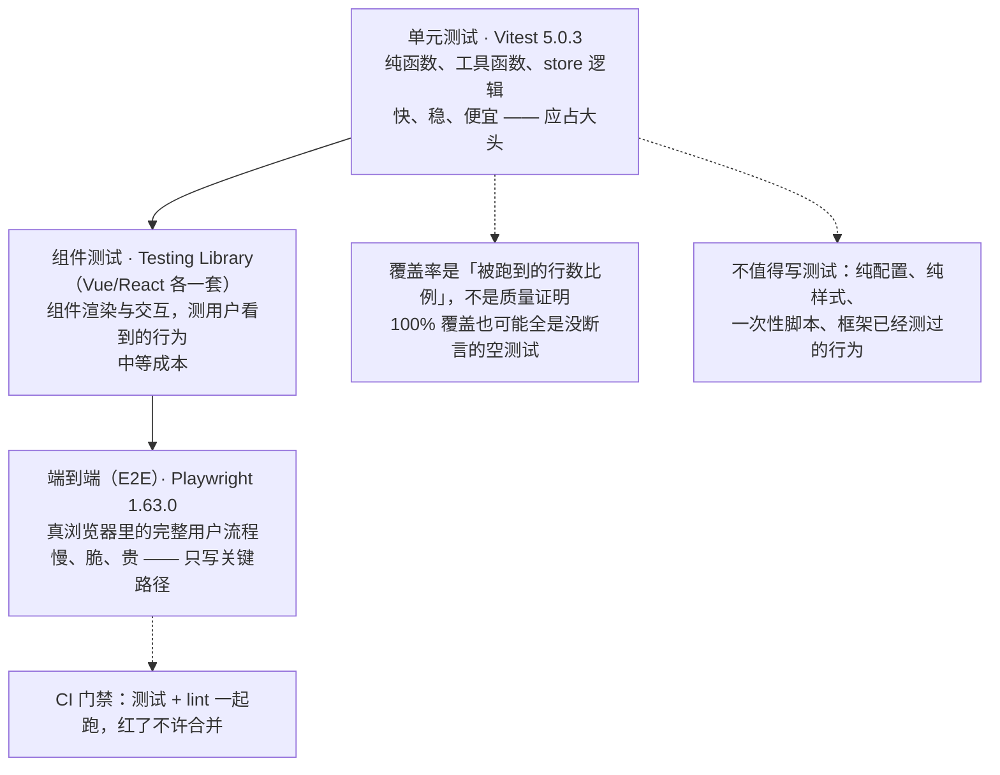

# M9 性能、可访问性、测试与部署

> 一句话：前八个模块解决"能不能做出来"，本模块解决"**做出来之后，快不快、人人能不能用、坏了知不知道该、上不上得去**"。
> 对应《Web 前端技术》课程大纲模块 M9（[[00-课程大纲]]）。

## 0. 这一块是怎么来的（历史一则）

浏览器性能测量不是一开始就以"用户体验"为中心的。最早的工具和习惯盯的是**资源的加载时间**——一个页面总共花了多久下完、某个请求排了多长的队。这类数字好采集，却常常和用户的真实感受对不上：页面"其实已经下载完"了，用户却觉得点什么都没反应。

于是测量口径慢慢从"加载花了多久"转向"**用户感受到了什么**"：内容什么时候出现在屏幕上、点下去多久才有响应、画面会不会自己乱跳。这一转向的产物就是今天的一整套以用户为中心的指标（[Core Web Vitals](https://web.dev/articles/vitals)）。其中有一项指标先是只测"**第一次**交互的输入延迟"，后来发现只测第一次会漏掉页面越用越卡的情况，于是被改成测**整段会话里所有交互**的响应延迟的新指标替代——旧的那项（FID）就这样被淘汰了。**网上还在讲 FID 的教程，一律按过时处理。**

这一段不需要记年份和人名，要记住的是背后的思路：**指标是用来替用户说话的，当指标说不清用户感受时，指标本身就该被换掉。**

## 1. 教学目标

| 维度 | 目标（用可考核的行为动词写） |
|---|---|
| 知识 | ① 说出 Core Web Vitals 三项（LCP / INP / CLS）各衡量什么，并给出各自的"好"与"差"阈值<br>② 说明 FID 已被 INP 取代，并解释为什么"只测第一次交互"不够<br>③ 区分实验室数据与真实用户数据，说出 Lighthouse 属于哪一类、各自能回答什么问题<br>④ 说清"阻塞渲染的 CSS"与"阻塞解析的脚本"，并正确选 `defer` 或 `async`<br>⑤ 说出可访问性里"优先原生语义"的理由，判断一段 ARIA 该不该加<br>⑥ 复述测试金字塔各层测什么，说出哪些代码不值得写测试<br>⑦ 说出 SPA 深层路由刷新 404 的成因与服务器回退配置的做法<br>⑧ 复述"前端没有秘密"：写进前端环境变量的密钥等于公开 |
| 能力 | ① 用 Lighthouse 与 Performance 面板定位到**具体一行/一个资源**，而不是停在总分<br>② 采集并解读现场数据（`web-vitals` 类库），能区分"实验室好看但用户嫌慢"<br>③ 对图片/字体/脚本做一轮可复现的优化，并用"改前改后两次测量"证明有效<br>④ 用键盘和屏幕阅读器走通一条关键流程，找出不可达控件<br>⑤ 给纯逻辑函数写 Vitest 单元测试，改坏函数能让测试变红<br>⑥ 用 Playwright 写一条端到端流程，在 CI 里跑测试与 lint 门禁<br>⑦ 把带路由的项目部署上线，配好回退，用手机非本机网络验证 |
| 素养 · 工程规范 | ① 建立"**先测量、再优化、改完再测量**"的纪律，拒绝凭感觉优化<br>② 把可访问性当作"结构清晰的副产物"，而不是给少数人做的额外工作<br>③ 为"不可回滚的发布"负责：版本、回退预案、错误上报先于炫技<br>④ 对"加了缓存/memo/微前端就更快"这类口号保持怀疑，一律用数据说话 |

**本模块学完后应能独立完成的一件事**：拿一个自己写的、带路由的 SPA，独立走完一遍"**体检 → 定位 → 优化 → 复测 → 测试 → 部署 → 监控**"闭环——用 Lighthouse 与 `web-vitals` 说清它现在什么水平，定位到一个具体瓶颈并改掉、再用第二次测量证明，为其中的纯逻辑函数补上单元测试并演示测试能变红，写一条 Playwright 端到端流程，最后部署到公网、处理好 SPA 路由刷新，并用手机在非本机网络下验证通过。

## 2. 学时分配与讲授节奏

10 学时 = 450 分钟（讲授 270 + 实验上机 180）。"1 学时 45 分钟"的换算按本校本课程口径。

| 序 | 主题 | 讲授分钟 | 实验上机分钟 | 教学形式 |
|---|---|---|---|---|
| 1 | 性能是功能需求：Core Web Vitals 三项与阈值、FID 为何被 INP 取代 | 30 | 0 | 讲 + 演示 |
| 2 | 测量方法：Lighthouse 实验室数据 vs 真实用户数据、Performance 火焰图、web-vitals 现场采集 | 30 | 45 | 讲 + 上机 |
| 3 | 关键渲染路径：阻塞渲染的 CSS、阻塞解析的脚本、defer 与 async | 30 | 0 | 讲 + 火焰图演示 |
| 4 | 字体与图片优化：font-display、字重与子集、中文字体体积约束、现代格式、宽高治 CLS | 45 | 0 | 讲 + 演示 |
| 5 | 代码分割、预加载、缓存与 CDN、主线程与长任务 | 30 | 0 | 讲 + 演示 |
| 6 | 可访问性：语义、键盘与焦点、屏幕阅读器、ARIA 边界、对比度、动效降级 | 45 | 0 | 讲 + 演示 |
| 7 | 测试：金字塔、Vitest 单元/组件、Playwright E2E、覆盖率取舍、CI 门禁 | 30 | 45 | 讲 + 上机 |
| 8 | 部署：静态托管、SPA 回退、环境与密钥、发布与回滚、监控、上线检查 | 30 | 45 | 讲 + 上机 |
| 9 | 综合实验冲刺与验收答辩（前后两次 Lighthouse + E2E + 部署验证） | 0 | 45 | 上机 |
| **合计** | | **270** | **180** | **450 分钟** |

节奏说明：第 1、3、4、5、6 次课以讲授为主，工具操作必须**现场投屏做**，不放录屏；第 2、7、8 次课"讲一半、上机一半"，上机的第一步永远是"先把现状测出来"，不允许学生一上来就改代码。

## 3. 逐节讲授要点

### 3.1 性能是功能需求：Core Web Vitals 三项（对应第 1 讲）

**要讲什么**
- 先立一个判断：**性能不是"优化到极致"的锦上添花，而是上线门槛**。加载慢、点了没反应、画面乱跳，产品功能就等于没交付。
- 三项指标分别衡量什么、阈值多少：

| 指标 | 衡量什么 | 好 | 需改进 | 差 |
|---|---|---|---|---|
| LCP（Largest Contentful Paint） | 首屏最大内容元素出现的时间 | ≤ 2.5s | 2.5–4.0s | > 4.0s |
| INP（Interaction to Next Paint） | 交互到界面下次绘制的延迟（整段会话所有交互） | ≤ 200ms | 200–500ms | > 500ms |
| CLS（Cumulative Layout Shift） | 布局意外偏移的程度（无单位） | ≤ 0.1 | 0.1–0.25 | > 0.25 |

- 讲清演进：早期只测"第一次交互的输入延迟"（FID），它漏掉了"页面越用越卡"；INP 覆盖**所有交互**并取一个代表性值，因此 FID 被取代。
- 强调：阈值不是永恒真理，**引用前先看该页当前口径**（见 [[#9. 出处与依据说明|第 9 节出处]]）。



> **图 1**：Core Web Vitals 三项（LCP / INP / CLS）各自衡量的用户感知，以及实验室数据与真实用户数据（CrUX / RUM）各自回答的问题。
> **看图要点**：三项指标互不替代——LCP 好不代表 INP 好；阈值只是当前口径的快照，引用前先看该页当前值。实验室数据用来定位「哪里慢」，现场数据用来回答「用户到底慢不慢、改完有没有变好」。

**必须现场的开发者工具操作**
- 打开一个真实页面，按 `F12`（或 `Ctrl+Shift+I`）打开开发者工具（各面板用法见 [DevTools 文档](https://developer.chrome.com/docs/devtools/)）→ 点 **Performance** → 点圆形录制按钮（`Ctrl+E`）录一段交互 → 停止，指出"长任务"（超过 50ms 的主线程占用）标记，说明它和 INP 的关系。
- 按 `F12` → **Elements**（或按 `Ctrl+Shift+C` 直接点选元素），用"布局偏移"高亮，找到一个真实发生 CLS 的元素（多为没写宽高的图片、后插入的广告/提示条）。

**要提问学生的 2-3 个问题及期望答案**
1. "一个页面加载 1.8 秒就显示完了，但点按钮要 1 秒才反应，它 LCP 好不好？" → **LCP 可能很好，但 INP 很差**，两者互不替代。
2. "FID 和 INP 测的东西差在哪？" → FID 只测第一次交互的输入延迟；INP 测整段会话中所有交互到下次绘制的延迟，能反映"越用越卡"。
3. "CLS 是 0.4，用户会抱怨什么？" → 想点击时元素移动，点错；阅读时文字乱跳。

**学生一定会犯的错**
- 把"加载快"等同于"性能好"，不考虑响应性和稳定性。
- 记不住阈值，把 INP 的 200ms 记成 2s，或把 CLS 当成毫秒单位。
- 引用已经过时的 FID 当作现役指标。

### 3.2 测量方法：实验室数据 vs 真实用户数据（对应第 2 讲）

**要讲什么**
- 两类数据的分工，用一张表钉死：

| 维度 | 实验室数据（Lab） | 真实用户数据（Field / RUM） |
|---|---|---|
| 代表 | Lighthouse、Performance 面板 | `web-vitals` 类库上报的现场数据 |
| 环境 | 受控（设定设备、网络） | 五花八门的真机、真网络 |
| 优点 | 可复现、能定位到具体资源/代码行 | 反映真实人群，能发现"你测不到"的慢 |
| 缺点 | 不反映真实分布，容易"自我感觉良好" | 噪声大、难定位、需要样本量 |
| 回答的问题 | "**哪里**慢了、怎么改" | "**用户**到底慢不慢、改完有没有变好" |

- Lighthouse 是实验室数据：分数受"跑在什么设备/网络"影响很大，**不能只看总分**，要看它列出的是哪一条审计项、指向哪个资源。
- 现场数据靠 `web-vitals` 类库在页面里采集，上报到自建或第三方端点，再看**分位数（如 75 分位）**而不是平均值。
- 一句纪律：**没有测量数据的优化等于没做**；"我觉得这样更快"不是证据。

**必须现场的开发者工具操作**
- 按 `F12` → 点 **Lighthouse**（部分版本在 `»` 更多面板里）→ 选 Mobile → 点 Analyze page load 跑一次审计（官方说明见 [Lighthouse 概览](https://developer.chrome.com/docs/lighthouse/overview)），把报告里"总分"折叠起来，只看 Opportunities/Diagnostics 里**具体哪一条**在扣分，点开它指向的资源。
- 按 `F12` → **Performance** → 点圆形录制按钮（`Ctrl+E`）→ 操作页面 → 停止，读火焰图：找到最宽的那个函数/任务块，说明"定位到具体一行"是什么意思。
- 贴一段 `web-vitals` 类库的采集形态代码（仅示形态，不给完整可提交代码）。

**要提问学生的 2-3 个问题及期望答案**
1. "Lighthouse 分 98 分，能不能说这站对真实用户也快？" → **不能**，它只是你这次机器/网络下的实验室数据，真实用户要看现场数据。
2. "为什么现场数据看 75 分位，不看平均？" → 平均会被"要么很快要么很慢"的分布骗过；分位数更贴近"大多数用户"的体验。
3. "分数从 60 提到 90 就算成功吗？" → 不一定，要看**是哪个指标、哪个资源**被改善了，是不是用户真正感知到的那个。

**学生一定会犯的错**
- 只截图"总分"交差，说不出扣分项和对应资源。
- 在"无痕 + 高速网络 + 强机器"下测，结论乐观得不真实。
- 对已经上线的项目，只看实验室数据，从不采集现场数据。

### 3.3 关键渲染路径：阻塞的 CSS 与脚本（对应第 3 讲）

**要讲什么**
- 关键渲染路径（Critical Rendering Path）：浏览器把 HTML 变成像素，要经历"构建 DOM → 构建 CSSOM → 合并成渲染树 → 布局 → 绘制"。任何卡在这条链路上的资源都会推迟**第一次有内容**的时间，直接影响 LCP。
- **CSS 默认阻塞渲染**：浏览器要先有 CSSOM 才敢画，否则画出来是错的。
- **脚本默认阻塞解析**：普通 `<script>` 会暂停 HTML 解析、等下载并执行完；若又放在 `<head>` 且要等 CSS，就雪上加霜。
- `defer` 与 `async` 的差别，用一张表讲清：

| 写法 | 何时下载 | 何时执行 | 执行顺序 | 适用 |
|---|---|---|---|---|
| `<script>` | 立刻（阻塞解析） | 下载完立即，阻塞解析 | 按出现顺序 | 极少，非必要不用 |
| `<script async>` | 并行，不阻塞解析 | 下载完立即执行（**可能仍在解析中**） | **不保证顺序** | 独立、无依赖的脚本（统计、广告） |
| `<script defer>` | 并行，不阻塞解析 | **HTML 解析完成后、DOMContentLoaded 前** | **保证按顺序** | 需要 DOM、有依赖的业务脚本（多数首选） |
| `type="module"` | 并行 | 默认等价 **defer** 的行为 | 保证顺序 | 现代 ES 模块，默认就该这样 |

- 关键 CSS：首屏需要的少量样式内联，其余异步加载，避免一个大 CSS 文件卡住首屏。
- 讲清边界：`defer` 不是"更快下载"，它和 `async` 都是**并行下载**；差别在执行时机与顺序保证。

**必须现场的开发者工具操作**
- 现场改一个 `<script src>` 从普通到 `defer`；按 `F12` → **Network** → `Ctrl+E` 录制 → 再按 `F5` 刷新（**必须先开面板再刷新**，抓法见 [Network 面板教程](https://developer.chrome.com/docs/devtools/network)），对比 HTML 解析被暂停的时长。
- 按 `F12` → **Performance** → `Ctrl+E` 录制，看 DOMContentLoaded 与 First Contentful Paint 的标记线，把某段 JS 挪走后重录，指出线的位置变化。

**要提问学生的 2-3 个问题及期望答案**
1. "两个 `async` 脚本，谁先执行？" → **不确定**，谁先下载完谁先执行。
2. "脚本要用到 DOM，用 `defer` 还是 `async`？" → `defer`，它保证 DOM 就绪后再按顺序执行。
3. "为什么 CSS 会拖慢首屏？" → 浏览器要先构建完 CSSOM 才能渲染，CSS 是**阻塞渲染**的资源。

**学生一定会犯的错**
- 在 `<head>` 里放一堆 `<script>`，还全是阻塞式的。
- 给所有脚本无脑加 `async`，结果依赖顺序错乱、报 `undefined`。
- 以为 `defer`/`async` 能加快下载（其实改变的是执行时机）。

### 3.4 字体与图片优化（对应第 4 讲）

**要讲什么**
- **字体**：
  - `font-display: swap`（或用 `optional`）：字体没到之前先用后备字体显示，避免"文字隐身"（FOIT）；代价是可能有一次字体切换（FOUT）。
  - 只加载**用得到的字重**：引入 5 个字重往往只有 2 个用得上，多出来的每个都是首屏负担。
  - **中文字体的工程约束**：常用汉字有数千个，中文字体文件体积通常是同类英文字体的**数倍到数十倍**，一个未做处理的中文字体动辄几百 KB 甚至更大，是首屏的隐形杀手。对策是**子集化**（只打包页面实际用到的字符）与按需加载，而不是整包引入。
- **图片**（往往同时是 LCP 的元凶和 CLS 的元凶）：
  - 现代格式：WebP / AVIF，在同等观感下体积远小于传统格式；用 `<picture>` 或构建工具按需转换。
  - 按**显示尺寸**出图：手机上显示 300px 宽的图，不要给它 2000px 的大图；配 `srcset`/`sizes`。
  - 懒加载：首屏外的图加 `loading="lazy"`（首屏主图**不要**懒加载，它要尽早出现）。
  - **必须写宽高**（`width`/`height` 或 CSS `aspect-ratio`）：让浏览器预留空间，否则图片一加载就把下面内容顶下去——这正是 CLS 最常见的成因。

**必须现场的开发者工具操作**
- 按 `F12` → **Network** → `Ctrl+E` 录制 → `F5` 刷新，按资源大小排序，揪出最大的图片与字体文件，看它们的实际字节数。
- 用 DevTools 的 device toolbar（按 `F12` → `Ctrl+Shift+M`）模拟慢网络，对比"写了宽高"和"没写宽高"两张图片的 CLS 数值差异。
- 打开一个中文字体文件对比其体积与一个英文字体，让学生亲眼看到"数倍"是什么概念。

**要提问学生的 2-3 个问题及期望答案**
1. "图片为什么要写 `width`/`height`？" → 让浏览器提前预留空间，避免加载时把下面内容顶走，**治 CLS**。
2. "首屏主图要不要 `loading="lazy"`？" → **不要**，首屏元素越早出现越好；懒加载留给首屏之外。
3. "中文字体为什么要子集化？" → 中文字体体积是英文的很多倍，整包加载会明显拖慢首屏。

**学生一定会犯的错**
- 引入一整套字体、全部字重，页面只用到一两个。
- 直接把设计给的 2 倍/3 倍大图原样塞进页面，不做尺寸适配。
- 只用 `loading="lazy"`，却始终不写宽高，CLS 一直治不好。
- 把首屏主图也懒加载，反而把 LCP 拖差。

### 3.5 代码分割、缓存、CDN 与主线程（对应第 5 讲）

**要讲什么**
- **代码分割**：别把所有页面打进一个包。路由级懒加载让用户只下载当前用得到的代码（这是 M6/M7 路由懒加载在性能上的落地）。
- **预加载策略**：
  - `preload` 提前拉**当前页**马上要用的关键资源（字体、首屏大图、关键 JS）。
  - `prefetch` 空闲时预取**下一步可能用**的资源（预判用户会点的下一个页面）。
  - 边界：预加载是"抢优先级"，用在非关键资源上反而会挤占首屏带宽，**要克制**。
- **缓存与 CDN**：
  - 带内容哈希文件名的静态资源 → 长缓存：`Cache-Control: max-age=31536000, immutable`。
  - HTML 短缓存或不缓存，保证"新版本能及时生效"。
  - 静态资源交给 CDN 就近分发，减少物理距离带来的延迟。
- **主线程与长任务**：
  - 主线程既跑 JS 又负责渲染，任何超过 50ms 的任务都可能让交互"卡住"，直接拖差 INP。
  - 把重计算移入 **Web Worker**（它跑在另一个线程，不阻塞 UI）。
  - 大列表**不要一次性渲染**：虚拟列表 / 分页 / 分批渲染，先给用户能看能点的部分。



> **图 2**：首屏慢的瓶颈定位流程——五类卡点（并列关系，两列排布、不分先后）各自连同它的证据（面板与指标），最后回到「只改一处 + 同条件复测」。
> **看图要点**：每条证据都必须落到**具体一个资源或一段代码**，而不是「总分扣了分」；括号里的面板是取证地点（Network 看资源与体积、Performance 看标记线与长任务），括号后的指标说明这条卡点会拖差哪一项。改完必须复测，条件与改前一致。

**必须现场的开发者工具操作**
- 按 `F12` → **Performance** → `Ctrl+E` 录制 → 停止，找一个长任务（红角标），把它对应的代码挪进 Worker 或切分后重录，看长任务是否消失。
- 渲染一个几千行的大列表，按 `F12` → **Performance** → `Ctrl+E` 录制一次交互，指出"一次性渲染"造成的输入延迟；再对比分批渲染。

**要提问学生的 2-3 个问题及期望答案**
1. "为什么把重计算放进 Web Worker 能改善 INP？" → Worker 在独立线程跑，**不占用主线程**，交互能及时得到响应与绘制。
2. "`preload` 是不是越多越好？" → 不是，它会抢别的资源的带宽/优先级，只对当前页关键资源用。
3. "HTML 能不能也长缓存？" → 不建议，会导致新版本发布后用户拿不到新 HTML；HTML 要短缓存或不缓存。

**学生一定会犯的错**
- 给整个站点所有资源都加 `preload`，结果更慢。
- 大列表 `v-for`/`map` 一次性渲染几千条，交互明显卡。
- HTML 和带哈希的 JS 用了同样的长缓存，发版后页面白屏。
- 以为"拆了包就一定更快"，把包拆得过碎、请求数暴增。

### 3.6 可访问性：语义、键盘、屏幕阅读器、ARIA 边界（对应第 6 讲）

**要讲什么**
- **它不是给"少数人"的额外工作**：结构清晰、语义正确的页面，天然对键盘用户、屏幕阅读器用户、甚至搜索引擎都友好。语义写对，这一节完成大半。
- **优先原生语义**：能用 `<button>` 就别用 `<div onclick>`；能用 `<a href>` 就别用 JS 跳转的假链接。原生元素自带键盘行为、焦点能力、角色与状态。
- **ARIA 的适用边界**：ARIA 是"当原生元素确实表达不了时才补的说明书"，**不是装饰**。老话讲得直白：**能不用 ARIA 就不用；用了半套 ARIA 比完全不用更糟**——错误的角色/状态会主动误导屏幕阅读器。
- **键盘可达与焦点管理**：
  - 所有可操作控件都要能 `Tab` 走到、能被激活。
  - **可见焦点**：不要 `outline: none` 一删了事，要给出清晰的焦点样式。
  - 弹窗/抽屉打开时，焦点移入并**限制在弹窗内**，关闭时焦点还给触发它的元素。
- **屏幕阅读器的验证方法**：不要"看着像对的"就算数，**戴上耳机真的用屏幕阅读器走一遍**关键流程。
- **对比度**：正文文字与背景对比度至少 **4.5:1**，大字号可放宽。
- **动效降级**：为对动效敏感的用户提供 `prefers-reduced-motion` 降级，关掉/减弱位移动画。

**必须现场的开发者工具操作**
- **全程只用键盘**走一遍：登录 → 打开菜单 → 提交表单，记下"在哪里卡住、Tab 去了哪"。
- 按 `F12` → **Elements**，展开无障碍树（Accessibility）看一个控件的角色与念法；也可开一次操作系统自带的屏幕阅读器，听它怎么念一个用 `<div onclick>` 做的"按钮"。
- 按 `F12` → **Lighthouse** 里勾选 Accessibility 扫一遍（判据见 [WCAG 2.2](https://www.w3.org/TR/WCAG22/)，可访问性基础见 [MDN 无障碍](https://developer.mozilla.org/zh-CN/docs/Learn_web_development/Core/Accessibility)），但强调**它只是底线**，过不了它不代表真的可访问，过了也不代表就好用。

**要提问学生的 2-3 个问题及期望答案**
1. "`<div onclick>` 和 `<button>` 对键盘用户差在哪？" → `div` 默认不可聚焦、不响应回车/空格、没有按钮角色；`<button>` 这些全有。
2. "一个图标按钮只有图标没有文字，屏幕阅读器念什么？" → 需要 `aria-label`（或可见文本/`title`），否则念不出含义。
3. "能不能给所有元素都加 ARIA 让它更'可访问'？" → 不能，**错误的 ARIA 更糟**；优先用原生语义。

**学生一定会犯的错**
- 用 `div`/`span` 加 `onclick` 冒充按钮，键盘完全用不了。
- `outline: none` 去掉所有焦点框，键盘用户"不知道自己在哪"。
- 图片 `alt` 写 "图片" 或干脆不写。
- 对比度不够（浅灰字配白底）却觉得"设计好看就行"。
- 给所有东西乱加 `role`，反而破坏了原生语义。

### 3.7 测试：金字塔、Vitest、Playwright、CI 门禁（对应第 7 讲）

**要讲什么**
- **测试金字塔**（从下到上，越多越靠下）：

| 层次 | 测什么 | 工具（本模块口径） | 特点 |
|---|---|---|---|
| 单元测试 | 纯函数、工具函数、store 逻辑 | Vitest 5.0.3 | 快、稳、便宜，**应占大头** |
| 组件测试 | 组件渲染与交互 | Testing Library（Vue/React 各一套） | 中等成本，测"用户看到的行为" |
| 端到端（E2E） | 真浏览器里的完整用户流程 | Playwright 1.63.0 | 慢、脆、贵，**只写关键路径** |

- **覆盖率与性价比的取舍**：覆盖率是"被跑到的行数比例"，**不是质量证明**。100% 覆盖也可能全是没断言的空测试。按性价比写：纯逻辑函数值得写；关键用户路径值得写 E2E；**组件内部实现细节不值得写**（一重构就崩）。追求"覆盖率数字好看"会逼人写垃圾测试。
- **哪些代码不值得测**：纯配置、纯样式、一次性脚本、框架已经测过的行为（别重复测框架）。
- **Vitest** 与 Vite 共用配置，装了就能跑，是当前 Vite 项目单元测试的默认选择。
- **Playwright** 用真浏览器跑完整流程，失败时给截图/录屏/trace，定位方便。
- **CI 门禁**：在 CI 里跑 `测试 + lint`，红了就不许合并。门禁的价值在于"**让问题在合并前暴露**"，而不是事后补救。



> **图 3**：测试金字塔——从下到上的层次、工具与成本，以及覆盖率的取舍边界。
> **看图要点**：越靠下越快越稳越便宜，因此数量应当越多（单元占大头）；越靠上越慢越脆越贵，只写关键用户路径。右侧三条虚线是取舍判据：覆盖率不是质量证明，组件内部实现细节不值得写，纯配置/纯样式/一次性脚本/框架已测过的行为不必重复测。

**必须现场的开发者工具操作**
- 现场给一个纯函数写 [Vitest](https://vitest.dev/guide/) 测试，跑绿；然后**故意改坏函数**，重跑，展示测试变红（这一步是本模块的核心现场操作，不许跳过）。
- 现场用 [Playwright](https://playwright.dev/docs/intro) 写一条 E2E（打开首页 → 搜索 → 点第一项 → 断言详情文字），跑通；展示失败时的截图。
- 打开一份覆盖率报告，指出"这些红行是不是值得测"。

**要提问学生的 2-3 个问题及期望答案**
1. "覆盖率 100% 是不是就说明代码没问题？" → **不是**，覆盖率高不代表断言有效，覆盖不到"逻辑对不对"。
2. "组件内部实现细节要不要写测试？" → **一般不值得**，一重构就崩，维护成本高。
3. "为什么门禁要跑 lint 和测试两个？" → 它们各自拦不同问题：lint 拦风格/易错写法，测试拦行为回归，缺一个都会漏。

**学生一定会犯的错**
- 把测试写成"必然通过"的空壳，只为了凑覆盖率数字。
- 给每个小组件都写测试，维护成本爆炸，最后全删。
- 测试依赖执行顺序或真实网络，偶发变红查不出原因。
- 改了函数却忘了跑测试，凭"我觉得没问题"就提交。

### 3.8 部署：上线、回退与监控（对应第 8 讲）

**要讲什么**
- **静态产物托管**：`npm run build` 产出的 `dist/` 是一堆**纯静态文件**，可以放静态托管平台、对象存储 + CDN，或自己的 nginx/Caddy。
- **上线前必须先 `npm run preview` 本地验证**：开发环境能跑不代表生产产物能跑（常见坑：资源路径、`base` 配置、环境变量）。
- **SPA 深层路由刷新 404**：SPA 路由是前端管的，服务器直接访问 `/detail/123` 时找不到该文件 → 404。解决：配置"**找不到文件就返回 `index.html`**"（nginx 写 `try_files $uri /index.html;`，托管平台也有对应设置）。这不是框架的 bug，是服务端不知道这个路径也归你管。
- **环境与密钥管理**：**前端没有秘密**。任何写进前端代码、前端环境变量的东西，用户都能看到。构建期注入的变量不是保密手段；真正的密钥留在服务端，前端只通过接口调用。
- **发布与回滚**：每次发布有版本标识；带哈希的静态资源可长缓存，配合**上一版产物保留**实现快速回滚（回滚往往只是把流量切回旧版本）。
- **错误上报与监控**：上线不是终点。接错误上报，页面崩溃/接口失败能收到告警；性能也要有现场数据（见 [[#3.2 测量方法：实验室数据 vs 真实用户数据（对应第 2 讲）|3.2]]），否则改完不知道有没有变好。
- **上线前检查清单**（课堂必须逐条过）：见本节末"检查清单"。

**必须现场的开发者工具操作**
- 现场在项目根目录执行 `npm run build` + `npm run preview`（命令口径见 [Vite](https://vite.dev/guide/)），然后在浏览器按 `F5` 刷新一个深层路由地址，**亲手制造一次 404**，再改服务器回退配置修好它。
- 演示"密钥打进前端"：把假的 key 写进前端环境变量构建后，在产物里 `grep` 出来给学生看——**这就是为什么说前端没有秘密**。

**要提问学生的 2-3 个问题及期望答案**
1. "刷新 `/detail/123` 为什么 404？" → 服务器找不到名为 `/detail/123` 的文件；SPA 需要配置**回退到 index.html**。
2. "把密钥写进前端环境变量安全吗？" → **不安全**，构建后它会出现在产物里，任何人可见；密钥必须放服务端。
3. "上线后第二天发现严重 bug，怎么办？" → **回滚到上一版产物**，再在本地复现修复；所以发布要留版本与回退能力。

**学生一定会犯的错**
- 从来没跑过 `preview`，直接上线，产物路径全是 404。
- 把 API key 写进前端 `.env` 就以为"配好了、安全了"。
- 上线就走人，没接错误上报，用户报错才知道挂了。
- 只发一版、不留旧产物，出问题无法快速回退。

### 3.9 安全视角：把安全接进 CI，而不是"加一次课"（插入节 · 建议 20 分钟）

> **定位**：§3.7（测试与 CI 门禁）之后接本节最自然——**安全门与质量门是同一套流水线**。完整内容见 [[22-前端安全专章（OWASP × ATT&CK）]] §8。

**（1）五道自动化门 + 一道人工门**（板书建议照抄 22 号图 4）：依赖扫描（SCA）→ 密钥扫描 → 静态检查（SAST）+ lint → 构建产物检查（搜密钥、确认不发布 sourcemap）→ 安全头检查（CSP 先 `report-only`）→ **人工审查**（Secure Code Review 清单）。
**原则**：能被自动化的先自动化（便宜、稳定、不靠人自觉），人工只审"工具看不到的逻辑与设计"。

**（2）上线前自检十项**（22 号 §8.4 有可勾选版）：全站 HTTPS + HSTS｜安全响应头齐备（CSP／`frame-ancestors`／`X-Content-Type-Options: nosniff`／`Referrer-Policy`）｜cookie 三属性（`HttpOnly`／`Secure`／`SameSite`）｜按上下文转义且每处 `innerHTML` 有理由｜富文本走成熟净化器｜CORS 白名单是具体源｜lockfile + `npm ci` + SCA 无高危 + 已生成 SBOM｜产物搜不到密钥与内网地址｜错误页不泄露栈与路径｜已跑一次 WSTG 客户端测试清单。

**（3）该测什么有现成清单**：OWASP **WSTG 4.11 客户端测试共 15 项**（DOM 型 XSS／JavaScript 执行／HTML 注入／客户端 URL 跳转／CSS 注入／客户端资源操控／CORS／点击劫持／WebSockets／Web Messaging／浏览器存储／Cross Site Script Inclusion／反向标签页劫持／客户端模板注入）——**可直接当验收表**。

**（4）本模块实验的加固点**：实验二"证明测试会变红"的方法同样用于安全——例如产出一个**含假密钥**的构建产物，证明密钥扫描门**会红**；或把 CSP 先切成 `report-only`、再切强制，让学生亲眼看到从"页面被打坏"到"可用"的收敛过程。

> **本节出处**：门禁顺序、自检项与 WSTG 15 项清单取自 22 号 §8（依据为 OWASP Proactive Controls 2024 与 WSTG 已核实页）；实验加固点的设计属教学编排。

## 4. 关键概念讲透

### 4.1 关键渲染路径（Critical Rendering Path）

- **是什么**：浏览器把 HTML 变成屏幕上像素的必经链路——构建 DOM → 构建 CSSOM → 合成渲染树 → 布局（算位置尺寸）→ 绘制。链路上任何一步被卡住，"第一次有内容"就会推迟。
- **为什么这样设计**：浏览器没有完整的样式信息时不敢绘制（画出来会错），所以 CSS 会**阻塞渲染**；而脚本可能改 DOM/CSSOM，为了一致性，普通脚本会**阻塞 HTML 解析**。这不是缺陷，是保证正确性的顺序约束。
- **与相邻概念的边界**：区分"**阻塞渲染**（CSS）"与"**阻塞解析**（普通脚本）"是两种不同的卡点；`defer`/`async` 解决的是解析阻塞，不是把 CSS 变快。
- **最小示例（仅示形态）**：

```html
<!-- 仅示形态：关键 CSS 内联，其余样式异步，脚本不阻塞解析 -->
<head>
  <style>/* 首屏关键样式，几行内联 */ body{margin:0;font-family:system-ui}</style>
  <link rel="stylesheet" href="/rest.css" media="print" onload="this.media='all'">
  <script src="/app.js" defer></script>
</head>
```

- **一句判据**：**"它在'第一次看到内容'这条链路上吗？在，就优先处理它。"**

### 4.2 以用户为中心的指标：Core Web Vitals 三项

- **是什么**：LCP（内容出现快不快）、INP（交互响应灵不灵）、CLS（画面稳不稳）三个指标，分别对应加载、响应、视觉稳定三种用户感知。
- **为什么这样设计**：早年的"加载时间"指标好采集但与感受脱节；把口径换成"用户感知到了什么"，测量才能替用户说话。FID 被 INP 取代，正是因为"只测第一次交互"说不清"越用越卡"。
- **与相邻概念的边界**：**三项不可互相替代**。LCP 好不代表 INP 好（内容出来了但点了没反应）；INP 好不代表 CLS 好（反应快但画面乱跳）。
- **最小示例（仅示形态）**：

```js
// 仅示形态：采集现场数据（用 web-vitals 类库），上报分位数
import { onLCP, onINP, onCLS } from 'web-vitals';
const report = (m) => navigator.sendBeacon('/rum', JSON.stringify({ name: m.name, value: m.value }));
onLCP(report); onINP(report); onCLS(report);
```

- **一句判据**：**"这个数字，能不能翻译成一句用户会说的话？"**（"半天不显示""点了没反应""字乱跳"）

### 4.3 主线程与长任务（为什么把重计算挪进 Worker）

- **是什么**：主线程既要执行 JS，又要做布局与绘制。一个占用超过约 50ms 的连续任务（长任务）会挡住绘制，用户点下去要等它跑完才有反应。
- **为什么这样设计**：浏览器是单线程跑页面脚本的（渲染与 JS 共享主线程），这是长期的设计约束；Web Worker 提供了**另开线程跑计算**的出口，但 Worker 不能直接碰 DOM。
- **与相邻概念的边界**：`setTimeout(…, 0)` 把代码"推到下一轮"并不真正并行，长任务只是被切碎、总时长没变；真正卸载重计算要用 **Worker**。虚拟列表治的是"渲染太多 DOM"，Worker 治的是"计算太久"，两者治不同的病。
- **最小示例（仅示形态）**：

```js
// 仅示形态：把重计算从主线程挪到 Worker
const worker = new Worker(new URL('./heavy.js', import.meta.url), { type: 'module' });
worker.postMessage({ rows: bigArray });
worker.onmessage = (e) => render(e.data.result);   // 主线程只负责渲染
```

- **一句判据**：**"主线程只该做'尽快把界面画出来'，算账的事交给别人。"**

### 4.4 原生语义优先于 ARIA

- **是什么**：正确使用 `<button>`、`<nav>`、`<label for>`、`<a href>` 等原生元素，本身就带角色、状态、键盘行为；ARIA 是原生表达不了时的补丁。
- **为什么这样设计**：原生元素的键盘与无障碍行为由浏览器保证，一致且免费；手写 ARIA 要自己维护角色、状态、焦点，错一点就会**主动误导**屏幕阅读器。
- **与相邻概念的边界**：ARIA 不改变元素的实际行为——给 `<div role="button">` 加角色，它也**不会**自动支持回车/空格，你还得自己补键盘处理和焦点。所以能用原生就用原生。
- **最小示例（仅示形态）**：

```html
<!-- 好的写法：原生语义，键盘与屏幕阅读器天然可用 -->
<button type="button" aria-pressed="false">收藏</button>
<label for="q">搜索</label><input id="q" type="search">
<!-- 差的写法：div 冒充按钮，键盘用不了 -->
<!-- <div class="btn" onclick="fav()">收藏</div> -->
```

- **一句判据**：**"能用原生元素表达，就绝不手写 ARIA。"**

## 5. 常见误区与诊断

| 学生症状 | 真实病根 | 课堂怎么纠正 |
|---|---|---|
| 优化只盯 Lighthouse **总分**，截图交差 | 不知道总分是多项审计的加权结果，看不见具体扣分项与对应资源 | 课上要求**折叠总分**，只看 Opportunities/Diagnostics，报告必须写出"扣分项 + 指向的资源/代码行"才算合格 |
| 到处加 `memo`/`useMemo`/`computed` 反而更慢 | 比较与缓存本身有开销，且开销常大于被省下的重算 | 现场加一堆 memo 后测一次，用**长任务/耗时**数据证明"反而变慢"，回到"先测再改" |
| 用 `<div onclick>` 代替 `<button>`，键盘不可用 | 只知道"能点"，不知道原生元素自带键盘与角色 | 只用键盘走一遍现场卡住，再换成 `<button>` 对比；问"回车上能不能触发" |
| 图片不写 `width`/`height`，加载时布局抖动 | 不知道浏览器需要预留空间才能避免偏移 | 慢网络下对比"写/不写宽高"的 CLS，把抖动录屏给学生看 |
| 把密钥打进前端环境变量，以为安全了 | 误以为"构建注入"等于"藏起来" | 构建后在产物里 `grep` 出这个假 key，当面证明"前端没有秘密" |
| 优化前不测量，凭"我觉得"改代码 | 没有建立测量纪律，把优化当直觉 | 强制作业交"**改前/改后两次 Lighthouse 数字 + 改了哪一行 + 为什么影响该指标**" |
| 首屏主图也 `loading="lazy"` | 把"懒加载"当万能优化 | 讲清 LCP 要素要**尽早出现**，懒加载只给首屏之外 |
| 脚本全加 `async`，依赖顺序错乱 | 混淆 `async` 与 `defer` 的顺序保证 | 现场演示两个 `async` 谁先跑不确定导致报错，改用 `defer` |
| 中文字体整包引入，首屏很慢 | 不知道中文字体体积是英文的多倍 | 对比字体文件体积，讲子集化与只加载用到的字重 |
| 为凑覆盖率写"必然通过"的空测试 | 把覆盖率数字当成质量目标 | 展示一份 100% 覆盖但无有效断言的报告，讲"覆盖率≠正确性" |
| 上线从不跑 `preview`，深层路由 404 | 把 `dev` 当生产用 | 现场 `build`+`preview`，亲手制造并修复一次深层路由 404 |

## 6. 本模块实验

### 实验一 · 用 Lighthouse 做一次可复现的性能体检（对应第 1–5 讲）

- **目的**：掌握"**改前跑一次 → 定位并改一行 → 改后再跑一次**"的完整闭环，能用数据说明改动的因果，而不是停在总分。
- **环境**：本机 [Node.js](https://nodejs.org/zh-cn) v26.7.0 + npm 11.19.0；[Vite](https://vite.dev/guide/) 8.3.1 项目；Chrome/Edge [DevTools](https://developer.chrome.com/docs/devtools/)；网络与设备条件在报告中注明（同一条件跑前后两次）。
- **任务描述**：
  1. 选一个自己写的、带路由与若干图片/字体的页面，固定设备与网络（例如同一档节流），**第一次运行 Lighthouse**，记下 LCP / INP（若可）/ CLS 与 Accessibility 分项。
  2. 在 Opportunities/Diagnostics 里挑**一条**扣分项，定位到具体资源或代码行。
  3. **只改这一处**（例如：给图片补宽高治 CLS、把阻塞脚本改 `defer`、字体加 `font-display: swap`、路由改懒加载）。
  4. **第二次运行 Lighthouse**（同设备同网络），对比前后数字。
- **验收判据（可自测）**：
  - 报告里写明**改了哪一行代码**（可粘贴 diff 片段）。
  - 报告里写明**为什么这一行会影响该指标**（一句机制说明，不能说"优化了一下"）。
  - 前后两次测量条件一致，且被改指标有可见变化（变好或"没变好并解释为什么"）。
  - 说不出"改了哪一行、为什么"的，判为**未完成**。
- **提交物**：一份前后对比报告（含两次截图 + 一行 diff + 一句机制说明）+ 改动提交记录。
- **评分要点**：能否**定位到行**（40%）；因果解释是否成立（30%）；两次测量条件是否可比（20%）；报告是否克制（不堆无关结论）（10%）。

### 实验二 · 给纯逻辑函数写 Vitest 单元测试，并证明测试会变红（对应第 7 讲）

- **目的**：建立"测试是**能失败**的断言集合"这一概念，而不是走过场。
- **环境**：本机 Node v26.7.0 + npm 11.19.0；Vitest 5.0.3（与 Vite 8.3.1 共用配置）。
- **任务描述**：
  1. 从自己的项目里挑一个**纯逻辑函数**（过滤、排序、格式化、金额计算等，无副作用、依赖少）。
  2. 写单元测试，覆盖**边界情况**：空输入、缺字段、极端值、类型边界。
  3. 跑一次，全绿。
  4. **故意改坏该函数**（改一个比较符、删一个分支），重跑，**测试必须变红**。
  5. 记录那一条红掉的用例输出了什么。
- **验收判据（可自测）**：
  - 测试能全绿；改坏函数后**至少一条用例变红**。
  - 红掉时能说清"是哪个输入、期望什么、实际什么"。
  - 边界用例真实存在（空数组、缺字段等），不能只测"正常路径"。
- **提交物**：测试文件 + 一段"我改坏了什么、哪条用例红、报错原文"的记录。
- **评分要点**：测试是否**真的能失败**（40%）；边界覆盖（30%）；改坏后的诊断描述是否准确（20%）；用例是否克制、无冗余（10%）。
- **注意**：本实验只给验收判据与评分要点，**不给可直接提交的完整代码**；示例仅示形态。

### 实验三 · Playwright 端到端流程 + 部署上线 + SPA 路由回退 + 真机验证（对应第 7–8 讲）

- **目的**：把"测试 → 部署 → 真实验证"串成一条链，建立"上线不是终点"的意识。
- **环境**：本机 Node v26.7.0 + npm 11.19.0；Playwright 1.63.0；任一静态托管平台或自有静态服务器；**一部手机（用非本机网络，如蜂窝数据）**。
- **任务描述**：
  1. 用 Playwright 写**一条端到端流程**：打开首页 → 搜索 → 点第一项 → 断言详情页出现预期文本。
  2. `build` + `preview` 本地验证产物能跑通。
  3. 部署到任一静态托管或服务器，**处理 SPA 深层路由刷新**：直接访问/刷新 `/detail/:id` 不 404（配置回退到 `index.html`）。
  4. **用手机在非本机网络（蜂窝数据，不用本机 Wi-Fi）打开链接**，走通关键流程并刷新一个深层路由。
  5. 接一个错误上报/监控（可用最小实现），并准备一次**回滚**演示（保留上一版产物或平台的历史版本）。
- **验收判据（可自测）**：
  - 本地一条命令能跑通 E2E；失败时有截图/录屏可定位。
  - 公网链接可访问；**手机蜂窝数据下**刷新深层路由**不 404**。
  - 能演示一次回滚（把线上切回上一版）。
  - 前端产物里**搜不到任何密钥**。
- **提交物**：E2E 测试文件 + 公网链接 + 手机非本机网络下的截图（含刷新深层路由）+ 回滚演示记录 + 上线检查清单勾选结果。
- **评分要点**：E2E 是否覆盖真实用户路径（30%）；SPA 回退是否正确（25%）；**手机非本机网络验证**是否真实完成（25%，仅本机截图不给分）；回滚与监控（20%）。

## 7. 本模块作业与自测题

1. **[3.1] [记忆/理解] [★]** LCP、INP、CLS 各衡量什么？写出各自的"好"与"差"阈值。并说明为什么 FID 会被 INP 取代。
2. **[3.2] [理解/分析] [★★]** 一个项目 Lighthouse 得分 98，但运营反馈"用户嫌慢"。请说明为什么会出现这种矛盾，并给出你会**增加采集**哪类数据、看哪个统计量。
3. **[3.3] [理解] [★]** 说明"阻塞渲染的 CSS"与"阻塞解析的脚本"的区别；对下面两种需求分别选 `defer` 还是 `async`：(a) 需要操作 DOM 且有依赖顺序的业务脚本；(b) 独立的第三方统计脚本。给出理由。
4. **[3.4] [应用/分析] [★★]** 一个页面首屏中文字体加载很慢、图片区不断把下方内容顶下去。分别写出至少两条针对**字体**与**图片**的改法，并说明每条治的是 LCP 还是 CLS。
5. **[3.5] [理解/应用] [★★]** 解释为什么把重计算放进 Web Worker 能改善 INP；再说明"给所有资源都加 `preload`"为什么可能适得其反。
6. **[3.6] [理解/评价] [★★]** 判断下列说法对错并说明理由：(a) "为了更可访问，应给所有元素都加 ARIA 角色"；(b) "页面结构语义写对了，可访问性就完成大半"；(c) "用 `<div onclick>` 也能做出按钮"。
7. **[3.7] [应用/评价] [★★]** 给出三层测试各适合测什么；再列出**至少三类不值得写测试**的代码，并说明理由。回答"覆盖率 100% 是否代表质量过关"。
8. **[3.8] [理解/应用] [★★]** 说明 SPA 深层路由刷新 404 的成因与服务器回退配置的做法；再解释"把密钥写进前端环境变量"为什么不安​​全。
9. **[读代码] [3.3 / 3.4] [分析] [★★★]** 读下面这段（仅示形态），指出至少三处性能或可访问性问题并给出改法：

```html
<head>
  <script src="/analytics.js"></script>
  <script src="/app.js"></script>
  <link rel="stylesheet" href="/huge.css">
</head>
<body>
  
  <div class="btn" onclick="submitForm()">提交</div>
</body>
```

10. **[编程] [3.7] [应用/创造] [★★★]** 给一个纯函数 `formatPrice(cents, currency)` 写 Vitest 单元测试：需覆盖正数、零、负数、极端大值、缺参数等边界。**只提交验收判据说明与测试文件**，并附一段"故意改坏函数后哪条用例变红"的记录。**不提供可直接提交的完整实现**。
11. **[编程] [3.7 / 3.8] [应用/综合] [★★★]** 用 Playwright 写一条端到端流程（首页 → 搜索 → 点第一项 → 断言详情文本），并把它接进 CI 门禁（与 lint 一起跑）。给出验收判据与评分要点，不给完整代码。
12. **[简答] [3.6 / 3.8] [评价] [★★]** 写一段"上线前检查清单"（不少于 8 条），要求覆盖：产物验证、路由回退、密钥、真机验证、监控与回滚。

## 8. 自我检查清单（学生用）

- [ ] 能说出 Core Web Vitals 三项，并写出各自的"好/差"阈值
- [ ] 能说明 FID 已被 INP 取代，以及为什么"只测第一次交互"不够
- [ ] 能区分实验室数据（Lighthouse）与真实用户数据（`web-vitals`），知道各自能回答什么问题
- [ ] 能独立用 Performance 面板定位到一个具体的长任务或资源
- [ ] 能正确区分并使用 `defer` 与 `async`，说得出顺序保证的差别
- [ ] 知道中文字体体积是英文的很多倍，并能说出至少两种字体优化手段
- [ ] 会为图片写宽高以治 CLS，且不会把首屏主图懒加载
- [ ] 能用键盘独自走通登录/提交等关键流程，并保留可见焦点样式
- [ ] 能用屏幕阅读器验证一个图标按钮确实被正确念出
- [ ] 能给纯逻辑函数写 Vitest 测试，并演示改坏函数后测试变红
- [ ] 能写一条 Playwright 端到端流程并在 CI 里跑起来
- [ ] 能把 SPA 部署上线、配好深层路由回退、并**用手机非本机网络**验证
- [ ] 上线前会过一遍检查清单，能演示一次回滚，且产物里搜不到任何密钥

## 9. 出处与依据说明

| 本模块小节 | 内容 | 出处（白名单） |
|---|---|---|
| 3.1 / 3.2 / 4.2 | Core Web Vitals 三项定义与阈值、FID→INP 的演进 | [Core Web Vitals](https://web.dev/articles/vitals) |
| 3.3 / 4.1 | 关键渲染路径、阻塞渲染的 CSS 与阻塞解析的脚本 | [MDN 关键渲染路径](https://developer.mozilla.org/zh-CN/docs/Web/Performance/Guides/Critical_rendering_path) |
| 3.6 / 4.4 | 可访问性基础、语义与键盘可达、ARIA 边界 | [MDN 无障碍](https://developer.mozilla.org/zh-CN/docs/Learn_web_development/Core/Accessibility) |
| 3.7 | Vitest 单元测试指南（当前 5.0.3） | [Vitest 单元测试指南](https://vitest.dev/guide/) |
| 3.7 / 实验三 | Playwright 端到端测试（当前 1.63.0） | [Playwright 端到端测试](https://playwright.dev/docs/intro) |
| 3.5 / 3.8 | Vite 构建与部署（当前 8.3.1） | [Vite 构建与部署](https://vite.dev/guide/) |
| 3.4 / 3.6 | CSS 相关（font-display、对比度、prefers-reduced-motion） | [web.dev Learn CSS](https://web.dev/learn/css) |

**版本口径**（2026-10-01 实查 [npm registry](https://registry.npmjs.org/) `latest` 与本机实测，与本套笔记其余篇一致）：Vite 8.3.1、React 19.3.0、Vue 3.5.43（**Vue 4 未发布**）、Next.js 16.3.8、Nuxt 4.5.2（**Nuxt 3 已 EOL**）、TypeScript 7.0.2、Tailwind 4.3.3、Pinia 4.0.3、vue-router 5.3.1、react-router 8.4.0、zustand 5.0.15、ESLint 10.11.0、Prettier 3.9.9、Biome 2.5.15、Vitest 5.0.3、Playwright 1.63.0、pnpm 12.8.1、esbuild 0.28.2、webpack 5.111.1、sass 1.105.1；本机 Node v26.7.0、npm 11.19.0。

**属教师经验的编排判断、无官方直接依据**：

- 第 2 节的学时切分（30/30/30/45/30/45/30/30 分钟）与"讲授 6 + 上机 4、合计 450 分钟"的排布，是课程组按教学节奏编排的，官方材料无此规定。
- 第 3.4 节"中文字体体积是同类英文字体的数倍到数十倍"属**经验性量级描述**，未给出精确出处，引用时应自行实测（本套笔记 [[00-前端索引]] 与 [[05-阶段四 进阶 上线与质量]] 亦作同样口径）。
- 第 3.5 节优化手段的"性价比排序"（图片/字体优先于代码分割与缓存）、第 3.2 节"看 75 分位"的建议，是本课程组的经验编排；官方分别介绍各项技术，不做此排序。
- 第 5 节"常见误区"与第 3.x 各节"学生一定会犯的错"清单，来自历年教学观察，非官方清单。
- 第 6 节三个实验的验收判据与评分要点、第 7 节各题的分值与难度标级（★–★★★）、第 8 节自检清单，均为课程组设计。
- 实验三"必须用手机**非本机网络**验证"这一硬性要求，是本课程针对"实验室好看、真实网络拉胯"这一常见问题定的教学纪律，无官方依据。
- 全篇示例代码均为"仅示形态"，不构成可直接提交的答案（与 [[15-实验与大作业指导]] 的口径一致）。

---

相关：[[00-课程大纲]] · [[13-考核方案与评分量规]] · [[14-期末样卷与参考答案要点]] · [[15-实验与大作业指导]] · [[16-技术演进时间线]]
