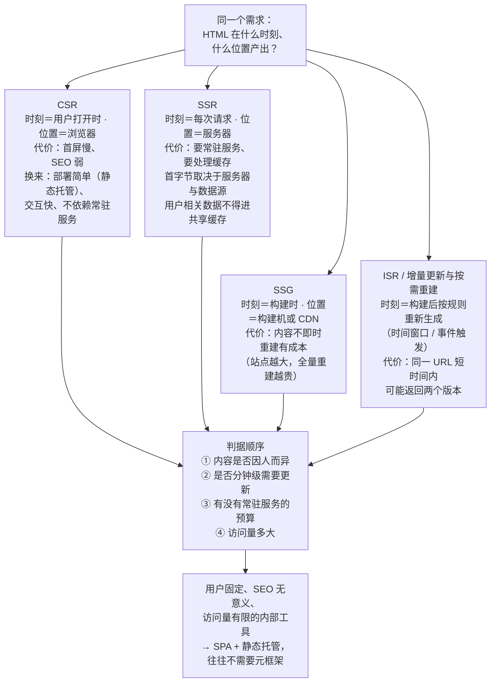
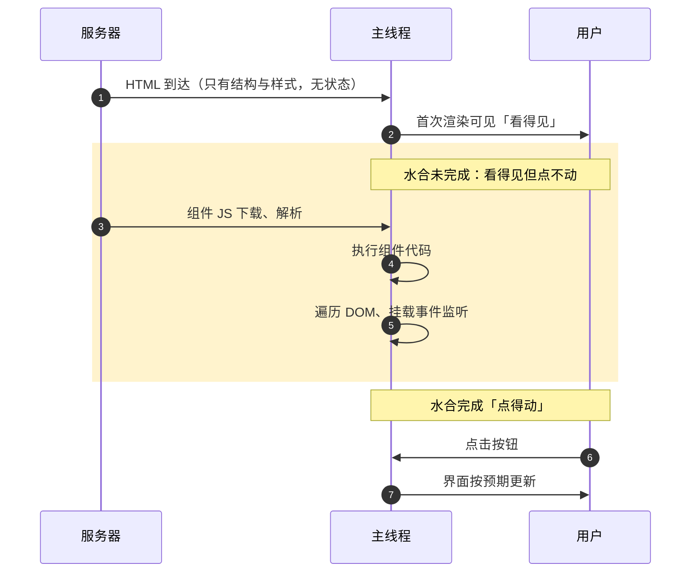
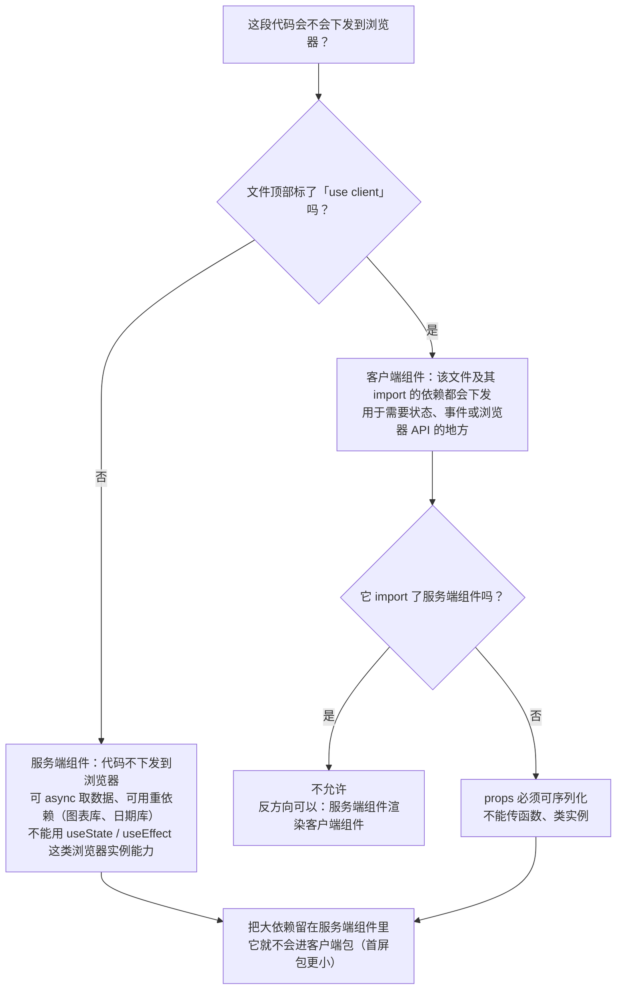

# M10 现代前端与前沿

> 一句话：本模块要解决的是**"同一个需求该在什么时刻、什么位置产出 HTML，以及为此要付出什么代价"**——会选，比会新更重要。
> 对应《Web 前端技术》课程大纲模块 M10（[[00-课程大纲]]）。
> 教学口径：本模块**只要求读懂、能改、能选**，不要求双框架精通；所有版本号按课程统一口径固定，用前先确认是否已有更新。

## 0. 这一块是怎么来的（历史一则）

2015 年，ES2015 把 `import`/`export` 写进了标准，浏览器随后逐步支持原生模块。在此之前，前端要写模块化代码，只能靠打包器把一堆文件合成一个（或几个）大文件；有了原生模块，浏览器可以按需加载源码，但生产环境里几十上百个请求并不理想。于是这里出现了一条贯穿至今的线索：**开发者想写模块化、类型化的源码；浏览器与用户只想要少、快、缓得住的东西。**

2016 年，Next.js 与 Nuxt 前后出现（只记年份），它们把"服务端渲染 + 路由 + 数据获取 + 构建"打包成一套约定，让团队不必每次从零拼装。2020 年 Vite 发布，把开发期换成基于原生 ES 模块的按需编译，现代工具链的形态基本定型。2024 年 12 月，React 19 发布并稳定了 Server Components，"哪些代码要下发到浏览器"第一次成为框架层面的默认议题。

本模块讲的不是"最新最潮"，而是这条线索延伸出来的问题：什么时候该在服务端渲染、什么时候只需要一堆静态文件、什么时候根本不该引入元框架。演进线索另见 [[16-技术演进时间线]]。

## 1. 教学目标

| 维度 | 目标（可考核） |
|---|---|
| 知识 | ① 说出 CSR、SSR、SSG、ISR/增量更新各自"在什么时刻、什么位置产出 HTML"与主要代价<br>② 解释水合是什么，说清"看得见但点不动"的成因<br>③ 说清岛屿架构与 Streaming SSR 各自减少了什么、又带来什么新问题<br>④ 在 RSC 模型里判断一段代码会不会下发到浏览器，并说明依据<br>⑤ 说出 Nuxt 3 已 EOL，正确选择 Nuxt 4.5.2，并解释旧教程不能照抄的原因<br>⑥ 说出把逻辑放边缘的两点收益与两点限制<br>⑦ 说出 TypeScript 7.0.2 属原生编译器线、npm 包按平台分发二进制这一分发方式<br>⑧ 说出读规范时状态字段的含义，以及"该不该用某特性"的三步判断 |
| 能力 | ① 针对一个给定需求写出渲染策略选择，并给出一条退出成本判断<br>② 用 Lighthouse 对比两种实现的首屏与首屏 JS 体积，写出结论与适用边界<br>③ 读一份真实规范页面，指出其状态字段并提取一条可实施要求，且写出降级方案<br>④ 为一个静态页面写出一套 Service Worker 缓存策略，并说明更新陷阱<br>⑤ 用自定义元素 + Shadow DOM 封装一个样式隔离的组件<br>⑥ 用二分法定位一次水合导致的"点不动"问题 |
| 素养（工程规范） | ① 标注代码与资料来源、核对第三方许可<br>② 把 AI 生成结果当作待审查草稿而非交付，并在提交物里说明使用范围与验证方式<br>③ 遇到不确定就写"不确定 + 依据 + 风险"，不编造<br>④ 把"先这样、以后再改"的决定记成一条技术债（位置/原因/偿还条件/负责人） |

**本模块学完后应能独立完成的一件事**：针对一个真实的小需求，独立产出**一份"渲染策略选型说明 + 一次可复现的 Lighthouse 对比报告"**，并能说明所选方案的适用边界与退出成本。

## 2. 学时分配与讲授节奏

6 学时 = 270 分钟（讲授 180 + 实验上机 90）。

| 序 | 主题 | 讲授分钟 | 实验上机分钟 | 教学形式 |
|---|---|---|---|---|
| 1 | 渲染策略谱系（CSR/SSR/SSG/ISR）+ "内部工具往往不需要元框架" | 30 | 0 | 讲授 + 产物对比演示 |
| 2 | 水合与水合代价、岛屿架构、Streaming SSR | 25 | 0 | 讲授 + Performance 实录 |
| 3 | RSC 与客户端组件边界（哪些代码下发到浏览器） | 25 | 0 | 讲授 + 构建产物观察 |
| 4 | 元框架对比（Next.js 16.3.8 与 Nuxt 4.5.2；Nuxt 3 已 EOL） | 20 | 0 | 双项目对照演示 |
| 5 | 边缘运行时与 CDN 计算 | 15 | 0 | 讲授 + 延迟测量 |
| 6 | Web 平台原生能力（自定义元素/Shadow DOM、WASM、PWA/Service Worker、WebGPU） | 25 | 0 | 讲授 + 现场小实验 |
| 7 | 编译前沿（TypeScript 7 原生编译器线、平台二进制分发） | 15 | 0 | 讲授 + lockfile 观察 |
| 8 | AI 辅助开发的能力与边界 | 10 | 0 | 讲授 + 现场核对文档 |
| 9 | 工程伦理与学术诚信 | 8 | 0 | 案例对比讨论 |
| 10 | 技术选型方法与持续跟进（读规范的姿势） | 7 | 0 | 讲授 + 规范页面走读 |
| 11 | 实验一：SPA 与静态生成的 Lighthouse 首屏/包体对比 | 0 | 60 | 上机 |
| 12 | 实验二：读一份真实规范页面 + 平台原生能力小实验 | 0 | 30 | 上机 |
| | **合计** | **180** | **90** | **270 分钟** |

> 节奏提醒：第 11–12 项在同一段 90 分钟连排时，先做实验一（60），再做实验二（30）；实验二若需更充分讨论，可让学生把规范阅读笔记带到课后完成，但**小实验必须在课上跑通**。

## 3. 逐节讲授要点

### 3.1 渲染策略谱系（30 分钟）

**要讲什么**
- 先立一个问题：**HTML 在什么时刻、在哪儿生成？** 把答案写成四行就是四种策略。
  - CSR：浏览器拿到空壳 + JS，脚本跑完才有内容（时刻＝用户打开时，位置＝浏览器）。
  - SSR：每次请求在服务器生成 HTML（时刻＝请求时，位置＝服务器）。
  - SSG：构建时一次性生成（时刻＝构建时，位置＝构建机或 CDN）。
  - ISR / 增量更新与按需重建：构建后仍可按规则重新生成——按时间窗口复用，或由事件触发按需重建。
- 每种策略的代价要讲成"账单"，不是"优缺点词条"：
  - CSR：首屏慢、SEO 弱；换来的部署简单（静态托管即可）、交互快、不依赖常驻服务。
  - SSR：首字节取决于服务器与数据源，可能比 CSR 更慢；要常驻服务、要处理缓存与个性化数据（用户相关数据不得进共享缓存）。
  - SSG：快且便宜，但内容不即时，重建有成本（越大的站点，全量重建越贵）。
  - ISR：折中，但带来一致性问题——**同一 URL 短时间内可能返回两个版本**。
- 判据顺序：内容是否因人而异 → 是否分钟级需要更新 → 有没有常驻服务的预算 → 访问量多大。
- **明确判断：内部工具往往不需要元框架。** 依据是需求特征，而非技术强弱：用户是已知的一小群人、SEO 没有意义、首屏不必经过公网尽力而为、而元框架会带来常驻服务与运维、安全面、版本升级的持续成本。内部系统更缺的是权限、表单、审批流，不是首屏指标。**SPA + 静态托管 + 接口鉴权即可**，把精力放回业务。



> **图 1**：CSR / SSR / SSG / ISR 各自「在什么时刻、在什么位置产出 HTML」与主要代价，以及据此的判据顺序。四种策略是**并列关系**（图中按两列排布，不分先后），箭头只表示「它们都是同一个问题的可能答案」「都汇入同一套判据」。
> **看图要点**：四种策略没有优劣排序，账单各不相同——CSR 付首屏与 SEO，SSR 付常驻服务与缓存处理，SSG 付内容新鲜度与重建成本，ISR 付同一 URL 的短暂不一致；判据从「内容是否因人而异」问起，而不是从框架问起。

**必须现场的演示**
1. 同一个"商品列表"页，分别用 Vite 8.3.1 构建与元框架静态导出。
2. 用 `curl` 抓两版首页 HTML：一版 `<body>` 里是空壳加 `<script>`，另一版正文已在 HTML 里。
3. 把两段 HTML 放在一起对比，问一句"如果关掉 JS，哪一版还能看见内容？"

**提问与期望答案**
1. Q：SSG 和 SSR 都能让 HTML 里有内容，什么时候必须 SSR？→ A：内容因人而异或依赖实时数据、构建时无法确定（例如登录后的个人面板）。
2. Q：校园内部报修系统，要不要上元框架？→ A：多数不需要。用户固定、SEO 无意义、需要的是鉴权与流程；SPA + 接口即可，引入 SSR 反而多了运维与安全面。
3. Q：ISR 的"增量"代价是什么？→ A：一段时间内同一 URL 可能返回不同版本，需要接受最终一致；缓存失效与重建触发逻辑要单独设计。

**学生一定会犯的错**
- 把 SSG 理解成"写一次永不更新"。
- 把 SSR 当成"性能优化开关"——SSR 不保证更快。
- 认为"用了 Next.js / Nuxt 就自动是 SSR"——默认行为要按配置与页面确认。
- 把 ISR 当实时用。

### 3.2 水合与水合代价（25 分钟）

**要讲什么**
- 服务端已经产出了 HTML，为什么还要再跑一遍脚本？因为那份 HTML 只有样子，**没有事件与状态**；浏览器执行组件代码把这批静态 DOM "认领"过来、绑定监听，这个过程叫**水合（hydration）**。
- 水合的代价（要讲成可测量的三笔）：① 要下载、解析、执行组件代码；② 水合完成前页面**看得见但点不动**（用户常当成"卡死"）；③ 遍历 DOM 并挂载监听占主线程，耗时随组件数增长；④ 服务端与客户端渲染结果不一致时会出现闪烁或告警。
- 减负的三条路：
  - **静态优先 + 局部水合**：只给需要交互的区块下发脚本。
  - **岛屿架构**：把页面看成"静态 HTML 的海洋 + 少量交互岛屿"，每个岛屿独立水合、互不牵连。
  - **Streaming SSR**：服务端分块输出，先把已就绪的部分发出去（按 Suspense 之类边界切分），慢数据不阻塞整页。
- 一句判据：**一个页面 90% 是内容、10% 是可交互控件，那 90% 的部分不该付水合的钱。**



> **图 2**：从 HTML 到达到可交互的水合时间线，阴影区间即「看得见但点不动」。（图中三条泳道按角色缩写为服务器 / 主线程 / 用户：`S` 为服务器与网络、`B` 为浏览器主线程、`U` 为用户；第一步的 HTML 只有结构与样式，既没有事件也没有状态。）
> **看图要点**：阴影区间的长度就是水合的代价，它由三笔账构成——① 组件代码要下载、解析、执行；② 这段时间页面看得见却点不动（用户常当成「卡死」）；③ 遍历 DOM 与挂载监听占主线程，随组件数增长。另外还有第四笔账：服务端与客户端渲染结果不一致时会闪烁或告警。减负的三条路（静态优先 + 局部水合、岛屿架构、Streaming SSR）都是在缩短这段阴影。

**必须现场的演示**
- 按 `F12`（或 `Ctrl+Shift+I`）打开开发者工具（各面板用法见 [DevTools 文档](https://developer.chrome.com/docs/devtools/)）→ **Performance** → 点圆形录制按钮（`Ctrl+E`）录制首屏 → 停止，指着"脚本执行"那段说"这就是水合"；再开 CPU 6× 降速，现场点按钮演示无响应。
- 按 `F12` → **Network** → `Ctrl+E` 录制 → `F5` 刷新（抓法见 [Network 面板教程](https://developer.chrome.com/docs/devtools/network)），按体积排序，指出哪些是首屏必需、哪些其实可以不下发。

**提问与期望答案**
1. Q：HTML 已经渲染出来了，为什么按钮点了没反应？→ A：JS 还没下载执行完，水合未完成；页面"可见"早于"可交互"。
2. Q：岛屿架构减少了什么、代价是什么？→ A：减少下发与执行的 JS；代价是各岛屿默认互相独立，跨岛屿共享状态要显式设计。
3. Q：Streaming SSR 让什么变快了？→ A：首字节与首屏（慢数据不再阻塞整页）；总完成时间不一定缩短。

**学生一定会犯的错**
- 以为"用了 SSR 就不需要 JS 了"。
- 以为水合是"重新渲染整页"——其实是复用现有 DOM 并绑定。
- 把首屏可见时间当成交互就绪时间。
- 以为岛屿架构是所有框架的通用能力（它是模式，落地方式与支持度不同）。

### 3.3 React Server Components 与客户端组件的边界（25 分钟）

**要讲什么**
- RSC 把组件分成两类：一类在服务端执行、**其代码不下发到浏览器**；一类需要浏览器上的状态、事件或浏览器 API，必须下发——叫客户端组件。边界是**显式标记**的（React 生态里是文件顶部的 `'use client'`）。
- 哪些代码会下发：被标记为客户端的**文件及其 import 的依赖**。这条规则直接决定包体：把一个大依赖（图表库、日期库）留在服务端组件里，它就不会进客户端包。
- 边界规则要讲清三条：
  1. 客户端组件不能再 import 服务端组件（反方向可以：服务端组件渲染客户端组件，并通过 props 传**可序列化**的数据）。
  2. props 必须可序列化——不能传函数、类实例。
  3. 服务端组件里不能使用 `useState`/`useEffect` 这类依赖浏览器实例的能力。
- 代价与限制：需要框架与运行时支持（例如 Next.js 16.3.8 的 App Router）；心智模型更复杂，团队必须能判断"这段代码在哪儿跑"；跨边界的报错有时不够直观。



> **图 3**：RSC 与客户端组件的边界，以及「一段代码会不会下发到浏览器」的判定路径。
> **看图要点**：边界是**显式标记**的（React 生态里是文件顶部的 `'use client'`），标的是「这段代码需要能在浏览器执行」，不是「只在浏览器渲染」——客户端组件在服务端同样参与产出 HTML。下发的范围是**该文件及其 import 的依赖**，所以把大依赖留在服务端组件里，它就不会进客户端包；跨边界只能传可序列化数据。

**必须现场的演示**
- 一个页面里同时放"服务端取数据的列表"与"一个客户端计数器"，构建后看产物与 Network（按 `F12` → **Network** → `Ctrl+E` 录制 → `F5` 刷新）：指出哪些 chunk 下发、哪些没有。
- 同页面再加一个体积较大的图表依赖，前后对比首屏 JS 体积。

**提问与期望答案**
1. Q：`'use client'` 是"只在客户端渲染"吗？→ A：不完全是。它标的是**边界**：该组件在服务端也要参与产出 HTML，同时它的代码要下发到浏览器以完成水合——标的是"这段代码需要能在浏览器执行"。
2. Q：怎么让一个 300KB 的图表库不进首屏包？→ A：把使用它的组件留在服务端渲染、只把最小交互壳标为客户端；或对该依赖做延迟加载。根本办法是把它挡在客户端边界之外。
3. Q：RSC 和 SSR 是一回事吗？→ A：不是。SSR 是"在服务端产出 HTML"，RSC 是"组件在哪执行、代码是否下发"；两者可以同时存在。

**学生一定会犯的错**
- 把 `'use client'` 理解成"整棵子树都在服务端不渲染"。
- 以为服务端组件可以传函数当 props。
- 把 RSC 当"性能开关"到处乱标。
- 以为所有框架都有 RSC（Vue 生态是另一套思路，别混着讲）。

### 3.4 元框架对比：Next.js 16.3.8 与 Nuxt 4.5.2（20 分钟）

**要讲什么**
- 定位：两者都是"把路由、渲染、数据获取、构建打包成约定"的元框架，分别长在 React 与 Vue 生态上。
- **必须讲明**：**Nuxt 3 已 EOL，不要再按 Nuxt 3 的教程建项目**——网上大量教程仍是 Nuxt 3 的，照抄会踩配置与目录差异。课程统一使用 **Nuxt 4.5.2**。
- 对照维度（只对照，不要求双精通）：
  - 基础框架：[React](https://zh-hans.react.dev/learn) 19.3.0 / [Vue 3](https://cn.vuejs.org/guide/introduction) 3.5.43
  - 路由：react-router 8.4.0 / vue-router 5.3.1
  - 状态：zustand 5.0.15 / Pinia 4.0.3
  - 渲染能力：都覆盖 CSR/SSR/SSG 与增量更新的思路；Next.js 以 RSC 为核心组织方式，Nuxt 是另一套服务端/客户端分离的思路。
  - 工具链：都可与 Vite 8.3.1、TypeScript 7.0.2、ESLint 10.11.0、Prettier 3.9.9 或 Biome 2.5.15 配合；包管理课程统一用 pnpm 12.8.1（本机 Node v26.7.0、npm 11.19.0）。
- 选型判据（按顺序问）：团队现有技能栈是什么 → 生态里有没有现成组件 → 招聘与上手成本 → **退出成本**（约定越深，搬走越贵）。

**必须现场的演示**
- 用 [Nuxt](https://nuxt.com/docs/getting-started/introduction) 4.5.2 建一个项目，打开 `nuxt.config` 与 `app.vue`；再用 [Next.js](https://nextjs.org/docs/app/getting-started) 16.3.8 建一个项目；把两者目录结构并列展示。
- 同时打开官方文档与"某博客的旧教程"，指出被 EOL 影响的地方。

**提问与期望答案**
1. Q：Nuxt 3 的教程还能照抄吗？→ A：不能。Nuxt 3 已 EOL，配置与目录有差异，按 Nuxt 4.5.2 的官方文档来。
2. Q：都支持 SSR，那选哪个？→ A：看团队是 Vue 还是 React 的底子、生态依赖、退出成本；不是比谁的口号响。
3. Q：元框架的"约定"有什么代价？→ A：约定越深越省事，但也越难搬走；大版本升级要跟着改配置与写法。

**学生一定会犯的错**
- 跟着旧教程用 Nuxt 3 建项目，报错后怀疑是环境问题。
- 做"Next = SSR、Nuxt = SSG"这种简单对应。
- 选型只谈性能，不谈团队技能与退出成本。

### 3.5 边缘运行时与 CDN 计算（15 分钟）

**要讲什么**
- 思路：把逻辑放到**离用户近**的节点（CDN 边缘）执行，省掉网络往返，降低"服务器在远方"的延迟。静态资源天然走 CDN；更进一步是把一部分请求处理或 SSR 放到边缘。
- 代价（要讲成清单）：边缘运行时可用 API 是受限子集；冷启动、内存与执行时长有上限；**常常不能像在常驻服务里那样连数据库**（长连接、原生模块可能不可用）；可观测与调试工具不同、排错更难。
- 分界线：适合边缘的——鉴权与重定向、按地区改写、A/B 分流、简单缓存与请求改写；不适合的——长时间任务、重计算、依赖原生模块或长连接的逻辑。
- 判据：**只是"读请求头 → 判断 → 回一句话或改写"的逻辑放边缘；要连数据库跑事务、跑几秒 CPU 的，放回常驻服务。**

**必须现场的演示**
- 用 `curl -w` 分别测本机服务与一个远距离节点的首字节时间，直观看到往返时间的影响。
- 展示边缘运行时文档里的受限 API 清单（与 Node 环境对照）。

**提问与期望答案**
1. Q：把 SSR 放边缘是不是一定更快？→ A：不一定。省了网络往返，但运行环境更受限、数据源可能更远；要看数据在哪儿、逻辑有多重。
2. Q：边缘能不能直接连数据库？→ A：多数情况下受限，长连接与 TCP 常常不可用；通常走 HTTP 接口或专门的边缘数据访问方式。
3. Q：哪种逻辑最值得放边缘？→ A：鉴权、重定向、地区化改写这类短、无状态、靠近用户的判断。

**学生一定会犯的错**
- 把"边缘"当成无条件免费加速。
- 不了解运行时限制就把 Node 代码整段搬过去，然后卡在连数据库上。

### 3.6 Web 平台原生能力（25 分钟）

**要讲什么（四个子主题，各约 6 分钟）**
- **(a) 自定义元素与 Shadow DOM**：自定义元素让浏览器原生支持"你自己定义的标签"（先登记，再使用）；Shadow DOM 提供 DOM 与样式的**隔离**，外部选择器默认进不来。用途：跨团队、跨框架复用同一个组件而不互相污染样式。代价：主题化要显式设计（用 CSS 自定义属性做可控穿透）；与框架的写法不同；调试要看 shadow 树。
- **(b) WASM**：把 C/C++/Rust 等编译成浏览器可执行的二进制，适合**已有高性能原生代码要复用**或确有 CPU 密集负载的场景（编解码、图像/音视频处理）。**不是万能药**：跨边界传数据有开销，字符串/对象传递要序列化；DOM 访问仍需经过 JS；小计算用 WASM 反而更慢；工具链与调试更复杂。
- **(c) PWA 与 Service Worker**：用 Service Worker 拦截请求实现离线与缓存。常见策略：仅缓存静态资源、网络优先、缓存优先、Stale-While-Revalidate。**更新陷阱**：SW 安装后不会立刻接管旧页面；"缓存优先"若不失效会把旧版一直发给用户，用户看到的是旧页面。必须有版本控制与更新提示，且必须 HTTPS（localhost 例外）。
- **(d) WebGPU 的边界定性**：面向 GPU 的图形与通用计算接口，用于渲染与并行计算类负载。**当前状态**：各浏览器与平台的支持程度不一致，工具与生态仍在演进；所以本课程只做定性介绍，不承诺"现在就能全面替代 Canvas/WebGL"——判断依据是打开不同浏览器时的可用性差异。

**必须现场的演示**
- 写一个不超过 25 行的自定义元素（见 4.3 示例形态可复用思路），展示外部样式进不去；按 `F12` → **Elements**，展开 `#shadow-root` 查看隔离的 DOM。
- 注册一个 Service Worker 缓存静态资源，断网刷新仍能打开；再故意不改缓存版本号，展示"更新后用户仍是旧页面"。
- 打开一个 WebGPU 可用性检测页，在支持与不支持的浏览器上对比。

**提问与期望答案**
1. Q：Shadow DOM 解决什么问题、代价是什么？→ A：样式与 DOM 隔离、组件可跨框架复用；代价是主题化和全局样式要显式设计，调试多一层。
2. Q：什么时候该用 WASM？→ A：已有原生代码要复用，或确有 CPU 密集负载并能测出收益；不是用来"加速一切 JS"。
3. Q：用户明明更新了代码，为什么还看到旧页面？→ A：缓存优先且缓存未失效；需要随版本更新缓存名、清理旧缓存，并给更新提示。

**学生一定会犯的错**
- 把 SW 当成"免费离线"，发布新版本忘了改缓存版本号。
- 在 WASM 上投入很大却没做收益测量。
- 以为用自定义元素就必须放弃框架（两者可以共存）。

### 3.7 编译前沿：原生编译器线与平台二进制分发（15 分钟）

**要讲什么**
- **TypeScript 7.0.2 属于"原生编译器"这条线**：用原生语言实现编译器，动机是把大型项目的类型检查与编译时间压下来。要点是：**语言语义与类型规则不变**，升级要关注的是速度与诊断信息差异，而不是"语法变了"。
- **npm 包按平台分发二进制**：带原生二进制的包会按操作系统与 CPU 架构（如 win32-x64、darwin-arm64）拆成不同的可选依赖，安装时只装当前平台那一份。由此产生几个现象：
  - `package-lock.json` 里会出现"看起来用不到"的平台包；
  - 在 Windows 开发、在 CI 的 Linux 上装出来的结果不同；
  - 升级 Node 版本（本机 Node v26.7.0、npm 11.19.0）可能影响这些二进制包能否使用；
  - 所以**锁文件必须提交，CI 与本地要保持一致**。
- 同一动机的工具线：ESLint 10.11.0、Prettier 3.9.9 在"更快的检查与格式化"上持续改进，Biome 2.5.15 则直接以 Rust 实现——都属于"把开发者反馈回路缩短"的路线。打包侧同样如此：esbuild 0.28.2 与 webpack 5.111.1 是两种不同取舍，sass 1.105.1 负责样式编译。

**必须现场的演示**
- 在锁文件里用搜索找出某个带 `os`/`cpu` 字段的依赖，说明它为什么存在。
- `node -v`、`npm -v` 展示本机版本，指出与课程口径的一致/不一致处。

**提问与期望答案**
1. Q：编译器用原生语言重写，对我的代码有什么影响？→ A：语义与类型规则不变，主要是编译更快、诊断信息可能有差异；业务代码不必改写。
2. Q：为什么换台机器装依赖会有差别？→ A：依赖里有按平台分发的二进制，锁文件记录了可选依赖；环境与锁文件不一致就会装出不同结果。
3. Q：工具更快，是不是应该立刻全换？→ A：速度不是唯一标准，规则覆盖、插件生态、团队已有配置与迁移成本都在权衡里。

**学生一定会犯的错**
- 把"更快"等同于"更好"，盲目替换工具导致规则覆盖下降。
- 不提交锁文件，团队各装一套版本。

### 3.8 AI 辅助开发的能力与边界（10 分钟）

**要讲什么**
- **能做什么**：生成样板代码、写测试骨架、解释报错、小范围重构与改写、补文档与注释、把一段设计描述翻成初版结构。
- **必须人工审查什么**（按风险排序）：① 事实性错误——编造不存在的 API、配置项、版本号（最常见）；② 安全——注入、鉴权绕过、把密钥写进前端；③ 许可与来源——是否复用了有许可限制的代码；④ 边界与错误处理；⑤ 性能；⑥ 是否符合本项目约定。
- **学术诚信要求**：使用 AI 生成的代码要**说明来源与使用范围**；**不得把生成结果直接当作交付**——你必须能解释、能改、能在被追问时说出每一步为什么这么写。课程作业里凡有 AI 参与，在提交说明里写清：哪些是生成的、你改了什么、你怎么验证的。
- 一句判据：**你能解释并验证的代码，才算你的代码。**

**必须现场的演示**
- 让 AI 生成一段"配置某工具"的代码，当场翻官方文档核对，找出与当前版本不符之处——让学生看到"看起来很对"和"确实可用"之间的距离。

**提问与期望答案**
1. Q：AI 给的代码能直接提交吗？→ A：不能。要核对 API 与版本、审查安全与许可、自己跑通验证。
2. Q：作业里用了 AI，怎么算合规？→ A：说明来源与使用范围，自己理解并验证，能解释每一步。
3. Q：AI 输出最危险的地方是什么？→ A：看起来合理但不存在或已过时的 API 与配置，最容易被直接复制粘贴。

**学生一定会犯的错**
- 直接粘贴不存在的 API 或旧版本配置。
- 把"AI 说这样写"当成验证。
- 用生成内容写完却不理解，答辩时说不出来。

### 3.9 工程伦理与学术诚信（8 分钟）

**要讲什么**
- **来源标注**：代码、图片、数据、文案都要标注来源与获取日期；引用第三方代码要**看清许可**——MIT 这类宽松许可通常限制较少，带传染性的许可（要求衍生作品沿用同一许可）直接拷进项目可能要求你开源整个项目；不确定就去问，别默认"网上能搜到就能用"。
- **把 AI 生成内容当交付的后果**：无法解释、无法维护、无法担责。在课程里属于学术不端（把工具产出当自己的独立工作）；在工作里属于交付风险（出问题时你签的字）。
- **不确定就说明不确定**：在报告、注释、答辩里都要能写出"我不确定 X；我的依据是 Y；风险是 Z"。这比编一个自信的答案更专业，也是工程上唯一可持续的做法。
- **数据**：课程作业不要使用真实用户隐私数据；采集数据要说明来源与使用范围。

**必须现场的演示**
- 摆两份提交：一份标了来源、许可与验证过程，一份没有。让学生判断哪份经得起追问。

**提问与期望答案**
1. Q：从网上拷一段代码，要做哪三件事？→ A：看许可、标来源、确认能不能用在当前场景。
2. Q：不确定一个配置怎么写，怎么办？→ A：查官方文档、在最小项目里验证，并写明"不确定 + 依据 + 风险"，而不是编。
3. Q：加一行注释"AI 生成"就够了吗？→ A：不够。要说明使用范围、你的修改与验证方式。

**学生一定会犯的错**
- 以为"自己改了点就是原创"。
- 忽略许可。
- 把不确定的地方写得很确定。

### 3.10 技术选型方法与持续跟进（7 分钟）

**要讲什么**
- **按问题选工具，不按热度**。顺序：先定需求与约束（用户是谁、内容更新频率、要不要 SEO、预算与运维能力、团队技能），再看候选，最后写退出成本。
- **两个成本**：学习成本＝团队多久能熟练；退出成本＝以后能不能搬走（框架约定有多深、数据与状态能否导出、路由与构建是否可替换）。
- **技术债的记录与偿还**：每做出一个"先这样、以后再改"的决定，就在仓库里记一条——位置、原因、偿还条件、负责人。不记账的技术债会变成"没人知道为什么这样写"。
- **读规范的姿势**：[W3C 的规范文档](https://www.w3.org/TR/)带状态字段（处于哪一阶段，如草案/候选推荐/正式推荐）；WHATWG 的 [Living Standard](https://html.spec.whatwg.org/multipage/) 持续更新、没有版本号；IETF 的 RFC 有编号与状态；Ecma 的 [ECMAScript 规范](https://tc39.es/ecma262/) 按年度版本发布。**判断一个特性该不该用的三步**：① 规范状态如何 → ② 目标浏览器支持面多大 → ③ 有没有降级方案。**没有降级方案，就不能当成"可以上线"。**

**必须现场的演示**
- 打开一份规范页面，指出状态字段所在位置，并找出一条带"必须/应当"语气的可实施要求。

**提问与期望答案**
1. Q：怎么判断一个特性现在能不能用？→ A：看规范状态、看浏览器支持面、必须有降级方案。
2. Q：退出成本怎么估？→ A：看约定深浅、可替换性、数据与状态能否迁出。
3. Q：技术债怎么记才不流于形式？→ A：写清位置、原因、偿还条件、负责人，并且放在仓库里，不是聊天记录里。

**学生一定会犯的错**
- 把"新"当"好"。
- 不给降级方案就上线新特性。
- 技术债只记在脑子里，人一换就断线。

### 3.11 安全视角：AI 写的代码，谁负责？（插入节 · 建议 20 分钟 · 与 §3.9 合讲）

> **定位**：接在 §3.8（AI 辅助开发的能力与边界）之后，把"能用／要审"落到"出错了谁负责"；与 §3.9 工程伦理、18 号课程思政三法联动。完整内容见 [[22-前端安全专章（OWASP × ATT&CK）]] §7、§9。

**（1）先给一条实证**：同行评审研究（arXiv 2108.09293，IEEE S&P 2022）让模型补全 89 个场景、共得到 1689 个程序，其中**约 40% 存在安全缺陷**。结论不是"别用"，而是"**必须审**"——AI 交付的是"看起来对的代码"。

**（2）AI 会同时放大两类风险**：① 引入漏洞（拼接、转义、鉴权位缺失）；② **把密钥写进公开产物**（写进被注入到前端的变量、写进示例配置与注释、写进文档）。第 ② 类的判断句式与 M6 §3.9、M8 §3.15 共用：**"这个值被任何人拿到，会发生什么？"**

**（3）必须讲清的边界（本课程不得删减的一段）**：前端安全的学习与练习**只在合法靶场或自己的资产上**做；对未授权系统做任何测试动作都可能同时触及《网络安全法》第二十九条与《刑法》第二百八十五条、第二百八十七条之二；发现漏洞的正确姿势是**报送而非传播**（给最小必要复现、给修复时间、不在公开渠道贴可利用细节）。条文要点与出处见 [[22-前端安全专章（OWASP × ATT&CK）]] §9。

**（4）给学生的诚实要求**：用 AI 生成的代码要在提交说明里写明用途与范围，并注明哪些片段未经自己审读；作业与项目按 §3.9 的诚信口径执行。

> **本节出处**：AI 生成代码的安全性数据引自 arXiv 2108.09293（一手论文，22 号已核）；法条要点引自官方发布页（22 号 §9 有出处表）；"说明用途／注明未审读"的诚信要求属课程编排。

## 4. 关键概念讲透

### 4.1 水合（hydration）

- **是什么**：服务端产出的 HTML 只描述"长什么样"，不含事件与状态；浏览器执行组件代码把这批静态 DOM"认领"成可交互的过程，就是水合。
- **为什么这样设计**：因为要同时要"快出首屏"和"完整交互"——用第一遍（服务端）换首屏，第二遍（浏览器）换交互。
- **与相邻概念的边界**：水合 ≠ SSR，也 ≠ 重新渲染整页；它是"复用现有 DOM 并绑定"。它是 CSR 与 SSR 之间的一座桥，不是第三种渲染模式。
- **最小示例**（仅示形态）：
```html
<!-- 服务端产出：只有样子，点了没反应 -->
<button class="counter">0</button>
<!-- 浏览器执行的脚本：认领这批 DOM，绑定后才可交互 -->
<script type="module">
  document.querySelectorAll('.counter').forEach((el) => {
    let n = Number(el.textContent);
    el.addEventListener('click', () => { el.textContent = ++n; });
  });
</script>
```
- **一句判据**：**"看得见"和"点得动"之间那段等待，就是水合的代价。**

### 4.2 渲染策略（CSR / SSR / SSG / ISR）

- **是什么**：同一份内容，可以在不同时刻、不同位置生成 HTML。
- **为什么这样设计**：不同内容的"新鲜度"和"个性化程度"不同，用一种策略全包，要么付不必要的服务器成本，要么付不必要的首屏时间。
- **与相邻概念的边界**：策略与框架无关——任何框架都能产出静态文件；ISR 不是实时；SSR 不等于更快；元框架只是把这些策略做成了开关。
- **最小示例**（仅示形态，判据流程）：
```text
1) 内容每个人看到的都一样吗？
   否 → SSR 或客户端取数（注意：个性化数据不要进共享缓存）
   是 → 2)
2) 内容会在构建后变化吗？
   否 → SSG
   是 → 3)
3) 能接受"几分钟后才更新"吗？
   能 → 增量更新 / 定时重建
   不能 → SSR，或按需重建 + 明确写出一致性说明
补充判据（内部工具）：用户固定、SEO 无意义、访问量有限
   → SPA + 静态托管，不引入元框架
```
- **一句判据**：**先问"内容何时变化、给谁看"，再问"用哪个框架"。** 内部工具往往不需要元框架——它没有 SEO 与首屏转化的诉求，却要背上常驻服务的运维与安全成本。

### 4.3 岛屿架构与局部水合

- **是什么**：页面主体是静态 HTML，只有需要交互的少数区块（"岛屿"）各自加载脚本、独立水合。
- **为什么这样设计**：水合代价与需要交互的组件数量正相关；把不需要交互的部分排除在外，是最直接的减负手段。
- **与相邻概念的边界**：岛屿是"下发与执行的边界"，不是组件切分方式；岛屿之间默认不共享状态，要共享必须显式设计；它**不解决慢数据问题**（那是 Streaming 的事）。
- **最小示例**（仅示形态）：
```html
<!-- 页面主体：静态，无水合 -->
<article><h1>标题</h1><p>正文…</p></article>
<!-- 岛屿：只有这块下发并执行脚本 -->
<my-counter data-start="0"></my-counter>
<script type="module" src="/islands/counter.js"></script>
```
- **一句判据**：**一个页面上需要交互的区块数量，决定它值不值得为水合付费。**

### 4.4 客户端边界（`'use client'` / 代码分发边界）

- **是什么**：在 RSC 模型里，用显式标记划出"这段代码会进入浏览器包"与"只留在服务端"。
- **为什么这样设计**：让包体由"哪些组件需要浏览器能力"决定，而不是由"整页用了什么库"决定。
- **与相邻概念的边界**：标的是边界，不是"只在浏览器渲染"；服务端组件不能用浏览器状态能力；跨边界只能传可序列化数据。
- **最小示例**（仅示形态，两段合计约 13 行）：
```tsx
// app/page.tsx —— 服务端组件：不下发，可直接取数据
import Chart from './Chart';                // Chart 顶部标了 'use client'
export default async function Page() {
  const data = await getStats();            // 只在服务端执行
  return <Chart points={data.points} />;    // props 必须可序列化
}
```
```tsx
// app/Chart.tsx
'use client';                               // 该文件及其依赖会下发到浏览器
import { useState } from 'react';
export default function Chart({ points }: { points: number[] }) {
  const [open, setOpen] = useState(false);
  return <button onClick={() => setOpen(!open)}>{open ? '收起' : '展开'}</button>;
}
```
- **一句判据**：**把"需要浏览器的代码"圈得越小，首屏包就越小；圈之前先问"这段代码真的要用浏览器吗"。**

## 5. 常见误区与诊断

| 学生症状 | 真实病根 | 课堂怎么纠正 |
|---|---|---|
| 说"用了 Next / Nuxt 就是 SSR" | 把框架与渲染策略混为一谈 | 现场 build 出产物，`curl` 看 HTML 里有没有内容，用事实代替印象 |
| 页面"渲染出来了但点不动"，怀疑是 CSS 或浏览器 bug | 分不清"首屏可见"与"交互就绪"，不知道水合 | CPU 6× 降速录一次 Performance，指出脚本执行段，再讲水合定义 |
| 认为 `'use client'` 表示"这个组件只在浏览器渲染" | 把边界标记当成渲染开关 | 看构建产物：客户端组件在服务端同样产出了 HTML，边界标的是代码是否下发 |
| 把大图表库直接 import 进页面，首屏包暴涨 | 不知道 import 会顺着客户端边界把依赖带进包 | 对比加/不加该依赖的产物体积，把使用它的组件留在服务端、只留最小交互壳 |
| 用户反馈"更新了还是旧页面" | Service Worker 缓存优先且未失效 | 现场改缓存版本号 + 清旧缓存 + 更新提示，讲清更新陷阱 |
| 只在自己浏览器跑通就上了一个新特性 | 没查支持面，也没写降级方案 | 要求先填"规范状态 / 支持面 / 降级方案"三栏，缺一项不允许合并 |
| 选型报告只谈性能 | 缺少"退出成本"这个维度 | 报告里必须有一节"如果要换掉它，代价是什么"，并写出可替换的部分与不可替换的部分 |
| 拷来的代码不问许可 | 没有许可意识 | 用宽松许可与传染性许可的对比案例讲"能不能直接放进项目" |
| 认为 WASM 能加速一切 | 只听"接近原生速度"的口号 | 现场测一次字符串往返的调用开销，把口号变成数字 |

## 6. 本模块实验

实验组织与评分口径参见 [[15-实验与大作业指导]]、[[13-考核方案与评分量规]]。

### 实验一：同一页面的 SPA 与静态生成产物对比（Lighthouse 首屏与包体）

- **目的**：把"渲染策略"从概念变成可测量的数据，并能写出适用边界判断。
- **环境**：本机 [Node.js](https://nodejs.org/zh-cn) v26.7.0、npm 11.19.0、pnpm 12.8.1、[Vite](https://vite.dev/guide/) 8.3.1、元框架二选一（Next.js 16.3.8 或 Nuxt 4.5.2，**不得使用 Nuxt 3**）、Chrome 内置 Lighthouse、一个本地静态服务器。
- **任务描述**：
  1. 做一个内容页（例如"课程介绍 + 20 条公告列表"），两版视觉与文案保持一致。
  2. A 版：Vite 8.3.1 纯前端 SPA，列表数据用本地 JSON，不发接口。
  3. B 版：用元框架的静态生成（SSG/预渲染）产出同样内容的 HTML。
  4. 两版分别 build，用静态服务器打开；用 Lighthouse（Performance 分类、移动端预设、至少 3 次取中位数）记录 FCP、LCP 与"首屏所需 JS 体积"（Network 的 Transfer Size 之和，或构建报告给出的 chunk 体积）。操作口径：按 `F12` → **Lighthouse** → 点 Analyze page load 跑审计（说明见 [Lighthouse 概览](https://developer.chrome.com/docs/lighthouse/overview)）；按 `F12` → **Network** → `Ctrl+E` 录制 → `F5` 刷新后取 Transfer Size 之和。
  5. 用 `curl` 抓两版首页 HTML，分别指出正文是否已在 HTML 中。
  6. 写结论：数据表 + 差异原因 + 适用边界判断。**必须回答变体问题**：若该页改成"每 5 分钟更新一次的实时看板"，结论怎么变，依据是什么。
- **验收判据（可自测）**：
  1. 两版首页 HTML 都能 `curl` 到，并能明确说出正文在不在 HTML 里；
  2. Lighthouse 有 3 次记录与中位数，并注明设备与网络预设；
  3. 报告含 FCP、LCP、首屏 JS 体积三项数据，且能把差异归因（HTML 有无内容 + 下发脚本量）；
  4. 结论含"适用边界"一节，且对"实时看板"变体给出策略变化与依据；
  5. 版本号与命令齐全，换一台机器能复现。
- **提交物**：两版源码（或仓库链接）、Lighthouse 导出的 JSON/截图、对比数据表、`结论报告.md`。
- **评分要点**：可复现性 30%；数据完整性 25%（次数/中位数/预设）；原因分析 25%（归因准确）；边界判断 20%（能随需求变化调整，不是背结论）。

### 实验二：读一份真实规范页面 + 一个平台原生能力小实验

- **目的**：学会从规范页面提取可实施要求，并把一个 Web 平台原生能力落到可运行的小实验上。
- **环境**：本机浏览器、Node v26.7.0；一份公开规范页面（HTML/CSS/Service Worker/PWA 方向均可，候选由任课教师给出、学生自选其一）。
- **任务描述**：
  1. 读规范页面并写清三件事：文档名；文档中标注的**状态字段**（处于哪一阶段，或 Living Standard 的持续更新说明；RFC 则写编号与状态）；以及**一条可实施要求**（原文摘录 + 你的转述 + 你会怎么在代码里满足它）。
  2. 定位这条要求的浏览器支持面（支持情况表或文档自身说明），写出支持范围。
  3. 写出**降级方案**：目标浏览器不支持时，用户会看到什么行为。
  4. 做一个小实验（二选一）：
     - a) 用自定义元素 + Shadow DOM 封装一个样式隔离的小组件（≤80 行，原生即可，不要求框架）；
     - b) 给一个静态页面加 Service Worker，实现"仅缓存静态资源"或"Stale-While-Revalidate"，并演示改动缓存版本号前/后用户拿到的差异。
- **验收判据（可自测）**：
  1. 规范信息完整：文档名 + 状态字段（原文与你的解释）+ 一条可实施要求（原文 + 转述 + 落地方式）；
  2. 支持面说明有依据（指出取自支持情况表或文档说明）；
  3. 降级方案具体到"用户会看到什么行为"，不是"做好兼容"这种空话；
  4. 小实验可运行：a) 外部样式确实进不了 shadow root（附对比截图）；或 b) 断网仍能打开，且能演示"改版本号后用户才拿到新版"；
  5. 你能口头解释每一行代码做了什么。
- **提交物**：`规范阅读笔记.md`、小实验代码、运行证据（截图/录屏片段/控制台输出）。
- **评分要点**：规范阅读准确性 35%（状态字段没认错、要求转述不走样）；支持面与降级方案 30%；实验可运行 25%；表达 10%（能解释，也能说清不确定的地方）。

## 7. 本模块作业与自测题

期末题型与评分口径见 [[14-期末样卷与参考答案要点]]。

1. **[选择] [3.1] [理解] [★]** 下列关于渲染策略的说法，哪一项在当前状态下成立？
   A. 用了元框架就一定是服务端渲染
   B. SSG 产出的 HTML 里已含正文，适合构建后不变或变化不快的内容
   C. SSR 一定比 CSR 首屏快
   D. 增量更新意味着内容实时
   答案：B。A 需按配置与页面确认；C 取决于服务器与数据源；D 只是窗口内复用或按需重建。

2. **[选择] [3.3] [理解] [★★]** 关于 `'use client'`，哪一项正确？
   A. 标记后该组件不会在服务端渲染
   B. 标记后该文件及其依赖会下发到浏览器
   C. 标记后使用 `useState` 不影响包体
   D. 只要不标记，页面里所有组件都不会下发
   答案：B。

3. **[简答] [3.2] [理解] [★★]** 用不超过 150 字解释：为什么会出现"页面已经看清内容，按钮却点了没反应"？并写出两个减少这段等待的手段。
   评分要点：说明 HTML 只含结构与样式，事件与状态要等脚本下载并执行完（水合）；手段可答"只给需要交互的区块下发脚本、岛屿架构、Streaming 先发已就绪部分、减小客户端包体"。

4. **[简答] [3.1][3.10] [分析] [★★]** 某校园内部报修系统：用户为全校师生、需登录（约 5000 人），页面内容因人而异，访问集中在工作日白天。请给出渲染策略建议，并写出一条退出成本判断。
   评分要点：识别出"个性化内容 → 不能进共享缓存的静态产物"；说明是否需要常驻服务；指出内部工具优先考虑 SPA + 接口、元框架不是必需；退出成本能落到"路由与构建层能否替换、状态能否导出"等具体判断。

5. **[读代码] [3.3] [分析] [★★]** 一段服务端组件里 import 了一个约 300KB 的图表库，并把它渲染在一个标了 `'use client'` 的组件内部。问：构建后客户端首屏包里会不会带上这个图表库？为什么？如果要避免，怎么做？
   评分要点：会带——依赖会顺着客户端边界进入浏览器包；避免办法是把重依赖留在服务端、把客户端组件切到最小、或做延迟加载；能指出可用构建产物对比来验证。

6. **[读代码] [3.6] [分析] [★★]** 一段 Service Worker 代码使用缓存优先、缓存名固定不变。问：发布新版本后用户为什么仍看到旧页面？给出两处修改思路。
   评分要点：缓存名要随版本变化并清理旧缓存；需要更新提示与激活策略；能指出根因是"缓存优先 + 缓存未失效"。

7. **[编程] [3.4][3.3] [应用] [★★★]** 用 Nuxt 4.5.2 或 Next.js 16.3.8（二选一）创建项目，实现一个含 3 个页面的静态站点（首页、列表页、详情页，内容固定），并产出静态生成产物。
   验收判据：① 三页 build 后能从产物目录打开，且正文在 HTML 中（可用 `curl` 验证）；② 列表页不少于 10 条数据，详情页路由参数正确；③ 至少一页含一处交互（如筛选或展开）且行为正常；④ 提交 README，写明所用版本、命令，以及一段"选型理由 + 退出成本"；⑤ 不得提交 AI 生成的完整答案，若有 AI 参与须说明范围与你的修改。
   评分要点：可构建可运行 30%；页面与路由正确 25%；交互可用 15%；README 的版本与理由 20%；诚信说明 10%。

8. **[编程] [3.7] [应用] [★★]** 在本机环境（Node v26.7.0、npm 11.19.0、pnpm 12.8.1）建一个 TypeScript 7.0.2 的最小项目，配好 ESLint 10.11.0 与 Prettier 3.9.9，并在锁文件里找出至少一个"按平台分发的二进制依赖"，截图其 `os`/`cpu` 字段。
   验收判据：① 项目可 typecheck 与 lint；② 能说明该依赖 `os`/`cpu` 字段的含义；③ 能说明"为什么在 CI 的 Linux 上装出来可能不同"；④ 写出对"更快的工具是否应立刻替换现有工具链"的判断，并给出依据。
   评分要点：环境与命令准确 30%；锁文件字段解释正确 30%；平台差异解释 25%；判断题有依据 15%。

## 8. 自我检查清单（学生用）

- [ ] 我能说清 HTML 是在"构建时、请求时、还是浏览器里"生成的，并各举一个适用场景
- [ ] 我能解释"看得见但点不动"是水合未完成，而不是 CSS 或浏览器的问题
- [ ] 我能说出岛屿架构省掉了什么，又带来了什么新的设计问题
- [ ] 我能判断一段代码在 RSC 模型里会不会下发到浏览器，并说清依据
- [ ] 我知道 Nuxt 3 已 EOL，建项目会用 Nuxt 4.5.2，并能说出旧教程哪里不能照抄
- [ ] 我能说出把逻辑放到边缘的两个收益与两个限制
- [ ] 我能写出 Service Worker 的更新陷阱，并知道怎么让用户拿到新版本
- [ ] 我能说出 WASM 适合什么、不适合什么，而不是"能加速一切"
- [ ] 我能说出 WebGPU 是做什么的，并说明为什么课程里只做定性介绍
- [ ] 我读一份规范页面时能指出状态字段和一条可实施要求，并写出降级方案
- [ ] 我在选型时能写出一条退出成本；引入临时方案时能记一条技术债（位置/原因/偿还条件/负责人）
- [ ] 我提交的作业里，引用的代码与资料都标了来源与许可；AI 参与的部分写清了范围与验证方式
- [ ] 遇到不确定的地方，我会写"不确定 + 依据 + 风险"，而不是编一个自信的答案

## 9. 出处与依据说明

### 9.1 白名单出处与本模块小节的对应

| 出处（仅白名单链接） | 对应小节 | 用它说明什么 |
|---|---|---|
| [Vite 官方文档](https://vite.dev/guide/) | 0、2、3.4、3.7、6（实验一） | Vite 的定位（开发服务器 + 构建命令）与课程统一版本 Vite 8.3.1 的口径来源 |
| [React 官方文档](https://zh-hans.react.dev/learn) | 3.3、3.4、4.4 | React 组件模型与客户端组件写法的入门依据（React 19.3.0 语境） |
| [Vue 3 官方文档](https://cn.vuejs.org/guide/introduction) | 3.4、4.1（对照） | Vue 3.5.43 的声明式渲染与响应式概念，用于与水合、边界概念对照 |
| [Next.js 官方文档](https://nextjs.org/docs/app/getting-started) | 3.3、3.4、6 | Next.js 16.3.8 App Router 的入门路径与项目结构 |
| [Nuxt 官方文档](https://nuxt.com/docs/getting-started/introduction) | 3.4、6 | Nuxt 4.5.2 的定位与入门（文档为 4.x 线）；Nuxt 3 已 EOL 的建项目口径 |
| [TypeScript 官方手册](https://www.typescriptlang.org/docs/handbook/intro.html) | 3.7 | TypeScript 7.0.2 的语言与工具链文档入口 |
| [Core Web Vitals](https://web.dev/articles/vitals) | 3.2、5、6（实验一） | Web Vitals 的指标口径（FCP/LCP/INP 等）与"用数据判断性能"的方法 |

白名单之外的资料（如各浏览器支持情况表、Vite 之外的打包器官方文档）在课上只**点名不给链接**，需要时由学生自行检索并标注来源与获取日期。ESLint、Prettier、Biome 的官方文档与 Vite 的官方文档、WebGPU 与 Service Worker 的规范/文档页，其域名均已收进链接白名单（见 [[15-实验与大作业指导#1.2 链接白名单（全库唯一口径，按域名分层）]]），正文可按白名单直接给出链接。

### 9.2 属教师经验的编排判断、无官方直接依据

- 6 学时的构成（讲授 4 + 上机 2）与第 2 节各节分钟数，是课程组按教学节奏的编排，非官方规定。
- **"内部工具往往不需要元框架"** 是教学用判断，依据是本课程对需求特征的分析（用户固定、无 SEO 诉求、运维成本），并非官方文档的表述；实际项目仍应逐项对照 [[#3.1 渲染策略谱系（30 分钟）|3.1]] 的判据顺序。
- 实验一采用"移动端预设 + 至少 3 次取中位数"的做法，是课程组为保证同学之间数据可比而定的课堂口径，不是任何官方评测方法的要求。
- "把大依赖挡在客户端边界之外"是经验总结，落地时仍应以自己项目的产物体积实测为准。
- 第 5 节"学生症状"来自往届课堂观察，属经验归纳，不是统计结论。
- 实验二允许自选的规范页面范围由任课教师给定，方便统一批改；规范本身不作此限制。
- 全部版本号按课程统一口径固定（Vite 8.3.1、React 19.3.0、Vue 3.5.43、Next.js 16.3.8、Nuxt 4.5.2、TypeScript 7.0.2、Tailwind 4.3.3、Pinia 4.0.3、vue-router 5.3.1、react-router 8.4.0、zustand 5.0.15、ESLint 10.11.0、Prettier 3.9.9、Biome 2.5.15、Vitest 5.0.3、Playwright 1.63.0、pnpm 12.8.1、esbuild 0.28.2、webpack 5.111.1、sass 1.105.1；本机 Node v26.7.0、npm 11.19.0），用前请确认是否已有更新，以官方为准。本模块不涉及对未来技术走向的预测，第 3.6 节对 WebGPU 只描述当前状态与支持面差异。
