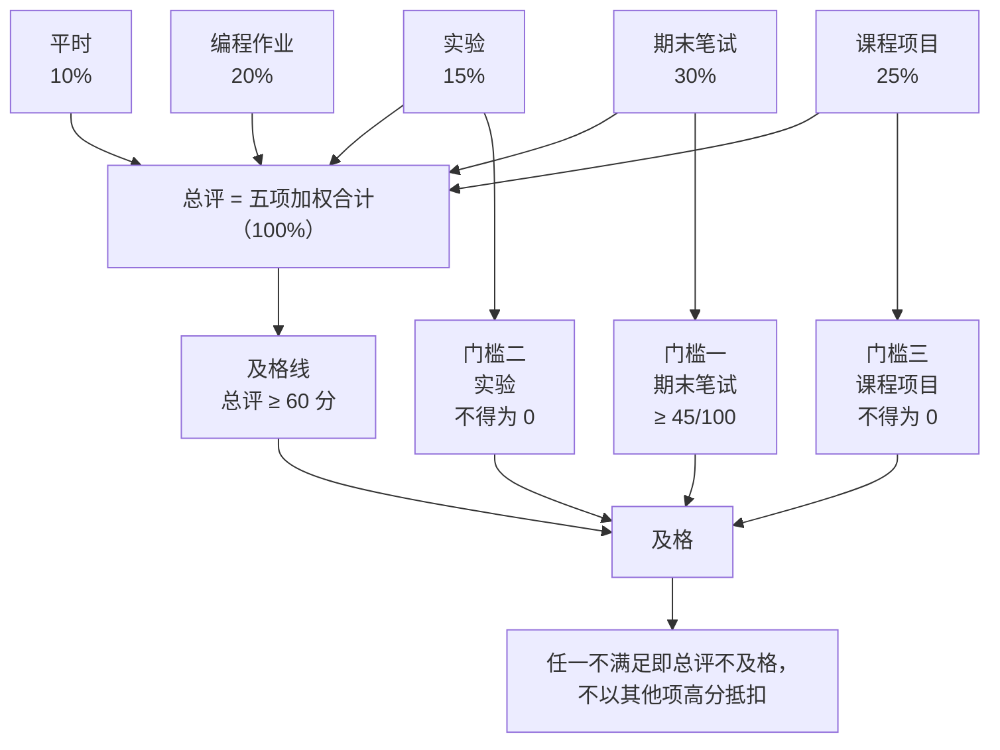

# Web 前端技术 · 考核方案与评分量规

> 本文件是考核口径的执行细则，**权重、及格线、单科门槛与 [[00-课程大纲]] 第六节逐字一致**，不得单独修改。
> 原则：考核的是**能否解释与验证**，不是能否背 API。凡「能跑但讲不出原因」者，本方案一律封顶在合格档。
> 制度性事项（缓考、补考、成绩复核的时限与流程）**以学校与学院正式文件为准**，本文件只写课程组可自行决定的部分。

## 一、考核总览

### 1.1 权重表（与大纲第六节一致）

| 项目 | 权重 | 形式 | 考核什么 | 对应模块 |
|---|---|---|---|---|
| 平时 | 10% | 出勤、课堂提问抽答、随堂小测（每模块 1 次，5–8 分钟） | 跟进度、能否现场解释 | M1–M10 |
| 编程作业 | 20% | 每模块 1 次，共 9 次，去掉最低一次后计入 | 编程与调试能力、代码规范 | M1–M9 |
| 实验 | 15% | 8 次实验报告（含证据：截图、指标前后对比、失败记录） | 动手与证据意识 | 对应上机模块 |
| 课程项目 | 25% | 2–3 人一组，含中期检查、最终演示、个人贡献答辩 | 设计决策与协作 | M6–M9 为主 |
| 期末笔试 | 30% | 闭卷，2 小时 | 原理与判断力，不考 API 记忆 | M1–M10 |
| **合计** | **100%** | | | |

### 1.2 及格与门槛

- **及格线**：总评 ≥ 60 分（百分制，四舍五入到整数）。
- **单科门槛（任一不满足即总评不及格，不以其他项高分抵扣）**：
  1. **期末笔试须 ≥ 45/100**（即卷面 45 分）；
  2. **实验与课程项目均不得为 0**（缺交、无证据、未参与答辩均按 0 计）。
- 门槛的设计意图：防止「作业代做、笔试空卷」与「只挂名不参与项目」，来自大纲第六节。



> **图 1**：考核模块与门槛判定——平时 10% / 编程作业 20% / 实验 15% / 课程项目 25% / 期末笔试 30% 五项合计为总评，总评 ≥ 60 分之外还须同时满足两条单科门槛。
>
> **看图要点**：三个条件（总评 ≥ 60 分、期末笔试 ≥ 45/100、实验与课程项目均不得为 0）必须同时满足才算及格；任一单科门槛不满足即总评不及格，**不以其他项高分抵扣**。实验与项目不得为 0 的门槛在四种拼法下均适用（见第九节）。

### 1.3 成绩构成与取整

| 项 | 计分方式 | 备注 |
|---|---|---|
| 平时 | 出勤 40 + 小测 40 + 抽答 20（每次该项满分 100，全班取算术平均） | 无故缺勤 1 次扣该项 20 分，扣完为止 |
| 编程作业 | 9 次**全计**，去掉个人最低一次后取均值（即 8 次平均） | 缺 1 次不影响；缺 ≥2 次超出「去掉最低一次」的保护范围 |
| 实验 | 8 次报告**加权**平均（各次权重不等，见 3.2；未交按 0 计入，不触发取前 N 保护） | |
| 课程项目 | 项目量规得分 × 个人贡献系数（见第四节） | 系数区间 0.7–1.0 |
| 期末笔试 | 卷面分 | 满分 100 |

## 二、编程作业量规

四个等级按总分区间：**优秀 90–100 · 良好 75–89 · 合格 60–74 · 不合格 < 60**。
四个维度对总评等权（各 25%），但**「问题分析说明」触发封顶规则**（见表下注）。

| 维度 | 优秀（90–100） | 良好（75–89） | 合格（60–74） | 不合格（< 60） |
|---|---|---|---|---|
| 功能正确性 | 全部用例通过；边界与异常输入（空值、超长、非法类型）处理正确并有测试覆盖 | 主要用例通过；边界处理基本正确，个别异常路径未覆盖 | 主干流程能跑通；边界或异常输入未处理，主体功能可用 | 主干流程无法运行，或结果与题目要求明显不符 |
| 代码质量与规范 | 在 ESLint 10.11.0 或 Biome 2.5.15 配置下 lint 与格式化零报错；命名清晰、无重复代码、函数职责单一 | lint 零报错；有少量重复或命名不当但不影响可读性 | lint 有少量警告未处理；结构可读但存在明显重复 | 未通过 lint，或结构混乱、他人无法阅读 |
| 问题分析说明 | 能说明设计取舍（为何这样分模块、为何选此数据结构）、遇到问题的根因及定位过程 | 能说明实现思路与主要问题，取舍说明较简略 | 只能说明"做了什么"，讲不出"为什么"；对所遇问题只描述现象 | 跑通但完全讲不出原因，或说明与实际代码相矛盾 |
| 证据与可复现性 | 提供复现步骤与对照证据（改前/改后、失败与成功截图），按 README 可直接复现 | 提供运行证据，复现步骤基本完整 | 有少量截图但缺复现步骤，需口头询问才能跑起来 | 无运行证据，或提交物无法复现 |

**封顶规则（关键）**：若「问题分析说明」维度只达**合格**或以下——即**「跑通但讲不出原因」**——**本次作业总评最高只能为合格（≤74 分）**，其余维度再高也不上浮。理据见 [[00-课程大纲#八、教学法与课堂形态]]「证据意识」与 [[00-课程大纲#二、课程定位]]「不做框架速成培训」。

提交物形态（仅示形态，不得直接提交）：

```text
# 仅示形态，不得直接提交
hw-M4/
  README.md        # 运行方式 + 复现步骤 + 设计取舍说明
  src/index.js     # 实现
  evidence/        # 改前.png 改后.png 控制台输出.txt
  tests/           # 至少覆盖主流程与 1 个边界
```

## 三、实验报告量规

等级区间同上（优秀 90–100 · 良好 75–89 · 合格 60–74 · 不合格 < 60）。
四维度各 25%。

| 维度 | 优秀（90–100） | 良好（75–89） | 合格（60–74） | 不合格（< 60） |
|---|---|---|---|---|
| 目的理解 | 能用自己的话说明本次实验要验证/测量的假设，并指出与对应模块知识点的关系 | 能说明实验目的与预期结果 | 目的陈述基本正确但照抄任务书 | 目的与实际操作不符或未写 |
| 操作与证据 | 截图 + 指标数据 + **失败记录**齐全；关键步骤可在他人机器上复现 | 有截图与主要指标，失败过程有简述 | 有部分截图但缺指标或缺失败记录 | 无证据或证据与结论无关 |
| 分析与反思 | 能解释数据为何如此、失败原因是什么、下次如何改进 | 能解释主要结果，反思较简略 | 有结论但依据不充分或过于笼统 | 无分析，只有操作流水账 |
| 规范与引用 | 术语准确；结论所用资料标注到一级/二级来源（见大纲第七节） | 引用基本规范，偶有遗漏 | 引用不规范但可追溯 | 无引用，或把四级资料（博客/AI 输出）当依据 |

**证据与诚信硬规则**：

1. **无证据的结论不得分**——报告里出现的任何「更快」「更清晰」「修正了 bug」，必须附工具截图或指标数据（口头断言不构成结论）。
2. **编造数据、或给出无出处结论，按学术不端处理**，本次实验记 0 并按第四节第 6 条上报。
3. 性能类实验须给出可复现的「改前—改动—改后」对照，指标口径可参照 [web.dev 的 Core Web Vitals](https://web.dev/articles/vitals)。
   - **证据怎么取（照做）**：`F12` 或 `Ctrl+Shift+I` 打开开发者工具 → **Performance** 面板录制前后各一次（`Ctrl+E` 开始/停止录制）导出 trace；或 **Lighthouse** 面板 → **Analyze page load** → 勾 **Performance** 与 **Accessibility** → 点 **Analyze page load**。
   - **面板怎么开**：`F12` → 顶部标签选面板；找不到时按 `Ctrl+Shift+P` 打开命令菜单，输入面板名（如 "Lighthouse"）回车。截图：命令菜单里输入 "screenshot" 选 **Capture screenshot**。用法见 [DevTools 文档](https://developer.chrome.com/docs/devtools/) 与 [Lighthouse 概览](https://developer.chrome.com/docs/lighthouse/overview)。

### 3.2 八次实验的内部权重（**不等权**，避免激励错位）

> **并入自 48 学时版本《Web 网页技术》考核方案 1.2 节**（该材料的同行审核 P4 条即为此设计）。等权取均值会让「实验一（一次课能做完的可读性检查）」与「实验八（性能对比 + 自动化测试 + 部署回退）」同分，学生会很快算出「把时间投在实验一保分更划算」——**投入与分值脱钩，激励就反了**。

| 实验 | 一 | 二 | 三 | 四 | 五 | 六 | 七 | 八 |
|---|---|---|---|---|---|---|---|---|
| 侧重 | 可读性与无障碍 | 布局与层叠 | 事件循环与转换 | 性能与缓存 | 构建与类型 | 双线组件化 | 请求与跨域 | 质量与上线 |
| 权重 w | **0.8** | 1.0 | 1.0 | 1.0 | **1.2** | **1.2** | **1.2** | **1.6** |

**计算**：实验总评 = `Σ(第 i 次得分 × wᵢ) / Σwᵢ`，权重和 `Σwᵢ = 9.0`，再计入总评的实验 15%。

**为什么后四次更重**：实验五到实验八的产物直接进入课程项目的技术底座（构建、组件、请求、上线），且验收判据包含可复现证据与自动化测试，评分成本与区分度都更高。**权重一经公布不得中途改动**，且须在第一次课上与考核权重一并告知学生。

---

## 四、课程项目量规

项目为 2–3 人一组，权重 25%，含**中期检查**、**最终演示**、**个人贡献答辩**三个环节。

### 4.1 评分维度（五维）

| 维度 | 权重 | 优秀（90–100） | 良好（75–89） | 合格（60–74） | 不合格（< 60） |
|---|---|---|---|---|---|
| 功能完成度 | 25% | 任务书要求全部实现，边界与错误路径可用 | 主要功能实现，个别要求缺失 | 核心流程可用，外围功能不完整 | 核心流程不可用 |
| 工程质量 | 25% | 目录清晰、类型检查通过（TypeScript 7.0.2）、lint/格式化零报错、提交历史可读、模块边界清楚 | 工程结构合理，配置基本完整 | 能构建运行，但结构混乱或无类型检查 | 无法构建或代码不可读 |
| 性能与可访问性 | 20% | 给出可复现指标（如 Core Web Vitals）与键盘可操作、语义标签、无障碍检查证据 | 有基本性能/无障碍考量与证据 | 提及但无量化证据 | 完全未考虑 |
| 文档与可复现 | 15% | README 含运行步骤、架构说明、设计取舍；他人可独立跑通 | README 基本完整，可跑通 | 文档不全，需口头补充 | 无文档，无法复现 |
| 答辩表现 | 15% | 能讲清设计决策与权衡，能现场回答原理性追问 | 能讲清主线，追问回答基本正确 | 只讲功能，讲不清原因 | 无法说明自己负责的部分 |

### 4.2 团队与个人贡献区分办法（必做，否则项目分不予区分）

个人成绩 = **项目组得分 × 个人贡献系数**，系数默认 1.0，由下列**留痕方式**支撑，区间 0.7–1.0：

| 留痕方式 | 具体做法 | 用途 |
|---|---|---|
| 提交记录 | 每人须有**实质 commit**（git 提交历史），禁止一人一次性导入全部代码 | 判断是否实际编码 |
| 模块署名 | 仓库内 `OWNERS.md` 逐模块署名到人，与代码目录一一对应 | 定位责任范围 |
| 个人贡献答辩 | 答辩时每人 3–5 分钟讲**自己写的模块**，含一处设计取舍 | 现场核验真实性 |
| 现场抽问 | 教师随机指定某函数/某段样式，由**非该模块作者**也需能读懂，由作者当场解释 | 识别"讲不出原因" |
| 中期检查 | 里程碑提交 + 当堂演示当前进度 | 防止一次成型与代做 |
| 任务看板 | 组内任务分配记录（谁做了哪条）随仓库提交 | 佐证分工 |

- 若某成员无实质提交、答辩讲不清自己模块，**系数下调至 0.7–0.8**，且该项目总评封顶在合格档。
- 若整组无法说明分工，按**共同交付但每人降档**处理（不因"团队"而平均分）。

## 五、期末笔试命题双向细目表

> **口径说明**：本节为**题型示例**；正式命题的题型、题量与分值以 [[14-期末样卷与参考答案要点]] 的牌面为准，本节的题型与分值为组卷参考形态，不与样卷逐项对应。
> **难度列的读法**：下表 5.1 的难度标注是**示例形态**（其加总为易 40 / 中 40 / 难 20）；**正式卷的难度结构是易 40 / 中 38 / 难 22**，见下节 5.2 与 14 的牌面——两处口径不一致时，**以 14 的牌面为准**。

### 5.1 题型 × 模块 × 认知层次 × 题号 × 分值

| 题号 | 题型 | 主要模块 | 认知层次 | 难度 | 分值 |
|---|---|---|---|---|---|
| 1–2 | 单选 | M1 | 记忆、理解 | 易 | 4 |
| 3–4 | 单选 | M2 | 记忆、理解 | 易 | 4 |
| 5 | 单选 | M3 | 应用 | 易 | 2 |
| 6 | 单选 | M4 | 应用 | 易 | 2 |
| 7 | 单选 | M4 | 理解 | 易 | 2 |
| 8 | 单选 | M6 | 应用 | 易 | 2 |
| 9 | 单选 | M2 | 理解 | 易 | 2 |
| 10 | 单选 | M3 | 分析 | 中 | 2 |
| 11 | 单选 | M5 | 分析 | 中 | 2 |
| 12 | 单选 | M6 | 分析 | 中 | 2 |
| 13 | 单选 | M7 | 理解 | 中 | 2 |
| 14 | 单选 | M9 | 评价 | 难 | 2 |
| 15 | 单选 | M10 | 评价 | 难 | 2 |
| 16 | 填空 | M1 | 记忆 | 易 | 2 |
| 17 | 填空 | M2 | 理解 | 易 | 2 |
| 18 | 填空 | M4 | 应用 | 易 | 2 |
| 19 | 填空 | M5 | 理解 | 中 | 2 |
| 20 | 填空 | M8 | 应用 | 中 | 2 |
| 21 | 简答 | M3 | 应用 | 易 | 5 |
| 22 | 简答 | M4 | 理解 | 易 | 5 |
| 23 | 简答 | M5 | 分析 | 难 | 5 |
| 24 | 简答 | M9 | 评价 | 中 | 5 |
| 25 | 读代码/调试 | M2+M3 | 应用 | 易 | 6 |
| 26 | 读代码/调试 | M4 | 分析 | 中 | 6 |
| 27 | 读代码/调试 | M7 | 分析 | 中 | 6 |
| 28 | 综合设计 | M7+M9 | 创造 | 难 | 11 |
| 29 | 综合设计 | M8+M10 | 评价 | 中 | 11 |
| — | **合计** | M1–M10 全覆盖 | 记忆/理解→创造 | — | **100** |

### 5.2 难度结构与题型分布

| 难度 | 分值 | 占比 | 说明 |
|---|---|---|---|
| 易（记忆/理解，单向回忆） | 40 | 40% | 保证基本盘 |
| 中（应用/分析，需推演） | 38 | 38% | 区分主体 |
| 难（评价/创造，需判断与设计） | 22 | 22% | 拉开高分段 |

**易 : 中 : 难 ≈ 40 : 38 : 22**（约 4 : 3.8 : 2.2，与 [[14-期末样卷与参考答案要点]] 的牌面一致；上表 5.1 为题型示例）。模块分布上 M3/M4/M5/M7 占比略高（对应原理线与实现线的重点），M10 占 15 分（全卷第二高），其中一道 8 分设计题是**刻意安排**——考的是选型判断与依据，而非 API 记忆，符合「不考 API 记忆」的定位。
主干公式化例题形态（**仅示形态**，非答案）：

```text
# 仅示形态，不得作为答案背诵
问：给出下面代码的输出并解释原因（考察 this 绑定与闭包）
const obj = { n: 1, f() { return () => this.n; } };
const g = obj.f();
console.log(g());   // 预期输出：______  原因：______
```

样卷与参考答案要点见 [[14-期末样卷与参考答案要点]]；配套练习见 [[11-习题集 M1-M5]] 与 [[12-习题集 M6-M10]]。

### 5.3 安全考点的纳入建议（**不改上表分值**，属可选项）

> **背景**：`12-习题集 M6-M10` 的安全类题原为 **0 条**，已通过 `19-加练题库` 第 8 章（19 题）补齐题库；但"考什么"由本方案决定。**不考就不学**，故给两条不破坏现有分值结构的纳入方式（任选其一或都用）：

1. **替换等分值的记忆型题**：在 §5.1 双向细目表的「记忆」层次里挑 1–2 题（如名词解释、属性列举），换成 `19-加练题库` 第 8 章的**代码阅读型**安全题（如"给一段缺陷写法，判断属于哪一类、缺了哪一步校验、怎么改"）。分值不变，认知层次上移，**总分量与各模块配比不变**。
2. **并入课程项目量规的"工程规范"维度**：§4.1 五维评分中的工程规范维度，加一条可勾选判据——"产物中无密钥与内网地址、生产不发布 sourcemap、依赖有 lockfile 且 SCA 无高危"。**不新增分值**，只细化判据。

**两条硬约束**：① 安全类考题**只考判断与防御**，不得出现可复制的攻击载荷（与 [[22-前端安全专章（OWASP × ATT&CK）]] 同一红线）；② 若采用方式 1，**改完后必须重算 §5.1 的行合计与列合计**，确保与标称总分一致（改动分值表就必然要过这道自校验）。

> **说明**：本节属**教学编排建议**，官方材料无此规定；采用与否由任课教师按校情决定。

## 六、学术诚信与查重

### 6.1 代码查重口径

| 情形 | 判定 | 处理 |
|---|---|---|
| 变量名不同但**控制流与结构逐行一致**，含相同注释/相同错误 | 雷同 | 双方约谈，各自当面解释 |
| 相似度超过约定阈值（**>= 40% 有效代码行**） | 触发**一对一当面解释** | 讲不清者按代做处理 |
| 引用的公开代码片段**已注明来源与许可**（如 [MDN 学习区](https://developer.mozilla.org/zh-CN/docs/Learn_web_development) 的示例） | 不算抄袭 | 正常评分，但需标注 |
| 把生成式工具产出**原样当作自己交付**且未声明 | 按抄袭处理 | 该项目/作业记 0 并按 6.4 处理 |
| 与往届提交、库内他人笔记高度一致 | 雷同 | 同上流程 |

- **什么相同算雷同**：不只是文本相同；**相同的数据结构选择 + 相同的函数拆分 + 相同的异常处理写法**同时出现，即视为可疑。
- 查重以**课程组工具 + 人工复核**为准，不单以工具相似度数字判定；工具给出的是**触发面谈**的信号，不是最终结论。

### 6.2 引用与来源标注要求

- 引用他人代码、示例、数据必须注明**出处与许可**；
- 结论引用的资料必须标注到 [[00-课程大纲#七、资料分级（权威性从高到低，课堂上必须按此顺序引用）]] 的**一级或二级来源**（[规范原文](https://www.w3.org/TR/) / [MDN 学习区](https://developer.mozilla.org/zh-CN/docs/Learn_web_development)、web.dev 等官方文档），四级资料（博客、问答、AI 输出）只可用于找线索，不得作为依据。

### 6.3 生成式工具使用声明模板（可直接照填）

每次作业/实验报告/项目提交时，附上此表（未使用则填「未使用」）：

| 字段 | 填写内容 |
|---|---|
| 工具与版本 | |
| 使用日期 | |
| 使用环节（查资料 / 生成示例 / 调试 / 写文档） | |
| 输入提示摘要（一段话） | |
| 产出是否进入交付物（是 / 否） | |
| 我如何验证该产出（运行 / 查官方文档 / 改后重测） | |
| 我独立完成的部分 | |
| 未采用的部分及原因 | |

### 6.4 把生成内容当作自己交付的处理方式

1. **首次**：该次作业/实验记 0，书面警告，须重新独立完成并附声明；
2. **再次或项目中出现**：项目对应模块记 0，个人贡献系数降至 0.7，并上报学院按学术不端处理（**以学校与学院正式文件为准**）；
3. 判据不是「用了 AI」，而是**未声明 + 无法解释 + 无法复现**三者同时成立。

## 七、迟交、补考与缓考

### 7.1 迟交扣分（按天递减，设上限）

| 迟交时长 | 扣分 |
|---|---|
| ≤ 24 小时 | 扣该次成绩 10% |
| 每再满 1 天（24 小时） | 再扣 10% |
| 累计上限 | **50%**（扣到 50% 为止） |
| 超过 7 天 | 不受理，该次记 0（有正式缓交凭证除外） |

- 编程作业与实验报告适用同一规则；课程项目按**里程碑（中期检查/答辩）**分别计时，逾期未参与即视为该环节 0 分。
- 缓交凭证（病假、事件证明等）经教师确认后不计迟交。

### 7.2 补考范围与及格口径

- 补考覆盖**同等考核内容**（同范围、同认知层次），卷面满分 100；
- 及格口径：补考卷面 **>= 45 分** 且按考核折算后总评 **>= 60**，方为及格；
- 补考一般**仅一次机会**，具体安排、能否补考及与平时分的处理，**以学校与学院正式文件为准**。

### 7.3 缓考申请流程

1. 在考前（紧急情况为考后**即时**）向学院提交**书面申请 + 证明材料**（如病历）；
2. 由任课教师与学院审批；
3. 批准后由学院另行安排考试，成绩按正常考试计入；
4. 具体时限、材料清单与审批层级，**以学校与学院正式文件为准**。

## 八、成绩复核

| 项 | 内容 |
|---|---|
| 申请时限 | 成绩公布后 **5 个工作日内**（以学院正式通知的时限为准，本文件不规定其法律效力） |
| 可复核内容 | **算分错误**：加分/登分错误、漏评某题、漏加某维度、实验/作业次数漏计 |
| 不可复核内容 | **主观评分分歧**：对同一答案"该给几分"的不同看法、对评分标准的不同理解 |
| 复核后的处理 | 由课程组（含命题教师）复算并**书面答复**；确有算分错误则更正成绩并重新录入，无错的维持原判并说明依据 |

- 复核申请以**书面/系统提交**为准，口头申请不予受理；复核不改变评分标准本身。

## 九、四种拼法下的考核调整（32 / 48 / 64 / 96 学时）

按 [[00-课程大纲#五、四种拼法（按实际学时裁剪）]] 的四种拼法，权重相应调整。**各拼法的模块裁剪以大纲为准**，此处只调考核。

| 项 | 32 学时 | 48 学时 | 64 学时 | 96 学时（标准） |
|---|---|---|---|---|
| 平时 | 15% | 10% | 10% | 10% |
| 编程作业 | 30% | 25% | 20% | 20% |
| 实验 | 15% | 15% | 18% | 15% |
| 课程项目 | 40%（个人小作品） | 25% | 30% | 25% |
| 期末笔试 | **0%（取消）** | **25%** | 22% | 30% |
| 合计 | 100% | 100% | 100% | 100% |

**取舍理由**：

- **32 学时**：只到 M1–M4 + M7 入门，**不做工程化与质量线**，无笔试内容可考；改为**作品评审**（个人小作品）承载评价，作业与作品权重合计 70%，保证"手上有过一遍"。（对应大纲："项目改为个人小作品"）
- **48 学时**：主干 M1–M7 完整，M8/M9 以讲座穿插、不进入考核；**期末笔试降到 25%**（大纲明确），差额并入作业与项目。
- **64 学时**：M1–M9 全覆盖，**质量线进入考核**，故实验与项目权重上调；**M10 改为结课讲座、不入笔试**，笔试随之降至 22%。
- **96 学时**：本课程默认形态，权重与大纲第六节完全一致，不做调整。

**单科门槛的折算**：笔试门槛一律按**卷面 45%** 执行（96 学时即 45/100）；48、64 学时下笔试权重虽降，卷面门槛仍为 **>= 45 分**。32 学时无笔试，门槛改为**作品评审须达到合格档且实验不为 0**。实验与项目不得为 0 的门槛在四种拼法下**均适用**。

## 十、防抄袭与题目差异化措施

以下措施**并行使用**，不单靠查重：

1. **题目参数随机化**：作业与项目按学号种子生成不同常量/数据集（如数组规模、起始值、字段名），直接复制他人代码即无法通过。
2. **按学号分配数据集/标识**：JSON 字段名、CSS 主题色、组件/模块命名按学号派生，使"撞车"可被立刻识别。
3. **现场口试抽问**：实验课与答辩随机指定一段代码要求作者解释（含原理性追问），「跑通讲不出原因」当场封顶合格。
4. **过程留痕**：要求多次小步提交（git 历史）、开发日志、带系统时间的调试截图，禁止一次性导入成品。核对命令：在仓库根目录的终端（Git Bash）里执行 `git log --oneline --author="<姓名>"`，看是否只有小步提交、有没有一次性导入（参考 [Pro Git](https://git-scm.com/book/zh/v2)）；截图用 `F12` 打开开发者工具后 `Ctrl+Shift+P` → 输入 "screenshot" → 选 **Capture screenshot**。
5. **分段验收/里程碑**：任务分阶段提交并当堂演示，防止"成品代做"与临期抄袭。
6. **代码查重 + 面谈**：相似度超阈值触发一对一当面解释，讲不清者按代做处理。
7. **个人贡献署名**：模块 `OWNERS.md` + 非作者也需能读懂、由作者当场解释，交叉验证分工真实性。
8. **同一知识点多题面**：作业与笔试对同一考点使用不同题面/不同数据，抑制抄习题答案与背答案。
9. **提交含自述**：要求简短说明设计取舍，个人自述差异可作为交叉验证线索。

## 十一、配套与依据

| 文件 | 用途 |
|---|---|
| [[00-课程大纲]] | 权重与门槛的唯一出处（第六节）；资料分级（第七节） |
| [[11-习题集 M1-M5]] · [[12-习题集 M6-M10]] | 平时小测与作业题库来源 |
| [[14-期末样卷与参考答案要点]] | 样卷、双向细目表、评分标准 |
| [[15-实验与大作业指导]] | 实验任务书、项目任务书、验收判据 |
| [[16-技术演进时间线]] | M1/M10 史实与存疑项来源 |

**依据说明**：本文件的权重、及格线、单科门槛、四种拼法调整**均来自 [[00-课程大纲]] 的课程组口径，非官方规定**；文中涉及的技术概念与版本号（Vite 8.3.1 / React 19.3.0 / Vue 3.5.43 / Next.js 16.3.8 / Nuxt 4.5.2 / TypeScript 7.0.2 / Vitest 5.0.3 / Playwright 1.63.0 / ESLint 10.11.0 / Prettier 3.9.9 / Biome 2.5.15 / Node v26.7.0 / npm 11.19.0）与大纲保持一致。缓考、补考、成绩复核的时限与流程等制度性事项，**以学校与学院正式文件为准**，本文件不引用任何具体条款号。

**证据与工具来源**（二级资料）：[MDN Web 开发学习区](https://developer.mozilla.org/zh-CN/docs/Learn_web_development) · [web.dev Core Web Vitals](https://web.dev/articles/vitals) · [Vitest 指南](https://vitest.dev/guide/) · [Playwright 入门](https://playwright.dev/docs/intro) · [ESLint 快速上手](https://eslint.org/docs/latest/use/getting-started) · [Chrome DevTools 文档](https://developer.chrome.com/docs/devtools/) · [DevTools 键盘快捷键](https://developer.chrome.com/docs/devtools/shortcuts) · [Lighthouse 概览](https://developer.chrome.com/docs/lighthouse/overview)

---

相关：[[00-课程大纲]]（权重唯一出处） · [[15-实验与大作业指导]]（任务书与验收判据） · [[14-期末样卷与参考答案要点]]（命题与样卷） · 本笔记属 `Web前端/教学/` 区。
