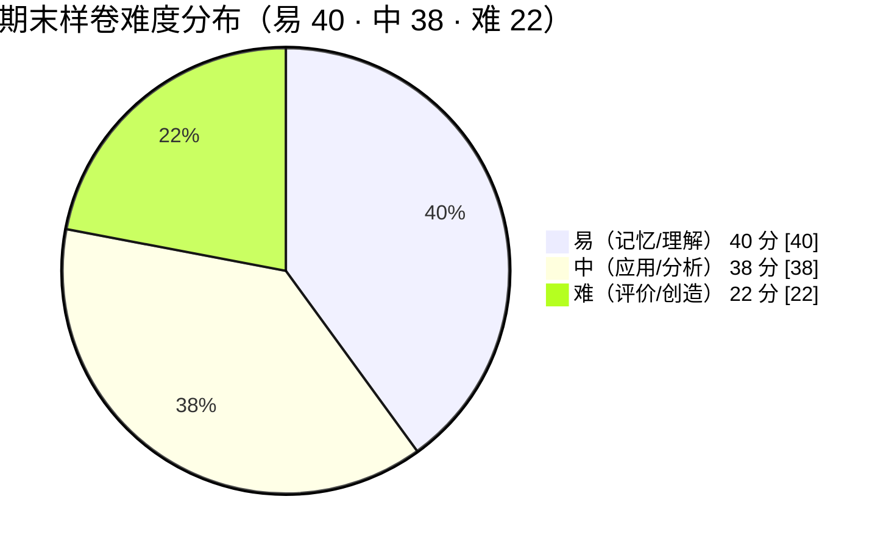

# 期末样卷与参考答案要点

> 一句话：这份卷子不考“你背了多少 API”，只考**你能不能判断与排查**——一段代码为什么这样跑、一个样式为什么不生效、一次请求为什么被拦、一个方案该不该选。
> 对应《Web 前端技术》课程大纲模块 M1–M10（[[00-课程大纲]]）。考核权重与学术诚信口径见 [[13-考核方案与评分量规]]；题库对照 [[11-习题集 M1-M5]] 与 [[12-习题集 M6-M10]]；实验与提交物规范见 [[15-实验与大作业指导]]；版本与年份口径见 [[16-技术演进时间线]]。

---

## 一、命题说明

### 1.1 为什么这样分布题型

本卷题型与分值固定为：单选 20（10 题 × 2）、多选 10（5 题 × 2）、判断并说明理由 10（5 题 × 2）、简答 25（5 题 × 5）、读代码与调试 20（4 题 × 5）、设计与判断 15（2 题，7 + 8），合计 100 分。

| 题型 | 题号 | 题量 | 每题分值 | 小计 | 主要认知层次 | 主要难度 |
|---|---|---|---|---|---|---|
| 单选 | 1–10 | 10 | 2 | 20 | 记忆/理解 | 易 |
| 多选 | 11–15 | 5 | 2 | 10 | 理解/分析 | 易—难 |
| 判断并说明理由 | 16–20 | 5 | 2 | 10 | 分析/评价 | 易—难 |
| 简答 | 21–25 | 5 | 5 | 25 | 理解/应用/评价 | 易—难 |
| 读代码与调试 | 26–29 | 4 | 5 | 20 | 分析/评价 | 易—难 |
| 设计与判断 | 30–31 | 2 | 7 + 8 | 15 | 应用/评价 | 中—难 |
| 合计 | — | 31 | — | 100 | — | — |

分布理由（课程组口径）：

- **客观题占 40 分（单选 + 多选 + 判断）**，覆盖全部十模块，保证分数稳定、覆盖面完整；每题锚定一个可判对错的判据，而不是靠印象作答。
- **读代码与调试占 20 分**，是“错误优先”教学法的落点——本课程的核心能力是**诊断**，不是记忆。四道题一律采用“给现象 → 找根因 → 说修复方向”的结构。
- **简答与设计共 40 分**，考“能不能把机制与边界说清楚、能不能做选型决策并给出依据”，对应学习成果中“能解释…并说出每一步的失败后果”一类目标。
- 全卷**不考 API 死记**（见第六节），需要记忆的内容只出现在“识别现役概念、识别常见错误写法”这类判断题里。

### 1.2 难度结构（易 : 中 : 难 ≈ 4 : 4 : 2）

| 难度 | 分值 | 占比 | 落在哪些题 |
|---|---|---|---|
| 易 | 40 | 40% | 全部单选（1–10，20 分）；多选 11、13（4 分）；判断 16–18（6 分）；简答 21（5 分）；读代码 26（5 分） |
| 中 | 38 | 38% | 多选 12、14（4 分）；判断 19（2 分）；简答 22–24（15 分）；读代码 27、28（10 分）；设计 30（7 分） |
| 难 | 22 | 22% | 多选 15（2 分）；判断 20（2 分）；简答 25（5 分）；读代码 29（5 分）；设计 31（8 分） |
| 合计 | 100 | 100% | — |



> **图 1**：试卷难度结构——易 40 分、中 38 分、难 22 分，与本节表及第二节双向细目表的「按难度」一行（易 40 · 中 38 · 难 22 = 100）逐字一致。
>
> **看图要点**：易 : 中 : 难 ≈ 4 : 4 : 2，易与中合计 78 分构成基本盘与区分主体；「易」落在全部单选与部分多选/判断，「难」落在多选 15、判断 20、简答 25、读代码 29 与设计 31（共计 22 分）。

### 1.3 认知层次覆盖

| 认知层次 | 分值 | 占比 | 主要落点 |
|---|---|---|---|
| 记忆 | 6 | 6% | 识别现役概念与判据（单选 1、4、9） |
| 理解 | 28 | 28% | 说清机制与边界（单选 2、6、7、8、10；多选 11–13、15；简答 21、22） |
| 应用 | 21 | 21% | 按规律推出结果、按判据落地（单选 3、5；简答 23；读代码 28；设计 30） |
| 分析 | 23 | 23% | 定位根因、解释工具输出（多选 14；判断 16–18；简答 24；读代码 26、27） |
| 评价 | 22 | 22% | 做设计决策、给依据（判断 19、20；简答 25；读代码 29；设计 31） |
| 合计 | 100 | 100% | — |

**说明**：闭卷笔试难以做到“应用层”的完整编码，因此“应用”主要通过“按规则推出正确结果”（如盒模型实宽、事件循环输出顺序）与“按判据设计方案”体现；真正的“创造”层放在实验与课程项目中考核（见 [[15-实验与大作业指导]]）。

---

## 二、双向细目表

题号 × 模块 × 认知层次 × 难度 × 分值：

| 题号 | 题型 | 模块 | 认知层次 | 难度 | 分值 |
|---|---|---|---|---|---|
| 1 | 单选 | M1 | 记忆 | 易 | 2 |
| 2 | 单选 | M2 | 理解 | 易 | 2 |
| 3 | 单选 | M3 | 应用 | 易 | 2 |
| 4 | 单选 | M4 | 记忆 | 易 | 2 |
| 5 | 单选 | M5 | 应用 | 易 | 2 |
| 6 | 单选 | M6 | 理解 | 易 | 2 |
| 7 | 单选 | M7 | 理解 | 易 | 2 |
| 8 | 单选 | M8 | 理解 | 易 | 2 |
| 9 | 单选 | M9 | 记忆 | 易 | 2 |
| 10 | 单选 | M10 | 理解 | 易 | 2 |
| 11 | 多选 | M1、M8 | 理解 | 易 | 2 |
| 12 | 多选 | M2 | 理解 | 中 | 2 |
| 13 | 多选 | M3 | 理解 | 易 | 2 |
| 14 | 多选 | M5 | 分析 | 中 | 2 |
| 15 | 多选 | M9 | 理解 | 难 | 2 |
| 16 | 判断并说明理由 | M2 | 分析 | 易 | 2 |
| 17 | 判断并说明理由 | M4 | 分析 | 易 | 2 |
| 18 | 判断并说明理由 | M5 | 分析 | 易 | 2 |
| 19 | 判断并说明理由 | M7 | 评价 | 中 | 2 |
| 20 | 判断并说明理由 | M8 | 评价 | 难 | 2 |
| 21 | 简答 | M1 | 理解 | 易 | 5 |
| 22 | 简答 | M3 | 理解 | 中 | 5 |
| 23 | 简答 | M9 | 应用 | 中 | 5 |
| 24 | 简答 | M6 | 分析 | 中 | 5 |
| 25 | 简答 | M10 | 评价 | 难 | 5 |
| 26 | 读代码与调试 | M4 | 分析 | 易 | 5 |
| 27 | 读代码与调试 | M5 | 分析 | 中 | 5 |
| 28 | 读代码与调试 | M7 | 应用 | 中 | 5 |
| 29 | 读代码与调试 | M8 | 评价 | 难 | 5 |
| 30 | 设计与判断 | M3 | 应用 | 中 | 7 |
| 31 | 设计与判断 | M10 | 评价 | 难 | 8 |
| 合计 | — | — | — | — | 100 |

**合计核对**：

| 口径 | 分账 |
|---|---|
| 按题型 | 单选 20 · 多选 10 · 判断并说明理由 10 · 简答 25 · 读代码与调试 20 · 设计与判断 15 = **100** |
| 按认知层次 | 记忆 6 · 理解 28 · 应用 21 · 分析 23 · 评价 22 = **100** |
| 按难度 | 易 40 · 中 38 · 难 22 = **100** |
| 按模块（第 11 题跨 M1/M8，按各 1 分拆分） | M1 8 · M2 6 · M3 16 · M4 9 · M5 11 · M6 7 · M7 9 · M8 10 · M9 9 · M10 15 = **100** |

> 模块分值不平均是**有意为之**：M3（12 学时）分值最高；M2（6 学时）分值最低；M10 因含一道 8 分设计题而偏高。不追求“平均主义”，追求与各模块学时、学习成果权重相匹配。

---

## 三、试卷正文

> 本节内容可直接印发（含卷头、考试须知、题目、答题说明）。

### 《Web 前端技术》期末试卷（样卷）

**考试形式**：闭卷笔试 **| 考试时长**：2 小时 **| 满分**：100 分

| 题号 | 一 | 二 | 三 | 四 | 五 | 六 | 总分 |
|---|---|---|---|---|---|---|---|
| 满分 | 20 | 10 | 10 | 25 | 20 | 15 | 100 |
| 得分 | | | | | | | |

**考试须知**

1. 本卷共六大题、31 小题，满分 100 分，考试时间 120 分钟。
2. 闭卷。不得携带书籍、笔记、电子设备；考场提供的草稿纸须随卷交回。
3. 答案一律写在答题纸的**指定题号区域**，写错位置不得分。
4. 判断并说明理由题：先写“对/错”或“成立/不成立”，再写理由；只写结论不写理由，不得理由分。
5. 读代码与调试题：只要求指出**根因**与**修复方向**，不要求写出可运行代码；写完整实现不加分。
6. 出现编造的标准编号、年份、人名以“让论述完整”的，本题按不规范处理，酌情扣分。
7. 允许使用规范的语言：引用概念时写清依据属于哪一级资料（规范原文 / 官方文档 / 教程 / 其他）会加分。

**答题说明**

- 单选题每题只有一个最符合的选项；多选题每题有两个或以上正确选项。
- 简答题只写要点与关键词，不要求成段文字。
- 设计与判断题须写出**判断依据**；只给结论不给依据的，按“答对但无依据”计分（见评分标准）。
- 代码片段仅示形态，不完整；分析时以“这段代码想做什么、问题出在哪”为准。

---

#### 一、单项选择题（本大题 10 小题，每题 2 分，共 20 分）

**1.** 入职第一周的答疑会上，有新人问：「互联网和万维网，是不是一回事？」下列回答中，哪一句是准确的：
A. 万维网是底层的网络基础设施，互联网是架在它上面的一个应用
B. 互联网是网络与网络互联的基础设施，万维网是跑在其上、以 HTTP 与超文本为媒介的一个应用
C. 电子邮件与域名解析属于万维网的组成部分
D. 没有万维网，域名系统就无法工作

**2.** 商品列表卡片的左上角有一枚纯装饰性的「新品」水印图（`img`，不承载任何信息），它的 `alt` 应当怎么写？
A. 写成文件名，如 `alt="watermark.svg"`
B. 写成描述，如 `alt="新品水印"`
C. 写成空字符串，`alt=""`
D. 完全不写 `alt` 属性

**3.** 设计稿标注某卡片总宽 300px，实现时给卡片写了 `padding: 15px; border: 2px`，项目已全局设置 `box-sizing: border-box`。这张卡片从内容到边框的总占宽（不含外边距）是：
A. 300px　B. 334px　C. 302px　D. 260px

**4.** `typeof null` 的结果与 `NaN === NaN` 的值分别是：
A. `"null"`、`true`　B. `"object"`、`false`　C. `"object"`、`true`　D. `"null"`、`false`

**5.** 当前宏任务执行完后，下列哪个先执行——`Promise.resolve().then(fn)` 还是 `setTimeout(fn2, 0)`？
A. `setTimeout` 的回调先，因为它的延迟更短
B. `Promise.then` 的回调先，因为微任务队列在当前宏任务结束后会被清空，早于取下一个宏任务
C. 两者在同一时刻执行
D. 取决于浏览器厂商，无法判断

**6.** 判断一个包该放 `dependencies` 还是 `devDependencies`，本课程统一采用的一句判据是：
A. 看包的下载量大小
B. 看它会不会被构建进交付给用户的前端产物：会 → `dependencies`；只在开发、检查、构建阶段用 → `devDependencies`
C. 看包的作者是否知名
D. 看安装所需时间的长短

**7.** 在 React 中执行 `list.push(newItem)` 后再调用 `setList(list)`，界面往往不更新。根因是：
A. `push` 不是合法的数组方法
B. React 靠引用比较判断状态是否变化，原数组引用未变，被判为“没变”
C. 必须先 `await` 等待 `push` 完成
D. 只要换成另一种写法就一定会更新，与数据本身无关

**8.** 接口返回 404 或 500 时，`fetch` 返回的 Promise 状态与正确做法是：
A. rejected，会自动进入 `catch`，无需额外判断
B. resolved（通信成功完成），必须自己判断 `res.ok`
C. pending，会一直挂起
D. 取决于请求是否跨域

**9.** 当前 Core Web Vitals 的三项是：
A. FCP、TTI、TBT　B. LCP、INP、CLS　C. FID、LCP、CLS　D. LCP、INP、TBT

**10.** 服务端已经产出了完整 HTML，用户能看清页面内容，但点按钮没有任何反应。最可能的原因是：
A. CSS 没有加载
B. 客户端 JS 尚未下载并执行完，水合未完成
C. 浏览器渲染引擎存在 bug
D. 图片未加载完成

---

#### 二、多项选择题（本大题 5 小题，每题 2 分，共 10 分；少选得 1 分，含错项不得分）

**11.** 下列说法正确的有：
A. 某特性在所有主流浏览器都能用，就说明它已经是正式标准
B. 规范文档带有状态字段（草案 / 候选推荐 / 正式推荐等），引用前应先查看
C. URL 中 `#` 之后的部分不会随请求发送给服务器
D. 状态码 4xx 表示客户端侧问题，5xx 表示服务端侧问题

**12.** 关于表单的可访问性与提交语义，正确的有：
A. 只有带 `name` 的控件才会出现在提交数据里
B. `placeholder` 可以替代 `label` 作为字段名
C. `label for` 与 `input id` 配对后，点击标签文字也能聚焦对应输入框
D. 单选组应使用 `fieldset` + `legend` 提供组名

**13.** 关于 CSS 盒子与层叠，正确的有：
A. 相邻兄弟的垂直外边距会合并，间距取两者较大值而非相加
B. 未放进任何 `@layer` 的样式，其优先级高于所有分层样式
C. `z-index` 数值越大就一定越靠上，与层叠上下文无关
D. `box-sizing: border-box` 下，设置的 `width` 已包含内边距与边框

**14.** 关于渲染代价与事件模型，正确的有：
A. 用 `transform` / `opacity` 做的动画通常只走合成阶段，不触发布局与绘制
B. 事件委托利用冒泡，把 N 个子元素监听器降为父容器上的 1 个
C. 委托回调里 `event.target` 与 `event.currentTarget` 通常是同一个节点
D. `preventDefault()` 会阻止事件继续冒泡

**15.** 关于可访问性与测试，正确的有：
A. 能用原生 `<button>` 表达就优先用原生，不手写角色与 ARIA
B. 覆盖率 100% 就能说明代码质量已经过关
C. Playwright 端到端测试应只覆盖关键用户路径
D. 给页面上所有资源都加 `preload` 会让页面一定更快

---

#### 三、判断并说明理由（本大题 5 小题，每题 2 分，共 10 分）

> 每题先写“对/错”（或“成立/不成立”），再说明理由。

**16.** 只要每个 `` 都写了 `alt` 属性，就满足了对屏幕阅读器用户的无障碍要求。

**17.** 给分页参数写 `pageSize || 20` 兜默认值是安全的写法。

**18.** 用 `setTimeout(fn, 0)` 就一定能保证 `fn` 在页面渲染之后执行。

**19.** 代码评审会上，一位同事提议给本次改动涉及的所有子组件「一律包 `memo`」、所有派生值「一律包 `useMemo`」，理由是「包了必然更快」。这条提议是否成立？

**20.** 服务端只要回 `Access-Control-Allow-Origin: *`，前端就能带上 Cookie 完成跨域请求。

---

#### 四、简答题（本大题 5 小题，每题 5 分，共 25 分）

**21.** 简述互联网与万维网的区别，并说明“网页打不开”为什么不能直接判定为“网络断开”。

**22.** 说明响应式设计中“移动优先”为什么用 `min-width` 而不是 `max-width`；并说明容器查询与媒体查询的区别。

**23.** 一个带前端路由的单页应用部署到静态服务器后，直接访问或刷新深层路由地址（如 `/detail/123`）返回 404，而本地开发时正常。写出：① 成因；② 服务器回退配置的方向；③ 为什么上线前必须先 `build` + `preview` 验证。

**24.** 解释 `lockfile` 与 `node_modules` 在“是否需要提交进 Git 仓库”上的不同理由。

**25.** 判断一个新特性“现在能不能用于生产”的三个步骤是什么？并说明为什么“没有降级方案”就不能当作可以上线。

---

#### 五、读代码与调试（本大题 4 小题，每题 5 分，共 20 分）

> 指出根因与修复**方向**即可，不要求写出可运行代码。

**26.** 下面这段代码有三处问题：
```js
// 仅示形态
function findById(items, id) {
  return items.find((it) => it.id == id);   // ①
}
const cfg = { pageSize: 0 };
const size = cfg.pageSize || 20;            // ②
const nums = [3, 1, 20];
nums.sort();                                // ③
```
分别指出 ①②③ 的根因，并给出修复方向。

**27.** 一个页面有一个“新增 2000 项”的按钮，点击后页面卡顿约 1 秒，且随后新增项的点击有时没有反应：
```js
// 仅示形态
function addAll(rows) {
  const frag = document.createDocumentFragment();
  rows.forEach((r) => {
    const li = document.createElement('li');
    li.textContent = r.name;
    li.addEventListener('click', handleRow);   // ①
    frag.appendChild(li);
  });
  list.appendChild(frag);
}
```
指出根因，并给出修复方向。

**28.** 一个详情页组件在多个详情之间切换时，出现“数据不刷新”和“快速切换后结果与当前项不符”：
```jsx
// 仅示形态
function Detail({ id }) {
  const [state, setState] = useState({ loading: true, data: null });
  useEffect(() => {
    setState({ loading: true, data: null });
    fetch(`/api/items/${id}`)
      .then((r) => r.json())
      .then((data) => setState({ loading: false, data }));
  }, [id]);
  if (state.loading) return <Spinner />;
  return <List items={state.data} />;
}
```
指出根因，并给出修复方向。

**29.** 下面是一段“网络抖动后自动重试”的代码：
```js
// 仅示形态
async function submitOrder(order) {
  for (let i = 0; i < 3; i++) {
    try {
      return await fetch('/api/orders', {
        method: 'POST',
        headers: { 'Content-Type': 'application/json' },
        body: JSON.stringify(order),
      });
    } catch (e) {
      // 稍后重试
    }
  }
}
```
指出风险与根因，并给出修复方向。

---

#### 六、设计与判断（本大题 2 小题，第 30 题 7 分，第 31 题 8 分，共 15 分）

**30.（7 分）** 需求如下：一个**移动优先**的卡片区，窄屏 1 列、宽屏多列自适应；卡片间距统一；键盘可完整操作；深色模式跟随系统。请写出你的技术方案要点与**判断依据**（得覆盖：布局模型的选择、自适应换排的实现方式、间距方案、焦点处理、深浅色处理），不要求完整代码。

**31.（8 分）** 针对两个需求分别给出渲染策略建议，并各写出一条**退出成本**：
- A. **产品介绍页**：内容半年更新一次，需要被搜索引擎收录，无登录，访问量中等。
- B. **登录后的个人数据看板**：内容因人而异，实时性要求不高，用户规模固定（约 5000 人）。

---

## 四、参考答案要点

> 说明：本节只给要点与关键词、每个要点的得分值；**不给整段范文、不给完整代码**。主观题的答案口吻由学生自组织，阅卷按要点判定。

### 一、单项选择题（每题 2 分）

| 题号 | 答案 | 一句解析 |
|---|---|---|
| 1 | B | 互联网是网络互联的基础设施，万维网是其上以 HTTP 与超文本为媒介的应用；邮件、域名解析不属于万维网。 |
| 2 | C | 装饰图应写 `alt=""` 明确跳过；写文件名等于零信息，完全省略 `alt` 可能被读成文件名。 |
| 3 | A | `border-box` 下设置的 `width` 已含内边距与边框，故总占宽就是 300px。 |
| 4 | B | `typeof null` 因历史实现返回 `"object"`；`NaN` 与自身不相等。 |
| 5 | B | 微任务队列在当前宏任务结束后立即清空，早于下一个宏任务。 |
| 6 | B | 判据是“会不会被打进交付给用户的前端产物”。 |
| 7 | B | React 不做依赖追踪，靠引用比较；原引用未变即视为没变。 |
| 8 | B | `fetch` 只在网络层失败时 reject；4xx/5xx 是成功完成的通信，须自己判 `res.ok`。 |
| 9 | B | 现役三项为 LCP / INP / CLS；FID 已被 INP 取代。 |
| 10 | B | 服务端产出的 HTML 只有结构与样式，需等脚本下载执行完成水合才可交互。 |

### 二、多项选择题（每题 2 分；全对 2 分，少选得 1 分，含错项不得分）

| 题号 | 答案 | 一句解析 |
|---|---|---|
| 11 | B、C、D | A 混淆“实现支持面”与“规范状态”；`#` 片段只在本机生效；4xx/5xx 分属客户端/服务端。 |
| 12 | A、C、D | B 错：`placeholder` 输入后消失，不能替代 `label` 提供稳定的可访问名。 |
| 13 | A、B、D | C 错：只有同一层叠上下文内的元素才按 `z-index` 比较数值。 |
| 14 | A、B | C 错：委托里二者通常不同；D 错：`preventDefault` 只取消默认行为，不影响传播。 |
| 15 | A、C | B 错：覆盖率不等于质量（可能是无断言空测试）；D 错：无差别 `preload` 会抢占首屏带宽。 |

### 三、判断并说明理由（每题 2 分：结论 1 分 + 依据 1 分）

**16.** 结论：错误。
依据要点：① `alt` 必须按场景写（信息图写等效信息 / 装饰图写 `alt=""` / 功能图标写功能名）；写文件名或写“图片”信息量为零。② 无障碍不止 `alt`：还包括地标结构、标题层级连续、键盘可达与可见焦点等。（每点 0.5 分）

**17.** 结论：错误。
依据要点：① `||` 对所有假值取右，`0`、`''`、`false` 都会被替换，`pageSize=0` 会被吞掉。② 应改用 `??`，只在 `null`/`undefined` 时取右。（每点 1 分）

**18.** 结论：错误。
依据要点：① `setTimeout` 只保证“到期后尽快入队”，与渲染时机无关，不能保证在渲染之后。② 要在“下一帧渲染后”执行，应使用嵌套的 `requestAnimationFrame` 或监听过渡/动画完成事件。（每点 1 分）

**19.** 结论：错误。
依据要点：① 比较与缓存本身有成本；② 若父组件每次传入新引用（新对象/新函数），比较必然失败，收益为零甚至更慢；③ 应先测量定位瓶颈、稳定引用，再按实测决定。（答出①②各 0.5 分，答出③ 1 分）

**20.** 结论：错误。
依据要点：带凭据跨域需三者同时成立——前端 `credentials: 'include'`、服务端 `Access-Control-Allow-Credentials: true`、且 `Allow-Origin` 为**回显的具体来源**而非 `*`。（答出“不能用 `*`”1 分，答出前端凭据与 Allow-Credentials 1 分）

### 四、简答题（每题 5 分，按要点给分）

**21.**
- 互联网是网络与网络互联的基础设施；万维网是跑在其上、以 HTTP 与超文本为媒介的应用。（2 分）
- 举例：电子邮件、域名解析、文件传输属于互联网但（不只用）万维网。（1 分）
- “网页打不开”可能是应用层问题（4xx/5xx、跨域被拦、缓存），也可能是基础设施问题（DNS/连接失败）；应先区分是哪一层再下结论。（2 分）

**22.**
- 移动优先：默认样式写给窄屏，再用 `min-width` 逐级向上叠加，覆盖链更短、更好维护；`max-width` 属桌面优先，断点越改越乱。（2 分）
- 断点应由内容驱动，不要按具体设备型号设置。（1 分）
- 媒体查询依据**视口**宽度；容器查询给容器设 `container-type` 后，组件按**自身容器**宽度换排，同一视口下不同容器可呈现不同布局。（2 分）

**23.**
- 成因：SPA 路由由前端接管，服务器在 `/detail/123` 找不到对应文件，返回 404。（2 分）
- 回退方向：配置“找不到文件就返回 `index.html`”，把未知路径交给前端路由。（2 分）
- 先 `build` + `preview`：生产产物会打包、切分、加哈希、改资源路径，dev 能跑不代表生产能跑。（1 分）

**24.**
- `node_modules` 是可再生的产物，体积大、含平台相关二进制、跨平台不通用，且有投毒风险 → 不提交。（2 分）
- `lockfile` 记录实际装到的确切版本、整棵依赖树与校验信息，是“可复现”的唯一凭据 → 必须提交。（2 分）
- 两者理由不同：前者“可再生/有风险”，后者“缺了它，换台机器会装出不同环境”。（1 分）

**25.**
- 三步：① 查规范状态；② 查目标浏览器支持面；③ 写出降级方案。（2 分）
- 规范状态回答“文档成熟到什么程度”，不直接等于“实现到什么程度”，两者分别查。（1 分）
- 无降级方案：目标环境不支持时功能直接不可用且无兜底，影响面不可控；“能查、有支持、可降级”三条缺一不可。（2 分）

### 五、读代码与调试（每题 5 分）

**26.**（每处根因与方向合计）
- ① `it.id == id`：抽象相等会做隐式转换（`'0'` 与 `0` 被判相等）→ 改用 `===`。（2 分）
- ② `cfg.pageSize || 20`：`||` 把合法值 `0` 取右 → 改用 `??`。（2 分）
- ③ `nums.sort()`：默认按字符串（UTF-16 码元）比较，数字排序会错 → 传比较函数 `(a, b) => a - b`。（1 分）

**27.**
- 根因一：在主线程同步创建并插入 2000 个节点，构成超过 50ms 的**长任务**，阻塞主线程，事件排队、交互延迟。（2 分）
- 根因二：为每一项各绑一个点击监听器，监听器数量随节点数线性增长，新增项还需重绑。（2 分）
- 修复方向：改为事件委托（父容器 1 个监听器 + `event.target.closest` 分发）；分批/虚拟列表渲染；含重计算则移入 Web Worker；用 Performance 面板复测证明长任务消失。（1 分）

**28.**
- 根因一：`fetch` 的 4xx/5xx 不会 reject，代码未判 `res.ok`，也未处理失败，失败时停留在加载态。（2 分）
- 根因二：只实现了“加载中/成功”两态，缺**失败态**与**空态**（空数组也被当成加载中）。（1 分）
- 根因三：快速切换时旧响应可能后到并覆盖新结果（竞态），且卸载后仍会更新状态。（1 分）
- 修复方向：补齐四态与重试入口；判 `res.ok` 并分类错误；用 `AbortController` 或在清理函数中作废过期请求。（1 分）

**29.**
- 根因一：`POST /orders` 非幂等，网络抖动时盲目重试可能创建多笔订单。（2 分）
- 根因二：这段 `catch` 只捕获网络层失败，4xx/5xx 不会进 `catch`，因此对业务错误实际上没有重试，且未判 `res.ok`。（2 分）
- 根因三 / 修复方向：缺退避与抖动、无幂等键；应对非幂等方法不自动重试，或由客户端生成**幂等键**随请求携带、服务端据此去重；仅对网络错误/429/5xx 做带指数退避与抖动的重试。（1 分）

### 六、设计与判断

**30.（7 分）**
- 布局模型：整页骨架/两栏用 Grid（二维）；卡片墙用一行 `grid-template-columns: repeat(auto-fit, minmax(240px, 1fr))` 实现从 1 列到多列自适应，**不加媒体查询**。（2 分）
- 一维的导航/工具条用 Flex；间距一律用 `gap`，不用兄弟 `margin` 硬挤。（1 分）
- 尺寸与间距用相对单位（`rem` / `clamp()`），改根字号时整页联动。（1 分）
- 键盘可达：可操作元素用原生可聚焦元素（导航用 `a`、动作用 `button`），保留可见焦点（用 `:focus-visible` 自定义，不写 `outline: none`）。（2 分）
- 深浅色：`prefers-color-scheme` + 声明 `color-scheme`，使内置控件与滚动条跟随。（1 分）
- 判断依据须能说清“一维用 Flex、二维用 Grid”“自适应换排靠轨道而非媒体查询”“语义与焦点是可访问性硬线”。

**31.（8 分）**
- A（产品介绍页）：以 SSG（构建时生成/按需重建）为主——HTML 中已含正文，利于首屏与抓取；代价是内容不即时、重建有成本。（2 分）退出成本：若改为分钟级更新，需要引入 SSR 或增量更新，可能连带常驻服务与运维。（1 分）
- B（个人数据看板）：个性化内容不能进共享缓存的静态产物；用户固定、无 SEO 诉求 → 优先 **SPA + 静态托管 + 接口鉴权**，不必引入元框架（SSR 会带来常驻服务、运维与安全面）。（2 分）若确需服务端渲染，须常驻服务并处理“用户相关数据不得进共享缓存”。（1 分）
- 选型方法：按“内容何时变化、给谁看、有没有常驻服务预算”排序后再谈框架；退出成本看约定深浅与可替换性（路由/构建/状态能否迁移）。（2 分）

---

## 五、评分标准

### 5.1 客观题评分

- **单选**：每题 2 分，选对得分，多选/不选不得分。
- **多选**：全对得 2 分；**少选**（只选了部分正确项、未选任何错误项）得 1 分；**含错误项**不得分。
- **判断并说明理由**：每题 2 分，拆为“结论 1 分 + 依据 1 分”。
  - 结论正确且依据含关键判据 → 2 分；
  - 结论正确、依据缺失或只复述结论 → 1 分；
  - 结论错误 → 0 分（若依据指向正确方向，由阅卷组统一裁定，最多不超过 0.5 分）。

### 5.2 主观题分步给分与常见错误

- **分步给分点**：简答与设计题按“要点 × 分值”累加，**不倒扣**；要点表述不同但语义等价即可给分；只列术语而不说明用法/边界的不计入要点。
- **常见错误与扣分**：

| 常见错误 | 处理 |
|---|---|
| 读代码题写“改成正确写法”却不点出是哪一类错误（未落到 `===` / `??` / 事件委托 / 判 `res.ok` 等） | 该要点不得分 |
| 设计题只给结论（“用 Grid”）不给判断依据 | 按“答对但无依据”计分（见 5.3） |
| 简答题堆砌术语、罗列概念但无因果与边界 | 按“堆术语无逻辑”计分（见 5.3） |
| 主观题出现完整代码或可直接照抄的整段范文 | 不额外给分；若与题意不符按错误处理 |
| 编造标准编号、年份、人名 | 本题按不规范处理，酌情扣 0.5–1 分 |
| 把“浏览器支持”当作“已成正式标准”、“覆盖率 100%”当作“质量过关”这类概念性误判 | 对应要点不得分 |

### 5.3 主观题四等级量规

| 等级 | 分值区间 | 判定标准 |
|---|---|---|
| **优** | 90%–100% | 要点齐全；判据准确、机制说对；边界与代价说清；关键处能给出“为什么这样改”的因果链 |
| **良** | 75%–89% | 主要要点齐全；个别边界或代价缺失；机制基本正确，无概念性误判 |
| **及格** | 60%–74% | 覆盖核心要点，但依据不足或表述含糊；有个别概念混用，尚能自洽 |
| **不及格** | < 60% | 要点严重缺失，或方向性错误（如把构建成功当作类型无误、把 CORS 当服务端安全机制、把 4xx/5xx 当网络错误） |

**两类特殊情形的给分口径**：

- **“答对但无依据”**：结论/答案正确，但未给出判据或因果。按该要点分值的 **50%** 计（例如要点 2 分给 1 分），且整卷此类情形累计不超过 5 分。理由：工程结论必须以依据支撑，只报结论不满足“能解释”的目标。
- **“堆术语无逻辑”**：罗列了大量名词但无因果关系、无边界、无取舍。按该题分值的 **≤ 40%** 计，不因术语多而加分；若术语用错（角色与语义混淆、把 Living Standard 当作“不要遵守”）则按不及格档处理。

---

## 六、命题纪律

1. **不考 API 死记。** 全卷不要求默写某 API 的参数表、配置项或版本号；考的是**判断与排查**——能否定位根因、说明机制、比较方案边界。例如：不考 `fetch` 的完整参数列表，而考“4xx/5xx 为什么不会 reject、该如何处理”。
2. **不超纲。** 所有题目只考各模块教案第三节（逐节讲授要点）讲过的内容，不出现教案未讲的概念。命题时逐题对照 M1–M10 教案第三节。
3. **不与题库原题重复（可核查）。** 本卷**不整题照搬** [[11-习题集 M1-M5]]、[[12-习题集 M6-M10]] 的原题；同一考点一律**换情境**命制（如把“`||` 与 `??` 的对照”换成“分页参数兜默认值”的场景）。命题时按“题目情境 + 提问角度”双重比对；若题库尚未落库，则以各模块教案第七节的自测题为比对基线。**本卷与两册题库的同考点对照关系已逐题登记在本节末的《同考点题面对照登记表》，可逐条核查**：凡登记为同考点的题，均已按“换情境”改写，不出现逐字照搬的题面。
4. **版本号只用课程允许清单**（Vite 8.3.1、React 19.3.0、Vue 3.5.43、TypeScript 7.0.2、Vitest 5.0.3、Playwright 1.63.0、Node v26.7.0、npm 11.19.0 等）。本卷除上述允许项外不出现其他版本号。
5. **引用只用白名单链接；不编造年份、人名、论文与标准编号。** 命题时参照二级资料（官方文档）组织判据，不把四级资料（博客/问答/生成内容）当依据。
6. **代码块均标“仅示形态”且不超过 20 行**，不构成可直接提交的答案；**阅卷要点只给要点与分值，不给整段范文、不给完整代码**。
7. **库内可引用接口**：[[00-课程大纲]]、[[13-考核方案与评分量规]]、[[11-习题集 M1-M5]]、[[12-习题集 M6-M10]]、[[15-实验与大作业指导]]、[[16-技术演进时间线]]。

**同考点题面对照登记表（可逐条核查）**

| 本卷题号 | 题型 | 对应题库题号 | 共同考点 | 情境处置 |
|---|---|---|---|---|
| 1 | 单选 | [[11-习题集 M1-M5]] 第 1 题 | 互联网 vs 万维网的关系（基础设施 vs 应用） | 已换情境：技术史讲座问答 → 入职第一周答疑会 |
| 2 | 单选 | [[11-习题集 M1-M5]] 第 21 题 | 纯装饰图的 `alt` 写法 | 已换情境：页头波浪纹分隔图 → 商品卡片「新品」水印 |
| 3 | 单选 | [[11-习题集 M1-M5]] 第 35 题 | `box-sizing: border-box` 下元素的实际占宽 | 已换情境：抽象元素 → 设计稿卡片尺寸核对 |
| 19 | 判断并说明理由 | [[12-习题集 M6-M10]] 第 M7-11 题 | 「无脑加 `memo` 必然更快」不成立 | 已换情境：团队代码规范约定 → 代码评审会提议 |

> 登记口径：本表登记的是“**同考点**”关系，不等于题面重复——上列四题的题面情境均已改写，与题库原题不再逐字相同。后续新增题目须在命题时同步登记到本表，否则不得声称“不与题库重复”。

**命题依据（白名单）**：HTTP 与缓存、URL、状态码口径—[MDN HTTP 概览](https://developer.mozilla.org/zh-CN/docs/Web/HTTP/Guides/Overview) ；HTML 语义、表单与可访问性基础—[MDN 学习区](https://developer.mozilla.org/zh-CN/docs/Learn_web_development) ；Core Web Vitals 指标与阈值—[Core Web Vitals](https://web.dev/articles/vitals) ；工程化与构建—[Vite 官方文档](https://vite.dev/guide/) ；Vue 与 React 组件模型对照—[Vue 3 中文文档](https://cn.vuejs.org/guide/introduction) 、[React 中文文档](https://zh-hans.react.dev/learn) 。

> 说明：上列链接仅用于组织判据与表述口径；本卷不编造任何年份、人名、论文名与标准编号。各题所依据的规范状态字段与浏览器支持面，命题时以“现查”为准，本卷只训练“要看状态字段”这一动作，不固化具体状态。

---


---

## 七、备选期末方案：上机考试 + 作品答辩（与闭卷笔试**二选一**）

> **并入自 48 学时版本《Web 网页技术》考核方案第四节**（该材料同行审核 P2、P3 两条修复即为此设计）。本节不是一个可以「顺手都用上」的加点，而是**替代方案**：期末考试这一块（权重见 [[00-课程大纲]] 第六节）**只能选一种交付方式**。

### 7.1 两种口径，任选其一，不得混用

| 口径 | 期末部分的构成 | 课程项目（25%）的角色 | 适用 |
|---|---|---|---|
| **口径一（默认）** | **闭卷笔试 100%**（即本文件第一至六节） | 项目独立计分，与期末不重叠 | 人数多、机房紧张、无助教 |
| **口径二（备选）** | **上机考试 + 作品答辩**（两部分合计即期末权重） | **同一个作品不得再计一次项目分**：项目改为「过程分」（里程碑、协作、代码评审），或取消项目维度并把其权重并入期末 | 计算机类专业、机房与助教条件具备 |

> **为什么必须二选一**：如果把答辩算进期末，又同时对同一件作品按课程项目（25%）计分，学生会算出「一件东西算了两次」，总分会超出可解释范围，且事后无法向学生解释。**采用哪种口径，必须在第一次课上明确告知。**

### 7.2 上机考试：机房准备（教师须知，否则部分题目无法作答）

> `fetch` 只能从 HTTP 源加载，**`file://` 下会被拦**。若上机题涉及请求、CORS、缓存或 `localStorage`，必须先在机房预置以下任一方案：① 预装 Node，考生用 `npx serve` 起本地服务；② 预装 Python，用 `python -m http.server`；③ 由机房统一预启只读的本地静态服务，考生从 `http://127.0.0.1:<端口>/exam/` 访问。**考核开始前，必须先在真实机房把这条链路验证一遍**——不验证的后果是全体考生在「请求」那一项上卡死，而教师会误判为「学生不会用 fetch」。

**三种起服务命令（可直接复制到终端，先在机房逐条验证一次）**：

```bash
npx serve .                          # 装了 Node：在 exam/ 目录下执行，访问终端打印的 http://127.0.0.1:<端口>/
python -m http.server 8000           # 装了 Python：访问 http://127.0.0.1:8000/exam/
npm run preview                      # Vite 项目：用本地服务预览 dist/（不要用 file:// 打开 dist/index.html）
```

> 访问地址一律用 `http://127.0.0.1:<端口>/`，**不得用 `file://` 直接打开页面**。
> **考生须知 · 开发者工具快捷键（Windows/Linux）**：`F12` 或 `Ctrl+Shift+I` 开开发者工具；Console = `Ctrl+Shift+J`；Elements 点选 = `Ctrl+Shift+C`；设备模式 = `Ctrl+Shift+M`；硬刷新 = `Ctrl+F5` 或 `Ctrl+Shift+R`；Network 录制 = `Ctrl+E`、记录一次重载 = `Ctrl+R`、搜头 = `Ctrl+F`。面板用法见 [DevTools 文档](https://developer.chrome.com/docs/devtools/) 与 [Network 面板教程](https://developer.chrome.com/docs/devtools/network)。

**考试环境约定（建议）**：离线机房；允许携带自己编写的纸质/电子笔记与本学期自己的作业代码；**不允许**联网、不允许使用 AI 工具；允许查阅教师提供的 API 速查卡。

**任务结构（参考骨架，题目须由任课教师按本班实际教学内容重新命制）**：文档骨架与元数据 → 语义地标结构 → 列表与 `time` 等语义元素 → 外部样式表与全局 `box-sizing` → 自适应布局（限定不用媒体查询）→ 表单校验 → DOM 交互与事件委托 → 请求与四态界面（加载/空/错/成功）→ 错误处理与可访问性自检。每项给明确分值，**总分为 100 分制后按期末权重折算**。

### 7.3 作品答辩：必问题清单（评委随机抽 2–3 问）

| # | 问题 |
|---|---|
| 1 | 你的组件为什么这样拆？要在另一个页面复用它，需要改什么？ |
| 2 | 哪个状态放进了全局状态？为什么不放在组件内部？ |
| 3 | 列表的 `key` 用的是什么？改成数组索引会出现什么现象？ |
| 4 | 这个页面的数据是怎么来的？请求失败时用户看到什么？ |
| 5 | 现在打开 Network 面板，第一个请求是什么？状态码是多少？（`F12` → **Network** → `Ctrl+R` 记录一次重载，点第一条请求看 **Status** 与 **Headers**） |
| 6 | 把这个项目从 Vue 换成 React，哪些部分完全不用改？ |
| 7 | **这学期你最花时间的一个 bug 是什么？你怎么定位的？**（**必问，最能区分真做过和抄的**） |
| 8 | 再做一个类似项目，你会先做什么、跳过什么？ |

**评分要点**：第 7 题答不上来、或答成「记不清了」的，**技术说明部分不超过一半分**。这条判据与本课程「证据优先、能解释才算会」的口径一致（见 [[00-课程大纲#八、教学法与课堂形态]]）。

> **本节的依据说明**：上机考试的机房准备要求属**技术事实**（`file://` 与 HTTP 源的差异可当场验证）；两种口径二选一、答辩问题清单与评分要点属**教学编排判断**，官方材料无此规定。

---

相关：[[00-课程大纲]] · [[13-考核方案与评分量规]] · [[11-习题集 M1-M5]] · [[12-习题集 M6-M10]] · [[15-实验与大作业指导]] · [[16-技术演进时间线]]
