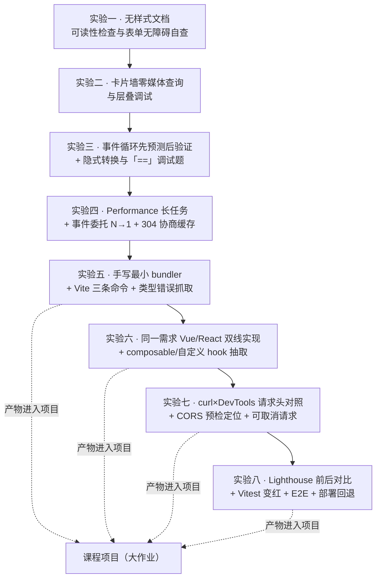
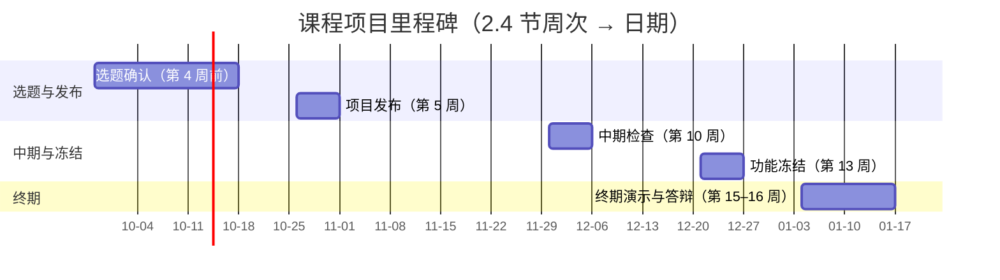

# Web 前端技术 · 实验与大作业指导

> 一句话：实验考的是**动手与证据**，大作业考的是**能解释的设计决策**与**能被别人接手**；两者都只给任务与判据，不给能直接提交的成品。

> 口径来源：模块编号、学时、考核权重以 [[00-课程大纲]] 为准；评分与诚信细则以 [[13-考核方案与评分量规]] 为准。本文只写「做什么、怎么验、交什么」。

## 使用说明

- **与教案对齐**：八次实验逐一对应 M2–M9 各教案的「本模块实验」一节，**不另造一套**；实验目的、任务与判据都能在对应教案里找到出处。
- **只给任务，不给成品**：本文与全部教案一致——凡编程任务，只给任务描述、提示、验收判据与评分要点，**不提供可直接提交的完整代码**。出现的代码片段一律 ≤25 行并标注「仅示形态」。
- **证据优先**：任何结论都要能给出证据（DevTools 截图、导出的 trace/HAR、指标前后两组数字、复现步骤）。「我感觉快了」「应该没问题」在实验报告里不算结论。
- **两次对账**：学生自测按各实验的「验收判据」逐条勾选；教师按「评分要点」给分。

## 一、版本与资料口径（白名单）

### 1.1 版本白名单（全课程统一）

| 类别 | 允许取值 |
|---|---|
| 构建 / 框架 | Vite 8.3.1 · React 19.3.0 · Vue 3.5.43 · Next.js 16.3.8 · Nuxt 4.5.2 |
| 语言 | TypeScript 7.0.2 |
| 测试 | Vitest 5.0.3 · Playwright 1.63.0 |
| 代码质量 | ESLint 10.11.0 · Prettier 3.9.9 · Biome 2.5.15 |
| 工具链 | pnpm 12.8.1 · Node v26.7.0 · npm 11.19.0 |
| 版本管理 | Git 2.53.0 |
| 框架生态 | Pinia 4.0.3 · Vue Router 5.3.1 · React Router 8.4.0 · Zustand 5.0.15 · Tailwind CSS 4.3.3 |
| 其它构建 / 样式 | esbuild 0.28.2 · webpack 5.111.1 · sass 1.105.1 |

> 该口径为课程组统一，取自 2026-10-01 实测的 npm registry（见 [[00-课程大纲#十二、依据说明（重要）]]）。课件、讲义与实验报告中**不得出现白名单以外的版本号**；本表的 22 个版本号已于同日用 `registry.npmjs.org/<包>/latest` 逐条复核一致。

### 1.2 链接白名单（全库唯一口径，按域名分层）

> 正文里凡是**资料名**都要给可点链接；但只允许落在下表域名内。**新增任何 URL 之前，必须先用真实浏览器 UA 实测返回 200**——页面路径会变，光看域名对不算数。

| 层级 | 允许的域名 | 说明 |
|---|---|---|
| **第一层 · 规范与首方标准**（优先引用） | `www.w3.org` `html.spec.whatwg.org` `dom.spec.whatwg.org` `fetch.spec.whatwg.org` `www.rfc-editor.org` `tc39.es` `262.ecma-international.org` `ecma-international.org` | 规范原文与 RFC；判断「规范怎么规定」时只认这一层 |
| **第二层 · 平台与工具官方文档** | `developer.mozilla.org` `developer.chrome.com` `web.dev` `nodejs.org` `registry.npmjs.org` `docs.npmjs.com` `www.npmjs.com` `vite.dev` `vitest.dev` `playwright.dev` `eslint.org` `prettier.io` `biomejs.dev` `www.typescriptlang.org` `ts.nodejs.cn` `tailwindcss.com` `pnpm.io` `git-scm.com` `cn.vuejs.org` `router.vuejs.org` `pinia.vuejs.org` `zh-hans.react.dev` `nextjs.org` `nuxt.com` `www.conventionalcommits.org` `validator.w3.org` `info.cern.ch` `jquery.com` | 讲「某个工具怎么用」时的依据；`ts.nodejs.cn` 是中文镜像，与英文原站冲突时以英文原站为准 |
| **第三层 · 教学性二手站**（可链接，但正文须标「二手」） | `es6.ruanyifeng.com` `zh.javascript.info` `jessejamesgarrett.com` | 讲法友好、非规范原文；**不得**用它裁定规范状态与事实年份 |
| **第四层 · 史料与官方归档**（仅用于技术史脉络，引用时正文必须标【一手/二手/存疑】） | `1997.webhistory.org` `www.krsaborio.net` `lists.w3.org` `www.php.net` `news-web.php.net` `news.microsoft.com` `devblogs.microsoft.com` `download.oracle.com` `rubytalk.org` `www.djangoproject.com` `googlepress.blogspot.com` `web.archive.org` `tinyclouds.org` `www.jsconf.eu` `www.blueskyonmars.com` `www.ics.uci.edu` `yehudakatz.com` `developer.chrome.com` `registry.npmjs.org` `swc.rs` `vercel.com` `remix.run` `react.dev` `deno.com` `bun.sh` `www.netlify.com` `astro.build` `docs.astro.build` `jasonformat.com` `engineering.fb.com` `github.com`（仅 release 页） `dl.acm.org` `www.loc.gov` `medium.com` `webdesignmuseum.org` | 邮件列表存档、厂商新闻稿与官方博客、npm registry、论文与归档站；其中 ACM 数字图书馆、美国国会图书馆、Medium、Web Design Museum 对脚本访问返回 403（反爬，非死链），正文可能取不到 |
| **第五层 · 二手百科**（可链接，但正文须标「二手」） | `en.wikipedia.org` | 只用于二手日期与背景；**不得**用它裁定规范状态与事实年份 |
| **第六层 · 安全框架与漏洞库**（讲安全时的唯一依据层；引用时编号必须逐字拄自页面） | `owasp.org` `cheatsheetseries.owasp.org` `top10proactive.owasp.org` `genai.owasp.org` `attack.mitre.org` `cwe.mitre.org` `datatracker.ietf.org` `cyclonedx.org` `www.zaproxy.org` `xsleaks.dev` | OWASP 项目与速查表、MITRE ATT&CK／CWE、IETF 草案、SBOM 标准、靶场与扫描器；**编号写错比年份写错更严重**：ATT&CK 技巧号（T1190 等）、CWE 号（CWE-79 等）、OWASP 编号（A01/A03、C1–C10）一律逐字拄自页面。本层引用的**资料版本**（ATT&CK v19.2、CWE 4.20、Top 10:2025／2021、ASVS 5.0.0、Proactive Controls 2024）不受 §1.1 工具版本白名单约束 |
| **第七层 · 安全机构、原始披露与法规官方站** | `www.cisa.gov` `www.openwall.com` `blog.cloudflare.com` `sansec.io` `www.microsoft.com` `blog.npmjs.org` `breakdev.org` `github.blog` `arxiv.org` `www.sonatype.com` `fidoalliance.org` `www.cac.gov.cn` `www.npc.gov.cn` `flk.npc.gov.cn` | 安全事件官方公告（CISA／厂商／研究者）、开源邮件列表原始披露、法律条文官方发布页；`github.com` 在本层放宽到**安全公告（`/advisories/`）与官方靶场仓库**页，`medium.com` 在本层放宽到**研究者原始报告**页；攻击.mitre.org、w3.org、cac.gov.cn 等对脚本访问常返 403 或连接错误（反爬／TLS 抖动，非死链） |
| **表外** | —— | 一律**只写名称、不给 URL**；确需引入时先按上面的实测流程走一遍，再把域名补进本表 |

**四条硬规则**：① 链接文字用中文资料名（如「[MDN 层叠指南](…)」），不要裸贴 URL；② W3C 与 npm 对脚本访问常返回 403，那是反爬不是死链，可用另一条取数路径复核正文；③ 全文外链要定期体检（脚本与判读表见技能 `course-package-authoring` 的 `references/link-integrity.md`），**404 必须换掉**；④ **安全类内容只引用上表域名的官方页，且不得写入任何可直接使用的攻击载荷或绕过步骤**——实践一律指向合法靶场（见 [[22-前端安全专章（OWASP × ATT&CK）]] §8.5 与 §9）。
## 第一部分 · 八次实验

### 实验总表

| 编号 | 名称 | 对应模块 | 建议学时 | 一条硬指标（一票否决项） |
|---|---|---|---|---|
| 实验一 | 无样式文档可读性检查与表单无障碍自查 | M2 | 2 | 关 CSS 后地标顺序与视觉顺序一致；表单全靠键盘可提交 |
| 实验二 | 卡片墙零媒体查询与层叠调试 | M3 | 4 | 卡片墙 CSS 中搜不到作用于它的 `@media`／容器查询 |
| 实验三 | 事件循环先预测后验证 + 隐式转换与 `==` 调试题 | M4（先修）+ M5 §3.5（讲完后做） | 4 | 先提交预测、后运行；题面缺陷全改对且无逃逸手段 |
| 实验四 | Performance 长任务 + 事件委托 N→1 + 304 协商缓存 | M5 | 3 | 报出长任务毫秒数；委托后监听器数为 1；304 有截图 |
| 实验五 | 手写最小 bundler + Vite 三条命令 + 类型错误抓取 | M6 | 4 | 产物单文件可跑；`tsc --noEmit` 能定位到行 |
| 实验六 | 同一需求 Vue/React 双线实现 + composable/hook 抽取 | M7 | 5 | 筛选表达式只出现在 `useItemFilter()` 内，被两处复用 |
| 实验七 | curl×DevTools 请求头对照 + CORS 预检定位 + 可取消请求 | M8 | 2 | 逐行头部对照表完整；预检失败能指名缺哪个头；卸载有中止证据 |
| 实验八 | Lighthouse 前后对比 + Vitest 变红 + E2E + 部署回退 | M9 | 4 | 改坏函数测试变红；手机蜂窝数据刷新深层路由不 404 |

> 八次实验合计 **28 学时**（对应 M2–M9 的教案实验）。M1 与 M10 的上机为随堂观察型任务，不单独提交实验报告（其观测并入相邻实验或课堂抽查）——此为课程组口径，非官方要求。



> **图 1**：八次实验的依赖关系——实验一→二→…→八为同一条主线，后四次的产物进入课程项目。
>
> **看图要点**：实验一→四是基础链（语义 → 布局 → 语言 → 运行时），实验五→八在其上逐级叠加工程化、组件化、请求与上线能力；虚线表示该次实验的产物直接进入课程项目的技术底座（构建、组件、请求、上线），与 [[13-考核方案与评分量规#3.2 八次实验的内部权重（不等权，避免激励错位）]]「为什么后四次更重」一致。

---

> **附加实验（选修，第 9 次）**：**JavaScript 脚本实战** —— 任务、环境前置、验收判据与常见故障见 [[24-JavaScript 脚本实战专章（Node 与浏览器）]] §10。它**不计入**上表 8 次实验，也不在本表与 [[13-考核方案与评分量规]] §3.2 的权重映射里；若课程组决定把它纳入 15% 的实验分，必须同步改这两处的实验次数与权重。

### 报告格式与「踩坑记录」评分样例（并入自 48 学时版本实验指导书 0.4 节）

**统一报告模板（缺栏扣分；可直接复制本表头使用）**：

```markdown
# 实验 N　<实验名称>
学号：　　姓名：　　班级：　　日期：

## 一、实验目的
## 二、实验环境（浏览器及版本 / 编辑器 / 本机环境）
## 三、实验任务与完成情况
| 任务 | 完成情况 | 涉及文件 |
|---|---|---|
## 四、关键实现说明（挑 1~2 处最有技术含量的地方，说清「为什么这样做」）
## 五、踩坑记录（★ 必填，本栏是加分项）
| 现象（报错原文照抄） | 排查步骤 | 原因 | 怎么修的 |
|---|---|---|---|
## 六、验收标准自检（逐条自评 + 证据：截图 / 指标 / 控制台输出）
## 七、思考题
## 八、遗留问题与反思
```

**「踩坑记录」三档样例**（唯一判据：**别人读你的记录，能不能照着复现、照着修好**）：

| 档位 | 样例 | 得分（该栏 10 分制） |
|---|---|---|
| **不合格** | 现象「报错了」；排查「试了几次」；原因「不知道」；修复「问同学后好了」 | **0**（写「没遇到问题」同样计 0） |
| **合格** | 现象照抄报错原文 `Uncaught TypeError: Cannot read properties of null (reading 'textContent')`；排查「先用断点确认 `querySelector` 返回 `null`，再查元素是否在 DOM 里」；原因「脚本在 `head` 里同步执行，DOM 还没解析到该元素」；修复「脚本加 `defer`，或在 `DOMContentLoaded` 后执行」 | **7** |
| **优秀** | 在合格基础上补：**为什么一开始会这么写**、**同一现象还有哪两种成因**、**如何用一次性检查避免重现**（例如写进验收清单），并附排查过程截图 | **10** |

**前置条件（教师与验收人须知，踩过坑的一条）**：凡涉及 `fetch`、CORS、缓存或 `localStorage` 的实验与考核，**不得用 `file://` 直接打开页面**——`file://` 下请求会被拦、跨域与缓存行为也会失真，学生按题目做却「全部卡死」，会被误判为不会用 `fetch`。替代方案三选一：① 用 Vite 的 `preview`（本课程白名单内）；② `npx serve`（需 Node）；③ `python -m http.server`。**开始实验或考核前，先在实际机器上把这条链路跑通一遍。**

**操作前置速查（每次实验都先做这一步；快捷键为 Windows / Linux 口径，Mac 把 `Ctrl` 换成 `Command`）**

起本地服务器（三选一，复制到终端执行；端口以终端输出为准）：

```bash
npx vite preview          # 前提：本项目由 Vite 构建过
npx serve .               # 前提：本机装了 Node
python -m http.server 8000
```

访问 `http://127.0.0.1:<端口>/`；**不得用 `file://` 直接打开页面**（`file://` 下请求会被拦、跨域与缓存行为失真）。

- **打开开发者工具**：`F12` 或 `Ctrl+Shift+I`（回到上次用的面板）；Console = `Ctrl+Shift+J`；Elements 点选 = `Ctrl+Shift+C`；设备模式 = `Ctrl+Shift+M`；普通重载 = `F5` 或 `Ctrl+R`；硬刷新 = `Ctrl+F5` 或 `Ctrl+Shift+R`；命令菜单 = `Ctrl+Shift+P`（可输入 "Rendering"、"Lighthouse" 直接打开面板）。参考 [DevTools 文档](https://developer.chrome.com/docs/devtools/) 与 [DevTools 快捷键](https://developer.chrome.com/docs/devtools/shortcuts)。
- **Elements 里就地改 HTML**：选中元素后按 `F2`。
- **断点（Sources 面板）**：在源码行号上点一下设断点；`F8` 继续、`F10` 单步跳过、`F11` 单步进入、`Shift+F11` 跳出。
- **Network 面板**：`F12` → **Network** → `Ctrl+R` 记录一次重载；录制开关 `Ctrl+E`；重放选中请求 `R`；搜头 `Ctrl+F`。参考 [Network 面板教程](https://developer.chrome.com/docs/devtools/network)。
- **Lighthouse**：`F12` → **Lighthouse** → 选 **Analyze page load** → 勾 **Performance** 与 **Accessibility** → 点 **Analyze page load**。参考 [Lighthouse 概览](https://developer.chrome.com/docs/lighthouse/overview) 与 [Core Web Vitals](https://web.dev/articles/vitals)。
- **更多面板（Rendering / Performance monitor / Animations 等）**：`F12` → 右上角 **⋮** → **More tools** → 选对应面板。

---

## 实验一 · 无样式文档可读性检查与表单无障碍自查

| 项 | 内容 |
|---|---|
| 对应模块 | M2 HTML 与语义化 |
| 建议学时 | 2 学时（约 90 分钟） |
| 形式 | 个人 |
| 关联教案 | [[02-教案 M2 HTML 与语义化]] 第 6 节 |

**实验目的**

- 把「用 `div` 堆结构」的默认动作，改掉成「先想语义、再落标签」。
- 建立「关掉 CSS 还能读通」这一最基本的结构质量判据。
- 能独立跑完一份表单的可访问性自查，并修到通过。

**环境与前置**

- Windows 11 + 任意编辑器 + 浏览器（需有 Elements、Accessibility、Rendering 面板）。
- Node v26.7.0 / npm 11.19.0（需要本地服务器时可用 Vite 8.3.1 起静态预览）；**不要求任何框架**。
- 前置：M2 讲授已讲完语义化地标、`alt` 三种写法、表格语义、表单无障碍清单。
- 教师提供两份初始文件：① 一份「全 `div`」的三栏页面；② 一份「看起来能用」的注册/订阅表单（姓名、邮箱、单选组、多选、提交）。
- 参考：[MDN 学习区](https://developer.mozilla.org/zh-CN/docs/Learn_web_development) · [MDN 无障碍模块](https://developer.mozilla.org/zh-CN/docs/Learn_web_development/Core/Accessibility)
- **本实验要用的面板与开法**：**Elements**（`Ctrl+Shift+C` 直接点选元素）；**Accessibility**（`F12` → **Elements** → 选中任意元素 → 右侧切到 **Accessibility** 标签，可看地标列表与控件/`label` 关联）；**Rendering**（`F12` → **⋮** → **More tools** → **Rendering**，可模拟 `prefers-color-scheme`、色觉缺陷）。
- **「关掉 CSS」怎么操作**：`F12` → **Elements** → 选中 `<head>` 里的 `<link rel="stylesheet">` → 按 `F2` 就地改掉 `href` → `Ctrl+F5` 硬刷新；也可在 **Network** 面板右键该 CSS 文件 → **Block request URL** 后按 `Ctrl+R` 重载。
- **起本地服务器 / 快捷键**：见上文「操作前置速查」（三种起服务命令 + `F12` 等快捷键）。

**任务描述（只给任务与提示，不给代码）**

1. **语义化地标重写**：在不改变可见内容的前提下，把全 `div` 页面改写为语义地标（`header`/`nav`/`main`/`article`/`section`/`aside`/`footer`），并整理标题层级。
   - 提示：先问「这一块在文档大纲里是什么」，再决定标签；不要为了用 `section` 而用 `section`。
2. **无样式可读性检查**：用 Rendering 面板关闭 CSS，从上到下通读整页。
   - 提示：读不顺的地方，多半是元素选错或标题层级断裂。
3. **标题层级与地标自检**：用 Accessibility 面板确认页头/导航/主内容/页脚地标能被列出。
4. **表单无障碍自查（初检）**：对提供的表单逐条核对：`label` 关联、`name` 唯一、`type` 匹配、`fieldset`/`legend` 分组、必填标注（不仅靠颜色）、错误提示可读、`button type="submit"`、键盘可完成填写与提交；把结果记成一张表。
5. **修复并复跑**：按自查表逐项修复，复跑自查直到通过；每条判据写明「修复前的问题 + 修复动作 + 验证方式」。

**验收判据（可自测硬指标）**

- [ ] 关闭 CSS 后，从上到下能读出页头、主导航、主内容、侧栏（若有）、页脚，且顺序与视觉顺序一致。
- [ ] 标题层级连续、无跳级（不出现 `h1` → `h4`）；`<main>` 全页只出现一次；每个 `<section>` 都有对应标题。
- [ ] Accessibility 面板能列出页头/导航/主内容/页脚地标。
- [ ] 表单中每个输入控件都有**关联**的 `label`，不存在只靠 `placeholder` 的字段；每个要提交的控件都有 `name` 且无重复冲突。
- [ ] 每个输入框 `type` 与数据内容匹配（邮箱 `email`、电话 `tel`、日期 `date` 等），且提交时确实触发过校验。
- [ ] 单选/多选组、地址块用 `fieldset` + `legend` 分组。
- [ ] 必填项用 `required` 或等效原生约束，且有**不只靠颜色**的可见提示。
- [ ] 只用一个键盘（Tab/Shift+Tab/Enter）能完成整表填写与提交——**硬门槛**。

**提交物清单**

- 改写后的 HTML 文件（语义化页 + 修复前/后的两份表单 HTML）。
- 关闭 CSS 后的整页截图。
- 上述自查表（逐条写「修复前的问题 + 修复动作 + 验证方式」）。
- 无障碍面板截图（地标列表、字段与 `label` 关联）。

**评分要点**

- 语义元素选用是否恰当（占主要）；`<main>` 唯一性与地标完整性；标题层级。
- `label`、`name`、分组三项为**核心**，任一缺失不通过。
- 自查表是否逐条给出**可复现的证据**，而非打钩了事（无证据的勾选不得分）。
- 键盘完成填写与提交是硬门槛。

**常见故障与排查**

| 症状 | 病因 | 处理 |
|---|---|---|
| 关掉 CSS 后内容仍在，但读不出结构 | 结构仍然是全 `div`，只是给 `div` 加了类名 | 回到页头/导航/主内容/页脚四问，逐个换成地标元素；不要靠类名假装语义 |
| 页面里出现两个 `<main>` | 主内容又拆了一层 `<main>`，或侧栏也写成 `<main>` | `<main>` 只包主内容且全页唯一；侧栏用 `<aside>` |
| 屏幕阅读器读不到字段名 | `label` 用了 `for`，但对应控件的 `id` 写错或缺失 | 用面板的字段关联核对 `for`/`id` 配对；或改为把控件包在 `label` 内 |
| 键盘 Tab 卡在某处走不动 | 控件被隐藏、`tabindex` 打乱顺序，或按钮是 `div` 冒充 | 去掉人为 `tabindex`；提交用 `<button type="submit">`；保证焦点顺序与视觉顺序一致 |

---

## 实验二 · 卡片墙零媒体查询与层叠调试

| 项 | 内容 |
|---|---|
| 对应模块 | M3 CSS 与布局 |
| 建议学时 | 4 学时（约 180 分钟） |
| 形式 | 个人 |
| 关联教案 | [[03-教案 M3 CSS 与布局]] 第 6 节 |

**实验目的**

- 把「样式不生效」从玄学变成可复现的诊断流程（层叠、特异性、盒模型、外边距塌陷）。
- 用二维思维搭一个自适应页面区块，并做到**卡片墙零媒体查询**。
- 养成响应式与深浅色、对比度、焦点、动效的自查习惯。

**环境与前置**

- 本机 Node v26.7.0 + npm 11.19.0；VS Code；Chrome/Edge 开发者工具。
- 静态 HTML + CSS 即可，本实验不需要构建工具。
- 前置：M3 已讲完层叠与特异性、`box-sizing`、外边距塌陷、Flex 主轴/交叉轴、Grid 与 `repeat(minmax)`、`prefers-color-scheme`。
- 教师提供一个**故意写坏**的页面（5–6 处问题：高特异性覆盖、`@layer` 顺序错误、漏设全局 `box-sizing`、父子外边距塌陷、被 `overflow: hidden` 裁掉的浮层）。
- 参考：[MDN 学习区](https://developer.mozilla.org/zh-CN/docs/Learn_web_development) · [MDN CSS 参考](https://developer.mozilla.org/zh-CN/docs/Web/CSS/Reference)
- **本实验要用的面板与开法**：**Elements**（`Ctrl+Shift+C` 点选；右侧 **Styles** 面板看哪条规则胜出、被谁划掉，按 `F2` 可就地改 HTML 试效果）；**Computed** 标签（看最终盒模型数值）；**Layout** 标签（看 Grid/Flex 网格线与 `grid-template-areas` 区域名）；**Rendering**（`F12` → **⋮** → **More tools** → **Rendering**，可模拟 `prefers-color-scheme` 验证深色模式）。
- **改完样式先硬刷新**（`Ctrl+F5` 或 `Ctrl+Shift+R`）再判断是否生效，避免缓存造成误判。

**任务描述（只给任务与提示，不给代码）**

1. **层叠与盒模型诊断**：逐处定位坏页面里的问题，写出「病根—依据—改法」的诊断记录并实际修复。
   - 提示：先看面板里哪条规则胜出，再问「它为什么赢」（来源层、特异性、顺序）。
2. **最小改动修复**：不加 `!important`；补一行全局 reset（`box-sizing: border-box`）。
3. **Grid 整页骨架**：用 Grid 完成整页骨架，用 `grid-template-areas` 命名主内容、侧栏、页脚。
4. **卡片墙自适应**：用**一行** `grid-template-columns: repeat(auto-fit, minmax(240px, 1fr))` 实现从 1 列到多列的自动换排；**禁止**为卡片墙写任何媒体查询或容器查询。
   - 提示：间距一律用 `gap`，不要用 `margin` 挤间距。
5. **响应式与深色模式**：补齐 `prefers-color-scheme` 与 `color-scheme`。
6. **无障碍自查**：正文对比度 ≥ 4.5:1、保留可见焦点、动画尊重 `prefers-reduced-motion`；写成 `a11y-check.md`。

**验收判据（可自测硬指标）**

- [ ] 卡片墙的 CSS 里**完全不出现作用于它的 `@media` 或容器查询**，仅靠那一行 `repeat(minmax)` 完成自动换排（搜索 `@media` 应搜不到作用于卡片墙的规则）——**硬指标，一票否决项**。
- [ ] 窗口从窄到宽连续缩放时，卡片列数平滑变化，无横向滚动条。
- [ ] 诊断记录里每处都写明它被哪条规则/哪个属性压住（能指出面板上的位置）；修复后目标效果与题面一致。
- [ ] 样式表中**没有新增 `!important`**；全局 reset 一行存在。
- [ ] 只用 Tab 能走完全部可交互元素，每一步焦点清晰可见。
- [ ] 深色模式下自绘颜色与内置控件配色一致；正文对比度经工具检测 ≥ 4.5:1。

**提交物清单**

- `diagnose.md`（逐处的病根与依据）。
- 修复后的 `index.html` 与 `style.css`。
- `grid-lab/`（Grid 骨架 + 卡片墙 + 深浅色）。
- `a11y-check.md`（对比度、焦点、动效的检查做法与结论）。

**评分要点**

- 卡片墙**零媒体查询**是否达标（一票否决项，约 30%）。
- 诊断定位是否说出真因而非症状（约 50%）、修复是否最小改动（约 30%）。
- 整页 Grid 骨架的清晰度（区域命名是否可读）与响应式、深浅色一致性。
- 无障碍自查的完整与真实。

**常见故障与排查**

| 症状 | 病因 | 处理 |
|---|---|---|
| `repeat(minmax)` 写了却没换排 | 父容器不是 Grid，或卡片被固定宽度撑住 | 确认父级 `display: grid`，列定义放在容器而非子项；去掉子项固定宽度 |
| 没写媒体查询，窄屏还是横向滚动 | 某个子项设了 `min-width`，或长内容不许换行撑宽 | 用 `minmax(240px, 1fr)` 的下限解释滚动来源；对长内容加换行或 `min-width: 0` |
| `@layer` 里写的样式不生效 | 未分层样式优先级高于所有分层样式 | 看清层叠顺序（来源层先于特异性比较）；把该规则移入同一层或调整层顺序 |
| 给浮层写了很高 `z-index` 仍被遮住 | 父级建立了层叠上下文，或兄弟顺序压过 | 检查父级是否创建层叠上下文（如 `transform`/`opacity`/`filter`）；在**同一层叠上下文内**比较 `z-index` |

---

## 实验三 · 事件循环先预测后验证 + 隐式转换与 `==` 调试题

| 项 | 内容 |
|---|---|
| 对应模块 | M4 JavaScript 语言核心 |
| 建议学时 | 4 学时（约 180 分钟） |
| 形式 | 个人 |
| 关联教案 | [[04-教案 M4 JavaScript 语言核心]] 第 6 节 |

**实验目的**

- 建立「同步栈 → 微任务 → 宏任务」的模型；把「先预测、后运行」变成工程习惯。
- 以「修 bug」的方式固化相等性、默认值、排序与错误处理的正确写法。
- 强制用调试器（断点 + watch）定位根因，而不是盲改。

**环境与前置**

- 本机 Node v26.7.0 / npm 11.19.0；浏览器 DevTools 控制台；纯 `.mjs` 或单个 `.html` 均可。
- **不引入任何框架**；Vite 8.3.1 仅作可选的本地预览环境。
- 前置：M4 已讲完隐式转换与相等性、`var`/`let` 与 TDZ、闭包与 `this`、错误处理与调试器断点（M4 §3.8）。**「事件循环与微任务/宏任务」不在 M4**——M4 §3.8 是错误处理与调试、§3.9 是 ESM/CJS 与内存回收，**事件循环在 [[05-教案 M5 浏览器原理与运行时]] §3.5**；本实验任务 1 依赖该节，故**实验三排在 M5 §3.5 讲完之后**（M4 部分为先修）。
- 教师提供：① 三段混合 `setTimeout`、`Promise.then`、`queueMicrotask`、`await` 与同步日志的代码；② 一份含若干缺陷的单文件脚本（约 40–60 行，**只给现象与期望输入/输出，不给答案**）。两段材料的题面见下方「题面材料」（同样**不给答案、不给参考实现**）。
- 参考：[MDN 学习区](https://developer.mozilla.org/zh-CN/docs/Learn_web_development) · [MDN JavaScript 指南](https://developer.mozilla.org/zh-CN/docs/Web/JavaScript/Guide)
- **调试器与断点怎么开**：Console = `Ctrl+Shift+J`（可直接跑片段、看输出顺序）；断点在 **Sources** 面板设——`F12` → **Sources** → 左侧选中你的脚本文件 → 在行号上点一下出现蓝点 → 刷新/重新运行，`F8` 继续、`F10` 单步跳过、`F11` 单步进入、`Shift+F11` 跳出；右侧 **Watch** 里加表达式看变量变化。
- **纯 `.mjs` 怎么跑**：在终端执行 `node xxx.mjs`（本机 Node v26.7.0）。
- **不得用 `file://` 直接打开页面**：`file://` 下请求会被拦、跨域与缓存行为失真，本实验的复现与修复都会失真；用 `npx vite preview`、`npx serve .` 或 `python -m http.server 8000` 之一起服务，从 `http://127.0.0.1:<端口>/` 访问（单文件 `.mjs` 例外，可直接 `node` 运行）。

**题面材料（教师提供；这里只给现象、输入与「先预测后运行」的要求，不给答案、不给参考实现）**

> 四段材料的用法：A/B/C 三段**先在注释或纸上写下预期输出顺序并截图留证，之后才允许运行**；D 段**先按输入/期望表跑出失败、再用断点定位病根**。代码块一律 ≤25 行并标「仅示形态」。

**题面 A · 宏任务与微任务的最小混合**

```js
// 仅示形态：只给这段代码，要求先写预期输出顺序（A1…A5 谁先谁后），写完后才允许运行
console.log('A1');
setTimeout(() => console.log('A2'), 0);
Promise.resolve().then(() => console.log('A3'));
queueMicrotask(() => console.log('A4'));
console.log('A5');
```

**题面 B · `await` 之后的代码落在哪一档**

```js
// 仅示形态：只给这段代码，要求先写预期输出顺序（B1…B5 谁先谁后），写完后才允许运行
async function b() {
  console.log('B1');
  await null;
  console.log('B2');
}
console.log('B3');
b();
console.log('B4');
Promise.resolve().then(() => console.log('B5'));
```

**题面 C · 微任务里新增微任务、宏任务里再产生微任务**

```js
// 仅示形态：只给这段代码，要求先写预期输出顺序（C1…C7 谁先谁后），写完后才允许运行
setTimeout(() => {
  console.log('C1');
  Promise.resolve().then(() => console.log('C2'));
}, 0);
Promise.resolve()
  .then(() => console.log('C3'))
  .then(() => console.log('C4'));
queueMicrotask(() => {
  console.log('C5');
  queueMicrotask(() => console.log('C6'));
});
console.log('C7');
```

**题面 D · 缺陷脚本（只给对外接口、失败现象与输入/期望表，不给修法）**

```js
// 仅示形态：单文件脚本的对外接口（正文约 40–60 行）。按下面的现象表可复现失败；不许改动函数名与参数
export function findUser(rawId, users) { /* 症状：输入框传来的 '3' 查不到 id 为 3 的用户 */ }
export function limitOf(cfg) { /* 症状：配置里显式写了 limit: 0，取出来却是 10 */ }
export function topScores(scores, n) { /* 症状：分数 100 排在了 9 后面 */ }
export function labelOf(value) { /* 症状：传入 null 时走进了「对象」分支并读属性，抛 TypeError */ }
export function collectErrors(items) { /* 症状：返回 undefined，调用方拿不到任何错误项 */ }
export function toPage(raw) { /* 症状：输入 '08' 得到 0 */ }
export async function load(url) { /* 症状：请求失败时外部收不到可用信息，分不清「业务不成功」与「网络层失败」 */ }
```

| 调用 | 输入 | 期望输出 |
|---|---|---|
| `findUser('3', users)` | 字符串 `'3'`，`users` 中存在 `id: 3` | 返回该用户对象 |
| `limitOf({ limit: 0, pageSize: 10 })` | 显式给出 `0` | `0`（不得被兜底值顶掉） |
| `topScores([9, 100, 10, 2], 2)` | 数字数组 | `[100, 10]` |
| `labelOf(null)` | `null` | 走「值为空」分支，不当作对象处理 |
| `collectErrors(items)` | 含错误项的数组 | 返回收集到的数组，长度与错误项数一致 |
| `toPage('08')` | 字符串 `'08'` | `8` |
| `await load('<坏地址>')` | 网络层失败 | 抛错，且调用方能区分「网络层失败」与「拿到响应但不成功」 |

**任务描述（只给任务与提示，不给代码）**

1. **异步输出顺序预测**：对三段代码，**先在注释或纸上写出预期输出顺序，再运行**；对每处预测与实际不符的地方写两行解释。
   - 提示：解释里要出现「微任务先于宏任务」「`await` 之后的代码被排进微任务」这两条的落点。
2. **缺陷复现**：对缺陷脚本的每一处，**先用断点 + watch 复现**，记录输入、期望、实际。
3. **修复**：把每处缺陷改成正确写法，并为每处写一行「病根 + 修法」；对外函数名与参数不变。
   - 题面缺陷至少覆盖：用 `==` 比较用户输入与数字 ID；用 `||` 给可为 `0` 的配置兜默认值；数字数组 `sort` 未传比较函数；用 `typeof x === 'object'` 判空（`null` 也会进分支）；`forEach` 里 `return` 想收集结果却拿不到数组；`parseInt` 未给进制；至少一处 `catch` 吞异常。
   - 提示：不得用 `==`（判 `null`/`undefined` 的合法用法需加注释）；不得靠改签名绕过。

**验收判据（可自测硬指标）**

- [ ] 三段各有一份「预期顺序」与「实际顺序」，且**不得先运行再倒着编预期**（以提交顺序与截图时间戳为准）。
- [ ] 差异处均有解释，且体现「微任务先于宏任务」「`await` 之后进微任务」两条。
- [ ] 缺陷脚本：题面给定的「输入 → 期望输出」表全部通过；对外函数名与参数不变。
- [ ] 逐条给出病根说明；代码中不出现 `==`（合法用法已注释）。
- [ ] 调试过程中留下至少一次断点/watch 的截图或文字记录。

**提交物清单**

- 三段预测表（预期 / 实际 / 差异解释）。
- 修好的脚本。
- 缺陷清单说明表（病根 / 修法 / 验证方式）。
- 至少一次断点或 watch 的记录。

**评分要点**

- 预测覆盖率与「与实际一致性」（先预测后运行是硬要求）。
- 差异解释质量（能说清「为什么」才算分，只抄答案不给分）。
- 缺陷全部改对、病根说明准确、保留题面 API 且未引入 `==`/`var`。

**常见故障与排查**

| 症状 | 病因 | 处理 |
|---|---|---|
| 预测和实际总是差在 `await` 那一段 | 把 `await` 之后的续执行当成了同步代码 | 记住 `await` 之后的代码被排进微任务；重新排一遍「栈 → 微任务 → 宏任务」 |
| `'0'` 与 `0` 被判成相等、分支走错 | 用 `==` 触发隐式转换，字符串与数字被「拉平」 | 一律用 `===`；需要比较前先显式转换并说明转换理由 |
| 数字数组排序结果乱序 | `sort` 默认按字符串比较，未传比较函数 | 传比较函数 `(a, b) => a - b`；并说明默认行为为何不适用 |
| 断点打上了但没停 | 断点落在转译后的产物或错误文件，或代码已提前执行 | 确认断点落在实际执行的源码与行；刷新后重跑，观察 watch 里变量的变化 |

---

## 实验四 · Performance 长任务 + 事件委托 N→1 + 304 协商缓存

| 项 | 内容 |
|---|---|
| 对应模块 | M5 浏览器原理与运行时 |
| 建议学时 | 3 学时（约 135 分钟） |
| 形式 | 个人 |
| 关联教案 | [[05-教案 M5 浏览器原理与运行时]] 第 6 节 |

**实验目的**

- 建立「先测量、后改动」的证据习惯；能把「卡」翻译成主线程上的一段耗时。
- 把事件委托从「知道」变成「能用证据证明」。
- 把缓存与同源的抽象规则落到可观察的报文上。

**环境与前置**

- 本机 Node v26.7.0、pnpm 12.8.1、Vite 8.3.1；Vue 3.5.43 或 React 19.3.0 任选一条起一个页面。**本实验必须用组件化页面**（至少含一个可挂载、可卸载的列表组件）——「组件卸载后监听器被移除」这条判据在原生页面下无法取证：原生页面只有整页刷新，没有卸载钩子。
- 浏览器 DevTools 面板与开法：**Performance**（`F12` → **Performance** → 点齿轮勾 **Screenshots** → `Ctrl+E` 开始/停止录制）；**Performance monitor**（`F12` → **⋮** → **More tools** → **Performance monitor**，看 JS heap size 与 DOM Nodes）；**Rendering**（同上路径，可开 Paint flashing / Layout Shift Regions）；**Elements → Event Listeners**（`Ctrl+Shift+C` 选中容器 → 右侧 **Event Listeners** 标签；勾 **Ancestors** 可统计委托到父级的监听器数）；**Network**（先开面板，再 `Ctrl+R` 记录一次重载）；**Application**（左侧 **Storage** 下看 Local Storage / Session Storage / Cookies）。
- 另需一个能配置响应头的小型静态服务（用本机 Node 直接写入口，不引入额外框架）；同机开两个不同端口。
- 前置：M5 已讲完主线程与任务、长任务 50ms 阈值、事件模型与委托、HTTP 缓存、存储与同源/CSP。
- 实验总要求：所有结论附 DevTools 证据（截图或导出 trace），并写出改前/改后两组数字。
- 参考：[MDN 关键渲染路径](https://developer.mozilla.org/zh-CN/docs/Web/Performance/Guides/Critical_rendering_path) · [MDN HTTP 概览](https://developer.mozilla.org/zh-CN/docs/Web/HTTP/Guides/Overview) · [MDN localStorage](https://developer.mozilla.org/zh-CN/docs/Web/API/Window/localStorage) · [RFC 9111 HTTP 缓存](https://www.rfc-editor.org/rfc/rfc9111.html)
- **起两个端口的小型静态服务**：用本机 Node 写入口后 `node server.mjs`（或 `npm run preview`），第二个实例换端口启动；页面从 `http://127.0.0.1:<端口>/` 访问。
- **「卸载后监听器被移除」怎么自证**：`Ctrl+Shift+C` 选中容器 → 右侧 **Event Listeners** 标签勾 **Ancestors** 记一次计数 → 触发卸载（React 把该组件从树上移除、Vue 用 `v-if` 置假）→ 同法再记一次；提交**卸载前、卸载后两张 Event Listeners 面板截图**与两次计数，或另用 `AbortController` 的 `signal.aborted` 为真的截图佐证。
- **不得用 `file://` 打开页面**：`file://` 下请求会被拦、跨域与缓存行为失真，304 与预检都测不出来；一律从 `http://127.0.0.1:<端口>/` 访问。

**任务描述（只给任务与提示，不给代码）**

1. **长任务定位（实验 5-1）**：页面准备一个「生成 5000 条列表项」的按钮，点击后在主线程同步构造并插入；用 Performance 面板（开启 Screenshots）录制「点击到页面稳定」的全过程，在 Main 轨道定位至少一个长任务，读出耗时、展开调用栈写出耗时函数名；在 Bottom-Up 视图列出占用最高的两个函数；用 Performance monitor 记录交互前后的 JS heap size 与 DOM Nodes。
   - 提示：结论里要出现「50ms 阈值」这一判据，并说明为何会造成点击无响应（主线程排队）。
2. **事件委托 N→1（实验 5-2）**：先写「逐项绑定」版本（初始不少于 200 项，每项一个监听器）；用 Elements → Event Listeners 记录监听器数量；改写成委托版本（容器上只绑一个，用 `event.target.closest()` 定位并分发，且在回调里校验目标在容器内）；追加 100 个新项验证无需重绑；重新计数给出「改前 N 个 / 改后 1 个」对照；附加一个 `passive` 场景（换成 `wheel` 或 `touchmove`）并说明为何不需要 `preventDefault`。
3. **304 与同源核对（实验 5-3）**：为某静态资源配置 `ETag`（不配长 `max-age`），刷新两次找出 304 记录，指出 `ETag`／`If-None-Match` 的对应并说明无 body；再配 `Cache-Control: max-age=600` 找出「无新请求」的强缓存记录，与 304 并排对比；在 Application 面板分别写 localStorage、sessionStorage、带 `HttpOnly` 的 cookie，用 `document.cookie` 确认读不到 `HttpOnly` 项；从一个端口 `fetch` 另一端口接口，找出预检 `OPTIONS`，记录 `Access-Control-Request-Method` 与 `Access-Control-Allow-Origin`，再换成简单请求对比是否还有预检；给主文档加 `Content-Security-Policy`，观察 Console 拦截并说明它拦的是哪类资源。

**验收判据（可自测硬指标）**

- [ ] 提交 trace 文件或截图，能在 Main 轨道指认长任务，并报出**具体毫秒数**与耗时函数名；结论中出现 50ms 阈值。
- [ ] 委托版本监听器数量确为 **1**（面板可数）；新增项点击有效、无需重绑；打印的 id 与所点项一致。
- [ ] 报告中出现「改前监听器总数」与 `N → 1` 的对照数字。
- [ ] 组件卸载后监听器被移除（可用 `AbortController` 的 `signal` 或框架生命周期验证）。
- [ ] 能提交一条 **304 记录截图**并正确指认 `ETag`／`If-None-Match`；能提交一条强缓存命中记录并说明「没有网络请求」与 304 的区别。
- [ ] 能提交一条预检 `OPTIONS` 记录并指出至少一个 `Access-Control-Allow-*`；能提交 `document.cookie` 读不到 `HttpOnly` 项的截图。
- [ ] 能说明 CSP 由响应头下发、由浏览器强制执行，且不替代输出转义；六项观测中至少五项留下证据。

**提交物清单**

- trace 文件（或长任务局部截图）+ 一页内的结论说明（含耗时数字与函数名）。
- 两个版本的可运行代码（或分支）+ Event Listeners 面板计数截图 + 一句「为什么委托能处理动态新增节点」的说明。
- 一份六项观测记录（每项配一张面板截图 + 一句结论）+ 对「为什么 `no-cache` 不等于不缓存」的一句话回答。

**评分要点**

- 能定位长任务并给出数字、调用栈归因正确、结论与概念对应。
- 委托计数证据与对照数字、动态新增验证、解绑与边界处理（`once`／`signal`／容器校验）。
- 304 与强缓存的区分、预检与简单请求的对比、存储与 `HttpOnly`、CSP 作用位置描述。

**常见故障与排查**

| 症状 | 病因 | 处理 |
|---|---|---|
| Performance 里找不到「红色长任务」 | 录制窗口太短，或没展开对应轨道 | 录「点击到稳定」的完整过程；展开 Main 轨道并放大到 50ms 以上区间 |
| 委托后点空白处也触发 | 未校验 `event.target` 是否落在目标项内 | 用 `closest('li[data-id]')` 取容器，为空则直接返回 |
| 刷新两次都没有 304，一直是 200 | 服务器每次生成新的 `ETag`，或浏览器直接从内存取强缓存 | 确认 `ETag` 稳定；需要观察 304 时把 `max-age` 设短或不设，并明确当次是否开 `Disable cache` |
| 跨源请求看不到 `OPTIONS` | 该请求属简单请求，不触发预检 | 把请求改为会触发预检的形态（如 `Content-Type: application/json` 的 POST），再用 XHR/Fetch 过滤查看 |

---

## 实验五 · 手写最小 bundler + Vite 三条命令 + 类型错误抓取

| 项 | 内容 |
|---|---|
| 对应模块 | M6 前端工程化 |
| 建议学时 | 4 学时（约 180 分钟） |
| 形式 | 个人 |
| 关联教案 | [[06-教案 M6 前端工程化]] 第 6 节 |

**实验目的**

- 把脚手架、三条命令、依赖分档、环境变量、版本控制做成手上动作。
- 把「打包器做了什么」从听讲变成亲手做一次，产物能在浏览器直接跑。
- 用一次可复现的失败，把「Vite 只转译、不做类型检查」这条观念钉死。

**环境与前置**

- Windows 11 + Node v26.7.0 + npm 11.19.0（或 pnpm 12.8.1）；编辑器任选，终端可用 Git Bash。
- 框架可选 Vue 3.5.43 或 React 19.3.0（不需要路由与状态管理）；TypeScript 7.0.2；ESLint 10.11.0 或 Biome 2.5.15 任选一套；Prettier 3.9.9 可选。
- 手写 bundler 环节：**不引入任何打包库**（不许直接调 Vite / webpack / esbuild 来完成打包），不得使用第三方解析器。
- 提交物一律**只提交源码与配置**，绝不提交 `node_modules` 与构建产物目录。
- 前置：M6 已讲完模块化、构建工具定位、包管理器与依赖分档、环境变量、lint/格式化/类型检查、Git 工作流。
- 参考：[Vite 官方文档](https://vite.dev/guide/) · [ESLint 快速上手](https://eslint.org/docs/latest/use/getting-started) · [TypeScript 官方手册](https://www.typescriptlang.org/docs/handbook/intro.html) · [Prettier 文档](https://prettier.io/docs/) · [Biome 官网](https://biomejs.dev/) · [Pro Git](https://git-scm.com/book/zh/v2) · [npm registry](https://registry.npmjs.org/)
- **三条命令怎么跑**（在项目目录的终端里执行，Windows 用 Git Bash 即可）：`npm create vite@latest my-app -- --template vue-ts` → `cd my-app` → `npm install` → `npm run dev`；之后 `npm run build`（产出 `dist/`）；`npm run preview`（用本地服务预览 `dist/`）。**`preview` 必须用本地服务访问，不要用 `file://` 打开 `dist/index.html`。**
- **类型检查**：`npx tsc --noEmit`（只报类型错误、不产出文件）；把它接进 `package.json` 的 scripts 或 pre-commit，提交前自动跑。
- **pre-commit 钩子**：在仓库里挂 pre-commit（`.git/hooks/pre-commit` 加执行位，或 `git config core.hooksPath` 指定钩子目录）；被拦下时终端会打印 `tsc`/lint 的报错原文。

**任务描述（只给任务与提示，不给代码）**

1. **从零建 Vite + TS 工程（实验一）**：用官方脚手架建项目，依次跑通 `dev`、`build`、`preview` 并各留一次终端输出；逐行注释 `package.json`（哪些字段是你写的、哪些是工具写的，每个依赖属 `dependencies` 还是 `devDependencies` 及理由）；写 `.gitignore`（至少挡住 `node_modules`、构建产物目录、`.env*`、日志/缓存）；写一份含一个 `VITE_` 前缀变量与一个不带前缀变量的 `.env`，**用一个页面把两者读取结果对比出来**；初始化 git 并按规范提交（提交信息说明「为什么」）。
   - 提示：不带 `VITE_` 前缀的变量在客户端读到 `undefined`，两者结果都要出现在截图或记录里。
2. **手写最小 bundler（实验二）**：准备两个互相 import 的模块，先验证不打包时浏览器跑不起来；写一个脚本（建议约 50 行）从入口出发——读文件、找出 import、解析成统一项目内路径（模块表）、把整份产物写成单文件、把每个模块包进能拿到依赖的位置并记录导出、按正确顺序执行并暴露入口模块结果；在页面加载产物，功能行为须与概念上的原模块一致；在 `README.md` 写 3–8 行说明你的脚本替浏览器做了哪几件事，**至少两件是浏览器无论如何做不到的**。
   - 提示：循环引用不能导致栈溢出或死循环。
3. **制造类型错误并证明检查链抓得到（实验三）**：**故意**写三处错误——一处类型错误、一处联合类型漏收窄、一处检查器能抓的代码问题；对每一处**先跑 `vite build` 记录结果、再跑 `tsc --noEmit` 记录结果**，做一张「构建结果 vs 类型检查结果」对照表；在 `package.json` 里让类型检查成为构建或提交的必经一步；配一个 pre-commit 钩子（带错误提交被拦下、修好后提交成功，两个截图都留）；把错误全部修掉（**不许用 `any`、`@ts-ignore`、`as any`，不许改 `tsconfig.json` 放宽 `strict`**）并说明每处的修法是否触及根因；写 3 行结论。

**验收判据（可自测硬指标）**

- [ ] `dev` 能启动并显示页面；`build` 退出码为 0 且产出产物目录；`preview` 下页面与 dev 表现一致。
- [ ] `package.json` 中能指着任意字段说出作用，说不出即为未完成；依赖分档有理由。
- [ ] `git ls-files` 中**不含** `node_modules/`、产物目录、任何 `.env` 文件；删掉 `node_modules` 后能一条命令重装并再次跑通 build。
- [ ] 手写 bundler：不打包直接加载失败、加载产物成功且行为与手工按顺序执行等价；模块表里每个模块只出现一次，**循环引用不栈溢出**；产物是单文件、不依赖外部运行库；`README.md` 写清了裸说明符/路径解析、作用域与导出承载、依赖加载顺序、为什么浏览器单独做不到，并列出你的实现与正规打包器相比**至少两处做不到的事**（如 tree-shaking、代码分割、哈希）。
- [ ] 三处错误都有「构建通过 / 类型检查或代码检查报错」的成对证据；`tsc --noEmit` 报错**能定位到具体文件与行**且抄录了原文。
- [ ] pre-commit 拦截记录存在，且「修好后能提交成功」；最终 `tsc --noEmit` 与检查器均无报错，`git diff` 里**不含** `any`、`@ts-ignore`、`strict: false` 之类逃逸手段。

**提交物清单**

- 项目源码与配置（含 `package.json`、lockfile、`.gitignore`、`.env.example`）+ `README.md`（含三条命令的输出与逐条解释）+ 一次规范提交的历史。
- 手写 bundler：源模块、你的脚本、产物文件、对照说明、`README.md`。
- 类型错误证据与修复对照表、钩子配置、前后两次提交记录、结论 3 行。

**评分要点**

- 能解释 > 能跑通（三条命令与产物解释约 30 分、依赖分档理由约 25 分、`.gitignore` 与 `.env` 处理约 20 分、提交信息质量约 15 分、可复现性约 10 分）。
- 手写 bundler：能跑通且行为一致、循环引用处理正确、脚本可读有注释、`README.md` 说明具体、未违反「不得引入打包库」。
- 类型错误：证据完整度、修复是否触及根因且无逃逸手段、钩子接线正确、结论准确。
- **任何提交了 `node_modules` 或 `.env` 的，该部分不得分**（须完成补救动作后再评）；用 `any`/`@ts-ignore`/关掉 `strict` 让报错消失的，实验三按未完成处理；把别人的 bundler 包一层冒充手写的，按零分处理。

**常见故障与排查**

| 症状 | 病因 | 处理 |
|---|---|---|
| `build` 能过但 `tsc --noEmit` 报错 | Vite 只做转译、不做类型检查 | 这正是本实验要证明的现象：保留成对证据，别指望 `build` 抓类型错误；把类型检查接进脚本/钩子 |
| 手写产物在浏览器报模块语法错误 | 产物里仍留着 `import`/`export` 语句 | 把模块内容包进能拿到依赖与记录导出的承载里，产物中不出现原生模块语法 |
| 循环引用导致脚本死循环/栈溢出 | 模块表未做「已加载」标记，或加载顺序递归无终止条件 | 在模块表里给每个模块做缓存标记；先建立出口再执行，避免重复求值 |
| `.env` 进了 Git 历史 | 先提交后写 `.gitignore`，或没排除 `.env*` | 把 `.env` 移出版本库、补 `.gitignore` 规则、提供 `.env.example`；如已进入历史需按规范清理并说明 |

---

## 实验六 · 同一需求 Vue/React 双线实现 + composable/自定义 hook 抽取

| 项 | 内容 |
|---|---|
| 对应模块 | M7 组件化与框架 |
| 建议学时 | 5 学时（约 225 分钟） |
| 形式 | 个人（可结对对照） |
| 关联教案 | [[07-教案 M7 组件化与框架]] 第 6 节 |

**实验目的**

- 用同一需求两条线各实现一遍，让「代理追踪 vs 引用比较」从讲义上的话变成写代码时的体感。
- 完成「把逻辑抽成 composable / 自定义 hook」的重构，理解状态该放哪里。
- 用一次实测证明 memo 不是万能药。

**环境与前置**

- Node v26.7.0、npm 11.19.0、pnpm 12.8.1、Vite 8.3.1、Vitest 5.0.3、ESLint 10.11.0。
- Vue 线：Vue 3.5.43（路由与状态管理库按框架官方生态按需引入）；React 线：React 19.3.0（同上）；可用 TypeScript 7.0.2、Biome 2.5.15。
- 两条线都用 Vite 8.3.1 建项目；数据源用本地 JSON（约 30 条记录，字段至少含 id、名称、分类、日期），不联网以避免课堂网络抖动。
- 前置：M6（工程化）、M5（响应式原理）。
- 参考：构建工具见 [Vite 官方文档](https://vite.dev/guide/)；框架用法以其官方文档为准（[Vue 3 中文文档](https://cn.vuejs.org/guide/introduction) · [React 中文文档](https://zh-hans.react.dev/learn) · [vue-router 中文文档](https://router.vuejs.org/zh/guide/) · [Pinia 官方文档](https://pinia.vuejs.org/) · [TypeScript 官方手册](https://www.typescriptlang.org/docs/handbook/intro.html)）。
- **起服务与录制火焰图**：`pnpm dev`（或 `npm run dev`）→ 打开终端输出的 `http://localhost:5173/`；性能对照用 `F12` → **Performance** → `Ctrl+E` 录制筛选操作 → 看 **Main** 轨道的火焰图。
- **单测怎么跑**：`npx vitest`（或 `pnpm vitest`）；参考 [Vitest 官方文档](https://vitest.dev/guide/)。

**任务描述（只给任务与提示，不给代码）**

- **Part A 主线实现（做透，约 60 分钟）**：自选一条线，按以下六条做完。
  1. 用 Vite 8.3.1 起项目，跑通开发服务器与热更新。
  2. 列表页：关键词筛选（输入即筛）+ 分类筛选（下拉），两者可叠加，显示「当前筛出 N 条」。
  3. 详情页路由 `/items/:id`，展示单条完整信息，带返回列表按钮，从列表点行进入。
  4. 筛选条件同步到查询参数（`?kw=&cat=`），刷新不丢；**从详情 A 直接切到详情 B 时数据必须重新取**。
  5. 列表页呈现四种形态：加载中 / 成功 / 空 / 失败（失败用「模拟出错」开关触发，且能重试）。
  6. 快速连续切换关键词时，不出现「旧请求结果覆盖新结果」。
- **Part B 对照线精读（另一条线的最小可用版，约 45 分钟）**：实现「列表 + 筛选 + 详情」最小可用版（样式可粗糙），在 `README.md` 写**两线写法差异清单（≥5 条）**，至少覆盖：状态更新方式、key、取数依赖、清理方式、订阅粒度。
- **Part C 重构项（必做，两条线都做）**：把筛选逻辑（关键词 + 分类 + 组合结果 + 计数）从页面组件抽成 `useItemFilter()`——Vue 侧是 composable，React 侧是自定义 hook；抽完后**必须有两个不同组件**通过它取得同一份派生结果（如「筛选摘要」与「列表」），不得各写一份 filter 表达式。
- **Part D 性能对照（约 60 分钟）**：把列表扩大到 2000 条并放一段可调的重计算，用 Performance 录制筛选操作并截图火焰图；做三组对照记录数据（① 重计算留在渲染里；② 抽到 computed/useMemo；③ 给子组件加 memo 且每次传新函数，预期无收益）；第四组把 key 从业务 id 改成 index，观察更新耗时与状态错位。

**验收判据（可自测硬指标）**

- [ ] `pnpm dev` 起服务，首页可见列表；控制台无 key 缺失警告。
- [ ] 改关键词后，「筛选摘要」里的条数与列表实际行数**始终一致**。
- [ ] 刷新页面后 URL 保留筛选条件；后退可回到上一筛选状态；直接访问 `/items/3` 能打开详情页。
- [ ] 从详情 3 直接跳到详情 7 显示 7 的数据（参数变化会重新取数）。
- [ ] 数据文件临时改成 `[]` 显示明确空态；打开「模拟出错」显示错误态与「重试」按钮且重试有效；断网时不无限转圈。
- [ ] 连续快速切换关键词 10 次，最终显示结果与最后一次输入一致（竞态验收）。
- [ ] 全文搜索 `filter(`：筛选表达式**只出现在 `useItemFilter()` 内部**（重构彻底性验收）。
- [ ] 语言一致性自测：React 侧 state 更新无一处 `push` 或直接改属性；Vue 侧无一处解构 `reactive` 后继续使用。
- [ ] 有一张性能对照表（四组场景 × 至少两个指标，数值来自实测）；能指出第 ③ 组为何收益为零；第 ④ 组能复现状态错位。
- [ ] 主线 `pnpm lint` 无 error；为 `useItemFilter()` 写的 Vitest 5.0.3 单测（≥3 个断言，覆盖组合筛选与空结果）全部通过。

**提交物清单**

- 主线源码仓库 + 对照线源码（可同仓库分目录）。
- `README.md`（启动命令、`useItemFilter` 的契约与职责、四态如何触发、两线差异清单 ≥5 条）。
- 空态与错误态两张截图 + 单测输出截图。
- 性能对照表 + 两张火焰图（优化前/后）+ 一段不超过 150 字的结论 + 一段「两线体感差异」的 100 字小结。

**评分要点**

- 主线功能完整；响应式与单向数据流用法正确（无直接改 props、React 侧引用不变、无解构丢响应、无索引 key）。
- `useItemFilter` 抽取彻底且被两处复用。
- 四态与竞态处理；对照线差异清单质量；性能测量的方法正确与数据可信；lint/测试与提交规范。

**常见故障与排查**

| 症状 | 病因 | 处理 |
|---|---|---|
| 改了筛选，列表变了但「筛选摘要」条数不变 | 两个组件各自算了一份派生值 | 把组合与计数收进 `useItemFilter()`，两处都只读同一个返回值 |
| 从详情 A 切到 B 内容不更新 | 取数只写在挂载生命周期里，没依赖路由参数 | 让取数依赖路由参数（Vue 侧 watch 参数、React 侧把参数放进依赖数组），参数变则重取 |
| 子组件加了 memo 却没变快 | 每次传入的是新函数/新对象，引用不稳定 | 稳定引用（缓存函数/对象）或用更细的订阅；在对照表里写清为何第 ③ 组收益为零 |
| 输入框内容串行或高亮错位 | 列表 key 用了 index，顺序变化后复用了错元素 | 改回业务 id 作为 key；在报告里复现这一错位现象 |

---

## 实验七 · curl×DevTools 请求头对照 + CORS 预检定位 + 可取消请求

| 项 | 内容 |
|---|---|
| 对应模块 | M8 网络与数据 |
| 建议学时 | 2 学时（约 90 分钟） |
| 形式 | 个人 |
| 关联教案 | [[08-教案 M8 网络与数据]] 第 6 节 |

**实验目的**

- 把「看头部」从知识点变成肌肉记忆；能凭证据区分「服务端没授权」与「前端写错」。
- 把「网络一定会失败」落成代码：超时、取消、卸载中止；能指名预检缺哪个头。

**环境与前置**

- Windows 11 + Node v26.7.0 + npm 11.19.0；可用 Vite 8.3.1 起静态页作请求页；浏览器 DevTools 与 `curl`（终端）。
- **两套被请求对象，分工固定**：
  - **① 自建一个可配置响应头与 CORS 头的本地服务（两个端口）**：用本机 Node 直接写入口、不引入框架，同机开两个端口（如页面在 `http://127.0.0.1:5173`、接口在 `http://127.0.0.1:8787`），响应头可逐项增删。**任务 3（构造 304）、任务 4（制造并定位预检失败）、任务 5（带凭据对照）只能用这一套**——这三项要求你亲手改 `ETag`/`Cache-Control` 与各个 `Access-Control-Allow-*`，公开接口不允许你改它的响应头。
  - **② 一个公开的、不禁止跨源的 JSON 接口**：**任务 1（对照读头）、任务 2（读 Timing）、任务 6（可取消请求）用它**——这三项只需要一次真实、稳定的请求，公开接口的 `Origin`/`Cookie`/`Referer` 表现更接近真实场景；自建服务在本机，TTFB 与 Content Download 没有参考价值，304 与预检也必须回到 ① 上做。
- **不得用 `file://` 直接打开请求页**：`file://` 下请求会被拦、`Origin` 会变成 `null`、跨域与缓存行为失真；请求页与自建服务都从 `http://127.0.0.1:<端口>/` 访问。
- 可取消请求环节：Vite 8.3.1 + TypeScript 7.0.2 项目；框架任选并说明（React 19.3.0 或 Vue 3.5.43）；单元测试用 Vitest 5.0.3。
- 前置：M8 已讲完 HTTP 方法与状态码、缓存、CORS 与预检、存储与同源、抓包排障。
- 参考：[MDN 跨源资源共享（CORS）](https://developer.mozilla.org/zh-CN/docs/Web/HTTP/Guides/CORS) · [MDN HTTP 概览](https://developer.mozilla.org/zh-CN/docs/Web/HTTP/Guides/Overview) · [WHATWG Fetch 标准](https://fetch.spec.whatwg.org/) · [RFC 9110 HTTP 语义](https://www.rfc-editor.org/rfc/rfc9110.html) · [RFC 9111 HTTP 缓存](https://www.rfc-editor.org/rfc/rfc9111.html)
- **抓请求并复制 cURL**：`F12` → **Network** → `Ctrl+R` 记录一次重载 → 顶部筛选 **Fetch/XHR** → 点中某条请求 → 右键 → **Copy** → **Copy as cURL (bash)** → 粘到终端（Git Bash）回车；`curl -i <地址>` 可直接打印响应头，搜头用 `Ctrl+F`。
- **看 304 时不要硬刷新**：两次请求之间别按 `Ctrl+F5` / `Ctrl+Shift+R`，也别勾 **Disable cache**，否则会强制跳过缓存、看不到 304。
- **单测怎么跑**：`npx vitest`；参考 [Vitest 官方文档](https://vitest.dev/guide/)。

**任务描述（只给任务与提示，不给代码）**

1. **对照读头**：对同一接口，先用 DevTools Network 抓一次，再用右键 `Copy as cURL` 把命令粘到终端跑一次；把两边**请求头逐行并排列出**，对每一行回答三问：① 谁加的（浏览器自动 / 你的代码 / 都没有）？② 去掉它会怎样？③ `curl` 那侧为什么没有它。必须覆盖 `Host`、`Accept`、`Accept-Encoding`、`Origin`、`Referer`、`User-Agent`、`Cookie`（哪一行不存在也要说明原因）。
2. **读 Timing**：在同一记录上指出 TTFB 与 Content Download 各占多少，写出「若要优化先动哪一段、为什么」。
3. **构造 304**：选一个带 `ETag`（或 `Last-Modified`）的响应，连续请求两次，**用两张截图证明**第二次是 304 且响应体为空、Size 显示本地缓存来源；贴出两次 `ETag`／`If-None-Match` 原文。
4. **制造并定位 CORS 预检失败**：写一个最小页面，向另一个源发 `Content-Type: application/json` 的 `POST`（触发预检）；**先让服务端不配任何 CORS 头**，抓下失败的 `OPTIONS`；然后**逐个补齐**响应头直到通过，说明每补一个头解决哪句限制（`Allow-Origin` / `Allow-Methods` / `Allow-Headers` / `Allow-Credentials`）。
5. **带凭据的对照**：同上请求加 `credentials: 'include'`，制造一次「允许了来源但没允许凭据」的失败，找出缺失的那一行。
6. **可取消的请求（课下延伸，不计入 90 分钟）**：写一个请求封装（**仅示形态，≤25 行**），支持传入 `signal` 与 `timeoutMs`——**只在网络层失败时抛网络错误**，对 4xx/5xx 抛携带状态码与追踪标识的错误；在一个会切换的页面里发起请求，切走时中止它（React 用 `useEffect` 清理、Vue 用 `onUnmounted`），并用证据证明真的中止了（Network 显示已取消，或拦截层断言 `signal.aborted` 为真）；单测里断言 404 走的是「业务错误」分支而非网络错误分支。

```
// 仅示形态：不构成可直接提交的实现
function request(url, { signal, timeoutMs } = {}) {
  // 1) 超时与外部 signal 任一中止时，都要能中止本次请求
  // 2) res.ok 为假 → 抛携带状态码的业务错误（非网络错误）
  // 3) 仅当网络层失败（DNS/连接/被中止）→ 抛网络错误
  // 4) 非 JSON 响应给出可读错误
}
```

**验收判据（可自测硬指标）**

- [ ] 一张表：请求头逐行 × {谁加的, 缺了会怎样, curl 是否有}，且 `Origin` / `Cookie` / `Referer` 三行结论正确（浏览器自动加、curl 默认没有）。
- [ ] **两张 304 截图**的 Status 与 Size 列显示正确，能指出响应体为空。
- [ ] 能指出一次预检失败的 `OPTIONS` 并**逐条列出缺失的 `Access-Control-Allow-*`**；补齐后同一请求从失败变成功。
- [ ] 带凭据失败案例能定位到 `Access-Control-Allow-Credentials` 与「来源不能用 `*`」两条。
- [ ] 单测能断言：`404` 走「业务错误」分支而非网络错误分支（硬门槛）。
- [ ] 卸载中止有可查证据；未中止的对照版本能被指出其问题。
- [ ] 全程不需要教师提示「去哪个面板」。

**提交物清单**

- 一份 Markdown 报告（含头部对照表、Timing、304 与预检证据与截图）+ 一份导出的 HAR 存档。
- 一段能复现预检对照的服务端配置片段（前后两个版本）。
- 请求封装源码、卸载中止证据、单元测试与运行结果。

**评分要点**

- 头部对照的完整性与解释正确性（约 40%）；304 证据链（**无截图即该项 0 分**，约 20%）。
- 预检失败定位的准确性（约 25%，只写「配了 CORS 就好了」不给分，必须指名缺哪个头）；报告可复现性（约 15%）。
- 可取消请求：失败模型正确（`res.ok` 判断与错误分类是硬门槛）、取消与卸载中止有证据。

**常见故障与排查**

| 症状 | 病因 | 处理 |
|---|---|---|
| 控制台只有一句 CORS 报错，看不出缺什么 | 只读 Console，没去看那条 `OPTIONS` | 按 XHR/Fetch 过滤找到 `OPTIONS`，逐行列响应头，缺哪个补哪个 |
| 后端说配了 CORS，前端仍报被拦 | 缺 `Access-Control-Allow-Credentials`，或允许来源用了 `*` 又带凭据 | 带凭据时来源必须是具体源、不能是 `*`；补齐 `Allow-Credentials` |
| 切走页面后 Network 里请求仍在传输 | 清理函数里没把 `signal` 传进请求，或没 abort | 在卸载/切换时触发同一 `AbortController`；用 `signal.aborted` 或面板状态作证据 |
| 把 404 当成网络错误处理 | 没判断 `res.ok`，非 2xx 也走了成功分支 | 明确区分网络层失败与业务失败；4xx/5xx 抛携带状态码的业务错误，单测断言这一分类 |

---

## 实验八 · Lighthouse 前后对比 + Vitest 变红 + E2E + 部署回退

| 项 | 内容 |
|---|---|
| 对应模块 | M9 性能、可访问性、测试与部署 |
| 建议学时 | 4 学时（约 180 分钟） |
| 形式 | 个人 |
| 关联教案 | [[09-教案 M9 性能可访问性测试与部署]] 第 6 节 |

**实验目的**

- 掌握「**改前跑一次 → 定位并改一行 → 改后再跑一次**」的完整闭环。
- 建立「测试是**能失败**的断言集合」这一概念，而不是走过场。
- 把「测试 → 部署 → 真实验证」串成一条链，建立「上线不是终点」的意识。

**环境与前置**

- 本机 Node v26.7.0 + npm 11.19.0；Vite 8.3.1 项目；Chrome/Edge DevTools；Vitest 5.0.3；Playwright 1.63.0。
- 任一静态托管平台或自有静态服务器；**一部手机（用非本机网络，如蜂窝数据）**。
- 前置：M6、M7；M9 已讲完 Core Web Vitals、实验室数据 vs 现场数据、测试金字塔、部署与 SPA 回退。
- 网络与设备条件在报告中注明，前后两次测量条件一致。
- 参考：[Core Web Vitals](https://web.dev/articles/vitals) · [MDN 关键渲染路径](https://developer.mozilla.org/zh-CN/docs/Web/Performance/Guides/Critical_rendering_path) · [Vitest 官方文档](https://vitest.dev/guide/) · [Playwright 官方文档](https://playwright.dev/docs/intro) · [Vite 官方文档](https://vite.dev/guide/) · [Lighthouse 概览](https://developer.chrome.com/docs/lighthouse/overview)
- **Lighthouse 怎么跑**：`F12` → **Lighthouse** → **Analyze page load** → 勾 **Performance** 与 **Accessibility** → 点 **Analyze page load**；前后两次固定同一设备与同一档网络节流（`Ctrl+Shift+M` 切设备模式），并在报告里注明条件。
- **跑测试与预览产物**：`npx vitest`（单元）、`npx playwright test`（端到端）、`npm run build` → `npm run preview`（`preview` 用本地服务访问，不要用 `file://` 打开 `dist/index.html`）。
- **手机非本机网络验证**：用蜂窝数据打开公网地址，直接刷新深层路由（`/detail/:id`）确认不 404。
- **不得用 `file://` 打开页面**：`file://` 下脚本、请求、缓存与 SPA 回退行为全部失真，Lighthouse 与 E2E 的结论都不成立；本地一律 `npm run preview` 起服务（`http://127.0.0.1:<端口>/`），线上用公网 `https://` 地址。

**任务描述（只给任务与提示，不给代码）**

1. **Lighthouse 前后对比（实验一）**：选一个自己写的、带路由与若干图片/字体的页面，固定设备与网络（同一档节流），**第一次运行 Lighthouse**，记下 LCP / INP（若可）/ CLS 与 Accessibility 分项；在 Opportunities/Diagnostics 里挑**一条**扣分项定位到具体资源或代码行；**只改这一处**（如给图片补宽高治 CLS、把阻塞脚本改 `defer`、字体加 `font-display: swap`、路由改懒加载）；**第二次运行 Lighthouse**（同设备同网络）对比前后数字。
2. **Vitest 变红（实验二）**：从自己的项目里挑一个**纯逻辑函数**（过滤、排序、格式化、金额计算等，无副作用、依赖少）；写单元测试覆盖**边界情况**（空输入、缺字段、极端值、类型边界）；跑一次全绿；**故意改坏该函数**（改一个比较符、删一个分支）重跑，**测试必须变红**；记录那条红掉的用例输出了什么。
3. **Playwright 端到端 + 部署 + SPA 回退（实验三）**：写一条端到端流程（打开首页 → 搜索 → 点第一项 → 断言详情页出现预期文本）；`build` + `preview` 本地验证产物能跑通；部署到任一静态托管或服务器，**处理 SPA 深层路由刷新**（直接访问/刷新 `/detail/:id` 不 404，回退到 `index.html`）；**用手机在非本机网络（蜂窝数据，不用本机 Wi-Fi）**打开链接、走通关键流程并刷新一个深层路由；接一个错误上报/监控（可用最小实现），并准备一次**回滚**演示。

**验收判据（可自测硬指标）**

- [ ] 报告写明**改了哪一行代码**（可粘贴 diff 片段），并写明**为什么这一行会影响该指标**（一句机制说明，不能说「优化了一下」）。
- [ ] 前后两次测量条件一致，且被改指标有可见变化（变好或「没变好并解释为什么」）；说不出「改了哪一行、为什么」的判为**未完成**。
- [ ] Vitest 测试能全绿；改坏函数后**至少一条用例变红**；红掉时能说清「哪个输入、期望什么、实际什么」；边界用例真实存在，不能只测正常路径。
- [ ] 本地一条命令能跑通 E2E；失败时有截图/录屏可定位。
- [ ] 公网链接可访问；**手机蜂窝数据下刷新深层路由不 404**（仅本机截图不给分）。
- [ ] 能演示一次回滚（把线上切回上一版）；前端产物里**搜不到任何密钥**。

**提交物清单**

- 前后对比报告（两次截图 + 一行 diff + 一句机制说明）+ 改动提交记录。
- 测试文件 + 一段「我改坏了什么、哪条用例红、报错原文」的记录。
- E2E 测试文件 + 公网链接 + 手机非本机网络下的截图（含刷新深层路由）+ 回滚演示记录 + 上线检查清单勾选结果。

**评分要点**

- 能否**定位到行**、因果解释是否成立、两次测量条件是否可比、报告是否克制。
- 测试是否**真的能失败**、边界覆盖、改坏后的诊断描述、用例是否克制。
- E2E 是否覆盖真实用户路径、SPA 回退是否正确、**手机非本机网络验证**是否真实完成（仅本机截图不给分）、回滚与监控。

**常见故障与排查**

| 症状 | 病因 | 处理 |
|---|---|---|
| Lighthouse 两次分数波动大、无法对比 | 两次的设备/网络/缓存状态不同 | 固定同一档节流与设备、清缓存后跑，并在报告里注明条件；一次只改一处 |
| 改了代码但指标没变好 | 改的不是该项的真正瓶颈，或改动被其他因素掩盖 | 回到 Opportunities/Diagnostics 重新挑**一条**并定位到行；说清机制后再改 |
| 测试一直绿，改坏函数也不红 | 断言太弱，只测正常路径或没断言具体值 | 增加边界与具体值断言；确认改坏的是被测函数本体 |
| 直接刷新深层路由 404 | 静态托管未配置回退到 `index.html` | 在托管平台或服务器配 SPA 回退；用手机**非本机网络**复验刷新 |

---

## 第二部分 · 课程项目（大作业）

> 课程项目占总评 25%，2–3 人一组。评分量规见 [[13-考核方案与评分量规#四、课程项目量规]]，**本文不重复权重**。本文只写任务书：选题、功能基线、团队规则、里程碑、提交物、诚信要求与常见失败模式。

### 2.1 选题范围与限制

- **允许**：一个真实、可用的中小型 Web 应用——如工具类（记账、订阅管理、课程表、书签/收藏、待办与看板）、数据看板类（读公开 JSON 做筛选与可视化）、内容类（带搜索与分类的阅读/笔记库）。评委看的是**能解释的设计决策**与**可验证的质量指标**，不是页面数量。
- **必须避开**：
  - **成品模板站**：直接套用现成后台模板、商城模板、博客主题并只改文案的一律不通过（评审会用模板特征比对）。
  - **纯静态展示页**：无路由、无状态、无请求、无交互决策的「作品集式一页」。
  - **攀比复杂度**：为「显得高级」堆砌与需求无关的库或架构，却说不清为什么用。
- **限制**：
  - 不使用白名单以外的版本号（见 1.1）；不引入与需求无关的重型依赖。
  - **不在前端存放任何密钥**（写进前端环境变量的密钥等于公开）。
  - 需要后端时可用公开接口或自建最小服务；若自建后端，后端不在评分重点，但接口须符合 HTTP 语义。
  - 题目自拟，需在**第 4 周**前由任课教师确认（见 2.4）。

### 2.1.1 推荐题目（可直接选用，并入自 48 学时版本任务书 2.2 节）

| # | 题目 | 核心难点 | 建议规模 |
|---|---|---|---|
| A | 个人作品集 / 学术主页 | 结构设计与视觉一致性、静态生成 | 1 人 |
| B | 课程笔记与资料库 | 搜索与筛选、本地持久化、Markdown 渲染 | 1–2 人 |
| C | 追番 / 追剧 / 读书清单 | 状态机（想看·在看·看过）、统计视图 | 1–2 人 |
| D | 校园二手交易 / 失物招领 | 表单校验、列表筛选与排序、图片处理 | 2 人 |
| E | 社团活动报名与签到 | 表单多步流程、名额限制、时间处理 | 2 人 |
| F | 实验室数据展示看板 | 数据可视化、响应式、大列表性能 | 2–3 人 |
| G | 课程作业提交与查重展示页 | 文件上传交互、进度状态、权限守卫 | 2–3 人 |

> 选用上表题目时，**功能基线（见 2.2 的 B1–B8）与提交物要求仍按本课程口径执行**；本表只提供选题方向与难点提示，不代表降低要求。

### 2.2 功能基线（缺项按量规扣分）

| 编号 | 基线 | 可验证的判据 |
|---|---|---|
| B1 | 路由 ≥ 3 页 | 至少含列表页、详情页、一个辅助页（关于/设置/我的）；支持前进后退；深层路由刷新可用 |
| B2 | 请求与四种界面状态 | 加载中 / 成功 / 空 / 失败四态齐全且可触发；失败可重试，非无限转圈 |
| B3 | 状态管理 | 说明「状态放在哪里」（组件内 / 提升 / 全局）及理由；无直接改 props、无解构丢响应、列表无索引 key |
| B4 | 本地持久化 | 至少一处数据跨刷新保留（如筛选偏好、收藏、草稿），并说明存哪、为何存 |
| B5 | 响应式与移动端可用 | 从窄到宽连续缩放不破版；手机宽度下核心流程可完成；无横向滚动条 |
| B6 | 可访问性基线 | 语义地标完整、标题层级连续、表单控件有关联 `label`、键盘可完成核心流程、焦点可见 |
| B7 | 自动化测试 ≥ 1 条 | 至少一条真实可跑的测试（单元或端到端），且**改坏被测代码能让它变红** |
| B8 | 构建与部署上线 | 一条命令产出构建物；部署到可公开访问的地址；SPA 深层路由刷新不 404；前端产物搜不到密钥 |

> 参考：可访问性基线见 [MDN 无障碍模块](https://developer.mozilla.org/zh-CN/docs/Learn_web_development/Core/Accessibility) ；性能指标口径见 [Core Web Vitals](https://web.dev/articles/vitals) 。

### 2.3 团队规则（2–3 人）

- **分工方式（三选一，需在 README 写明）**：
  1. **按功能垂直切分**：每人负责一到两个完整功能（含其页面、状态、测试），各自对自己的功能负责到底。
  2. **按层次横向切分**：如一人走查路由与状态、一人做数据与请求、一人做样式与可访问性，接口先约定后并行。
  3. **结对 + 轮值**：两人结对开发，第三人轮值做评审与回归，角色每两周轮换。
- **个人贡献留痕（三种可操作办法，至少用两种）**：
  1. **提交署名与范围**：每人只提交自己负责的模块，提交信息写清「为什么」；评审按 `git log --oneline --author="<姓名>"` 与改动范围核对（在仓库根目录的终端里执行，参考 [Pro Git](https://git-scm.com/book/zh/v2)）。
  2. **代码评审记录**：功能合入前需另一名成员在 Pull Request / Merge Request 留下评审意见与批准；无评审的功能不计入个人贡献。
  3. **个人贡献说明 + 答辩**：每人提交一份个人贡献说明（做了哪些功能/决策、对应哪些提交），并在终期答辩中针对**自己负责的部分**现场回答追问。
- **冲突与兜底**：组内无法推进的功能，须在中期检查前上报任课教师并给出降级方案；严禁「挂名不出工」——个人贡献在答辩中无法自证的部分不计分。

### 2.4 里程碑与时间点（第 N 周）

| 里程碑 | 时间 | 产出 | 检查方式 |
|---|---|---|---|
| 选题确认 | 第 4 周前 | 一页选题说明（问题、用户、功能范围、技术选型与理由） | 任课教师确认，避免成品模板与范围过大 |
| 项目发布 | 第 5 周 | 任务书 + 功能拆分 + 分工与协作方式 + 接口约定 | 发布任务与分工，明确每人范围 |
| 中期检查 | 第 10 周 | 可跑通的骨架：路由 ≥ 3 页、至少一条真实数据链路、四态中至少两态 | 现场演示 + 答疑，未达标功能给出降级方案 |
| 功能冻结 | 第 13 周 | 功能基线 B1–B4 完成，进入打磨与测试 | 组内自查 + 提交冻结点 |
| 终期演示与答辩 | 第 15–16 周 | 上线地址 + 演示 + 个人贡献答辩 | 现场演示、追问设计决策、核对个人贡献 |

> 以上周次为课程组口径；因实际校历与拼法（见 [[00-课程大纲#五、四种拼法（按实际学时裁剪）]]）差异，任课教师可在不改变先后依赖的前提下微调，但**选题确认、中期检查、终期答辩三个节点必须保留**。



> **图 2**：课程项目的五个里程碑及日期轴（按 2.4 节周次换算：第 N 周自 2026-09-28 起算，第 1 周含本学期起始日 2026-10-01）。
>
> **看图要点**：选题确认按「第 4 周前」完成，即占第 1–3 周（2026-09-28 至 2026-10-18）；项目发布在第 5 周、中期检查在第 10 周、功能冻结在第 13 周；终期演示与答辩跨第 15–16 周（2027-01-04 至 2027-01-17）。图中先后依赖不可打乱，**选题确认、中期检查、终期答辩三个节点必须保留**。

### 2.5 提交物清单

| 提交物 | 内容要求 |
|---|---|
| 源码仓库 | 完整可构建源码 + lockfile + `.gitignore`；不带 `node_modules` 与构建产物；提交历史能体现分工 |
| README | 项目简介、技术选型与理由、启动/构建/部署命令、状态放哪里的说明、已知限制 |
| 部署链接 | 可公开访问的地址；说明托管方式与 SPA 回退配置 |
| 测试报告 | 测试清单与运行结果；至少一条「改坏代码 → 测试变红」的记录 |
| 个人贡献说明 | 每人一份：做了哪些功能与决策、对应哪些提交、答辩要点 |
| 选题说明 | 一页（问题、用户、功能范围、技术选型与理由），与教师确认稿一致 |

### 2.6 评分与量规引用

评分**不在此重复权重**，一律以 **[[13-考核方案与评分量规]] 第四节（课程项目评分量规）**为准。本文只强调量规里的两次硬性核对：**中期检查**与**终期个人贡献答辩**——任一次缺席或无法自证个人贡献的，按该量规相应条款处理。

### 2.7 学术诚信与引用要求

- 依据 [[13-考核方案与评分量规]] 第二节执行：代码查重与来源标注。
- 引用他人代码、组件、图标、字体、数据必须**注明出处与许可**；无许可的素材不得使用。
- 把生成式工具产出**当作自己交付的成果**提交，按抄袭处理；允许使用工具，但必须能解释、能修改、能为其正确性负责。
- 资料分级（一级规范 → 二级官方文档 → 三级教材 → 四级博客/问答）见 [[00-课程大纲#七、资料分级（权威性从高到低，课堂上必须按此顺序引用）]]；结论必须回到一级或二级验证，四级资料只用于找线索。

### 2.8 常见失败模式（至少六条）

| 失败模式 | 典型表现 | 预防 |
|---|---|---|
| 能跑但无人能接手 | 只有原作者知道怎么启动；README 缺失或过期；命名随意 | 强制 README + 提交信息规范；中期检查要求「换人也能跑」 |
| 包体巨大 | 首屏加载一个重型 UI 库，却说不出为什么用 | 需求驱动选型；构建后看产物体积，逐条解释依赖 |
| 只在开发环境能跑 | `dev` 正常，`build`/`preview` 或线上白屏 | 每次改动都跑一次 `build` + `preview`（`npm run build` → `npm run preview`，用本地服务访问）；上线前固定检查产物 |
| 深层路由刷新 404 | 直接访问/刷新 `/detail/:id` 报 404 | 部署时配 SPA 回退到 `index.html`；用非本机网络复验 |
| 测试是摆设 | 测试永远全绿，改坏代码也不红 | 断言具体值与边界；要求一条「改坏 → 变红」的证据 |
| 状态满天飞 | 同一份数据多处各存一份，改一处另一处不同步 | 明确「状态放哪里」并抽公共派生；全文搜索重复的派生表达式 |
| 只在本机能访问 | 用 `localhost` 演示，「上线」其实是本机 | 终期演示用公网地址；手机非本机网络走通核心流程 |
| 挂名不出工 | 有人只提交过 README 或从未提交 | 个人贡献说明 + 答辩追问 + 评审记录三重核对 |

---

相关：[[00-课程大纲]] · [[13-考核方案与评分量规]] · [[11-习题集 M1-M5]] · [[12-习题集 M6-M10]] · [[14-期末样卷与参考答案要点]] · [[16-技术演进时间线]] · [[01-教案 M1 Web 的起源与技术基础]]～[[10-教案 M10 现代前端与前沿]]

本笔记属 `Web前端/教学/` 区，与其它笔记区各自独立。
