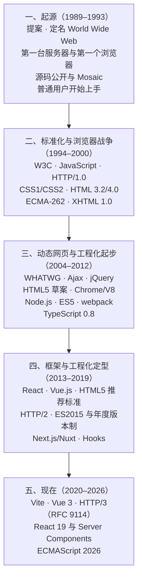

# 技术演进时间线：从 1989 到现在

> 一句话：这张表不是为了背年份，而是为了让每一次「为什么现在是这样」都有出处可查——**每条都标了来源级别，凡有冲突的冲突照写，不挑好看的那个。**
> 用法：① 教师在各模块第 0 节引用对应行；② 学生在 M1 溯源练习里从"存疑"行里挑一条自己查；③ 凡本表标【二手】的内容，课堂上不得当作确定事实讲授。

## 一、怎么读这张表

> **本文的范围**：只覆盖**浏览器与标准**这条线（提案 → 浏览器 → 规范 → 框架）。**服务端动态网页**（SSI/CGI/PHP/Classic ASP/JSP/ColdFusion 与各自后代）与**工程化·类型**（Node、npm、模块化、打包器、TypeScript、元框架、静态回归）两条线见 [[14-技术脉络 从静态页到前端工程]]，该文逐条标【一手/二手/存疑】并给出可点出处。

| 标记 | 含义 | 使用限制 |
|---|---|---|
| **【一手】** | 规范原文页（W3C 推荐标准页、RFC、Ecma 公告）或标准组织官方历史页 | 可直接作为判据引用 |
| **【二手】** | 百科、媒体报道、厂商博客、回忆性材料 | 只能作为线索；讲授时须说明"这是二手来源" |
| **【存疑】** | 不同来源之间日期/事实冲突，或仅见于回忆性材料 | **必须照写冲突**，不得单方面选定 |

> **图 1**：五个阶段的一句话演进（阶段名与年份范围均取自本表第二～六节，逐字一致；图改纵向排布，自上而下即时间先后），每段只列该阶段的关键词。
> **看图要点**：图的用途是「定位」而不是「背年份」——先看清某条事实落在哪一段，再回表里查它的【一手】【二手】【存疑】级别。**这五个阶段的分段方式是课程组的教学编排判断**（见第九节），任何官方文档都没有这样划分。

## 二、起源（1989–1993）

| 时间 | 事件 | 级别 | 来源 |
|---|---|---|---|
| 1989-03 | Tim Berners-Lee 在 CERN 提交《Information Management: A Proposal》，提出分布式超文本方案 | 【一手】 | [W3C 历史档案：1989 年提案原文](https://www.w3.org/History/1989/proposal-msw.html) |
| 1989-03-12 | 提案的具体提交日 | 【存疑】 | 该提案原文**只写 "March 1989"**；具体到 12 日的说法出自后来的回忆性材料。**课堂上用这一条做"回忆性材料与原始文件不一致"的案例** |
| 1990-05 | 提案重新分发征求意见，后与 Robert Cailliau 合作改写 | 【二手】 | 万维网起源的公开史料页 |
| 1990-11 | 项目正式定名 World Wide Web，代号 W3 | 【二手】 | 同上 |
| 1990-12 | 第一台 Web 服务器（CERN httpd）与第一个浏览器（WorldWideWeb，同时是编辑器）完成；首个网页发布 | 【二手】 | CERN 官方历史栏目（worldwideweb.cern.ch/history） |
| 1991-08 | 项目摘要在新闻组 alt.hypertext 公开，Web 走出 CERN | 【二手】 | CERN 官方历史栏目（其中一种说法记为 1991-08-06） |
| 1993 | 浏览器源码公开，Mosaic 出现（图形化浏览器使普通用户能上手） | 【二手】 | 万维网起源的公开史料页 |

**教学用途**：M1 第 3.1 节。要点是"互联网先于万维网，万维网是一个应用"，以及"第一版浏览器兼编辑器"这个常被忽略的事实。

## 三、标准化与浏览器战争（1994–2000）

| 时间 | 事件 | 级别 | 来源 |
|---|---|---|---|
| 1994-10 | Tim Berners-Lee 在 MIT/LCS 与 CERN 合作下创立 W3C（获 DARPA 与欧盟委员会支持） | 【一手】 | [W3C 官方历史页](https://www.w3.org/about/history/) · [W3C 成立公告](https://www.w3.org/news/1994/world-wide-web-consortium-w3c-founded/) |
| 1995 | JavaScript 由 Brendan Eich 在网景用极短时间做出原型，曾名 Mocha / LiveScript，为营销改名，与 Java 无语言血缘；同年微软推出 JScript，造成实现分裂 | 【二手】 | 主要来自 Eich 本人的公开讲述（回忆性材料）与公开史料 |
| 1996-05 | HTTP/1.0 发布为 RFC 1945（Informational，非标准轨） | 【一手】 | [RFC 1945（HTTP/1.0）官方页](https://www.rfc-editor.org/info/rfc1945/) |
| 1996-12-17 | CSS1 成为 W3C 推荐标准 | 【一手】 | [W3C 推荐标准：CSS1](https://www.w3.org/TR/REC-CSS1) |
| 1997-01 | HTML 3.2 成为 W3C 推荐标准 | 【二手】 | 美国国会图书馆格式描述页（loc.gov） |
| 1997-01 | HTTP/1.1 发布为 RFC 2068（Standards Track） | 【一手】 | [RFC 2068（HTTP/1.1）官方页](https://www.rfc-editor.org/rfc/rfc2068.html) |
| 1997-06 | ECMA-262 第 1 版通过（JavaScript 的第一次正式标准化） | 【一手】 | [ECMA-262 规范引言](https://262.ecma-international.org/) |
| 1997-12-18 | HTML 4.0 成为 W3C 推荐标准（1998-04 有修订版） | 【一手】 | [W3C 推荐标准：HTML 4.0](https://w3.org/TR/REC-html40-971218) |
| 1998-05-12 | CSS2 成为 W3C 推荐标准 | 【一手】 | [W3C 推荐标准：CSS2](https://www.w3.org/TR/1998/REC-CSS2-19980512) |
| 1998 | DOM Level 1 成为 W3C 推荐标准，DOM 从此有标准可依 | 【二手】 | 公开史料（本轮未核到推荐标准页原文，引用时须现查） |
| 1999 | ECMA-262 第 3 版；HTML 4.01 取代 HTML 4.0 | 【二手】 | ECMA-262 引言（第 3 版）/ 国会图书馆格式描述页 |
| 1999 | CSS 工作转为 **模块化** 推进（CSS3 由此不再是一个整体规范） | 【二手】 | W3C CSS 工作组的公开说明 |
| 2000-01-26 | XHTML 1.0 成为 W3C 推荐标准（把 HTML 4 重新表述为 XML 应用，要求严格合法） | 【一手】 | [W3C 推荐标准：XHTML 1.0](https://www.w3.org/TR/2000/REC-xhtml1-20000126) |

**教学用途**：M1 第 3.2 节（三次教训之一：浏览器战争与私有扩展）。要害是"没有标准的成本会转移到每个开发者身上"，jQuery（2006-01-14 发布）就是这段历史的产物。

## 四、动态网页与工程化起步（2004–2012）

| 时间 | 事件 | 级别 | 来源 |
|---|---|---|---|
| 2004 | 多家浏览器厂商成立 WHATWG，转向"先实现、后标准化、持续更新"的 Living Standard 路线 | 【二手】 | WHATWG 官方站点与公开史料（本轮未核到其自述的一手页面） |
| 2005-02-18 | "Ajax" 一词由 Jesse James Garrett 提出（Asynchronous JavaScript + XML），描述 Google Maps / Google Suggest 那类交互模式 | 【一手】 | 作者本人 20 年后回顾文（自述该文写于 2005-02-18）：[原文](https://jessejamesgarrett.com/2025/02/18/ajax-at-20) |
| 2006-01-14 | jQuery 于 BarCamp NYC 发布，用来抹平浏览器差异 | 【一手】 | [jQuery 官方历史页](https://jquery.com/history) |
| 2008-01-22 | HTML5 首个 W3C 公开工作草案 | 【二手】 | 公开史料（引用时须现查 W3C 草案页） |
| 2008-09-02 | Chrome 首个公开版本发布（Windows 测试版），同一天 V8 引擎以开源形式发布；稳定版为同年 12-11 | 【二手】 | 公开史料与厂商资料（V8 与 Chrome 同日发布这一点多个来源一致） |
| 2009 | Node.js 出现，JavaScript 得以脱离浏览器运行 | 【二手】 | 公开史料（本轮未核到一手发布页） |
| 2009-12 | ECMA-262 第 5 版通过（带来严格模式与 JSON 等） | 【一手】 | [ECMA-262 规范引言](https://262.ecma-international.org/) |
| 2011 | CSS Grid 的完整草案由微软团队提出，并在 IE10 里以 `-ms-` 前缀实现（比主流普及早了好几年） | 【二手】 | 公开史料（CSS Grid 条目） |
| 2012-03 | webpack 发布，模块打包成为前端标准工具链的一环 | 【二手】 | 公开史料 |
| 2012-10-01 | TypeScript 公开 0.8 版（微软，Anders Hejlsberg 主导） | 【二手】 | 公开史料与厂商资料 |
| 2012-12-17 | HTML5 进入 W3C 候选推荐（Candidate Recommendation） | 【二手】 | 公开史料 |

**教学用途**：M4 第 0 节（JS 的年度版本制前夜）、M6 第 0 节（工程化为什么会出现）。

## 五、框架与工程化定型（2013–2019）

| 时间 | 事件 | 级别 | 来源 |
|---|---|---|---|
| 2013-05-29 | React 以 0.3.0 在 JSConf US 首次公开（当时 JSX 遭到大量质疑，"模板应当与逻辑分离"是主流观点） | 【二手】 | 公开史料与会议资料（多个来源一致） |
| 2014-02 | Vue.js 由 Evan You 发布（汲取 AngularJS 经验、追求轻量与渐进式） | 【二手】 | 公开史料 |
| 2014-10-28 | **HTML5 成为 W3C 推荐标准**（Bringing the spec process to completion） | 【一手】 | [W3C 推荐标准：HTML5](https://www.w3.org/TR/2014/REC-html5-20141028) |
| 2015-05 | HTTP/2 发布为 RFC 7540（后由 RFC 9113 取代） | 【一手】 | [RFC 7540（HTTP/2）官方页](https://www.rfc-editor.org/rfc/rfc7540.html) |
| 2015-06-17 | **ES2015（ECMA-262 第 6 版）通过**：模块、class、词法作用域、Promise、解构等；此后改为**年度版本制** | 【一手】 | [Ecma 国际公告：ECMA-262 第 6 版](https://ecma-international.org/news/at-the-june-17-2015-ecma-general-assembly-in-montreux-ecma-262-6th-edition-ecmascript-2015-language-specification-and-ecma-402-2nd-edition-ecmascript-2015-internationalization-api-ha) |
| 2015 年及以后 | ES6 模块在浏览器中逐步获得支持 | 【二手】 | 公开史料（浏览器支持时间线） |
| 2016 | Next.js 与 Nuxt 出现，React / Vue 各自的元框架成型 | 【二手】 | 公开史料 |
| 2017-03 起 | Chrome / Firefox / Safari 相继默认支持 CSS Grid；2017-10 时四大浏览器均已无需前缀 | 【二手】 | 公开史料（CSS Grid 条目） |
| 2019-02 | React Hooks 引入（函数组件成为主流写法） | 【二手】 | 公开史料 |
| 2019-05-28 | W3C 与 WHATWG 签署备忘录：HTML 的权威版本归 WHATWG Living Standard，W3C 出周期性快照 | 【二手】 | W3C 与 WHATWG 的公开公告（引用时须现查原文） |

**教学用途**：M3 第 0 节（Grid 是"浏览器都支持了、规范状态却仍在候选"的活案例）、M7 第 0 节（框架史与 JSX 之争）、M2 第 0 节（XHTML 受挫到 Living Standard）。

## 六、现在（2020–2026）

| 时间 | 事件 | 级别 | 来源 |
|---|---|---|---|
| 2020-02 | Vite 由 Evan You 等人发布；开发期用原生 ESM 不做打包，生产期才打包 | 【二手】 | 公开史料 |
| 2020-09 | Vue 3 发布（Composition API 成为主流写法） | 【二手】 | 公开史料 |
| 2022-06 | HTTP/2 新版规范 RFC 9113（取代 RFC 7540）；**HTTP/3 发布为 RFC 9114**（基于 QUIC） | 【一手】 | [RFC 9114（HTTP/3）官方页](https://www.rfc-editor.org/rfc/rfc9114.html) |
| 2024-12 | React 19 发布，Server Components 稳定 | 【二手】 | 公开史料 |
| 2026-06 | ECMAScript 2026（ECMA-262 第 17 版）发布，年度快照制延续 | 【一手】 | [Ecma 国际 ECMA-262 规范页](https://262.ecma-international.org/) |
| 2026-10-01 | **本课程使用的版本口径**（实测 [npm registry](https://registry.npmjs.org/) `latest`，非网络文章转述） | 【一手】 | 见 [[00-课程大纲]] 第十二节版本口径 |

## 七、两个用作教学案例的来源冲突

课堂上一律照写冲突，不替学生选一个：

1. **1989 年提案的具体日期**：原始文件只写 "March 1989"；"3 月 12 日"出自后来的回忆性材料。→ 教训：**原始文件优先于回忆**；引"某一天"比引"某月"风险大得多。
2. **TypeScript 1.0 的发布日期**：公开来源分别给出 4 月 2 日与 4 月 12 日两个日期。→ 教训：同一个事实有多个二手版本时，要么找到一手发布说明，要么**照写两个来源并说明不一致**，不要各自取一个数字。本表因此在该条目上只写年份。

## 八、待核清单（下轮备课要补的一手来源）

| 条目 | 缺什么 | 补齐方法 |
|---|---|---|
| DOM Level 1（1998） | W3C 推荐标准页原文链接 | 在 [w3.org/TR](https://www.w3.org/TR/) 里现查 1998 年的 DOM 推荐标准页 |
| WHATWG 成立（2004） | 组织自述的一手页面 | WHATWG 官方站点的关于页 |
| Node.js（2009） | 一手发布说明 | [Node.js](https://nodejs.org/zh-cn) 官方版本的发布说明或博客存档 |
| 浏览器默认支持 CSS Grid（2017-03） | 各浏览器官方发布说明 | 查各浏览器对应版本的官方发布公告 |
| W3C 与 WHATWG 备忘录（2019-05-28） | 备忘录原文页 | 两个组织站点上的公告原文 |
| Next.js / Nuxt 首版（2016） | 一手发布说明 | 项目官方博客存档 |

## 九、依据说明（重要）

- **本表凡标【一手】的条目，本轮均打开过来源页或读到其原文内容**（W3C 推荐标准页、RFC 页、Ecma 公告与规范引言、W3C 官方历史页）；标【二手】的条目来自百科、媒体报道或厂商博客，**只能作线索**；标【存疑】的条目存在来源冲突，照写冲突。
- **本表无官方依据的部分**：把时间线切成"起源 / 标准化 / 工程化 / 框架 / 现在"五个阶段的**分段方式**，以及每条后面"教学用途"指向哪个模块，都是课程组的教学编排判断，**没有任何官方文档这样划分**。
- **本表刻意不写的**：未来的技术走向预测；未见于可核查来源的人名、论文名、会议名；任何"某年某技术取代某技术"式的断言（技术不会在某一年被取代，只会在一段时间里此消彼长）。
- **引用纪律**：任何人在讲义、教案、学生作业里引用本表【二手】或【存疑】条目时，必须同时说明来源级别；标【一手】的条目也建议写明访问日期——规范页面的状态字段会变。

---

相关：[[00-课程大纲]] · 各模块教案第 0 节 · M1 第 3.8 节的溯源练习
