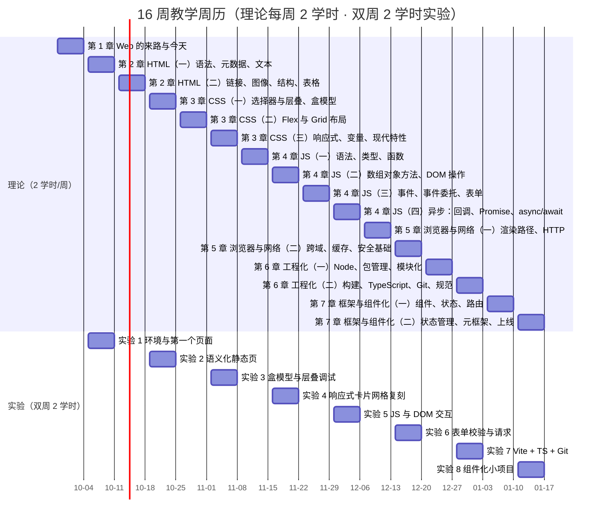

# 教学日历（16 周）与课堂开场钩子

> **并入说明**：本文件的「教学日历」与「开场钩子」原属另一套 48 学时《Web 网页技术》材料，内容与 [[00-课程大纲]] 的模块体系不冲突，故整段并入。
> **二者关系**：本日历 = [[00-课程大纲#五、四种拼法（按实际学时裁剪）]]「48 学时拼法」的具体落地排期（每周 2 学时理论 + 双周 2 学时实验 = 32 + 16 = 48）。
> **使用前先核范围**：本日历只覆盖到 M7；排 96 学时的完整版时，M8–M10 需按同一节奏自行续排。

## 一、教学日历（16 教学周）

> **章号对照**：下表「第 N 章」是原 48 学时版本的章号，与本课程模块的对应关系为 **第 1–7 章 ↔ M1–M7**（M8–M10 不在 48 学时版覆盖范围内，故本日历也不含）。

| 周次 | 理论（2 学时/周） | 实验（双周，2 学时） | 本周末应交 |
|---|---|---|---|
| 1 | 第 1 章 Web 的来路与今天 | — | 环境检查表 |
| 2 | 第 2 章 HTML（一）语法、元数据、文本 | 实验 1 环境与第一个页面 | 实验 1 报告 |
| 3 | 第 2 章 HTML（二）链接、图像、结构、表格 | — | 静态页骨架 |
| 4 | 第 3 章 CSS（一）选择器与层叠、盒模型 | 实验 2 语义化静态页 | 实验 2 报告 |
| 5 | 第 3 章 CSS（二）Flex 与 Grid 布局 | — | 布局练习 2 题 |
| 6 | 第 3 章 CSS（三）响应式、变量、现代特性 | 实验 3 盒模型与层叠调试 | 实验 3 报告 |
| 7 | 第 4 章 JS（一）语法、类型、函数 | — | 编程题 1 组 |
| 8 | 第 4 章 JS（二）数组对象方法、DOM 操作 | 实验 4 响应式卡片网格复刻 | 实验 4 报告 |
| 9 | 第 4 章 JS（三）事件、事件委托、表单 | — | 编程题 2 组 |
| 10 | 第 4 章 JS（四）异步：回调、Promise、async/await | 实验 5 JS 与 DOM 交互 | 实验 5 报告 |
| 11 | 第 5 章 浏览器与网络（一）渲染路径、HTTP | — | 简答题 |
| 12 | 第 5 章 浏览器与网络（二）跨域、缓存、安全基础 | 实验 6 表单校验与请求 | 实验 6 报告 |
| 13 | 第 6 章 工程化（一）Node、包管理、模块化 | — | 工程搭建截图 |
| 14 | 第 6 章 工程化（二）构建、TypeScript、Git、规范 | 实验 7 Vite + TS + Git | 实验 7 报告 |
| 15 | 第 7 章 框架与组件化（一）组件、状态、路由 | — | 组件拆分设计 |
| 16 | 第 7 章 框架与组件化（二）状态管理、元框架、上线 | 实验 8 组件化小项目 | 实验 8 报告 + 作品源码 |
| 17 | （机动 / 答辩周，**不计入 48 学时**） | 作品答辩 | 课程设计报告 |

> **编号口径（重要）**：本表的**周次与「实验 1–8」编号均为旧版 48 学时口径**，与课程现行的 [[15-实验与大作业指导]]「实验一~八」（按 M2–M9 编号、含各自「对应模块」列）**不是同一套编号**，两套并存时一律以 15 的实验总表为准。二者的对应关系须经「模块」中转：本表第 1–7 章 ↔ M1–M7（见上「章号对照」），15 的实验一~八按「对应模块」列归口到 M2–M9；详见 [[15-实验与大作业指导#实验总表]]。

> 实验 8 完成后进入**课程设计**；任务要求、提交物与评分量规见 [[15-实验与大作业指导#第二部分 · 课程项目（大作业）]] 与 [[13-考核方案与评分量规#四、课程项目量规]]。
> **周历与学时的自校验**（每学期开学前照此核一遍，口径以 [[00-课程大纲]] 为准）：理论 16 周 × 2 = **32**；实验 8 次 × 2 = **16**；合计 **48** ✓；第 17 周为考核/答辩周，不计入学时。

> **图 1**：16 教学周的周历日期轴——理论每周 2 学时（第 1–16 周），实验每双周 2 学时（第 2、4、6、8、10、12、14、16 周，共 8 次）。
>
> **看图要点**：周次按第 N 周自 2026-09-28 起算（第 1 周含本学期起始日 2026-10-01），第 16 周结束于 2027-01-17；理论 16 周 × 2 = 32 学时、实验 8 次 × 2 = 16 学时，合计 48 学时；实验 8 完成后进入课程设计（见 [[15-实验与大作业指导#第二部分 · 课程项目（大作业）]]）；第 17 周为机动/答辩周，**不计入 48 学时**。

---

## 二、课堂开场钩子清单（每章 1 分钟，补「喜闻乐见」用）

| 章 | 开场动作 / 提问 | 学生反应（预期） |
|---|---|---|
| 1 | 打开 `info.cern.ch`，问"这是世界上第一个网站，它和你们昨天刷的短视频页面，是同一门技术做的吗？" | 惊讶：原来差这么多，又是同一套东西 |
| 2 | 把一段 `
文字
块
文字
` 写进页面，当场开 Elements 面板让学生看浏览器"擅自"改成了什么样（`F12` → **Elements**；或 `Ctrl+Shift+C` 直接点选；改 HTML 按 `F2`） | "我写的和它理解的不一样" |
| 3 | 现场改一个按钮的 `width` 与 `transform` 做同一个动画，用 Performance 面板对比（`F12` → **Performance** → 勾 **Screenshots** → `Ctrl+E` 开始/停止录制） | 看到 Layout 那条柱状图差了十倍 |
| 4 | 先给一段"看起来正常"的代码，点一下按钮报 `Cannot read properties of null`，然后**只加 `defer` 一个字**修好（报错原文在 Console 看：`Ctrl+Shift+J`；断点在 **Sources** 设，`F8` 继续 / `F10` 跳过 / `F11` 进入 / `Shift+F11` 跳出） | "就这么简单？为什么？" |
| 5 | 在**本地自建页面或本地靶场**（如 OWASP Juice Shop）里演示"用户输入被当成代码执行"的现象：输入一段带事件属性的内容，当场触发（**具体串不在材料里给出**，教师课前在本地备好；原理见 [[22-前端安全专章（OWASP × ATT&CK）]] §3.1） | 一片"哇"，然后主动想学怎么防 |
| 6 | 现场 `git rm -r --cached node_modules` 演示把 2 万个文件从仓库里踢掉（在 Git Bash 里对真实仓库执行；写 `.gitignore` 后用 `git status` 复核，参考 [Pro Git](https://git-scm.com/book/zh/v2)） | 对"什么该提交"有具象印象 |
| 7 | 现场把一个列表的 `key` 从 `id` 改成索引，删除第一项，让输入框内容错位（`F12` → **Elements** 看节点是否被复用；装 React DevTools 扩展可看组件状态） | "这也太隐蔽了" |

> **安全演示的边界（第 5 章钩子适用）**：涉及"输入被当作代码执行"的演示**只在本机靶场或自建页面上做**，不得对任何未授权站点演示；课堂截图与录像不得包含可直接复制的攻击串。相关法律边界（《网络安全法》第二十九条、《刑法》第二百八十五条等）见 [[22-前端安全专章（OWASP × ATT&CK）]] §9。

> **使用建议**：钩子不要超过 1 分钟，**点到即止**，然后立刻进入正课。钩子是用来制造"我想知道为什么"的，不是用来娱乐的。

> **面板与快捷键（钩子里用到的都在这里）**：Elements / Console / Performance / Network / Sources 各面板的打开方式与全部快捷键见 [Chrome DevTools 文档](https://developer.chrome.com/docs/devtools/) 与 [DevTools 键盘快捷键](https://developer.chrome.com/docs/devtools/shortcuts)；库内另有全可点速查 [[21-操作与资料速查（全可点）]]（含 Network 面板五步、三种起服务命令）。

---

## 三、依据说明

| 内容 | 性质 |
|---|---|
| 第 1–7 章日历的周次与学时分配、开场钩子清单 | **属教学编排判断，官方材料无此规定**——官方文档不规定怎么排课、怎么开场 |
| 词条的章号↔模块号对照 | 属课程组的编排换算；两套材料的知识点本身按 M1–M10 归口，以 [[00-课程大纲]] 为准 |
| 各章引用的事实性内容 | 出处见各模块教案 §9 与 [[16-技术演进时间线]] |
| 钩子的使用纪律（不超过 1 分钟、点到即止） | 属教学编排判断 |

上一个：[[00-课程大纲]] · 相关：[[18-教案补充 教学准备·板书设计·课程思政]] · [[20-材料审核报告]]
