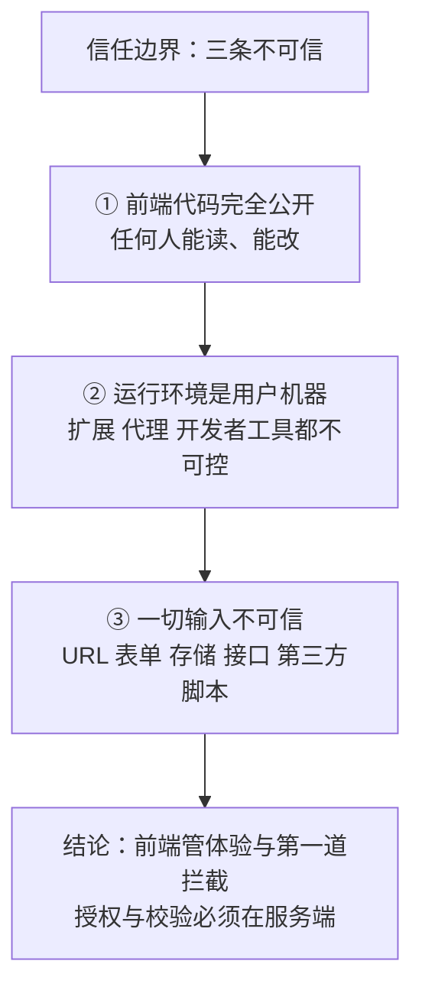
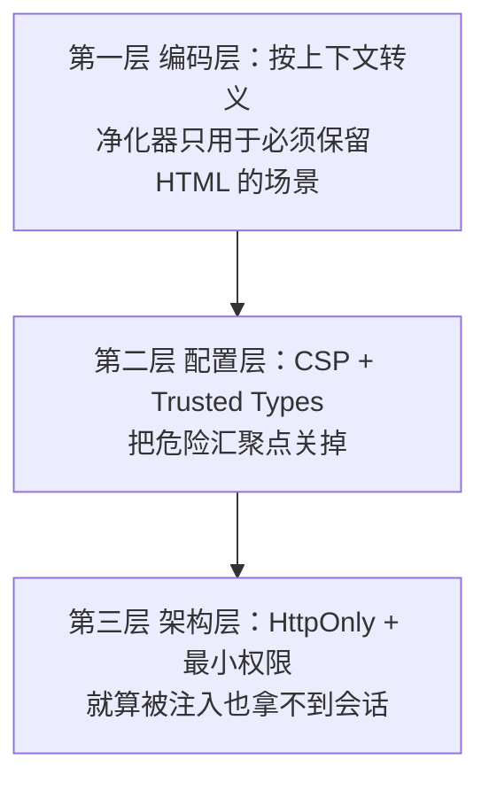
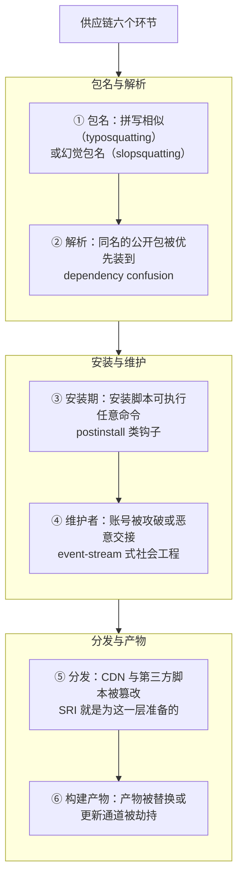
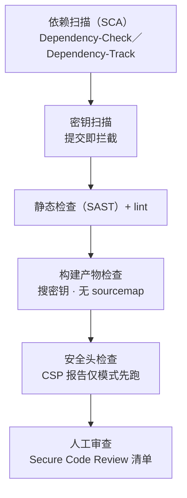

# 前端安全专章（OWASP × ATT&CK）

> **给谁看**：学完 M1–M5 的学生（能读 HTML/CSS/JS、知道同源策略）；以及**网络安全方向**的学生——本专章按"攻击者会怎么用"的读法组织，但**只讲机制与防御，不提供任何可直接使用的攻击载荷或绕过步骤**。
> **怎么用**：§1–§2 打地基（信任边界 + 框架），§3–§7 是可插入 M5／M6／M8／M9／M10 的分类防御，§8 把安全接进开发流程，§9 是**法律与伦理边界**（必读），§10 给教师，§11 自测。
> **一句话立场**：**前端的三个保护对象是「用户的数据与设备」「用户的会话」「你的服务端」——不是你的前端代码**（代码本来就是公开的）。

**图 1** —— 前端安全的三条"不可信"与一条结论。
这张图在说什么：**只要有一处你把不可信的东西当成可信的（尤其是"前端已经校验过了"），后面所有防御都会漏**。

## 1. 认知起点：三个反直觉问题的正面回答

### 1.1 "前端代码全公开，那还谈什么安全？"

**保护对象不是代码，而是代码能碰到的东西。** 你的 JS 在用户的浏览器里跑，它能读页面上的一切、能发请求带上用户的 cookie、能访问浏览器存储。所以攻击者一旦能让**你的代码之外的东西**混进来（一段被注入的脚本、一个被投毒的依赖），它就在"你的"页面里以"你的"身份行动。前端安全的全部工作就是回答两件事：**别让不该进来的东西进来**；**进来了也别让它拿到会话与数据**。

### 1.2 "我把按钮隐藏了，为什么说这不是权限控制？"

判断标准只有一句话：**这个请求换一个客户端发过来，服务端还认不认？** 服务端不校验身份与权限，前端藏得再深（隐藏按钮、前端路由守卫、`disabled` 属性）都只是**体验优化**。这也是 OWASP 长期把**失效的访问控制**排在第一位的含义：问题不在前端画得多好，而在服务端有没有每次校验。

### 1.3 "CSP 和输出转义，到底谁管谁？"

**两者防的不是同一件事**：**转义/净化管"数据被当成代码"**（数据不能变成可执行的东西）；**CSP 管"代码从哪来"**（就算是代码，也不许来自不该来的地方）。少了任何一层都有洞：只转义不上 CSP，一次转义疏漏就是完全失守；只上 CSP 不转义，遇到允许来源被攻破或被绕过的写法仍然失守。材料里那句"CSP 不能替代输出转义"就是这个道理——**它们是两条独立的防线，不是一条防线的两个档次**。

## 2. 框架：谁管哪一层（这一节解决"还有哪些我没防"）

安全圈有多个框架，它们**不在同一层**，混用会得出错误结论。记这张表就够：

| 框架 | 它回答的问题 | 层次 | 本专章用法 |
|---|---|---|---|
| **OWASP Top 10** | 最常被利用的**风险类别**有哪些（按普遍性排序） | 风险分类（含统计） | §3–§7 的分类骨架 |
| **OWASP Proactive Controls 2024** | **开发者**该主动做哪十件事 | 正向做法（C1–C10） | §8 的流程骨架 |
| **OWASP ASVS 5.0.0** | 应该**验证到**什么程度（可核验要求清单） | 验收标准 | §8 的上线自检 |
| **OWASP WSTG** | 具体怎么**测**（含 15 项客户端测试） | 测试方法 | §8 的测试清单 |
| **MITRE CWE** | 这是**哪一类代码缺陷**（CWE-79／352／1321…） | 缺陷分类 | 每条漏洞的"学名" |
| **MITRE ATT&CK** | 攻击者**用它来做什么行为**（技巧/战术） | 对手行为 | §3–§7 的"攻击者视角"列 |

### 2.1 OWASP Top 10：2025 与 2021 的对照（**2025 版已正式发布**）

| 2021 | 2025 | 说明 |
|---|---|---|
| A01:2021 Broken Access Control | **A01:2025 Broken Access Control** | 连续第一 |
| A05:2021 Security Misconfiguration | **A02:2025 Security Misconfiguration** | 大幅上升 |
| A06:2021 Vulnerable and Outdated Components | **A03:2025 Software Supply Chain Failures** | **从"组件过期"升级为整条供应链**——这正是本专章 §6 的由来 |
| A02:2021 Cryptographic Failures | A04:2025 Cryptographic Failures | |
| A03:2021 Injection | A05:2025 Injection | XSS 属这一类 |
| A04:2021 Insecure Design | A06:2025 Insecure Design | |
| A07:2021 Identification and Authentication Failures | A07:2025 Authentication Failures | |
| A08:2021 Software and Data Integrity Failures | A08:2025 Software or Data Integrity Failures | 对应在前端就是 SRI／lockfile |
| A09:2021 Security Logging and Monitoring Failures | A09:2025 Security Logging and Alerting Failures | |
| A10:2021 Server Side Request Forgery (SSRF) | **A10:2025 Mishandling of Exceptional Conditions** | 新增：异常处理不当（含失败信息泄露、错误状态处理） |

> 出处：[OWASP Top 10 项目页](https://owasp.org/www-project-top-ten/) ｜ [Top 10:2025 清单](https://owasp.org/Top10/2025/) ｜ [Top 10:2021 清单](https://owasp.org/Top10/2021/)。**两版并存**：2021 仍是大量企业合规的现行引用版本，写简历与做评估时说清版本。

### 2.2 ATT&CK：怎么用，以及**它的边界**

ATT&CK 当前为 **v19.2**（v19 主版本 2026-04，v19.2 敏捷版本 2026-08-06）【版本页与更新页对 v19.2 起始日表述不一致，此处照写冲突】。v19 起企业矩阵把原来的 **Defense Evasion 拆成 Stealth（TA0005）与新增的 Defense Impairment（TA0112）**，企业战术总数为 15 条。

**怎么把前端问题映射上去**（每类都标出所属战术）：

| 前端常见问题 | 对应的对手行为（ATT&CK） | 战术 |
|---|---|---|
| 注入类漏洞被利用 | [T1190 利用公开面向的应用程序](https://attack.mitre.org/techniques/T1190/) | Initial Access |
| 用户"只是访问了一个网页"就中招 | [T1189 偷渡式入侵](https://attack.mitre.org/techniques/T1189/) | Initial Access |
| 依赖／开发工具被投毒 | [T1195.001 供应链侵害：软件依赖与开发工具](https://attack.mitre.org/techniques/T1195/001/) | Initial Access |
| 应用本体或更新通道被篡改 | [T1195.002 供应链侵害：软件供应链](https://attack.mitre.org/techniques/T1195/002/) | Initial Access |
| 恶意 JS 被执行（浏览器或宿主环境） | [T1059.007 命令与脚本解释器：JavaScript](https://attack.mitre.org/techniques/T1059/007/) | Execution |
| 服务器上被留下可复用的组件 | [T1505.003 服务器软件组件：Web Shell](https://attack.mitre.org/techniques/T1505/003/) | Persistence |
| 会话 cookie 被窃取（注入脚本或恶意代理） | [T1539 窃取 Web 会话 Cookie](https://attack.mitre.org/techniques/T1539/) | Credential Access |
| 反向代理钓鱼中继真实站点 | [T1557 中间人](https://attack.mitre.org/techniques/T1557/) | Credential Access / Collection |
| 登录页前端脚本被篡改以捕获凭据 | [T1056.003 输入捕获：Web 门户捕获](https://attack.mitre.org/techniques/T1056/003/) | Collection / Credential Access |
| 浏览器会话被接管 | [T1185 浏览器会话劫持](https://attack.mitre.org/techniques/T1185/) | Collection |
| 克隆/伪造登录站捕获 MFA 令牌 | [T1111 多因素认证拦截](https://attack.mitre.org/techniques/T1111/) | Credential Access |
| 把通信混进正常 Web 流量 | [T1071.001 应用层协议：Web 协议](https://attack.mitre.org/techniques/T1071/001/) | Command and Control |
| 数据外传到云存储 | [T1567.002 通过 Web 服务外泄：云存储](https://attack.mitre.org/techniques/T1567/002/) | Exfiltration |
| 前端侧隐藏/夹带（HTML 夹带、SVG 夹带、不可见 Unicode） | [T1027 混淆的文件或信息](https://attack.mitre.org/techniques/T1027/)（子技巧 .006／.017／.018） | Stealth |
| 应用层洪泛打垮服务 | [T1499 端点拒绝服务](https://attack.mitre.org/techniques/T1499/)（.003 应用层耗尽） | Impact |

**边界（教材必须写清，不许硬套）**：

1. **ATT&CK 不是漏洞清单**。官方在《Get Started》里明确："**ATT&CK 矩阵只记录已观测到的真实对手行为**"（"the ATT&CK matrix only documents observed real-world behaviors"），并把 Tactics 定义为"**为什么**"、Techniques 定义为"**怎么做**"。
2. 因此 **XSS、CSRF 这类"代码缺陷"本身在 ATT&CK 里没有对应条目**——承载它们是 **CWE**（如 [CWE-79 XSS](https://cwe.mitre.org/data/definitions/79.html)、[CWE-352 CSRF](https://cwe.mitre.org/data/definitions/352.html)）。ATT&CK 承载的是**这些缺陷被利用后，攻击者做了什么行为**（如表中的 T1189／T1539／T1056.003）。
3. **这一点 ATT&CK 官方自己也承认**：T1190 页面正文直接写"对于网站与数据库，**OWASP Top 10 与 CWE Top 25** 列出了最常见的 Web 漏洞"——**官方就是让你去用 OWASP 与 CWE 补漏洞这一层**。
4. 官方未逐字声明"ATT&CK 不覆盖前端编码缺陷"，上述第 2 条属**分析判断**（依据是官方对 Tactics/Techniques 的定义与 T1190 页面那句指引），**教材里按此标注**。

> 出处：[ATT&CK 当前版本](https://attack.mitre.org/resources/versions/) ｜ [企业战术列表](https://attack.mitre.org/tactics/enterprise/) ｜ [Get Started（用法与"不该怎么用"）](https://attack.mitre.org/resources/) ｜ [T1190](https://attack.mitre.org/techniques/T1190/)

## 3. 注入类：数据被当成代码

**共同的病根**：**同一串字符，在一个位置是数据，在另一个位置是代码**。防御的通用动作是"按所处上下文做对应的转义/净化"，而不是"过滤掉危险字符"。

### 3.1 XSS 的四种形态（不是一种）

| 形态 | 注入点在哪 | 前端能修的？ | 关键事实 |
|---|---|---|---|
| **反射型** | 服务端把请求参数直接拼进 HTML | 否（服务端） | 链接一点就触发 |
| **存储型** | 服务端把用户内容存库后原样输出 | 否（服务端） | 影响所有看到该内容的用户，危害最大 |
| **DOM 型** | **纯前端**：JS 把不可信数据写进"危险汇聚点"（`innerHTML`、`document.write`、`eval`、`location` 直赋 等） | **是** | CWE 把这一类称为 DOM-Based XSS／Type 0 XSS |
| **变异型（mXSS）** | 经过"清洗"后再被浏览器解析时发生突变，绕过净化器 | 是（用经过考验的净化器） | 说明**自己写"过滤"几乎必然出洞** |

**常见误解 → 正确理解 → 反例**

- 误解："框架默认转义，所以我安全。" → 正确：框架**插值**安全，但每个框架都有"原样输出"的口子（`v-html`、`dangerouslySetInnerHTML`），一旦用了就回到手工防御。**反例**：搜索关键词高亮功能通常需要插 HTML，这里最容易出洞。
- 误解："把 `<script>` 过滤掉就行。" → 正确：注入不只有 script 标签、也不只有 HTML 上下文。**反例**：属性上下文、URL 上下文（`href="javascript:…"`）、CSS 上下文、JS 上下文字符串拼接各有各的逃逸方式。
- 误解："`innerHTML` 会执行脚本，所以它一定会被拦。" → 正确：`innerHTML` **不执行**新插入的 script 标签，但**会**执行事件属性与 CSS 里的某些表达式类写法。**别把"某个具体行为没触发"当成"这条路是安全的"**。

### 3.2 同族的另外几种（前端特有，容易被忽略）

| 漏洞类 | 一句话机制 | 学名 | 防御 |
|---|---|---|---|
| **DOM clobbering** | 攻击者用带 `id`／`name` 的 HTML 元素**覆盖**页面脚本依赖的全局变量或 DOM 引用，让后续逻辑走错分支 | [OWASP DOM Clobbering 防护](https://cheatsheetseries.owasp.org/cheatsheets/DOM_Clobbering_Prevention_Cheat_Sheet.html) | 不用裸全局名取元素；用 `document.getElementById`／显式保存引用；净化时限制 `id`／`name` |
| **原型污染** | 攻击者通过可控输入改到 `Object.prototype` 等原型上，之后**每一次属性读取**都可能被影响 | [CWE-1321](https://cwe.mitre.org/data/definitions/1321.html)（官方注明适用平台为 JavaScript）／[OWASP 防护](https://cheatsheetseries.owasp.org/cheatsheets/Prototype_Pollution_Prevention_Cheat_Sheet.html) | 合并/反序列化时拒绝 `__proto__`、`constructor`、`prototype` 键；必要时 `Object.freeze(Object.prototype)` |
| **客户端模板注入** | 前端模板引擎把用户输入**当模板**编译 | WSTG 4.11.15 | 模板只来自开发者；输入永远走插值 |
| **HTML 注入 / CSS 注入** | 注入的不是脚本而是结构与样式（可做钓鱼式欺骗、界面覆盖） | WSTG 4.11.3／4.11.5 | 同上：按上下文转义；样式只允许受控值 |
| **开放重定向** | 把不可信目标塞进跳转参数，用你的域名把人送到别人的站点 | [CWE-601](https://cwe.mitre.org/data/definitions/601.html)／WSTG 4.11.4 | 目标地址用白名单；不要接受整串 URL |

### 3.3 防御三层（每一条漏洞都按这三层检查）

**图 2** —— 注入类的三层防御。
这张图在说什么：**三层各自独立**——任何一层都不许被当成"已经防住了"；第三层的意义是**承认第一层会失手**。

### 3.4 CSP 怎么"一步步"上（原文只讲了它是什么，这里讲怎么用）

1. **先只观察，不拦截**：用**仅报告模式**下发策略，让浏览器把违规上报到你的收集端点——**这是把 CSP 真正用起来的唯一入口**，直接上强制模式会因为历史内联脚本把站点打死。
2. **消掉内联脚本**：把内联脚本外置，或对必须保留的加 `nonce`／`hash`。
3. **收窄来源**：脚本、样式、连接、图片、框架各自的白名单**显式列出**，**禁止通配符**（宽松跨域白名单本身就是一类弱点：[CWE-942](https://cwe.mitre.org/data/definitions/942.html)）。
4. **再加护栏**：`frame-ancestors` 防点击劫持；`base-uri`／`form-action` 限制被注入后能做的事。
5. **最后关汇聚点**：用 **Trusted Types** 让 `innerHTML` 这类赋值**只接受受信任类型**，从根上把 DOM 型 XSS 的注入汇聚点关掉（规范：[W3C Trusted Types](https://www.w3.org/TR/trusted-types/)）。

> 出处：[W3C CSP Level 3](https://www.w3.org/TR/CSP3/) ｜ [OWASP CSP 防护速查](https://cheatsheetseries.owasp.org/cheatsheets/Content_Security_Policy_Cheat_Sheet.html) ｜ [OWASP XSS 防护速查](https://cheatsheetseries.owasp.org/cheatsheets/Cross_Site_Scripting_Prevention_Cheat_Sheet.html) ｜ [OWASP DOM 型 XSS 防护](https://cheatsheetseries.owasp.org/cheatsheets/DOM_based_XSS_Prevention_Cheat_Sheet.html) ｜ [W3C SRI](https://www.w3.org/TR/sri-2/)（第三方脚本用哈希校验，算法集 sha256／sha384／sha512）

## 4. 会话与身份：XSS 真正的"影响面"在这里

**为什么这一节要紧**：注入类漏洞最常被用来干的事，就是**偷会话**。反过来，会话设计得好，注入的损失面就小得多。

| 机制 | 真正的语义 | 边界（别把它当万灵药） |
|---|---|---|
| `HttpOnly` | 让**脚本读不到**该 cookie | 只保这一条 cookie；`localStorage`／`sessionStorage`／页面里的其它数据**一样能被读走**；也拦不住"以用户身份发请求" |
| `Secure` | 只在 HTTPS 下发送 | 不解决 XSS／CSRF，只解决明文信道 |
| `SameSite`（Strict／Lax／None） | 限制**跨站请求**是否携带 cookie，缓解 CSRF | **不是 CSRF 的完整解**：站内的 GET 副作用、同站子域、旧客户端行为都还在；官方立场也是"配合 CSRF 令牌等其它防御"（[RFC 6265bis 草案](https://datatracker.ietf.org/doc/draft-ietf-httpbis-rfc6265bis/)） |
| CSRF 令牌 + 校验 `Origin` | 让"被伪造的请求"缺一件东西 | 令牌放进 `localStorage` 由脚本读取，就会被 XSS 绕过；CWE 明确指出 CSRF 防御可被 XSS 绕过 |
| JWT 放哪里 | 放 `localStorage`：**XSS 直接读走**；放 `httpOnly` cookie：**自动携带故需 CSRF 防御** | 这是一道**取舍题**，没有免费选项；无论放哪都要考虑撤销与过期 |

**一句话结论**：**先想清楚"被注入之后，攻击者最多能拿到什么"**，再决定把什么放在哪里。

**为什么 passkey／FIDO2 能挡住反向代理钓鱼（AiTM）**：恶意反向代理（如 Evilginx 类工具）之所以能绕过一次性验证码，是因为它把**真实站点与受害者中继起来，顺手把会话 cookie 也收走**；而 WebAuthn 的凭据**与源（rpId）绑定、对挑战值签名**，中继站点的源对不上，凭据就不可被复用——这也是"抗钓鱼认证"的含义。
> 出处：[FIDO Alliance：passkey 与抗钓鱼（白皮书）](https://fidoalliance.org/white-paper-passkeys-the-journey-to-prevent-phishing-attacks/) ｜ [W3C WebAuthn Level 3](https://www.w3.org/TR/webauthn-3/) ｜ [OWASP 会话管理速查](https://cheatsheetseries.owasp.org/cheatsheets/Session_Management_Cheat_Sheet.html) ｜ [OWASP JWT 速查](https://cheatsheetseries.owasp.org/cheatsheets/JSON_Web_Token_Cheat_Sheet.html)

## 5. 跨站与界面欺骗：借"用户的浏览器"去干坏事

**这一族的共同特点**：攻击者不直接打你的服务器，而是**让受害者的浏览器带着"用户的身份"去发请求或去点东西**。

| 问题 | 机制一句话 | 现代防御（三层里最有效的那层） |
|---|---|---|
| **CSRF** | 浏览器**自动**带上目标站 cookie，于是"跨站页面"能冒充用户发请求 | ① `SameSite`（Lax/Strict）限制跨站携带；② **CSRF 令牌**（服务端校验，且**不放进 `localStorage`**）；③ 校验 `Origin`／`Referer`；④ 敏感操作用非幂等方法且要求重新确认。**注意**：XSS 能绕过这些（[CWE-352](https://cwe.mitre.org/data/definitions/352.html) 明确指出） |
| **点击劫持** | 把你的页面嵌进 `<iframe>` 再蒙一层透明界面，骗用户点到你的按钮上 | 响应头 **`frame-ancestors`**（CSP 指令，推荐）或 `X-Frame-Options`；[CWE-1021](https://cwe.mitre.org/data/definitions/1021.html) 的官方主名就是"限制渲染的 UI 层或框架"（"Clickjacking"是它的别名） |
| **反向标签页劫持（reverse tabnabbing）** | 新标签页能通过 `window.opener` 反向控制原页面 | `rel="noopener"`；**现代浏览器对 `target="_blank"` 已隐式应用**（[MDN](https://developer.mozilla.org/en-US/docs/Web/HTML/Reference/Attributes/rel/noopener)），但仍要在代码审查中显式写 |
| **`postMessage` 源校验缺失** | 页面之间、页面与嵌入框之间互发消息时，接收方不校验发送方 | 接收侧**必须**校验 `event.origin` 且用白名单；发送侧指定具体 `targetOrigin`，不要用 `*`（[MDN postMessage](https://developer.mozilla.org/en-US/docs/Web/API/Window/postMessage)） |
| **CORS 误配** | `Access-Control-Allow-Origin` 写成 `*` 或"反射请求方来源"，配合凭据就等于把数据对外开放 | 带凭据时**必须是具体源**；白名单不能由请求头动态决定；不要回显请求来源（[WSTG 4.11.7 测 CORS](https://owasp.org/www-project-web-security-testing-guide/latest/4-Web_Application_Security_Testing/11-Client-side_Testing/)） |
| **XS-Leaks（跨站侧信道）** | 通过探测"资源能不能加载／状态码／耗时"来**推断**用户信息，而不需要读响应 | 统一响应差异（状态码／大小／时间）、限制跨站嵌入与缓存、`Cross-Origin-Resource-Policy`、`SameSite` 一起用（[XS-Leaks 官方项目站](https://xsleaks.dev/)） |
| **MIME 嗅探** | 服务器声明 `text/plain` 的响应被浏览器当 HTML 执行 | `X-Content-Type-Options: nosniff`（[MDN](https://developer.mozilla.org/en-US/docs/Web/HTTP/Reference/Headers/X-Content-Type-Options)） |
| **混合内容／降级** | HTTPS 页面里混入 HTTP 资源，或在明文信道被中间人改写 | 全站 HTTPS + **HSTS**（[MDN](https://developer.mozilla.org/en-US/docs/Web/HTTP/Reference/Headers/Strict-Transport-Security)） |

> 出处：[OWASP 点击劫持防御速查](https://cheatsheetseries.owasp.org/cheatsheets/Clickjacking_Defense_Cheat_Sheet.html) ｜ [OWASP CSRF 防御速查](https://cheatsheetseries.owasp.org/cheatsheets/Cross-Site_Request_Forgery_Prevention_Cheat_Sheet.html) ｜ [MDN CSP frame-ancestors](https://developer.mozilla.org/en-US/docs/Web/HTTP/Reference/Headers/Content-Security-Policy/frame-ancestors) ｜ [MDN CORS 指南](https://developer.mozilla.org/en-US/docs/Web/HTTP/Guides/CORS)

## 6. 供应链：你引用的每一行别人的代码都是攻击面

**为什么这一节在 2025 年必须单列**：OWASP Top 10:2025 把这一类从"组件过期"**升级为第 3 位**的「**Software Supply Chain Failures**」，MITRE ATT&CK 也有专门技巧 [T1195.001 软件依赖与开发工具](https://attack.mitre.org/techniques/T1195/001/)（官方正文点名"npm 与 pip 包常被作为目标"）。

**图 3** —— 供应链的六个环节。
这张图在说什么：**"我用的包很有名"不是安全论据**——上面六个环节里有四个与包本身写得好坏无关。

### 6.1 真实事件（全部有官方或原始来源）

| 时间 | 事件 | 要点 | 出处 |
|---|---|---|---|
| 2018-11 | **event-stream** | 攻击者**通过社会工程取得维护权**，在依赖里注入恶意包 `flatmap-stream`；npm 随后移除相关版本并接管该包 | [npm 官方说明](https://blog.npmjs.org/post/180565383195/details-about-the-event-stream-incident) |
| 2021-02 | **dependency confusion** | 研究者向公开源上传与**内部包同名**的包，靠"公开源优先"的配置命中数十家公司的构建流水线；官方正文点明"安装时可自动执行任意代码" | [研究者原始报告](https://medium.com/@alex.birsan/dependency-confusion-4a5d60fec610) |
| 2021-10 | **ua-parser-js** 被劫持 | 受影响版本内嵌恶意代码（高severity），官方公告给出受影响与已修复版本号 | [GitHub 安全公告 GHSA-pjwm-rvh2-c87w](https://github.com/advisories/GHSA-pjwm-rvh2-c87w) |
| 2022-01 | **colors.js / faker.js** | 维护者**故意破坏**自己发布的库（protestware） | [Sonatype 分析（二手）](https://www.sonatype.com/blog/npm-libraries-colors-and-faker-sabotaged-in-protest-by-their-maintainer-what-to-do-now) |
| 2022-03 | **node-ipc** protestware | 版本内嵌破坏性代码（CWE-506 内嵌恶意代码） | [GitHub 安全公告 GHSA-97m3-w2cp-4xx6](https://github.com/advisories/GHSA-97m3-w2cp-4xx6) |
| 2024-03 | **xz-utils / liblzma** 后门 | 上游仓库与**发布的压缩包**被植入后门，威胁 SSH 服务；后门一部分**只在分发用的 tarball 里** | [oss-security 原始披露](https://www.openwall.com/lists/oss-security/2024/03/29/4) ｜ [CISA 警报](https://www.cisa.gov/news-events/alerts/2024/03/29/reported-supply-chain-compromise-affecting-xz-utils-data-compression-library-cve-2024-3094) |
| 2024-06 | **polyfill.io** | 域名易主后，通过该 CDN 分发的脚本被用于**向访问者浏览器注入恶意 JS**；官方建议移除引用 | [Cloudflare 官方博文](https://blog.cloudflare.com/automatically-replacing-polyfill-io-links-with-cloudflares-mirror-for-a-safer-internet/) ｜ [Sansec 研究](https://sansec.io/research/polyfill-supply-chain-attack) |
| **2025-09** | **npm 蠕虫 Shai-Hulud** | **自复制蠕虫**攻陷 500+ 个包：扫描环境**窃取凭据**（GitHub PAT、云服务密钥），再用被攻陷的开发者身份自动继续传播；官方建议把依赖固定到 2025-09-16 之前的安全版本 | [CISA 警报](https://www.cisa.gov/news-events/alerts/2025/09/23/widespread-supply-chain-compromise-impacting-npm-ecosystem) |

### 6.2 学生能马上做的六件事

1. **提交 lockfile**，CI 用 `npm ci`（不是 `npm install`）——"同样输入→同样输出"是可复现的地基；
2. **把依赖当代码审**：新增一个包前，看清它有多少传递依赖、最近一次发布是什么时候、有没有安装脚本；
3. **第三方脚本最小化**：能用本地打包就别用 CDN；必须用时上 **SRI**（[W3C SRI](https://www.w3.org/TR/sri-2/)）；
4. **跑 SCA 与 SBOM**：用 [OWASP Dependency-Check](https://owasp.org/www-project-dependency-check/)／[Dependency-Track](https://owasp.org/www-project-dependency-track/) 找已知漏洞；用 [CycloneDX](https://cyclonedx.org/)（已成为 **ECMA-424** 标准）产出物料清单——**出了事你得能回答"我用了哪个版本"**；
5. **锁住安装期的意外**：CI 里禁止生命周期脚本（或用 `--ignore-scripts`）并使用固定版本；
6. **别把"包很流行"当理由**：流行度是攻击者的目标，不是安全论据。

> 另有 OWASP 官方篇目：[第三方 JavaScript 管理速查](https://cheatsheetseries.owasp.org/cheatsheets/Third_Party_Javascript_Management_Cheat_Sheet.html) ｜ [HTML5 安全速查](https://cheatsheetseries.owasp.org/cheatsheets/HTML5_Security_Cheat_Sheet.html) ｜ [CWE-1104 使用无人维护的第三方组件](https://cwe.mitre.org/data/definitions/1104.html)

## 7. 密钥与配置泄露：前端产物是公开的

**先把话说完**：把密钥放进前端**环境变量**、再打进产物，等于**公开发布**——前缀变量会被注入前端产物，产物对任何访问者都可见。真正要防的是**泄露渠道**，而不是"记得别写"：

| 渠道 | 怎么防 |
|---|---|
| `.env` 被提交 | `.gitignore` + **密钥扫描**接进 CI（提交即拦截） |
| 前端前缀变量进产物 | 只把"本来就公开"的配置（如统计站点 ID）用前缀变量；密钥一律留在服务端 |
| **sourcemap 随产物发布** | 生产环境不发布 sourcemap，或发布到需要鉴权的位置 |
| CI 日志 | 敏感值用 CI 的 secret 机制（自动打码），别 `echo` 出来 |
| 错误信息与调试端点 | 生产关掉调试模式；统一错误页，别把栈与路径吐给用户 |

**判断句式**（贴进代码审查清单）：**"这个值被任何人拿到，会发生什么？"**——如果答案是"他能冒充我/花我的钱"，它就不许出现在前端。

## 8. 把安全接进开发流程（不是加一次课，是加一道门）

### 8.1 开发者该主动做的十件事（OWASP Proactive Controls 2024，C1–C10）

| 编号 | 名称 | 前端最相关的落点 |
|---|---|---|
| C1 | Implement Access Control | 服务端逐请求校验；前端只做体验（默认拒绝） |
| C2 | Use Cryptography to Protect Data | 全站 HTTPS + HSTS；不在前端做"自创加密" |
| C3 | Validate all Input & Handle Exceptions | 客户端校验是体验，服务端校验是安全；异常别泄露细节 |
| C4 | Address Security from the Start | 需求阶段就写威胁模型 |
| C5 | Secure By Default Configurations | 安全头、最小权限、默认关闭不必要功能 |
| C6 | Keep your Components Secure | §6 全节 |
| C7 | Secure Digital Identities | §4 会话与认证（含 passkey 的取舍） |
| C8 | Leverage Browser Security Features | CSP、Trusted Types、SRI、`SameSite`、`nosniff`、`frame-ancestors` |
| C9 | Implement Security Logging and Monitoring | 关键安全事件留痕；CSP 违规上报 |
| C10 | Stop Server Side Request Forgery | 涉及服务端拉取用户给的 URL 时必看 |

> 出处：[OWASP Proactive Controls 2024](https://top10proactive.owasp.org/the-top-10/)（**不是 2018 版**——ASVS 项目页仍链着 2018，属过时链接）

### 8.2 该测什么：WSTG 的 15 项客户端测试（现成的清单）

OWASP WSTG 最新稳定版 4.2（5.0 在研），其 **4.11 Client-Side Testing** 章节给了 15 项：DOM 型 XSS（含 Self DOM XSS）／JavaScript 执行／HTML 注入／客户端 URL 跳转／CSS 注入／客户端资源操控／**CORS**／Cross Site Flashing／**点击劫持**／WebSockets／Web Messaging／**浏览器存储**／Cross Site Script Inclusion／**反向标签页劫持**／**客户端模板注入**。
> 出处：[WSTG 4.11 客户端测试](https://owasp.org/www-project-web-security-testing-guide/latest/4-Web_Application_Security_Testing/11-Client-side_Testing/) ｜ 项目页 [WSTG](https://owasp.org/www-project-web-security-testing-guide/)

### 8.3 门禁清单（接到 CI：红了不许合并）

**图 4** —— 五道自动化门 + 一道人工门。
这张图在说什么：**能被自动化的先自动化**（便宜、稳定、不靠人自觉），人工审查集中在"自动化工具看不到的逻辑与设计"上（[OWASP Secure Code Review 速查](https://cheatsheetseries.owasp.org/cheatsheets/Secure_Code_Review_Cheat_Sheet.html)）。
> 威胁模型的四个问题（做什么→会出什么错→怎么办→够不够）：[OWASP Threat Modeling 速查](https://cheatsheetseries.owasp.org/cheatsheets/Threat_Modeling_Cheat_Sheet.html)

### 8.4 上线前安全自检（可勾选，接 ASVS 5.0）

- [ ] 全站 HTTPS，HSTS 已开；无混合内容
- [ ] 安全响应头齐备：CSP（先报告模式）／`frame-ancestors`／`X-Content-Type-Options: nosniff`／`Referrer-Policy`
- [ ] cookie：`HttpOnly` + `Secure` + 合适的 `SameSite`；会话 cookie 不放在 `localStorage`
- [ ] 输出按上下文转义；凡用 `innerHTML`／`v-html`／`dangerouslySetInnerHTML` 处**逐处有理由**
- [ ] 富文本走**经过考验的净化器**，不自己写过滤
- [ ] CORS 白名单是具体源；带凭据时不用 `*`
- [ ] 依赖：lockfile 已提交、CI 用 `npm ci`、SCA 无高危、已生成 SBOM
- [ ] 产物里搜不到密钥与内网地址；生产不发布 sourcemap
- [ ] 错误页不泄露栈与路径；日志不留敏感值
- [ ] 已跑一次 WSTG 客户端测试清单（§8.2）
> 验收标准层级参考：[OWASP ASVS 5.0.0](https://owasp.org/www-project-application-security-verification-standard/)（2025-05 发布）

### 8.5 去哪练（**合法靶场**）

[OWASP Juice Shop](https://owasp.org/www-project-juice-shop/)（官方仓：[juice-shop/juice-shop](https://github.com/juice-shop/juice-shop)，MIT 许可）——**故意不安全的 Web 应用**，是"在自己的靶场里练"的标准答案；动态扫描用 [OWASP ZAP](https://www.zaproxy.org/)。
**不要在未授权的系统上做任何测试**——见下一节。

## 9. 法律与伦理边界（必读，也是课程思政的落点）

### 9.1 三条红线（条文要点，全部引自官方发布页）

| 法律 | 条文 | 要点 |
|---|---|---|
| 《网络安全法》 | 第二十九条 | 任何个人和组织**不得从事非法侵入他人网络、干扰他人网络正常功能、窃取网络数据**等危害网络安全的活动；**不得提供**专门用于侵入、干扰、窃取的程序工具；**明知他人从事**上述活动，不得提供技术支持、广告推广、支付结算等帮助 |
| 《网络安全法》 | 第二十三条 | 网络运营者应履行安全保护义务，**防止网络数据泄露或被窃取、篡改**，并**按规定留存网络日志不少于六个月** |
| 《数据安全法》 | 第二十七条、第二十九条 | 建立全流程数据安全管理制度；**发现数据安全缺陷、漏洞等风险时应立即采取补救措施**；发生安全事件应立即处置并按规定告知用户、报告主管部门 |
| 《个人信息保护法》 | 第十条、第五十一条 | 不得**非法收集、使用、加工、传输**他人个人信息，不得非法买卖、提供或公开；处理者应采取安全技术措施保障个人信息安全 |
| 《刑法》 | 第二百八十五条 | 非法侵入特定领域系统；**非法获取数据或非法控制**他人系统（情节严重的可判刑）；**提供**侵入、非法控制程序工具的也入罪 |
| 《刑法》 | 第二百八十六条 | 对系统功能或数据**删除、修改、增加、干扰**，后果严重即入罪；故意制作、传播破坏性程序同样入罪 |
| 《刑法》 | 第二百八十六条之一 | **网络服务提供者**不履行安全管理义务、经责令拒不改正，致使用户信息泄露等，可入罪 |
| 《刑法》 | 第二百八十七条／之二 | 利用计算机实施其它犯罪的按其规定定罪；**明知他人利用信息网络犯罪而提供技术支持、帮助**（如托管、传输、广告、结算）情节严重的入罪 |

> 出处：[网络安全法（国家网信办发布）](https://www.cac.gov.cn/2025-12/29/c_1768735112911946.htm) ｜ [数据安全法（中国人大网）](http://www.npc.gov.cn/npc/c2/c30834/202106/t20210610_311888.html) ｜ [个人信息保护法（国家网信办）](https://www.cac.gov.cn/2021-08/20/c_1631050028355286.htm) ｜ [刑法全文（国家法律法规数据库）](https://flk.npc.gov.cn/detail2.html?ZmY4MDgxODE3OTZhNjM2YTAxNzk4MjJhMTk2NDBjOTI=)。**网络安全法于 2025-10-28 修正**，引条文时注意版本。

### 9.2 学生最需要记住的四句话

1. **"我只看了看"不是免责理由**：未授权访问本身就是"非法侵入"的起点；扫描、爆破、遍历接口都属于**测试行为**，需要授权。
2. **授权必须是明确的、有范围的**（谁的资产、什么时间、哪些动作）——靶场与 CTF 之所以可以练，就是因为**授权是显式的**。
3. **漏洞发现后的正确姿势是"报送，不是传播"**：联系资产方或平台、给最小必要的复现步骤、给修复时间；**不要在公开渠道贴可利用细节**。传播可能同时踩到上表多款条文。
4. **写代码的人也有责任**：处理个人信息要有依据、要最小化；出了事件要报告（《数据安全法》第二十九条）。

## 10. 教学实施建议（给教师）

- **插入点（推荐，不必单独占一个模块）**：§1–§2 插在 M5 §3.8 之后（同源/跨域讲完，正好接攻击面与框架）；§3–§4 接 M5；§6 接 M6 §3.2（依赖之后立刻讲"依赖即攻击面"）；§5 接 M8 §3.8–§3.9（Cookie 与 CORS 之后）；§7–§8 接 M9（部署前后各半）；§9 接 M10 §3.9 或与 18 号课程思政合并（**建议不低于 30 分钟，且必须留出讨论**）。
- **学时建议**：完整讲 6–8 学时；只做"必修底线"则 2 学时（§1、§3.1、§4 的 cookie 表、§6 的事件表、§9）。
- **现场演示（都不涉及攻击载荷）**：① 在**自己的**靶场上打开 Juice Shop，用它自带的功能演示"失效访问控制"与 XSS 的**现象**；② 用 DevTools 看一次 CSP 违规报告与违规来源；③ 用 `npm audit`／SCA 工具扫一次学生自己的项目，让"警告"变成可见的东西；④ 打开一个真实站点的响应头，逐条念安全头（含缺失项）。
- **必须提醒的一句**：演示**只在本地靶场**做；课堂上不演示针对任何真实站点的测试动作。
- **考核建议**：安全的考核应当是**判断力**——给一段代码判有没有洞、给一个场景选防御手段、给一条需求写威胁模型；把题放"读代码题"与"设计题"，不要只考名词（见 §11）。

## 11. 自测（客观题带答案与解析，动手题只给验收标准）

**Q1** 判断题：前端做了表单校验，服务端就可以不校验。　（　　）
> [!success]- 答案与解析
> **错误**。前端校验是**体验**（少一次往返、即时反馈），服务端校验才是**安全**。攻击者可以直接发请求，绕开你的页面。

**Q2** 单选：`HttpOnly` 能防住下面哪一项？　A. 页面里被注入的脚本以用户身份发请求　B. 脚本读取该条会话 cookie　C. CSRF　D. 原型污染
> [!success]- 答案与解析
> **B**。`HttpOnly` 只做一件事：让脚本**读不到这一条 cookie**——但它拦不住"以用户身份发请求"（A 靠 CSRF 防御与授权）、也不管 CSRF（C）与原型污染（D）。

**Q3** 填空：OWASP Top 10:2025 把 2021 版的「Vulnerable and Outdated Components」升级为「________」，并排在第 ____ 位。
> [!success]- 答案与解析
> **Software Supply Chain Failures**；第 **3** 位（A03:2025）。含义从"我的组件过期了"变成"整条供应链（包名、解析、安装期、维护者、分发、构建产物）都可能是攻击面"。

**Q4** 简答：为什么说"ATT&CK 里找不到 XSS"这句话**不算错**？
> [!success]- 答案与解析
> 因为 ATT&CK 描述的是**对手行为**（Tactics=为什么、Techniques=怎么做），XSS 是**代码缺陷类别**，它由 CWE 承载（CWE-79）。ATT&CK 里能找到的是"XSS 被利用之后干了什么"，例如 T1539（窃取会话 cookie）、T1189（偷渡式入侵）、T1056.003（篡改登录页脚本捕获凭据）。**ATT&CK 官方在 T1190 页面本身就写了"网站与数据库的常见漏洞看 OWASP Top 10 与 CWE Top 25"**。

**Q5** 多选：下列哪些属于"供应链攻击面"？　A. 公开源上与你内部包同名的包（dependency confusion）　B. 依赖的安装脚本　C. CDN 上的第三方脚本　D. 你自己的 CSS 命名规范
> [!success]- 答案与解析
> **A、B、C**。D 与安全无关。补充两个真实例子：event-stream（维护权被社会工程取得）、polyfill.io（域名易主后分发恶意 JS）。

**Q6** 简答：为什么要用 **CSP 的仅报告模式**先上线？
> [!success]- 答案与解析
> 因为存量站点通常有内联脚本与历史来源，**直接强制会立刻打坏页面**。仅报告模式先把违规**收集起来**，据此逐步消掉内联脚本、收窄来源，最后才切强制。这也是把 CSP"真正用起来"的唯一可操作路径。

**Q7** 设计题（只给验收标准）：给一个"用户可发帖"的小应用写一份**最小安全设计说明**（不超过一页）。
- 验收标准（逐条可勾）：① 明确写出**信任边界**（哪些数据来自不可信来源）；② 列出至少 6 条与其功能相关的安全要求，每条**指明由哪一层负责**（编码层/配置层/架构层）；③ 说明**会话与令牌放哪里、为什么**；④ 给出**上线前的自检清单**（对应 §8.4）；⑤ 说明**发现漏洞后的处置流程**（对应 §9.2 第 3 条）；⑥ 不含任何攻击载荷。
- 评分点：判断力（第 ②⑤ 条）＞完整性 ＞ 篇幅。

**Q8** 动手题（只给验收标准）：在本机跑起 OWASP Juice Shop，**只做三件事**：① 在它自带的"记分板"里找到题目标题列表，挑 3 个**你有把握理解原理**的题，写出"它属于哪一类（对照 §2.1 的 Top 10 分类）＋为什么"；② 用 DevTools 抓一次它产生的请求，写出"这个请求的授权是怎么被绕过的"；③ 写 5 行以内的**防御建议**（改哪里、为什么）。
- 验收标准：① 三类分类正确且理由指向机制（不是背名词）；② 能指出"服务端缺哪一次校验"；③ 防御建议落在服务端或配置层（若只写"前端隐藏"则不得分）。
- **红线**：只在本地靶场做；不得对任何未授权系统做任何测试。

## 12. 依据说明

- **有官方依据的部分**：§2 的框架名称、编号、版本与条目（OWASP Top 10:2025／2021 逐条名称、Proactive Controls 2024 的 C1–C10、ASVS 5.0.0、WSTG 4.11 的 15 项测试、ATT&CK v19.2 的技巧编号与战术、CWE 编号与官方主名）；§3–§5 的机制与防御均指向 W3C 规范、MDN 文档或 OWASP Cheat Sheet；§6 的事件全部给出官方公告或研究者原始报告；§9 的条文逐字引自官方发布页。**本文全部外链均已逐条实测**（101 条候选：74 条直连 HTTP 200；其余 27 条为站点反爬或本机 TLS 抖动，已用真浏览器抽点复核——attack.mitre.org、w3.org 规范页、OWASP GenAI 站、三个中国政府站**均已确认页面可达**）。
- **属本人编排判断（无官方依据）**：§1 三个"反直觉问题"的选材与答法、§3.3 的"三层防御"归纳、§3.4 的 CSP 五步上线顺序、§6.2 的六条动作、§8.3 的门禁流水线、§8.4 自检清单的取舍、§10 的插入点与学时建议、§11 全部题目——均为教学编排。
- **按分析判断标注**：§2.2 第 2 条"XSS/CSRF 这类缺陷不在 ATT&CK 而由 CWE 承载"——官方**未逐字**这样声明，依据是官方对 Tactics/Techniques 的定义、Get Started 里"只记录已观测行为"的表述、以及 T1190 页面把 OWASP/CWE 指出来的那句话。
- **照写冲突/未核到**：ATT&CK 版本页（v19.2 起始 2026-04-28）与更新页（v19.2 于 2026-08-06 发布）表述不一致，本文两处并列；`slopsquatting` 一词的一手出处（提出者原始发文页）**未核到**，现仅有二手来源，故 §6 只写现象与论文；OWASP GenAI LLM Top 10 的现行版本页在核实当日显示为归档列表（2026-08-04 发布过 2026 版），引用时请以项目站当日页面为准。
