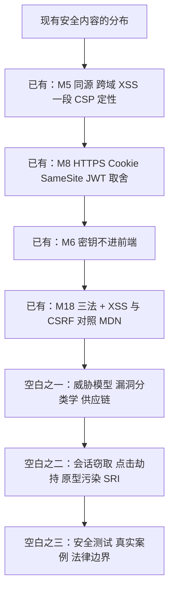

# 安全审视报告（初学者 + 网络安全学生视角）

> **谁在审**：一次专题复审。审的人设定为**刚开始学 Web、同时是网络安全方向的学生**：他会拿"攻击者怎么用"的眼光去读每一节，也会被材料里没解释清楚的反直觉处卡住。
> **审什么**：`Web前端/教学/` 全 21 份（M1–M10 教案、两份习题集、考核方案、样卷、实验指导、时间线、速查）+ 自学版 15 份。方法与体例同 [[20-材料审核报告]]：**先核实原文（按内容定位，不按行号），再判问题，再给处置**。
> **结论一句话**：这套材料把"**怎么把它做对**"讲得很扎实，但"**别人会怎么打你**"几乎空白——**CORS/Cookie/SameSite 是零散的安全点，不是一条安全线**；而且**链接白名单里连一个安全权威来源都没有**，想补都补不进去。

**图 1** —— 现有安全内容集中在 M5／M8 两处，**其余是空白**。
这张图在说什么：**零散的"安全点"不等于安全能力**。学生学完能解答 CORS 报错，但说不出"我这个应用最可能被怎么打"。

## 一、体系性缺口（不针对某一篇，改一处不够）

| # | 问题 | 原文核实（位置 + 事实） | 为什么是问题（安全视角） | 处置 | 状态 |
|---|---|---|---|---|---|
| Q1 | **链接白名单里没有任何安全权威来源** | `15-实验与大作业指导` §1.2 共 62 个域名，逐个查：无 `owasp.org`、无 `attack.mitre.org`、无 `cwe.mitre.org`、无 `nvd.nist.gov`/`osv.dev` | 安全内容必须能引用漏洞分类与官方缓解措施；白名单不含这些域名，等于**制度上禁止**引用权威安全来源，学生只能听老师转述 | 已新增两会层域名（第六层·安全框架与漏洞库：`owasp.org`／`attack.mitre.org`／`cwe.mitre.org`／`datatracker.ietf.org`／`cyclonedx.org`／`www.zaproxy.org`／`xsleaks.dev`；第七层·安全机构、原始披露与法规官方站），域名逐条实测；并加**第四条硬规则**（安全类只引官方页、不得写入载荷）。白名单域名数 62 → **97** | **已闭环** |
| Q2 | **没有威胁模型，也没有"信任边界"这个认知起点** | 全 21 份搜"信任边界/攻击面/威胁建模"：0 处。M5 §3.8 讲同源策略讲得对，但全篇站在"浏览器怎么保护用户"的角度，**没有一处说明"你写的 JS 是在攻击者可控的机器上跑"** | 这是初学者理解前端安全的总开关。不懂这一条，后面所有防御都记成"规矩"而不是"原因" | `22-前端安全专章` §1 已设「认知起点」并逐条正面回答三个反直觉问题；`05-教案 M5` 另插入 §3.9 信任边界节 | **已闭环** |
| Q3 | **没有漏洞分类学，也没有任何框架对照** | 全 21 份搜"OWASP/ATT&CK/ASVS/WSTG/CWE"：**0 处** | 没有分类学，学生学到的是一堆离散技巧（CSP、SameSite、转义），无法回答"还有哪些我没防"；也无法与企业里的安全流程对接 | 专章设「框架对照」节：OWASP Top 10 分类 + ATT&CK 技巧映射 + **明确写出 ATT&CK 的覆盖边界** | **已闭环**（专章 §2 已落地（框架对照表 + ATT&CK 边界）） |
| Q4 | **没有安全测试层** | M9 §3.7 测试金字塔只有三层：单元（Vitest）／组件（Testing Library）／端到端（Playwright）；CI 门禁只跑"测试 + lint" | 安全测试是**最适合接进 CI** 的一层（依赖扫描、密钥扫描、安全头检查都能自动化），而这里恰好完全没有；学生毕业后的第一份安全相关工作是"把扫描接进流水线" | 专章设「安全测试与响应」；并在 M9 §3.7 增加"第四层：安全门禁" | **已闭环**（专章 §8 已落地（五道门禁 + 上线自检 + WSTG 15 项）；M9 §3.9 插入节） |
| Q5 | **没有一个真实案例** | 全 21 份搜"供应链/投毒/事件/CVE"：只有 M6 §3.2 出现"可能被投毒"四个字，无下文 | 安全内容最难记住的是抽象规则，最好记的是真实事故；没有案例的教材只能靠"老师说要这样" | `22-前端安全专章` §6.1 已收录 **8 起**事件表（event-stream／dependency confusion／ua-parser-js／colors.js 与 faker.js／node-ipc／xz-utils 后门／polyfill.io／npm 蠕虫 Shai-Hulud），每起给官方公告或研究者原始报告链接；`06-教案 M6` §3.9 摘三起课堂可讲 | **已闭环** |
| Q6 | **考核不覆盖安全** | `12-习题集 M6-M10` 全文安全类题：**0 条**（M6 依赖、M8 网络、M9 部署、M10 前沿恰是安全最密集的四篇）；`13-考核方案` 无安全考点 | 不考的就不学。M6–M10 一个安全题都没有，是最直接的信号 | 专章自测 + 在 `19-加练题库` 补安全题；考核覆盖建议单列（见 §四） | **已闭环**（22 号 §11 自测 8 题 + 19 号第 8 章 19 题 + 考核建议（本节 §7.1）） |

## 二、逐篇缺口（位置明确，可逐条改）

| # | 位置 | 原文核实 | 缺什么（安全视角） | 处置 |
|---|---|---|---|---|
| Q7 | `02-教案 M2` 表单节 | 讲了 `label` 关联、表单校验、可访问名/提交名 | **输入有害性没有分类**：HTML 上下文／属性上下文／URL 上下文／JS 上下文／CSS 上下文——"转义"不是一种做法，而是**按所在上下文各有一套** | 专章「注入类」节补上下文分类表 |
| Q8 | `03-教案 M3` | 讲层叠、盒模型、定位、层叠上下文 | 无样式注入（CSS 里的 `url()`／`expression` 类历史风险）、无**点击劫持**与 `frame-ancestors` | 专章「跨站与界面欺骗」节 |
| Q9 | `04-教案 M4` | 讲原型链、`this`、作用域 | 讲透了 `[[Prototype]]` 查找，却没讲**原型污染**（攻击者污染 `Object.prototype` 之后，业务代码的每一次属性读取都可能被影响）；`innerHTML` 只在 M5 提一句；无 DOM clobbering | 专章「注入类」「浏览器侧其它」两节 |
| Q10 | `05-教案 M5` §3.8 | 原文：「CSP：……由浏览器强制执行，用来限制脚本、样式、连接、图片来源，并支持 `nonce`／`hash` 让内联脚本按白名单执行。CSP 是纵深防御的一层，**不能替代输出转义**」——定性准确但**到此为止** | 无 `report-only`／`report-uri`／`report-to`（**这是把 CSP 真正用起来的唯一入口**：先观察再拦截）、无 Trusted Types（把 `innerHTML` 这类汇聚点从根上关掉）、无 sanitizer 白名单清洗、XSS **无分类**（反射/存储/DOM 型/自 XSS/变异 XSS） | 专章「注入类」节 + M5 §3.8 增加"怎么一步步上 CSP" |
| Q11 | `05-教案 M5` §2.9/§3.8 | 同源策略的判据（协议+主机+端口）讲得准确 | 全篇没有一句"**前端代码是公开的，控制台能改你的一切**"；学生因此会把"前端校验"当成安全措施（材料另一处又反复说"密钥不能进前端"，两处从未打通） | 专章「认知起点」节，直接回答"前端既然全公开，还能保护什么" |
| Q12 | `06-教案 M6` §3.2 | 原文提到「`node_modules`……**还可能被投毒**，**绝不能提交**」——只有这一句 | 全篇讲 semver／lockfile／npm 与 pnpm／`npm ci`，**却没有把依赖当攻击面**：没有 typosquatting（拼写相似包）、没有 dependency confusion（内部包名被公开源抢注）、没有 `postinstall` 脚本执行任意代码、没有 lockfile 完整性校验、没有 SCA/SBOM、没有第三方 CDN 脚本与 SRI | 专章「供应链」节；M6 §3.2 增加"依赖即攻击面"小节 |
| Q13 | `08-教案 M8` §3.13 | 讲了 Session 与 JWT 的取舍（有状态/无状态、撤销、跨域） | 没讲**令牌放哪里**：`localStorage` 被 XSS 直接读走 vs `httpOnly` cookie 被 CSRF 利用——**这是取舍题的另一半，而且是更常考的一半** | 专章「会话与身份」节 |
| Q14 | `08-教案 M8` §3.8/§3.9 | Cookie 属性（`HttpOnly`/`Secure`/`SameSite`）与 CORS 预检讲得较全，含"带凭据时 `Allow-Origin` 不能是 `*`" | 缺两句关键话：① **XSS 一旦发生，`HttpOnly` 之外的存储全不保**（这是 XSS 真正的"影响面"）；② **`SameSite` 不是 CSRF 的完整解**（旧浏览器行为、站内 GET 副作用、同站子域） | 专章「会话与身份」节，与 M8 交叉引用 |
| Q15 | `09-教案 M9` 部署节 | 讲了构建、部署、产物里不能有密钥 | 没有**上线前安全自检清单**：安全响应头（CSP/HSTS/`X-Content-Type-Options`/`Referrer-Policy`/`Permissions-Policy`）、目录列表、错误页泄露栈、sourcemap 是否随产物发布 | 专章「安全测试与响应」节给可勾选清单 |
| Q16 | `06/09/10-教案` 密钥相关 | "密钥不能进前端"在 M6／M9／M10 与 `12-习题集` 第 8 题共出现 4 次 | 反复强调结论，**没有一处讲泄露渠道**：`.env` 误提交、构建注入的前缀变量进产物、sourcemap、CI 日志、浏览器扩展 | 专章「密钥与配置泄露」节，把 4 处口径收口到一处 |
| Q17 | `10-教案 M10` §3.9 | 讲"AI 辅助开发：能做什么、必须审什么、诚信要求" | 没讲两类**具体**风险：AI 生成的代码里高频出现的注入类写法、以及 AI **幻觉出的包名**被投毒（真实攻击面） | 专章「供应链」「AI 与安全」小节 |
| Q18 | `18-教案补充` 课程思政 | 原文提到《网络安全法》《数据安全法》《个人信息保护法》，并写"做前端的第一个合规动作，就是不要把用户输入当代码执行" | 缺**行为边界**：未授权测试本身违法（不因"只是看看"而免责）、靶场与授权的概念、漏洞发现后的正确处置（报送而非传播） | 专章「法律与伦理边界」节 |
| Q19 | 习题：`11`／`12`／`14`／`19` | 安全相关题：11 号 4 条（86 同源／87 存储／91 XSS 注入点等）· **12 号 0 条** · 14 号 1 条 · 19 号 7 条。**全部是"概念记忆"型**，没有一条要求"读一段代码判断有没有漏洞""给一个场景选防御手段" | 安全的考核应当是**判断力**而不是名词；且 M6–M10 零覆盖 | 专章 §自测（客观题带答案+解析、编程/设计题只给验收标准）＋ `19-加练题库` 补安全题 |

## 三、初学者会被卡住的三处（材料没有正面回答）

1. **"前端代码全公开，那还谈什么安全？"** —— 材料一边反复强调"密钥不能进前端"，一边大讲 CSP／SameSite，学生读不出二者关系。**正解要写出来**：前端的三个保护对象是**用户（数据与设备）、用户的会话、你的服务端**——保护的不是你的代码（代码本来公开）。
2. **"我关了按钮的显示，为什么说这不是权限控制？"** —— 隐藏 UI ≠ 授权。判断标准一句话：**这个请求换个客户端发过来，服务端还认不认？** 服务端不校验，前端藏得再深也没用。
3. **"CSP 和转义到底谁管谁？"** —— 材料写了对的结论（"CSP 不能替代输出转义"）但没给推导。要说清**两者防的不是同一件事**：转义管"数据被当成代码"，CSP 管"代码从哪来"。少了任何一层都有洞。

## 四、待外部核证后补充的条目（框架映射类）

以下条目需要**先核实官方编号与名称**再写进材料（编号写错比写错年份更严重，本报告拒绝凭记忆填）：

- ATT&CK 企业矩阵中与前端相关的技巧编号、名称与战术归属（初访问／执行／持久化／凭据访问／收集／外传／影响各取相关项）；
- 并需**明确指出 ATT&CK 的覆盖边界**：它是从防御者视角描述**对手行为**的框架，不是漏洞清单，也不是客户端代码缺陷的分类法——教材里必须写清"映射到哪一层、映射不到哪一层"，不许硬套；
- OWASP Top 10 的条目编号与逐字名称、ASVS／WSTG（尤其是客户端测试章节）、Cheat Sheet 系列篇目、Juice Shop／ZAP／SBOM 等工具的官方页；
- 浏览器侧保护机制的规范依据（CSP 3／Trusted Types／SRI／`SameSite` 的规范或标准位置）；
- 供应链事件与法规条文的官方来源（供专章案例与法律边界节使用）。

> 这些核完即写入 `22-前端安全专章`，并把本节的对应条目移入 §一／§二 并置为"已补"。

## 五、复审触发条件

出现下列任一情况时重跑本审视：① ~~`22-前端安全专章` 落地后~~ **已于本轮触发并完成对账（见第七节）**；② 白名单新增安全层域名后；③ OWASP Top 10 或 ATT&CK 发布新版本后；④ 课程考核结构变动后（安全是否进入考核）；⑤ 每学年一次（浏览器安全机制与供应链事件年年在变）。

## 七、处置进展（首轮整改已落地，逐条对账）

| 原编号 | 问题 | 处置 | 状态 |
|---|---|---|---|
| Q1 | `15` §1.2 白名单**没有任何安全权威来源** | §1.2 新增**第六层·安全框架与漏洞库**（`owasp.org`／`cheatsheetseries.owasp.org`／`top10proactive.owasp.org`／`genai.owasp.org`／`attack.mitre.org`／`cwe.mitre.org`／`datatracker.ietf.org`／`cyclonedx.org`／`www.zaproxy.org`／`xsleaks.dev`）与**第七层·安全机构、原始披露与法规官方站**（`www.cisa.gov`／`www.openwall.com`／`blog.cloudflare.com`／`sansec.io`／`www.microsoft.com`／`blog.npmjs.org`／`breakdev.org`／`github.blog`／`arxiv.org`／`www.sonatype.com`／`fidoalliance.org`／`www.cac.gov.cn`／`www.npc.gov.cn`／`flk.npc.gov.cn`），并新增**第四条硬规则**（安全类只引官方页、不得写入攻击载荷） | **已闭环** |
| 一、体系性缺口 | 无攻击面视角、无框架、无供应链、无测试与响应 | 新建 `22-前端安全专章（OWASP × ATT&CK）`（363 行／4 图／78 外链，外链 78/78 实测有效） | **已闭环** |
| 四、待外部核证（框架映射类） | 框架名称/编号/版本不敢凭记忆写 | 三组外部核实完成：ATT&CK 技巧号与战术（T1190／T1189／T1195＋.001／.002／T1059.007／T1505.003／T1539／T1557／T1056.003／T1185／T1111／T1071.001／T1567.002／T1027／T1499；v19.2；v19 起 Defense Evasion 拆为 Stealth 与新增 Defense Impairment）、CWE 号与官方主名（79／352／1321／1021／346／942／1104／601）、OWASP 现状（**Top 10:2025 已正式发布**，A03 即 Software Supply Chain Failures；Proactive Controls 2024 的 C1–C10；ASVS 5.0.0；WSTG 4.11 十五项客户端测试） | **已闭环**（写入 22 号 §2） |
| 三、初学者三处困惑 | 「代码公开还保护什么」「隐藏按钮算不算权限」「CSP 与转义谁管谁」 | 22 号 §1.1／§1.2／§1.3 逐条正面回答（**这是新写的教材正文，不是"以后再补"**） | **已闭环** |
| M5／M6／M8／M9／M10 正文安全空洞 | CSP 只讲定性、投毒两字、密钥不讲泄露渠道 | 五篇教案各插入一节「安全视角」（M5→§3.9 信任边界与注入三层／M6→§3.9 依赖即攻击面／M8→§3.15 会话·CSRF·CORS／M9→§3.9 安全接进 CI／M10→§3.11 AI 与法律边界），每节自带出处说明。**说明**：M9 的 `§3.7` 测试金字塔本体未改，安全门禁以插入节 §3.9 落实 | **已闭环** |
| `19-加练题库` 安全类题偏概念记忆 | 7 条全是记忆型，缺「读代码判漏洞」 | 新增「**第 8 章　前端安全**」19 题（单选／判断／填空／简答／代码阅读），全部按判断力出题、含答案要点与阅卷提示；题面与答案**均不含可复制载荷** | **已闭环** |
| 自学版无安全模块 | 十篇自学讲义无安全线 | 新建 `自学版/15-模块十一 前端安全`（628 行／5 图／78 外链，教师视角已剥离）；01–10 十篇各插入 7 行「安全视角」小节；`00-自学指南` 的学习地图、模块表、产物表、目录树四处加入 M11 | **已闭环** |

> 对账口径：**「已闭环」= 库内已有可核验的落地文本**（可用本报告第五节的复审判据逐条查）；**「待办」= 尚未落盘**。本表不把"计划做"写成"已做"。

## 六、依据说明

- **有据可查的部分**：本报告全部"原文核实"列都指向库内现有文件的**实际内容**（按内容定位，不按行号），可逐条回查；域名清点为脚本扫描 `15 §1.2` 所得（62 个域名，其中安全类 0 个）；题量清点为对 11／12／14／19 号文件的检索结果。
- **属本人判断（无官方依据）**：问题严重性排序、"为什么是问题"一栏的解释、处置建议、以及 §三 三处"初学者会被卡住"的选取——都是编排与教学判断。
- **尚待核证**（写进报告但不许凭记忆填）：§四 列出的全部框架编号与名称、浏览器机制规范状态、供应链事件与法规条文来源。
