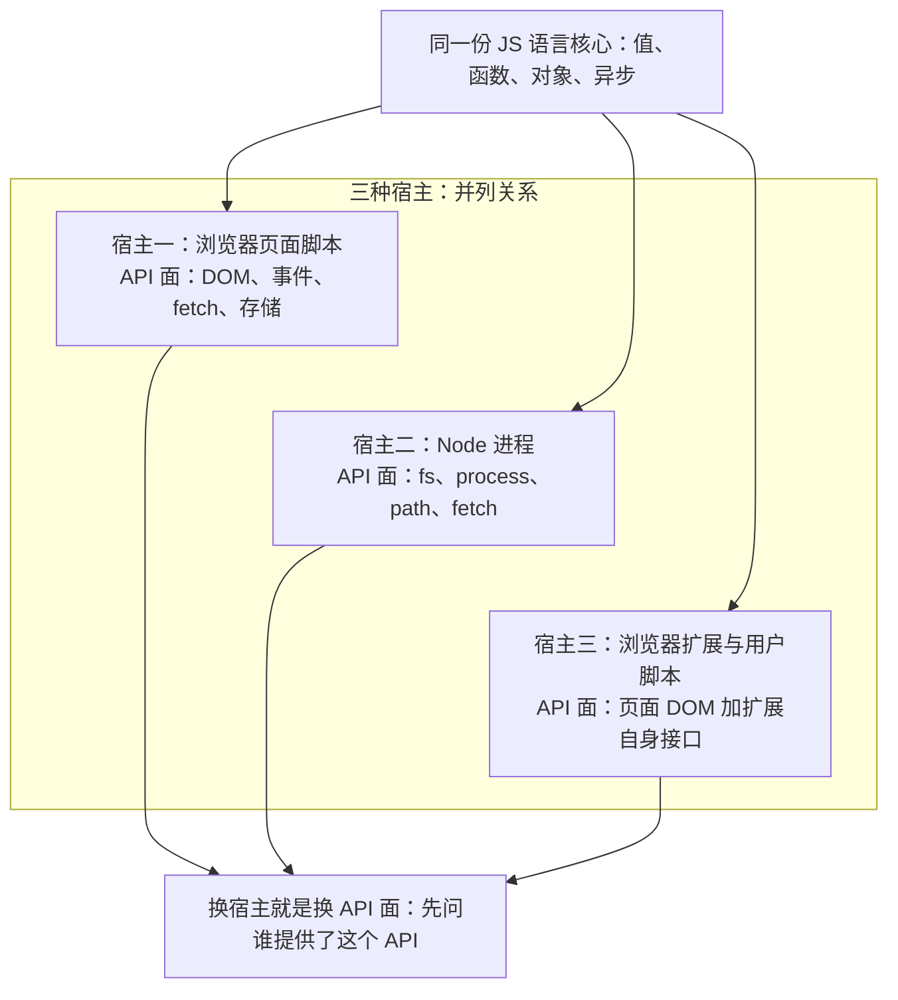
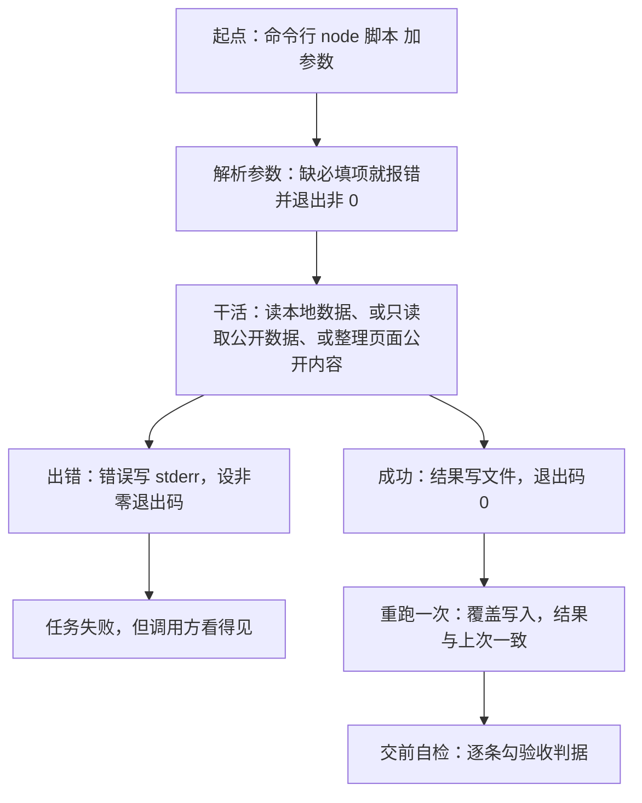

# JavaScript 脚本实战专章（Node 与浏览器）

> **给谁看**：学完 M4（JS 语言核心）与 M5（浏览器运行时）、手上已经能写出"我这边能跑"的小文件的学生；以及想把自己写的小工具真正**交付出去**的读者。本专章的定位不是多学语法，而是把"写脚本"推到"**能被定时任务调用、失败会报错、重跑结果一致**"。
> **怎么用**：§1–§2 建认知起点（宿主与 API 面）；§3–§5 是 Node 一侧的最小交付面（跑起来、分模块、工具化）；§6 是浏览器一侧（页面脚本与用户脚本）；§7 是抓取边界（**必读**）；§8 是可当桌面速查的排错顺序表；§9–§12 给教师备课；§14 自测；§15 依据说明。
> **一句话立场**：**语法决定你能不能写出来，宿主决定它能不能跑起来，工程约定决定它能不能被反复使用**——三件缺一件，交付就还停在"我这边能跑"。



> **图 1**：三种宿主共享同一份语言核心，但各自的 API 面互不相同。
> 这张图在说什么：**"这段 JS 能跑吗"这个问题无法脱离宿主回答**——同一个文件换个地方跑不起来，通常不是语法问题，是 API 面问题。

## 1. 认知起点：三个反直觉问题的正面回答

### 1.1 "脚本为什么需要宿主？"

**宿主（host）**：白话就是"给 JS 一副身子"的那个程序——它提供运行环境，并把文件、网络、界面这些能力作为 API 交给脚本。不是"JS 自带的"。**不这么写会怎样**：你会把 `fetch`、`document`、`fs` 全当成语言的一部分，一到换环境就不知道哪些还能用。

JS 引擎只干一件事：解析与执行语言本身。它不认识文件、不认识网络、更不认识页面。所有"能读能写"的本事都是宿主注入的：

- **浏览器宿主**注入 `window`、`document`、`localStorage`、`fetch`，以及由页面事件驱动的回调；
- **Node 宿主**注入 `process`、`Buffer`、全局计时器，并把文件与网络能力放进带 `node:` 前缀的内建模块；
- **扩展／用户脚本宿主**（浏览器扩展）在页面之上**再叠一层**自己的接口。

所以"JS 能干什么"这句问法本身是残缺的，完整问法永远是：**在哪个宿主里，干什么。**

### 1.2 "为什么浏览器能跑的代码，在 Node 里跑不了？"

因为那句"能跑"其实在说"**宿主刚好提供了它用到的 API**"。三种最常见的原因：

1. **用了浏览器独有的全局对象**。`document`、`window`、`location`、`alert` 在 Node 里不存在——不是 Node 不支持，是这些概念没有意义（没有页面就没有"文档"）。
2. **模块加载规则不同**。页面脚本由 HTML 按自己的规则加载，Node 按自己的规则加载，两套规则对**扩展名**和**包类型声明**的要求不一样（见 §4）。
3. **依赖了界面事件**。点击、滚动、重绘都是宿主事件循环里的东西，命令行里没有。

反过来同样成立：`require`、`process.env`、`node:fs` 在页面脚本里也用不了。**判据只有一条**：这段代码调用的每一个 API，当前宿主有没有提供？没有就换宿主，或退回到两边都有的那一小片公共面积（`fetch`、`AbortController`、`console`、`Promise` 都属于这一片）。

### 1.3 "为什么'能跑一次'不算写完？"

因为"跑一次"是在**最宽松的条件下**成功的：参数刚好对、目录刚好对、网络刚好通、数据刚好是那一份。可交付的脚本要再多满足四条：

1. **入口稳定**：能被别的东西用命令行调起来（定时任务、CI、另一个脚本），参数可选可省、缺省时有明确默认值；
2. **失败有信号**：出错要**写错误信息**并给出**非零退出码**——调用方看的是退出码，不是你那行红字；
3. **结果可重现**：同一份输入跑两次结果一致；写文件到底是整篇覆盖还是追加，必须是一个明确选择，不能"看情况"；
4. **边界写在明处**：对谁发请求、间隔多少、数据从哪来、允许做什么，都写进脚本头部注释（见 §7）。

> 本专章后半段的全部内容都从这一条推出来：§5 讲入口与退出码，§4 讲怎么拆成模块，§8 讲不听话时按什么顺序查，§10 的验收判据就是把这四条变成可勾选的条目。

## 2. 三种宿主与各自的 API 面（对照表）

图 1 画的是三者的关系，下面这张表是**逐项对照**——教学上建议直接当"能不能用"的查表。

| 对照项 | 浏览器页面脚本 | Node 进程 | 浏览器扩展／用户脚本 |
|---|---|---|---|
| 谁把它启动起来 | 页面加载，或 `&lt;script&gt;` 标签 | 命令行、定时任务、另一个进程 | 用户装扩展后，访问命中规则的页面时 |
| 主要全局对象 | `window`、`document` | `globalThis`、`process` | 页面全局 ＋ 宿主自己的接口对象 |
| 文件读写 | 没有（只有沙箱内存储与"下载"这一动作） | `node:fs`／`node:fs/promises` | 没有直接的文件 API |
| 网络请求 | `fetch`／`XMLHttpRequest`，受同源策略与 CORS 约束 | `fetch`，**不受同源策略约束**（它是服务端行为） | `fetch`，同样受 CORS 约束；少数宿主另给自己的请求接口，能否用由宿主与站点规则决定 |
| 改界面 | 直接改 DOM | 无 | 可注入样式与元素 |
| 结束与状态／能否定时调用 | 没有退出码，页面关了就结束，**不能被定时调用** | `process.exitCode`／`process.exit()`，**能被定时任务调用** | 没有退出码，由用户访问触发 |
| 典型用途 | 交互、校验、埋点、页面内小工具 | 构建、批处理、定时任务、数据搬运 | 页面增强、公开信息整理、重复操作自动化 |
| 出错时你看到什么 | DevTools 控制台一行红字 | stderr 输出 ＋ 退出码 | 宿主自己的控制台（**不是**页面那个） |

**三个容易踩的差别，单独说一句**：

- **同源策略只在浏览器里存在**。Node 发的请求是"服务端到服务端"，没有同源这回事；但这**不等于**可以随便打别人的接口——约束从浏览器换成了法律与平台规则（§7）。
- **只有 Node 有退出码**。所以"失败会报错"这条交付标准在浏览器侧要换成另外两个词：**幂等**（重复执行不产生重复结果）与**不破坏页面**。
- **Node 的 `fetch` 默认 UA 就是字符串 `node`**。本机实测：服务端收到的确实是 `node`；显式设置 `user-agent` 有效，服务端收到所设的值。这一条在 §7 会成为抓取礼貌的第一道门。

## 3. Node 起步：让一个文件跑起来

### 3.1 先确认环境

`node -v` 与 `npm -v` 各打印一个版本号。本机口径：**Node v26.7.0**、**npm 11.19.0**；全局的 `tsc`、`deno`、`bun` **都没有安装**——所以本专章一律用 Node 自带的工具面，不引入额外运行时。

### 3.2 最小脚本：两行就够

一个最小可跑的 Node 脚本就是 `console.log(process.version)` 这一行（**仅示语法形态**）。把它存成 `hello.mjs`，然后 `node hello.mjs`。**注意**：Node 不认"光给个名字"的写法（那不是 PATH 查找），要么给文件名，要么给路径。

### 3.3 本机确认过的几个能力（不是猜的）

| 能力 | 本机结论 |
|---|---|
| 内建 `fetch` | 真请求 `example.com` 首页，返回 200 |
| `node 文件.ts` | **直接跑通**，无 flag、无警告；只剥类型标注，**不做类型检查** |
| `import.meta.dirname` | 可用 |
| `node:util` 的 `parseArgs` | 可用 |
| `Object.groupBy`、`Promise.withResolvers` | 可用 |
| `AbortController`、`AbortSignal.timeout` | 可用 |
| `node --run`（跑 package.json 里的脚本）、`node --test`、`--watch` | 均可用；后两者本机确认为存在 |

**`.ts` 这一条要单独提醒学生**：本机 `node 文件.ts` 能直接跑，是因为 Node **只把类型标注剥掉**，它**不做**类型检查。不这么写会怎样：你会以为"能跑 = 类型没写错"，把类型错误一直带到运行时。要类型检查就另外装类型检查工具，本专章不展开。

### 3.4 脚本的"契约头"

可交付的脚本，头部应当有一段注释说明四件事：**用法**（怎么调）、**参数**（有哪些、哪些必填）、**退出码**（0／2／1 各代表什么）、**数据来源与边界**（只读还是写、公开还是本地）。这不是形式主义——§10 的验收判据会逐条对照它。

## 4. 模块系统：CJS 与 ESM

**模块（module）**：白话是把一份代码拆成独立单元，让别的文件可以按名字把它引进来。**不这么写会怎样**：所有代码挤在一个文件里，改一处要通读全部，也没法单独测试其中一段。

**Node 里两套模块规则并存**：

| 称呼 | 写法 | 特点 |
|---|---|---|
| **CJS**（CommonJS，Node 早期的那套） | `require(...)` 拿、`module.exports` 给 | 同步加载，`require` 可以在函数里随时调用 |
| **ESM**（ECMAScript 模块，语言标准的那套，浏览器同款） | `import ... from "..."` 拿、`export` 给 | 静态加载，`import` 只能写在顶层；浏览器里能跑的同一份写法 |

### 4.1 文件到底按哪套解析？看两样东西

1. **扩展名**：`.mjs` 永远是 ESM；`.cjs` 永远是 CJS；`.js` **要看第二条**。
2. **最近的 `package.json` 里的 `"type"` 字段**：写成 `"module"` → `.js` 按 ESM；写成 `"commonjs"` 或干脆没写 → `.js` 按 CJS。

**本机实测的一条**：一个 `.js` 文件里写了 `import`，但所在目录**没有**声明模块类型时，本机只**警告** `MODULE_TYPELESS_PACKAGE_JSON`，然后**自动按 ESM 重新解析**，**不报错**。老版本会直接硬报 `Cannot use import statement outside a module`。

> 结论（也是给学生的一句话）：**"它警告但还是跑通了"不是可以依赖的行为**。显式在 `package.json` 里写清 `"type"`，同一份代码换台机器、换个 Node 才不会再赌一次。出处见 [Node 官方包文档](https://nodejs.org/api/packages.html)。

### 4.2 三种"名字"要分清

- `./x.js`：**相对路径**，ESM 里**必须写扩展名**，也不能省掉 `./`——省了会被当成包名去找；`some-package` 才是**裸包名**，会去 `node_modules` 里找。
- `node:fs`、`node:path`：**内建模块**，建议一律带 `node:` 前缀，一眼就能看出"这是 Node 给的，换宿主就没有"。

### 4.3 ESM 与 CJS 打交道

- CJS 想加载 ESM，用动态 `await import(...)`（`import()` 是表达式，可以在函数里用）；反过来，ESM 里 `import` 一个 CJS 模块，拿到的是它的 `module.exports` 作为**默认导出**，能否按名字解构出子项取决于 Node 的静态分析结果——不要赌，看实际报错。
- 自己写新脚本时：**一套就够，别混**。本专章的示例统一用 ESM。

```js
// 仅示形态：ESM 的默认导出与具名导出
export const 上限 = 3;                 // 具名导出
export default function 整理(行) {     // 默认导出
  return 行.trim();
}
```

- 出处：[Node 模块文档](https://nodejs.org/api/module.html) ｜ [MDN 模块指南](https://developer.mozilla.org/zh-CN/docs/Web/JavaScript/Guide/Modules) ｜ [MDN `import` 语句](https://developer.mozilla.org/zh-CN/docs/Web/JavaScript/Reference/Statements/import)。

## 5. 脚本的工具面：参数、退出码、文件、路径

这一节四个词，是本专章的**交付面**核心。

### 5.1 参数：从 `process.argv` 到 `parseArgs`

`process.argv` 是一个字符串数组，头两项固定是"Node 可执行文件路径"和"脚本路径"，**真正属于你的参数从第三项开始**。手写解析容易在"有没有值、等号还是空格、缺省怎么办"上翻车，所以用 `node:util` 的 `parseArgs`（本机可用），它把"参数名 → 值"这一步变成声明式的。

**退出码（exit code）**：白话是"程序结束时交给调用方的一个数字"，0 表示成功，非 0 表示失败，具体数字的含义由你定义并写进契约头。**不这么写会怎样**：定时任务和 CI 会认为"退出码 0 = 一切正常"，你的失败就被写成了一条成功记录。

### 5.2 标准流：数据走 stdout，日志走 stderr

`console.log` 写 **stdout**（标准输出），`console.error` 写 **stderr**（标准错误）。规矩是：**要被下游程序吃掉的数据走 stdout，给人看的提示与日志走 stderr**。混在一起的话，一旦把 stdout 重定向进文件，你的日志就会一起写进结果文件。出处：[Node `process` 文档](https://nodejs.org/api/process.html) ｜ [MDN `console`](https://developer.mozilla.org/zh-CN/docs/Web/API/console)。

### 5.3 结束的两种方式（这里有一条实测限定）

| 写法 | 行为 | 什么时候用 |
|---|---|---|
| `process.exitCode = 1` | 设好数字，让脚本**自然收尾**再退出 | **默认推荐** |
| `process.exit(1)` | 立刻结束进程 | 只在实在等不下去时（如"参数不对，没必要继续"） |

官方文档对 `process.exit()` 的表述是"**可能**截断未写完的标准输出"。**本机实测**：一次性直写 300 KB 到 stdout 后立刻 `process.exit()`，**未复现**截断。所以正确写法是"**可能而非必然**"——它是个**未定义的时序风险**，不是必然结果，所以不拿它当常规手段，但也不必把它说成必然出错的写法。

### 5.4 文件：覆盖、追加、编码

- `writeFile`：**整篇覆盖**。重复运行得到同一份结果——这正是"重跑一致"的来源。
- `appendFile`：**追加**。第二次运行就会有第二份，除非你本来就想要日志式累加。
- **不传 `encoding` 得到的是 `Buffer`**（一串字节），不是字符串。**写中文必须显式传 `'utf8'`**，否则你打开文件看到的是乱码。

出处：[Node 文件系统文档](https://nodejs.org/api/fs.html)。

```js
// 仅示形态：参数、退出码、整篇写与追加写的区别
import { parseArgs } from 'node:util';
import { writeFile, appendFile } from 'node:fs/promises';

const { values } = parseArgs({ options: { out: { type: 'string' } } });
if (!values.out) { console.error('缺少 --out'); process.exitCode = 2; }
else {
  await writeFile(values.out, '结论一行\n', 'utf8');   // 整篇覆盖
  await appendFile(values.out, '附注一行\n', 'utf8');   // 追加
}
```

### 5.5 路径：相对的是"当前工作目录"，不是脚本所在目录

`./data.csv` 里的那个 `.` 指的是 **`process.cwd()`（当前工作目录）**——也就是你在哪个目录敲的命令，而**不是**脚本文件所在的目录。**不这么写会怎样**：你在项目根目录跑得好好的脚本，被定时任务从别处调起来就"找不到文件"，而脚本本身一个字都没改。

要相对脚本自身，用 `import.meta.dirname` 拼上 `node:path` 的 `join`／`resolve`，得到绝对路径再用。

### 5.6 一个必考的反直觉点：`forEach` 里的 `async` 不会被等待

```js
// 仅示形态：forEach 里的 async 不会被等待
const names = ['甲', '乙', '丙'];
names.forEach(async (n) => { await 慢操作(n); console.log(n); });
console.log('全部完成');   // 实测：这一行先出现
```

**本机实测**：先打印"全部完成"，再陆续打印各项；而且回调里抛出的异常**不会外抛**给你。所以批量异步只有两种正确写法：`for...of` 配 `await`（串行），或 `await Promise.all(数组.map(async …))`（并发、且有聚合的错误）。

### 5.7 让脚本"可被调用"

`node --run` 可用来按名字执行 `package.json` 的 `scripts` 里那一条命令（本机确认），别人不必记那串参数。测试用 `node --test`（本机存在），开发时用 `--watch`（本机存在）。出处：[Node CLI 文档](https://nodejs.org/api/cli.html) ｜ [Node 测试文档](https://nodejs.org/api/test.html) ｜ [Node 入门](https://nodejs.org/en/learn/getting-started/introduction-to-nodejs)。

## 6. 浏览器一侧：页面脚本与用户脚本

### 6.1 页面脚本

页面脚本的宿主是浏览器，工作面是 **DOM（文档对象模型）**——页面被解析成的一棵对象树，改树就等于改页面。**不这么写会怎样**：你会把页面当成字符串去拼，一旦结构稍微变一点，`innerHTML` 的操作就全部失效。

**选择器（selector）**：用一段模式串去树里"点名"要哪些元素，`document.querySelector`（取第一个）／`querySelectorAll`（取全部）。

```js
// 仅示形态：按选择器取元素并读取文本
const rows = document.querySelectorAll('table.list tr');
for (const row of rows) console.log(row.textContent.trim());
```
> 出处：[MDN DOM](https://developer.mozilla.org/zh-CN/docs/Web/API/Document_Object_Model) ｜ [Chrome DevTools 控制台](https://developer.chrome.com/docs/devtools/console)。调试习惯上，`console.table` 比一行行 `log` 更适合看清一批对象。

**请求与取消**：`fetch` 两边都有；**在长期运行的页面里，请求要配 `AbortController`**——它是"取消信号"的发生器，把它交给请求，就能在用户离开或超时后真的停掉。**不这么写会怎样**：页面里堆着一批永不返回的请求，用户以为操作取消了，其实还在跑。出处：[MDN `fetch`](https://developer.mozilla.org/zh-CN/docs/Web/API/Window/fetch) ｜ [MDN `AbortController`](https://developer.mozilla.org/zh-CN/docs/Web/API/AbortController)。

### 6.2 用户脚本（userscript）

**用户脚本**：白话是"由浏览器扩展在你访问的某个页面上额外执行的一段脚本"，典型用途是页面增强与把公开信息整理成可用的文本。**不这么写会怎样**：你会每次手工重复几十次点击复制，还容易复制错。

它的头部是一段**元数据块**（扩展按它决定什么时候执行、能用哪些接口）：

```js
// 仅示形态：用户脚本的元数据块
// ==UserScript==
// @name         页面公开表格整理
// @namespace    local.example
// @version      自定版本号
// @match        *://example.com/*
// @grant        none
// ==/UserScript==
```

**`@match` 是纪律的核心**：它限定"只在哪个域名下生效"。不写或写成通配一切，你的脚本会出现在**你访问的每一个站点**上——范围与风险同时失控。示例里的 `*://` 是协议通配，刻意不写死协议。**`@grant`** 声明"我需要宿主额外给我哪些接口"，用不到就写 `none`，这是最小权限的写法。出处：[Tampermonkey 文档](https://www.tampermonkey.net/documentation.php?locale=zh-CN) ｜ [Greasy Fork](https://greasyfork.org/zh-CN)。

### 6.3 浏览器侧的"交付标准"是另外两个词

Node 侧靠退出码说话，浏览器侧没有退出码，于是判据换成：

- **幂等**：同一次操作重复执行，不产生重复结果（例如重复点"导出"不会append 出两份）；
- **不破坏页面**：只加自己要的元素，不动原页面的事件与结构；出错时安静退出，不要把一个弹窗糊在用户脸上。

## 7. 抓取与边界（只读、公开、有间隔）

**抓取（scraping）**：白话是"写脚本按固定节奏去取公开页面或公开接口的数据，再整理成自己的格式"。**不这么写会怎样**：你会用最没有分寸的方式去取——默认 UA、全速循环、拿到就用——既容易被挡，也容易越界。

本章只讲**只读采集**。四条规则按优先级排列：

1. **只读**。只发 GET，取公开内容；**不做登录、不提交表单、不发帖、不点"确认"**。凡是需要"先登录再拿到"的东西，就属于账号权限范围，脚本不去碰。
2. **有公开接口或 RSS，就绝不碰私有接口**。接口是**写给程序用**的，页面是**写给人用**的；优先拿给程序用的那个。**不这么写会怎样**：你会去逆向一个本来没打算对外开放的调用——那既是技术上的脆弱依赖，也是规则上的越界。本材料**不提供**任何逆向私有接口的做法。
3. **身份与礼貌**：真实浏览器 UA ＋ 完整请求头 ＋ **1–3 秒随机间隔**。
   - 本机实测：Node 的 `fetch` **默认 UA 就是字符串 `node`**，服务端收到的就是这个；显式设 `user-agent` **有效**。
   - **UA 让学生自己读**：在浏览器地址栏输入 `chrome://version` 就能看到自己那份。材料里**不写死任何浏览器版本号**——写死了，过一阵就变成错的。
   - **一句必须说清的话**：改 UA **不是隐身衣**。它不改变"你是谁、你能访问什么"，只让服务端看到一次形态正常的请求。合规与否的判据始终是下面的第 4 条与法律边界。
4. **数据只在必要范围里留存**。只留你要用的字段；个人信息不采不留；抓到的数据不往不相关的库里塞——本专章与其它笔记区的数据**各自独立**，不互相搬运。

**不做清单**（课堂上逐条念）：不批量遍历他人系统的编号；不绕过任何访问控制、验证码或频率限制；不把站点数据整站镜像；不把脚本分享给"帮忙刷一次"的人。

**法律与平台规则的边界**：本章只管"技术上怎么做才礼貌"，**条文层面的边界不在这里重复**——《网络安全法》《数据安全法》《个人信息保护法》《刑法》相关条文、以及"未授权测试"的界定，全部写在 [[22-前端安全专章（OWASP × ATT&CK）]] 的法律与伦理边界一节，上课时应与本节的"不做清单"连着讲。另外，`robots.txt` 与站点服务条款都是**规则**而不是**门槛**：做不做得到是技术问题，许不许可做是规则问题，两者无关。

## 8. 排错：脚本不听话时按这个顺序查

顺序是**从"几乎一定发生"排到"偶尔发生"**——照表往下走，别跳。

| 现象 | 多半是什么 | 怎么改 |
|---|---|---|
| `Cannot find module`／`ERR_MODULE_NOT_FOUND` | 相对路径没写 `./`，或 ESM 里省略了扩展名 | 写成 `./x.js`；裸名会被当作包名去 `node_modules` 找 |
| `Cannot use import statement outside a module` | 文件被当成 CJS 解析了 | 在 `package.json` 里写 `"type": "module"`，或把文件改名为 `.mjs` |
| 出现 `MODULE_TYPELESS_PACKAGE_JSON` 警告 | 没声明模块类型，本机自动按 ESM 重解析了（不报错） | **显式声明**；不要把"警告但还是跑通"当依赖 |
| 文件读不到，或读到的不是你以为的那份 | 相对路径相对的是**当前工作目录**，不是脚本所在目录 | 用 `process.cwd()` 确认现状；要相对脚本就用 `import.meta.dirname` 拼绝对路径 |
| 写出的中文是乱码 | 没传 `encoding`，拿到／写出的是 `Buffer` | 读写文件都显式加 `'utf8'` |
| 第二次运行结果是"两份" | 想覆盖却用了 `appendFile` | 覆盖用 `writeFile`，追加才用 `appendFile` |
| 最后的日志没打出来 | 异步还没收尾就调了 `process.exit()`（官方说"可能"截断，本机未复现，属可能而非必然） | 改成设 `process.exitCode`，让脚本自然收尾 |
| 请求返回 403／429／空响应 | 默认 UA 是 `node`，或请求太快 | 设真实 UA、加 1–3 秒随机间隔、遇到 429 就停下并退出非 0 |
| 脚本"跑完了"但结果没出来 | `forEach` 里的 `async` 不会被等待（实测先打印"全部完成"） | 改 `for...of` 配 `await`，或 `await Promise.all(数组.map(...))` |
| 只有一行报错，没有堆栈 | 异常被 `catch` 之后吞掉了 | 把 `err.stack` 写到 stderr；禁止写空的 `catch {}` |
| 请求偶尔挂着不返回 | 没有超时 | 用 `AbortSignal.timeout(...)` 配 `AbortController`（本机可用） |
| 浏览器里报 `document is not defined` | 把页面脚本丢进 Node 跑了（或反过来） | 回到 §1.2 的判据：先问宿主有没有这个 API |

## 9. 教学法：错误优先怎么用在脚本课上

**"错误优先"**：先给一个**会挂**的脚本，让学生按 §8 的顺序把它**查出来**，再改做成可交付版本。它和"先讲语法再写例子"是相反的路径。

**为什么适合脚本课**：脚本课的知识点（模块类型、`cwd`、编码、退出码、`forEach` 不等待）单独讲都像无关琐事，只有在"**它刚刚挂了**"的语境里，学生才会记住"原来这条是这么咬人的"。

**一节课的节奏（45 分钟）**：

1. 发下一个"我这儿能跑"的脚本（写死相对路径、无参数校验、`catch {}` 吞掉异常、`forEach(async …)` 批量取数）；
2. 学生在**自己的机器上**跑，拿到真实报错；**不直接给答案**，先让他们按 §8 表逐行定位、指认自己落在表的哪一行；
3. 改造成可交付版：参数化 → 显式编码 → 非零退出码 → 可重跑一致 → 头部写契约；
4. 收尾：让每人写三行"我错在哪、我怎么定位的"。

**四个"必挂"脚本的设定**（只给设定，不给成品代码）：① 用了 `import` 但没声明类型；② 用写死的相对路径读数据；③ 用 `forEach(async …)` 批量取数；④ 抓中文写文件不传 `utf8`。

**评价导向**：把"排错记录"作为报告的独立一节并计分——**能说清定位过程的人**，比碰巧改对的人更接近会写工具的人。

## 10. 实验指导（附加实验（第 9 次，选修））

**附加实验（第 9 次，选修，不计入 8 次实验的标准清单，见 [[15-实验与大作业指导]]）**。



> **图 2**：一次脚本运行的两条出口，以及"重跑一次"这一步的位置。
> 这张图在说什么：**验收不是看它跑成功过，而是看成功与失败两条路都有明确信号，且第二次运行仍然对**——`X` 和 `D` 这两步最容易被学生跳过。

### 10.1 实验目的

把 §1.3 那四条（入口稳定、失败有信号、结果可重现、边界在明处）在一个**真实能被调用**的小工具上落地；顺带把 §4、§5、§8 的知识点串成一次完整闭环。

### 10.2 环境前置

- **Node 已装**（本机口径 Node v26.7.0；`node -v` 能打印版本即可）；
- **网络可用**（仅任务 B 需要）；
- **涉及抓取时一律用公开接口或本地数据**
- **开课前先在实际机器上验一遍链路**：`node -v`、任务 A 的读／写路径、任务 B 的公开数据源在**这台机器上**是否可达。机房若不能联网，直接把任务 B 换成任务 A——**先验证链路，再怀疑学生的代码**，否则会把环境问题误判成"学生不会写脚本"。：任务 A 完全不联网；任务 B 只取公开、只读的数据源；任务 C 只处理**你自己有权操作**的页面上的公开内容。

### 10.3 任务（三选一）

- **任务 A · 本地数据处理（不联网，推荐给求稳的同学）**：读一个 CSV，按某一列分组统计，把结果写成一份输出文件。`Object.groupBy` 本机可用。
- **任务 B · 可被定时调用的小工具（联网、只读、公开源）**：取一个公开数据源，整理成"一行一条结论"的文本或 CSV，整篇覆写输出文件；必须带超时与失败退出码。
- **任务 C · 页面侧（用户脚本）**：写一个用户脚本，把某个**你自己有权操作**的页面上的公开表格整理成可直接复制的文本；用 `@match` 把生效范围收窄到那一个域名。

### 10.4 验收判据（逐条可勾）

- [ ] 能被命令行启动，**从任意工作目录**都能正确找到它要读／写的文件（§5.5）
- [ ] 参数有默认值；**缺必填参数时报错并给出非零退出码**（§5.1）
- [ ] 正常结束退出码 0；失败时错误写 stderr、退出码非 0（§5.2、§5.3）
- [ ] 结果文件是**整篇覆盖**写入，中文字符正常（显式 `'utf8'`）（§5.4）
- [ ] **连续运行两次，输出文件内容一致**（任务 B 另需说明数据时间戳如何处理）
- [ ] 没有空的 `catch {}`；失败时能看到可定位的错误信息（§8）
- [ ] 没有 `forEach(async …)` 式的批量异步（§5.6）
- [ ] 头部有契约注释：用法、参数、退出码含义、数据来源与边界（§3.4、§7）
- [ ] 任务 B 额外：设了真实 UA、间隔 1–3 秒、有超时；只用公开源
- [ ] 任务 C 额外：`@match` 收窄到单一域名；重复执行不产生重复元素（幂等）

### 10.5 常见故障与排查

按 §8 的表走。实验里出现最多的四条是：**相对路径**（第 4 行）、**编码**（第 5 行）、**`forEach` + `async`**（第 9 行）、**请求被挡**（第 8 行）。

### 10.6 提交物

脚本文件（含契约头）、输出结果样例、一页以内的排错记录、`package.json`（若有）。以 **Git 2.53.0** 提交到课程仓库；不提交任何抓取到的原始数据。

### 10.7 报告要求（三档）

- **不合格**：只有"能跑"的结论，没有失败路径说明，或输出文件是手工改出来的。
- **合格**：四条验收的主干齐备（参数、退出码、覆写、可重跑），排错记录写清了"错在哪一行"。
- **优秀**：在上一条基础上，能说明**为什么**这么选（为什么覆盖而不是追加、为什么这个超时值、为什么这个间隔），并指出自己方案在换机器后**可能失效的那个前提**。

## 11. 作业与习题要点

**只给要点与评分点，不给可直接抄交的成品代码**；示例一律只示语法形态。四类题：

1. **定位题**：给一段会挂的脚本（含 §8 表里 2–3 个坑），写出"现象 → 排查顺序 → 改法"。**评分点**：定位顺序是否按 §8 的优先级，改法是否指向根因而不是掩盖现象。
2. **改造题**：把一段"能跑一次的脚本"改成可交付版。**评分点**：入口（参数与默认值）、信号（退出码与 stderr）、可重现（覆盖写与新增的 `utf8`）、边界（契约头）四项各占一档；**只改格式不改行为不给分**。
3. **边界判断（必带红线）**：给三个采集场景（公开接口／需要登录才能看到的页面／站点明确写了禁止采集），分别写"做不做、依据是什么"。
   > **红线**：只在公开接口与本地数据上做；不得对任何未授权系统做测试。
   **评分点**：判断是否指向"授权与公开性"，而不是指向"能不能抓到"。
4. **口述题**：用三句话说清"为什么同一段代码换个宿主可能跑不了"。**评分点**：必须点到"API 由宿主提供"这一条机制，背名词不给分。

## 12. 学时与插入点建议

**裁定（请任课教师注意）**：本专章为**选修扩展**，**不计入**课程大纲第四节／第五节的 **96 学时主表**（讲授 64 ＋ 实验上机 32）。它不改变任何模块的学时分配，也不改变模块顺序——只提供"想深入的学生可以走得更远"的那一层。

**三种插法**（按行课条件挑一种）：

- 作为 **M6 的延伸**（推荐）：工程化模块讲完构建与依赖之后接 2 学时（§3–§5 ＋ §8）——学生已在用 npm 脚本，衔接最自然。
- 作为 **M4 的课后加练**：JS 语言核心结束后以作业形式布置，不占课时只占作业——课时紧、但想把运行环境这块补上。
- 作为 **小学期的独立专题**：独立一周、6–8 学时（含 §10 实验）——想做成一次完整的交付训练。

**关于实验分的一句话（必须写明）**：若要把 §10 的附加实验纳入课程 **15% 的实验分**，就必须去改 [[13-考核方案与评分量规]] 的**实验次数**与**内部权重**——**这属于课程组的决定，本专章不擅自改**，请任课教师拍板后再落地。

## 13. 与其它模块的接口（M4 / M5 / M6 / M8 / M9 各衔接什么）

| 模块 | 本专章接住它的哪一段 | 学生已经有的 | 本专章往里补的 |
|---|---|---|---|
| **M4** JavaScript 语言核心 | 语言讲完、语法会了 | 值、函数、对象、异步的语法 | "语法之外还有宿主"（§1）；模块两套规则（§4）；`forEach` 与 `async` 的坑（§5.6） |
| **M5** 浏览器原理与运行时 | 事件循环、DOM、同源 | 页面里怎么跑 JS | 页面脚本与用户脚本的分工（§6）；同源只在浏览器存在的边界（§2） |
| **M6** 前端工程化 | `package.json`、npm scripts、构建 | 会用 npm 与脚本命令 | `"type"` 字段决定模块解析（§4.1）；`node --run`、`--watch`（§5.7）；脚本的契约头（§3.4） |
| **M8** 网络与数据 | `fetch`、请求头、错误与超时 | 会发请求、看响应 | `AbortController` 与超时（§6.1）；UA 实测与礼貌间隔（§7）；只读采集的边界（§7） |
| **M9** 性能、可访问性、测试与部署 | 测试与 CI 概念 | 知道要测、要上流水线 | `node --test`（§5.7）；"退出码就是 CI 的判据"（§5.3）；排错表（§8） |

配套可见：[[04-教案 M4 JavaScript 语言核心]]、[[05-教案 M5 浏览器原理与运行时]]、[[06-教案 M6 前端工程化]]、[[11-习题集 M1-M5]]、[[12-习题集 M6-M10]]、[[21-操作与资料速查（全可点）]]。

## 14. 自测

**Q1** 判断题：脚本里调用了 `fetch`，所以同一份代码在浏览器和 Node 里都能原样跑。　（　　）
> [!success]- 答案与解析
> **错误**。`fetch` 确实两边都提供，但"同一份代码能跑"还要看**其它 API 与模块规则**：`document` 在 Node 里没有，`require`／`import` 的解析规则两边不同。判据永远回到 §1.2：这段代码调用的每一个 API，当前宿主有没有提供。

**Q2** 单选：本机 `node 文件.ts` 的行为是？　A. 直接报错，必须先编译　B. 能跑，但只剥类型标注、不做类型检查　C. 能跑，并且会做完整类型检查　D. 需要加一个 flag 才能跑
> [!success]- 答案与解析
> **B**。本机实测：直接跑通、无 flag、无警告，**只剥类型标注，不做类型检查**。所以"能跑"不等于"类型没写错"（§3.3）。

**Q3** 填空：脚本里写 `./data.csv`，这个相对路径相对的是 ____________，而不是脚本文件所在的目录。
> [!success]- 答案与解析
> **当前工作目录（`process.cwd()`）**。这就是"我在项目根目录跑得好好的，定时任务一调就说找不到文件"的成因；要相对脚本自身，用 `import.meta.dirname` 拼绝对路径（§5.5、§8）。

**Q4** 简答：为什么 `数组.forEach(async …)` "看起来跑完了"但结果没出来？该怎么改？
> [!success]- 答案与解析
> `forEach` 不认回调返回的 Promise，它只负责调用、不负责等待，所以它会立刻走完循环，主流程继续执行（实测先打印"全部完成"，各项才陆续打印），而且回调里的异常**不会外抛**。改法：`for...of` 配 `await`（串行），或 `await Promise.all(数组.map(async …))`（并发、错误可聚合）（§5.6）。

**Q5** 多选：下列哪些会让"第二次运行结果与第一次不一致"？　A. 用 `appendFile` 写结果　B. 用 `writeFile` 整篇覆写　C. 不传 `encoding` 导致写出 `Buffer`　D. 结果里带了"当前时间"这类每次不同的值
> [!success]- 答案与解析
> **A、D**（C 造成的是乱码，属正确性问题而不是"两次不一致"）。B 恰恰是保证一致的做法——"重跑结果一致"这条验收标准，靠的就是**覆盖写**加"不把易变值写进结果"，易变信息（如抓取时间）应写进日志或单独字段（§5.4、§10.4）。

**Q6** 简答：`process.exit(1)` 与 `process.exitCode = 1` 有什么区别？为什么把后者当默认写法？
> [!success]- 答案与解析
> `exitCode` 只是**设一个数字**，让脚本按正常流程收尾再退出；`process.exit()` 是**立刻结束进程**。官方对后者的表述是"**可能**截断未写完的标准输出"——本机实测直写 300 KB 后立刻退出**未复现**，所以它是"**可能而非必然**"的时序风险。结论：默认用 `exitCode`，只在"没必要继续"时用 `exit()`（§5.3）。

**Q7** 动手题（**只给验收标准与评分点，不给实现**）：写一个能被命令行调用的小工具：读一个**公开接口或本地数据文件**（只读），整理成一份结果文件，并保证失败时调用方看得见。
> [!success]- 答案与解析
> **验收标准（逐条可勾）**：① 缺必填参数时报错并给出**非零退出码**；② 成功退出码为 0，数据走 stdout 或结果文件、日志走 stderr；③ 结果文件**整篇覆盖**且中文正常（显式 `'utf8'`）；④ **连续运行两次输出一致**；⑤ 脚本头部有契约注释（用法、参数、退出码、数据来源与边界）；⑥ 有超时，且没有空的 `catch {}`；⑦ 从**任意工作目录**启动都能正确找到数据。
> **评分点**：③④⑤ 是"可交付"的判断题，权重最高；①⑥ 次之；功能花哨不加分。
> **红线**：只在公开接口与本地数据上做；不得对任何未授权系统做测试。

## 15. 依据说明

**一、有官方依据的部分**：§2 的宿主与 API 面划分、§3 的 `node` 用法与内建 `fetch`、§4 的模块解析规则（`"type"` 字段、`.mjs`／`.cjs`、`node:` 前缀、ESM 与 CJS 互通）、§5 的参数（`parseArgs`）、标准流、退出码与 `process.exit()` 的"可能截断"表述、文件读写与 `encoding`、路径相对 `cwd`、`node --run`／`node --test`／`--watch`，均以 Node 官方文档为准（[API 索引](https://nodejs.org/docs/latest/api/)、[CLI](https://nodejs.org/api/cli.html)、[fs](https://nodejs.org/api/fs.html)、[module](https://nodejs.org/api/module.html)、[packages](https://nodejs.org/api/packages.html)、[test](https://nodejs.org/api/test.html)、[process](https://nodejs.org/api/process.html)、[入门介绍](https://nodejs.org/en/learn/getting-started/introduction-to-nodejs)、中文站 [nodejs.cn](https://nodejs.cn/api/) 与 [Node 中文文档](https://nodejs.org/zh-cn/docs/)）；§6 的 DOM、`fetch`、`AbortController`、`console`、DevTools 控制台与用户脚本元数据，以 MDN、Chrome DevTools 文档与 Tampermonkey 文档为准（[MDN DOM](https://developer.mozilla.org/zh-CN/docs/Web/API/Document_Object_Model)、[MDN fetch](https://developer.mozilla.org/zh-CN/docs/Web/API/Window/fetch)、[MDN AbortController](https://developer.mozilla.org/zh-CN/docs/Web/API/AbortController)、[MDN console](https://developer.mozilla.org/zh-CN/docs/Web/API/console)、[MDN 模块指南](https://developer.mozilla.org/zh-CN/docs/Web/JavaScript/Guide/Modules)、[MDN import](https://developer.mozilla.org/zh-CN/docs/Web/JavaScript/Reference/Statements/import)、[DevTools Console](https://developer.chrome.com/docs/devtools/console)、[Tampermonkey 文档](https://www.tampermonkey.net/documentation.php?locale=zh-CN)、[Greasy Fork](https://greasyfork.org/zh-CN)、[web.dev 的 JS 学习路径](https://web.dev/learn/javascript)）。§2 关于 Node `fetch` 默认 UA 为 `node`、显式设置有效，以及 §3.3、§5.3、§5.6、§4.1 的实测结论，来自**本机在 2026-10-01 的实际运行**。

**二、属教学编排判断（无官方依据）**：本专章的章节组织方式（三个反直觉问题的选材与答法、三种宿主的对照维度、四类"可交付"标准）、§8 排错表的**排序原则与选材**（按发生概率从高到低）、§9 的四节课节奏与四个"必挂"脚本设定、§10 的三档任务、全部验收判据与其中"两次一致""1–3 秒间隔""超时"等数值、§11 的题型与评分点、§12 的三种插入法与学时建议、§14 的全部题目，均为教学编排，不引任何官方来源。

**三、不确定项（写到明处）**：① §3.3、§4.1、§5.3、§5.6 这些实测结论**都是在本机 Node v26.7.0 上得到的**，在别的 Node 版本上是否同样成立**未验证**；② Node 官网文档页标注的版本**高于本机安装的版本**，个别行为表述以官网当前页面为准；③ `process.exit()` 截断 stdout 的**触发条件**官方只说"可能"，本机 300 KB 直写未复现，故材料按"可能而非必然"表述；④ 抓取部分的具体间隔数值（1–3 秒）是教学用的经验值，**不是任何平台的明文规定**。

相关：[[00-课程大纲]] · [[04-教案 M4 JavaScript 语言核心]] · [[06-教案 M6 前端工程化]] · [[15-实验与大作业指导]] · 本专章属 `Web前端/教学/` 区，与其它笔记区各自独立。
