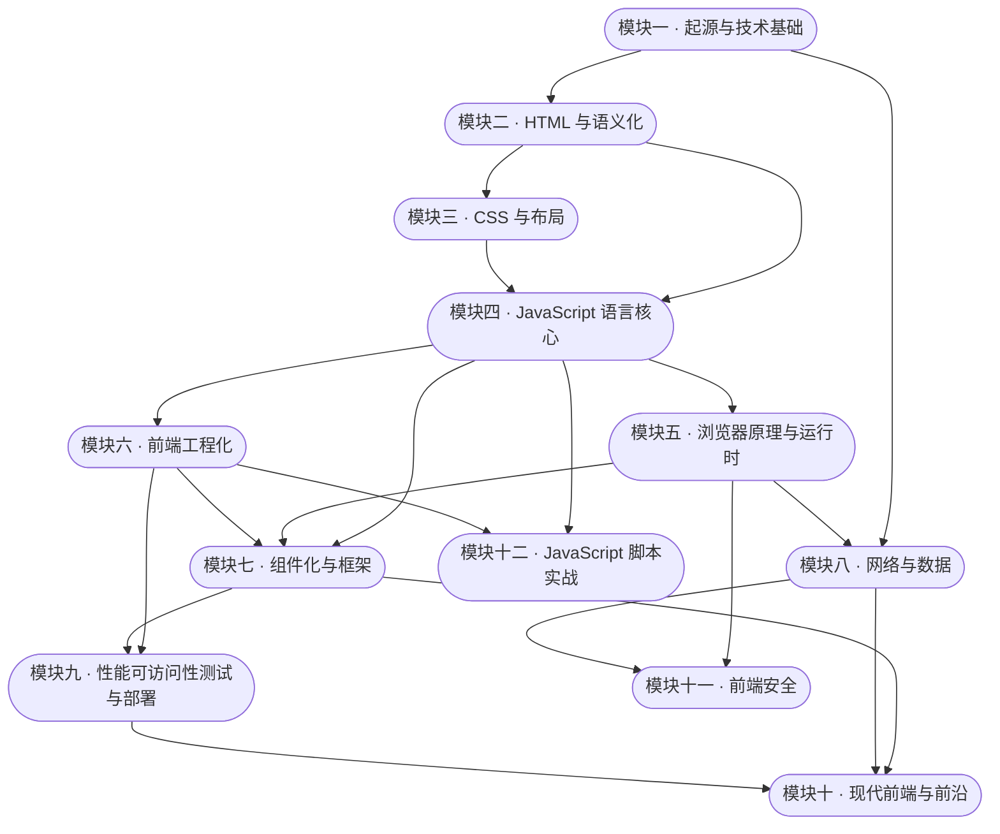

# Web 前端技术 · 自学版

> **一句话**：这是《Web 前端技术》（96 学时）的**自学版**——把教师版的十份教案重写成一个人也能独立走完的讲义：每篇都有心智模型、精讲、能自测的动手任务、带答案解析的自测题和自查清单。
> **读者**：计算机 / 软件专业本科生水平，一个人学、没有人讲、没有人判卷。
> **和前两个区的关系**：`教学/` 是**教师版**（教案、考核方案、实验指导、审核报告）；`Web前端/` 根下的 `01–05` 是更早自己学的那条**简版路线**；**本区是完整的那条**——按模块一到模块十顺序走完，等于把整门课自学一遍。

## 0. 怎么用（四步循环）

1. **读**：按顺序读十二篇讲义（模块一 → 模块十二），每篇开头先看「学完你能」和「前置」；前置没学完**不要跳**。
2. **做**：每篇 §4 的动手任务**必须真做**——它的「验收标准」是逐条可勾的，能自己判定做对没有。
3. **测**：每篇 §5 自测。客观题**先自己作答，再展开折叠的答案与解析**；动手题只给验收标准与评分点，实现由你自己写。
4. **勾**：§6 自查清单全勾上再进下一篇；勾不上就回到 §2 对应小节重读（清单每条都写明了对应哪节）。

> 遇到「照做但不生效」：先按 §6 的快捷键速查打开 DevTools（**F12**），到 **Console** 看报错、到 **Network** 看请求的真实状态码与响应头——**大部分前端疑难都能在这两栏里找到线索**。

## 1. 学习地图（十一模块）



**图 1** —— 箭头表示「左边必须在右边之前学」；不是学时先后。

| 模块 | 名称 | 建议自学时长 | 前置 | 讲义 |
|---|---|---|---|---|
| M1 | Web 的起源与技术基础 | 6–8 h | — | [[01-模块一 Web 的起源与技术基础]] |
| M2 | HTML 与语义化 | 5–6 h | M1 | [[02-模块二 HTML 与语义化]] |
| M3 | CSS 与布局 | 10–12 h | M2 | [[03-模块三 CSS 与布局]] |
| M4 | JavaScript 语言核心 | 10–12 h | M2、M3 | [[04-模块四 JavaScript 语言核心]] |
| M5 | 浏览器原理与运行时 | 9–10 h | M4 | [[05-模块五 浏览器原理与运行时]] |
| M6 | 前端工程化 | 8–10 h | M4 | [[06-模块六 前端工程化]] |
| M7 | 组件化与框架 | 12–14 h | M4、M5、M6 | [[07-模块七 组件化与框架]] |
| M8 | 网络与数据 | 7–8 h | M1、M5 | [[08-模块八 网络与数据]] |
| M9 | 性能、可访问性、测试与部署 | 9–10 h | M6、M7 | [[09-模块九 性能可访问性测试与部署]] |
| M10 | 现代前端与前沿 | 6 h | M7、M8、M9 | [[10-模块十 现代前端与前沿]] |
| **M11** | **前端安全（OWASP × ATT&CK）** | **6–8 h** | **M2、M4、M5、M8** | **[[15-模块十一 前端安全]]** |
| **M12** | **JavaScript 脚本实战（Node 与浏览器）** | **8–10 h** | **M4、M6** | **[[16-模块十二 JavaScript 脚本实战]]** |

> 学时栏是**教师版的授课学时**（合计 96：讲授 64 + 实验 32）。自学按上面右列的**建议自学时长**安排即可——自学没有课表，只有前置顺序是硬的。

## 2. 每篇的固定结构（知道哪一节该什么时候看）

| 节 | 内容 | 什么时候看 |
|---|---|---|
| 文首 | 一句话 · 自学时长 · 前置 · 学完你能 | 开始前 |
| §1 心智模型 | 本模块的全貌图 + 一段白话 | 开始前，建立框架 |
| §2 精讲 | 逐节推进，每节带 ⏱ 建议时长与一个「自检」小问题 | 主体，慢慢读 |
| §3 关键概念讲透 | 最容易「以为自己懂了」的点：误解 → 正确理解 → 反例 | 读完 §2 后 |
| §4 动手 | 任务 + 需要什么 + 验收标准 + 卡住了看 | 必须真做 |
| §5 自测 | 客观题（折叠答案与解析）+ 动手题（只给验收标准） | 做完动手后 |
| §6 自我检查清单 | 逐条可勾，能自己判定 | 进下一篇前 |
| §7 出处与依据说明 | 有官方依据 / 属编排判断 / 不确定项 | 想追问「凭什么」时 |

## 3. 答案口径（这套的规矩，先看清）

- **客观题（选择 / 判断 / 填空）**：题干后紧跟一个**可折叠**的答案块。请**先自己作答再点开**——点开看到的是「为什么是这个、其它为什么错」。
- **动手题 / 编程题**：**只给验收标准与评分点，不给实现**。这不是藏私——能照着抄的实现学不到东西，而验收标准能让你自己判断「做对了没有」。
- **如果你判断某条答案要点有问题**：以你**实测或查到的一手来源**为准，并在旁边写一句「我的判断 + 依据」。这门课训练的就是这件事：**来源冲突时能说明为什么选这个**。
- 讲义里出现的所有版本号都在课程统一的**版本白名单**内（22 项，取自 2026-10-01 实测）；白名单外的工具只写名字、不给版本。

## 4. 环境准备（本机实测，2026-10-01）

| 工具 | 本机版本 | 用途 | 怎么确认 |
|---|---|---|---|
| Node.js | **v26.7.0** | M6 起：工程化、构建、测试；M12 起：脚本实战 | `node -v` |
| npm | **11.19.0** | 装包 | `npm -v` |
| Git | **2.53.0** | M6：版本管理 | `git --version` |
| Chrome | 本机已装 | 全课程：DevTools、调试、性能 | 地址栏输 `chrome://version` |

- **M1–M4 只需要一个浏览器和一个编辑器**，不必等环境装齐就能开始。
- 装包遇到网络慢属正常；**不要为了让命令跑通去装白名单外的工具**。

## 5. 建议节奏（三选一，随时可换）

| 节奏 | 适合 | 每周投入 | 走完大约 |
|---|---|---|---|
| 紧凑 | 假期集中攻 | 16 h（约 3 个半天） | 6 周 |
| 常规 | 边上课边学 | 8 h | 12 周 |
| 宽松 | 碎片时间 | 4 h | 24 周 |

**唯一硬要求**：前置没学完不要跳模块——尤其 M4 之前别碰 M7。

## 6. 工具与快捷键速查（Windows）

| 想干什么 | 怎么做 |
|---|---|
| 打开开发者工具 | **F12** 或 **Ctrl+Shift+I** |
| 直接打开 Console | **Ctrl+Shift+J** |
| 用鼠标选页面元素 | **Ctrl+Shift+C**（在页面上点元素） |
| 强制刷新（绕过缓存） | **Ctrl+Shift+R** |
| Network 面板开始/停止录制 | **Ctrl+E** |
| Network 面板搜请求头 | **Ctrl+F** |
| 清空 Console | **Ctrl+L** |
| 全屏截图（DevTools 里） | **Ctrl+Shift+P** → 输入 screenshot |

## 7. 资料总表（★ = 优先看）

| 层级 | 站点 | 用来 | ★ |
|---|---|---|---|
| 规范 | [W3C](https://www.w3.org/TR/) | 标准列表与推荐标准 | ★★★ |
| 规范 | [WHATWG HTML Living Standard](https://html.spec.whatwg.org/multipage/) | HTML 的现行标准 | ★★★ |
| 规范 | [IETF RFC 索引](https://www.rfc-editor.org/rfc/rfc9110.html) | HTTP 语义 | ★★ |
| 文档 | [MDN Web Docs](https://developer.mozilla.org/zh-CN/docs/Learn_web_development) | 日常查概念与 API | ★★★ |
| 文档 | [Chrome DevTools 文档](https://developer.chrome.com/docs/devtools/) | 调试、性能、网络 | ★★★ |
| 文档 | [web.dev](https://web.dev/articles/vitals) | 性能指标口径 | ★★ |
| 工具 | [Vite](https://vite.dev/guide/) · [Vitest](https://vitest.dev/guide/) · [Playwright](https://playwright.dev/docs/intro) | 构建与测试 | ★★ |
| 工具 | [Vue](https://cn.vuejs.org/guide/introduction) · [React](https://zh-hans.react.dev/learn) | 框架 | ★★ |
| 二手 | [ES6 入门教程](https://es6.ruanyifeng.com/) · [现代 JavaScript 教程](https://zh.javascript.info/) | 讲法友好的复习（**二手，不作裁定依据**） | ★ |

> 本表链接均实测可取出正文（2026-10-01）。**W3C 与 npm 对脚本访问会返回 403**，那是反爬，手工用浏览器打开正常——遇到 403 别以为是坏链。

## 8. 学习纪律（本区自己的规矩）

1. **动手必须真做**，验收标准逐条勾；没做的勾不算数。
2. **客观题先答后看**，点开答案前先把理由写出来。
3. 版本号、规范状态**一律以实测与一手来源为准**；不写「截至某年最新」这类无法核查的话。
4. **不确定就写不确定**——模块十会明确标出「截至 2026-10-01 的判断」。
5. **AI 可以帮你，但你必须审**（能做什么 / 必须审什么 / 诚信要求见模块十）。

## 9. 产物与进度表（自己填）

| 模块 | 我的产物（代码 / 笔记 / 截图） | 自查清单已勾完 | 日期 |
|---|---|---|---|
| M1 | | ☐ | |
| M2 | | ☐ | |
| M3 | | ☐ | |
| M4 | | ☐ | |
| M5 | | ☐ | |
| M6 | | ☐ | |
| M7 | | ☐ | |
| M8 | | ☐ | |
| M9 | | ☐ | |
| M10 | | ☐ | |
| M11 | | ☐ | |
| M12 | | ☐ | |

## 10. 文件结构

```
Web前端/自学版/
├── 00-自学指南.md          ← 本文件（入口）
├── 01-模块一 …md  …  10-模块十 …md  ·  15-模块十一 前端安全.md  ·  16-模块十二 JavaScript 脚本实战.md   ← 十二篇自学讲义
├── 11-自测与进度检查.md     ← 自测怎么用、怎么判"这遍学到位了"
├── 12-动手项目（自学版大作业）.md  ← 结课项目：任务 + 里程碑 + 验收标准
├── 14-技术脉络 从静态页到前端工程.md  ← 服务端动态页(CGI/SSI/PHP/ASP/JSP)、JS 与 Ajax、TS 与工程化、静态回归的完整来龙去脉
├── 13-资料与操作速查（全可点）.md  ← 一页集齐资料与操作步骤
└── figs/                    ← 几何图（SVG）与截图
```

## 11. 与其它内容区的边界

- **`教学/`（教师版）**：考核方案与评分量规、期末样卷与答案要点、教学日历与开场钩子、板书设计、材料审核报告——**自学这条线不需要看**，只有你要出题或讲课时才用。
- **`Web前端/` 根的 `01–05`**：更早自己学的四阶段简版路线，可当本套的前置复习或快速回顾。
- **其它笔记区**（平台课程、订阅内容等）：与本区各自独立、互不混。

## 12. 依据说明

- **有官方依据的部分**：每篇涉及的技术概念、规范状态、API 行为，出处见该篇 §7 的出处表（只引规范与官方文档；二手资料会标明）。
- **属本人编排判断（无官方依据）**：模块划分与建议自学时长、三种节奏、"先答后看"的答案口径、每篇的节结构——这些是**学习编排**，不是标准要求。官方文档不规定一个人该怎么自学。
- **不确定项**：模块十的前沿内容有时效性（文中标注"截至 2026-10-01"）；少数规范状态在不同来源间存在冲突，讲义保留冲突而不强行统一成一句话——**这正是要练的判断力**。
