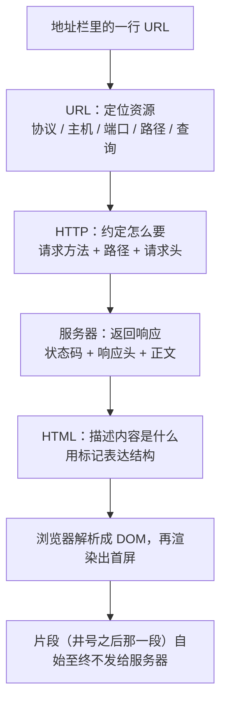
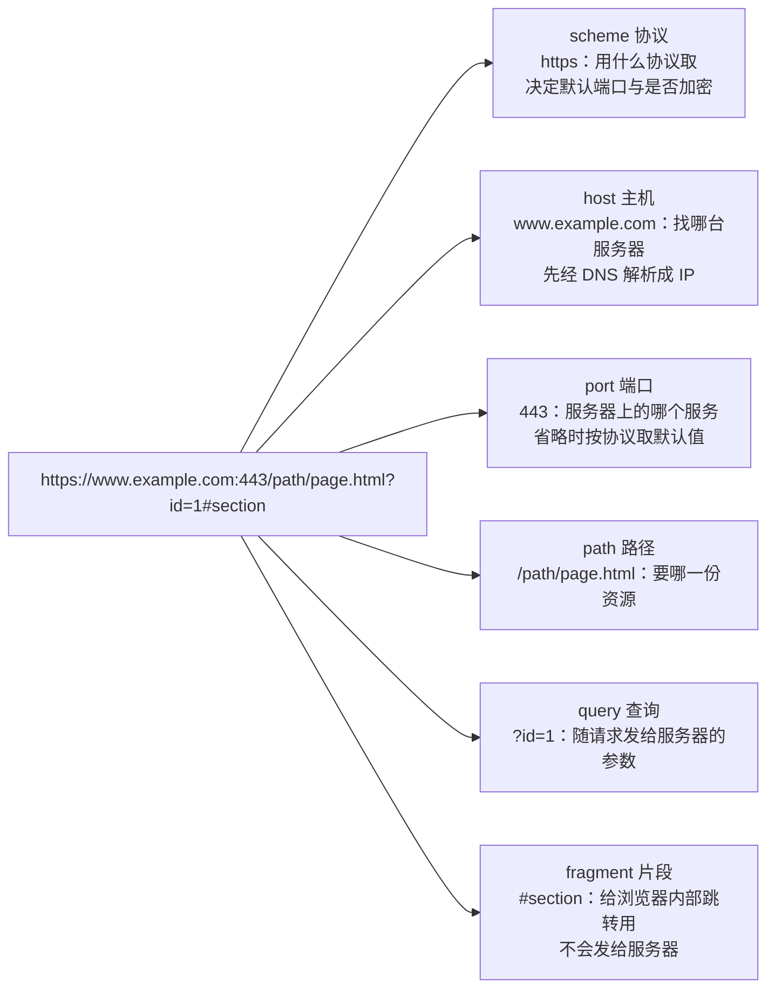
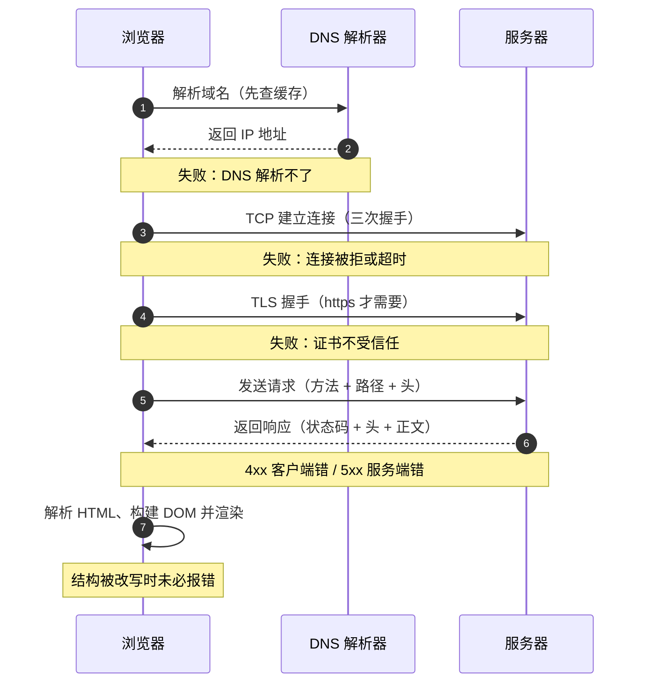

# 模块一 Web 的起源与技术基础

> **一句话**：网页不是"自然长出来的东西"，它是 1989 年为了让人重新找得到散落各处的文档而设计出来的一套分布式超文本系统——先把"它当年要解决什么问题"搞清楚，后面每一层"为什么要这样"才答得上来。
> **自学时长**：建议 6–8 小时（可分 3 次学完） · **前置**：无
> **学完你能**：
> - 用一句话说清互联网与万维网的区别，并把一个真实 URL 拆成六段、指出其中哪一段不会发给服务器；
> - 在自己的浏览器里读出一份请求的方法、状态码、协议版本与关键头部，并说清 `file://` 与 `http://` 打开同一个文件的能力差别；
> - 搭好本课程的最小环境，把本机的一个 HTML 文件变成同一局域网内手机能打开的网址，并给每条技术史结论附上可核查的来源。

## 1. 心智模型

整个模块其实只回答一条链子上的问题：**你在地址栏里敲的那一行字，是怎么变成屏幕上那一页的？** 先看全貌图。



> **图 1**：URL、HTTP、HTML 在一次页面请求里的分工——URL 说「在哪」，HTTP 说「怎么要」，HTML 说「拿到的是什么」。
> **看图要点**：地址栏里输入的那一行就是 URL；请求按 HTTP 的规则发出；响应正文通常就是 HTML，浏览器把它解析成 DOM 才有页面。
> 这张图在说什么：一次"打开网页"是四件事接力——**定位**（URL）、**约定**（HTTP）、**供给**（服务器）、**表达**（HTML），最后再加上浏览器的解析与渲染。本模块就是把这条链子拆开：它从哪来（2.1–2.2）、各环怎么接（2.3–2.4）、页面成品从哪来（2.5）、打开方式为什么有讲究（2.7），以及在这条链子上该怎么老实交代资料来源（2.6）。

用一句白话概括：**Web 是一套"互相指着对方"的文档 + 一套"怎么把文档要过来"的约定 + 一台愿意把文档递出来的机器。** 三者缺一，今天这种"点一下就跳过去"的体验就不存在。历史上它们不是同时出现的：文档互联的想法更早，网络基础设施更早，真正把它们拼成一个能跑的系统才是 1989 年那件事。

## 2. 精讲（按节推进）

### 2.1 万维网之前：互联网、超文本、文档灾难  ⏱ 约 40 分钟

**是什么。** 这里要先分清两个东西：

- **互联网是基础设施**——它解决的是"网络与网络怎么互联"，工作在网络传输层及以下。电子邮件、文件传输、域名系统都比万维网出现得更早，而且今天仍然活着。
- **万维网是应用**——它跑在互联网之上，用 HTTP 取文档、用超文本把文档互相连起来。

两者不是同义词，也不是兄弟关系，而是**底座与上层建筑**的关系。

**为什么先讲这个。** 因为一个最常见的误解是"上网就是打开网页"。事实上你可以完全不碰网页而正常使用互联网：`nslookup` 一个域名能返回 IP 地址，收邮件、传文件也一样能工作。反过来不成立——万维网必须有网络与寻址作底座才能跑。

顺手可以这样验证：在 Windows 上按 `Win+R` 输入 `cmd` 打开终端，运行 `nslookup example.com`。你会看到域名被解析成 IP 地址，而整个过程没有打开任何网页。这就是"域名系统早于万维网，且不依赖万维网"的直接证据。

**超文本的想法更早。** "把文档之间用链接连起来、让读者跳着读"这个构想不是 1989 年才有的。真正属于 Tim Berners-Lee 的贡献，是把**超文本 + 互联网地址 + 客户端-服务器**这三件已经存在的东西拼成了一个能跑起来的系统。

**他当年要解决的具体问题，很重要。** 1989 年 3 月，在瑞士 CERN 工作的 Tim Berners-Lee 提交了一份备忘录《Information Management: A Proposal》。它要解决的不是"做一个漂亮网页"，而是 CERN 内部实实在在的**文档灾难**：几万台设备、几万名研究员，文档格式与存放位置五花八门，人员一流动，信息就跟着失传，换个人接手就找不到东西。他提出的方案是**分布式超文本**——文档之间用链接互相指向，读者点一下就跳过去。

所以万维网的第一性目标是：**让人能找到并打开别人放的文档**。"漂亮的界面"是后来才长出来的东西，不是设计的起点。

把握年代时请连同出处级别一起记（年份与事件取自 [[16-技术演进时间线]]，级别标注照抄，不得改写）：

| 时间 | 事件 | 级别 |
|---|---|---|
| 1989-03 | 在 CERN 提交《Information Management: A Proposal》，提出分布式超文本方案 | 【一手】 |
| 1989-03-12 | 提案的具体提交日 | 【存疑】——提案原文**只写 "March 1989"**，"3 月 12 日"出自后来的回忆性材料 |
| 1990-11 | 项目正式定名 World Wide Web，代号 W3 | 【二手】 |
| 1990-12 | 第一台 Web 服务器（CERN httpd）与第一个浏览器（WorldWideWeb）完成；首个网页发布 | 【二手】 |
| 1991-08 | 项目摘要在新闻组 alt.hypertext 公开，Web 走出 CERN | 【二手】 |
| 1993 | 浏览器源码公开，Mosaic 出现（图形化浏览器使普通用户能上手） | 【二手】 |

**一个容易被忽略的事实：第一版浏览器同时是编辑器。** WorldWideWeb 既能读也能写页面。这不是技术局限，而是因为最初的使用者是研究者——他们既要找别人的文档，也要放自己的文档。把它想成"纯浏览工具"是后人的窄化。

**哪里会错。** 两个高频错误：一是把"上网"等同于"打开网页"；二是以为浏览器是"互联网的窗口"。浏览器只是运行在互联网之上的**一个程序**，它不拥有互联网。

> **自检**：`nslookup` 能正常返回结果，但所有网页都打不开。此时能不能说"网络断了"？（答：不能。域名解析属于互联网基础设施，它还能工作，说明问题更可能出在应用层或更上层，比如 DNS 之后的连接、证书，或者服务器自己返回了 4xx/5xx。）

### 2.2 标准化史与三次教训  ⏱ 约 45 分钟

这一节只讲三个转折，但每个都值得问一句：**如果不标准化，代价由谁承担？**

| 转折 | 发生了什么 | 代价 / 教训 |
|---|---|---|
| **浏览器战争与私有扩展** | 1990 年代中期各家浏览器各自加特性，同一段 HTML 在不同浏览器里表现不同 | 开发者要写多套代码；催生了后来的兼容层类库（jQuery 于 2006-01-14 发布就是这段历史的产物）。**教训：没有标准，成本会转移到每一个开发者身上** |
| **XHTML 的严格路线受挫** | 2000-01-26 XHTML 1.0 成为 W3C 推荐标准，要求文档严格合法 | 现实网页大量不合规，严格性把规范推离了实践。**教训：规范必须贴着现实实现走，否则会被绕过** |
| **WHATWG 与 Living Standard** | 2004 年多家浏览器厂商成立 WHATWG，走"先实现、后标准化、持续更新"的路线；HTML5 于 2014-10-28 成为 W3C 推荐标准；2019-05-28 W3C 与 WHATWG 签署备忘录，HTML 的权威版本归 WHATWG 的 Living Standard | **教训：标准的形态本身是博弈的结果**，"现在到底以哪一份为准"是必须会查的问题 |

以上三个转折的年份与事件同上取自 [[16-技术演进时间线]]。注意各级别标注：XHTML 1.0（2000-01-26）与 HTML5 推荐标准（2014-10-28）是**【一手】**；WHATWG 成立（2004）与 W3C/WHATWG 备忘录（2019-05-28）是**【二手】**；jQuery 发布（2006-01-14）是**【一手】**。引用时按级别说话。

另外三个同期节点，帮你把时间轴钉牢（同样照抄级别）：1996-05 HTTP/1.0 发布为 RFC 1945（Informational，非标准轨）**【一手】**；1996-12-17 CSS1 成为 W3C 推荐标准 **【一手】**；1997-06 ECMA-262 第 1 版通过，这是 JavaScript 的第一次正式标准化 **【一手】**。

**为什么 XHTML 会受挫。** 从规范制定者的角度，严格合法（标签闭合、大小写敏感、属性带引号）意味着"从纯洁出发"，文档结构清晰、可被机器可靠处理。但从网页作者的角度，现实世界里大量网页并不合规，一个错就让整页解析失败，成本完全落在作者身上；浏览器为了生存继续各写各的容错逻辑，规范于是被绕过。后来 WHATWG 的路线把"解析器遇到错误该怎么恢复"直接写进规范——**不是禁止犯错，而是规定犯错之后怎么办**。

**为什么"浏览器支持"不等于"是标准"。** 这是两件需要分别查的事：规范状态（Working Draft / Candidate Recommendation / Recommendation / Living Standard）回答"这份文档成熟到什么程度"；浏览器实现状态回答"这个能力实际能用了吗"。两者各自变化，谁也不自动推出谁。可以现场对一对：打开 WHATWG 的 HTML 现行标准（`html.spec.whatwg.org` 的 multipage 页面）与 W3C 的规范索引页（`www.w3.org/TR/`），看同一话题在两处的表述和状态标注有什么不同，也顺便认识一下"规范文档带状态字段"这件事。

**标准对厂商是纯好事吗？** 不是。标准化降低互操作成本、把市场做大，但同时限制了厂商用私有特性锁定用户的可能。所以标准是协商产物，不是行政规定。

**哪里会错。** 认为"标准就是官方规定、大家都得听"；把某个博客里的一句话直接当成规范；或者反过来，觉得"不合规的东西活不下来"——事实正相反，不合规的网页活得很好，是规范被逼着贴向现实。

> **自检**：某浏览器已经默认支持某个新特性，能不能据此说"它已经是正式标准"了？（答：不能。要分别查规范状态字段与实现情况。）

### 2.3 客户端-服务器模型与三层结构  ⏱ 约 40 分钟

**请求-响应模型。** 浏览器是**客户端**：它主动发请求。服务器是**服务端**：它收到请求后回响应。两人之间约定的是**协议**，不是文件路径。这句话推出一条关键事实：

> 服务器**不知道你的电脑上有什么文件**。

你在本地双击打开一个 HTML，浏览器直接读你的磁盘，中间没有服务器、没有 HTTP 语义；通过服务器打开，是"我把文件放在那台机器上、你来要"。**这两件事在能力上差别很大**，2.7 会专门讲。

**三层结构。** 一个页面的职责被拆成三层：

- **结构**：HTML，管"内容是什么"
- **表现**：CSS，管"长什么样"
- **行为**：JavaScript，管"交互怎么响应"

注意这是**职责分离**，不是**文件分离**。实践中一个组件完全可以把三者写在一起，只要边界清楚、你知道哪一段属于哪一层。反过来，把表现（颜色）写进结构（HTML 的 `style` 属性）就是把两层搅在一起——它能跑，但改起来会变得非常贵。

**"前端"这个词的边界。** 跑在浏览器里的部分叫前端。但前端的正确性依赖服务端返回什么，所以只学浏览器不够——HTTP 的细节与跨域问题属于后面的模块（M8），这里先建立"前端不是孤岛"的意识。

用一句话记住请求-响应的方向：`浏览器 --请求--> 服务器 --响应--> 浏览器`，而**这一层就是 HTTP**。

**哪里会错。** ①把"服务器"想成某种特殊机器——它其实只是一台运行着服务程序的普通计算机；②把所有东西塞进一个文件里，结构、表现、行为全糊在一起。

> **自检**：把颜色写进元素的 `style` 属性，违反的是哪一条原则？（答：结构里不要写表现，即关注点 / 职责分离。）

### 2.4 URL 与一次 HTTP 往返的解剖  ⏱ 约 60 分钟

**URL 的六段结构。** 拿一个真 URL 举例：`https://www.example.com:443/path/page.html?id=1#section`。



> **图 2**：一个 URL 的六段结构，以及每一段在请求里各自承担什么职责。
> **看图要点**：只有 fragment 这一段不参与请求；查询字符串会发给服务器，片段只留给浏览器自己。
> 这张图在说什么：URL 不是一坨字符串，而是六段有明确分工的字段拼起来的。看懂分段，才能预判"哪一段会出现在服务器日志里、哪一段不会"。

最容易被忽略的是最后一段：**片段（`#` 之后）不会发给服务器**。它只用于浏览器内部的文档内跳转，服务器根本收不到它。所以"我把参数写在 `#` 后面，后端怎么拿不到"这类问题，答案就在这张图里。

**一次往返经过哪些环节。** 顺序是：解析域名 → 建立连接（含 TLS 握手，这里只作定性了解）→ 发送请求（方法 + 路径 + 头部）→ 服务器处理 → 返回响应（状态码 + 头部 + 正文）→ 浏览器解析并渲染。



> **图 3**：一次 HTTP 往返的完整时序，以及每一步失败时你在页面上看到什么。
> **看图要点**：DNS、TCP、TLS 三步都发生在请求报文发出之前——Network 面板里看不到它们，所以「网页打不开」要先分清是基础设施问题还是应用层问题。
> 这张图在说什么：把"打不开"这三个字拆成五种可能。每一步失败的可见症状在这里：①「解析域名（先查缓存）」是先查浏览器与系统缓存，失败时页面报「无法访问此网站」；② TCP 连接被拒或超时，页面会一直转圈直到报「连接超时」；③ TLS 证书不受信任，浏览器先给一个安全警告页；④ 状态码 4xx 是客户端错、5xx 是服务端错，页面显示的其实是服务器给的错误内容；⑤ 解析与渲染被容错改写或渲染异常时，页面看着"不对劲"却未必报错。

**状态码分类。** 记住分类比背清单有用：

| 段 | 含义 | 谁的问题 |
|---|---|---|
| 1xx | 信息 | 中间状态，少见 |
| 2xx | 成功 | 200 请求成功 |
| 3xx | 重定向 | 301 永久移动、304 资源未改变可用缓存 |
| 4xx | 客户端错 | 404 资源不存在 |
| 5xx | 服务端错 | 500 服务器内部错误 |

**304 不是错误**，它表示"资源没变，用你本地的缓存就好"——这是省流量、也是页面加载快的原因之一。细节机制留到 M8，本模块只需要能分清"这是谁的问题"。

**协议版本。** 在开发者工具里你能直接看到 `http/1.1`、`h2`、`h3` 三种标记，它们对应后续要讲的演进（HTTP/3 的规范是 RFC 9114，见 `www.rfc-editor.org`）。

**动手看一眼。** 打开开发者工具（按 `F12` 或 `Ctrl+Shift+I`），顶部切到 **Network**（中文界面叫「网络」），勾上「保留日志 / Preserve log」，按 `F5` 刷新一个真实网站，点开第一个文档请求，逐项认：Request Method、Status Code、Request Headers（Host / User-Agent / Accept / Cookie）、Response Headers（Content-Type / Cache-Control / Set-Cookie）、以及协议版本那一列。再用终端 `curl -I https://example.com` 复现同一个请求，对着两份头部看**哪些一致、哪些不一致**。最后把 URL 后面加上 `#abc` 再请求一次，你会看到片段根本不出现在请求里。

**哪里会错。** 把 404 当成"网络断了"；以为 `#` 后面的参数会传给后端；以为响应头不重要——实际上缓存、跨域、Cookie 全靠它。

> **自检**：`https://example.com:8443/docs/page.html?v=2#top` 里，哪一段不会出现在请求报文里？（答：`#top`，片段只供浏览器内部跳转。）

### 2.5 浏览器、渲染引擎与站点发布的最小闭环  ⏱ 约 40 分钟

**渲染引擎。** 不同浏览器背后有不同的渲染引擎，它们的行为差异正是 2.2 那场标准化史的现实来源。这里只要求定性地知道"引擎与浏览器种类有对应关系"，不必背版本号。

**浏览器拿到 HTML 之后做的六件事**：解析 HTML → 构建 DOM → 计算样式 → 布局 → 绘制 → 合成。这里只给你流程与直觉，原理细节在后续模块（M5）。现在要带走的是一个对比：

- 「查看网页源代码」（在地址栏前面加 `view-source:`）看到的是**服务器发来的源码**；
- 开发者工具的 **Elements** 面板看到的是**已经被浏览器解析、可能被 JavaScript 改过**的 DOM。

两者不一样是正常现象，不是 bug。源码 ≠ DOM。

**站点发布的最小闭环。** 这四个动作就是"发布"的全部：

1. 在本地写一个 HTML 文件；
2. 用一个静态服务器把所在目录挂出来；
3. 访问这台机器的地址 + 端口；
4. 别人能打开它。

最省事的起法是用 Python 自带的 `http.server`：打开终端 → `cd` 到页面所在目录 → 运行 `python -m http.server 8000` → 浏览器访问 `http://127.0.0.1:8000/`。

**注意最后一步的坑**：`127.0.0.1` 是回环地址，只有这台机器自己访问得到。想让手机打开，一是服务器要监听所有网卡（不能只绑回环地址），二是你得知道这台机器在局域网里的 IP，然后用那个 IP + 端口去访问。测不通的第一件事就是检查这两条。

**关于"部署"。** 提到把站点放到托管平台时，先建立这个认识：它本质上仍然是"把文件放到一台能被公网访问的服务器上"，只是别人替你做了机器、域名和证书这些事。框架与构建工具是后来的事，本课程坚持地基优先，这一步不引入任何框架。

**哪里会错。** 服务只绑 `127.0.0.1` 却以为手机能访问；把浏览器缓存导致的"改了没生效"当成代码错误（先硬刷新一次 `Ctrl+F5` 再怀疑代码）。

> **自检**：为什么 Elements 面板看到的和 `view-source:` 看到的不一样？（答：一个是解析后的 DOM，一个是服务器发来的源码；JavaScript 可以改 DOM。）

### 2.6 工程伦理与学术诚信  ⏱ 约 25 分钟

这一节讲的不是道德口号，而是**技术材料是有来源的**这件事，以及怎么诚实地标出来。

**代码与资料的来源标注。** 借鉴了谁的代码、参考了哪篇文档、用了什么开源许可，都要写清楚。许可不兼容的代码不能直接抄进作业里——"我能跑"和"我有权用"是两回事。

**生成式工具的使用边界。** 可以用它解释报错、解释概念、检查自己的代码；**不能把它的产出直接当成自己的交付**。凡在作业里用了，就要在提交物里说明三件事：哪部分用了、用来做什么、自己做了哪些验证。最终对自己交付的东西负责。

**不确定的表达是被允许的。** 学术表达里，"我不确定，来源是 X，需要核实"完全可以接受；**编一个具体年份、人名或论文名来让论述完整，才是不可接受的**。这条在本课程里不是虚的，下面就有现成的例子。

**两个真实的来源冲突**（取自 [[16-技术演进时间线]] 第七节）：

1. **1989 年提案的具体日期**：原始文件只写 "March 1989"，"3 月 12 日"出自后来的回忆性材料。教训：**原始文件优先于回忆**；引"某一天"比引"某月"风险大得多。
2. **TypeScript 1.0 的发布日期**：公开来源分别给出 4 月 2 日与 4 月 12 日两个日期。教训：同一事实有多个二手版本时，要么找到一手发布说明，要么**照写两个来源并说明不一致**，不要各取一个数字。时间线因此在该条目上只写年份。

**遇到冲突时的正确做法**：说明冲突并给出各自来源，而不是挑一个看起来顺眼的。

**哪里会错。** 整段复制不注明；把"资料来源"写成"百度一下"；把不确定的史实编圆——最后这一条在自测里是直接判零的处理。

> **自检**：作业里用了别人的一段代码，怎么算合规？（答：注明来源与许可，说明自己改了什么，不把它说成自己写的。）

### 2.7 file:// 与 http://：同一个文件，两种世界  ⏱ 约 30 分钟

这是本模块最"动手"的知识点，也是后面很多"为什么不行"的根源。

同一个 HTML 文件，用两种方式打开，行为不同：

| | 双击文件 | 经本地服务器 |
|---|---|---|
| 地址栏 | `file:///…` | `http://127.0.0.1:8000/…` |
| 有服务器吗 | 没有，浏览器直接读磁盘 | 有 |
| HTTP 语义 | 没有状态码、没有响应头 | 有 |
| 脚本模块 / 跨域请求 | 受限，常常直接失败 | 可用（同源以内） |
| 别人能访问吗 | 不能 | 能（同一局域网内） |

**为什么会这样。** `file://` 下浏览器直接读你的本地磁盘，中间没有统一约定的那层——没有状态码告诉你"资源在不在"、没有响应头告诉浏览器"该不该缓存、是什么类型"、没有源（origin）的概念来判断跨域是否安全。所以浏览器出于安全考虑把很多能力锁掉了。

**这不是浏览器坏了**，是这套设计在保护你。判据很朴素：

> **地址栏里有没有 `http`，决定了很多能力能不能用。**

**"双击就能打开，所以不需要服务器"错在哪。** 错在把"看得见"当成了"全都能用"。屏幕上的字确实出现了，但那是因为 HTML 渲染不需要服务器；一旦你开始加载脚本模块、发跨域请求、让别人访问，缺的那一层立刻暴露。

**哪里会错。** 把 `file://` 下的各种报错当成代码写错了，花大量时间改代码——先确认打开方式。

> **自检**：同一份 HTML，本地双击打开时能正常显示，加一行脚本模块就报错；经服务器打开则正常。问题出在代码还是打开方式？（答：打开方式。`file://` 下模块加载受限。）

## 3. 关键概念讲透

下面四个点，都是"以为自己懂了"的重灾区。每条按**常见误解 → 正确理解 → 一个反例**拆。

### 3.1 万维网 ≠ 互联网

- **常见误解**：上网就是打开网页；万维网打不开等于网络断了。
- **正确理解**：互联网是网络的互联，是基础设施（传输层及以下）；万维网是跑在它之上、以 HTTP 与超文本为媒介的应用系统。把应用与基础设施分离，应用才能各自演进——邮件、域名系统、文件传输都不必为网页改版让路。
- **反例**：`nslookup` 正常工作、邮件照收，但某个网站返回 500——网络没断，是那个服务端出了问题。判据：**"网页打不开"不等于"网络断了"**，先分清是基础设施问题还是应用层问题。

### 3.2 客户端-服务器，与"服务器不知道你本地有什么"

- **常见误解**：双击 HTML 能打开，所以不需要服务器。
- **正确理解**：请求由客户端发起、资源由服务器提供，两者之间约定的是协议而不是文件路径。只有这样，一份内容才能被任意多的客户端访问，而不必把文件复制到每台机器上。`file://` 下浏览器直接读本地磁盘，没有服务器也没有 HTTP 语义，因此很多能力被限制——这不是"浏览器坏了"。
- **反例**：同一个 HTML，双击打开与经服务器打开，脚本模块、跨域请求的表现不同。判据：**地址栏里有没有 `http`**。

### 3.3 结构、表现、行为的职责分离

- **常见误解**：写了三个文件才算分离；或者"能跑就行，反正效果一样"。
- **正确理解**：分离是**职责**分离，不是**文件**分离。HTML 管内容语义、CSS 管外观、JavaScript 管交互；一个组件把三者写在一起仍然可以是好设计，只要边界清楚。三层各自可替换——换皮不动内容、改交互不重写样式。
- **反例**：把 `style="color:red"` 从 HTML 挪进样式表，页面外观一模一样，但可维护性完全不同了。判据：**"改这个颜色，我要动几个文件？"** 答案应该是"一个样式文件"，而不是"所有页面"。

### 3.4 标准的形态：Recommendation 与 Living Standard

- **常见误解**：标准就是官方规定、大家都得听；浏览器都支持了就等于正式标准。
- **正确理解**：标准文档有阶段（工作草案 / 候选推荐 / 推荐标准），也有的形态是"永不冻结、持续更新"（Living Standard）。冻结的规范稳定但滞后于实践，持续更新的规范贴近现实但难以引用"第几版"。而且——规范状态回答的是"这份文档成熟到什么程度"，不直接等于"浏览器实现到什么程度"，两者要分别查。
- **反例**：HTML 的权威版本现在是 WHATWG 的 Living Standard，而 W3C 的历史推荐标准页仍然在网上可访问，两者并存却不冲突。判据：**引用前先看状态字段**；引用后写清是哪一份、什么状态、什么日期。

## 4. 动手（自学版实验）

### 动手一：环境体检与最小页面发布

- **要做什么**：① 装齐并**报出版本号**：编辑器、现代浏览器（含开发者工具）、版本控制工具、Node 运行时（从 `nodejs.org` 装 LTS 版，装完在终端跑 `node -v` 与 `npm -v` 验证）；② 写一个语义正确的最小页面，含标题与一段正文、一张带替代文本的图片；③ 分别用双击（`file://`）与本地服务器（`http://`）打开它，**记录至少两处差异**；④ 让同一局域网内的另一台设备（手机即可）打开你的页面。
- **需要什么**：一台电脑、一部手机（连同一局域网）、浏览器开发者工具（按 `F12` 或 `Ctrl+Shift+I`）。起本地服务器：终端 `cd` 到页面目录 → `python -m http.server 8000` → 浏览器访问 `http://127.0.0.1:8000/`；手机访问要用本机在局域网里的 IP。更多命令见 [[21-操作与资料速查（全可点）]]。
- **验收标准**：□ 能随口说出四个工具各自的版本号；□ 能指出两种打开方式的两处差异**并说清原因**（不是只写"打不开"）；□ 替代文本描述的是图片内容而不是文件名；□ 另一台设备确实打开了页面（留截图）；□ 能口头说清"为什么必须用服务器方式"。
- **卡住了看**：2.7（两种打开方式的差别）、2.5（起服务器与局域网 IP）、2.3（结构/表现/行为分离）。

### 动手二：一次请求的完整解剖

- **要做什么**：① 用本地服务器访问自己的页面（**不要用 `file://`**），按 `F12` → Network → `F5` 刷新抓到首屏请求；② 逐行抄下并解释请求头与响应头，标出协议版本（是 h2 还是 h3）；③ 用终端 `curl -I <网址>` 复现同一请求，列出两份头部的**哪些一致、哪些不一致**；④ 把 URL 加上一个 `#abc` 片段，验证片段不出现在请求里。
- **需要什么**：浏览器开发者工具、终端（Windows 10/11 自带 `curl`）、一个正在跑的本地服务器。
- **验收标准**：□ 请求的方法、状态码、协议版本、三个关键头部都抄下来并解释过了；□ 能指出 curl 与浏览器头部哪几行不同（例如 `Host`、`Date`、`Content-Length` 一类）；□ 片段不出现在请求里，且你能说出原因；□ 报告里每一行解释都不是"网上说"，而是指向 2.4 的图 3 或你自己的实测结果。
- **卡住了看**：2.4（往返时序图、状态码分类、头部认识）、2.5（起服务器）。

### 动手三：一条技术史说法的溯源判定

- **要做什么**：从下面三条说法里任选一条，判定真伪并给出**可核查的来源**：
  - 说法 A："万维网是 1991 年由美国人发明的。"
  - 说法 B："HTML 从一开始就是 W3C 制定的标准。"
  - 说法 C："浏览器支持某特性就说明它是正式标准。"
  结论后面必须跟上**来源分级**（一级规范 / 二级官方文档 / 三级教程 / 四级其他）；如果来源之间有冲突，把冲突写出来。
- **需要什么**：能打开 `www.w3.org` 的 1989 年提案页与规范索引页、`html.spec.whatwg.org` 的现行标准页；资料分级口径见 [[00-课程大纲]]。
- **验收标准**：□ 每条结论后面都有可核查来源；□ 至少一条结论引用的是规范或官方页面；□ 全文没有出现无出处的"网上说"；□ 如果遇到冲突，写的是冲突本身而不是挑一个。**注**：说法 A 的年份与国别都需要出处——提案是 1989-03 在瑞士 CERN 提交的【一手】，"1991 年"对应的是摘要公开、"美国人"与事实不符。
- **卡住了看**：2.1（起源史实与级别）、2.2（标准化的形态）、2.6（资料分级与冲突处理）、[[16-技术演进时间线]]。

### 动手四（选做）：用纯文本工具访问一次网页

- **要做什么**：用终端命令把某个网页的响应头取下来（例如运行 `curl -I https://example.com`），找出三件事：它的协议版本是什么、有没有缓存相关的头部、有没有设置 Cookie。写下你的观察。
- **需要什么**：终端与 `curl`，不需要浏览器。
- **验收标准**：□ 能列出响应头里与协议版本、缓存、Cookie 各相关的那几行；□ 能用一句话说清"网页不只是给浏览器看的"。
- **卡住了看**：2.4（头部与协议版本）、2.3（请求-响应模型）。

## 5. 自测

### 5.1 客观题（答案与解析在折叠块里）

**1.**（单选）关于互联网与万维网的关系，下列说法正确的是：
A. 互联网是网络的互联，万维网是跑在其上、以 HTTP 与超文本为媒介的应用系统
B. 万维网是基础设施，互联网是跑在它之上的应用
C. 没有万维网，域名解析与电子邮件就无法工作
D. 万维网与互联网是同一件事的两种叫法

> [!success]- 答案与解析
> **A**。互联网是网络互联的基础设施（传输层及以下），万维网是跑在其上的应用系统。B 把两者颠倒；C 与事实相反——域名解析、电子邮件都不依赖万维网；D 混淆了底座与上层。

**2.**（单选）最初那版浏览器被设计成"浏览器兼编辑器"，最合理的原因是：
A. 当时还没有服务器，页面只能本地编辑
B. HTML 当时还不支持只读展示
C. 最初的使用者是研究者，既要读文档也要写文档
D. 编辑器是浏览器厂商捆绑销售的结果

> [!success]- 答案与解析
> **C**。1990-12 完成的第一台服务器与第一个浏览器是同期做出来的（A 不成立），最初使用者是既要找文档也要放文档的研究者。"浏览工具"是后人的窄化。B、D 与史实无关。

**3.**（单选）给定 `https://example.com/docs/page.html?id=1#section`，其中**不会**出现在请求报文里的是：
A. 路径 `/docs/page.html`
B. 查询字符串 `id=1`
C. 主机 `example.com`
D. 片段 `#section`

> [!success]- 答案与解析
> **D**。片段（`#` 之后）供浏览器内部跳转，不参与请求；路径、查询串、主机都会出现在请求里。常见错误是"把参数写在 `#` 后面却盼着后端收到"。

**4.**（单选）关于状态码，下列说法正确的是：
A. 304 表示资源不存在
B. 4xx 表示服务端出错
C. 500 表示请求方法不被允许
D. 304 表示资源未改变，可直接用本地缓存

> [!success]- 答案与解析
> **D**。304 不是错误，而是"资源没变、用本地缓存"。A 把它当成错误；B 记反了——4xx 是客户端错、5xx 才是服务端错；C 的 500 属于服务端内部错误。

**5.**（单选）"浏览器都支持了某特性"与"它是正式标准"之间的关系是：
A. 前者成立则后者必然成立
B. 后者成立则所有浏览器实现必然一致
C. 两者是两件事，需要分别查实现情况与规范状态字段
D. 两者都只由厂商自行决定

> [!success]- 答案与解析
> **C**。实现状态与规范状态是两条独立的线：规范是 Recommendation 也不代表各浏览器实现一致，浏览器都支持也不等于规范已定稿。查法就是分别看实现情况和规范页上的状态字段。

**6.**（单选）关于作业中使用生成式工具，符合本课程规范的做法是：
A. 直接用其产出的代码作为交付，不必说明
B. 可以让它解释报错、检查代码，但必须说明用在哪、做了什么验证，最终成果由自己负责
C. 只要自己跑通就可以不声明
D. 一旦使用即视为抄袭

> [!success]- 答案与解析
> **B**。可以用它解释与检查，但必须声明使用范围与自己的验证内容，成果自负。A、C 违反声明义务；D 把"使用"与"冒名"混为一谈，本课程允许有边界的辅助。

**7.**（判断）万维网打不开，一定意味着网络断了。

> [!success]- 答案与解析
> **错误**。判据是"网页打不开不等于网络断了"。万维网只是互联网上的一个应用：域名解析、邮件、文件传输都可能在正常工作。要先分清是基础设施层还是应用层的问题——比如 4xx 明确是应用层/服务端给的响应，而不是断网。

**8.**（判断）把 CSS 写进元素的 `style` 属性里，违反了结构、表现、行为职责分离的原则。

> [!success]- 答案与解析
> **正确**。`style` 属性属于表现层，写进 HTML 就是把表现混进结构。改写方向是移进样式表——外观不变，可维护性变好。**只答"违反"却说不出"职责分离"不算过关。**

**9.**（填空）写出 URL `https://example.com:8443/docs/page.html?v=2#top` 的六个组成部分，并指出哪一部分不会出现在请求报文里、为什么。

> [!success]- 答案与解析
> 协议 `https`；主机 `example.com`；端口 `8443`；路径 `/docs/page.html`；查询字符串 `?v=2`；片段 `#top`。**不会发出的是片段 `#top`**——它只用于浏览器内部的文档内跳转，不参与请求报文。

**10.**（填空）写出 1xx–5xx 五段状态码各自的含义，并说明 200 / 301 / 304 / 404 / 500 分别表示什么。

> [!success]- 答案与解析
> 1xx 信息、2xx 成功、3xx 重定向、4xx 客户端错、5xx 服务端错。200 请求成功；301 资源永久移动（重定向）；304 资源未改变、可用本地缓存；404 资源不存在（客户端错）；500 服务器内部错误（服务端错）。**要点是记住分类能定位"找谁"，而不是背清单。**

### 5.2 动手题（不给实现，只给验收标准与评分点）

**1.** 搭好最小环境，写一个语义正确的最小页面，通过本地静态服务器发布，并让同一局域网内的另一台设备打开它。
- **验收标准**：语义元素使用正确（标题用标题元素、正文用段落）；图片的替代文本描述的是内容而不是文件名；页面标题与内容一致；服务器监听地址能对外（不只是 `127.0.0.1`），另一台设备确实打开并留有截图；提交物里说明了"为什么必须用服务器方式"。
- **评分点**：语义正确与替代文本质量占主要；可复现性（别人照你的记录能否做到）；差异与原因说明是否说清机理。**常见扣分**：只写"能打开"不说机理；替代文本抄文件名；服务只绑回环地址却称"已发布"；无证据。

**2.** 抓一次自己页面的真实请求，把请求头与响应头逐行列出并解释，标出协议版本；再用 `curl` 复现并列出两份头部的异同。
- **验收标准**：每条头部解释都对应实测或 2.4 的图；至少指出两处 curl 与浏览器头部的差异；协议版本（h2 / h3 / http/1.1）标注正确；片段不出现在请求中有实验记录。
- **评分点**：解剖的准确性；差异是否逐行对照（而不是笼统说"差不多"）；**是否出现无出处的"网上说"**。

**3.** 从说法 A / B / C 中选一条判定真伪，给出可核查来源与来源分级；有冲突就照写冲突。
- **验收标准**：结论 + 来源 + 级别三者齐全；至少一条结论引用规范或官方页面；没有无出处的"网上说"；遇到冲突时如实写出。
- **评分点**：判定是否正确；来源分级是否正确；对冲突的处理是否如实。**编造来源本题按零处理。**

**4.** 下面这段 HTML 能跑，但它违反了本模块讲过的若干条原则。逐条指出违反了什么，并给出改写方向（不要求完整代码）。
```html
<!-- 仅示形态 -->
<div style="color:#f00" onclick="alert(1)">
  <b>最新通知</b><br><br>点击查看
</div>
```
- **验收标准**：能指出 3 条及以上问题，且每条都点明"违反了哪一层"；改写方向具体到"移到样式表 / 改用标题元素 / 改用链接或按钮 / 间距交给 CSS"这类可执行动作。
- **评分点**：所指出的问题数与准确度；改写方向是否落到具体元素或具体层。**只写"不规范"不给分。**

**5.** 学到这里很容易冒出一个想法："我的页面双击就能打开，所以不需要服务器。"请给出两条反驳理由，并设计一个**能让你自己亲眼看到差别**的实验。
- **验收标准**：两条理由分别落在"缺少 HTTP 语义（没有状态码与响应头，跨域与模块加载受限）"与"服务器模式才能被别人访问，才是真正的发布"；实验设计必须用**同一份 HTML**分别以两种方式打开，且差异是肉眼或面板可观察的（例如 Network 面板里看不到请求、脚本模块加载失败）。
- **评分点**：理由是否说清能力差异而不只是断言；实验是否可复现、差异是否可观察。

## 6. 自我检查清单

- [ ] 我能一句话说清互联网与万维网的区别，并各举一个不属于万维网的例子
- [ ] 我能拆解一个真实 URL 的六个组成部分，并指出哪一部分不发给服务器
- [ ] 我能在开发者工具里读出一份请求的方法、状态码、协议版本与三个关键头部
- [ ] 我知道 4xx 与 5xx 分别该找谁的原因
- [ ] 我能说清 `file://` 与 `http://` 打开同一个文件的差别，并各举一例
- [ ] 我知道双击打开与用服务器打开，哪一种才是"发布"
- [ ] 我能说出标准化史上的三个转折，以及每个转折的教训
- [ ] 我知道规范文档有状态字段，并知道去哪里查它
- [ ] 我给出的每条技术史结论都能附上来源，并说出它属于哪一级资料
- [ ] 我遇到互相矛盾的资料时，会说"这里有冲突"，而不是随便挑一个
- [ ] 我知道作业里使用他人代码与生成式工具产出必须声明，以及如何声明

## 7. 出处与依据说明

### 7.1 有官方依据的部分

| 本模块小节 | 内容 | 出处 |
|---|---|---|
| 2.1 | 万维网起源与 1989 年提案原文 | [W3C 1989 年提案原页](https://www.w3.org/History/1989/proposal-msw.html) |
| 2.2 | HTML5 作为 W3C 推荐标准（2014-10-28）原文 | [W3C HTML5 推荐标准（2014-10-28）](https://www.w3.org/TR/2014/REC-html5-20141028) |
| 2.2 / 3.4 | 规范文档的形态、阶段命名与状态字段 | [W3C 规范索引](https://www.w3.org/TR/) · [WHATWG HTML 现行标准](https://html.spec.whatwg.org/multipage/)（**状态字段会变，引用时必须现查**） |
| 2.4 | URL 结构与各部分含义、HTTP 请求响应与头部、状态码分类 | [MDN HTTP 概览](https://developer.mozilla.org/zh-CN/docs/Web/HTTP/Guides/Overview) |
| 2.4 | 协议版本 h3 对应规范 RFC 9114 | [RFC 9114（HTTP/3）官方页](https://www.rfc-editor.org/rfc/rfc9114.html) |
| 2.3 / 2.5 | 结构与表现分离、学习路径与练习 | [MDN 学习 Web 开发](https://developer.mozilla.org/zh-CN/docs/Learn_web_development) |
| 2.5 / 动手一 | Node 运行时安装（LTS 版） | [Node.js 中文官网](https://nodejs.org/zh-cn) |
| 全模块 | 各技术版本号 | 2026-10-01 实测 [npm registry](https://registry.npmjs.org/)，口径见 [[00-课程大纲]] |
| 全模块 | 技术史年份、事件与来源分级（【一手】【二手】【存疑】） | [[16-技术演进时间线]]（逐条标注来源与存疑项，本文档逐字沿用） |

### 7.2 属本人编排判断（无官方依据）

- 本模块的**自学时长建议与各节 ⏱ 分钟数**、把"工程伦理与学术诚信"放在模块一而不是末尾的**位置选择**；
- **"先给心智模型全貌图、再逐节拆"的讲述顺序**，以及各节标题的组织方式；
- 动手任务与自测题的**验收标准、评分点与常见扣分口径**（含"编造来源按零处理"这类处理口径）；
- 自测题的**认知层次与难度**对应关系（沿用课程组题库的标注体系）；
- 模块间历史详略的分配（模块一讲全，后续模块只补自己那一块）；
- 2.1–2.7 里的白话解释与类比（如"底座与上层建筑""接力""把打不开拆成五种可能"）**均为本人为自学补写的白话**，教案原文中只有对应的知识点与史实，没有这些说法；
- 判据句（"网页打不开不等于网络断了""地址栏里有没有 http 决定了很多能力能不能用""改这个颜色要动几个文件""引用前先看状态字段"）是把教案中分散的要点压缩成的记忆锚点，属编排加工。

### 7.3 不确定项

- **W3C 与 WHATWG 各份规范的当前状态字段**：规范会改状态，本文档只训练"要点开页面现看状态字段"这个动作，不固化任何具体状态。引用时请现查。
- **技术史的具体日期**：1989 年提案的"3 月 12 日"标注为【存疑】，原始文件只写 "March 1989"；TypeScript 1.0 的发布日期各来源给出 4 月 2 日与 4 月 12 日两个版本，本文档因此只写年份。这两处都当作"来源冲突"处理，**不当确定事实使用**。
- **出处表里标【二手】的条目**（如 WHATWG 成立 2004、W3C/WHATWG 备忘录 2019-05-28）只能作线索，不能当判据引用；标【一手】的条目建议引用时写明访问日期。
- 本地静态服务器的起法（`python -m http.server`）依赖本机已装 Python；若未装，可改用任意等价的静态服务器，不影响本模块的判断标准。

## 安全视角

本模块讲「HTTP 无状态、Web 生来没有内建身份校验」——这条设计史遗留的直接后果是：**会话与鉴权只能由应用自己补**，补不好的环节就是攻击面。

- 匿名可寻址：URL 即资源定位，任何来源都能构造请求，所以「能发出请求」永远不等于「已授权」——**权限判定只许在服务端逐请求做**。
- 「服务器不知道你本地有什么」在安全上等价于「服务器也不能相信请求里任何来自浏览器的字段」：前端校验是体验，服务端校验才是安全。
- 这套「无状态 + 自己补会话」的代价与取舍见 [[22-前端安全专章（OWASP × ATT&CK）]] §4（会话与身份）与 §5（跨站与界面欺骗）；防御基线对照 [OWASP 会话管理速查](https://cheatsheetseries.owasp.org/cheatsheets/Session_Management_Cheat_Sheet.html)。

---

上一篇：[[00-课程大纲]] · 下一篇：[[02-模块二 HTML 与语义化]] · 本模块教师版：[[01-教案 M1 Web 的起源与技术基础]]
