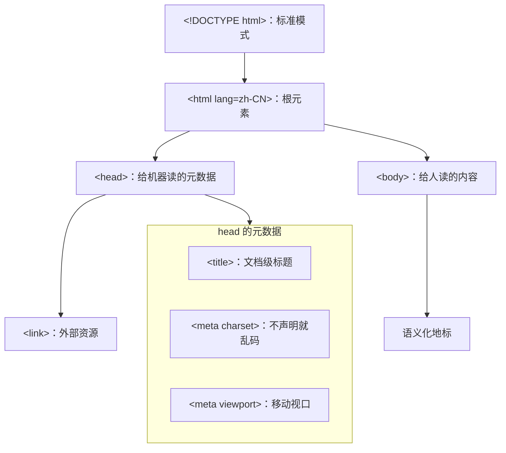
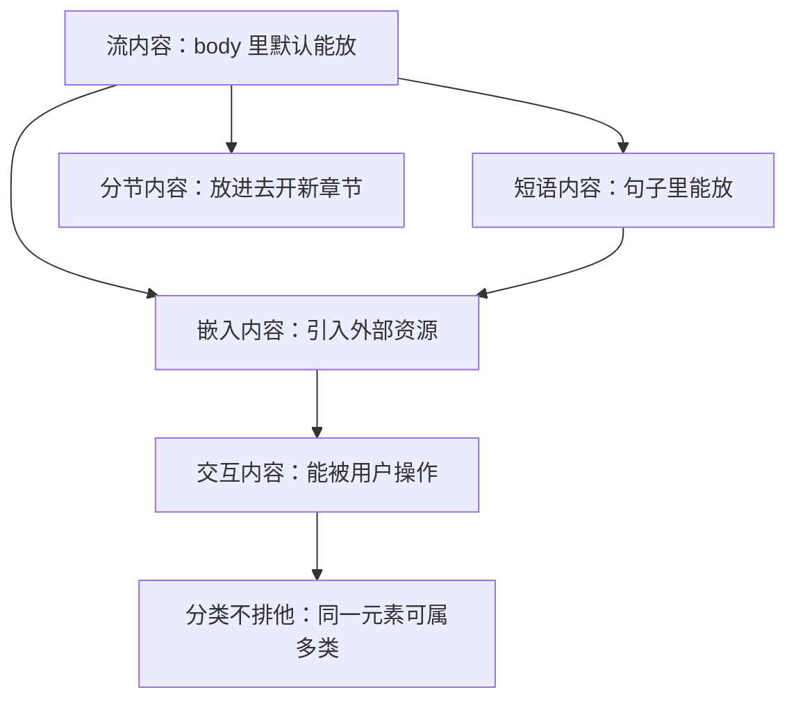
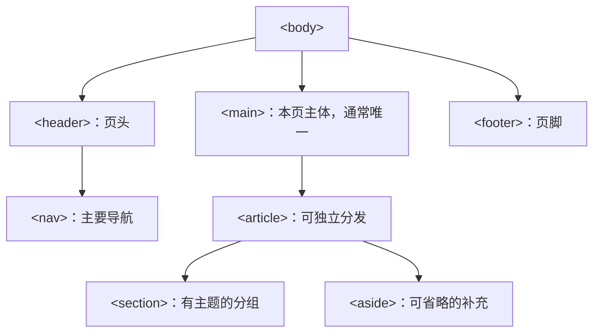
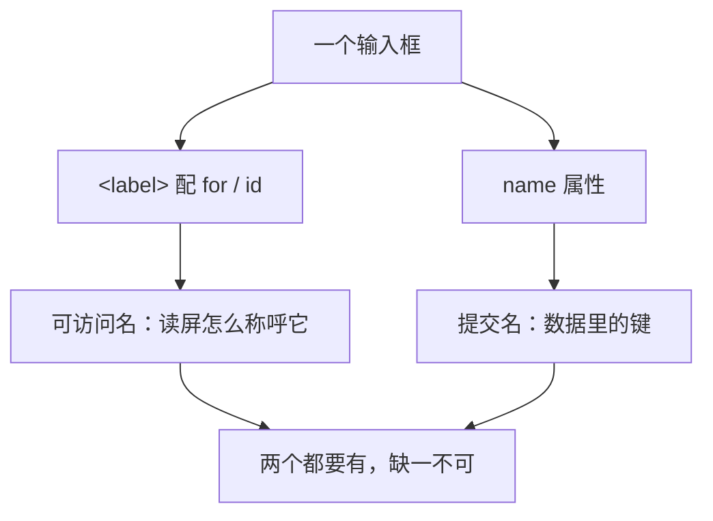
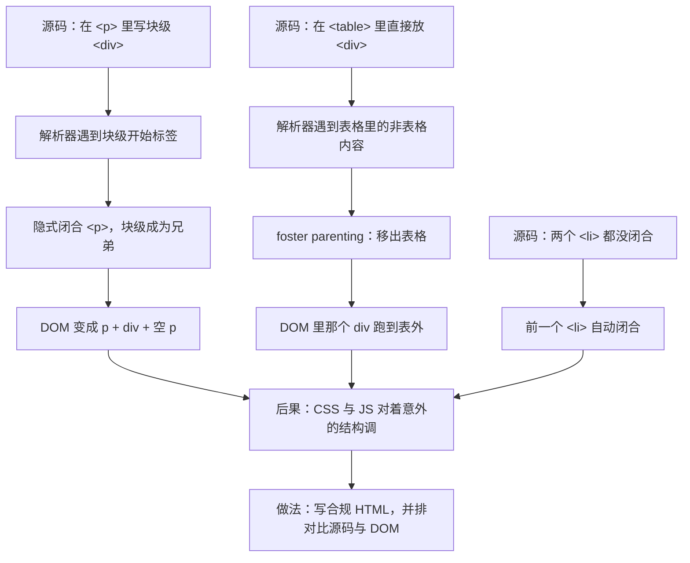

# 模块二 HTML 与语义化

> **一句话**：HTML 要回答的只有一个问题——**「这块内容是什么」**；同一份文字用对标签，浏览器、屏幕阅读器、搜索引擎和 AI 抓取器才都能读懂。标签选用不是审美问题，是接口契约问题。
> **自学时长**：建议 5–6 小时（可分 3 次学完：骨架+地标 / 链接图片表格 / 表单+容错解析） · **前置**：模块一 Web 的起源与技术基础（[[01-模块一 Web 的起源与技术基础]]）
> **学完你能**：
> 1. 说清 `charset`、`viewport`、`lang` 三者各自缺失时会出现什么**可观察**的错误，并在开发者工具里复现其中任意一个；
> 2. 用语义化地标与连续的标题层级写出一份文档，**断开 CSS 后仍能顺序读通**，并说清每个元素为什么是它而不是 `<div>`；
> 3. 为信息图 / 装饰图 / 功能图标分别写出正确的 `alt`，为数据表格建立表头关联，并写出一份**只用键盘就能填完**的表单。

## 1. 心智模型

HTML 的每一行都在对**三种消费者**说同一句话：「这块内容是什么」。

| 消费者 | 它拿结构信息去干什么 | 结构错了会怎样 |
|---|---|---|
| 浏览器 | 解析、建 DOM、套 CSS、布局渲染 | 你写的结构和 DOM 里的不一样（见 §2.8） |
| 辅助技术（屏幕阅读器、键盘、放大镜） | 按地标跳转、按标题建大纲、按字段名念表单 | 用户听到的是「编辑框」，不知道在填什么 |
| 机器（搜索引擎、AI 抓取器、结构化数据抽取） | 抽取标题、正文、列表、表格关系 | 抽出来的东西对不上，页面等于白写 |

三者依赖的是**同一份**结构信息：标签名 + 属性 + 嵌套关系。所以本模块**不教新语法**（HTML 只有一种标记法），教的是判断力：

- 这段内容该用哪个元素？
- 这个属性删掉会出什么事？
- 换成一个不用眼睛的人（或一台机器）来读，这份文档还成立吗？

判断力只能靠**「拆掉东西看后果」**来建立，所以本模块的动手量故意压得住阅读量：§4 的四个动手任务都是「改一处 → 看发生了什么」。



> **图 1**：文档骨架的树形结构——`head` 装「给机器读的元数据」，`body` 装「给人读的内容」。
> **这张图在说什么**：本模块的九个知识点都挂在这棵树上：先有合法的骨架（§2.2、§2.8），再有可分类的元素（§2.3），最后才谈得上语义化地标、图片、表格与表单（§2.4–§2.7）。
> **图注补全**（图内为压缩写法）：「head 的元数据」框里三件套的完整含义是——`<title>` 是**文档级**标题（标签页 / 书签 / 搜索结果的标题）、`<meta charset="utf-8">` 不写且响应头也没声明时中文会乱码、`<meta name="viewport" content="width=device-width, initial-scale=1">` 不写则移动端按约 980 CSS 像素渲染再缩小；`<link>` 挂在 `head` 下引入外部样式表等资源。`body` 下的「语义化地标」指 `header` / `nav` / `main` / `article` / `section` / `aside` / `footer` 这一组。

**怎么用这张图**：学任何一节都回到它问一句「我改的是树上哪一层」。改骨架层（§2.2）出错，整页显示就有问题；改元素层（§2.3）出错，会撞上浏览器的自动修正（§2.8）；改语义层（§2.4–§2.7）出错，页面照样好看，但换个人或机器来读就废了——**这一类错误最难自己发现，所以本模块的动手任务都在练它**。

## 2. 精讲（按节推进）

### 2.1 语义化是怎么从一个学术词变成硬要求的  ⏱ 约 20 分钟

**是什么**：HTML 的血统是 **SGML**——一种更早的、用来描述文档结构的通用标记语言，它把「文档 = 元素 + 属性 + 内容模型」这套思路带进了万维网。后来四件事一步步把「语义化」变成了工程要求：

- **HTML 4 发布于 1997 年**。它的态度是「描述结构」。但当时现实里塞满了用 `<table>` 和 `<font>` 拼版式的做法，规范说什么基本没人管。
- **XHTML 1.0 于 2000 年成为 W3C 推荐标准**。它要求网页必须是合法的 XML：标签闭合、大小写敏感、属性必须带引号，**一个错就整页解析失败**。方向很纯，代价是现实网页大量不合规——浏览器做不到把不合规页面全判死刑，于是继续各写各的容错逻辑。这是 §2.8「容错解析」的历史根因。
- **WHATWG 于 2004 年由多家浏览器厂商成立**。结论是：与其先定一个完美规范再让大家实现，不如**先看浏览器实际怎么做，再把稳定的行为写成规范**——即「Living Standard（活标准）」路线。它的副产品是：**解析器的错误恢复行为被写进了规范**，不再是浏览器的私事。
- **HTML5 于 2014-10-28 成为 W3C 推荐标准**，正式引入现代表单控件、`<video>`/`<audio>`/`<canvas>`，以及本模块的重点——**语义化地标元素**。**2019 年 W3C 与 WHATWG 签署备忘录**，HTML 的权威版本归 **[WHATWG HTML Living Standard](https://html.spec.whatwg.org/multipage/)**。

**为什么要在意这段历史**：它把两个判断直接交到你手上。

1. **规范为什么这么「松」**？因为 2004 年之后浏览器厂商赢了话语权——生存优先于纯洁。
2. **松不等于随便**。语义化之所以是硬要求，是因为它被**一连串机器消费方**依赖：屏幕阅读器的地标导航、搜索引擎的标题提取、结构化数据的抽取。XHTML 想实现的「机器严格可读」，在 HTML5 里换了一条更现实的路：**结构靠语义标签约定，容错交给规范化的解析算法**。

> **自检**：XHTML 那条「一个错就整页解析失败」的路线，为什么在实践中没坚持下来？

### 2.2 文档骨架与元数据：三件套缺一个就有一个可观察的错误  ⏱ 约 30 分钟

**要记的是后果，不是语法。** 骨架四行，每一行对应一个能亲眼看见的错误：

- `<!DOCTYPE html>`：让浏览器按**标准模式**解析。写错或漏掉会退回「怪异模式」（quirks mode），盒模型行为与标准模式不一致——你会在 CSS 里遇到解释不通的尺寸。
- `<meta charset="utf-8">`：**不写它、而且 HTTP 响应头也没声明编码**时，中文按平台默认编码去猜，结果就是**乱码**。本地双击文件打开时更容易出问题，因为少了响应头那道兜底。
- `<meta name="viewport" content="width=device-width, initial-scale=1">`：**不写**时移动浏览器按约 **980 CSS 像素**的「桌面视口」渲染再整体缩小，字细到看不清、点击区域与视觉错位。
- `<html lang="zh-CN">`：**不写**时屏幕阅读器会按默认语言的**发音与断词规则**读中文（读错），同时影响断词换行、拼写校对、翻译与朗读功能的语言判断。`lang` 是全局属性，也能写在局部元素上（一篇中文页里夹一段英文时用）。

最小骨架（**仅示形态**，10 行）：

```html
<!DOCTYPE html>
<html lang="zh-CN">
  <head>
    <meta charset="utf-8">
    <meta name="viewport" content="width=device-width, initial-scale=1">
    <title>页面标题（这个页面是什么）</title>
  </head>
  <body></body>
</html>
```

**三个常被问到的点**（都容易想歪）：

1. `<title>` 和 `<h1>` 不是替代关系。`<title>` 是**文档级**的，给标签页 / 书签 / 搜索结果标题用，**不能省**；`<h1>` 是文档**内容里**的最高级标题。两者内容常相近，但作用域不同。
2. `<meta charset>` 要**尽早出现**。放到 `</head>` 前一行，解析器在它之前已经用默认编码处理过一段内容了，标题区域可能已经乱码。
3. `lang` 写成 `zh_CN`（下划线）是无效的，语言标签用**连字符**：`zh-CN`。

**自己复现（Windows 快捷键）**：

- 把 `charset` 那行注释掉 → 按 **F5** 刷新，看中文是否乱码；再按 **F12** → **Network（网络）** → 按 **F5** 重新加载 → 点第一个文档请求 → 看 **Response Headers（响应标头）** 里有没有 `content-type: text/html; charset=...`。这一步看清的是「两处声明的关系」：响应头有兜底，本地文件没有。
- 按 **F12**，再按 **Ctrl+Shift+M** 打开设备工具栏，对着**不加 viewport** 的页面看一遍，再对比加了的页面。
- 按 **Ctrl+Shift+J** 打开 Console，输入 `document.documentElement.lang` 回车，取回当前页的 `lang` 值。

> **自检**：把 `<meta charset="utf-8">` 挪到 `</head>` 前一行，风险为什么变大了？

### 2.3 内容模型：元素能出现在哪里，是有嵌套规则的  ⏱ 约 20 分钟

**是什么**：元素不是一张平铺的清单，而是按「**能出现在哪里**」分成若干类别。三个最常用的类别：

- **流内容（flow content）**：`<body>` 里默认能放的东西——段落、标题、列表、`<div>`。
- **短语内容（phrasing content）**：出现在**句子内部**的标记——文本、`<a>`、`<strong>`、`<em>`、`<span>`、``、`<code>`。判别法：**它能不能合理地出现在一句话中间。**
- **分节内容（sectioning content）**：划定大纲层级的元素——`<article>`、`<section>`、`<nav>`、`<aside>`。放进去就等于开了一个新章节。

**为什么要有嵌套规则**：因为「让机器可推导结构」是一切机器消费的前提。机器得先知道「`<p>` 里出现 `<div>` 是意外」，才谈得上替你修正；得先知道「`<article>` 开了新章节」，才谈得上正确建大纲。



> **图 2**：内容的几个类别之间是**包含与交叠**关系，不是一张平铺的元素清单。
> **这张图在说什么**：判别某元素属于哪一类，问的是「**它能不能出现在这个位置**」，而不是「它长什么样」——`<p>` 里只能放短语内容，所以块级的 `<div>` 放进去会被浏览器修正（§2.8）；`<a>`、`` 同时属于多个类别，分类并不排他。
> 图注：`flow content` / `phrasing content` / `sectioning content` / `embedded content` / `interactive content` 分别是流内容 / 短语内容 / 分节内容 / 嵌入内容 / 交互内容的英文原名。

**关键规矩**：**`<p>` 只能包含短语内容**。把 `<div>` 直接放进 `<p>` 是非法的，浏览器会替你「修正」。

> **自检**：`<p>` 里放 `<strong>` 合法吗？放 `<div>` 呢？后者的后果在 §2.8 找。

### 2.4 语义化地标与标题层级：一份「不用眼睛也能导航」的文档  ⏱ 约 35 分钟

**先立唯一判据**（这句可以直接背）：

> **断开 CSS 后，这份文档仍然像一篇排版朴素的老式文章一样读得通——有层级、有导航、有主次，语义就对了；如果变成一坨看不出结构的字，就是错了。**

**地标元素清单**，每个元素都记「谁会用它、判据是什么」：

- `<header>` / `<footer>`：页头 / 页脚，也可以用在 `<article>` 内部表示这块内容的头尾。
- `<nav>`：**主要**导航的链接组。不是每个链接组都要 `nav`——主导航和目录才需要，侧栏的一堆标签云不一定算。
- `<main>`：**一页通常只出现一次**，且与 `header`/`footer` 同级，**不含全站重复的导航**。它是「本页独有内容」的边界。
- `<article>`：**能独立分发 / 被订阅的内容单元**（一篇文章、一个商品卡、一条评论）。判据是「**单独拎出去还成立吗**」，不是「看起来像一张卡」。
- `<section>`：有主题的分组，**通常应当有标题**。
- `<aside>`：与主内容相关、但可以独立省略的补充内容。



> **图 3**：一份典型页面的地标树——页头含主导航，主体里放可独立分发的内容单元，补充信息用 `aside`，页脚收尾。
> **这张图在说什么**：把 `<main>` 里的内容整块删掉，剩下的 `header`（含 `nav`）与 `footer` 恰好是「全站重复」的部分——这就是判断一个块该不该进 `main` 的实用办法。地标在无障碍树里会被映射成 **landmark（地标）**，屏幕阅读器用户按它跳转，等于拿到一份自带目录的文档。

**标题层级**：`<h1>`~`<h6>` 表示**大纲层级**，**不是字号**。跳级（`h2` 直接跳 `h4`）会让依赖大纲导航的用户丢失结构连续性。一页通常只有一个 `<h1>`，且它应描述本页主题。

> 说明一句边界：「一页一个 `<h1>`」是**本课程的工程口径**，规范并未硬性禁止多个 `h1`；这么要求是为了让「本页主题唯一可识别」，好检查、好维护。

**自己验证三步（Windows 快捷键）**：

1. **断样式看图**：按 **F12** → 按 **Ctrl+Shift+P** 打开命令菜单 → 输入 `Rendering` 打开该面板 → 勾选 **Disable local CSS**（禁用本地 CSS）。把「语义化版本」和「`div` 堆的版本」都断一次样式，差别一眼可见。
2. **看地标列表**：**F12** → **Elements** → 选中元素后切到 **Accessibility（无障碍）** 栏看它的角色与名称；Chrome 新版本该栏位置有变动，找不到时改用 **Ctrl+Shift+P** → 输入 `Lighthouse` → 勾选 Accessibility 跑一遍，结果里的 landmark 项同样能说明问题。
3. **用读屏走一遍**：Windows 自带的 **Narrator（讲述人）** 支持按标题 / 地标跳转，打开它按几次跳转键，比读十页文档都记得住。

> **自检**：把 `<main>` 里的内容删掉，剩下的地标有哪些？这件事说明了什么？

### 2.5 链接与资源：`a` 的语义、`alt` 的三种写法、`srcset` 与 `sizes` 的配对  ⏱ 约 30 分钟

**`<a>` 的语义**：它代表「**跳转到另一个资源 / 位置**」。**有 `href` 才叫链接**——可获得键盘焦点、可被右键「在新标签页打开」、可复制链接地址。所以：

- `<a href="#" onclick="...">` 是反模式：**要执行动作就用 `<button>`**。导航用 `a`，动作用 `button`。
- **可访问名就是链接文字**。写「点击这里」「了解更多」，在屏幕阅读器的链接列表里全是一模一样的重复；要写「查看模块二实验指导」。
- `target="_blank"` 时应带 `rel="noopener"`。

**`` 的 `alt` 是必填的，但写法分三种场景**（这是本模块最常考、也最常写错的一处）：

| 场景 | `alt` 写什么 | 例 |
|---|---|---|
| **信息图**（承载数据 / 事实） | 这张图**传达了什么信息**，而不是「图里有什么」 | `alt="2024 到 2026 年移动端流量占比升至 62%"` |
| **装饰图**（纯分隔 / 背景感） | `alt=""`（空字符串），告诉辅助技术「跳过它」 | `alt=""` |
| **功能性图**（本身是按钮 / 链接内容） | 这个控件**做什么** | `alt="提交搜索"` |

**注意 `alt=""` 与完全不写 `alt` 不是一回事**：前者是「明确声明装饰性，请跳过」，后者在一些实现里会退化成**读图片文件名 / URL**。另外，`alt` 也不是图片标题——标题是显示出来的说明文字，替代文本是给看不见图的场景用的。

**`srcset` / `sizes` 必须配对**：

- `srcset` 给候选图，`w` 描述符写**图片真实的像素宽度**（不是显示宽度）。
- `sizes` 描述**在不同视口宽度下这张图会占多宽**（CSS 像素），浏览器据此挑候选。
- 只写 `srcset` 不写 `sizes`，浏览器缺少布局宽度信息，会按「图片占满视口宽度」估算，窄列场景常选到过大的图，白费带宽。

`loading="lazy"`（延后加载）+ `width`/`height`（占位、防布局抖动）是顺手该加的。

**自己验证**：按 **F12** → **Network** → 按 **Ctrl+Shift+M** 开设备工具栏 → 按 **F5** 重载后切换屏幕宽度，看同一张 `srcset` 图**实际下载了哪个候选**；再把 `sizes` 删掉重来一次，复现「下了个大图」。

> **自检**：一个「关闭弹窗」的 × 图标，该用 `` 还是 `<button>` 包？判断依据是什么？

### 2.6 列表与数据表格：列表给边界，表头给关联  ⏱ 约 20 分钟

**列表**：

- `<ul>` 无序、`<ol>` 有序（顺序有意义时用，比如步骤）。
- `<dl>` / `<dt>` / `<dd>` 是描述列表（成对的「术语—解释」，如名词表、FAQ、课程信息）。
- 导航用 `<ul>` 包 `<li>` 包 `<a>` 是标准做法：辅助技术会播报「共 5 项，第 2 项」，用户知道边界；一串裸链接没有数量感。

**表格只用于数据**。要排版的格子用 CSS（本课程后续模块的 Grid / Flex），**不用 `<table>`**。

**表头关联是表格可访问性的核心**：

- 表头用 `<th>` 并配 `scope="col"`（列头）或 `scope="row"`（行头）。这是读屏在读到某个单元格时能报出「列：月份，行：中国」的关键；只有非常复杂的表格才需要 `headers` / `id` 关联。
- `<caption>` 给表格标题——它把「这张表是什么」直接交给辅助技术，而不是靠旁边一句普通文字。
- 合并单元格 `colspan` / `rowspan` 要谨慎，合并越多越难关联。

**自己验证**：**F12** → **Elements** 选中某个单元格 → 切到 **Accessibility** 栏看「计算名称 / 表头关联」；再把那个 `<th>` 改成 `<td>`（在 Elements 里选中节点按 **F2** 可原地编辑），按 **F5** 刷新，看表头关联消失。

> **自检**：`<table>` 里第一行「看起来像表头」的格子，该用 `<td>` 还是 `<th>`？依据是样式吗？

### 2.7 表单：一个输入框有两个名字，还自带一堆免费能力  ⏱ 约 40 分钟

这是本模块分量最重的一节——**「看起来能用的表单」和「能用的表单」差别最大**。

**第一个名字：可访问名（给人）。** `label` 关联有两种写法：`<label for="id">` 配 `<input id="...">`，或把 `<input>` 包在 `<label>` 里。作用是**点文字也能聚焦输入框**（鼠标命中区域变大），以及读屏能念出字段名。

**`placeholder` 不是标签**：一输入就消失、对比度常不达标，读屏也无法稳定地把它当字段名。**有 `placeholder` 不等于有 `label`。**

**第二个名字：提交名（给服务器）。** **只有带 `name` 的控件才会出现在提交数据里**，键就是 `name`。这是「我的表单怎么少了一个字段」最常见的原因——`id` 不参与提交，`type` 也不是键名。



> **图 4**：同一个输入框要同时拿到两个名字——`label` 给出可访问名，`name` 给出提交名，两者来源不同、用途不同，都要有。
> **这张图在说什么**：`label` 解决「这个框是问什么的」（给人），`name` 解决「这格数据叫什么」（给服务器）；这两件事被混在一起，正是初学者最常踩的坑。

**`type` 决定三件事**：键盘布局、校验行为、语义。`email` / `url` / `tel` / `number` / `date` / `search` / `password` 各有不同行为，移动端键盘会随类型变化。

**原生校验属性是免费的**：`required`、`minlength` / `maxlength`、`min` / `max` / `step`、`pattern`，以及 `type` 自带的格式校验。它们对辅助技术天然友好——**能用原生就用原生**，别一上来手写一堆 JS 校验。

**分组要有组名**：`<fieldset>` / `<legend>` 把相关控件分组并给组名。单选组、地址块、支付信息都该分组，读屏会播报「收货地址，组」；一组单选框若没有组名，用户不知道这三个选项在回答哪个问题。

**提交语义**：`<form>` 的 `method` / `action` 决定提交方式与目标；提交靠 `type="submit"` 的按钮或表单里的 `<button>`。`autocomplete` 帮用户自动填充；`<input type="hidden">` 传不可见的值。

**自己验证三步**：

1. 手敲一个没有 `<label>` 的表单 → **F12** → **Elements** 选中输入框 → 切 **Accessibility** 栏看 **Name**：是空的。加上 `label` 的 `for`/`id` 后重看，名字出现了。
2. 故意漏写一个输入的 `name` → **F12** → **Network** → 勾选 **Preserve log（保留日志）** → 提交表单 → 点开该请求看 **Payload / 请求体**：那个字段**根本没出现**。
3. 留空一个必填项点提交，看浏览器**自带的提示气泡**——这就是原生校验在替你干活。

> **自检**：一个输入框页面上明明有、也填了值，提交后请求体里找不到它。先查哪两件事？

### 2.8 容错解析：浏览器会改你的代码，而且改法是被规定的  ⏱ 约 15 分钟

**为什么标签没闭合也能跑**：HTML 解析器不是「遇到错就停」，它内置一整套**错误恢复算法**，来自 **[WHATWG HTML Living Standard](https://html.spec.whatwg.org/multipage/)** 的解析规范——也就是说，**这些「修正」行为是被规范固定的、可预测的**，不是浏览器自由发挥。

**三条典型规则**（记住这三条，多数「元素跑位」现场都能对上号）：

1. `<p>` 里遇到 `<div>` 这类块级开始标签 → **隐式闭合 `<p>`**，块级元素成为它的兄弟。
2. `<table>` 里直接放非表格内容（如 `<div>`）→ **foster parenting**：把它**移出表格**，放到表格前面。这就是「我写在表里的 `div` 跑到表外了」。
3. 未闭合的 `<li>` 遇到下一个 `<li>` → 前一个自动闭合。



> **图 5**：三条典型的错误恢复规则——产出都是规范规定、可预测的，但**都不是你写下的结构**。
> **这张图在说什么**：容错是为了**不让老网页坏掉**，不是为了让你省事。遇到「我写的元素跑位了」，先看 Elements 里的 DOM，别只对着源码调 CSS。
> 图注：`foster parenting` 是解析表格时把「不该出现在表格里的内容」寄养到表格外面的那套规则。

**关键判断**：依赖容错写出来的 DOM 往往和你以为的不一样，而「你以为的结构」正是 CSS 布局与 JS 选择器的依据——所以**错误会以「样式/脚本莫名不生效」的形式在很远的地方爆炸**。

**观察方法**：**F12** → **Elements** 看解析后的 DOM；源码在地址栏用 `view-source:` 前缀打开（或编辑器并排）；**两边并排截图**，这是唯一能让「浏览器会改我的代码」这件事变得可见的方法。**F12** 打开时按 **Ctrl+Shift+C** 可以直接在页面上点选元素。

> **自检**：`<p>这是一段<div>块</div></p>` 解析后大致是什么？这个修法是谁规定的？

### 2.9 结构校验、无障碍检查，以及 SEO 的边界  ⏱ 约 20 分钟

**结构校验**：用 W3C 的 **Nu Html Checker**（白名单外工具，按名称检索官方站点）把文档跑一遍，它按规范报**结构错误**：未闭合、非法嵌套、重复 `id`。要练的是「**先读报错原文、再定位行号**」，而不是看到红字就整段重写。

**格式化工具不等于检查器**：HTML 也可以纳入 [Prettier](https://prettier.io/docs/) **3.9.9** 统一格式——但**格式化不校验语义**，别把「格式化成功」当成「检查通过」。

**无障碍检查的边界（这条必须记牢）**：浏览器自带审计（[Lighthouse](https://developer.chrome.com/docs/lighthouse/overview) 的无障碍部分、Elements 里的 Accessibility 栏）能查出一批**可规则化**的问题：图片缺 `alt`、`label` 缺失、对比度不足、地标缺失、标题层级异常。但它**查不出**「`alt` 写得对不对」「标题层级合不合逻辑」「Tab 顺序合不合理」这类**需要人判断**的问题。

**两项机器查不出、只能自己走一遍的检查**（也是本模块动手任务的硬判据）：

1. **无样式文档可读性检查**：断开 CSS，从头到尾顺序读一遍（命令菜单 → `Rendering` → Disable local CSS）。
2. **表单无障碍自查**：逐项核对 `label` 关联、组名、必填提示、错误提示，并且**只用键盘（Tab / Shift+Tab / Enter / 空格）**把整张表填完并提交。

**SEO 基础与结构化数据的边界**：语义化标签让**机器更好理解结构**，这是确定的；但**排名提升不可承诺**。基于 Schema.org 的结构化数据（白名单外资料，按名称检索）能让搜索引擎更好地呈现结果，但它是「表达方式」，不是「排名开关」。正确口径是：**做语义化是为了可访问性与可维护性，顺带对 SEO 友好；不要反过来把 SEO 当动机**（那会把课程学成排名技巧课）。

> **自检**：审计全绿了，还有哪两类问题它一定查不出来？各举一例。

## 3. 关键概念讲透

### 3.1 「`span` 和 `div` 都没样式，用哪个不都一样？」

- **常见误解**：既然两者默认看起来都没区别（无样式、无默认外观），那 `div` 和 `span` 可以互换，哪个方便用哪个。
- **正确理解**：内容模型不是按「外观」分类的，是按「**允许出现的位置**」分类的。`<span>` 是短语内容（句子里能放），`<div>` 是块级容器（无语义，只在没有更合适的元素时用）。选错位置，浏览器会替你修正结构（§2.8）。
- **反例**：`<p>价格 <span>99</span> 元</p>` 合法；把 `span` 换成 `div` 写成 `<p>价格 <div>99</div> 元</p>`，浏览器会把 `<p>` 隐式闭合，DOM 变成 `p` + `div` + 空 `p`——你以为的一行，实际成了三块。

### 3.2 「我用 `<div class="header">`，看起来和 `<header>` 一模一样」

- **常见误解**：类名和标签都只是「给 CSS 挂个钩子」，视觉效果相同就是等效的。
- **正确理解**：`class` 只对写 CSS 的人有意义；**元素名对机器有意义**。`<header>` 在无障碍树里是 landmark，可被跳转；`<div class="header">` 只是一块无语义的盒子——它不撒谎，但也不说话。
- **反例**：把一个「全 `div`」的页面与语义化版本分别断开 CSS 看一次：前者变成一坨看不出结构的字，后者仍然读得出页头、导航、主体、页脚。**这就是「一样」的代价。**

### 3.3 「`alt` 就是图片说明，随便写点什么」

- **常见误解**：`alt` 是给图片配的说明文字，写文件名、写「分隔图」、写「图片1」都算「有写」。
- **正确理解**：`alt` 是图片**唯一的文字接口**——图片不可见时（读屏、加载失败、纯文本环境）替代它出现的信息。判据：**把眼睛闭上，让别人替你读这一页，这个位置该听到什么，`alt` 就写什么；什么都不该听到，就写 `alt=""`。**
- **反例**：`alt="sales-2026"`（抄文件名）= 信息量为零；`alt="分隔图"`（装饰图硬写说明）= 纯噪声；两者都不如一个恰当的等效描述或一个干净的空字符串。另外 **`alt=""` 与省略 `alt` 行为不同**：前者的意思是「我确认它是装饰，跳过」，后者可能被读成文件名。

### 3.4 「表单能填能交就行，`label` 和 `name` 是重复的东西」

- **常见误解**：`placeholder` 已经写了提示语，还要 `label` 干什么；能填能提交就行，`name` 大概是可选的。
- **正确理解**：一个控件需要**两个来源不同的名字**——可访问名（`label`，给人和读屏）与提交名（`name`，给服务器）。二者互不替代：少了前者，读屏只念「编辑框」；少了后者，数据根本发不出去。`id` 只用来建立 `for` 关联，**不参与提交**。
- **反例**：`<input type="email" id="email" placeholder="请输入邮箱">` ——填写完全正常、界面看起来没问题，但提交后请求体里没有这个键（缺 `name`），读屏也念不出字段名（缺关联 `label`）。**这条表单是「看起来能用」的典型。**

### 3.5 「浏览器能跑就是写对了；审计全绿就是无障碍达标了」

- **常见误解**：页面渲染正常、控制台不报错，就说明 HTML 没问题；无障碍审计全绿，就说明对残障用户可用。
- **正确理解**：渲染正常只说明**浏览器替你收拾干净了**——修正规则是 WHATWG Living Standard 规定的，可预测，但**不等于你写下的结构**（§2.8）。而无障碍工具只能查「机器查得出的」规则项，查不出需要语义判断的部分。
- **反例**：① 在 `<table>` 和第一个 `<tr>` 之间塞了三个 `<div>` 当说明，页面看着没错——DOM 里它们已被移到表格外。② 审计全绿，但 `alt="fig1"`、标题从 `h1` 直接跳到 `h4`、Tab 顺序与视觉顺序相反、表单报错只说「输入有误」——这四条工具一条都报不出来，用户一条都受不了。

## 4. 动手（自学版实验）

> 统一环境：Windows + 任意编辑器 + 一个浏览器（Chrome / Edge / Firefox 任一，需要有 Elements、Accessibility、Rendering/Lighthouse 这几栏）。**本模块不需要 Node.js 与任何框架**；想用本地服务器看页面，可用 `npx vite@8.3.1` 起一个静态预览（Vite 8.3.1，Node.js v26.7.0 / npm 11.19.0），直接用 `file://` 打开也能做完下面的任务。想统一代码格式，可选 [Prettier](https://prettier.io/docs/) 3.9.9。
> 四个任务合起来约 2 小时；做完一个就勾一个，每个任务的「验收标准」都能自己判定。

### 动手一：把「全 div」页面改写成语义化地标，并做无样式可读性检查

- **要做什么**：
  1. 先**故意写一个差版本**：一个 HTML 文件，用 `<div class="header">`、`<div class="nav">`、`<div class="main">`、`<div class="sidebar">`、`<div class="footer">` 搭出「页头 + 主导航 + 主内容（含两篇文章）+ 侧栏 + 页脚」，标题全部用 `<div class="title">` 配字号。内容随便编（课程介绍即可），**关键在于结构全是 `div`**。
  2. 打开它，**记住它长什么样**；然后按 **F12** → **Ctrl+Shift+P** → 输入 `Rendering` → 勾选 **Disable local CSS**，看它变成什么样。截图存下来当「改前」。
  3. 在**不改变可见内容**的前提下改写：结构换成 `header` / `nav` / `main` / `article` / `section` / `aside` / `footer`，标题换成 `h1`/`h2`/`h3` 并整理成连续层级（字号交给 CSS，别再用 `div` 冒充标题）。
  4. 再断一次 CSS，从头读到尾；再把 CSS 打开，确认视觉效果**没有变差**。
- **需要什么**：上面的 HTML 文件 + 浏览器；DevTools 快捷键 **F12**（打开）、**Ctrl+Shift+P**（命令菜单）、**Ctrl+Shift+C**（点选元素）、**F5**（刷新）。
- **验收标准**（逐条自己勾，**每条都要能说出你是怎么验证的**）：
  - [ ] 关闭 CSS 后，从上到下能依次读出：页头、主导航、主内容、侧栏、页脚，且顺序与视觉顺序一致；
  - [ ] 标题层级连续、无跳级（`h1` → `h2` → `h3`，不出现 `h1` → `h4`）；
  - [ ] `<main>` 在整页只出现一次；
  - [ ] 每个 `<section>` 都有对应的标题；
  - [ ] 无障碍信息里能列出页头 / 导航 / 主内容 / 页脚这几个地标（**Accessibility** 栏，或 **Ctrl+Shift+P** → `Lighthouse` → 勾 Accessiblity 跑一遍）；
  - [ ] 「改前 / 改后」两张断样式截图都在，能并排说明差别。
- **卡住了看**：§2.4（地标清单与判据）、§2.3（哪些元素是分节内容）；「断样式」的具体操作在 §2.4 的「自己验证三步」。

### 动手二：`alt` 三场景 + `srcset`/`sizes` 配对 + 数据表格表头关联

- **要做什么**：
  1. 准备一张图，用任意图片工具导出**三个宽度版本**（例如 480 / 960 / 1440 像素宽），文件名带宽度。
  2. 写一个页面，放三张图：一张**承载数据的图表**、一张**纯装饰的分隔图**、一个**作为链接内容的搜索图标**（图标可复用同一张图或自绘 SVG），分别写出正确的 `alt`。
  3. 给那张图表配上 `srcset`（用 `w` 描述符，数值等于各版本**真实像素宽**）与 `sizes`，让宽屏取大图、窄屏取小图。
  4. 页面里再放一个**数据表格**（含行头与列头，例如「月份 × 渠道 × 访问量」），正确使用 `<caption>` 与 `<th scope>`。
  5. 用工具验证两次（见下）。
- **需要什么**：浏览器 + 一张源图 + 任意导出工具；快捷键 **F12** → **Network** → **Ctrl+Shift+M**（设备工具栏）→ **F5**（重载）；看表头关联用 **Elements** → **Accessibility** 栏。
- **验收标准**：
  - [ ] 三张图的 `alt` 分别是「等效信息」「空字符串」「功能名」，与各自场景对得上；
  - [ ] 切换设备工具栏里的屏幕宽度时，**Network 里实际下载的图片文件发生变化**；
  - [ ] 临时删掉 `sizes` 再测一次，能观察到**下载尺寸变大**，并写下这个现象的解释；
  - [ ] 表格用 `<th>` 做表头并带 `scope`，`<caption>` 存在；
  - [ ] 在 Accessibility 栏里，单元格能关联到对应的行头 / 列头；把某个 `<th>` 临时改成 `<td>` 后关联消失（改回来）。
- **卡住了看**：§2.5（`alt` 三写法、`srcset`/`sizes` 配对）、§2.6（表头关联与验证步骤）。

### 动手三：表单无障碍自查，修到通过

- **要做什么**：
  1. 先写一份「**看起来能用**」的订阅 / 注册表单，故意带上这些毛病：用 `placeholder` 顶替 `label`（或 `label` 的 `for` 与 `id` 对不上）；缺一两个 `name`；三个单选按钮挤在一起没有组名、`name` 还不一致；邮箱用 `type="text"`；必填项只用红色星号表示；提交按钮用 `<div>` 加样式冒充。
  2. **先做一遍自查初检**：逐条对照下面的验收标准，把「哪一条不通过、证据是什么」记成一张表。
  3. 逐条修复，**每修一条就复跑一次自查**，直到全部通过。
- **需要什么**：浏览器 + 上面的 HTML 文件；快捷键 **F12** → **Elements** → **Accessibility** 栏看输入框的 **Name**；**Network** → 勾 **Preserve log** → 提交 → 看 **Payload**；纯键盘操作只用 **Tab** / **Shift+Tab** / **Enter** / **空格**。
- **验收标准**：
  - [ ] 每个输入控件都有**关联**的 `label`（`for`/`id` 配对或包裹写法），不存在只靠 `placeholder` 的字段；
  - [ ] Accessiblity 栏里每个输入框都有非空的 **Name**；
  - [ ] 每个要提交的控件都有 `name`，且键名无重复冲突；提交请求体里字段数与表单控件数一致；
  - [ ] 每个输入框的 `type` 与数据内容匹配（邮箱 `email`、电话 `tel`、日期 `date`…），且**实际触发过一次**这些类型的校验；
  - [ ] 单选 / 多选组用 `fieldset` + `legend` 分组，有可念出的组名；
  - [ ] 必填项用 `required`（或等效原生约束）标注，且有**可见的文字**必填提示，不只靠颜色；
  - [ ] 触发一次校验失败，错误提示看得见、**有文字说明**，不只靠红框；
  - [ ] 提交按钮是 `<button type="submit">` 或 `<input type="submit">`，不是 `div` 冒充；
  - [ ] **只用键盘**（Tab / Shift+Tab / Enter / 空格）能完成整张表的填写与提交，且焦点顺序与视觉顺序一致。
- **卡住了看**：§2.7（两个名字、原生校验、分组）；「修正前后」的证据记录方式见 §6 自查清单的说明。

### 动手四：把源码和 DOM 并排摆在一起（本模块最开窍的一次观察）

- **要做什么**：
  1. 写一个十来行的页面，里面故意放两处「错」：一处是 `<p>` 里直接塞一个块级元素，另一处是在 `<table>` 和第一个 `<tr>` 之间放几个 `<div>` 当「说明」。
  2. 用地址栏 `view-source:` 前缀打开这个页面（看**你写的**），再按 **F12** → **Elements**（看**浏览器解析后的**），两边并排。
  3. 找出至少两处差异，截图；再用 **Ctrl+Shift+J** 打开 Console 跑一次 `document.querySelector('p').outerHTML`，看返回值与你写的差在哪。
  4. 写下你的结论：这两处差异是「浏览器自由发挥」还是「规范规定的行为」？
- **需要什么**：浏览器；`view-source:`；**F12** → **Elements**；**Ctrl+Shift+J** → Console。
- **验收标准**：
  - [ ] 能列出至少两处「源码 vs DOM」的差异，并指出各自属于哪条恢复规则（隐式闭合 / foster parenting / 自动闭合）；
  - [ ] 能说清被移出表格的那几个 `div` 最后跑到了哪里；
  - [ ] 能回答「这些修正是规范规定的还是浏览器自由发挥」，并说出依据来自哪份规范；
  - [ ] 并排截图至少一张。
- **卡住了看**：§2.8（三条恢复规则 + 观察方法）；规范来源见 §7 出处表。

## 5. 自测

> **先自己作答，再点开折叠的答案与解析。** 客观题的答案块里写的是「为什么是这个、其它为什么错」；下面还有一组要自己写理由的题，同样给了折叠的评判要点。

### 5.1 客观题（答案与解析在折叠块里）

**1.**（对应 §2.2）下列哪一项**不是** `lang` 缺失会造成的可观察后果？
A. 屏幕阅读器可能用非中文发音规则朗读
B. 浏览器断词、拼写校对判断错误
C. 中文字符可能显示为乱码
D. 页面可能被翻译工具误判语言

> [!success]- 答案与解析
> **C**。乱码主要由 `charset` 声明与编码实际不匹配造成，与 `lang` 没有直接因果——`lang` 影响的是发音规则、断词、拼写校对、翻译判断这几类「语言判断」。A、B、D 都是 `lang` 缺失的真实后果。这道题是典型「字面像对、机理不对」：答题时要能说出各自的病根。

**2.**（对应 §2.2）把 `<meta charset="utf-8">` 写在 `</head>` 前一行，主要风险是？
A. 页面不会进入标准模式
B. 在它之前的字节已按默认编码处理过，可能已经产生乱码
C. `lang` 属性会失效
D. 移动端会退回到约 980 CSS 像素的视口

> [!success]- 答案与解析
> **B**。解析器是边读边解码的，声明出现得越晚，前面那段内容被错误编码处理的窗口越大（标题区域最先受影响）。A 是 `<!DOCTYPE>` 管的事；C 与 `charset` 无关；D 是缺 `viewport` 的后果。相关规范建议：编码声明应尽早在文档开头出现。

**3.**（对应 §2.3）下列元素全部属于「分节内容」的一组是：
A. `article`、`section`、`nav`、`aside`
B. `p`、`div`、`span`、`a`
C. `strong`、`em`、`code`、`img`
D. `ul`、`ol`、`li`、`dl`

> [!success]- 答案与解析
> **A**。分节内容的判据是「放进去就等于开了一个新章节、会划定大纲层级」，正是这四个。B 里 `p`/`div` 属流内容、`span`/`a` 属短语内容（`a` 视上下文可同时属多类）；C 除 `img` 有嵌入内容身份外都是短语内容；D 是列表类元素（`ul`/`ol`/`dl` 属流内容，`li` 属其列表项）。

**4.**（对应 §2.4）关于 `<main>`，下列说法正确的是：
A. 一页可以出现多次，用于划分多个区块
B. 一页通常只出现一次，且不应包含全站重复的导航
C. 它必须放在 `<header>` 内部
D. 它可以替代 `<footer>`

> [!success]- 答案与解析
> **B**。`<main>` 是「本页独有内容」的边界，应与 `header`/`footer` 同级。A 违背本课程口径（规范并未硬禁多个 `main`，但教学上按「通常唯一」要求）；C 恰好说反了——`main` 一般与页头页脚**同级**而不是被页头包住；D 两者职责完全不同。

**5.**（对应 §2.5）一张纯装饰用的分隔图，正确的 `alt` 写法是：
A. 省略 `alt` 属性
B. `alt="divider.svg"`
C. `alt=""`
D. `alt="分隔图"`

> [!success]- 答案与解析
> **C**。装饰图写 `alt=""`，是**明确声明**「它是装饰性的，请辅助技术跳过」。A 与 C 行为不同：省略 `alt` 在一些实现里会退化成读文件名 / URL；B 等于把文件名念给用户，信息量为零；D 是无信息噪声。

**6.**（对应 §2.5）关于 `srcset` 与 `sizes`，下列说法正确的是：
A. 只写 `srcset` 就足够，浏览器能准确判断图片的显示宽度
B. `w` 描述符写的是图片被显示的 CSS 宽度
C. `sizes` 与 `srcset` 是互相替代的两种写法
D. `sizes` 描述图片在不同视口下占多宽，与 `srcset` 的 `w` 值配对使用

> [!success]- 答案与解析
> **D**。`srcset` 给候选图、`w` 写图片**真实像素宽度**；`sizes` 描述**布局占位宽度**（CSS 像素），浏览器把两者对上才挑得准。A 错：缺 `sizes` 时会按「占满视口」假设估算，窄列场景常选到过大的图；B 错：写的是真实像素宽，不是显示宽度；C 错：两者是**配对**关系，不是替代关系。

**7.**（对应 §2.6）数据表格中用来表示表头的元素及其辅助属性是：
A. `<td>` 加粗
B. `<th>` 配 `scope="col"` 或 `scope="row"`
C. `<caption>`
D. `<thead>` 单独即可

> [!success]- 答案与解析
> **B**。表头语义来自 `<th>` 加 `scope`，这是读屏在读到单元格时能报出「列 X、行 Y」的关键；「样式像不像表头」不重要。A 只是视觉加粗，没有关联语义；C 是表格的**标题**，不是表头；D 单独用 `<thead>` 不足以表达某格与某表头的对应关系。

**8.**（对应 §2.7）一个 `<input type="text" id="user">` 没有 `name` 属性，提交时会发生什么？
A. 提交键名自动取 `id`
B. 该字段不出现在提交数据里
C. 表单提交被浏览器拦截
D. 提交键名自动取 `type`

> [!success]- 答案与解析
> **B**。只有带 `name` 的控件才进入提交数据，键就是 `name`；`id` 只用于 `label` 关联与脚本选择器，不参与提交，`type` 更不是键名。这也是「服务端死活收不到某个字段」的第一大原因。验证方法：**F12** → **Network** → 勾 **Preserve log** → 提交 → 看请求体。

**9.**（对应 §2.7）三个单选按钮要让用户「必须选一个」，关于 `required` 与分组，正确的做法是：
A. 三个都写 `required`
B. 写在其中一个上就够
C. 用 `fieldset` + `legend` 给这组一个名称，并在同组同名控件上使用 `required`
D. 用 `placeholder` 说明这组在问什么

> [!success]- 答案与解析
> **C**。同组同名（`name` 相同）的单选按钮构成一组，组内加原生约束即可；关键还要给**组**一个名字，否则用户不知道这三个选项在回答哪个问题——`legend` 就是干这个的。A 不必要也易造成行为混乱；B 的取舍理由不明确且不解决「组名缺失」；D 里 `placeholder` 是提示不是标签，更不能当组名。

**10.**（判断，对应 §2.8）判断并说明理由：**既然浏览器会做容错解析，写不写合规的 HTML 对最终 DOM 没有影响。**

> [!success]- 答案与解析
> **错误**。容错修正按 WHATWG HTML Living Standard 的解析算法进行，虽是规范规定、可预测的，但**修出来的 DOM 常常不是你写的结构**：`<p>` 里进块级元素会隐式闭合 `p`、表格内直接放 `<div>` 会被 foster parenting 移出表格、未闭合的 `<li>` 遇下一个 `<li>` 自动闭合。而「你以为的结构」正是 CSS 布局与 JS 选择器的依据——所以影响不但有，还很常见。**只写「错误」不给分，要点出至少一条具体恢复规则。**

**11.**（判断，对应 §2.4）判断并说明理由：**为了让某个标题看起来小一点，可以用 `<h4>` 来获得合适的字号。**

> [!success]- 答案与解析
> **错误**。`h1`~`h6` 表示**大纲层级**，不是字号；字号归 CSS。为视觉大小挑 `h4` 会让文档出现 `h2` → `h4` 的跳级，破坏依赖标题导航的用户（读屏、机器抽取）对结构的理解。正确做法：层级按内容逻辑连续编排，字重用 CSS 调。

**12.**（填空，对应 §2.2）不写 `<meta charset="utf-8">` 且 HTTP 响应头也没声明编码时，中文页面会出现 ______；`lang` 缺失影响的是发音规则、断词与翻译判断，**不影响** ______。

> [!success]- 答案与解析
> 第一空 **乱码（编码猜测错误造成的字符显示错乱）**；第二空 **字符编码 / 解码方式**（也就是「画面上的字能不能正确显示」）。要点是分清两个属性的职责：`charset` 管**怎么解码字节**，`lang` 管**这段内容是什么语言**——两者都可能影响中文体验，但机理完全不同。

**13.**（填空，对应 §2.7）要让一个控件出现在提交数据里，它必须带 ______ 属性；要让读屏念得出这个字段叫什么，它通常需要有 ______ 关联（`for`/`id` 配对或包裹写法）。

> [!success]- 答案与解析
> 第一空 **`name`**；第二空 **`label`**。这两个名字来源不同、用途不同：`name` 是给服务器的键，`label` 是给人的名字（也即无障碍树里的可访问名）。`placeholder` 不能顶替 `label`，`id` 也不能顶替 `name`。

**14.**（简答，对应 §2.8）既然浏览器会做错误恢复，为什么还要坚持写合规的 HTML？至少给出两个理由，并各举一个具体的错误恢复行为作为例子。

> [!success]- 评判要点
> 要点一：**恢复行为虽可预测，但不一定是你想要的结构**。例子——`<p>` 里遇块级开始标签会隐式闭合 `<p>`，DOM 变成 `p` + `div` + 空 `p`；`<table>` 里直接放非表格内容会触发 foster parenting，被移出表格。
> 要点二：**其他消费方不保证同样的容错**。非浏览器的解析器、抓取器、结构化数据抽取工具，容错能力与浏览器不一定相同。
> 要点三（加分）：**DOM 与源码不一致会让 CSS/JS 调试失效**——你对着源码调样式，浏览器实际用的是另一棵树。
> **只答「为了规范」不给分**，必须有具体例子（举出两条中的任意两条即可）。

**15.**（简答，对应 §2.4）一段 HTML 里标题写作 `h1` → `h2` → `h4` → `h3`，且全页有 4 个 `h1`。分别指出这两处问题会让哪类用户遇到什么困难，并给出修复方案。

> [!success]- 评判要点
> ① **跳级**（`h2` → `h4`）破坏大纲的连续性：依赖标题导航的读屏用户与机器抽取方会丢失层级线索，以为中间少了一节。
> ② **多个 `h1`** 让「本页主题」无法唯一识别，同样影响按标题跳转的用户与抽取方。
> 修复：把层级改为连续（`h1` → `h2` → `h3` → `h4` 各就其位，内容逻辑决定谁在哪一级）；只保留一个描述本页主题的 `h1`；**字号交给 CSS**，不要为了视觉大小挑 `h` 标签。

**16.**（简答，对应 §2.9）「自动无障碍审计全绿」能否作为无障碍达标的证明？说明理由，并举出至少两个自动工具查不出、必须人工判断的问题。

> [!success]- 评判要点
> **不能**。工具只能覆盖**可规则化**的检查项（图片有没有 `alt`、`label` 有没有关联、对比度、地标是否存在、标题层级是否有异常）。
> 人工判断项举例：`alt` 的信息是否**等效**；标题层级是否合乎**内容逻辑**；**Tab 顺序**是否与视觉顺序一致；表单**错误提示**是否清晰可达（只说「输入有误」就没用）；装饰图是否被误写成信息图。
> 关键区分是「**通过审计**」与「**真的能用**」——前者是机器判据，后者要人走一遍。

**17.**（读代码，对应 §2.5）下面两行，哪一行对屏幕阅读器用户更友好？说明判断依据，并写出被判为「不友好」那一行的两种正确改法（分属不同场景）。（仅示形态）

```html
<!-- 仅示形态 -->


```

> [!success]- 评判要点
> **第二行更友好**：它的 `alt` 承载了**等效信息**（不看图也能拿到结论）；第一行是抄 `src` 里的文件名，对用户来说信息量为零。
> 被判为不友好的那一行，正确改法取决于**这张图承载什么**：若图承载数据 → 写等效信息描述（像第二行那样）；若纯装饰 → 写 `alt=""`。**必须点出「信息来源不同、改法不同」**——这正是 `alt` 三写法的核心。

**18.**（读代码，对应 §2.6 + §2.8）一个表格用 `<td>` 加粗当表头，另有三个 `<div>` 直接放在 `<table>` 和第一个 `<tr>` 之间当「说明」。指出两处结构问题及其后果，并说明第二处该用什么工具观察。

> [!success]- 评判要点
> ① **表头应为 `<th>` 并配 `scope`**：现在用 `<td>` 加粗只有视觉效果，单元格失去表头关联，读屏无法报出「列 X、行 Y」；样式像不像表头不重要，语义才重要。
> ② **非表格内容放在 `<table>` 内会触发 foster parenting**：解析器把那几个 `<div>` 移到表格**外面**（表格之前），结构被浏览器改写——你写的和 DOM 里的不一样。
> 观察工具：**Elements** 面板，把源码（地址栏 `view-source:`）与解析后的 DOM **并排对比**，必要时截图留证。

### 5.2 动手题（不给实现，只给验收标准与评分点）

**1.** 给一段纯文本素材（含标题、正文、一张图表、一个侧栏提示、一组订阅表单字段），写出完整 HTML 文档。**不给实现。**

- **验收标准**：
  - [ ] 关闭 CSS 后整页可顺序读通，地标齐全，`<main>` 唯一，标题层级连续；
  - [ ] 图表的 `alt` 是等效信息描述；纯装饰元素写 `alt=""`，不产生噪声；
  - [ ] 表单每个控件有 `label` 关联、有 `name`、`type` 与数据匹配，单选项有 `fieldset`/`legend`；
  - [ ] 通过结构校验器（零结构错误）与浏览器无障碍审计（无可自动查出的问题），并把结果截图；
  - [ ] 所有链接文字脱离上下文仍能读懂（不出现「点击这里」）。
- **评分点**：语义元素选用的恰当性（占比最高）｜两项人工判据（无样式可读性、表单无障碍自查）逐条通过｜校验与审计结果的截图证据。
- **不合格红线**：出现行内 `style`、用 `<table>` 做页面排版、`placeholder` 顶替 `label`、`main` 出现多次。

**2.** 为一组图片（一张信息图表、一张装饰分隔图、一个作为链接内容的图标）写标记，要求宽屏与窄屏下载不同尺寸的图片。**不给实现。**

- **验收标准**：
  - [ ] `srcset` 使用 `w` 描述符，数值等于图片**真实像素宽度**；
  - [ ] 配有 `sizes` 描述布局占用宽度；
  - [ ] 切换视口宽度时，**Network** 面板显示实际下载文件发生变化；
  - [ ] 三张图的 `alt` 分别符合「信息 / 装饰 / 功能」三种场景；
  - [ ] 交一节说明：删掉 `sizes` 后下载尺寸变大，为什么。
- **评分点**：`srcset`/`sizes` 是否**配对**（只写其一不通过）｜`w` 是否被误写成显示宽度｜`alt` 场景判断是否准确（易错在把装饰图写成信息图）。

**3.** 拿一份「看起来能用」的注册 / 订阅表单（含姓名、邮箱、单选组、多选、提交），跑一遍表单无障碍自查并修到通过。**不给实现。**

- **验收标准**：
  - [ ] 逐条通过「动手三」验收标准里的九条（`label` 关联、`name` 完整、`type` 匹配、分组组名、必填提示、错误提示可读、提交按钮语义、纯键盘完成）；
  - [ ] 自查表逐条写明「修复前的问题 + 修复动作 + 验证方式」，**无证据的勾选不算通过**；
  - [ ] 留下修复前 / 后两份文件与无障碍信息的截图；
  - [ ] 能复述一条诊断口诀：收不到字段先查 `name`，再查是否在 `<form>` 内，再查是否 `disabled`。
- **评分点**：`label` / `name` / 分组三项为**核心**，任一缺失即不通过｜纯键盘完成填写并提交是硬门槛｜证据是否可复现（是「感觉能用了」还是「Tab 一遍、截图一张」）。

## 6. 自我检查清单

交付前逐条勾选，**每条都要能说出你是如何验证的**；说不出验证方式的勾选，视为未完成。

- [ ] 文档有 `<!DOCTYPE html>`，`<html>` 上有正确的 `lang`（如 `zh-CN`），`<head>` 里有 `charset` 与 `viewport`。
- [ ] 我用设备工具栏（移动视图）看过页面：字符不乱码、字没缩小到不可读。
- [ ] 页面结构用语义化地标（`header`/`nav`/`main`/`article`/`section`/`aside`/`footer`），而不是一层层 `<div>` 堆出来。
- [ ] **无样式文档可读性检查通过**：关闭 CSS 后整页仍能按顺序读通，页头 / 导航 / 主体 / 页脚可辨识。
- [ ] `<main>` 全页唯一；每个 `<section>` 都有标题。
- [ ] 标题层级连续、无跳级；字号来自 CSS，不是靠挑 `h` 标签实现的。
- [ ] 每张图片的 `alt` 都经过**场景判断**：信息图写等效信息、装饰图写 `alt=""`、功能图标写功能名；没有出现文件名。
- [ ] 需要响应式的图片用了 `srcset` + `sizes`，并已在 Network 面板确认实际下载随宽度变化。
- [ ] 导航与功能控件语义正确：导航用 `<a>`，执行动作用 `<button>`；不出现 `<a href="#" onclick>` 这种假链接。
- [ ] 表格只用于展示数据；表头用 `<th>` 且带 `scope`，有 `<caption>`；没有用 `<table>` 做页面布局。
- [ ] **表单无障碍自查通过**：每个控件都有 `label` 关联、有 `name`、`type` 与数据匹配、单选 / 多选有 `fieldset` + `legend`。
- [ ] 只用键盘就能完成整页表单填写与提交，焦点顺序与视觉顺序一致。
- [ ] 我跑过结构校验器（如 Nu Html Checker），能读懂报错原文并已修到无结构错误。
- [ ] 我跑过浏览器无障碍审计，并明白「全绿 ≠ 无障碍达标」，人工判断项我也逐条核对过。
- [ ] 我做过一次「源码 vs DOM」并排对比，能说出至少一条错误恢复规则在我自己的代码里如何生效。
- [ ] 我没有用 `style` 内联样式、没有用 `<br>` 调间距、没有用标签做纯视觉效果。

## 7. 出处与依据说明

### 7.1 有官方依据的部分

| 本模块小节 | 出处（官方文档 / 规范） |
|---|---|
| §2.1 历史与规范状态；§2.8 容错解析的规范来源 | [WHATWG HTML Living Standard](https://html.spec.whatwg.org/multipage/) · [W3C HTML5 推荐标准（2014-10-28）](https://www.w3.org/TR/2014/REC-html5-20141028) |
| §2.2 文档骨架与元数据；§2.3 内容模型 | [MDN 学习 Web 开发（中文）](https://developer.mozilla.org/zh-CN/docs/Learn_web_development) |
| §2.3 元素分类；§2.5 `a`/`img`/`srcset`；§2.6 列表与表格；§2.7 表单元素与属性 | [MDN HTML 元素参考](https://developer.mozilla.org/zh-CN/docs/Web/HTML/Reference/Elements) |
| §2.4 语义化地标与标题层级；§2.7 `label` 关联；§2.9 无障碍检查 | [MDN 无障碍学习模块](https://developer.mozilla.org/zh-CN/docs/Learn_web_development/Core/Accessibility) |
| §2.5 响应式图片；§2.6 数据表格；§2.7 表单与提交语义 | [web.dev Learn HTML](https://web.dev/learn/html) |
| §2.9 浏览器无障碍审计的操作与边界 | [Chrome DevTools：Lighthouse 概览](https://developer.chrome.com/docs/lighthouse/overview) |
| §2.9 格式化工具（注意：格式化 ≠ 校验） | [Prettier 文档](https://prettier.io/docs/) |
| 环境约定（如需本地预览） | [Node.js 中文站](https://nodejs.org/zh-cn) · [Vite 指南](https://vite.dev/guide/) |

> **白名单外的资料只写名称、不给链接**：W3C **Nu Html Checker**（结构校验）、**Schema.org** 词表（结构化数据）、浏览器**内置无障碍审计工具**、Windows **Narrator（讲述人）**。需要时按名称检索各自的官方站点。

### 7.2 属本人编排判断（无官方直接依据）

以下是**学习编排与教学口径**，不是规范条文；复习时把它们当「本课程的要求」，不要当规范引用：

1. **建议自学时长 5–6 小时、分 3 次学完的切分**——规范与教材都不规定一个人该怎么安排学习，这是按「判断力靠动手建立」排的。
2. **「一页一个 `<h1>`」「`<main>` 通常唯一」的教学口径**——规范并未硬性禁止多个 `h1` 或多个 `main`；这里按「本页主题唯一可识别」做教学简化，便于自己检查。
3. **「导航用 `<a>`、动作用 `<button>`」作为硬规则**——把语义原则落成一条可执行的检查动作。
4. **「没有 `label` 的输入框不算完成」这条验收线**——把可访问性要求前置成完成条件，属于本课程的工程约定。
5. **两项硬判据（无样式可读性检查、表单无障碍自查）的清单条目与勾选方式**——清单是课程组编的，不是官方检查表。
6. **把「无样式可读性」当作语义化的唯一学习判据**——这是一种便于操作的定义；语义化的完整含义比这更宽。
7. **§3 五组「常见误解 → 正确理解 → 反例」的挑选与排序**——按初学者实际出错频率与纠错成本排的经验结果。
8. **把四项动手任务设计成「一个人能做完且可自测」**——原课程实验含双人互评与集中评讲，自学版改成**自我举证**（截图 + 逐条写明验证方式）。
9. **「SEO 与结构化数据只讲边界、不讲技巧」的口径**——出于不让学习变成排名技巧操练的判断。
10. **§5.1 第 2、3、9、12、13 题为本篇自编**（其余客观题与简答 / 读代码题取自本课程习题集 M2 部分）；重编号为连续序号，题目内容未改判据方向。
11. **版本口径引用**（Node.js v26.7.0 / npm 11.19.0、可选 Prettier 3.9.9、可用 Vite 8.3.1 起预览服务）——取自课程版本基准，与本模块的 HTML 教学内容无因果关系，只是环境约定。

### 7.3 不确定项（如实写出，不强行统一）

- **工具位置会随版本变动**：Chrome DevTools 里 **Accessibility** 栏的位置在近年版本中调整过（Elements 侧栏 / 命令菜单两条入口）。文中给了两条路径，**以你当前浏览器实际能打开的为准**；打不开时就改用 **Lighthouse** 的无障碍审计，结论口径一致。
- **`<main>` 与 `<h1>` 的数量**：规范措辞与教学口径不一致（规范未硬禁，本课程按「唯一」要求）。这不是某一方错，而是「标准的表达」与「可检查的工程约定」之间的差别——遇到他人按规范反驳时，说清这是课程口径即可。
- **Nu Html Checker 的当前推荐用法**（在线版 / 本地 CLI / 编辑器插件）本篇未逐条实测，只按名称给出，具体入口以官方站点为准。
- **图 1、图 2、图 5** 的结构取自本模块对应教案中已通过语法与宽度校验的图，本篇**只压缩了标签文字、把细节移到图注**；**图 3、图 4 为本篇新增**，按「节点标签加引号、不用裸尖括号、链式流程一律 TD」的图例纪律重画。

## 安全视角

本模块讲 HTML 是「数据的结构表达」——而 HTML 本身是最经典的注入面：**同一串字符，放进文本节点是数据，拼进标签就变成结构**。

- §2.8「浏览器会改你的代码，而且改法是被规定的」正是注入能被「洗」成合法结构的前提：容错解析方便了作者，也方便了攻击者。
- 带 `id`／`name` 的元素会参与全局命名，可能覆盖脚本依赖的变量（DOM clobbering）；「先清洗、再被浏览器解析时突变」则是 mXSS——两者都说明**自己写「过滤」几乎必然出洞**。
- 机制与防御见 [[22-前端安全专章（OWASP × ATT&CK）]] §3.1–§3.2；防护要点见 [OWASP DOM Clobbering 防护](https://cheatsheetseries.owasp.org/cheatsheets/DOM_Clobbering_Prevention_Cheat_Sheet.html)。

---

上一篇：[[01-模块一 Web 的起源与技术基础]] · 下一篇：[[03-模块三 CSS 与布局]] · 本模块教师版：[[02-教案 M2 HTML 与语义化]]
