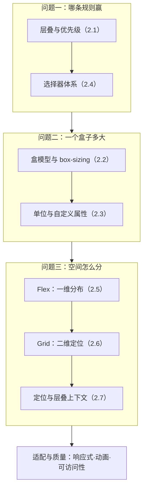
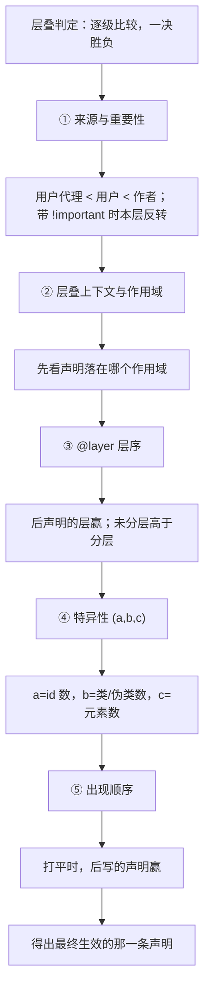
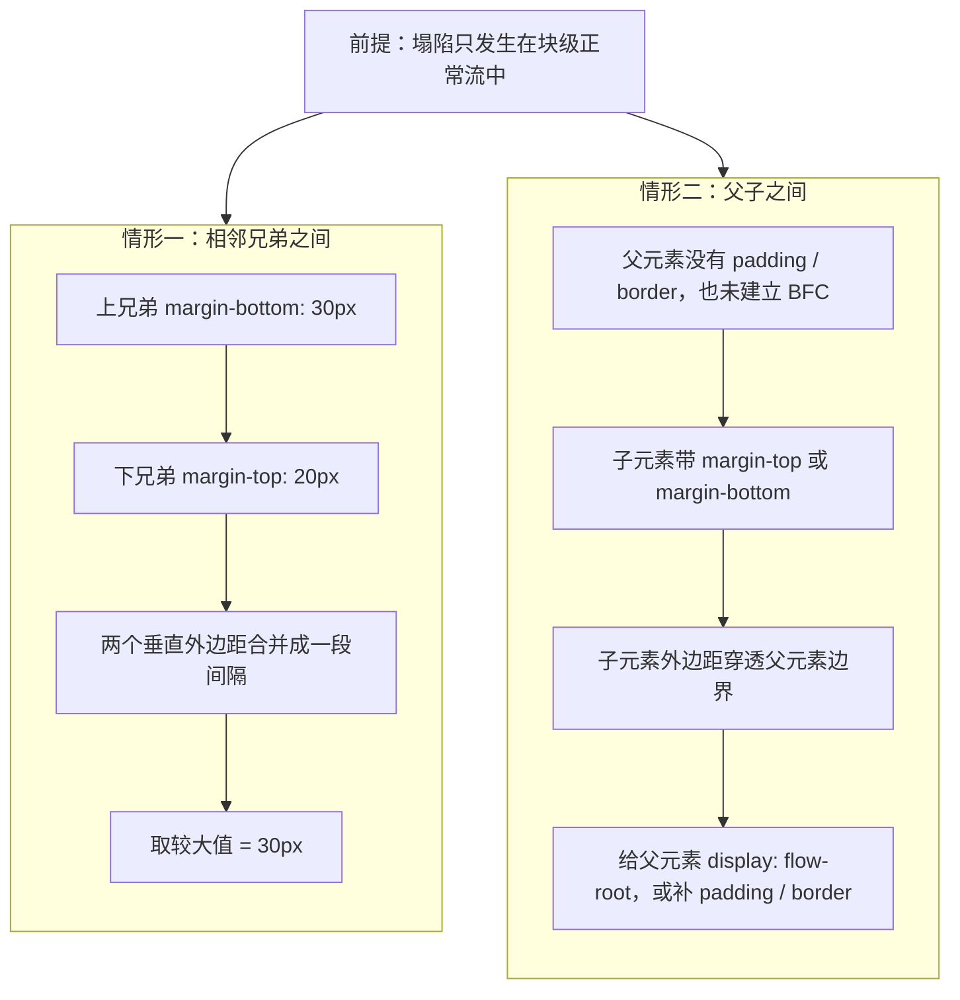
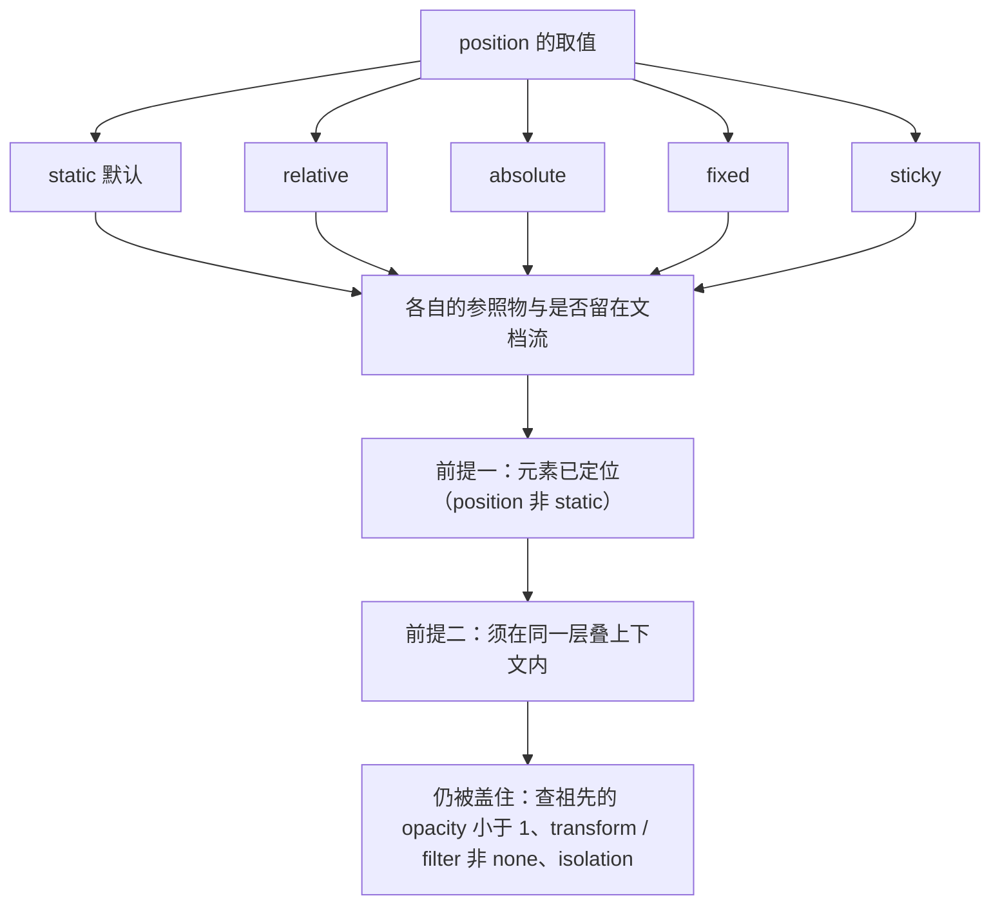

# 模块三 CSS 与布局

> **一句话**：CSS 不是给元素刷颜色的装饰语言，而是一套决定「规则谁赢、盒子多大、二维空间怎么分」的排版系统——不把它当系统看，页面就会永远在「改了不生效」和「换个屏幕就散架」之间打转。
> **自学时长**：建议 10–12 小时（可分 4 次学完） · **前置**：模块二 HTML 与语义化
> **学完你能**：
> - 默写出层叠的五级判定顺序，并对给定的两个选择器算出特异性三元组、排出胜负；
> - 算出同一个盒子在 `content-box` / `border-box` 下各自的实际占宽，说清外边距什么时候会合并、怎么阻断；
> - 独立手写一个只靠 Flex / Grid 就自适应换排的页面区块，做到无横向滚动条、键盘焦点可见、深浅色一致。

## 1. 心智模型

CSS 要回答的其实只有三个问题，把知识点挂到这三个问题上，就不会「学了一堆属性还是不会排版」：

1. **哪条规则赢？** —— 层叠、优先级、继承、`@layer`、选择器体系；
2. **一个盒子多大？** —— 盒模型、`box-sizing`、外边距塌陷、BFC、单位与自定义属性；
3. **空间怎么分？** —— 一维用 Flex、二维用 Grid，叠层用定位与层叠上下文。

最后再统一谈一件事：**适配与质量**——同一个页面在窄屏/宽屏、浅色/深色、鼠标/键盘下都得成立。



> **图 1**：本模块的全貌图——三个问题 + 一条质量线。看图要点：**先规则、再盒子、后空间**，最后才是适配；前面的部分一旦含糊，后面所有布局故障都会被误诊成「浏览器 bug」。括号里的编号是本文 §2 各节的序号，可以和后面的精讲对着看。

一句话记住这张图：**前面两层是「判据」，第三层是「工具」，质量线是「验收」**——判据错了，工具用得再熟也只会在错误的路上跑得快。

## 2. 精讲（按节推进）

### 2.1 层叠、优先级、继承与 @layer  ⏱ 约 60 分钟

**层叠（cascade）** 的白话定义：当多条声明同时命中同一个元素时，浏览器按一套**固定顺序逐级比较**，选出唯一生效的那一条——比出胜负就立刻停，不再往下看。

判定顺序是：**① 来源与重要性 → ② 层叠上下文与作用域 → ③ `@layer` 层序 → ④ 特异性 → ⑤ 出现顺序**。注意「逐级」两个字：只有前一级打平，才轮到后一级出场。很多人「后写的一定赢」的错觉，就错在跳过了前三级直接看第五级。



> **图 2**：层叠的五级判定流程——① 来源与重要性 → ② 层叠上下文与作用域 → ③ `@layer` 层序 → ④ 特异性 → ⑤ 出现顺序，逐级比较、一决胜负。看图要点：越靠前的判据越硬，特异性只在**同一层内**才轮到它出场；① 这一级是「用户代理默认 &lt; 用户样式 &lt; 作者样式」，带 `!important` 时本层内部顺序反转；② 这一级先看声明落在哪个作用域，行内样式高于所有普通作者样式；④ 的特异性三元组 `(a,b,c)` 里 `a` 是 id 数、`b` 是类/属性/伪类数、`c` 是元素/伪元素数，逐位比较、**不进位**；③ 里未分层样式高于所有分层样式，层内加 `!important` 时层序反转。

**特异性**用三元组 `(a, b, c)` 表示：`a` = id 选择器个数，`b` = 类/属性/伪类个数，`c` = 元素/伪元素个数。比较时**逐位比、不进位**。

- `.a .b` = `(0,2,0)`；`#x .b` = `(1,1,0)`；`.a.b` = `(0,2,0)`。
- 所以 `#x .b` 赢 `.a .b`：第一位 `1 > 0` 就已分出胜负，`b` 位再多也白搭——**id 一票顶十个类**。
- 「不进位」的意思是：`(0,11,0)` 不会变成 `(1,1,0)`，永远赢不了任何一个 `(1,0,0)`。

**继承**：有些属性会自动从父元素传到子孙（`color`、`font-*`、`line-height`、`visibility` 等），有些绝不继承（`margin`、`border`、`padding`）。四个关键字用来干预：`inherit`（强制取父值）、`initial`（取规范初始值）、`unset`（能继承就继承，否则当 `initial`）、`revert`（回退到上一层来源的值，如浏览器默认样式）。

**`@layer`（层叠层）**的白话定义：给样式提前**排好队**，让「浏览器默认 / 第三方库 / 业务样式」各站一列，谁也别想靠加特异性或 `!important` 插队。

```css
@layer reset, base, components;      /* 先声明层的先后：越靠后越强 */
@layer base       { .btn { color: #333; } }
@layer components { .btn { color: #2563eb; } }  /* 特异性相同，靠层序取胜 */
```

三条反直觉的规则，务必记死：**① 后声明的层赢过先声明的层；② 未分层的样式高于所有分层样式；③ 层内加了 `!important` 时，层序反转**。第 ② 条正是 `@layer` 的价值所在——分层是给「默认样式/库样式」准备的，让业务样式能轻松盖住它们；如果你把业务样式也塞进分层，就等于主动把自己的样式降级了。

`!important` 唯一还能被原谅的用法，就是配合 `@layer` 在层内翻转层序；其他场景用它救火，只会越救越乱。

> **自检**：`.a .b` 和 `#x .b` 谁赢？写出两者的三元组。

### 2.2 盒模型、box-sizing、外边距塌陷与 BFC  ⏱ 约 60 分钟

**盒模型**的白话定义：一个元素到底占多大地方，可以由内到外拆成四层账——`content`（内容区）→ `padding`（内边距）→ `border`（边框）→ `margin`（外边距）。

**`box-sizing`** 决定「你写的 `width` 到底指哪一层」：

| 取值 | `width` 指的是 | `width:200px; padding:20px; border:1px` 的实际占宽 |
|---|---|---|
| `content-box`（默认） | 只有 content | 200 + 20×2 + 1×2 = **242px** |
| `border-box` | 算到 border 外沿 | **200px**（padding/border 从 200 里面扣） |

于是很多项目的样式表第一行就是：

```css
*, *::before, *::after { box-sizing: border-box; } /* 全局第一行 */
```

为什么它是「第一课第一条」？因为设计稿上标注的宽度，是人眼看到的宽度；`border-box` 让「设的宽度」＝「看到的宽度」，心智一致。不设它，你后面加的每一个 padding 都会让盒子悄悄变胖，尺寸越调越对不上。

**外边距塌陷（margin collapse）** 的白话定义：块级正常流里，两个**垂直**外边距碰在一起时会合并成一段间隔，只留**较大的那个**——不是相加。

- **相邻兄弟之间**：上兄弟 `margin-bottom: 30px`、下兄弟 `margin-top: 20px`，实际间距是 **30px**（取大值），不是 50px。
- **父子之间**：父元素没有 padding/border、也没建立 BFC 时，首个子元素的 `margin-top` 会「穿透」父元素边界跑出去，和父元素的 margin 合并——表现为父元素整体被推下去或高度不符预期。

**BFC（块级格式化上下文）** 的白话定义：给一块区域划出「**独立的小世界**」——里面的布局怎么折腾都不影响外面，外面的也不渗进来。它是最标准的隔离手段，能阻断塌陷、也能清除浮动。显式建立它的写法就是一行：

```css
.panel { display: flow-root; }
```

为什么不用随手可得的 `overflow: hidden`？因为它虽然也能建立 BFC，却会**裁剪**需要溢出的子元素——下拉菜单、提示气泡都会被切掉一半。要隔离就明确写 `display: flow-root`。

最后一个坑：**百分比高度**。`height: 50%` 参照的是父元素的**确定**高度；父元素是 `height: auto` 时它无从参照，于是失效——「子元素百分比高度没反应」多半就是这个原因，而不是浏览器坏了。


> **图 3**：盒模型的四层结构，由内到外是 content / padding / border / margin，并以 `width: 320px`、`padding: 16px`、`border: 2px` 为例给出两种口径下的实际占宽（`content-box` 为 320 + 32 + 4 = 356px，`border-box` 为 320px）。看图要点：`width` 默认只算 content；改成 `border-box` 后算到 border 外沿，padding 与 border 从里面扣——写死尺寸前先确认用的是哪种口径。



> **图 4**：外边距塌陷的两种情形——相邻兄弟之间两个垂直外边距合并成一段间隔，取**较大值**（30px 而非 30 + 20 = 50px）；父子之间子元素的外边距会「溢出」到父元素之外。看图要点：两种塌陷都只发生在块级正常流里，给父元素写 `display: flow-root` 建立 BFC、或补上 padding / border 即可阻断，而 Flex / Grid 的子项本身不参与这种塌陷。

> **自检**：竖排两个 div，分别设 `margin-bottom: 30px` 和 `margin-top: 20px`，它们之间实际是多少像素？

### 2.3 单位体系与自定义属性  ⏱ 约 40 分钟

**单位**分两类。绝对的只有 `px`；相对的有 `rem`（参照**根元素**字号）、`em`（参照**当前元素**字号，涉及 `font-size` 属性本身时看父级）、`%`（参照父级对应尺寸）、`vw`/`vh`（参照视口宽/高）、`ch`（约等于当前字体下「0」字的宽度）。

一条通行约定：**尺寸和间距用 `rem`，组件内部需要随自身字号缩放时用 `em`**。为什么优先 `rem`？因为用户可以在浏览器里调大默认字号——用 `rem` 写的尺寸会跟着整体放大，兼顾可读性与无障碍；全站写死 `px` 则完全不理睬这个设置。

**自定义属性（CSS 变量）** 的白话定义：一个你自己命名、能在样式里复用的值，比如 `--brand`。它的关键性质是**作用域**——定义在哪个选择器里，就只在那个元素及其后代可用：

```css
:root { --brand: #2563eb; }          /* 定义在根上 → 全站可用 */
.btn  { background: var(--brand, #333); } /* 取不到时用第二个参数回退 */
```

改 `:root` 上的一条 `--brand`，全页按钮、链接、边框同时变色——这就是「换肤」不用重写选择器的基础。`@property` 可以给变量声明类型，让它在动画与过渡里表现更可预期（定性了解即可，不必背语法）。

**`clamp()`** 是流式字号与间距的常用工具：`clamp(最小值, 首选值, 最大值)`——先算首选值，再把它夹在最小与最大之间。例如 `font-size: clamp(16px, 2.5vw, 24px)`：窄屏不小于 16px、宽屏不超过 24px、中间随视口平滑变化，一个字都不用手写断点。

> **自检**：`rem` 和 `em` 各参照谁？为什么全站字号优先用 `rem`？

### 2.4 选择器体系  ⏱ 约 40 分钟

基础选择器（标签、类、id）、属性选择器（`[type="email"]`）、伪类（`:`，如 `:hover`）、伪元素（`::`，如 `::before`/`::after`）是使用频率最高的一层。真正需要额外记的是下面四个：

- **`:is()`**：把一组选择器合并写，它的特异性等于参数列表中**最高**的那个。`article :is(h1, h2, h3)` 的特异性按最高的算。
- **`:where()`**：与 `:is()` 写法相同，但特异性**恒为 0**——专门用来写「默认样式」：后面随便一个普通类就能覆盖它，不必抬特异性。
- **`:has()`**：能根据后代状态选中祖先，是迟迟才来的「父选择器」。代价是匹配复杂、动态场景下开销高，别在大范围、频繁变动的列表里滥用。
- **`:nth-child(An+B)`**：按**在兄弟中的位置**计数，`:nth-child(2n+1)` 选第 1、3、5… 个。注意它和 `:nth-of-type` 不是一回事：前者数所有兄弟里的位置，后者只数**同标签**的兄弟。

一条工程纪律：**样式不要用 id 选择器写**。id 特异性极高，后期几乎没法用类覆盖它，只能请 `!important` 出山——这就是恶性循环的起点。

> **自检**：`:is()` 与 `:where()` 的特异性差在哪？各自适合什么场景？

### 2.5 Flexbox 一维布局  ⏱ 约 60 分钟

**Flex** 的白话定义：在一个**维度**里（一行**或**一列）分配与对齐子项。容器上写 `display: flex` 后，子项会沿着**主轴**排列；与主轴垂直的那根叫**交叉轴**。**`flex-direction` 改变的正是「哪条轴是主轴」**——默认 `row`（左→右），改成 `column` 后两根轴互换。

容器属性：

| 属性 | 作用 |
|---|---|
| `justify-content` | 主轴上的分布与空隙（居中、两端、均分…） |
| `align-items` | 交叉轴上的对齐 |
| `gap` | 子项之间的间距（**唯一正确**的间距方案） |
| `flex-wrap` | 允许换行 |

子项属性：`flex`、`align-self`（单独覆盖自己的交叉轴对齐）、`order`（改变显示顺序）。

重点记 `flex: 1` 的展开：**`flex-grow:1; flex-shrink:1; flex-basis:0%`**。`flex-basis: 0%` 让自由空间从 0 起算——所以「三个 `flex:1` 等宽」是**剩余空间等分**的结果，不是把内容宽度平均分。对比 `flex-basis: auto`：它先按内容宽度占位、再分配剩余空间，结果差别很大。

两个高频错：**① 在子项上找 `align-items`**——它是容器属性；**② 用 margin 挤间距**——最后一列总会多出一块。间距一律用 `gap`。


> **图 5**：Flex 的主轴（`justify-content`）与交叉轴（`align-items`）。看图要点：主轴方向由 `flex-direction` 决定，改成 `column` 后两根轴互换；`flex: 1` 展开是 `flex-grow:1; flex-shrink:1; flex-basis:0%`，所以「三个 `flex:1` 等宽」是剩余空间等分的结果，不是平均分配。

> **自检**：子项明明写了 `width`，为什么空间不够时还会被压扁？

### 2.6 Grid 二维布局  ⏱ 约 60 分钟

**Grid** 的白话定义：同时在**行和列**两个维度里划轨道、摆项目。核心几件东西：

- `grid-template-columns` / `grid-template-rows` 划轨道；`fr` 是**剩余空间按比例分配**的弹性单位；`repeat()` 简化重复；`minmax()` 给轨道设上下界。
- `gap` 是轨道之间的空隙，**不占轨道本身**——不用再算 margin。
- `grid-auto-rows` 管隐式轨道（项目超出预设行列时自动生成的轨道）。
- `grid-template-areas` + `grid-area` 用**命名的区域名**把整页布局「画」出来，可读性最好。

**`auto-fit` 与 `auto-fill` 的区别**是本节的关键考点。两者都会按容器宽度算出「最多能放几列」，差别在**空轨道怎么办**：

- `auto-fit`：**折叠**空轨道 → 剩下的项目被 `1fr` 拉伸**铺满**整行；
- `auto-fill`：**保留**空轨道 → 项目保持 `minmax(240px, 1fr)` 的原宽，右侧**留出空位**。

所以卡片墙可以一行搞定自适应换排，一行媒体查询都不用写：

```css
.wall { display: grid; gap: 1rem;
        grid-template-columns: repeat(auto-fit, minmax(240px, 1fr)); }
```

**对齐别混**：写在容器上的 `justify-content` / `align-content` 管的是**整体轨道**在容器里的分布；`justify-items` / `align-items` 管的是**每个格子里的项目**怎么对齐。名字像、作用层次完全不同。

什么时候别用 Grid：只有一行内容、要的只是「行内怎么分布」时，Flex 更短更好懂——杀鸡不必用牛刀。


> **图 6**：Grid 的网格线从 1 开始编号，轨道是两条线之间的区域；图中是一个 3 列 × 3 行的网格，并示范了跨列（`span 2`）与 `grid-template-columns: 160px 1fr 160px` 的轨道构成。看图要点：`grid-column: 1 / span 2` 是「从第 1 条线起跨 2 个轨道」，落到第 3 条线上；`gap` 属于轨道之间、不占轨道；区域命名法与线号法是两种写法，别混着数格子。

> **自检**：`auto-fit` 与 `auto-fill` 在「一行装不满」时差在哪？

### 2.7 定位与层叠上下文  ⏱ 约 50 分钟

**`position`** 的五个取值，一个个说清「参照谁、还在不在文档流里」：

- `static`（默认）：不参与定位参照，留在文档流里。
- `relative`：相对**自身原位置**偏移，仍然占着原来的空间，常用作定位参照。
- `absolute`：脱离文档流，参照**最近的「已定位」（`position` 非 `static`）祖先**；找不到就退回初始包含块。
- `fixed`：参照**视口**，页面滚动它不动。
- `sticky`：滚到阈值就粘住。它失效的常见原因是父链上有 `overflow` 非 `visible` 的祖先，或者根本没有可滚动容器。

**层叠上下文（stacking context）** 的白话定义：一个**独立的比较作用域**——**只有位于同一层叠上下文内的元素，才按 `z-index` 数值比大小**。

它的创建条件很多，而且**常常是被无意触发的**：根元素、`position` 非 `static` 且 `z-index` 非 `auto`、`opacity` 小于 1、`transform`/`filter`/`will-change` 非 `none`、`isolation: isolate`、`contain` 等。

这就是「`z-index: 9999` 还是不生效」的根本原因：不是数值不够大，而是**两者根本不在同一个比较作用域里**。顺序永远是——**先确认两者在不在同一层叠上下文，再谈数值大小**。写 99999 也没用，因为跨上下文根本不比数值。

连带的一个坑：父级一旦有了 `transform`，子元素的 `fixed` 会变成相对该父级定位——这不是浏览器坏了，是包含块变了。



> **图 7**：五种 `position` 各自的包含块与定位参照，以及 `z-index` 生效的两个前提——元素必须已定位，且两个元素必须位于同一层叠上下文内。看图要点：`static` 留在文档流、不参与定位参照；`relative` 相对自身偏移、仍占原空间；`absolute` 参照最近的已定位祖先（找不到则退回初始包含块）；`fixed` 参照视口；`sticky` 滚到阈值粘住。写 `z-index: 9999` 仍被盖住时，先查祖先是否用 `opacity`、`transform`、`filter`、`isolation` 悄悄建了另一个层叠上下文。


> **图 8**：两个各自成层的父元素，子元素的 `z-index` 只在所属层内比较——卡片 B（`z-index: 2`）排在卡片 A 之上，于是 A 里 `z-index: 999` 的内部元素照样翻不出去。看图要点：`z-index` 不是全局数值比较，先比父级所在层叠上下文的先后，再在层内比 `z-index`；`opacity` 小于 1、`transform` / `filter` 非 none 都会新建层叠上下文。

> **自检**：`z-index: 9999` 还是不生效，第一步该查什么？

### 2.8 响应式与现代特性  ⏱ 约 50 分钟

移动适配有个绕不过去的前提——HTML 里必须有这一行，否则手机浏览器会按桌面宽度渲染再缩放整页：

```html
<meta name="viewport" content="width=device-width, initial-scale=1">
```

**媒体查询 + 移动优先**：默认样式就写给窄屏，再用 `min-width` 往上**叠加**。为什么不反过来写 `max-width`？因为移动优先的覆盖链更短、更好维护——默认样式永远是「最小的那一版」，媒体查询只做加法；桌面优先则要一路往回拆，断点越加越乱。断点要**跟着内容需要**，不要按具体机型型号设，否则新机型一出就失效。

**容器查询**解决的是媒体查询解决不了的问题：媒体查询只能问「视口多宽」，没法问「我这个组件所在的容器多宽」。给容器写 `container-type: inline-size`，组件就能按**自身容器宽度**换排——同一个视口下，侧栏里的卡片和主区里的卡片可以有不同的列数。

其余现代特性，知道各自解决什么即可：

- `aspect-ratio`：固定宽高比，做视频位、封面图不必再算 padding hack；
- `clamp()`：流式字号与间距（见 2.3）；
- `color-scheme: light dark`：声明页面支持的颜色方案，让**滚动条、表单控件等内置 UI** 跟随深浅色——只改自绘颜色是不够的；
- `prefers-color-scheme`：跟随系统深浅色偏好；
- 原生嵌套：CSS 里也能写嵌套，可读性便利，不是必需品。

> **自检**：移动优先为什么用 `min-width` 而不是 `max-width`？

### 2.9 过渡动画、可访问性与调试方法  ⏱ 约 40 分钟

`transition` 管「状态变化时的过渡」，`animation` 管「一套关键帧动画」，语法查文档即可。更重要的是**动什么属性**：

- 动 `transform`、`opacity`：可以只走**合成**阶段，不触发 Layout（重排）与 Paint（重绘），最便宜；
- 动 `left`、`top`、`width`：每一步都要重新算布局，代价高得多。

`will-change` 是**提示**，不是银弹——滥用会白白占内存。还要用 `prefers-reduced-motion` 尊重系统里「减少动态效果」的设置，避免部分用户视觉不适。

可访问性有两条硬线：

- **正文文本对比度不小于 4.5:1，大字号不小于 3:1**；
- **焦点必须可见**——不要写 `outline: none`。要自定义就用 `:focus-visible`，它只在键盘等需要焦点的操作下生效，鼠标点击不会出现难看的框。

调试路径（浏览器里的操作，按 `F12` 或 `Ctrl+Shift+I` 打开开发者工具）：

1. **样式不生效** → Elements 面板 → 右侧 **Styles**：看哪条声明的数字被划了删除线、点开右侧链接定位到「谁赢的」；再点 **Computed** 看最终生效值与它是怎么算出来的。
2. **尺寸对不上** → Styles 面板底部的盒模型示意图，悬停看 padding / margin 高亮；再核 `box-sizing`。
3. **动画卡** → **Performance** 面板：点左上角录制圆点开始、操作页面后停止，看主线程帧里有没有 **Layout** 区块。
4. **无障碍** → 只用键盘 Tab 走一遍页面，看每一步焦点是否清晰可见；对比度可在 Elements → Styles 里看颜色值给出的数值。

> **自检**：动 `left` 和动 `transform` 的性能差别在哪？

## 3. 关键概念讲透

最容易「以为自己懂了」的五个点，逐个拆。

### 3.1 层叠与 `@layer`

- **常见误解**：「后面写的样式一定能覆盖前面的」；把 `@layer` 当成加载顺序，以为先声明的层先赢。
- **正确理解**：层叠是**逐级比较**——来源与重要性 → 上下文与作用域 → 层序 → 特异性 → 出现顺序，前一级分出胜负就不再往下看。「出现顺序」排在最后，是**最后的**判据。层序里「后声明的层赢」，而且**未分层高于所有分层**。
- **反例**：`.btn { color: blue }` 写在文件末尾、且未分层；`.btn { color: red }` 写在 `@layer components` 里。结果生效的是 **blue**——尽管 red 那条位置更早、特异性相同，它仍输在层序这一级。反过来，如果业务样式被你放进了分层，就等着被未分层的库样式盖住。

一句可背的判据：**同层比特异性、特异性相同比先后；跨层只看层序。**

### 3.2 盒模型与 BFC

- **常见误解**：「`width` 就是我看到的宽度」；间距莫名合并时以为是浏览器的 bug。
- **正确理解**：默认 `content-box` 下 `width` 只管 content，加 padding/border 后盒子会变胖（`200 + 20×2 + 1×2 = 242px`）；`border-box` 下 `width` 就是总宽（`200px`）。垂直外边距合并只发生在**块级正常流**中，取大值、不相加。
- **反例**：两个卡片各写 `width: 200px; padding: 20px`，没设全局 `border-box`——排版出来每个占 240px，一行放不下，于是出现横向滚动条。你盯着 `200px` 找半天，问题其实在 `box-sizing`。

一句可背的判据：**宽度算不对先查 `box-sizing`；间距莫名合并先想外边距塌陷。**

### 3.3 一维 Flex 与二维 Grid 的边界

- **常见误解**：「Grid 更强大，什么都该用 Grid」；或反过来，拿 Flex 硬撑二维，套了三层 flex。
- **正确理解**：Flex 在**一个维度**里分配与对齐（一行**或**一列）；Grid 同时在**两个维度**里划轨道、摆项目（行**和**列）。边界不在「能不能」，而在「哪种表达更短更好懂」。
- **反例**：一行导航栏用 Grid 写也能实现，但 `display: flex; gap: .5rem` 一行就够——用 Grid 反而多出一堆 `grid-template-columns`。反过来，要求「左边固定、右边自适应、下方还有一整行页脚」时，用 Flex 就得嵌套两层才能凑出来，而 `grid-template-areas` 几行就把整页"画"清楚了。

一句可背的判据：**问自己「要控的是行内分布还是行列定位」——前者 Flex，后者 Grid。**

### 3.4 层叠上下文与 `z-index`

- **常见误解**：「`z-index` 是全局数值，写大就赢」——于是从 9 一路加到 9999、99999。
- **正确理解**：`z-index` **只对已定位（`position` 非 `static`）的元素有意义**，而且**只有同一层叠上下文内的元素才按数值比较**。创建上下文的条件很多（`position` + `z-index`、`opacity` 小于 1、`transform`/`filter`/`will-change` 非 none、`isolation: isolate` 等），往往是被无意触发的。
- **反例**：`.wrap { transform: scale(1); }` 里写 `z-index: 9999` 的浮层，被 `.wrap` 外一个只有 `z-index: 10` 的同级浮层盖住。原因不是数值小，而是 `.wrap` 顺手建了新上下文，9999 只在这个上下文内部有效。改法：去掉那个非必要的 `transform`，或把要比较的两个浮层移进同一个上下文。**先查上下文，再谈数值。**

一句可背的判据：**跨上下文不比数值——先确认两者在不在同一层叠上下文。**

### 3.5 焦点可见性与动画代价

- **常见误解**：「`outline: none` 让界面更干净」；动画一律 `transition: all` 最省事。
- **正确理解**：焦点指示是键盘用户的唯一「光标」。移除它，Tab 走一遍页面的感觉就是「不知道自己在哪」。动画则要优先动 `transform`/`opacity`（只走合成），并尊重 `prefers-reduced-motion`。
- **反例**：`* { outline: none; }` 看起来没影响——因为你的手一直在用鼠标。拔掉鼠标、只按 Tab，立刻就无法判断焦点落在哪个按钮上。正确做法是 `:focus-visible` 自定义一套清晰的焦点样式。

一句可背的判据：**焦点宁丑勿无；动画宁 transform 勿 left。**

## 4. 动手（自学版实验）

三个动手任务对应本模块的实验内容：任务一练**诊断**，任务二练**一维布局**，任务三练**二维布局 + 质量自检**。建议按顺序做，每个都动手写、别只读。

### 动手一：层叠与盒模型诊断

- **要做什么**：先自己造一个「故意写坏」的页面：在同一个 HTML 里埋下 6 处毛病——① 某个按钮的 `color` 被一条更高特异性的规则盖住；② 业务样式被放进了 `@layer`、反而压不过未分层的库样式；③ 漏写全局 `box-sizing: border-box`，设了 `width` 的盒子实际变宽；④ 子元素的 `margin-top` 溢出到父元素外；⑤ 一个悬停浮层被祖先的 `overflow: hidden` 裁掉一半；⑥ 两个相邻卡片的间距比预想的小（垂直外边距合并取了大值）。然后**逐处定位**，为每一处写下「病根—依据—改法」三行诊断记录，再真正改掉它。
- **需要什么**：任意编辑器 + Chrome 或 Edge；一个静态 HTML 文件即可，不需要构建工具（想跑本地服务器的话，本机 Node.js v26.7.0 + npm 11.19.0 起一个静态服务即可，但 `file://` 直开也够用）。浏览器操作：按 `F12`（或 `Ctrl+Shift+I`）打开开发者工具 → Elements 面板 → 用 `Ctrl+Shift+C` 直接在页面上点选元素 → 右侧 **Styles** 看被划掉的声明、点开链接定位「谁赢的」→ 旁边的 **Computed** 看最终生效值。验证 ⑤ 时，在 Styles 里给浮层临时改成 `fixed` 看它是否还能被裁。
- **验收标准**（逐条可勾）：
  - [ ] 诊断记录每一处都写明了它被**哪条规则或哪个属性**压住/影响，并能指出这在面板上的哪个位置看得到；
  - [ ] 6 处全部修复，修完页面效果与你预期一致；
  - [ ] 样式表第一行是全局 `box-sizing: border-box`；
  - [ ] 修复过程里**没有新增任何 `!important`**；
  - [ ] ⑤ 的修复方式没有沿用 `overflow: hidden`（如果是它造成的问题）。
- **卡住了看**：① ② 看 §2.1 与 §3.1；③ ④ 看 §2.2 与 §3.2；⑤ 看 §2.6 的裁剪讨论与 §2.7 的定位；⑥ 看 §2.2 的外边距塌陷。

### 动手二：只用 Flex 复原三个组件

- **要做什么**：只用 Flexbox 复原三个组件的排布——一条导航栏（Logo 靠左、菜单靠右）、一行工具栏（若干按钮均分剩余空间）、一组按钮（在盒子内水平垂直居中）。自己先定好三个组件要长什么样、在三档宽度下分别是什么排布，再动手写。禁用 `!important`、禁用行内样式；**间距一律用 `gap`**。
- **需要什么**：编辑器 + Chrome/Edge；一个 HTML + 一个 CSS 文件。查看三档宽度：把窗口拖到 **375 / 768 / 1280** 像素宽各看一遍；更省事的做法是按 `F12` 打开开发者工具后按 `Ctrl+Shift+M` 进入设备模式切换机型。验证 `flex` 简写：Elements → Styles 里点 `flex` 声明左侧的小箭头展开，会看到它其实是三个属性；元素是 flex 容器时，`display: flex` 旁会出现 flex 徽章，悬停可看每个子项的 grow/shrink/basis 值。
- **验收标准**（逐条可勾）：
  - [ ] 三个组件在 375 / 768 / 1280 三档宽度下排布都与你定下的设计一致；
  - [ ] 全项目搜索 `margin`（VS Code 里 `Ctrl+Shift+F`）确认**没有**用兄弟选择器的 margin 挤间距，间距全部来自 `gap`；
  - [ ] 能逐个说清你用到的每个 Flex 属性负责**哪条轴**，且 `flex: 1` 能说出它展开后的三个子属性值；
  - [ ] 导航项增减数量时布局不破（自己增删两项试一次）。
- **卡住了看**：§2.5 全节 + 图 5；间距问题看 §2.6 里关于 `gap` 的说明。

### 动手三：Grid 卡片墙 + 响应式与无障碍自检

- **要做什么**：搭一个完整页面区块：① 用 Grid 做整页骨架，用 `grid-template-areas` 命名主内容、侧栏、页脚；② 卡片墙用**一行** `grid-template-columns: repeat(auto-fit, minmax(240px, 1fr))` 实现自适应；③ 补齐响应式与深色模式（`prefers-color-scheme` + `color-scheme`）；④ 做一遍无障碍自查。
- **需要什么**：编辑器 + Chrome/Edge。查对比度：`F12` → Elements 选中文本 → Styles 里的颜色值会给出对比度数值（或跑浏览器的 Lighthouse 面板，勾选 Accessibility 后运行）。查键盘：拔掉鼠标，只用 Tab 走一遍。查媒体查询：VS Code 里 `Ctrl+Shift+F` 搜索 `@media`。查深浅色：操作系统切到深色，或在开发者工具里用渲染面板强制 `prefers-color-scheme: dark`。
- **验收标准**（逐条可勾）：
  - [ ] 卡片墙的 CSS 里**完全不出现** `@media` 与容器查询，仅靠那一行 `repeat(auto-fit, minmax(240px, 1fr))` 完成从 1 列到多列的自动换排（用 `@media` 关键字全局搜索，作用于卡片墙的规则应为 0 条）——**这是本任务的硬指标**；
  - [ ] 窗口从窄到宽连续缩放时，卡片列数平滑变化，**没有横向滚动条**；
  - [ ] 两栏区确实用 `grid-template-areas` 命名描述（而不是靠嵌套 div 硬凑）；
  - [ ] 只用 Tab 能走完全部可交互元素，每一步焦点都清晰可见；
  - [ ] 深色模式下自绘颜色与内置控件配色一致；
  - [ ] 正文文本对比度不低于 **4.5:1**，并写下你是怎么测的。
- **卡住了看**：② 看 §2.6 与图 6；③ 看 §2.8；④ 看 §2.9 与 §3.5；横向滚动条排查看 §2.2（固定宽度 + 漏设 `box-sizing`）。

## 5. 自测

### 5.1 客观题（答案与解析在折叠块里）

**1.** 先写了 `@layer` 内部的 `.btn { color: red }`，后写了未分层的 `.btn { color: blue }`（两者特异性相同、均无 `!important`），最终生效的是：
A. 红色，因为 `@layer` 内的样式优先级更高
B. 蓝色，因为未分层样式优先级高于所有分层样式
C. 红色，因为同特异性下先声明者优先
D. 无法判断，取决于浏览器实现
> [!success]- 答案与解析
> **B**。层叠比较里 `@layer` 层序排在特异性之前：普通声明中**未分层样式高于所有分层样式**，所以未分层那条 `.btn` 赢。A 把「分层」当成了「优先」，C 把「先声明」当成了优先——两者都说反了；D 不是理由，规范对层序有明确规定。

**2.** 判断并说明理由：**先声明的层在层序里更靠前，所以写在 `@layer components` 里的普通样式，默认一定压过没分层的样式。**
> [!success]- 答案与解析
> **错误**。层序里是「后声明的层赢过先声明的层」，而且**未分层样式高于所有分层样式**。分层设计的初衷恰恰是让默认样式、库样式容易被业务样式覆盖，不是反过来；只有层内加了 `!important` 时层序才反转。

**3.** 三条声明都命中同一元素、都未分层且无 `!important`：① `.a .b { color: red }` ② `#x .b { color: green }` ③ `.a.b { color: blue }`。最终生效的是：
A. ①　B. ③　C. ②　D. 三条一样，任选
> [!success]- 答案与解析
> **C**。按 `(id 数, 类/属性/伪类数, 元素/伪元素数)` 逐位比较、不进位：① `.a .b` = `(0,2,0)`；③ `.a.b` = `(0,2,0)`；② `#x .b` = `(1,1,0)`。第一位 `1 > 0` 就已分出胜负，② 胜——**id 一票顶十个类**，第二位再多也没用。

**4.** 三条声明都命中同一元素、都无 `!important`：① 未分层 `.btn { color: A }` ② `@layer components` 内 `#app .btn { color: B }` ③ 未分层 `#app.container .btn { color: C }`。排出最终胜负，并写出你的比较链条。
> [!success]- 答案与解析
> 最终是 **C**。链条：三条都是普通作者声明、都无 `!important`，**先比层序**——① 与 ③ 未分层、② 在 `components` 层内，未分层优先于分层，所以 ② 尽管特异性最高也先被淘汰；**再比特异性**：① = `(0,1,0)`、③ = `(1,2,0)`，③ 胜。关键在「层序先于特异性比较」——只比特异性会答成 ②。

**5.** 一个元素设 `width: 200px; padding: 20px; border: 1px`，在 `box-sizing: border-box` 下它实际占用的总宽度是：
A. 242px　B. 202px　C. 240px　D. 200px
> [!success]- 答案与解析
> **D**。`border-box` 下 `width` 算到 border 外沿，padding 与 border 从里面扣，所以占用总宽就是 `200px`。242px 是 `content-box`（默认）下的结果：`200 + 20×2 + 1×2`。

**6.** 承接上题：若改用默认的 `content-box`，该元素**内容区**实际宽度是多少？**占用总宽**又是多少？为什么？
> [!success]- 答案与解析
> 内容区仍是 **200px**，占用总宽是 **`200 + 20×2 + 1×2 = 242px`**。`content-box` 下 `width` 只管 content 那一块，padding 和 border 额外加在它外面——所以「你写的宽度」不等于「它占的地方」。这正是很多项目第一行就写全局 `box-sizing: border-box` 的原因。

**7.** 上下相邻两个块级元素分别是 `margin-bottom: 30px` 与 `margin-top: 40px`，两者的垂直间距是：
A. 70px　B. 40px　C. 30px　D. 10px
> [!success]- 答案与解析
> **B**。相邻兄弟的垂直外边距会合并成一段间隔，取**较大值**而不是相加，所以是 40px。选 A 是把两个值相加，属典型错误直觉。

**8.** 判断并说明理由：**给父元素加 `display: flow-root` 可以阻断父子之间的外边距塌陷。**
> [!success]- 答案与解析
> **正确**。`display: flow-root` 让父元素建立 BFC（独立的小世界），子元素的 margin 被关在父元素内部、不再溢出到外面。补充：`overflow: hidden` 也能阻断，但它会裁剪需要溢出的子元素（如下拉浮层），所以不是首选。

**9.** 父子外边距塌陷是什么现象？至少给出两种阻断办法，并说明各自的适用边界。
> [!success]- 答案与解析
> 现象：块级正常流里，父元素没有 padding/border、也没建立 BFC 时，首个子元素的 `margin-top`（或末个子元素的 `margin-bottom`）会「溢出」到父元素之外，与父元素的 margin 合并，表现为父元素整体被推下去或高度不符预期。办法：① 给父元素 `display: flow-root` 建立 BFC——边界清晰、不裁剪内容，首选；② 给父元素加 `padding` 或 `border` 把边界隔开——写法简单，但会改变父元素自身尺寸。边界：`overflow: hidden` 虽能阻断却会裁剪需要溢出的子元素；Flex / Grid 的子项本身不参与这种塌陷。

**10.** 关于 `rem` 与 `em` 的参照对象，正确的是：
A. `rem` 参照根元素字号，`em` 参照当前元素或父级字号
B. `rem` 参照父元素字号，`em` 参照根元素字号
C. 两者都参照视口宽度
D. 两者都参照父元素字号
> [!success]- 答案与解析
> **A**。`rem` = root em，永远看根元素（`html`）的字号；`em` 看当前元素的字号，涉及 `font-size` 属性本身时则看父级。B 把两者对调；C 描述的是 `vw`；D 漏掉了 `rem` 的根参照。

**11.** 用一条 `clamp()` 写出一段字号规则：窄屏不小于 16px、宽屏不超过 24px、中间随视口变化；并说明三个参数各自的含义。
> [!success]- 答案与解析
> 形如 `font-size: clamp(16px, 2.5vw, 24px);`。三个参数依次是**最小值、首选值、最大值**：浏览器先算首选值（这里是 `2.5vw`），再把它夹在最小与最大之间——结果不小于 16px、不大于 24px，中间一段随视口平滑变化。数值不唯一，满足上下界即可。

**12.** 关于 `:is()` 与 `:where()` 的特异性，正确的是：
A. 两者都取参数中最高的
B. `:where()` 取参数中最高的，`:is()` 恒为 0
C. 两者都恒为 0
D. `:is()` 取参数中最高的，`:where()` 恒为 0
> [!success]- 答案与解析
> **D**。`:is()` 的特异性等于其参数列表中**最高**的那个；`:where()` 的特异性**恒为 0**，所以常用来写「默认样式」——后面用任意普通类就能覆盖它，不必抬特异性。B 把两者对调。

**13.** `flex: 1` 展开后的三个子属性值是：
A. `flex-grow:1; flex-shrink:0; flex-basis:auto`
B. `flex-grow:0; flex-shrink:1; flex-basis:100%`
C. `flex-grow:1; flex-shrink:1; flex-basis:0%`
D. `flex-grow:1; flex-shrink:1; flex-basis:auto`
> [!success]- 答案与解析
> **C**。`flex: 1` = `flex-grow:1; flex-shrink:1; flex-basis:0%`。关键在 `flex-basis: 0%`：它让自由空间从 0 起算，于是「多个 `flex:1` 等宽」是**剩余空间等分**的结果，不是把内容宽度平均分。D 是 `flex: auto` 的展开。

**14.** 把下列 Flex 属性归位并说明作用：`justify-content`、`align-items`、`flex-direction`、`align-self`、`flex-basis`、`order`。
> [!success]- 答案与解析
> **容器**上的：`justify-content`（主轴上的分布与空隙）、`align-items`（交叉轴上的对齐）、`flex-direction`（决定哪条轴是主轴）。**子项**上的：`align-self`（单独覆盖自己的交叉轴对齐）、`flex-basis`（分配前的基准尺寸）、`order`（改变显示顺序）。一条轴的分工记死：主轴 = `justify-content`，交叉轴 = `align-items`；`flex-direction` 改成 `column` 后两根轴互换。

**15.** `repeat(auto-fit, minmax(240px, 1fr))` 与 `repeat(auto-fill, minmax(240px, 1fr))` 在「一行装不满」时的差别是：
A. 无差别，两者完全等价
B. `auto-fit` 折叠空轨道、项目被拉伸铺满；`auto-fill` 保留空轨道
C. `auto-fill` 会让项目换行，`auto-fit` 不会
D. 差别只在行间距，列宽不受影响
> [!success]- 答案与解析
> **B**。两者都会按容器宽度算出「最多能放几列」，差别在空轨道怎么办：`auto-fit` 折叠空轨道，剩余项目被 `1fr` 拉伸**铺满**整行；`auto-fill` 保留空轨道，项目维持 `minmax(240px, 1fr)` 的宽度、右侧**留出空位**。只说「一个折叠、一个不折叠」不够，要能说出后果（铺满 vs 留空）。

**16.** （读代码）容器 `display: flex` 含三个子项，其中两个写了 `flex: 1`。说明三者最终的占宽关系，并解释 `flex: 1` 展开后的三个子属性值。
> [!success]- 答案与解析
> 写了 `flex:1` 的两个子项按 `flex-basis:0%` 起算、再按 `flex-grow:1` 平分**剩余空间**，所以两者等宽拉伸；没写的第三个按其内容宽占位（`flex-basis:auto`），既不主动拉伸，空间不足时因 `flex-shrink` 默认为 1 仍可能被压缩。「等宽」不是把内容平均分，而是自由空间等分——这正是 `flex-basis: 0%` 与 `auto` 的核心差异。

**17.** （读代码）同一段卡片墙代码，把 `repeat(auto-fit, minmax(240px, 1fr))` 改成 `repeat(auto-fill, minmax(240px, 1fr))`，在「一行装不满」时视觉上会出现什么差别？为什么？
> [!success]- 答案与解析
> 改成 `auto-fill` 后右端会**留出空位**：空轨道被保留下来，卡片保持 `240px` 以上的原宽、不再被拉伸铺满。原因就是空轨道处理方式不同——`auto-fit` 折叠空轨道后剩余项目分到更多 `1fr`，`auto-fill` 不折叠，`1fr` 被空轨道占着。

**18.** 关于动画与焦点可见性，正确的是：
A. 动画优先动 `left`/`top`，因为写法更直观
B. 为界面整洁可对全部元素写 `* { outline: none; }`
C. 动画优先动 `transform`/`opacity`，且必须保留可见焦点、不用 `outline: none` 移除
D. `prefers-reduced-motion` 只对移动端生效
> [!success]- 答案与解析
> **C**。`transform`/`opacity` 可以只走合成阶段，不触发重排（Layout）与重绘（Paint）；动 `left`/`top`/`width` 会让浏览器每一步都重算布局，代价高。`outline: none` 会移除键盘焦点指示，键盘用户完全不知道当前操作在哪——应当用 `:focus-visible` 自定义可见样式，而不是删掉。`prefers-reduced-motion` 跟随系统设置，与设备类型无关。

**19.** 外层 `.wrap` 上有 `transform: scale(1)`，内部浮层写了 `z-index: 9999`，却仍被另一个同级浮层盖住。指出真因，并给出两种可行改法。
> [!success]- 答案与解析
> 真因：`transform` 非 `none` 会在 `.wrap` 上**创建新的层叠上下文**，内部浮层的 `z-index: 9999` 只在 `.wrap` 这一层内比大小；另一个同级浮层处在 `.wrap` 之外的上下文里，两者**不在同一层叠上下文**，数值再大也比不到一起。改法：① 去掉 `.wrap` 上非必要的 `transform`（或换成不创建上下文的写法）；② 调整结构，把两个要比较的浮层放进同一个层叠上下文（例如都提升到共同的父容器下）。顺序永远是：先查层叠上下文，再谈 `z-index` 数值。

**20.** （读代码）`.wrap` 上有 `opacity: .99`，内部浮层写 `z-index: 9999`，另一个同级浮层只有 `z-index: 10` 却能盖住它。指出真因与修复方向，并说明为什么「把 9999 改成 99999」无济于事。
> [!success]- 答案与解析
> `opacity` 小于 1 同样会创建新的层叠上下文，内部浮层的 `z-index` 只在该上下文内比较；同级浮层处在另一上下文，所以 `z-index: 10` 也能盖住它。修复方向：去掉 `.wrap` 上非必要的 `opacity`（或改用不创建上下文的替代写法），或把浮层移出该上下文。改数值无效的原因：**不同层叠上下文之间不按 `z-index` 数值比较**，数字加到多大都翻不出所属上下文。

**21.** 判断并说明理由：**移动优先的写法应默认写窄屏样式，再用 `min-width` 媒体查询向上叠加。**
> [!success]- 答案与解析
> **正确**。移动优先＝默认样式写给窄屏，媒体查询只做「往上加」的叠加，覆盖链更短、更好维护；`max-width` 是桌面优先思路，断点越加越乱。另外断点应跟着内容需要走，不要按具体机型型号设。

**22.** 判断是否达标并说明理由：**为了「界面干净」，给所有元素加 `* { outline: none; }`**；并给出既保住焦点可见、又不破坏设计感的替代方案。
> [!success]- 答案与解析
> **不达标**。`outline: none` 移除了键盘焦点指示，只用键盘操作的人完全不知道焦点在哪（自己按 Tab 走一遍就能体会）。替代方案：用 `:focus-visible` 自定义可见样式（颜色、外框、下划线等）——它只对键盘等需要焦点的操作生效，鼠标点击不会出现难看的框，设计感与可访问性兼得。

### 5.2 动手题（不给实现，只给验收标准与评分点）

**1.** 实现一个卡片墙 + 两栏内容区的响应式页面区块。
- **验收标准**：卡片墙的 CSS 里完全不出现 `@media` 与容器查询，仅靠一行 `repeat(auto-fit, minmax(240px, 1fr))` 完成 1 列到多列的自动换排；窗口从窄到宽连续缩放时列数平滑变化、无横向滚动条；两栏区用 `grid-template-areas` 命名描述（主内容 / 侧栏 / 页脚）；键盘只用 Tab 能走完全部可交互元素且每步焦点可见；正文文本对比度不低于 4.5:1。
- **评分点**：零媒体查询达标（**一票否决项**）；网格区域命名是否可读；响应式与深浅色一致性；无障碍自查记录是否真实（要有做法与结论，不能只打钩）。

**2.** 只用 Flexbox 复原三个组件：一条导航栏、一行工具栏、一组水平垂直居中的按钮。
- **验收标准**：在 375 / 768 / 1280 三档宽度下排布都与你定下的设计一致；间距一律用 `gap`，样式表里搜不到用兄弟选择器 margin 挤间距；`flex` 简写不作玄学使用，能说清它三个子属性各是多少；导航项增减时布局不破。
- **评分点**：功能与视觉还原；主轴/交叉轴属性是否用对；间距方案是否用 `gap` 而非 margin。

## 6. 自我检查清单

- [ ] 能不查资料默写出层叠的五级判定顺序，并解释 `@layer` 与 `!important` 的反向关系
- [ ] 样式表第一行就是全局 `box-sizing: border-box`，且能说清它解决什么问题
- [ ] 能解释相邻元素外边距为什么会合并、父子塌陷怎么阻断
- [ ] 全站尺寸与间距使用相对单位；把根字号改大时，整页尺寸按比例联动
- [ ] 分得清 `:is()` 与 `:where()` 的特异性差异，并知道何时该用后者
- [ ] 能一句话说清 Flex 与 Grid 各自的适用边界，动手前先判断是一维还是二维
- [ ] 间距一律用 `gap`，没有用兄弟选择器的 margin 硬挤
- [ ] 遇到 `z-index` 不生效时，第一步是查层叠上下文而不是把数值加大
- [ ] 页面在只用键盘 Tab 时可完整操作，焦点每一步都看得见
- [ ] 深色模式跟随系统，且声明了 `color-scheme`，内置控件配色一致
- [ ] 动画优先使用 `transform`/`opacity`，并尊重 `prefers-reduced-motion`

## 7. 出处与依据说明

- **有官方依据的部分**（概念、规范状态，逐条对应到具体来源）：

| 本文小节 | 对应内容 | 出处 |
|---|---|---|
| §2.1–§2.4、§3.1、§3.2 | 层叠与优先级、选择器、单位与自定义属性、现代特性的系统讲解 | [web.dev Learn CSS](https://web.dev/learn/css) |
| §2.5、§3.3 | Flexbox 的轴、对齐与子项属性等基本概念 | [MDN Flexbox 基本概念](https://developer.mozilla.org/zh-CN/docs/Web/CSS/Guides/Flexible_box_layout/Basic_concepts) |
| §2.6、§3.3 | Grid 的轨道、`fr`、`minmax`、区域等基本概念 | [MDN Grid 布局基本概念](https://developer.mozilla.org/zh-CN/docs/Web/CSS/Guides/Grid_layout/Basic_concepts) |
| §2.9、§3.5 | 渲染主路径与「哪些改动触发重排、哪些只走合成」 | [MDN 关键渲染路径](https://developer.mozilla.org/zh-CN/docs/Web/Performance/Guides/Critical_rendering_path) |
| §2.9、§3.5、动手三 | 对比度、焦点可见、动效克制等可访问性要求 | [MDN 无障碍](https://developer.mozilla.org/zh-CN/docs/Learn_web_development/Core/Accessibility) |
| §1、§2 全节、§4 | 学习路径与「从萌新到舒适而非到专家」的深度界定 | [MDN 学习 Web 开发](https://developer.mozilla.org/zh-CN/docs/Learn_web_development) |

用到的域名：`web.dev`、`developer.mozilla.org`、`www.w3.org`（仅作规范状态检索的站点，不给具体路径）。其余资料（教案、库内题库、教材）只写名称，不写网址。

- **属本人/课程组编排判断（无官方依据）**：
  1. §1 的「三个问题 + 一条质量线」框架、§2 各节的顺序与建议时长，是为便于自学而做的编排，官方资料没有这种课时规定；
  2. §3 各条末尾「一句可背下来的判据」是为便于记忆而归纳的口诀，**不是规范原文表述**；
  3. §2.3「尺寸用 rem、局部缩放用 em」的约定、§2.9「动画优先 `transform`/`opacity`」的性能建议，是把官方对渲染路径与单位的描述**用于工程判断**后的经验结论；
  4. §4 动手任务的难度梯度、时间估计与验收标准，§5.2 的评分点与「零媒体查询为一票否决项」的权重设定，均为本课程组的教学判断；
  5. §5 自测题的来源：客观题改写自本库教案 [[03-教案 M3 CSS 与布局]] 第 7 节与题库 [[11-习题集 M1-M5]] 的 M3 部分（第 33–54 题），按自学者视角重写并统一了口径（特异性三元组以 `#x .b` = `(1,1,0)` 为准）；答案与解析是重写而非照抄。
- **不确定项**：
  - CSS Grid Layout Level 1 的规范状态：截至公开资料仍标为 **W3C Candidate Recommendation**（候选推荐），而非最终 Recommendation。浏览器全都支持了、规范自己还挂在 CR，这不是旧闻，而是「实现进度可以跑在规范定稿前面」的活标本——本文只陈述这一事实，不对其后续进度作预测，请以标准组织站点的状态字段为准。
  - §4 动手一在课程材料里原本由任课方准备那个「故意写坏的页面」；自学版改为由你自己按 6 项清单造出这些毛病——改动只在「谁来造这个坏页面」，缺陷清单本身不变。
  - 版本号口径：本文只提到本机 Node.js **v26.7.0** 与 npm **11.19.0**（可选的本地静态服务器环境），其余版本号一律不涉及。

## 安全视角

本模块把 CSS 当「表现层」——但样式能覆盖界面，于是**「表现」可以变成欺骗**：注入的可能是结构与样式（界面伪造、钓鱼式遮挡），而不是脚本。

- CSS 注入（属性值／选择器值可控）可做内容遮挡与界面伪造，属 WSTG 客户端测试里的「CSS 注入」项（见 [[22-前端安全专章（OWASP × ATT&CK）]] §3.2）。
- §2.7 的层叠上下文解释了同一件事的另一面：一个高 `z-index` 的透明层就能盖住你的按钮——把页面嵌进框架再蒙一层，就是点击劫持（§5）。
- 现代防御落在响应头：`frame-ancestors`（推荐）或 `X-Frame-Options`；要点见 [OWASP 点击劫持防御速查](https://cheatsheetseries.owasp.org/cheatsheets/Clickjacking_Defense_Cheat_Sheet.html)。

---

上一篇：[[02-模块二 HTML 与语义化]] · 下一篇：[[04-模块四 JavaScript 语言核心]] · 本模块教师版：[[03-教案 M3 CSS 与布局]]
