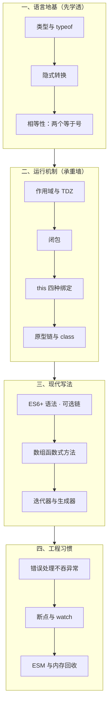
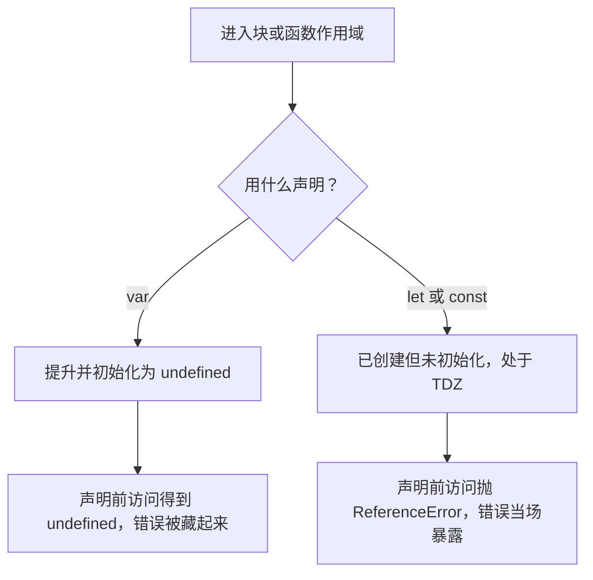
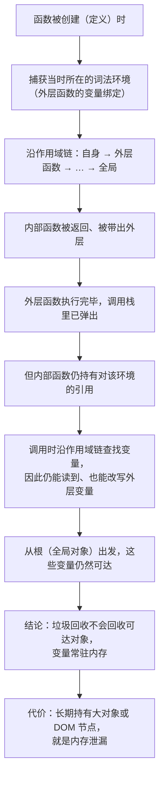
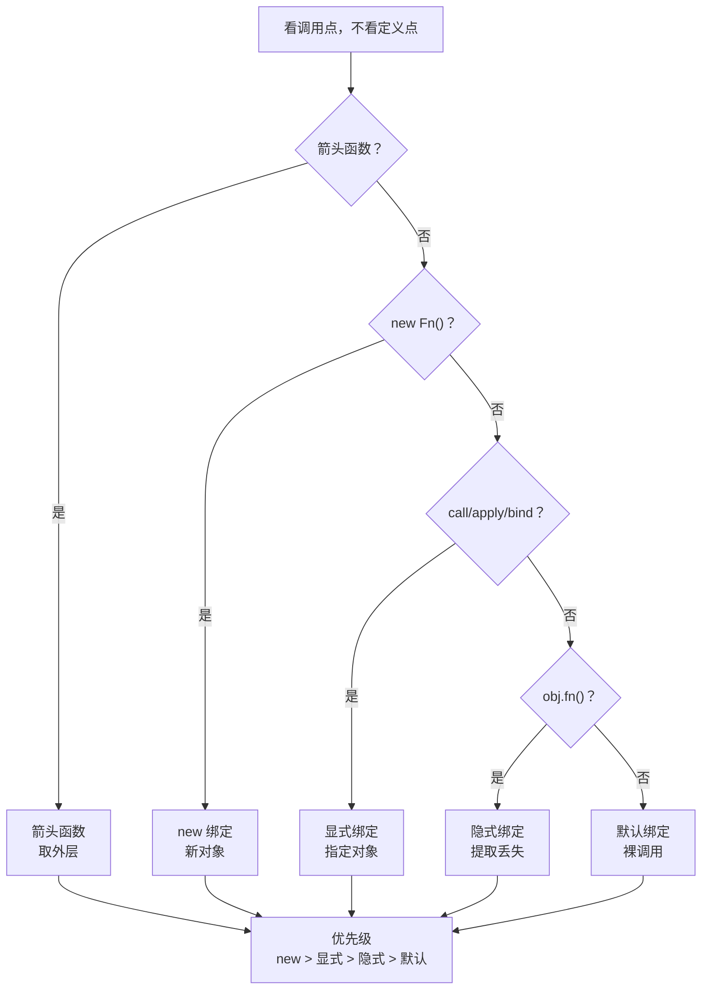
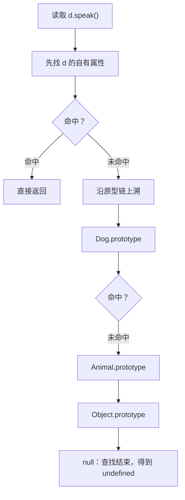

# 模块四 JavaScript 语言核心

> **一句话**：这一模块不教你「多记几条语法」，而是把「JS 为什么这样跑」变成一条条**能先写下答案、再运行核对**的可预测规则——相等性、作用域、`this`、原型一旦能被预测，前端大半「玄学 bug」就降级成可定位的工程问题。
> **自学时长**：建议 10–12 小时（可分 3–4 次学完） · **前置**：模块二《HTML 与语义化》、模块三《CSS 与布局》
> **学完你能**：
> 1. 对一小段 JS **先预测**输出、`this` 指向与相等性结果，再运行核对，并写清不一致处的成因；
> 2. 用调试器的**断点 + watch**，在一段含隐式转换或作用域缺陷的代码上定位并改对问题；
> 3. 独立写出一个不依赖任何框架、用闭包封装私有状态、用 ESM 导出、异常不吞的「待办清单核心模块」。

## 1. 心智模型

JS 的知识点看起来很散，但它们挂在四根柱子上。先看全貌，再逐节深入。



> **图 1**：本模块知识地图——四根柱子：语言地基（类型与相等）、运行机制（作用域、闭包、`this`、原型）、现代写法（ES6+ 与数组方法）、工程习惯（错误处理、调试、模块）。
> 这张图在说什么：**前两根柱子决定「代码怎么跑」，后两根决定「写出别人能接手的代码」**。图改成了分组竖排（原横排会超出笔记窗格），**自上而下就是建议的学习顺序**。学的时候别按目录平均用力——地基和运行机制是承重墙，先学透。

**这门语言的怪不是随机怪。** 1995 年，Brendan Eich 在网景用大约十天做出原型，它最初叫 Mocha、随后叫 LiveScript，为配合当时的市场宣传被改名为 JavaScript——**它与 Java 没有语言血缘**，名字是营销产物。仓促出身留下两件至今仍在影响我们的事：一批历史遗留行为（`typeof null` 就是其中之一），以及早期没有任何标准化约束（1996 年微软推出 JScript，互不兼容的实现分裂才推动了标准化）。1997 年 6 月 ECMA 大会通过 ECMA-262 第 1 版；1999 年第 3 版后语言长期停滞；第 5 版由 2009 年 12 月的 ECMA 大会通过，带来严格模式与 JSON 支持；**真正的转折是第 6 版（ES2015），由 2015-06-17 的 ECMA 大会通过**——模块、`class`、词法作用域（`let`/`const`）、Promise、解构一次性进入语言，此后改为**年度版本制**。

> 记住这段的用处：当 `typeof null === 'object'`、`NaN !== NaN`、`==` 的隐式转换让你抓狂时，你要意识到这是**早期设计取舍 + 向后兼容承诺**的产物。**记住结论、理解成因，比死记更不容易出错。**

## 2. 精讲（按节推进）

### 2.1 类型系统与 `typeof`　⏱ 约 35 分钟

**JS 有七种原始类型**（`number` `string` `boolean` `null` `undefined` `symbol` `bigint`）**加一种对象类型**（对象；数组、函数、日期等都在这一大类里，靠内部类别区分）。原始类型的值是不可变的，对象是引用传递的。

`typeof` 返回一个字符串，但**两个例外必须背下来**：

| 表达式 | 结果 | 说明 |
|---|---|---|
| `typeof 1` | `'number'` | 含 `NaN`、`Infinity` |
| `typeof 'a'` | `'string'` | |
| `typeof true` | `'boolean'` | |
| `typeof undefined` | `'undefined'` | |
| `typeof 10n` | `'bigint'` | |
| `typeof Symbol()` | `'symbol'` | |
| **`typeof null`** | **`'object'`** | 历史遗留：早期按类型标签判定，`null` 的标签位落在对象分支上 |
| **`typeof function(){}`** | **`'function'`** | 函数本属对象大类，但 `typeof` 特判为 `'function'` |

**结论落到用法上**：判空统一写 `x === null`，**永远不要写 `typeof x === 'object'` 来判空**——`null` 会一起进分支。

`NaN` 也值得单独记：它是「计算失败但类型仍是数字」的产物（`0/0`、`Number('abc')`、`parseInt('x')`）。它有两个反直觉性质：

```js
NaN === NaN                     // false ← 与自身都不相等
Number.isNaN('abc')             // false ← 不做转换，只对真正的 NaN 为 true
isNaN('abc')                    // true  ← 先转数字：'abc' → NaN，所以为 true
Object.is(NaN, NaN)             // true
Object.is(0, -0)                // false ← 比 === 更"严格"的一处
```

**判 `NaN` 用 `Number.isNaN(x)`**（不转换），不要用全局 `isNaN`（会先做数字转换，把 `'abc'` 也算成 `NaN`）。

> **自检**：`isNaN('abc')` 和 `Number.isNaN('abc')` 结果一样吗？为什么？

### 2.2 隐式转换与相等性（`==` / `===`）　⏱ 约 45 分钟

**白话定义**：`===`（严格相等）先比类型，类型不同直接 `false`；`==`（抽象相等）在类型不同时会按一套转换规则「努力让它们相等」，涉及字符串转数字、布尔数字化、对象的 `ToPrimitive`（先调 `valueOf`/`toString`）。

先建立直觉：`==` 不是「宽松一点的比较」，而是**一套真的会改变值的转换算法**。逐条读下面这组表达式，注意每条背后的转换链：

```js
1 == '1'          // true  ← 字符串转数字
0 == false        // true  ← false 转数字为 0
'' == 0           // true  ← 空串转数字为 0
null == undefined // true  ← 规范特例：这俩互相相等
null == 0         // false ← 反直觉！null 只与 undefined 宽松相等
[] == false       // true  ← [] 经 ToPrimitive 变 ''，再变 0
[] == ![]         // true  ← 两边都变成 0
NaN === NaN       // false
typeof null       // 'object'
```

**为什么语言要这样设计**：早期的 JS 要方便处理表单输入（表单里一切都是字符串）和各处松散的数据来源，`==` 的宽松在当时算「方便」。但宽松带来不可预测，**标准化之后主流规范转向只用 `===`**。

**为什么 `[] == false` 为真**：`[]` 通过 `ToPrimitive` 变成 `''`，`''` 转数字为 `0`；`false` 转数字也是 `0`；故相等。

**和相邻概念的边界**：
- `null == undefined` 为 `true`，但 `null == 0` 为 `false`——这是 `==` 唯一的「一箭双雕」能力：`x == null` 能同时命中 `null` 和 `undefined`。
- `Object.is` 比 `===` 还「严格」：`Object.is(NaN, NaN)` 为 `true`、`Object.is(0, -0)` 为 `false`。

**一句可背的判据**：**类型不同就别比；只有明确要「同时命中 `null` 和 `undefined`」时才用 `==`（并写注释说明意图），其余一律 `===`。**

> **自检**：写出 `[] == false` 为真的完整推理链（三步）。

### 2.3 作用域、提升与暂时性死区、严格模式　⏱ 约 50 分钟

**白话定义**：作用域就是「一个名字在代码的哪些位置可见」。JS 用**词法作用域**——**看代码写在哪儿**，不看运行时谁调用了它（后者叫动态作用域，JS 不用）。作用域有函数级（`var`）和块级（`let`/`const`，`{}` 即成块）两种。

**提升（hoisting）** 是理解这块的关键：

- `var` 的**声明**被提到作用域顶部，并**初始化为 `undefined`**；
- **函数声明整体提升**（连函数体一起）；
- `let`/`const` 的声明也「被创建」了，但**没有初始化**——在初始化之前访问，会落进**暂时性死区（TDZ）**，抛 `ReferenceError`。

```js
console.log(a) // undefined ← var 提升并初始化为 undefined
var a = 1

console.log(b) // ReferenceError: Cannot access 'b' before initialization
let b = 2
```

**`let` 到底有没有提升？** 有「创建」但没有「初始化」，所以处于 TDZ。**这恰恰是它比 `var` 安全的地方**：把「用了还没赋值的变量」从静默的 `undefined` 变成响亮的报错。用 `var` 时 `undefined` 会一路带下去继续参与运算，错误被藏起来；TDZ 把错误当场暴露在声明之前。



> **图 2**：`var` 与 `let`/`const` 在「声明之前」这一段时间里的行为差异。
> 这张图在说什么：两者的区别不在「有没有提升」，而在**提升后有没有被初始化**——这一个差别，决定了错误是被藏起来还是当场报出来。

**严格模式**：写在脚本/函数开头的 `'use strict'` 会带来一批收紧（未声明就赋值抛错、禁止删除不可删属性等），其中对 `this` 的影响要记住：

```js
function f() { 'use strict'; return this }
f()            // undefined ← 非严格模式下这里是全局对象
```

**重要但常被忽略的一条**：**ESM 与 `class` 体默认就是严格模式**，不必手写 `'use strict'`。在模块里写 `'use strict'` 属于自我安慰。

> **自检**：严格模式下裸调用一个函数，`this` 是什么？非严格模式下呢？

### 2.4 闭包　⏱ 约 60 分钟

**白话定义**：闭包 = 内部函数记住了它**被定义时所在的词法环境**；即使外层函数已经执行完、从调用栈里弹出了，那个环境里的变量依然可达、可读、可写。

```js
function counter() { let n = 0; return () => ++n }
const next = counter(); next(); next() // 1 2
```

两个经典用途：**私有变量**（外部拿不到 `n`，只能通过闭包暴露的方法改它）和**函数工厂**（用参数生成行为不同的函数）。

**为什么 `n` 在外层函数执行完后没被回收**：返回的箭头函数持有对外层词法环境的引用，这条引用链让 `n` 从根（全局对象）可达；**垃圾回收不会回收可达对象**，所以它常驻内存。



> **图 3**：作用域链与闭包——函数创建时捕获外层词法环境 → 内部函数被带出后仍持有该引用 → 调用时沿作用域链仍可读写外层变量 → 这些变量从根可达、不被回收。
> 看图要点：闭包捕获的是**绑定**而不是值的快照，所以 `var` 循环里所有回调共享同一个 `i`，输出才是 `[3, 3, 3]`。

**最经典的一个陷阱**：

```js
const fns = []
for (var i = 0; i < 3; i++) fns.push(() => i)
fns.map(f => f())  // [3, 3, 3] ← var：三个函数共享同一个绑定
// 把 var 换成 let：(0, 1, 2) ← 每轮迭代新建一个绑定
```

**为什么 `var` 版本全是 3**：`var` 只有一个函数级绑定，循环结束后它就是 3，所有闭包读到的都是这同一个绑定。`let` 在每次迭代时新建绑定，各自被自己的闭包捕获。

**代价**：被闭包引用的变量常驻内存；若它引用了大对象或已被移出文档的 DOM 节点，且闭包长期存活，就等于内存泄漏。这也是「事件监听器、防抖节流」需要关注生命周期的原因。框架里同样如此——React 的 `useEffect` 依赖数组与「旧值」问题、事件回调、防抖节流，本质都是闭包捕获了某个时刻的绑定。

> **自检**：闭包捕获的是「变量的值快照」还是「变量绑定」？用一个循环例子说明差别。

### 2.5 `this` 的四种绑定与箭头函数　⏱ 约 60 分钟

**白话定义**：`this` 是函数被**调用时**确定的一个隐式参数，指向「调用点的相关对象」，由**调用方式**决定，与函数**定义在哪里**无关。

| 调用方式 | 绑定类型 | `this` 指向 |
|---|---|---|
| `obj.fn()` | 隐式绑定 | `obj` |
| `fn()` 裸调用 | 默认绑定 | 严格模式 `undefined`，非严格模式是全局对象 |
| `fn.call(x)` / `fn.apply(x)` / `fn.bind(x)` | 显式绑定 | 指定的 `x`（`bind` 返回新函数且不可再被覆盖） |
| `new Fn()` | new 绑定 | 新创建的那个对象 |

**优先级**：`new` > 显式（`bind`）> 隐式 > 默认。判 `this` 只看**调用点**，不看定义点。

```js
const obj = { name: 'A', hi() { return this.name } }
obj.hi()            // 'A'
const f = obj.hi
f()                 // undefined（严格模式）← 方法被"提取"后隐式绑定丢失

function G() { this.x = 1 }
const bound = G.bind({ x: 0 })
new bound().x       // 1 ← new 优先于 bind

const o = { name: 'B', hi: () => this.name }
o.hi()              // undefined ← 箭头函数不看调用点
```

**箭头函数**没有自己的 `this`/`arguments`/`prototype`，它的 `this` 取自定义处外层。由此推出三条结论：不能被 `call`/`apply`/`bind` 改变；不能当构造函数（`new` 会报错）；也不适合做对象方法（拿不到对象自身）。



> **图 4**：`this` 的逐级判定流程——先判是不是箭头函数，不是再按 **new 绑定 > 显式绑定（`call`/`apply`/`bind`）> 隐式绑定 > 默认绑定** 由高到低判一遍。
> 看图要点：判 `this` 只看**调用点**；方法被提取成 `f = obj.fn` 再裸调时隐式绑定当场丢失（严格模式得 `undefined`），而箭头函数没有自己的 `this`，三种显式方法都改不了它。

**最常踩的场景**：把对象方法当回调传出去（`setTimeout(obj.hi, 0)`），隐式绑定就丢了。三种修法：`obj.hi.bind(obj)`、提前缓存 `const self = obj`、或把 `hi` 写成箭头函数以取外层 `this`。

> **自检**：`new` 和 `bind` 谁优先？箭头函数的 `this` 能被 `call` 改吗？

### 2.6 原型链、`class` 与 `instanceof`　⏱ 约 55 分钟

**白话定义**：每个对象内部有一个指向「它的原型对象」的引用，形成一条链；访问一个属性时，先看对象自己有没有，没有就沿这条链往上找，直到 `null`。这条链就叫**原型链**。

先分清三个名字：实例的内部原型（`__proto__` 是它的访问器）、**构造函数的 `prototype`**、以及 `constructor`。

**属性查找顺序**：实例自有属性 → 沿原型链逐级上溯 → 到 `null` 仍未命中则得到 `undefined`。



> **图 5**：属性查找的顺序——先自有属性，再沿原型链逐级上溯，直到 `null` 结束。
> 这张图在说什么：**方法之所以要放在原型上，就是因为链上的所有实例共用同一份**；而每个实例各自不同的数据，应该放在实例自己身上。

**实例属性 vs 原型方法**：数据（每个实例不同）放**实例**；方法（所有实例共用）放**原型**。方法写进构造器里会给每个实例各造一份，白白吃内存。

**`class` 是语法糖**：方法落在 `prototype` 上，实例字段落在实例上；`extends`/`super` 建立原型链；`class` 体默认严格、必须用 `new` 调用。

```js
class Animal { speak() { return '...' } }
class Dog extends Animal { speak() { return 'woof' } }
const d = new Dog()
Object.getPrototypeOf(d) === Dog.prototype                 // true
Object.getPrototypeOf(Dog.prototype) === Animal.prototype  // true
d instanceof Animal                                        // true
```

**`instanceof` 到底在比什么**：沿对象的原型链上溯，检查有没有某一环等于右侧构造函数的 `prototype`。`d` 的原型链上有 `Dog.prototype` 和 `Animal.prototype`，所以 `d instanceof Animal` 为 `true`。

**红线**：直接改 `__proto__`、或往 `Object.prototype` 上挂东西，会污染所有对象——不要做。

> **自检**：为什么方法要放原型上，而不是写进构造器？

### 2.7 ES6+ 语法与数组函数式方法　⏱ 约 70 分钟

这一节是全模块的承重墙，量最大。

**解构**：对象/数组、默认值、重命名、嵌套都能写：

```js
const { id, name: label = '匿名', addr: { city } = {} } = user
const [first, ...rest] = list          // 数组解构 + rest
const [a = 1, b = 2] = [undefined]     // 默认值只对 undefined 生效
```

**展开与 rest**：`...` 在「取出」位置是 rest（收拢），在「放进」位置是展开。**展开是浅拷贝**——嵌套对象里的引用不会跟着复制。

**模板字符串**：反引号 + `${}`，可跨行。

**可选链 `?.` 与空值合并 `??`——本节最高优先级**：

```js
0 ?? 20   // 0   ← ?? 只在 null/undefined 时取右
0 || 20   // 20  ← || 把假值统统取右，真实 bug 的源头
'' ?? 'x' // ''
'' || 'x' // 'x'
a?.b?.c ?? '默认'   // 可选链负责"安全取值"，?? 负责"兜底"
```

**为什么要有 `??`**：`||` 的语义是「逻辑或」，天生把 `0`/`''`/`false`/`NaN` 当假值；但配置、计数、分页这些场景里 **`0` 和 `''` 是合法值**。于是引入了只针对「空」的 `??` 来补这个缺口。**默认写 `??`。**

（语法限制：`??` 与 `||`/`&&` 不能不加括号混用，需要时用括号明确优先级。）

**数组函数式方法**，按语义记，别按名字记：

| 方法 | 语义 | 返回 |
|---|---|---|
| `map` | 一对一映射 | 新数组，长度不变 |
| `filter` | 筛选 | 新数组（子集） |
| `reduce` | 归约成单值 | 累加结果 |
| `find` / `findIndex` | 找第一个 | 元素 / 下标（找不到为 `undefined` / `-1`） |
| `some` / `every` | 存在 / 全部 | 布尔 |
| `forEach` | 只遍历 | **`undefined`；返回值被忽略，且不能中断** |

**易错三项**：

```js
[10, 1, 2].sort()                 // [1, 10, 2] ← 默认转字符串按 UTF-16 码元比较
[10, 1, 2].sort((a, b) => a - b)  // [1, 2, 10] ← 数字排序必须传比较函数

const list = [1, 2, 3]
list.slice(1, 3)  // [2,3]，list 不变（非原地）
list.splice(1, 2) // [2,3]，list 变成 [1]（原地，破坏性）

[3, 1, 2].toSorted()   // [1, 2, 3]，返回新数组，不改原数组
```

- `sort` **原地排序**且默认按字符串比较；
- `slice` **不原地**、`splice` **原地**（改原数组）；
- `toSorted`/`toReversed` 是「不改原数组」的新方法。

**`forEach` 里写 `return` 有用吗？** 没用，返回值被丢弃且不能提前中断。要映射用 `map`、要查找用 `find`、要提前停用 `some`/`every` 或 `for...of`。

> **自检**：分页参数传 `0`，写 `pageSize || 20` 和 `pageSize ?? 20` 结果差在哪？哪一个是 bug？

### 2.8 迭代器与生成器　⏱ 约 40 分钟

**白话定义**：一个对象只要实现了 **`Symbol.iterator` 方法**（可迭代协议），就能被 `for...of` 和展开消费；这个方法要返回一个**迭代器**，迭代器的 `next()` 每次返回 `{ value, done }`（迭代器协议）。

```js
function* range(start, end) {
  for (let i = start; i < end; i++) yield i
}
[...range(1, 4)]   // [1, 2, 3]
const it = range(1, 3)
it.next()          // { value: 1, done: false }

for (const v of { a: 1 }) {}   // TypeError ← 普通对象默认不可迭代
```

**`for...of` 消费的是可迭代对象**；**普通对象默认不可迭代**（没有 `Symbol.iterator`），要遍历键用 `Object.keys` / `Object.values` / `Object.entries`。

**生成器 `function*` 与 `yield`**：调用生成器函数**不会立刻执行**，而是返回一个迭代器；每次 `next()` 才推进到下一个 `yield`。用于惰性序列、无限序列、分段遍历。

**什么时候 `done` 为 `true`**：序列耗尽之后；此后 `value` 通常为 `undefined`。

> **自检**：普通对象能直接 `for...of` 吗？不能的话该怎么办？

### 2.9 错误处理与调试器　⏱ 约 45 分钟

**`try`/`catch`/`finally`**：`throw` 应当抛 `Error` 或其子类（可带 `name`、自定义字段），**不要抛裸字符串**——抛出物没有 `message`/`stack`，排障时几乎没有信息。

**不要吞异常**：空的 `catch {}` 是最坏实践——异常被静默丢掉了，程序带着错误状态继续跑，出问题时既没日志也没上下文，排障成本极高。**至少记录并上抛，或明确降级处理。**

**同步边界**：`try/catch` **抓不住**回调里的错误——回调是在当前这段同步代码执行完之后才运行的，那时已不在同一个同步调用栈上。要处理它，得在那个回调内部捕获，或走 `Promise` 链路。举例说，把 `throw` 写进 `setTimeout` 的回调，外层的 `try/catch` 是拦不住的。

**调试器**：断点、条件断点、单步（step over / into / out）、**watch 表达式**、Call Stack 面板、Scope 面板（能直接看到闭包捕获了哪些变量）。

操作步骤（Windows，浏览器内置开发者工具）：按 `F12` 打开 → 点 **Sources**（或「源代码」）面板 → 在目标行号上点一下下断点 → 在右侧 **Watch** 添加要盯的表达式（如 `typeof x`、`x === y`、`arr.length`）。

单步快捷键：`F8` 继续（Resume）、`F10` 单步跳过（Step over）、`F11` 进入函数（Step into）、`Shift+F11` 跳出（Step out）。

**为什么「断点 + watch」比满屏 `console.log` 快**：断点停住时你能同时看到**调用栈、作用域里所有变量、以及你自定义的 watch 表达式**，且不污染代码、不用反复改文件重跑。定位隐式转换类 bug（值看着对、类型不对）时差别尤其明显。

> **自检**：为什么空 `catch` 是坏习惯？给出至少两种可接受的替代处理方式。

### 2.10 ESM 与 CJS、调用栈与内存回收　⏱ 约 40 分钟

**ESM（`import`/`export`）的要点**：

- 依赖的**结构在解析期就确定**——`import` 必须是顶层、不能写在条件里，所以打包器**不执行代码**就能建出依赖图（这也是「摇树」能工作的前提）；
- 导入是**实时绑定**而非值拷贝；
- 支持**顶层 `await`**；
- **默认严格模式**；
- 同一模块被多处导入只求值一次（单例）。

**CJS（`require`/`module.exports`）**：运行时同步加载，`module.exports` 是对象（近似值拷贝），不支持顶层 `await`。

**调用栈与内存**：调用栈是同步、后进先出（递归过深即栈溢出）；堆放对象。垃圾回收有两个定性模型：**引用计数**（简单，但互相引用的对象计数永远不为零，会漏）与**标记清除**（从根出发标记可达对象，能处理循环引用）。**现代实现以标记清除为基础。**

**常见泄漏**：未解绑的事件监听、闭包长期持有大对象、往全局乱挂。

> **自检**：ESM 的 `import` 为什么能被静态分析？列出 ESM 与 CJS 至少三点差别。

## 3. 关键概念讲透

### 3.1 `==` 不是「宽松一点的比较」

- **常见误解**：「`==` 只是宽松些，结果和 `===` 差不多。」
- **正确理解**：类型不同时 `==` 会真的**改变操作数的值**（字符串转数字、布尔数字化、对象走 `ToPrimitive`），结果可以反直觉到 `[] == false` 为 `true`。`===` 则先比类型，类型不同直接 `false`。
- **反例**：

```js
const input = '0'
console.log(input == 0)   // true  ← 字符串被转数字：坑
console.log(input === 0)  // false ← 类型不同，符合预期
console.log(null == 0)    // false ← null 只与 undefined 宽松相等
console.log(null == undefined) // true
```

- **一句判据**：**类型不同就别比；要同时命中 `null`/`undefined` 才用 `==`，其余一律 `===`。**

### 3.2 闭包捕获的是「绑定」，不是「值的快照」

- **常见误解**：「闭包把变量的值复制了一份，之后外层怎么改都不影响它。」
- **正确理解**：闭包捕获的是**变量绑定**（同一个存储位置），外层之后改，闭包读到的是**最新值**。
- **反例**：`for (var i = 0; i < 3; i++) fns.push(() => i)` 输出 `[3, 3, 3]`——三个闭包共享同一个 `i`，循环结束它是 3。改用 `let` 后每轮新建绑定，才是 `[0, 1, 2]`。
- **一句判据**：**函数里用到外层变量并且要被"带出去"——那就是闭包；此时先问一句：它会把什么长期留在内存里？**

### 3.3 `this` 看调用点，词法作用域看定义点

- **常见误解**：「`this` 就是函数所属的对象 / 定义它的那个对象。」（把 `this` 和词法作用域混为一谈）
- **正确理解**：`this` 是**调用时**确定的隐式参数，由调用方式决定：`obj.fn()` → `obj`；裸调用严格模式下 `undefined`；`bind` 之后不再变；`new` 优先于 `bind`。箭头函数是唯一的例外：它**根本没有自己的 `this`**，取定义处外层的。
- **反例**：`const f = obj.hi; f()` 里 `this` 不再是 `obj`（隐式绑定丢失）；而 `const o = { hi: () => this.name }` 里 `o.hi()` 也拿不到 `o.name`，因为箭头函数不看调用点。
- **一句判据**：**「谁在调用它」决定 `this`；箭头函数里根本没有它。**

### 3.4 `??` 与 `||`：只有「空」该被替换才用 `??`

- **常见误解**：「`??` 和 `||` 差不多，随便用哪个都行。」
- **正确理解**：`??` 只在左操作数是 `null`/`undefined` 时取右；`||` 对**所有假值**（`0`、`''`、`false`、`NaN`）都取右。当「`0`/`''`/`false` 是合法值」时，两者结果就不同。
- **反例**：

```js
function pageSize(input) {
  const n = input ?? 20    // 传 0 时保留 0；若写 || 会变成 20
  return n
}
console.log(pageSize(0))          // 0
console.log(pageSize(undefined))  // 20
```

- **一句判据**：**只有「空」该被替换就用 `??`；只有「假」该被替换才用 `||`——默认写 `??`。**

## 4. 动手（自学版实验）

### 动手一：闭包与 `this` 的可预测性

- **要做什么**：
  1. 写一个 `createCounter(start)` 函数工厂，返回带 `inc`/`reset` 的对象，状态用闭包私有；再用同一个工厂生成**两个互不影响**的计数器。
  2. 构造「循环里绑回调」的两种版本（`var` 与 `let`），**先写下各自预期输出，再运行核对**。
  3. 写一个对象方法，把它作为回调传给 `setTimeout`，分别用「直接传、`bind`、`self` 缓存、箭头」四种写法，**写下并使用 `console.log(this)` 验证四种 `this`**。
- **需要什么**：本机 Node v26.7.0（npm 11.19.0）；或浏览器控制台（按 `Ctrl+Shift+J` 直接打开 Console，清空用 `Ctrl+L`）。纯 `.mjs` 或单个 `.html` 均可，**不引入任何框架**。用浏览器看页面时**不要用 `file://` 打开**，用本地服务器访问 `http://127.0.0.1:<端口>/`。
- **验收标准**：两个计数器互不干扰；`var`/`let` 两组「预期 vs 实际」一致（不一致的必须写一行原因）；四种 `this` 写法各自标注实际指向且与预测一致；代码中除了对照用那一组（需注释标明），**不出现 `var`**。
- **卡住了看**：§2.4（闭包）、§2.5（`this` 四种绑定与优先级）。

### 动手二：调试题——把隐式转换与 `==` 造成的 bug 改对

- **要做什么**：拿到一份约 40–60 行、埋了若干缺陷的单文件脚本（**只有现象与期望输入/输出，不给答案**），逐处修复。缺陷覆盖面：用 `==` 比较用户输入与数字 ID；用 `||` 给可为 `0` 的配置兜默认值；数字数组 `sort` 未传比较函数；用 `typeof x === 'object'` 判空；`forEach` 里 `return` 想收集结果却没拿到数组；`parseInt` 未给进制；至少一处 `catch` 吞异常。每处缺陷**先用断点 + watch 复现**，再改成正确写法，并写一行「病根 + 修法」。
- **需要什么**：同上；调试器操作为 §2.9 那套（`F12` → Sources → 点行号下断点 → 右侧 Watch 加表达式；`F8`/`F10`/`F11`/`Shift+F11`）。
- **验收标准**：给定的「输入 → 期望输出」表全部通过；对外函数名与参数不变（不得靠改签名绕过）；每处缺陷有一行病根说明；脚本中**不使用 `==`**（判 `null`/`undefined` 的合法用法需加注释）；过程中留下至少一次断点/watch 的文字或截图记录。
- **卡住了看**：§2.2（相等性）、§2.7（`sort`、`??`、`forEach`）、§2.9（调试器）。

### 动手三：待办清单核心模块（`.mjs`）

- **要做什么**：独立写一个**不依赖任何框架**的待办核心模块，用 ESM 导出。要求：用闭包封装私有状态；方法内 `this` 绑定正确（提取成回调调用也不丢）；增删改用 `map`/`filter`/`find` 等函数式方法；数字排序传比较函数；异常分支不吞；导出用 ESM。
- **需要什么**：Node v26.7.0。文件后缀用 `.mjs`（或 `package.json` 里声明 `"type": "module"`），这样才能用 `import`/`export` 与顶层 `await`。
- **验收标准**：外部拿不到私有状态（只能通过方法改）；模块被两处导入时只求值一次；增删改的返回结果**不修改入参**；一次非法输入会抛 `Error`（不是裸字符串），`catch` 里没有空块；数字排序结果正确；只导出你确实需要导出的东西。
- **卡住了看**：§2.4、§2.5、§2.7、§2.9、§2.10。

### 动手四（选做）：异步输出顺序预测

> **前置：先学完模块五《浏览器原理与运行时》的事件循环再回来做这个。** 事件循环不属于本模块内容，本模块只提供这个任务需要的两样前置——§2.9「用断点 + watch 做『先预测、后运行』」与 §2.10「调用栈是同步、后进先出；顶层 `await`」。任务里涉及的微任务/宏任务顺序规则，答案与理由都在模块五，不在这篇里找。

- **要做什么**：给三段代码（混合 `setTimeout(..., 0)`、`Promise.then`、`queueMicrotask`、`await` 与同步 `console.log`，至少一段含 `await` 之后的续执行）。**先在注释或纸上写出预期输出顺序，再运行**；对每一处预测与实际不符的地方，写两行解释。
- **需要什么**：浏览器控制台（`Ctrl+Shift+J`）或本机 Node v26.7.0。
- **验收标准**：三段各有一份「预期顺序」与「实际顺序」；差异处均有解释，且解释中体现出「微任务先于宏任务」「`await` 之后的代码被排进微任务」这两条；不得先运行再倒着补预期。
- **卡住了看**：本模块 §2.9、§2.10；事件循环的系统讲解在模块五。

## 5. 自测

### 5.1 客观题（答案与解析在折叠块里）

**1.** 下列表达式的值依次是：`typeof null`、`NaN === NaN`、`null == undefined`、`null == 0`？
A. `"object"`、`false`、`true`、`false`
B. `"null"`、`true`、`true`、`true`
C. `"object"`、`true`、`false`、`false`
D. `"undefined"`、`false`、`false`、`true`

> [!success]- 答案与解析
> **A**。`typeof null` 是 `"object"`（历史遗留）；`NaN` 与自身都不相等，故 `false`；`null == undefined` 为 `true`；`null == 0` 为 `false`——`null` 只与 `undefined` 宽松相等。判空用 `x === null`，判 `NaN` 用 `Number.isNaN`。

**2.** 下列哪些表达式为 `true`？① `[] == false` ② `[] == ![]` ③ `0 == ''` ④ `Object.is(0, -0)`
A. ①②④　B. ①②③　C. ①③④　D. 全部

> [!success]- 答案与解析
> **B**。①②③ 为 `true`（涉及 `ToPrimitive` 与数字转换：`[]` → `''` → `0`，`![]` 为 `false` → `0`，`''` → `0`）；④ 为 `false`——`Object.is` 区分 `+0` 与 `-0`，这是它比 `===` 更「严格」的地方。答对需能写出转换链。

**3.** 关于 `var` 与 `let` 的提升，正确的是：
A. `let` 不提升，所以声明前访问得到 `undefined`
B. 二者行为完全相同
C. `var` 声明前访问抛 `ReferenceError`
D. `var` 声明被提升并初始化为 `undefined`；`let` 声明前访问抛 `ReferenceError`

> [!success]- 答案与解析
> **D**。`var` 的声明被提到顶部**并初始化为 `undefined`**；`let` 的声明也「被创建」但**未初始化**，声明前访问落进 TDZ 抛 `ReferenceError`。A 错在把「未初始化」说成「不提升」；C 说反了。

**4.** `for (var i = 0; i < 3; i++) fns.push(() => i)`，随后 `fns.map(f => f())` 的结果是：
A. `[0, 1, 2]`　B. `[undefined, undefined, undefined]`　C. `[3, 3, 3]`　D. `[0, 0, 0]`

> [!success]- 答案与解析
> **C**。`var` 只有一个函数级绑定，三个闭包**共享同一个 `i`**，循环结束时 `i = 3`。换成 `let` 才得 `[0, 1, 2]`（每轮迭代新建绑定）。

**5.** 严格模式下执行 `const f = obj.hi; f()`，`f` 里的 `this` 是：
A. `obj`　B. 全局对象　C. `undefined`　D. 取决于 `obj` 是否被冻结

> [!success]- 答案与解析
> **C**。方法被「提取」后隐式绑定丢失，裸调用走默认绑定，严格模式下 `this` 为 `undefined`（非严格才是全局对象）。

**6.** 关于实例属性与原型方法，正确的是：
A. 数据放实例、方法放原型，方法一份共享，省内存
B. 数据与方法都放构造器里最省内存
C. `class` 里写的方法会为每个实例各造一份
D. 实例上一定查得到原型方法（`hasOwnProperty` 为 `true`）

> [!success]- 答案与解析
> **A**。数据在实例、方法在原型；方法写进构造器会给每个实例各造一份、浪费内存。`class` 里写的方法落在 `prototype` 上（C 错）；原型方法在实例上 `hasOwnProperty` 为 `false`（D 错）。

**7.** `[10, 1, 2].sort()` 的结果是：
A. `[1, 2, 10]`　B. `[10, 2, 1]`　C. `[2, 1, 10]`　D. `[1, 10, 2]`

> [!success]- 答案与解析
> **D**。`sort` 默认把元素转字符串按 UTF-16 码元比较，`"10" < "2"`，故得 `[1, 10, 2]`。数字排序必须传 `(a, b) => a - b`。

**8.** `n ?? 20` 与 `n || 20` 结果不同的是当 `n` 取：
A. `null`　B. `undefined`　C. `0`　D. 三者都不同

> [!success]- 答案与解析
> **C**。`n` 为 `0`（以及 `''`、`false`、`NaN`）时两者不同——`??` 保留左值、`||` 取右。`null`/`undefined` 时两者结果相同（都取右）。

**9.** 对普通对象 `{ a: 1 }` 直接 `for...of` 会发生什么？
A. 正常遍历出键
B. 抛 `TypeError`，因为它默认不是可迭代对象
C. 返回 `undefined`
D. 遍历出 `[object Object]`

> [!success]- 答案与解析
> **B**。普通对象默认没有 `Symbol.iterator`，不可迭代，`for...of` 会抛 `TypeError`。要遍历键用 `Object.keys`/`values`/`entries`，要自己实现可迭代就加 `Symbol.iterator`。

**10.** 关于 ESM 与 CJS，正确的是：
A. ESM 的 `import` 可以写在条件语句里动态书写
B. ESM 支持顶层 `await`，且导入是实时绑定；CJS 的 `require` 运行时同步加载
C. ESM 默认非严格模式
D. CJS 支持顶层 `await`

> [!success]- 答案与解析
> **B**。ESM 的 `import` 必须写在顶层、不能进条件语句（A 错）；ESM **默认严格**（C 错）；CJS 不支持顶层 `await`（D 错）。ESM 的依赖结构在解析期确定，这是它能被静态分析、能被摇树的前提。

**11.** 判断并说明理由：**`try/catch` 能抓住 `setTimeout` 回调里抛出的错误。**

> [!success]- 答案与解析
> **错误**。回调是在当前这段同步代码执行完之后才运行的，那时已经不在同一个同步调用栈上，外层 `try/catch` 拦不住。要么在那个回调内部自己捕获，要么走 `Promise` 链路兜底。

**12.** 判断并说明理由：**闭包捕获的是变量的「值快照」，之后外层变量再变也影响不到闭包。**

> [!success]- 答案与解析
> **错误**。闭包捕获的是**绑定**而非值快照；外层变量之后变化，闭包读到的是最新值。这正是循环里 `var` 输出全是最后一个值的原因——三个闭包共享同一个绑定。

**13.（读代码）** 下面这段代码输出什么？给出两种正确改法。

```js
// 仅示形态
const fns = [];
for (var i = 0; i < 3; i++) fns.push(() => i);
fns.map(f => f());
```

> [!success]- 答案与解析
> 输出 `[3, 3, 3]`——`var` 只有一个函数级绑定，所有箭头函数共享它，循环结束时 `i = 3`。**改法一**：把 `var` 换成 `let`（每轮迭代新建绑定）。**改法二**：用 IIFE 或 `forEach` 为每轮新建作用域。要点在能说清「共享绑定 vs 每轮新绑定」。

**14.（读代码）** 严格模式下，下列调用中 `this` 分别是什么：`obj.fn()`、裸调用 `fn()`、`fn.call(x)`、`const f = obj.fn; f()`、`new Fn()`、箭头函数内的 `this`？

> [!success]- 答案与解析
> 依次为：`obj`（隐式绑定）、`undefined`（默认绑定，严格模式）、`x`（显式绑定）、`undefined`（方法被提取、隐式绑定丢失）、新创建的实例（new 绑定，优先级最高）、定义处外层的 `this`（箭头函数没有自己的 `this`）。

**15.（读代码）** 给定数组 `[10, 1, 2]`，预测 `sort()`、`sort((a, b) => a - b)`、`slice(1, 3)`、`splice(1, 2)` 四种操作的结果，并说明哪些改变了原数组。

> [!success]- 答案与解析
> `sort()` → `[1, 10, 2]`（默认转字符串比较，**原地**，原数组顺序被改）；`sort((a,b)=>a-b)` → `[1, 2, 10]`（**原地**）；`slice(1, 3)` → `[1, 2]`，**不改原数组**；`splice(1, 2)` → 返回被删出的 `[1, 2]`，**改原数组**为 `[10]`。必须点出「原地（破坏性）方法」这个概念。

**16.（读代码）** 给出 `class Animal {}`、`class Dog extends Animal {}` 与 `const d = new Dog()`，判断三式结果：`Object.getPrototypeOf(d) === Dog.prototype`、`Object.getPrototypeOf(Dog.prototype) === Animal.prototype`、`d instanceof Animal`。

> [!success]- 答案与解析
> 三式结果依次为 `true`、`true`、`true`。`instanceof` 沿对象的原型链上溯，检查有没有某一环等于右侧构造函数的 `prototype`；`d` 的原型链上有 `Dog.prototype` 与 `Animal.prototype`，故 `d instanceof Animal` 为 `true`。

### 5.2 动手题（不给实现，只给验收标准与评分点）

**1.** 说明 `var` 的变量提升与 `let` 的暂时性死区的差别，并解释为什么 `let` 更安全。
- **验收标准**：答出三点——「`var` 提升并初始化为 `undefined`」「`let` 被创建但未初始化，声明前访问抛 `ReferenceError`」「TDZ 把静默错误变成显式错误」。
- **评分点**：三点各占三分之一；只写「`let` 不提升」不给分。

**2.** 闭包的内存代价是什么？举一个会造成泄漏的真实场景并给出规避方式。
- **验收标准**：指出「被闭包引用的变量常驻内存、阻止回收」；场景合理（如未解绑的监听器长期持有大对象/DOM 节点）；规避方式具体（卸载时解绑、及时把引用置空、缩小捕获范围）。
- **评分点**：代价 40%、场景 30%、规避 30%。

**3.** 为什么空 `catch` 是坏实践？给出至少两种可接受的替代处理方式。
- **验收标准**：指出「异常被静默吞掉、状态不一致、排障无据」；两种替代如「记录日志后上抛」「转换为用户可读的错误」「明确降级并留下埋点」。
- **评分点**：结论 50%、两种替代各 25%。

**4.** 列出 ESM 与 CJS 至少三点差别。
- **验收标准**：从「静态解析 vs 运行时加载」「实时绑定 vs 值/对象导出」「是否支持顶层 `await`」「是否默认严格模式」中答对三点即可。
- **评分点**：每点均分；答「两者差不多」不得分。

**5.** `??` 与 `||` 分别在什么情况下结果不同？以「分页参数传 `0` 被兜默认值吃掉」为例，说明这是一个真实 bug。
- **验收标准**：说清 `??` 只在 `null`/`undefined` 取右、`||` 对所有假值取右；例子到位——分页参数传 `0`（合法值）却写 `n || 20`，`0` 是假值被换成 20，页大小被悄悄改掉；改用 `n ?? 20` 才保留 `0`。
- **评分点**：差别 50%、bug 例 50%。

**6.** 写出 `this` 的四种绑定及其优先级，并说明为什么「判定 `this` 只看调用点」。
- **验收标准**：四种绑定与结果正确（隐式→`obj`；默认→严格 `undefined`/非严格全局；显式→指定的 `x`，`bind` 不可再被覆盖；new→新实例）；优先级 `new > 显式 > 隐式 > 默认` 正确；能说明同一个函数被不同方式调用 `this` 就不同，箭头函数例外。
- **评分点**：四种绑定 60%、优先级与调用点解释 40%。

**7.** 用 `reduce` 实现 `groupBy(list, keyFn)`，并实现一个可迭代的 `range(start, end)`（支持 `for...of` 与展开）。
- **验收标准**：`groupBy` 返回以键为属性、值为数组的对象，空输入返回 `{}`，不修改入参；`range` 可被 `for...of` 与 `[...]` 消费，`start >= end` 时为空序列；不使用 `var`、不使用 `==`。
- **评分点**：`reduce` 用法 40%；可迭代协议实现正确（`Symbol.iterator` + `next` 返回 `{ value, done }`）40%；边界与不可变性 20%。**常见扣分点**：`groupBy` 改了入参；`range` 只返回数组、没实现可迭代协议。

**8.** 基于闭包实现 `once(fn)`（只生效一次）与 `debounce(fn, ms)`（合并短时间内的连续调用），并保证 `this` 与入参正确透传。
- **验收标准**：`once` 第二次及以后返回首次结果且不再执行原函数；`debounce` 在连续调用后仅执行最后一次，且执行时的 `this` 与调用方一致；能用一个测试用例证明 `this` 未丢失。
- **评分点**：闭包状态 40%；`this`/参数透传 40%；可测性与命名 20%。**常见扣分点**：`debounce` 里 `this` 丢失或未用 `apply`/`call` 透传；只替换定时器却不清理上一次定时器。

## 6. 自我检查清单

- [ ] 我能不看资料说出 `typeof null` 的结果，并知道判空该写什么。
- [ ] 我能解释 `NaN !== NaN`，并用 `Number.isNaN` 正确判 `NaN`。
- [ ] 我默认写 `===`，只有在确需同时命中 `null`/`undefined` 时才用 `==` 并加注释。
- [ ] 我能区别 `var` 的变量提升与 `let` 的暂时性死区，并解释 TDZ 为什么更安全。
- [ ] 我能用闭包写私有状态，并说清它会把什么长期留在内存里。
- [ ] 我能预测循环里 `var`/`let` 绑定回调各自的输出。
- [ ] 我能仅凭调用点判断 `this`，并说出四种绑定的优先级。
- [ ] 我知道箭头函数没有自己的 `this`，不能当构造函数。
- [ ] 我能解释实例属性与原型方法的区别，以及 `instanceof` 的判断依据。
- [ ] 我能不假思索地给数字 `sort` 传比较函数，并分清 `slice` 与 `splice`。
- [ ] 我给「可以为 0/`''`/`false`」的值兜默认值时用 `??` 而不是 `||`。
- [ ] 我不会在 `forEach` 里 `return` 收集结果，而是用 `map`/`find`/`some`。
- [ ] 我能手写一个可迭代对象，并在代码里用生成器产出惰性序列。
- [ ] 我的 `catch` 从不空着——要么记录并上抛，要么明确降级。
- [ ] 我调试时先下断点、加 watch，而不是靠满屏 `console.log`。
- [ ] （选做，需先学完模块五的事件循环）我能对一段含异步的代码**先写下输出顺序再运行验证**。

## 7. 出处与依据说明

### 7.1 有官方依据的部分

以下概念、规范状态与版本信息可对照官方来源复核（白名单内的官方/权威文档）：

| 本模块小节 | 依据资料 | 说明 |
|---|---|---|
| §2.1 类型与 `typeof` | [MDN JavaScript 指南](https://developer.mozilla.org/zh-CN/docs/Web/JavaScript/Guide) | 类型、`typeof`、`NaN` 与 `Number.isNaN` 的概念性参考 |
| §2.2 隐式转换与相等性 | [MDN JavaScript 指南](https://developer.mozilla.org/zh-CN/docs/Web/JavaScript/Guide) | 相等比较与隐式转换规则；抽象相等算法的定义在 ECMAScript 语言规范（tc39.es） |
| §2.3 作用域、提升、严格模式 | [ES6 入门教程](https://es6.ruanyifeng.com/)（二手） | `let`/`const`、块级作用域与 TDZ 的成体系讲解 |
| §2.4 闭包 | [现代 JavaScript 教程](https://zh.javascript.info/)（二手） | 闭包的定义、用途与内存表现的教程式组织 |
| §2.5 `this` 与箭头函数 | [现代 JavaScript 教程](https://zh.javascript.info/)（二手） | 四种绑定与箭头函数的 `this` 语义 |
| §2.6 原型链与 `class` | [MDN JavaScript 指南](https://developer.mozilla.org/zh-CN/docs/Web/JavaScript/Guide) | 原型继承与 `class` 语法说明 |
| §2.7 ES6+ 与数组方法 | [web.dev Learn JavaScript](https://web.dev/learn/javascript) | 现代语法与数组方法（含不改原数组的 `toSorted` 等） |
| §2.8 迭代器与生成器 | [MDN JavaScript 指南](https://developer.mozilla.org/zh-CN/docs/Web/JavaScript/Guide) | 可迭代协议与迭代器协议参考 |
| §2.9 错误处理与调试 | [web.dev Learn JavaScript](https://web.dev/learn/javascript) 与 [Chrome DevTools 文档](https://developer.chrome.com/docs/devtools/) | 错误对象、异常处理；断点/单步/watch 的面板操作 |
| §2.10 ESM 与内存回收 | [MDN JavaScript 指南](https://developer.mozilla.org/zh-CN/docs/Web/JavaScript/Guide) | 模块机制与内存管理/垃圾回收的定性说明 |
| §1 语言史一段 | 依据课程组核实的公开史实（无白名单链接） | 版本号与通过年月按 ECMA-262 各版口径；凡不能确证的人名、专利、会议细节一律不写入 |

本模块涉及的 ES2015（第 6 版）与后续年度版本状态，以 ECMAScript 语言规范（[tc39.es](https://tc39.es/ecma262/)）与 ECMA-262 各版发布页为准。

### 7.2 属编排判断（无官方直接依据）

以下内容是为自学效果所作的**编排取舍**，不是官方文档结论；复习时以 §2 正文与 7.1 的资料为准：

- 用「先预测输出、再运行核对」作为贯穿全模块的主训法，并把它作为动手一、动手四的核心验收方式。
- 动手二缺陷清单的**具体条目与「只给现象不给答案」的给法**（不给修订后的完整代码）。
- §3 四组「常见误解 → 正确理解 → 反例」的挑选，以及各小节建议自学时长的分配。
- 「学完你能」三条的措辞与行为动词选择。
- 把「异步输出顺序预测」放在本模块作**选做**任务、并明确把事件循环的系统讲解交给模块五（本模块不承担其讲授）。

### 7.3 不确定项

- ES 各版的**具体通过日期**在不同资料中偶有出入（如某些版本的发布与大会通过不同日）；本文只采用可确证的年份与版本序号，不采用未经核实的细节。
- 引擎对**垃圾回收**的实现细节（分代、增量、并发标记等）属实现相关，本文只给「引用计数 / 标记清除」两个定性模型，不外推具体算法。
- `typeof null` 的成因描述（早期按类型标签判定）在公开资料中表述略有差异，本文采用「历史遗留」这一通行结论，不展开到具体引擎实现。

## 安全视角

本模块讲「可预测的语言核心」——但 JS 有两个特性让它成为前端漏洞的最终汇聚点：**原型链可以被写、字符串可以被当代码执行**。

- §2.6 的原型链意味着：合并／反序列化可控输入时若没设防，就可能改到 `Object.prototype`（原型污染），此后每一次属性读取都可能被影响。
- 「危险汇聚点」（`innerHTML`、`document.write`、`eval`、`location` 直赋等）正是 DOM 型 XSS 的注入点——它是**纯前端、能自己修**的一类，别指望框架兜底。
- 两类机制与防御见 [[22-前端安全专章（OWASP × ATT&CK）]] §3.2；原型污染要点见 [OWASP 原型污染防护](https://cheatsheetseries.owasp.org/cheatsheets/Prototype_Pollution_Prevention_Cheat_Sheet.html)。

---

上一篇：[[03-模块三 CSS 与布局]] · 下一篇：[[05-模块五 浏览器原理与运行时]] · 本模块教师版：[[04-教案 M4 JavaScript 语言核心]]
