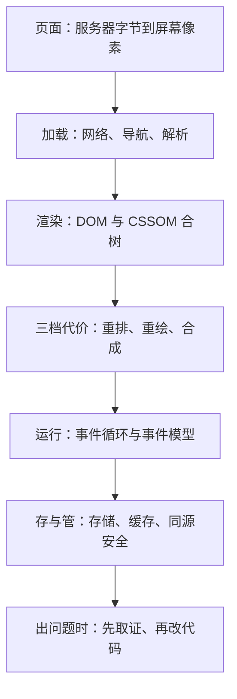
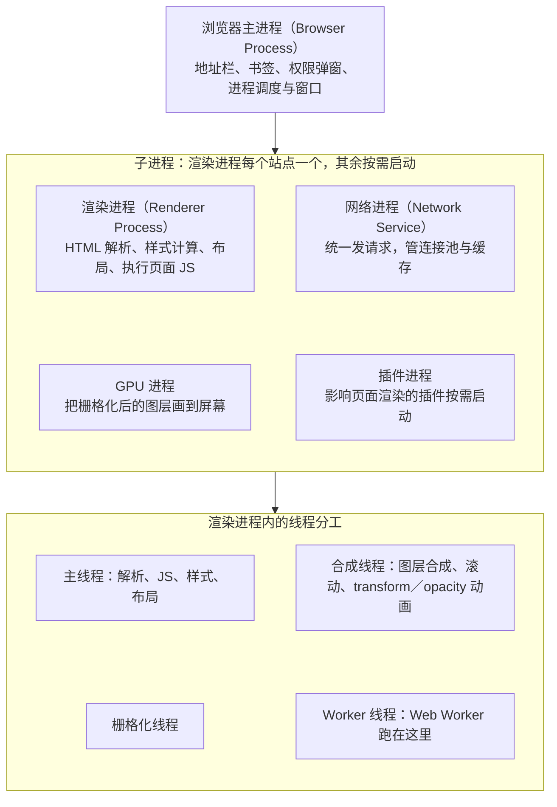
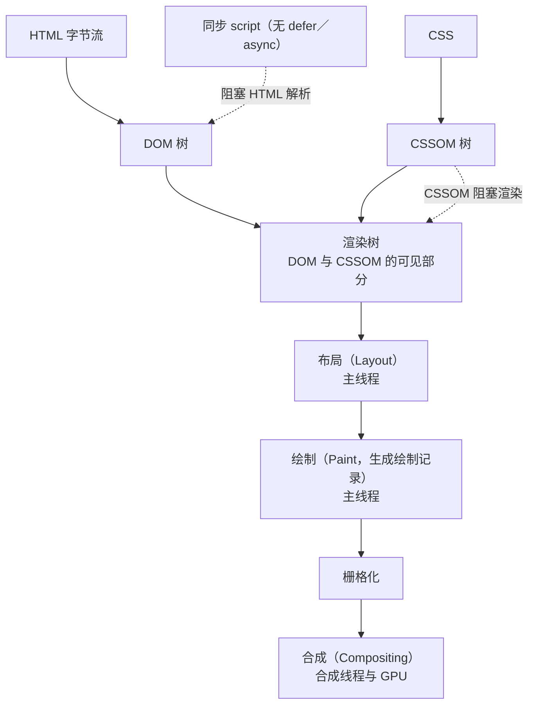
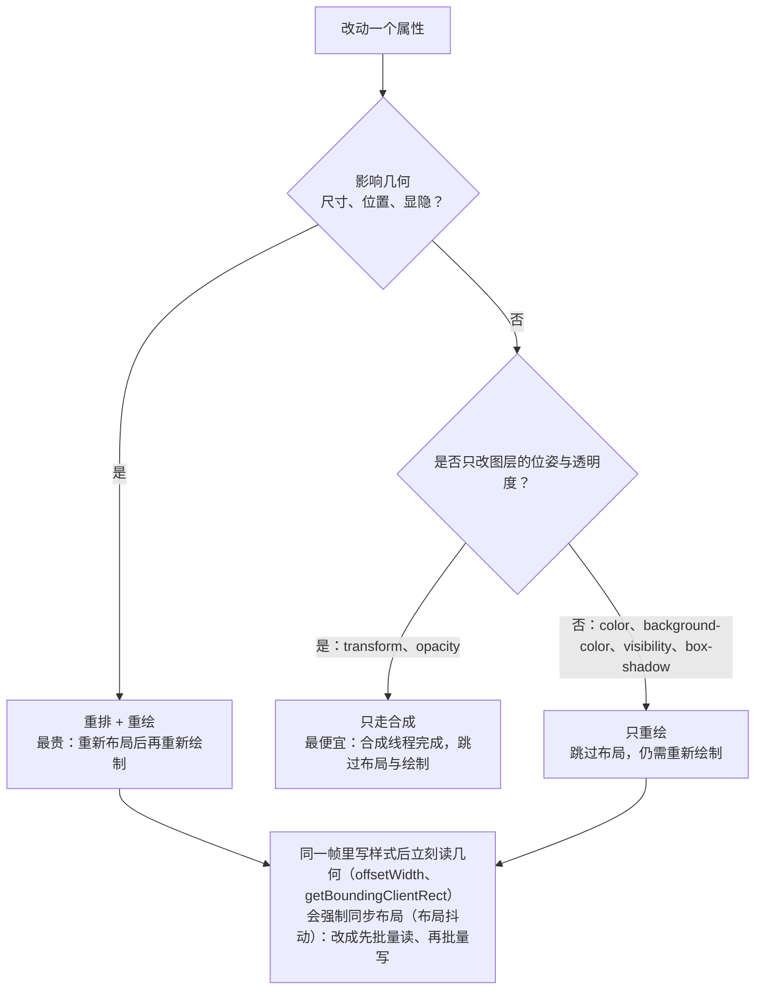
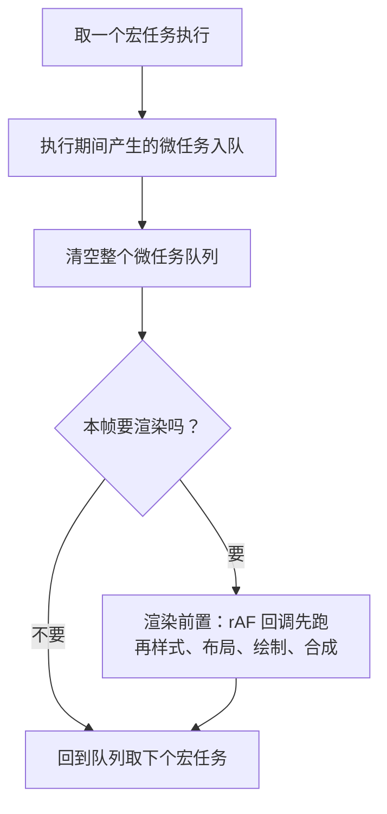
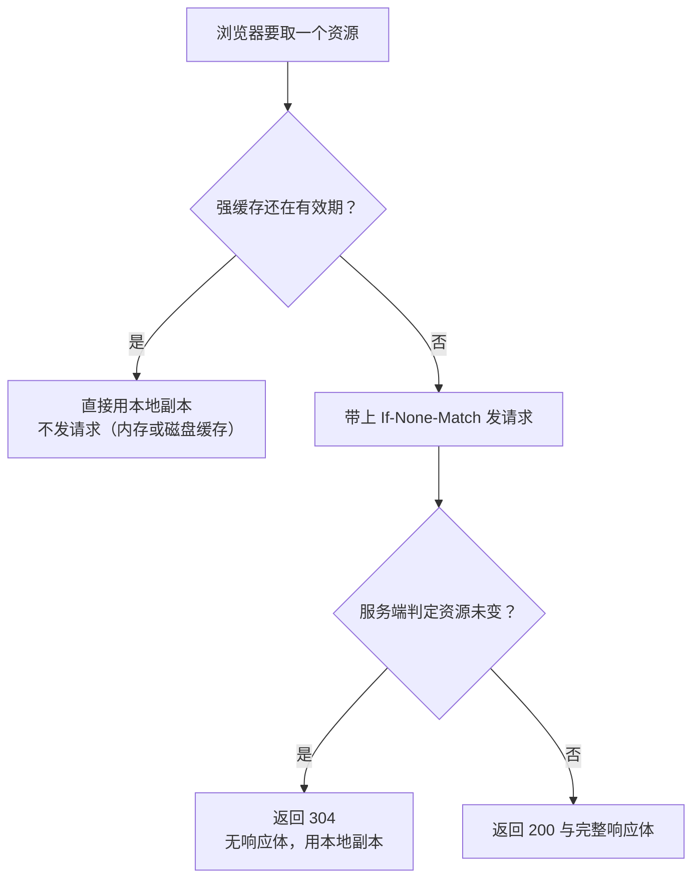

# 模块五 浏览器原理与运行时

> **一句话**：把浏览器从一个"黑盒"变成可观察、可测量的运行时——遇到卡顿、事件失灵、缓存不生效、跨域被拦这几类问题时，你能先取证、再改代码，而不是靠猜。
> **自学时长**：建议 9–10 小时（可分 4 次学完） · **前置**：模块四 JavaScript 语言核心
> **学完你能**：
> - **预测**一段含宏任务与微任务的代码的输出顺序，并说清"渲染为什么不跟在每个宏任务后面"；
> - **判断**一次样式改动会触发合成、重绘还是重排，并能用 DevTools 录出改前／改后两组数字；
> - **取证**：在 Performance／Network／Application 面板上指出一次长任务、一次 304 协商缓存、一次 CORS 预检，并用证据解释现象。

## 1. 心智模型

一段网页从服务器的字节流，到你能看见、能点、能滚的东西，中间是一条很长的流水线。这条流水线可以切成四段，本模块就是把四段逐段拆开：**加载段**（网络、导航、解析）、**渲染段**（把文档变成像素）、**运行段**（JS 与事件怎么被调度）、**存与管段**（数据放哪、缓存与安全边界在哪）。遇到问题的正确入口是最后那段——先取证，再改代码。



> **图 1**：本模块的全貌——一条页面流水线被切成四段，最后落到"取证"这条纪律上。这张图在说：后面每一节都对应流水线上的一个环节，学的时候不要把它当零散的记忆点，而要问"这一环解决的是什么问题、出问题时长什么样"。

白话记住三件事，后面所有细节都挂在这三件事上：

1. **主线程是稀缺资源。** 解析 HTML、执行 JS、算样式、算布局，全挤在同一个线程上排队。谁占着它不放，页面就"卡"。
2. **浏览器把能复用的结果尽量复用。** 几何没变就不重算布局，绘制记录没变就不重画，只有合成交给别的线程——这是"动画只用 `transform` 与 `opacity`"这条经验的真正来源。
3. **规则由响应头和服务端说了算的地方，前端代码改不动。** 缓存、跨域、CSP 都属于这一类；能做的是读懂它、取证、去改对的那一端。

## 2. 精讲（按节推进）

### 2.1 多进程架构与渲染进程内的线程分工  ⏱ 约 50 分钟

**白话定义**：进程是操作系统给的独立资源容器（各有独立内存，一个崩了不带崩别人）；线程是进程内部共享内存的执行流。浏览器把不同职责拆进不同进程，是为了"隔离"与"分工"。

**四大角色**：

| 角色 | 管什么 | 崩了会怎样 |
| --- | --- | --- |
| 浏览器主进程（Browser Process） | 地址栏、书签、权限弹窗、进程调度与窗口——用户"看得见的壳" | 整个浏览器受影响 |
| 渲染进程（Renderer Process） | 每个站点一个；负责 HTML 解析、样式计算、布局与执行页面 JS | 只带崩这个页面 |
| 网络进程（Network Service） | 统一发请求，管连接池与缓存 | 网络功能受损 |
| GPU 进程 | 把栅格化后的图层画到屏幕 | 显示受影响 |

**渲染进程内部再分工**：**主线程**（解析、JS、样式、布局）、**合成线程**（图层合成、滚动、`transform`／`opacity` 动画）、栅格化线程、Worker 线程（Web Worker 跑在这里）。

由此得到三条最该记住的结论：

1. JS 与 DOM 在**同一个线程**（主线程），所以主线程上的一段长计算必然卡住交互；
2. 已合成的滚动与 `transform`／`opacity` 动画**不占主线程**，所以主线程再忙，它们也跟手、不掉帧；
3. 进程隔离让一个页面崩溃、崩溃被控制在这一个站点里，不带走整个浏览器。



> **图 2**：浏览器多进程架构与渲染进程内的线程分工。这张图在说：主线程同时管解析、JS、样式与布局，所以一段长计算必然卡住交互；滚动与 `transform`／`opacity` 动画由合成线程承担，因此主线程忙时它们仍跟手。图中主进程用一条箭头指向「子进程」分组，表示渲染、网络、GPU、插件这四个子进程都由主进程启动与调度（渲染进程每个站点一个，其余按需启动）；从「子进程」再指向「线程分工」，表示主线程、合成线程、栅格化线程与 Worker 线程都跑在渲染进程内部。

**怎么自己看到它**：打开 4～5 个标签页、再给其中一页嵌一个 `iframe`，打开浏览器任务管理器（菜单 → 更多工具 → 任务管理器），观察每个标签页各占一个渲染进程、内存与 CPU 各自独立；再给页面加第二个 `iframe`，看是否新增一条进程记录。然后在 Console（`Ctrl+Shift+J`）里跑一段持续 3～5 秒的计数死循环，同时去拖鼠标、点按钮、拖滚动条——你会看到"按钮点不动但滚动仍能拖"的分离现象，这就是主线程与合成线程分工最直观的证据（演示完记得关掉那个标签页）。

> **自检**：为什么 JS 里一段死循环会让按钮点不动，但滚动条还能拖？

### 2.2 从地址栏到首屏：网络链路、导航与解析  ⏱ 约 60 分钟

**白话定义**：这一节讲的是"我在地址栏敲下回车之后、页面第一个像素出现之前"发生的事。握手细节与报文格式本文只定性，你要建立的是**顺序感**和**谁阻塞谁**。

**链路顺序**（定性）：DNS 解析域名得到 IP → 建立 TCP 连接 → 若是 HTTPS 再做 TLS 握手（校验证书、协商密钥）→ 发出 HTTP 请求并等待响应 → 拿到字节流，浏览器开始导航与解析。跨文档导航时旧文档先走卸载流程，新文档被提交后浏览器开始接收响应流。

**缓存分层**：浏览器缓存、系统缓存、hosts 文件、递归解析器，命中越靠前越快——所以"每次访问都要重新解析 DNS"是错的，只有缓存失效或过期才重新解析。

**三个最关键的阻塞关系**：

- **解析不必等整个 HTML 到齐**：字节流一到就开始解析，这正是"首屏时间短于完整下载时间"的原因。
- **同步脚本阻塞解析**：`` `<script>` `` 不加 `defer`／`async` 时，解析器必须暂停，等它下载并执行完——因为它可能用 `document.write` 往文档里写东西。
- **CSSOM 阻塞渲染**：样式没算出来之前不渲染，否则会先看到一帧无样式的裸页面（无样式内容闪烁）。因此 CSS 应该放在 `` `<head>` `` 里，而不是页尾。

`` `defer` `` 与 `` `async` `` 的区别只有两句话：`` `defer` `` 保持脚本之间的先后顺序、在文档解析完成后、`DOMContentLoaded` 之前执行；`` `async` `` 下载完立刻执行、顺序不保证。ES module 脚本默认自带 `` `defer` `` 语义。

**怎么自己看到它**：打开 DevTools（`Ctrl+Shift+I`）→ Network；用 `Ctrl+R` 重载记一次请求，`Esc` 收起底部抽屉。勾选／取消 Disable cache 各刷一次，对比静态资源耗时；右键列头打开 Timing 列，点开文档请求 → Timing，逐段读 Queued、DNS、Initial connection、TLS、Request、Response。再点开一个静态资源的 Response Headers，记下 `Cache-Control` 与 `ETag`（这是 2.8 的伏笔）。

> **自检**：为什么建议把 CSS 放在 `` `<head>` `` 里，而不是放页尾？

### 2.3 DOM、CSSOM 与渲染树  ⏱ 约 50 分钟

**白话定义**：DOM 是浏览器把文档表示成的一棵**对象树**，并提供读写接口——它是接口规范，不是源码文本。CSSOM 是样式规则解析、并按层叠与优先级算出的"每个节点的最终样式"。**渲染树**（Layout Tree）是 DOM 与 CSSOM 取交集后**真正要显示的部分**。

**HTML 解析器是容错的**：标签未闭合、嵌套错位、属性引号缺失，解析器会按既定规则修复，而不是报错停摆——这就是"标签写错也能显示"的原因。但"能显示"不等于"代码没问题"：**写下的源码与浏览器修好之后的 DOM 不是同一棵树**，调试样式和 JS 时以 DOM 为准。

**最容易记混的两组**：

- `` `display: none` `` 的节点**在 DOM 里、不在渲染树里**，不参与布局，读尺寸为空；
- `` `visibility: hidden` `` 的节点**两者都在**，仍占位，只是不可见（它触发重绘而非重排）。
- `DOMContentLoaded` 表示 DOM 解析完成、`` `defer` `` 脚本执行后触发；`load` 表示图片等**所有资源**都加载完成，更晚。两者不能互换使用——在 `load` 之前去操作还没解析到的节点，错误往往被误当成"框架的 bug"。



> **图 3**：从 HTML 与 CSS 到首屏的关键渲染路径，并标出两处会阻塞的环节。这张图在说：解析不必等整个 HTML 到齐，字节流一到就开始建 DOM；同步 script 阻塞解析、CSSOM 阻塞渲染，而布局与绘制都在主线程上——主线程一忙，整条链路都会往后排。

**怎么自己看到它**：在 Elements 面板里粘一段错位嵌套（块级元素写进段落里、标签不闭合），对照浏览器"修好"之后的结构与源码；Console 里跑 `document.querySelectorAll('*').length`，与面板里数出的元素数量对照；给一个 `` `display: none` `` 的容器，读它的 `offsetHeight`（为 0）与 `getClientRects()`（为空）。

> **自检**：`` `display: none` `` 的元素还在 DOM 里吗？在渲染树里吗？

### 2.4 布局、绘制、合成与三档代价  ⏱ 约 55 分钟

**白话定义**：渲染管线五步——样式计算 → 布局（Layout，旧称 Reflow）→ 绘制（Paint，生成绘制记录）→ 栅格化 → 合成。你改的属性落在哪一步，决定这一帧要重做多少工作，也就是"代价"。

**三档代价（本节骨架）**：

| 档位 | 触发属性举例 | 做了什么 | 代价 |
| --- | --- | --- | --- |
| 只走合成 | `transform`、`opacity` | 跳过布局与绘制，合成线程完成 | 最便宜 |
| 触发重绘 | `color`、`background-color`、`visibility`、`box-shadow` | 跳过布局，仍需重新绘制 | 中等 |
| 触发重排 + 重绘 | `width`／`height`、`top`／`left`／`margin`／`padding`、`border-width`、`font-size`、`display` 切换、增删节点、读 `offsetWidth` 等几何属性 | 重新布局后再重新绘制 | 最贵 |

**布局抖动**（layout thrashing）：在同一帧里交替"写样式 → 读几何 → 再写"。每一次读几何都必须拿到**最新**布局结果，于是迫使浏览器立刻把布局算完——读一次算一次，代价成倍。修法只有一条：**先批量读、再批量写**。

**`will-change`、`content-visibility`** 能减少代价，但不是免费的：滥用会占显存、造成图层爆炸，合成层越多内存与合成开销越大。定性地说：不要提前优化。



> **图 4**：三档代价的判定流程——哪些属性改动触发重排、哪些只触发重绘、哪些能两样都跳过。这张图在说：判据只有两个问题——「影响几何吗」「是否只改图层位姿与透明度」；能走到只改 `transform`／`opacity` 那一路的最便宜，读写交替则会把代价再抬高一层。

**怎么自己看到它**：同一动效做两版（一版动 `left`、一版动 `transform: translateX()`），在 Rendering 面板（DevTools 右上角 ⋮ → More tools → Rendering）打开 Paint flashing（绿色闪烁代表重绘）与 Layout Shift regions，直观对照谁在闪。再写一个"读一次几何、写一次样式"交替若干次的循环，用 Performance 面板（`Ctrl+E` 开始／停止）录下来，看是不是每一轮都被强制布局。

> **自检**：把 `` `display: none` `` 换成 `` `visibility: hidden` `` 能省掉代价吗？

### 2.5 事件循环：单线程怎么"同时"做很多事  ⏱ 约 50 分钟

**白话定义**：事件循环（event loop）是主线程上的调度机制——它不停地从一个"待办队列"里取任务来执行，执行完检查有没有"紧急收尾"的小任务，然后决定要不要把这一帧画出来，再取下一个。它不是多线程，而是"排队 + 分档"。

**一轮循环固定四步**：

1. 取一个**宏任务**执行；
2. 执行结束后，**清空整个微任务队列**（清空过程中新入队的微任务也在本轮继续执行，队列空之前不往下走）；
3. 浏览器**决定**是否渲染——不是每个宏任务后都渲染，取决于刷新节奏与这一帧有没有视觉变化，多个宏任务可能在同一帧内跑完；
4. 进入下一轮。

**两档任务的名单**：

| 档位 | 成员 | 什么时候跑 |
| --- | --- | --- |
| 宏任务（macrotask） | 脚本最初执行、`setTimeout`／`setInterval` 回调、I/O 回调、`postMessage`、事件回调 | 每轮取一个 |
| 微任务（microtask） | `Promise` 的 `then`／`catch`／`finally`、`queueMicrotask`、`MutationObserver` 回调 | 当前宏任务结束后一次性清空 |

**渲染时机的三个成员，边界要分清**：

- `requestAnimationFrame` 的回调在**渲染前**执行，适合做视觉改动；
- `setTimeout` **不参与渲染时机**，它只保证"某个时间点之后尽快入队"，早于还是晚于渲染都不保证；
- `requestIdleCallback` 在浏览器空闲时执行、**不保证准时**，不适合对时间敏感的视觉工作。

**长任务与 50 毫秒**：主线程被连续占用超过 50 毫秒，期间的输入事件只能排队、动画掉帧，用户就感知为"卡"。Performance 面板 Main 轨道上的**红色三角**就是长任务标记。拆分手段：把大循环切块、用 `postMessage` 或 `requestIdleCallback` 让出主线程、把纯计算搬进 Web Worker（见 2.9）。



> **图 5**：事件循环一轮的四步。这张图在说：微任务队列必须在本轮内清空（队列不空就不往下走），而"要不要渲染"是浏览器在微任务清空**之后**才做的判断——所以渲染与宏任务之间没有一对一的关系。

**怎么自己看到它**：在 Console 里录一次"点击按钮 → 同步更新 5000 个节点"，在 Main 轨道点开红色三角（长任务）读出耗时，展开调用栈看是哪个函数占的。

> **自检**：每次宏任务之后一定会渲染吗？

### 2.6 微任务与宏任务的执行顺序：一套可推演的方法  ⏱ 约 60 分钟

这一节单独讲，是因为"输出顺序题"是浏览器运行时里最容易被考、也最容易学不透的一处。目标不是背例子，而是拿到任意一段代码都能自己推出来。

#### 2.6.1 六步推演法

1. **分堆**：把代码分成"同步语句"与"回调"两类。同步语句从上到下**最先**跑完，且一定跑在一切回调之前。
2. **认档**：给每个回调贴标签——是宏任务（`setTimeout`／`setInterval` 回调、I/O、`postMessage`、事件回调）还是微任务（`Promise` 的 `then`／`catch`／`finally`、`queueMicrotask`、`MutationObserver` 回调）。
3. **起步**：脚本自身的执行本身就是一个宏任务。同步语句跑完，即"当前这个宏任务结束"。
4. **清微任务**：按**入队先后（FIFO）**依次执行微任务；执行中若又产生了新微任务，**接着在本轮执行**，直到队列真正为空。
5. **判渲染**：微任务清空后，浏览器决定是否渲染（不保证）。
6. **下一个宏任务**：回到第 3 步，取下一个宏任务，再重复 4～6。

补三条容易漏的细节：

- **`await x` 之后的代码**，等价于被放进 `x` 的 `then` 回调里——所以它是**微任务**，不是"另一帧"里的东西；
- **微任务里再产生微任务**，仍属于本轮，必须在本轮清干净；
- `requestAnimationFrame` 的回调既不是宏任务也不是微任务，它属于"渲染步骤"，位置在微任务清空之后、绘制之前。

#### 2.6.2 一步一步推一个例子

```js
// 仅示形态：先按六步推，再往下看结论
console.log('1 sync');
setTimeout(() => console.log('2 macrotask'), 0);
Promise.resolve().then(() => console.log('3 microtask'));
queueMicrotask(() => console.log('4 microtask'));
console.log('5 sync');
```

- 第 1 步分堆：同步只有 `1 sync` 与 `5 sync`，它们先跑 → 先打印 `1 sync`、`5 sync`。
- 第 2 步认档：`setTimeout` 那条是宏任务（标为 M1）；`.then(...)` 与 `queueMicrotask(...)` 都是微任务（按出现顺序标为 m1、m2）。
- 第 3～4 步清微任务：当前宏任务结束时，微任务队列为 `[m1, m2]`，FIFO 执行 → 打印 `3 microtask`，再打印 `4 microtask`；两者都没有产生新微任务，队列清空。
- 第 5～6 步：渲染判断之后，取下一个宏任务 M1 → 打印 `2 macrotask`。

所以顺序是 `1 sync, 5 sync, 3 microtask, 4 microtask, 2 macrotask`。你会发现**同步 > 微任务 > 宏任务**这条主链，一条即可覆盖绝大多数情况；复杂的题只是在这条主链上叠加"微任务里再生微任务"。

#### 2.6.3 练一练（先自己推，再对折叠里的检查点）

```js
// 仅示形态
console.log('A');
setTimeout(() => console.log('B'), 0);
Promise.resolve().then(() => {
  console.log('C');
  return Promise.resolve();
}).then(() => console.log('D'));
queueMicrotask(() => console.log('E'));
console.log('F');
```

> [!success]- 推演检查点（不是答案模板，是自查用的）
> 按六步走：**同步先跑完** → 得到前两个字母；**当前宏任务结束后清空微任务队列** → 注意这里有一个"微任务中再产生微任务"的坑，后一个 `.then` 排在前一个之后，但**仍在同一轮**清完；**`setTimeout` 的回调属下一个宏任务** → 因此它排在最后一个。
> 自查要点：① 你的序列里宏任务是不是只有一个、且在最末；② 那个"链式 `.then`"的第二个回调，你有没有把它错误地留到下一轮；③ 每个字母，你能不能说出它属于"同步／微任务／宏任务"哪一档。三项都能对上，说明你推对了。

#### 2.6.4 三个高频陷阱

- **陷阱一：把 `Promise` 当多线程。** `Promise` 的任务体接在**同一主线程**上跑，它只是把回调分档，不并行。
- **陷阱二：以为 `await` 之后的代码在"另一帧"。** 它只是回到微任务队列，仍在同一帧、同一轮里清完。
- **陷阱三：用 `setTimeout(fn, 0)` 等"页面画完"。** 它不参与渲染时机，可能早于也可能晚于渲染。要在"已经画出来之后"做事，用 `requestAnimationFrame` 里再套一层 `requestAnimationFrame`，或监听过渡／动画完成事件。

> **自检**：`Promise.then` 的回调与 `setTimeout(fn, 0)` 谁先执行？为什么？

### 2.7 事件模型：传播、委托与默认行为  ⏱ 约 55 分钟

**白话定义**：一次事件不是"在某个节点上发生"，而是沿着一条路径**经过**一串节点；监听器挂在哪个节点、监听哪个阶段，决定了它什么时候被调用。

**三个阶段**：捕获（从根向下）→ 目标 → 冒泡（向上）。`addEventListener(type, fn, options)` 的第三个参数决定监听捕获还是冒泡阶段。

**两个极易取错的属性**：`event.target` 是**实际触发的那个节点**；`event.currentTarget` 是**当前正在执行监听器的节点**（等价于回调里的 `this`）。委托场景下二者几乎从不相同——取错就会归因错误。

**事件委托**：把监听器挂在共同父容器上，在回调里用 `event.target.closest('选择器')` 找到目标项并**校验它确实在容器内**，再分发处理。收益三条：监听器数量从 N 降到 1；动态新增的节点自动生效（不用重新绑定）；内存与解绑成本下降。

**两件正交的事**：

- `preventDefault()`：取消浏览器的**默认行为**（链接跳转、表单提交、右键菜单），**不影响事件传播**；
- `stopPropagation()`：阻止事件继续传播（`stopImmediatePropagation()` 还会拦下同一节点上后续监听器），**不取消默认行为**。
  要"不做默认动作"用前者，要"别让别人听见"用后者，需要时两者都用。

**两个工程化选项**：`{ passive: true }` 告诉浏览器"这个监听器不会调 `preventDefault`"，浏览器因此不必等回调返回就能开始滚动——已默认对 `touchstart`／`touchmove`／`wheel` 在部分元素上生效（定性）；在 passive 监听器里调 `preventDefault` 不生效，还会在 Console 告警。`{ once: true }` 让监听器只触发一次，`{ signal }` 配合 `AbortController` 批量解绑——这是组件卸载时清理监听器的正路。

**怎么自己看到它**：搭三层嵌套容器，点最内层，在 Console 打印事件流顺序（先捕获、再目标、再冒泡），改 `capture` 参数再跑一次。然后打开 Elements（`Ctrl+Shift+C` 直接在页面上选中容器）→ Event Listeners 标签，数出它挂着几个监听器。

> **自检**：`preventDefault` 能阻止事件继续冒泡吗？

### 2.8 存储体系与 HTTP 缓存  ⏱ 约 55 分钟

**白话定义**：存储回答"数据放在浏览器哪里"；HTTP 缓存回答"这次请求能不能不跑一趟、或者只跑半趟"。两者都不是前端代码能单方面决定的。

**五种存储**：

| 方式 | 容量量级 | 同步／异步 | 生命周期 | 典型场景 |
| --- | --- | --- | --- | --- |
| cookie | 单条约 4KB | 同步 | 可设过期时间 | 随请求自动发送（如会话标识） |
| localStorage | 约 5MB 量级 | 同步 | 持久，同源共享 | 简单的同源持久数据 |
| sessionStorage | 同上 | 同步 | 绑定当前标签页 | 随标签页走的一次性状态 |
| IndexedDB | 大容量 | 异步 | 持久 | 大量结构化数据、离线数据 |
| Cache API | 视配额 | 异步 | 持久 | 以 Request/Response 为粒度存响应 |

几个必须记准的点：

- **cookie 会随同源请求自动发送**——好处是省一次手动取 token，坏处是白占带宽；受同源与路径／域约束；`HttpOnly` 让 JS 读不到（防的是 XSS 场景下的会话窃取，**不防 CSRF**）；`SameSite` 取 `Lax`／`Strict`／`None`，`None` 必须同时具备 `Secure`；`Secure` 只在 HTTPS 下发送。
- **localStorage 是同步 API**：读写大对象会阻塞主线程，所以别把大 JSON 塞进去。
- **sessionStorage 不跨标签共享**：复制标签页会各自独立。
- **IndexedDB** 异步、可建索引、能存结构化数据，代价是 API 较繁琐（实际项目常用 idb 一类薄封装，这里只列名称）。
- **Cache API** 要配合 **Service Worker** 才能拦截请求、实现离线；Service Worker 只能在 HTTPS 或 localhost 下注册（定性）。

**HTTP 缓存两条路**：

- **强缓存**：`Cache-Control: max-age=...`（另有 `immutable` 等指令，定性）。命中则**不发请求**，Network 面板显示从磁盘／内存缓存读取。
- **协商缓存**：响应带 `ETag`，下次请求带回 `If-None-Match`；`Last-Modified` 对应 `If-Modified-Since`。命中返回 **304**，**有请求但无响应体**。

**四个指令别记反**：`no-store` 完全不存；`no-cache` **可以存但每次必须校验**（不是"不要缓存"）；`private` 只允许浏览器存；`public` 允许中间缓存存。

**工程惯例**：静态资源用带**内容哈希**的文件名 + 长 `max-age`，HTML 用短缓存或 `no-cache` 每次校验。这样"内容变则文件名变"，不必等缓存过期。



> **图 6**：一次资源请求在缓存上的两条岔路。这张图在说：强缓存命中是"根本没有请求"，协商缓存命中是"有请求、无 body"——这两条在 Network 面板里的样子完全不同，看图时请把这两个分支与面板里的记录一一对上。

**选型判据一句话版**：要自动随请求发送 → cookie；要简单的同源持久数据 → localStorage；要随标签页走 → sessionStorage；要大量结构化数据 → IndexedDB；要接管网络请求 → Service Worker + Cache API。**敏感凭据不放 localStorage**，优选 `HttpOnly` + `Secure` 的 cookie，或把短期访问令牌只放内存并按时刷新。

**怎么自己看到它**：**不要用 `file://` 打开页面**，用本地服务器访问 `http://127.0.0.1:<端口>/`。取消 Disable cache、刷新页面，在 Network 里找出显示"(disk cache)"或 304 的资源：前者"没有请求"，后者"有请求但无 body"。在 Application 面板写一条 localStorage、一条带 `HttpOnly` 的 cookie，回 Console 用 `document.cookie` 确认读不到 `HttpOnly` 项。

> **自检**：304 响应有 body 吗？它省下的是什么？

### 2.9 同源、跨域与安全模型；Web Worker  ⏱ 约 50 分钟

**白话定义**：同源 = 协议 + 主机 + 端口**三者完全相同**。同一主机用 HTTP 与 HTTPS 访问不算同源，端口 80 与 8080 也不算。同源策略拦的是"**读取**"，不拦"发送"与"嵌入"——`img`／`script`／`link` 可以跨源加载（这也是 JSONP 这类历史方案能存在的原因，此处只作定性描述）。

**CORS（跨源资源共享）分两类请求**：

- **简单请求**：方法是 GET／HEAD／POST 之一，且请求头都在安全列表内、`Content-Type` 属于安全值（`application/x-www-form-urlencoded`、`multipart/form-data`、`text/plain`）。**不触发预检**，直接发出，靠响应头 `Access-Control-Allow-Origin` 决定能否读取。
- **非简单请求**（如 `Content-Type: application/json`、自定义头、PUT／DELETE）：先发**预检** `OPTIONS`，带 `Access-Control-Request-Method` 与 `Access-Control-Request-Headers`；服务端用 `Access-Control-Allow-Methods`／`Allow-Headers`／`Max-Age` 回应，浏览器据此放行后续真实请求。
- **带凭据**（cookie）：前端要 `credentials: 'include'`，服务端要 `Access-Control-Allow-Credentials: true`，且 `Access-Control-Allow-Origin` 必须是**具体源**，不能是 `*`。
- **关键归因**：CORS 报错是**浏览器**拦下来的，前端改代码通常解决不了，要改的是服务端的响应头。

**安全模型三件套**：

- **XSS**（跨站脚本）：注入点包括 `innerHTML`、模板里的"原样输出"指令（`v-html`、`dangerouslySetInnerHTML`）、`eval`／`new Function`、把 URL 参数直接拼进 HTML 字符串。现代框架的插值默认做 HTML 转义，所以"写 `{{ msg }}` 是安全的，写 `v-html` 才危险"；确需富文本要走白名单清洗。
- **CSRF**（跨站请求伪造）：利用浏览器会**自动**带上目标站 cookie 的特性发起伪造请求。防御：`SameSite` 限制第三方场景下的 cookie 发送、服务端校验 CSRF token、校验 Origin。
- **CSP**（内容安全策略）：作用位置是**响应的 `Content-Security-Policy` 头**（也可用 `` `<meta>` ``，但能力与优先级都不如响应头，定性），由浏览器强制执行，限制脚本、样式、连接、图片来源，并支持 `nonce`／`hash` 让内联脚本按白名单执行。CSP 是纵深防御的一层，**不能替代输出转义**。

**Web Worker**：`new Worker(url)` 在独立线程运行脚本，与主线程用 `postMessage` 通信，数据走结构化克隆（可转移的对象走转移语义，定性）。Worker 里**没有 DOM**，适合大计算与大数据解析。它解决的是 2.5 的长任务问题，**不是"并发写 DOM"**。

**证据意识（本模块收尾）**：Performance 面板录 trace → Main 轨道看长任务与调用栈 → Bottom-Up 视图看谁最耗时 → 改代码 → 再录一次对比；Memory 面板拍堆快照对比，重点看 detached DOM 节点是否持续增长；Performance monitor 实时看 JS heap、DOM Nodes、监听器数量曲线。**结论纪律：先测量、后改动、再复测，报"改前 X 毫秒／改后 Y 毫秒"，不报"感觉快了"。**

> **自检**：同一主机分别用 HTTP 与 HTTPS 访问，这两次访问同源吗？为什么？

## 3. 关键概念讲透

### 3.1 "异步"不等于"另一个线程"

**常见误解**：`setTimeout`／`Promise`／`addEventListener` 的回调跑在别的线程上，所以能让重计算"不卡"。

**正确理解**：它们的回调都只是被**排进主线程的任务队列**，仍在主线程执行。把一段重计算放进 `setTimeout`，它照样占满主线程，只是延后了几毫秒开始而已。要真的不占主线程，只有 Web Worker 这一条路。

**反例**：把"点击后同步算 500 万次求和"包进 `setTimeout(fn, 0)`，你测一下会发现按钮依旧点不动——长任务只是从"点击时"挪到了"下一个宏任务"。

### 3.2 渲染时机不是你能用定时器猜出来的

**常见误解**：想看"页面画完之后"的尺寸／位置，用 `setTimeout(fn, 0)` 或调一个"看起来对"的延时。

**正确理解**：`setTimeout` 只保证"到期后尽快入队"，与渲染时机无关，可能早于也可能晚于渲染。要在渲染之后执行，用 `requestAnimationFrame` 嵌套（或监听过渡／动画完成事件）。

**反例**：`el.style.width = '200px'; setTimeout(() => el.getBoundingClientRect(), 0)` —— 你以为拿到的是画完后的值，实际上你拿到的往往是**已被强制同步布局**算出的值，与"画完"无关；而如果改用 `requestAnimationFrame`，你拿到的是即将绘制那一刻的结果。

### 3.3 重排、重绘、合成是"三档"，不是三选一的标签

**常见误解**：`display: none` 与 `visibility: hidden` 都是"看不见"，代价差不多；改 `transform` 只是"另一种写法"。

**正确理解**：判据是两个问题——**影响几何吗？是否只改图层位姿与透明度？** 重排改几何（影响自己也影响后续兄弟与父级），重绘只改外观（不动几何），合成只改图层位姿（跳过前两者）。`` `display: none` `` 进出渲染树属于**重排**；`` `visibility: hidden` `` 仍占位，属于**重绘**；`transform` 通常只走**合成**。

**反例**：把 `visibility: hidden` 当成"省代价的 `display: none`"——它省不了重绘，元素仍在渲染树里、仍占布局空间，只是不可见。

### 3.4 传播与默认行为是两件正交的事

**常见误解**：`preventDefault` 能顺便阻止冒泡；`stopPropagation` 能顺便取消默认动作；两者只管其一就"都解决了"。

**正确理解**：`preventDefault` 管**默认行为**，`stopPropagation` 管**传播**；两者互不代替，需要时同时调用。`event.target` 是触发者，`event.currentTarget` 是挂监听器的节点——委托回调里用错的通常是 `target`。

**反例**：某页面有个文档级"点击外部关闭菜单"监听器，你在菜单内部用 `stopPropagation` 让它听不见。表面上对了，但如果菜单里还有别的需要冒泡到文档的逻辑，就被一起掐掉了——更稳的写法是让文档级监听器自己判断 `closest` 是否落在菜单内。

### 3.5 缓存与跨域：说话的是响应头，不是前端代码

**常见误解**：看到 CORS 报错就去改前端；看到 304 以为是请求失败或缓存出错；把 `no-cache` 理解成"不要缓存"。

**正确理解**：CORS 是浏览器在**读取授权**上拦的，授权方是服务端；304 是**协商缓存命中**（有请求、无 body，省的是响应体传输与服务器生成成本）；`no-cache` 是"可缓存但每次必须校验"，`no-store` 才是完全不存。

**反例**：前端把 `Content-Type` 从 `application/json` 改成 `text/plain` 绕过了预检——请求是发出去了，可服务端没配 `Access-Control-Allow-Origin`，你还是读不到响应。同时你把接口的语义也改坏了。

## 4. 动手（自学版实验）

实验总要求：**所有结论必须附 DevTools 证据（截图或导出的 trace），并写出改前／改后两组数字。** 环境统一用本机 Node v26.7.0、pnpm 12.8.1、Vite 8.3.1 起一个页面，框架用 Vue 3.5.43 或 React 19.3.0 二选一（本模块只把它当承载页面用）。

### 动手一：录一段交互，在 Main 轨道上指出一个长任务

- **要做什么**：页面放一个"生成 5000 条列表项"的按钮，点击后在主线程同步构造并插入；用 Performance 面板录下"点击到页面稳定"的完整过程；在 Main 轨道定位至少一个长任务（红色标记），读出耗时并展开调用栈写出耗时函数名；在 Bottom-Up 视图里列出占用最高的两个函数；用 Performance monitor 记录交互前后的 JS heap 与 DOM Nodes。
- **需要什么**：Vite 8.3.1 起的页面；DevTools 的 Performance 面板（`F12` → Performance，开启 Screenshots，`Ctrl+E` 开始／停止）与 Performance monitor（⋮ → More tools）。用本地服务器访问 `http://127.0.0.1:<端口>/`，不要用 `file://`。
- **验收标准**：
  - [ ] 提交 trace 文件或长任务局部截图，能在 Main 轨道指认出长任务；
  - [ ] 报出具体耗时**数字**（毫秒），而不是"很久"；
  - [ ] 指出耗时函数的名称；
  - [ ] 说明为何该耗时会导致点击无响应（主线程排队）；
  - [ ] 结论中出现"50ms 阈值"这一判据，并算出超过阈值几倍。
- **卡住了看**：2.5 节的"长任务与 50 毫秒"、2.1 节的"按钮点不动但滚动可拖"演示。

### 动手二：把 N 个监听器降成 1 个并验证

- **要做什么**：先给一个不少于 200 项的列表**逐项**绑点击监听器（点击在 Console 打印该项 id）；用 Elements → Event Listeners 面板记录监听器数量；再改写成**委托**版本——只在容器上绑一个监听器，用 `event.target.closest('li[data-id]')` 定位并校验目标在容器内；在委托版本下追加 100 个新项，验证新项无需重绑即可响应；重新计数，给出"改前 N 个 / 改后 1 个"的对照。
- **需要什么**：同一个页面；Elements 面板的 Event Listeners 标签（`Ctrl+Shift+C` 直接在页面上选中列表容器）。
- **验收标准**：
  - [ ] 委托版本监听器数量确为 1（面板可数）；
  - [ ] 新增项点击有效、无需重新绑定；
  - [ ] 打印的 id 与所点项一致（无错位、无父容器误判）；
  - [ ] 点击条目内嵌套子元素时，能正确归因到所属条目；
  - [ ] 逐项版本与委托版本在同一组用例下行为一致；
  - [ ] 组件卸载后监听器被移除（用 `AbortController` 的 `signal` 或框架生命周期验证）。
- **卡住了看**：2.7 节的"事件委托"与 `target`／`currentTarget`；`closest` 的校验别忘了。

### 动手三：观察一次 304 协商缓存，核对存储与跨域

- **要做什么**：给某个静态资源配置 `ETag`（不配长 `max-age`），刷新两次找出一条 304，指出 `ETag` 与 `If-None-Match` 的对应、并说明 304 无 body；再给同一资源配 `Cache-Control: max-age=600`，刷新两次找出"从磁盘缓存读取且没有新请求"的记录，与 304 并排对比；在 Application 面板写一条 localStorage、一条 sessionStorage、一条带 `HttpOnly` 的 cookie，回 Console 用 `document.cookie` 确认读不到 `HttpOnly` 项；从一个端口页面 `fetch` 另一个端口的接口，在 Network 里找出预检 `OPTIONS`，记录 `Access-Control-Request-Method` 与 `Access-Control-Allow-Origin`，再换成简单请求（`Content-Type: text/plain`）对比是否还有预检；给主文档加一个限制脚本来源的 `Content-Security-Policy` 响应头，观察 Console 的拦截报告。
- **需要什么**：同一台机器开两个不同端口的小型静态服务（可用 Node v26.7.0 直接写入口，不引入额外框架）；Network 与 Application 面板。
- **验收标准**：
  - [ ] 能提交一条 304 记录截图，并正确指认 `ETag`／`If-None-Match` 的对应；
  - [ ] 能提交一条强缓存命中记录，并说清"没有网络请求"与"有请求无 body"的区别；
  - [ ] 能提交一条预检 `OPTIONS` 记录，并指出至少一个 `Access-Control-Allow-*`；
  - [ ] 能提交 `document.cookie` 读不到 `HttpOnly` 项的截图；
  - [ ] 能说明 CSP 由响应头下发、由浏览器强制执行，且它不替代输出转义；
  - [ ] 六项观测中至少五项留下证据，并对"为什么 `no-cache` 不等于不缓存"给出一句话回答。
- **卡住了看**：2.8 节的 `no-cache` 与 304、图 6；2.9 节的 CORS 两类请求。

### 动手四：把一段不少于 300 毫秒的计算搬进 Web Worker

- **要做什么**：写一段纯计算（如大数组聚合），先放主线程，点击触发后观察卡顿；再把它搬进 Web Worker，输入输出都走 `postMessage`；验证计算期间页面仍能响应点击与滚动，并用 Performance 面板确认 Main 轨道上不再出现该段长任务；处理错误路径（Worker 抛错或文件加载失败时页面给出可见提示）；页面卸载或重复触发时终止旧 Worker。
- **需要什么**：同一个页面；Performance 面板与 Performance monitor。
- **验收标准**：
  - [ ] 计算期间点击按钮的响应无卡顿，Main 轨道上不再出现该段长任务；
  - [ ] 输入与输出经 `postMessage` 传递，结果与主线程计算时一致（同输入同输出）；
  - [ ] Worker 抛错或加载失败时页面给出可见提示，不静默失败；
  - [ ] 重复触发或页面卸载时旧 Worker 被终止（不残留多个仍在运行的 Worker）；
  - [ ] 能说明 Worker 内为何不能直接操作 DOM。
- **卡住了看**：2.9 节的 Web Worker；2.5 节的长任务拆分手段。

## 5. 自测

### 5.1 客观题（答案与解析在折叠块里）

**1.** 下列哪一项**不是**渲染进程内主线程的工作？
A. 解析 HTML 并构建 DOM　B. 执行页面 JavaScript　C. 对已合成的图层做页面滚动　D. 计算布局
> [!success]- 答案与解析
> **C**。滚动与合成由合成线程负责。解析 HTML、执行 JS、计算布局都在渲染进程主线程上——这正是主线程一忙就全卡的原因。

**2.** 关于 `` `<script>` `` 的加载方式，说法正确的是：
A. `async` 保证脚本按文档顺序执行　B. 不加 `defer`／`async` 的脚本会阻塞 HTML 解析　C. `defer` 脚本在 `load` 事件之后执行　D. ES module 脚本默认与同步脚本行为相同
> [!success]- 答案与解析
> **B**。不加 `defer`／`async` 的脚本会暂停解析，因为解析器要等它下载并执行完（它可能写出文档）。`async` 不保证顺序；`defer` 在文档解析完成后、`load` 之前执行；ES module 默认自带 `defer` 语义。

**3.** 关于 `` `display: none` `` 与 `` `visibility: hidden` ``：
A. 前者在 DOM 里也在渲染树里　B. 后者不在 DOM 里　C. 两者都不参与布局　D. 前者在 DOM 里但不在渲染树里，`offsetHeight` 为 0
> [!success]- 答案与解析
> **D**。`` `display: none` `` 的节点在 DOM 里、不在渲染树里，不参与布局，读尺寸为空；`` `visibility: hidden` `` 两者都在、仍占位，只是不可见（它触发重绘而非重排）。

**4.** 下列改动只触发合成（代价最便宜）的是：
A. `width`　B. `background-color`　C. `transform: translateX()`　D. `border-width`
> [!success]- 答案与解析
> **C**。`transform`／`opacity` 只走合成；`background-color` 触发重绘；`width`、`border-width` 会改变几何，触发重排 + 重绘。

**5.** 关于事件循环，正确的是：
A. 每个宏任务之后浏览器一定会渲染　B. 微任务在当前宏任务结束后被清空，清空过程中新入队的微任务也在本轮执行　C. `setTimeout(fn, 0)` 的回调属于微任务　D. `requestAnimationFrame` 的回调在渲染之后执行
> [!success]- 答案与解析
> **B**。一轮循环：取一个宏任务执行 → 清空整个微任务队列（清空中新入队的也执行）→ 浏览器**决定**是否渲染。不一定每次宏任务后都渲染；`setTimeout` 属宏任务；`requestAnimationFrame` 回调在渲染**前**执行。

**6.** 关于 `preventDefault()` 与 `stopPropagation()`：
A. `preventDefault` 会阻止事件继续传播　B. `stopPropagation` 会取消浏览器的默认行为　C. 两者语义正交：前者管默认行为、后者管传播　D. 两者必须同时使用才有意义
> [!success]- 答案与解析
> **C**。`preventDefault` 取消默认行为、不影响传播；`stopPropagation` 阻止传播、不取消默认行为。两者正交，按需分别使用。

**7.** 关于 `no-cache` 与 304：
A. `no-cache` 表示可缓存但每次必须校验；304 表示资源未变、无响应体　B. `no-cache` 表示完全不缓存　C. 304 表示请求失败　D. 304 响应带有完整响应体
> [!success]- 答案与解析
> **A**。`no-cache` 不是"不缓存"，而是"可缓存但每次必须校验"；`no-store` 才是完全不存。304 表示资源未变、无响应体，省的是响应体传输与服务器生成成本，网络往返仍然发生。

**8.** 关于同源与 CORS：
A. 同一主机的 HTTP 与 HTTPS 访问视为同源　B. 端口 80 与 8080 视为同源　C. CORS 报错需要前端改代码才能解决　D. 同源即协议、主机、端口三者全同；带凭据请求时 `Access-Control-Allow-Origin` 不能是 `*`
> [!success]- 答案与解析
> **D**。同源要求协议、主机、端口三者全同，故 A、B 都是跨源。CORS 拦截由**浏览器**发出，授权方是服务端（改响应头）；带凭据时 `Allow-Origin` 必须是具体源，`*` 不被接受。

**9.** 判断并说明理由：**`sessionStorage` 在同一源的所有标签页之间共享。**
> [!success]- 答案与解析
> **错误**。`sessionStorage` 的生命周期绑定当前标签页，复制标签页会各自独立、不跨标签共享。要跨标签共享同源数据，用 `localStorage`。

**10.** 判断并说明理由：**Web Worker 里可以直接操作 DOM，也能直接读写主线程的变量。**
> [!success]- 答案与解析
> **错误**。Worker 运行在独立线程，**没有 DOM**，不能直接操作 DOM；与主线程只能通过 `postMessage` 通信（结构化克隆／转移），不能直接读写主线程变量。它解决的是长任务阻塞，不是"并发写 DOM"。

**11.** 填空：同源策略的三要素是 ______、______、______。
> [!success]- 答案与解析
> **协议、主机（域名）、端口**。三者缺一即跨源。例如同一主机的 HTTP 与 HTTPS、或端口 80 与 8080，都算跨源。

**12.** 填空：主线程被连续占用超过 ______ 毫秒，就判为长任务；Performance 面板 Main 轨道上它表现为 ______。
> [!success]- 答案与解析
> **50**；**红色的三角标记**。超过 50ms 期间输入事件只能排队、动画掉帧，用户感知为"卡"。（50ms 是本课程统一口径，不是规范条文。）

### 5.2 动手题（不给实现，只给验收标准与评分点）

**1.** 说清 `` `display: none` `` 的元素与 `` `visibility: hidden` `` 的元素，在 DOM 树、渲染树、布局阶段分别有什么差别，读 `offsetHeight` 各得到什么。
- **验收标准**：能分别说出两者的归属（前者在 DOM 不在渲染树、不参与布局；后者两者都在、仍占位），并给出 `offsetHeight` 的取值差异（0 与实际值）；能据此判断"在不在渲染管线里"。
- **评分点**：三点差别各占一份权重；`offsetHeight` 结论占一份权重；能顺带说明前者属重排、后者属重绘为加分。

**2.** 一条静态资源"强缓存命中"与"协商缓存返回 304"，在"是否有网络请求""是否有响应体""省下了什么"三个维度上分别如何？
- **验收标准**：三个维度逐一作答且不混淆——强缓存命中无请求、无 body、省整次往返；304 有请求（带回 `If-None-Match`）、无 body、省响应体传输与服务器生成成本。
- **评分点**：三个维度各占一份权重；能区分"没有请求"与"有请求无 body"是核心。

**3.** 列出至少三个 XSS 注入点，并说明 CSP 与输出转义在防御链条上的分工。
- **验收标准**：注入点至少三个（`innerHTML`；`v-html`／`dangerouslySetInnerHTML` 一类原样输出指令；`eval`／`new Function`；URL 参数直接拼进 HTML）；分工说清"转义从源头让内容不能被解析为代码，CSP 在浏览器侧限制可执行脚本、属纵深防御、不能替代转义"。
- **评分点**：注入点数量与准确性；分工两句话是否各就其位；出现"加了 CSP 就不用转义"即判该项不得分。

**4.** 三个场景分别该用 `preventDefault`、`stopPropagation`，还是两者都不用？说理由：① 表单提交前先做本地校验，校验不过则不提交；② 模态框内的点击不应触发页面级的"点击外部关闭"逻辑；③ 一个链接需要在同标签页内跳转。
- **验收标准**：① 用 `preventDefault`（取消默认提交）；② 用 `stopPropagation`（阻止冒泡到文档级监听器），若能补充"更稳的写法是让文档级监听器判断 `closest` 是否在模态框内"更好；③ 两者都不用（同标签页跳转正是默认行为）。
- **评分点**：三场景各一份权重；理由质量一份权重；把两件事混为一谈（认为 `preventDefault` 能拦传播）则相应场景不得分。

**5.** 为什么"每次宏任务之后不一定渲染"？想在"页面已经画出来之后"再做事，为什么不能用 `setTimeout(fn, 0)`，应该用什么？
- **验收标准**：前一问能说出"浏览器按刷新节奏与是否有视觉变化决定，多个宏任务可能在同一帧内跑完"；后一问能说明 `setTimeout(fn, 0)` 只保证"到期后尽快入队"、与渲染时机无关，正解是 `requestAnimationFrame` 里再套一层 `requestAnimationFrame`，或监听过渡／动画完成事件。
- **评分点**：两问各占一半权重；能举出"可能早于也可能晚于渲染"这一点为佳。

**6.** 从地址栏输入到首屏经过哪些环节（定性即可）？其中哪些会阻塞 HTML 解析或渲染，为什么建议把 CSS 放在 `` `<head>` ``？
- **验收标准**：链路能按顺序说出 DNS → TCP → TLS（HTTPS）→ 发请求收响应 → 拿字节流开始解析 → 构建 DOM/CSSOM/渲染树 → 布局 → 绘制 → 合成；能指出"解析不必等整个 HTML 到齐"、同步脚本阻塞解析、CSSOM 阻塞渲染；CSS 放 `` `<head>` `` 的理由是"样式不到位前不渲染，放页尾会出现无样式内容闪烁且可能阻塞脚本"。
- **评分点**：链路顺序一份、阻塞点一份、CSS 理由一份；顺序里出现"等 HTML 全部下载完才开始解析"即该项不得分。

**7.** 下面这段滚动回调在滚动时明显掉帧，指出至少两处代价来源并给出改法（只描述改动，不写完整代码）。
```js
// 仅示形态
panel.addEventListener('scroll', () => {
  const w = inner.offsetWidth;              // 读几何
  inner.style.width = (w + 1) + 'px';       // 写样式
  inner.style.left = inner.offsetLeft + 1 + 'px';
  progress.style.width = (w / total * 100) + '%';
});
```
- **验收标准**：指出根因一——读写交替（先读 `offsetWidth`／`offsetLeft` 再写样式）导致每轮强制同步布局（布局抖动）；根因二——改 `left`／`width` 每帧触发布局与绘制。改法给出"先批量读再批量写""用 `transform: translateX` 与 `scaleX` 代替 `left`／`width`""把滚动回调节流到 `requestAnimationFrame`"，以及给滚动监听器加 `{ passive: true }`。
- **评分点**：两处根因各占一份权重；改法四条每对一条加分；把根因归到无关代码上不得分。

**8.** 写出下列代码的输出顺序，并说明理由。（仅示形态）
```js
// 仅示形态
console.log('A');
setTimeout(() => console.log('B'), 0);
Promise.resolve().then(() => {
  console.log('C');
  return Promise.resolve();
}).then(() => console.log('D'));
queueMicrotask(() => console.log('E'));
console.log('F');
```
- **验收标准**：输出为 `A、F、C、E、D、B`。理由须包含：同步代码先跑完（A、F）；当前宏任务结束后清空微任务队列（C、E），且**微任务中新增的微任务 D 也在本轮执行完**；B 属下一个宏任务，最后执行。
- **评分点**：顺序正确一份权重；"微任务中新增的微任务仍在本轮"这一考点一份权重；只写顺序不给理由最多得一半。

**9.** 一个列表对每一项各绑一个点击监听器，列表增长后变卡、且新增项需重新绑定。给出委托版本的方向（不写完整代码），并说明该场景下 `event.target` 与 `event.currentTarget` 为何几乎从不相同。
- **验收标准**：方向——只在容器上绑一个监听器，回调里用 `event.target.closest('选择器')` 定位目标项并**校验它在容器内**再分发；说明 `event.target` 是实际触发的节点（可能是条目内的子元素），`event.currentTarget` 是挂监听器的容器；能说出收益（监听器 N → 1、动态新增项自动生效、解绑成本下降）。
- **评分点**：委托方向正确、`closest` 校验到位（核心）；`target`／`currentTarget` 的区别说清一份权重；只堆名词不说机制不给分。

**10.** 在 Console 里跑一段持续数秒的死循环，页面按钮点不动但滚动条还能拖动。解释这一现象，并说明它验证了主线程与合成线程的什么分工。
- **验收标准**：死循环占满主线程，事件处理与布局都在主线程排队，故按钮点不动；滚动由合成线程处理**已合成**的图层，不依赖主线程，故滚动条仍可拖。指出这验证了"主线程负责解析／JS／样式／布局、合成线程负责图层合成与滚动（`transform`／`opacity` 动画也不占主线程）"。
- **评分点**：现象与两条线程职责对应正确是核心；只答"JS 是单线程"不给全分。

**11.**（编程）把一个"逐项绑定点击监听器"的待办列表重构为事件委托。**不给参考实现。**
- **验收标准**：① 容器上的监听器数量为 1（可用 Elements → Event Listeners 面板自测）；② 动态追加的条目点击有效、无需重新绑定；③ 点击条目输出其 id，点击空白区域不产生输出；④ 嵌套子元素（如条目内删除按钮）点击时能被正确归因到所属条目；⑤ 列表移除后监听器随之释放（卸载后面板计数归零）。
- **评分点**：委托目标定位（`closest`）是否稳妥、是否误把容器自身当条目（30%）｜动态追加项验证（20%）｜嵌套子元素归因（20%）｜解绑与生命周期处理（20%）｜不引入 `stopPropagation` 之类的掩盖手法（10%）。

**12.**（编程）把一个耗时不少于 300 毫秒的纯计算从主线程搬到 Web Worker，要求计算期间页面仍能响应点击与滚动。**不给参考实现。**
- **验收标准**：① 计算期间点击响应无卡顿，Performance 面板 Main 轨道上不再出现该段长任务；② 输入输出经 `postMessage` 传递，结果与主线程计算时一致；③ 错误路径有处理（Worker 抛错或文件加载失败时给出可见提示，不静默失败）；④ 页面卸载或重复触发时旧 Worker 被终止；⑤ 说明 Worker 内为何不能直接操作 DOM。
- **评分点**：长任务是否真的从主线程消失（35%）｜结果一致性验证（20%）｜错误与终止处理（25%）｜对"Worker 无 DOM"的解释（10%）｜代码里没有"留一个全局引用导致 Worker 无法回收"的写法（10%）。

## 6. 自我检查清单

- [ ] 我能画出"地址栏 → 首屏"的完整链路，并说清每一步阻塞什么、不阻塞什么。
- [ ] 我能说出渲染进程内主线程、合成线程、GPU 进程、网络进程各自负责什么。
- [ ] 我能给出"哪些属性触发合成、哪些触发重绘、哪些触发重排"的例子，且动画里不碰会触发布局的属性。
- [ ] 我能预测一段包含宏任务与微任务的代码的输出顺序，并解释渲染时机为何不一定在每次宏任务之后。
- [ ] 我能用 `requestAnimationFrame` 代替 `setTimeout` 来处理"渲染之后"的需求。
- [ ] 我能在 DevTools 里数出某容器的监听器数量，并用一个委托监听器替代逐项绑定。
- [ ] 我能准确区分 `event.target` 与 `event.currentTarget`，并说清 `preventDefault` 与 `stopPropagation` 的不同。
- [ ] 我能说出 cookie、localStorage、sessionStorage、IndexedDB、Cache API 各自适合什么，并解释为什么访问令牌不进 localStorage。
- [ ] 我能在 Network 面板区分强缓存命中与 304 协商缓存，并指出 `ETag` 与 `If-None-Match` 的对应关系。
- [ ] 我能说出同源的三要素，并解释 CORS 预检为什么会被触发、凭据场景为什么不能用 `*`。
- [ ] 我能说出 XSS 与 CSRF 的作用机制，并指出 CSP 作用在响应头上、且不替代输出转义。
- [ ] 我的实验记录里有改前／改后两组数字，取舍有依据，没有出现"感觉快了"。

## 7. 出处与依据说明

### 7.1 有官方依据的部分

- **渲染管线各阶段与顺序、阻塞关系（2.2、2.3、2.4）**：依据 MDN 的「关键渲染路径」（`developer.mozilla.org`，性能指南）与 WHATWG 的 HTML 现行标准中对解析器容错行为的定义（`html.spec.whatwg.org`）。
- **DOM 作为接口规范、节点／树结构（2.3）**：依据 MDN 的「Document Object Model（DOM）」条目与 WHATWG 的 DOM 标准（`dom.spec.whatwg.org`）。
- **HTTP 请求／响应结构、方法、状态码分族、头部作用（2.2、2.8）**：依据 MDN 的「HTTP 概述」与 IETF 的 RFC 9110（`www.rfc-editor.org`）；缓存指令语义依据 RFC 9111；cookie 的 `HttpOnly`／`SameSite`／`Secure` 依据 RFC 6265。
- **CORS 简单请求与预检、凭据请求约束（2.9）**：依据 MDN 的「跨源资源共享（CORS）」。
- **localStorage 的同源与持久性、同步 API 特征（2.8）**：依据 MDN 的「Window.localStorage」。
- **事件与异步的基础表述（2.5、2.6、2.7）**：依据 MDN 的「JavaScript 指南」相关条目，以及 ECMAScript 规范中关于 Promise 与作业（Job）队列的语义（`tc39.es`）。
- **DOM Level 1 与标准化历史（2.3 的背景叙述）**：依据 W3C 的规范索引页（`www.w3.org`）。

### 7.2 属本人／课程组的编排判断（无官方直接依据）

- **长任务阈值取 50 毫秒**作为统一判定口径（用于"是否构成阻塞交互"的讨论），属课程组的量化约定，不是规范条文。
- **"动画只用 `transform` 与 `opacity`"** 这一判据，是性能常识的工程化表述，属本课程统一给出的默认规则。
- **2.1～2.9 的切分与顺序**：把"渲染管线"拆在 2.3 与 2.4 两节、把网络定性压缩在 2.2、把安全与跨域合并到 2.9，是把"事件循环"单独扩成 2.5 与 2.6 两节之后的取舍，属编排判断。
- **动手任务的观测清单**（长任务、委托计数、304／预检／HttpOnly／CSP 六项观测、Worker 迁移）由课程组自行设计，作为最低验收要求。
- **实验环境固定在 Vite 8.3.1 + pnpm 12.8.1 + Node v26.7.0**，是为统一排障步骤。
- **要求记录必须含"改前／改后"两组数字**、并**不给可直接提交的完整参考代码**（只给判据），属课程设计上的决定。
- **术语统一**：本模块统一称"渲染树""布局""绘制""合成"，不使用"回流"等旧称谓；统一称"监听器计数"而不称"事件绑定个数"。
- **2.6 的"六步推演法"**是本文为自学方便而归纳的一套解题步骤，属编排判断，规范只定义任务与微任务的执行语义，没有给出这套编号步骤。

### 7.3 不确定项

- **Web Components 的历史演进（Shadow DOM 与自定义元素）**：年份跨度较大，本文只作定性描述，未给具体年份。
- **`passive` 默认生效范围**：只说"在部分元素上对 `touchstart`／`touchmove`／`wheel` 默认生效（定性）"，未逐一核实各浏览器当前的具体清单。
- **CSP 用 `` `<meta>` `` 与用响应头的差异**（能力与优先级）本文按定性表述，未列具体可用的指令清单。
- **各浏览器 localStorage 容量**：约 5MB 量级、各家略有差异，本文不给具体数值。
- **`will-change`／`content-visibility` 的收益与代价边界**：属定性描述，未给出建议数量阈值。

## 安全视角

本模块讲浏览器的运行时与安全边界——**同源策略是浏览器替用户设的最后一道防线**，而这道防线常被应用自己用 CORS／CSP 配错或没开。

- §2.9 的同源、跨域与安全模型是这条线的起点：CORS 误配（`Access-Control-Allow-Origin` 写 `*` 或反射请求来源、再带凭据）等于把数据对外开放（§5）。
- §2.8 存储体系与 §3.5「说话的是响应头，不是前端代码」提醒你：缓存、跨域、凭据行为都由响应头决定，前端改不了也就防不住。
- CSP 的三步上线法（先仅报告 → 消内联 → 收窄来源）见 [[22-前端安全专章（OWASP × ATT&CK）]] §3.4，其余见 §5；速查见 [OWASP CSP 防护速查](https://cheatsheetseries.owasp.org/cheatsheets/Content_Security_Policy_Cheat_Sheet.html)。

---

上一篇：[[04-模块四 JavaScript 语言核心]] · 下一篇：[[06-模块六 前端工程化]] · 本模块教师版：[[05-教案 M5 浏览器原理与运行时]]
