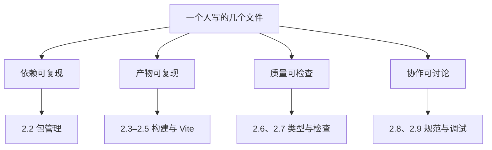
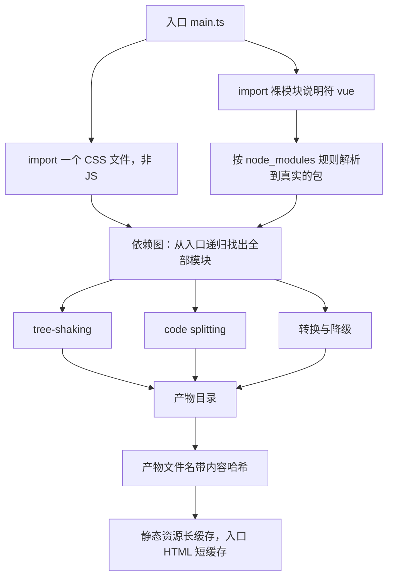
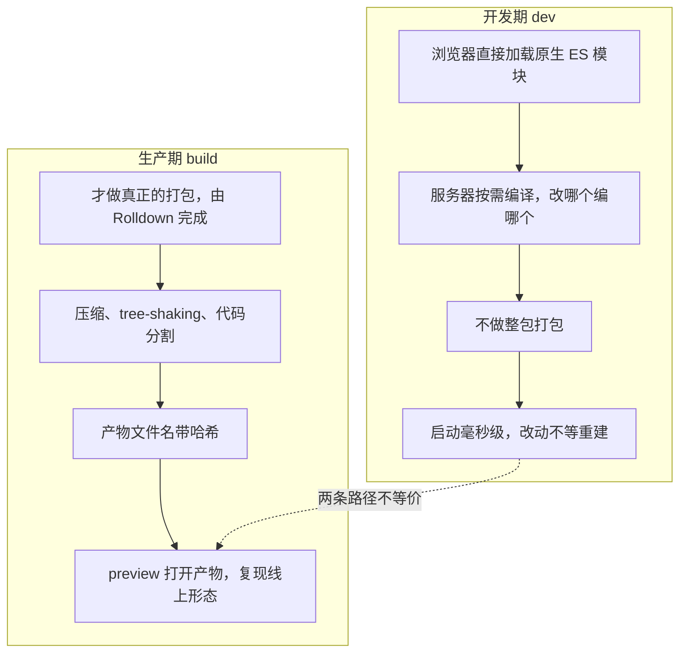
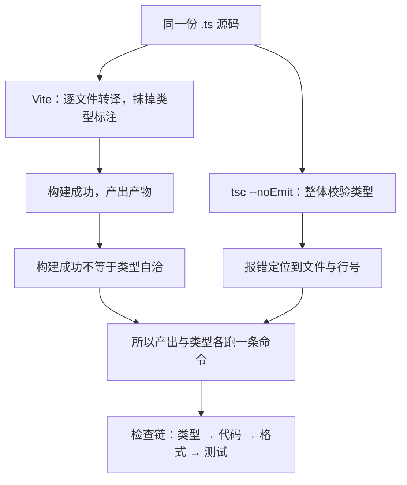

# 模块六 前端工程化

> **一句话**：这个模块要解决的是「代码从一个文件变成一个项目」之后才出现的问题——让任何一台机器、任何一个人拿到你的仓库，都能装出同样的依赖、跑出同样的产物、在提交之前被同一套检查拦住。
> **自学时长**：建议 9 小时（可分 3–4 次学完） · **前置**：模块四 JavaScript 语言核心（本模块用到的 `import` / `export` 在那里学过）
> **学完你能**：
> - 从零建立并跑通一个 Vite + TypeScript 工程，逐条说出生成目录里每个文件为什么存在；
> - 判断一个依赖该进 `dependencies` 还是 `devDependencies`，并说清 lockfile 与 `node_modules` 为什么命运完全相反；
> - 让类型检查与代码检查在提交前自动执行，被拦下时能读懂报错、定位到具体文件与行号。

本模块会用到的东西：Windows 11 + Node v26.7.0 + npm 11.19.0（或 pnpm 12.8.1）+ git，终端用 Git Bash，浏览器用任意现代浏览器。全部内容一个人一台机器就能跑完，不需要服务器、不需要注册账号。

## 1. 心智模型

先看全貌：工程化不是「一堆工具的清单」，而是四个**必须同时成立**的约束。任何一个不成立，项目就会退回到「在我机器上是好的」这个状态。



> **图 1**：本模块的四个约束与对应小节（依赖：换台机器还能装出同一套；产物：换台机器还能跑出同一份；质量：换个人也得过同一道关；协作：改动的理由能说清）。看图要点：四条支线各自对应一组具体工具，但它们是同一个问题的四个侧面——「换了环境还能不能复现」；构建工具只是「产物」那一支里最显眼、也最容易被误当成主角的一环。

几句话把这张图落地：

- **依赖**：别人 `git clone` 之后，装出来的包应该和你装的一模一样，靠 `package.json` + lockfile 说话；
- **产物**：源码要经过一层转换才能变成浏览器能跑的东西，这层转换是编译，不只是压缩；
- **质量**：类型对不对、代码有没有坑、格式齐不齐、行为对不对，各有一套工具管一段，谁都不替谁；
- **协作**：改动、理由、风险都要留痕，靠提交信息、评审和提交前自动执行的钩子，不靠「记得」。

**一段来路（知道就好，不用背）**：2009 年 Node.js 出现，对前端最大的影响不是「JS 能写服务端」，而是**工具链终于能用同一种语言写了**——以前想改一行构建配置，得先搭一个自己看不懂的环境。2012 年 Webpack 把「一个入口 → 顺着 `import` 找出全部依赖 → 输出若干产物」做成通用工具，此后很多年前端工程的默认形态就是一份构建配置。2020 年 Vite 换了条路（见 2.5），此后工具整体走向原生实现：esbuild 0.28.2、SWC、Oxc 这类用编译型语言写的工具，把「用 JS 写工具、跑不动了再想办法」的路线换掉了；Vite 8.3.1 的生产打包交给 Rolldown，也在这条线上。

## 2. 精讲（按节推进）

### 2.1 为什么需要构建  ⏱ 约 30 分钟

**白话定义**：构建（build）= 从入口文件出发，把你写的、以及你引用到的全部模块按依赖关系组织起来，转换成浏览器能直接执行的少量文件。打包（bundle）只是它的一种输出形态。

构建要解决四类问题，每一类都值得你亲手撞一次墙：

1. **裸模块说明符**。`import { createApp } from 'vue'` 里的 `'vue'` 不是路径，它是「裸模块说明符」——告诉工具「去包目录里按包名找」。浏览器只认识 URL，它既不知道要去哪里找，也不知道该补什么路径和扩展名。
2. **非 JS 文件**。`import './style.css'`、`import Icon from './icon.svg'` 这类写法，浏览器会把 `.css`、`.svg` 当 JS 去解析，直接报错。
3. **较新的语法**。可选链 `?.`、空值合并 `??` 这类写法在不支持的浏览器上不是「运行时报错」，而是**语法错误**：整个模块在解析阶段就被拒绝，一行都不执行。老浏览器上白屏，经常是语法层面的问题，不是逻辑 bug。
4. **请求数与体积**。几百个源文件逐个请求就是几百次网络往返；源码里还带着注释、空格、永远走不到的分支，体积远超实际需要。

**自己试一遍**（这一步很重要，不要跳过）：把下面这几行存成 `main.js`，同目录放一个 `index.html` 用 `<script type="module" src="./main.js"></script>` 引它。

```js
// 仅示形态：不经过构建，这几行在浏览器里跑不起来
import { createApp } from 'vue';   // 裸模块说明符
import './style.css';              // 非 JS 文件
```

然后**不要用 `file://` 打开页面**（那会撞上模块与跨域限制，报错和本节要讲的问题无关）。在文件所在目录起一个静态服务器，比如 `python -m http.server 8000`，浏览器访问 `http://127.0.0.1:8000/`，按 `Ctrl+Shift+J` 打开控制台，读出第一条报错——它说的正是「浏览器解析不了这个说明符」。再对着同一个 `.js` 文件发一次请求看原始响应，你会发现服务器发出去的就是你写的源码，一个字节没少。

**哪里会错**：把「构建」等同于「打包压缩」，以为只是为了省体积。省体积只是第 4 类问题的副作用；第 1–3 类问题一个都没解决。反过来说，就算你把文件数从 300 降到 5，前三个问题依然在——构建本质上是**编译**。

> **自检**：`import { createApp } from 'vue'` 和 `import { createApp } from './vue.js'`，本质区别是什么？

### 2.2 Node 与包管理  ⏱ 约 40 分钟

**Node.js 是什么**：让 JavaScript 脱离浏览器运行的运行时。本模块只把它当**工具链的宿主**用，不写服务端代码。

**`package.json` 里你必须读得懂的字段**：

| 字段 | 作用 |
|---|---|
| `name` | 包名，随便取，但别和要装的公共包重名 |
| `private` | 设为 `true` 表示这是个私有工程，不会被误发布到包注册表 |
| `type` | 决定 `.js` 文件按哪种模块格式解析（见 2.3） |
| `scripts` | 命令别名。`npm run build` 跑的就是这里的 `build` |
| `dependencies` | 会进入用户前端产物的包 |
| `devDependencies` | 只在你写代码、检查、构建时用到的包 |
| `engines` | 声明需要的 Node 版本，给别人和你未来的自己看 |
| `packageManager` | 声明用哪个包管理器及版本，避免混用 |

**semver（语义化版本）**：版本号写成 `主.次.修订`。主版本变 = 不兼容改动；次版本变 = 向后兼容的新功能；修订号变 = 修 bug。范围前缀决定「允许自动升到哪」：

| 写法 | 允许装到 | 记忆点 |
|---|---|---|
| `^3.5.43` | 不跨主版本的 3.x.x（次版本可以升） | `^` 只保住主版本 |
| `~3.5.43` | 3.5.x（修订号可以升） | `~` 只保住次版本 |
| `3.5.43` | 只能是 3.5.43 | 写死，无升级空间 |
| `latest` | 装那一刻的最新版 | 谁也不知道会装到什么，别用 |

**依赖分档的判据（一句话）**：**这个包会被打进给用户下载的前端产物吗？**

- 会 → `dependencies`：Vue 3.5.43、React 19.3.0、vue-router 5.3.1、pinia 4.0.3、zustand 5.0.15、Tailwind CSS 4.3.3 之类；
- 不会 → `devDependencies`：TypeScript 7.0.2、Vite 8.3.1、ESLint 10.11.0、Prettier 3.9.9、Biome 2.5.15、Vitest 5.0.3、Playwright 1.63.0、sass 1.105.1。

放错档的代价不是「不能跑」，而是别人用 `npm i --production` 时会白装（或漏装）一堆工具链。

**lockfile 与 `node_modules` 命运相反，理由也不同**：

- **lockfile（`package-lock.json` / `pnpm-lock.yaml`）必须提交**。它记录的是实际装到的确切版本、整棵依赖树和校验信息，是「可复现」的唯一凭据。删掉它，每个人装到的版本就可能不同。
- **`node_modules` 绝不提交**。它是能由上面两样东西再生的产物：体积大、含二进制、跨平台不通用，而且可能被投毒。

**npm 与 pnpm 的机制差异**（不是谁更好）：npm 给每个项目一份实体的 `node_modules`；pnpm 12.8.1 用全局内容寻址存储 + 硬链接，多项目共享同一份包内容，磁盘更省、安装更快，而且**依赖必须显式声明**（不写进 `package.json` 就 import 不到）。换包管理器会换 lockfile 文件名，一个项目里不要两种 lockfile 并存。

**`npm install` 与 `npm ci`**：`install` 会在需要时更新 lockfile；`ci` 严格按 lockfile 装、绝不修改它，专门用于干净复现（删掉 `node_modules` 后重装就用它）。

> **自检**：`eslint` 该放 `dependencies` 还是 `devDependencies`？理由一句话说出来。

### 2.3 模块格式：ESM 与 CJS  ⏱ 约 25 分钟

**两种模块格式**：ESM 用静态的 `import` / `export`（语法层面的引用关系，写在哪里就看得见）；CJS（CommonJS）用运行时的 `require` / `module.exports`（要执行到那一行才知道引用了什么）。

**互操作只有一个方向是安全的**：

- ESM **可以** `import` 一个 CJS 模块，那个模块的 `module.exports` 会被当成默认导出；
- CJS **不能**同步 `require` 一个 ESM 模块，只能改用动态 `import()`。这正是很多「包明明装好了却报 `ERR_REQUIRE_ESM`」的根因。

**`"type": "module"`** 写在 `package.json` 里，决定 `.js` 后缀按哪种格式解析。不写时 `.js` 默认按 CJS 解析，于是文件里的 `import` 就变成非法语法。想逐文件覆盖这个默认，把后缀改成 `.mjs`（按 ESM）或 `.cjs`（按 CJS）即可。注意 `type` 是**显式声明**，它会省掉一整类「环境猜错了」的问题；不写也不一定报错，取决于你用了什么语法、工具怎么解析。

**一句判据**：**能被静态分析的，才有机会被优化**（tree-shaking、代码分割、缓存都建立在「工具能提前看清依赖关系」之上）；只能运行时才知道的，工具一律照搬。

> **自检**：一个 `.js` 文件里写了 `import`，`package.json` 没有 `type` 字段——报错的根因是什么？除了改 `type`，还能怎么改？

### 2.4 打包器的五项职责与哈希缓存  ⏱ 约 30 分钟

打包器不是「合并文件」，它做五件事。每一项都要能在**产物层面**被观察到，不然就等于没生效：

| 职责 | 做什么 | 你怎么观察到它 |
|---|---|---|
| 依赖图解析 | 从入口递归找出全部模块及彼此关系 | 产物里出现了你从没直接 `import` 的文件内容 |
| tree-shaking | 去掉「被引入但从未被用到」的代码 | 整体引入一个库 vs 只引一个函数，产物体积对比 |
| 代码分割 | 把代码切成多块、按需加载 | 产物目录里多出按路由或动态 `import` 命名的文件 |
| 产物哈希 | 文件名带内容哈希，内容变则名字变 | 改一个字符串重新构建，文件名跟着变 |
| 转换与降级 | 把新语法、非 JS 文件处理成浏览器能吃的样子 | 源码里的 `.scss` 变成了产物里的 `.css` |



> **图 2**：从入口到产物的构建路径，以及打包器的五项职责。看图要点：产物里会出现你没有直接 `import` 的模块内容，这就是依赖图解析到位的证据；而哈希只有配合「入口 HTML 不缓存或短缓存」才构成闭环——否则用户被缓存住 HTML，永远不知道新文件名存在。

**哈希与缓存的闭环**：内容不变的静态资源可以长期缓存（因为内容一改文件名就改）；但入口 HTML **必须不缓存或短缓存**，它是用户发现新文件名的唯一入口。哈希的目的不是减小体积，是让缓存可以「长到一年」仍然安全。

**tree-shaking 生效的前提**：模块依赖能被静态分析（即 ESM 写法）、库本身写出了无副作用声明。动态拼接出来的引用方式会让它失效。

> **自检**：我说「产物已经带哈希了，所以缓存全部设成一年」，这句话哪里错了？

### 2.5 Vite 的两阶段与环境变量  ⏱ 约 35 分钟

这是本模块的核心。Vite 8.3.1 在**开发期**和**生产期**走的是两条完全不同的路径：

- **开发期（dev）**：浏览器直接加载原生 ES 模块，服务器**按需编译**——请求到哪个文件才编译哪个，不做整包打包。所以启动是毫秒级的，改一处不用等全量重建，同时还有热更新。
- **生产期（build）**：这才做真正的打包、压缩、tree-shaking、代码分割、产物哈希，生产打包由 **Rolldown** 完成。产物落在 `dist/`，用 `preview` 打开它，才是逼近线上的形态。



> **图 3**：Vite 的两阶段。看图要点：dev 下模块被逐个请求，生产下被合并，加载顺序与体积都变了，所以 **dev 下的行为不能当成生产行为**；只在生产暴露的顺序问题、体积问题、路径问题，都要在 build + preview 里复现。

**环境变量**：

- 只有 `VITE_` 前缀开头的变量会被注入到客户端代码，其它前缀的**读不到**（会在源码里得到 `undefined`）；
- 但它**不是安全机制**：只要一个值进了前端产物，用户就能看到。前缀只是「允许暴露」的白名单，不是加密。
- `.env`、`.env.local` 一律不入库，用 `.gitignore` 挡住；提交一个 `.env.example` 说明需要哪些变量名，让别人知道该配什么。
- 多环境用「文件 + 模式」组织：开发、预发、生产各一套变量，构建时按模式加载。

**自己试一遍**：在 `.env` 里同时写一个 `VITE_` 开头的变量和一个不带前缀的变量，在页面上把两者的读取结果都打印出来——不带前缀的那个是 `undefined`，带前缀的能读到值。两个结果都记下来，这比记住结论有用。

> **自检**：我把接口密钥写成 `VITE_API_KEY`，用户就看不到啦——对吗？为什么？

### 2.6 TypeScript：够用就好  ⏱ 约 40 分钟

本模块只需要你掌握用得上的那部分，框架细节留给模块七。

- **类型标注与推断**：给参数、返回值、复杂变量加类型即可；用上推断后，大部分局部变量不需要手写类型。
- **`interface` 与 `type` 的边界**：描述对象形状两者都能做。需要**声明合并**（同名 `interface` 自动合并）或描述类契约时用 `interface`；需要**联合类型、元组、条件类型**这类组合表达时用 `type`。别争论哪个更好，只问「这个场合该用哪个」。
- **泛型**：把类型当参数传进去，让函数或容器对多种类型都保留类型信息。判据一句话：**返回类型依赖入参类型**，而你又不想为每种类型各写一个版本。
- **联合与收窄**：`'idle' | 'loading' | 'done'` 这类联合是前端最有价值的用法之一；在分支判断之后，类型会被自动收窄到那一个分支。
- **类型守卫**：用返回 `boolean` 且带类型谓词的函数，或用 `in`、`typeof`、字面量判断，把宽类型收窄到具体形态。
- **`any` 与 `unknown` 的边界**：`any` 是关掉检查，错误会流到运行时；`unknown` 是「我现在还不知道它是什么」，**必须先收窄才能使用**。判据：**接收外部数据（接口响应、`localStorage`、第三方回调）一律用 `unknown`，永远不用 `any`**。
- **`strict` 必开**：它是多项严格检查的总开关，关掉它等于放弃这层检查的全部价值。类型报错是免费的 bug 检查，不是别人在找麻烦。
- **`.d.ts` 声明文件**：给「没有类型的 JS 库」「全局注入的变量」「非代码资源」补类型。你要能读懂「找不到模块 xxx 的类型声明」这类报错，并知道该去哪里补。

**自己试一遍**：写一段处理接口响应的代码，先用 `any` 一路顺手；再把它标成 `unknown`——你会发现**不写收窄分支，代码根本推进不下去**。这就是它的价值所在。

> **自检**：`unknown` 用起来比 `any` 麻烦得多，为什么还要求「外部数据一律用 `unknown`」？

### 2.7 类型检查与转译分离  ⏱ 约 20 分钟

这是本模块**最容易被误解的一句话**：**Vite 只转译，不做类型检查。**

它把 `.ts` 里的类型标注抹掉、把语法变成浏览器能跑的代码，但**不校验类型是否自洽**——因为它逐文件转译，看不到另一个文件里的类型关系。

所以类型检查必须单独跑一条命令：在项目根目录执行 `npx tsc --noEmit`（只检查、不产出文件，避免和打包器的产物打架），并把这条命令挂进 `scripts`（或挂在提交前、挂在 CI 里）。



> **图 4**：同一份源码走两条路——转译那条只管「能不能跑」，类型检查那条才管「对不对」。看图要点：构建成功不等于类型自洽，这就是必须把 `tsc --noEmit` 挂进脚本与提交钩子的原因。

**检查链的四层分工**要记牢：类型检查（`tsc`）管类型自洽 → 代码检查（ESLint 10.11.0）管会不会出错 → 格式化（Prettier 3.9.9）管好不好看 → 测试（Vitest 5.0.3 / Playwright 1.63.0）管行为对不对。四层各管一段，谁都不能替代谁。

**反面案例（值得亲手复现一次）**：项目里「一切正常」，直到有人删掉一个字段——产物照样构建成功，线上才炸。根因是从来没有人跑过 `tsc --noEmit`。

> **自检**：`vite build` 通过，能说明代码没问题吗？为什么？

### 2.8 质量工具分工与 Git 协作  ⏱ 约 35 分钟

**三个工具，三段职责**，判据都是一句话：

| 工具 | 管什么 | 判据 | 典型规则 |
|---|---|---|---|
| ESLint 10.11.0 | 代码**对不对**（可能出错、可能有害的写法） | 「这条规则能指出一个 bug 风险吗」 | 用了未定义变量、Promise 没处理、依赖数组不全 |
| Prettier 3.9.9 | 代码**好不好看**（纯格式） | 「这条规则只是在争论排版吗」 | 引号、分号、缩进、换行、每行宽度 |
| Biome 2.5.15 | 上面两件事**二合一** | 「想少装两套配置、想快」 | 一份配置同时给 lint 与格式化 |

**Git 协作规范**（基础操作见 Pro Git 中文版）：

- **分支**：主干保持稳定，功能走短分支，合并前必须过检查；
- **提交信息**：一句话说清**为什么改**，不是「改了一下」「fix」；一条提交只做一件事（`git status` 看改动 → `git add <文件>` 暂存 → `git commit -m "<为什么改>"`）；
- **PR 与评审**：PR 描述写清「改了什么 / 为什么 / 怎么验证」；评审看的是意图与风险，格式交给工具；
- **pre-commit 钩子**：把类型检查、代码检查、格式检查挂在提交前，标准就不靠自觉——挂在钩子里的检查要快，耗时长的（全量测试）留给 CI；
- **`.gitignore` 挡住两类东西**：① 可再生的运行数据（`node_modules`、构建产物目录、构建缓存、测试产物、本地日志）；② 可能带密钥与本地状态的（`.env*`、本地证书、含敏感信息的编辑器配置）。

提交前自问一句：**「这个文件里有没有密钥？有没有在别人机器上不成立的东西？」**

**密钥这件事没有例外**：源码会被构建进产物、明文发到浏览器，任何访问者都能在产物的 JS 里搜到这个字符串，压缩混淆也改不掉字符串本身。更关键的是——**一旦推上去就等于泄露**：提交历史、缓存、别人的本地克隆、CI 日志里都可能留有副本，撤销提交只是让别人看不到，不等于撤回。正确动作是**立即轮换密钥**，再清理历史。

> **自检**：pre-commit 里该放什么、不该放什么？把耗时几分钟的全量测试放进去，会出什么问题？

### 2.9 Source Map 与产物调试  ⏱ 约 20 分钟

生产产物的代码已经不是你写的代码（被合并、压缩、改名），**Source Map 就是产物与源码之间的映射表**，让浏览器调试器能显示原始位置。

- **怎么开**：在构建配置里生成 sourcemap；
- **要不要公开是权衡**：线上开着等于把源码结构送给访问者，常见做法是生成但不放进公开目录，只在内部的错误监控平台里使用；
- **怎么用**：按 `F12` 打开开发者工具 → 点 Sources → 在左侧文件树里展开原始源码目录 → 断点可以直接打在 `.ts` 文件上。继续执行 `F8`、单步跳过 `F10`、进入函数 `F11`、跳出 `Shift+F11`。

**自己试一遍**：先在生产形态下触发一个错误（`Ctrl+Shift+J` 看 Console 里的堆栈——全是压缩后的列号），再打开 Source Map 看同一个错误，位置会直接指回 `.ts` 文件。

> **自检**：Source Map 会不会让用户看到你的源码？线上该不该部署它？

## 3. 关键概念讲透

### 3.1 构建的本质：依赖图 → 产物

- **常见误解**：构建 = 打包压缩，目的就是让文件变小。
- **正确理解**：构建是从入口出发，把「你写的 + 你引用的」全部模块按依赖关系组织起来，转换成浏览器能执行的少量文件。它同时在解决四类问题：裸模块说明符、非 JS 文件、新语法、请求数与体积。
- **一个反例**：写一个只有 5 个文件、纯 ESM、不带任何依赖的新项目，你会觉得「没啥可构建的」；但只要其中一行是 `import { createApp } from 'vue'`，不构建就是跑不起来——省掉的 300 次请求并不解决前面三类问题。
- **一句判据**：**能静态分析依赖就要静态分析**——能被分析的才有机会被 tree-shaking、被分割、被哈希缓存。

### 3.2 dev 不等于生产

- **常见误解**：`npm run dev` 里页面正常，就等于功能正常。
- **正确理解**：dev 下模块被逐个请求、按需编译；生产下模块被合并、被压缩、被改顺序。两条路径不同，暴露的问题也不同。
- **一个反例**：某个模块依赖「先执行」的副作用顺序，dev 下每个文件独立请求、顺序恰好对；打包后合并成一个文件、顺序变了，线上白屏，本地复现不出来。
- **一句判据**：凡是「我这能跑」，先问一句「你是在 dev 还是 preview 里跑的」。

### 3.3 构建成功 ≠ 类型正确

- **常见误解**：`vite build` 过了，就说明代码没问题。
- **正确理解**：转译只做「剥掉类型、转换语法」，逐文件完成，看不到跨文件类型关系；类型自洽只有整体校验才能确认，得单独跑 `tsc --noEmit`。
- **一个反例**：删掉一个被引用的字段，产物照样构建成功、体积还变小了——直到运行到那行代码才炸。
- **一句判据**：**产出归 `vite build`，类型归 `tsc --noEmit`**，两条命令各管一段。

### 3.4 可复现是一套动作，不是一个文件

- **常见误解**：提交了 `package.json` 就够别人复现了；仓库越小越好，lockfile 也可以不要。
- **正确理解**：`package.json` 声明「你要什么范围」，lockfile 记录「实际装到了什么」，`.gitignore` 决定「什么不进仓库」，依赖分档决定「什么算运行时」——四件事共同回答同一个问题：换一台机器、换一个人，能不能装出一模一样的环境。
- **一个反例**：删掉 lockfile 后重装，`npm ls` 里的实际版本可能已经变了；你排查半天的 bug，可能只是别人装到了另一个次版本。
- **一句判据**：**能自动重装出来的东西不进仓库，装不回来的结论必须留成 lockfile**。顺带记住：可复现 ≠ 永不升级——升级是一次有意的动作（改范围、装、跑类型检查与测试、评审），不是让 `^` 悄悄替你决定。

### 3.5 「让报错消失」的四种逃逸手段

- **常见误解**：报错消失了，问题就解决了。
- **正确理解**：`any`、`// @ts-ignore`、`as any`、把 `strict` 关掉——这四种做法都是把问题从编译期推到运行时，检查链的价值归零。样式里的 `!important` 同理：它只是用最高优先级盖住症状，没解决「哪条规则本来该赢」。
- **一个反例**：一个 `unknown` 的数据源被你断言成具体形状，编译通过；接口真返回了别的形状时，错误出现在用户的那一次点击上，而不是你的编辑器里。
- **一句判据**：**报错是信息，不是障碍**。真要用逃逸手段，你必须能说出「如果这里类型错了，会在哪一行炸」。

## 4. 动手（自学版实验）

> 四个动手任务共用一套环境：Windows 11 + Node v26.7.0 + npm 11.19.0（或 pnpm 12.8.1）+ git，终端用 Git Bash。提交物一律**只提交源码与配置**，绝不提交 `node_modules` 与构建产物。每个任务都只给验收标准，代码与脚本由你自己写。

### 动手一：从零建立一个 Vite + TypeScript 工程并跑通三条命令

- **要做什么**：
  1. 在干净目录的上一级执行 `npm create vite 我的工程 -- --template vue-ts`（走 React 线就用 `react-ts`；不需要路由与状态管理；npm 如果问你要不要安装脚手架，按提示确认）；
  2. 进入目录装依赖，依次跑通 `npm run dev`、`npm run build`、`npm run preview`，**每条命令留一次终端输出**；
  3. 逐行注释 `package.json`：哪些字段是你写的、哪些是工具写的；每个依赖标出它属于 `dependencies` 还是 `devDependencies`，各写一句理由；
  4. 写 `.gitignore`，至少挡住：`node_modules`、构建产物目录、`.env*`、日志与缓存；
  5. 写一份 `.env`，里面放一个 `VITE_` 前缀的变量和一个不带前缀的变量，**用一个页面把两者的读取结果对比出来**；确认 `.env` 没有入库，并提交一份 `.env.example` 交代变量名；
  6. 初始化 git 仓库，按规范提交（提交信息写清「为什么」），提交历史里不得出现 `node_modules` 与 `.env`。
- **需要什么**：干净目录、能联网装包、任意编辑器、终端（Git Bash）；浏览器用来核对页面。看页面差异时按 `F12` 打开开发者工具（`Ctrl+Shift+J` 直接开 Console），改一处数据源后**同时看 dev 窗口和 preview 窗口**。
- **验收标准**（逐条自己勾）：
  - [ ] `dev` 能启动并显示页面；`build` 退出码为 0 且产出产物目录；`preview` 下页面与 dev 表现一致（用「改一处数据源、两边都看」验证）；
  - [ ] 能指着 `package.json` 里任意字段说出作用，说不出就算没完成；
  - [ ] 不带 `VITE_` 前缀的变量在客户端读到 `undefined`，带前缀的能读到值，**两个结果都留在你的记录里**；
  - [ ] `git ls-files` 的输出里不含 `node_modules/`、不含产物目录、不含任何 `.env` 文件；
  - [ ] 删掉 `node_modules` 后能用一条命令重装，并再次跑通 `build`（建议用 `npm ci` 体会与 `npm install` 的区别）。
- **卡住了看**：2.1（四类问题）、2.2（字段、分档、lockfile）、2.4（产物与哈希）、2.5（环境变量）；脚手架用到的包名是 `create-vite`，Vite 官方指南在 https://vite.dev/guide/ 。

### 动手二：亲手验证「可复现」

- **要做什么**：
  1. 把某个依赖的版本范围在 `^`、`~`、写死三种写法之间各改一次，每次重新安装并用 `npm ls <包名>` 对照实际装到的版本，做一张对照表；
  2. 备份 lockfile，删掉它重新安装，比较前后版本差异；再把备份放回去、删掉 `node_modules`、用 `npm ci` 重装一次，确认能跑通全部脚本；
  3. 故意把 `.env` 先 `git add` 进暂存区，用 `git status` 观察它出现在提交清单里，然后把它撤出暂存区、写进 `.gitignore`，再确认 `git status` 变干净；
  4. 写 3 行结论：为什么 `node_modules` 不进仓库、lockfile 必须进仓库，这两个理由为什么不是同一个。
- **需要什么**：动手一建好的工程（或任意一个 npm 工程）、git。全程不需要联网之外的额外工具。
- **验收标准**：
  - [ ] 对照表里能看到三种范围写法装出的版本不同（至少 `^` 与写死这两种要有差异，或者你能解释为什么本机此刻没差异）；
  - [ ] 删掉 lockfile 重装后你能说出「这次的版本是否变了」，不靠猜；
  - [ ] `npm ci` 与 `npm install` 的行为差别，你能各举一个现象（比如前者不改 lockfile、后者可能更新）；
  - [ ] 3 行结论里包含「可再生」与「唯一凭据」这两个关键词。
- **卡住了看**：2.2 全部。

### 动手三：手写一个最小 bundler

- **要做什么**：
  1. 准备两个**互相 import** 的模块（A 引用 B 的一个导出，B 引用 A 的一个导出），放在独立目录里；先用浏览器**不打包**直接加载它们，确认失败；
  2. 用 Node 写一个脚本（建议不超过约 50 行；**不引入任何打包库**——不许调 Vite 8.3.1 / esbuild 0.28.2 / webpack 5.111.1 来完成打包，也不许用第三方解析器）：从入口出发读文件、找出该文件里的 `import` 语句、把每条引用解析成统一的项目内路径、把整份产物写成**一个**独立的 `.js` 文件、并让每个模块能取到自己需要的依赖、按正确顺序执行、把入口的结果暴露出来；
  3. 在页面里加载你的产物，功能行为必须和「手工按顺序执行这些模块」的结果一致；
  4. 在 `README.md` 里写 3–8 行：你的脚本替浏览器做了哪几件事，其中**至少两件是浏览器无论如何都做不到的**；再列出你的实现做不到的至少两件事（例如 tree-shaking、代码分割、产物哈希）。
- **需要什么**：Node v26.7.0 即可，不需要任何第三方包；浏览器用来加载产物文件（起一个本地静态服务器访问，别用 `file://`）。
- **验收标准**：
  - [ ] 不打包直接加载 → 失败；加载你的产物 → 成功，且与手工执行的等效结果一致（用一次计数或一次字符串拼接打印对照）；
  - [ ] 模块表里每个模块只出现一次，**循环引用不会死循环、不会栈溢出**；
  - [ ] 产物是单文件，不依赖任何外部运行库；
  - [ ] `README.md` 里写明了四件事：路径与说明符怎么解析、作用域与导出怎么承载、依赖按什么顺序执行、为什么浏览器单独做不到；
  - [ ] 与「正规打包器的产物」并排比较，能说出至少两处你的脚本做不到的事。
- **卡住了看**：2.3（ESM/CJS 与静态分析）、2.4（五项职责，尤其依赖图解析与作用域承载）；先想清楚「模块的变量为什么不能直接堆在一个文件里」，再动手写。

### 动手四：制造类型错误并证明检查链抓得到

- **要做什么**：
  1. **故意**写三处错误，每处都留证据：一处纯类型错误（例如把 `number` 传给只接 `string` 的函数）；一处联合类型漏收窄（例如 `'idle' | 'loading' | 'done'` 的状态只处理两个分支）；一处检查器能抓的代码问题（例如定义后未使用的变量，或没被处理的异步结果——按你选的检查器所支持的范围）；
  2. 对每一处：**先跑 `vite build` 记录结果，再跑 `tsc --noEmit` 记录结果**，做一张「构建结果 vs 类型检查结果」对照表；
  3. 在 `package.json` 里让类型检查成为构建或提交的必经一步（三条脚本里至少要有一条会因此失败）；
  4. 配一个 pre-commit 钩子（在 `.git/hooks/pre-commit` 里写一段 shell 脚本，跑 `npx tsc --noEmit` 与你选的检查器，失败就 `exit 1`；Windows 下用 Git Bash 给它加可执行权限）：带错误提交 → 被拦下；修好再提交 → 通过，两段记录都留下；
  5. 把三处错误全部修掉，**不许用 `any`、`@ts-ignore`、`as any`，也不许放宽 `strict`**，并说明每一处修的是不是根因；
  6. 写 3 行结论：为什么构建能过而类型检查不能过，这套检查链在多人协作里值什么。
- **需要什么**：动手一的工程、TypeScript 7.0.2 随工程装好；ESLint 10.11.0 或 Biome 2.5.15 任选一套，Prettier 3.9.9 可选；git 与 Git Bash（用来写钩子和加权限）。类型检查命令：项目根目录 `npx tsc --noEmit`。
- **验收标准**：
  - [ ] 三处错误都有「构建通过 / 类型检查或代码检查报错」的成对证据；
  - [ ] `tsc --noEmit` 的报错**能定位到具体文件与行**，原文被你抄录下来；
  - [ ] pre-commit 有拦截记录，且「修好后能提交成功」也有记录；
  - [ ] 最终状态下 `tsc --noEmit` 与检查器都无报错，且 `git diff` 里搜不到 `any`、`@ts-ignore`、`strict: false` 之类的逃逸手段；
  - [ ] 3 行结论能说清「转译逐文件、类型检查看全局」这个差别。
- **卡住了看**：2.6（`unknown` 与收窄）、2.7（转译与类型检查分离，图 4）、2.8（钩子与 `.gitignore`）。

## 5. 自测

### 5.1 客观题（答案与解析在折叠块里）

**1.（单选）** 下列哪一项**必须**提交进 Git 仓库？
A. `node_modules/` 目录　B. lockfile（`package-lock.json` 或 `pnpm-lock.yaml`）　C. 构建产物目录　D. `.env`
> [!success]- 答案与解析
> **B**。lockfile 记的是「实际装到的确切版本 + 整棵依赖树 + 校验信息」，是把环境重装回原样的唯一凭据，必须跟着源码走。A、C 都能由源码加 lockfile 再生；D 装的是本机与敏感配置，入库等于把环境差异和密钥一起提交。注意判据不是「文件大不大」——仓库体积靠 `.gitignore` 挡住 `node_modules` 来解决，不是靠删 lockfile。

**2.（单选）** `"vue": "^3.5.43"` 允许自动安装到的版本范围是：
A. 任意 3.x 及以上的版本　B. 3.5.x　C. 不跨主版本的 3.x.x　D. 只能是 3.5.43
> [!success]- 答案与解析
> **C**。`^` 只保住主版本，所以能升到 3.6、3.9，但不会到 4.x；`~3.5.43` 才只保住次版本（3.5.x）；写成 `3.5.43` 才是锁死单版本。A 错在把主版本也放开了，B 是 `~` 的范围，D 是无前缀的范围。

**3.（单选）** `import { createApp } from 'vue'` 被浏览器直接加载时会失败，根本原因是：
A. `vue` 没有被安装到本机　B. `'vue'` 是裸模块说明符，不是路径；浏览器不知道去哪里找，也不知道补什么路径与扩展名　C. 浏览器对 ES 模块的支持有缺陷　D. `createApp` 这个名字写错了
> [!success]- 答案与解析
> **B**。裸模块说明符必须由工具按包目录规则解析成真实路径，浏览器只认 URL。A 是次要因素（就算装在 `node_modules` 里，浏览器也不会去那里找）；C 与事实相反；D 与报错内容无关。

**4.（单选）** 关于 Vite 8.3.1 的环境变量，下列说法正确的是：
A. 任意名字的变量都会被注入到客户端代码　B. 只有 `VITE_` 前缀开头的变量会被注入客户端，但它是「允许暴露」的白名单，不是加密　C. 以 `VITE_` 开头的变量会被加密后注入，用户看不到明文　D. `.env` 应当提交进仓库，方便团队共享
> [!success]- 答案与解析
> **B**。前缀机制只决定「允不允许进客户端」，值到了产物里就是明文。C 把白名单说成了加密，是最危险的一种误解；D 恰好相反，`.env` 必须被 `.gitignore` 挡住，共享靠提交 `.env.example`；A 忽略了前缀这道门。

**5.（单选）** ESLint 10.11.0、Prettier 3.9.9、Biome 2.5.15 三者的职责分界，正确的是：
A. 三者功能完全相同，任选一个即可　B. ESLint 管格式，Prettier 管代码正确性，Biome 只做压缩　C. ESLint 管「代码对不对」（可能出错、可能有害的写法），Prettier 管「代码好不好看」（纯格式），Biome 把这两件事二合一　D. Prettier 管类型检查，ESLint 管格式化
> [!success]- 答案与解析
> **C**。判据是问自己「这条规则能指出一个 bug 风险，还是只在争论排版」。B、D 把两者的职责对调了；A 忽略了它们解决的问题不同；三者也都不做类型检查——类型检查属于 `tsc`。

**6.（单选）** 「Vite 只转译，不做类型检查」这句话的直接后果是：
A. 工程里不能使用 TypeScript　B. `vite build` 成功不代表类型自洽，必须另外跑 `tsc --noEmit`　C. 必须关掉 `strict` 才能构建成功　D. TypeScript 的类型标注其实都可以不写
> [!success]- 答案与解析
> **B**。转译逐文件进行，看不到另一个文件的类型，所以它只能保证「能跑」，不能保证「类型对」。A 与事实相反，C 恰好是应当禁止的逃逸手段，D 混淆了「转译会抹掉标注」与「标注不重要」。

**7.（单选）** 下列哪种说法符合本模块「哈希 + 缓存」的闭环口径？
A. 产物文件名已经带了哈希，所以入口 HTML 也可以长期强缓存　B. 内容不变的静态资源可以长期缓存（名字随内容变化），入口 HTML 必须不缓存或短缓存　C. 只要给所有资源都加 `Cache-Control: no-store`，就不会再有缓存问题　D. 产物加哈希的目的主要是减小文件体积
> [!success]- 答案与解析
> **B**。哈希让「内容不变」这件事可以在名字上被识别，因此静态资源可以长缓存；但 HTML 是发现新文件名的入口，被缓存住就永远拿不到新版。A 正是那个经典错误；C 是另一端的极端（放弃缓存收益，用户每次全量下载）；D 说错了哈希的目的——哈希解决的是缓存失效，不是体积。

**8.（判断）** `node_modules` 和 lockfile 的理由是一样的——两者都是「装好的环境」，都该提交进仓库，方便别人直接使用。
> [!success]- 答案与解析
> **错**。两者的命运相反、理由也不同：lockfile 是「可复现」的唯一凭据，必须提交；`node_modules` 是可再生产物（体积大、含二进制、跨平台不通用、可能被投毒），删掉它能用 lockfile 一条命令装回来，所以绝不提交。答「都对」或「都错」不得分。

**9.（判断）** 如果不小心把含密钥的提交推到了远程，只要马上撤销那次提交并删掉文件，密钥就算安全了，不必轮换。
> [!success]- 答案与解析
> **错**。提交历史、缓存、别人的本地克隆、CI 日志里都可能留有副本，删除与撤销都不等于撤回。正确动作是**立即轮换密钥**，再清理历史。判据：说得出「删除 ≠ 撤回」和「轮换」这两个关键词。

**10.（简答）** 说出构建工具解决的四类问题，每类各举一个「不解决就会失败」的最小例子。
> [!success]- 答案与解析
> ① **裸模块说明符**：`import { createApp } from 'vue'`，浏览器无法把 `'vue'` 解析成 URL；② **非 JS 文件**：`import './style.css'` 或 `import Icon from './icon.svg'`，浏览器会按 JS 解析；③ **较新的语法**：可选链、空值合并这类写法在不支持的浏览器上是语法错误，整个模块不执行；④ **请求数与体积**：几百个小文件逐个请求、源码带着注释与无用分支。判分要点：四类齐全，**每类都带最小例子**，缺例子扣一半。

**11.（简答）** 为什么 Vite 开发期启动这么快？为什么又必须用 `build` + `preview` 才能判断线上的表现？并写出由此推出的一条纪律。
> [!success]- 答案与解析
> ① dev 期浏览器直接加载原生 ES 模块，服务器**按需编译**被请求到的文件，不做整包打包，省掉了「每次启动重建全量产物」；② 生产期要打包、压缩、tree-shaking、代码分割、加哈希，模块被合并、加载顺序被改变，只有 preview 形态才逼近线上；③ 纪律一句：**开发看速度，上线看产物**——凡是「我这能跑」，先问是 dev 还是 preview 里跑的。

**12.（简答）** 「类型检查与转译分离」是什么意思？为什么类型检查不能塞进逐文件转译里一起做？再写出检查链的四层分工。
> [!success]- 答案与解析
> 转译＝逐文件剥掉类型与语法（快、可并行、可缓存）；类型检查＝校验整个工程的类型关系（慢、全局）。不能合并的原因：逐文件转译看不到另一个文件里的类型，天然无法做跨文件校验；分开之后编辑器的反馈和构建的反馈也各自更快。四层分工：类型检查（`tsc`）管类型自洽 → 代码检查（ESLint）管会不会出错 → 格式化（Prettier）管好不好看 → 测试（Vitest / Playwright）管行为对不对。

**13.（简答）** `unknown` 用起来比 `any` 麻烦得多，为什么仍然要求「接收外部数据（接口响应、`localStorage`、第三方回调）一律用 `unknown`，永远不用 `any`」？请从「错误发生在什么阶段」的角度解释。
> [!success]- 答案与解析
> `any` 等于放弃检查，错误会一路流到**运行时**才炸，而且炸在离原因很远的地方；`unknown` 强制你在数据进入程序的边界处先收窄（类型守卫、`typeof`、`in`、字面量判断），把错误提前到**写代码时**。外部数据的形状本来就不由你保证，正是最需要这道关的地方。判分要点：必须点明「编译期拦下 vs 运行时才炸」的对照，只说「`any` 不好」不得分。

**14.（简答）** 打包器有「五项职责」，列出其中四项，并各给一个能在产物层面观察到的判据。
> [!success]- 答案与解析
> 任答四项即可：① 依赖图解析——产物里出现了你从没直接 `import` 的模块内容；② tree-shaking——整体引入一个库 vs 只引一个函数，产物体积对比；③ 代码分割——产物目录里多出按路由或动态 `import` 命名的文件；④ 产物哈希——改一个字符串重新构建，文件名跟着变；⑤ 转换与降级——源码里的 `.scss` 变成了产物里的 `.css`。判分要点：每项都要有**产物层面**的观察点，只背职责名字不得分。

**15.（读代码）** 读下面这段（仅示形态）：

```js
// util.cjs
module.exports = { id: (x) => x };

// main.js —— package.json 中没有 "type": "module"
import { id } from './util.cjs';
console.log(id(1));
```

问：这段代码会出什么问题？给出三种改法，并说明哪一种（或哪几种）改法会触到「ESM 能 `import` CJS、CJS 不能同步 `require` ESM」这条边界。
> [!success]- 答案与解析
> 根因：`main.js` 是 `.js`，`package.json` 没有 `"type": "module"`，于是它按 CJS 解析，而 CJS 里 `import` 是非法语法。三种改法：① 在 `package.json` 加 `"type": "module"`；② 把 `main.js` 改名为 `.mjs`；③ 把 `main.js` 改用 CJS 的 `require` 去引这个 CJS 模块。触到 ESM/CJS 互操作边界的是 **①②**——它们把 `main.js` 变成 ESM，去 `import` 一个 CJS 依赖，正落在「ESM 可以引 CJS」这一侧；改法 ③ 两端都是 CJS，不涉及互操作，所以不触这条边界。反过来「CJS 同步 `require` 一个 ESM 模块」是不允许的，只能走动态 `import()`。

**16.（读代码）** 读下面这段（仅示形态）：

```ts
function pick(input: unknown) {
  return input.name;      // 编译报错
}
function pick2(input: any) {
  return input.name;      // 不报错
}
```

问：① 为什么第一个报错、第二个不报错？② 把第一个改成能通过 `strict` 的写法，必须补什么？③ 两个版本在运行时各有什么风险？
> [!success]- 答案与解析
> ① `unknown` 在使用前必须先收窄（类型守卫、`in` / `typeof` / 字面量判断），所以直接取 `.name` 不被允许；`any` 直接放弃检查，取什么属性都放行。② 必须补收窄分支（例如判断 `input` 确实是带 `name: string` 的对象形态），并在分支内使用收窄后的类型。③ `any` 版本在运行时若形状不符会直接抛错，且编译期完全没有提示；`unknown` 版本把这类错误挡在编译期，边界处的失败变成「写代码时就发现」。判分要点：必须区分「编译期拦下」与「运行时才炸」。

**17.（读代码）** 读下面这份 `package.json` 片段（仅示形态）：

```jsonc
{
  "type": "module",
  "dependencies": {
    "vue": "^3.5.43",
    "pinia": "^4.0.3",
    "vitest": "^5.0.3"
  },
  "devDependencies": {
    "vite": "^8.3.1",
    "typescript": "^7.0.2",
    "eslint": "^10.11.0"
  }
}
```

问：① 按「这个包会不会被打进给用户的前端产物」这条判据，指出至少一处分档放错的地方，说明理由与后果；② 以这份片段为起点，写出 `.gitignore` 至少要挡住哪四类内容。
> [!success]- 答案与解析
> ① `vitest` 放错了——它是测试工具，只在写代码、检查与构建时出现，不参与前端产物，应放 `devDependencies`；后果是别人执行 `npm i --production` 时会白装一整条测试工具链。`vue`、`pinia` 放 `dependencies` 是对的（它们会被打进用户下载的产物）。② `.gitignore` 至少挡住四类：`node_modules`；构建产物目录（以及构建缓存、测试产物、本地日志）；`.env*`（提交 `.env.example` 交代变量名）；本地证书与含敏感信息的编辑器配置。判分要点：必须给出「会不会被打进前端产物」这条判据，只给结论不给分。

### 5.2 动手题（不给实现，只给验收标准与评分点）

**1.** 写一个脚本（建议不超过约 50 行），把两个**互相 import** 的模块打成**一个**能在浏览器里直接运行的单文件产物。**不得引入任何打包库**（不许直接调用 Vite 8.3.1 / esbuild 0.28.2 / webpack 5.111.1，也不许使用第三方解析器）。
- **验收标准**：① 不打包时直接加载失败、加载你的产物成功，且行为与手工按顺序执行等价；② 模块表里每个模块只出现一次，循环引用不死循环、不栈溢出；③ 产物是单文件、不依赖外部运行库；④ `README.md` 说明脚本替浏览器做了哪几件事（其中至少两件是浏览器做不到的），并列出你的实现做不到的至少两件事（如 tree-shaking、代码分割、哈希）。
- **评分点**：能跑通且行为一致（35）；循环引用处理正确（20）；脚本结构可读、有注释（15）；`README.md` 对「打包器做了什么」与「你的实现缺什么」写得是否具体（20）；没有违反「不得引入打包库」（10）。把别人的打包器包一层冒充手写的，按零分处理。

**2.** 在你的工程里制造三处错误（一处类型错误、一处联合类型漏收窄、一处检查器能抓的代码问题），并让检查链抓住它们。
- **验收标准**：① 三处错误各有「`vite build` 通过 / `tsc --noEmit` 或检查器报错」的成对证据，报错能定位到文件与行；② 类型检查是构建或提交的必经一步（至少有一条脚本会因此失败）；③ pre-commit 有拦截记录，且修好后能提交成功；④ 修复不得使用 `any`、`@ts-ignore`、`as any`，也不得放宽 `strict`；⑤ 结论 3 行，说清「为什么构建能过而类型检查不能过」。
- **评分点**：证据完整度（30）；修复是否触及根因、有无逃逸手段（30）；钩子与脚本接线正确（20）；结论的准确性与表达（20）。凡是用 `any` / `@ts-ignore` / 关掉 `strict` 让报错消失的，按**未完成**处理，而不是「通过」。

## 6. 自我检查清单

逐条打勾；打不出勾的先回到对应节，别往下走。

- [ ] 我能判断一个包该进 `dependencies` 还是 `devDependencies`，判据是一句话（2.2）
- [ ] 我的仓库里没有 `node_modules`、没有构建产物目录、没有任何 `.env` 文件（2.2 / 2.8）
- [ ] 我能解释「Vite 开发期不打包」，并说出生产期的打包由 Rolldown 完成（2.5）
- [ ] 我上线前会先 `build` + `preview`，而不是只信 dev（2.5 / 3.2）
- [ ] 我知道**构建成功 ≠ 类型正确**，并且我的项目里有一条命令会跑 `tsc --noEmit`（2.7 / 3.3）
- [ ] 我不会用关掉 `strict`、`@ts-ignore`、`any` 来让报错消失（2.6 / 3.5）
- [ ] 我的密钥不在源码与 `.env` 里，并且我知道推上去就等于泄露、要立即轮换（2.8）
- [ ] 我的 pre-commit 会拦住类型与代码检查失败，不靠自觉（2.8）
- [ ] 删掉 `node_modules` 后，我能用一条命令重装并再次跑通全部脚本（2.2 / 3.4）
- [ ] 我能说出构建工具解决的四类问题，每类带一个最小例子（2.1）
- [ ] 我能在产物目录里指出至少两处「打包器干了活」的证据（哈希文件名、切分出的文件、体积变化）（2.4）
- [ ] 打开 Source Map 后，我能把产物里的报错位置对回 `.ts` 文件（2.9）

## 7. 出处与依据说明

### 7.1 有官方依据的部分

| 本讲义小节 | 结论 / 操作 | 依据来源 |
|---|---|---|
| 2.5、4（动手一）、6 | Vite 的开发期与生产期两条路径、`dev` / `build` / `preview` 三条命令、生产打包由 Rolldown 完成 | Vite 官方指南 https://vite.dev/guide/ |
| 2.5 | 只有 `VITE_` 前缀的变量会被注入客户端、按模式加载多环境变量 | Vite 官方指南「环境变量与模式」页 https://vite.dev/guide/env-and-mode.html |
| 2.2、4（动手一） | 用脚手架建立 Vite 工程的官方入口与模板参数 | 包名 `create-vite`（npm 官方脚手架；该站点不在本讲义白名单内，故只写名称） |
| 2.2 | Node.js 的定位（脱离浏览器的 JS 运行时） | Node.js 官方站点 https://nodejs.org/zh-cn |
| 2.2 | 语义化版本的三段含义、依赖范围写法 | 语义化版本与包管理的一般规则（属通用工程常识，见 7.2 说明） |
| 2.3 | ES 模块的加载与引用关系 | MDN「JavaScript 模块」 https://developer.mozilla.org/zh-CN/docs/Web/JavaScript/Guide/Modules |
| 2.6、3.3 | 类型标注、`interface` 与 `type`、泛型、联合与收窄、类型守卫、`any` 与 `unknown`、`strict`、声明文件 | TypeScript 官方手册 https://www.typescriptlang.org/docs/handbook/intro.html |
| 2.7、4（动手四） | 类型检查与转译分离、`tsc --noEmit` 的用法 | 同上（TypeScript 官方手册），以及本机实测 |
| 2.8、3.5 | ESLint 的定位与启用方式 | ESLint 官方文档 https://eslint.org/docs/latest/use/getting-started |
| 2.8 | Prettier 的定位（纯格式化）与配置方式 | Prettier 官方文档 https://prettier.io/docs/ |
| 2.8 | Biome 的定位（lint 与格式化二合一） | Biome 官方站点 https://biomejs.dev/ |
| 2.8 | Git 基础操作与协作流程 | Pro Git 中文版 https://git-scm.com/book/zh/v2 |
| 2.8 | pnpm 的存储与链接机制 | pnpm 官方站点 https://pnpm.io/zh/ |
| 2.7、2.8 | Vitest / Playwright 的定位（行为正确性） | Vitest 官方指南 https://vitest.dev/guide/ · Playwright 官方文档 https://playwright.dev/docs/intro |
| 2.9、4 | 开发者工具里看源码、断点与逐行执行 | Chrome DevTools 文档 https://developer.chrome.com/docs/devtools/ |
| 2.1、2.4 | JavaScript 与模块、网络请求的基础表述 | web.dev Learn JavaScript https://web.dev/learn/javascript |
| 2.2、7.1 | 本模块所有版本号（Node v26.7.0、npm 11.19.0、Vite 8.3.1、TypeScript 7.0.2 等） | 包注册表 https://registry.npmjs.org/（`latest` 标签）与本机实测，2026-10-01 |

**只写名称、不给链接的表外资料**：Rolldown 官方文档（其站点不在本讲义白名单内，正文只以名称提及）。

### 7.2 属本人编排判断（无官方直接依据）

以下是本讲义为自学方便所作的编排与简化，不是任何官方文档的原文结论：

1. **讲述顺序**：先讲「四类问题」再讲工具、把 dev 与 preview 的差异当作反复自问的一句纪律——官方文档按功能组织，不按认知顺序组织；
2. **依赖分档口诀**（「会不会被打进用户下载的前端产物」）：官方给的是定义，这句口诀是为了让你一步就能判断，属教学简化；
3. **检查链的四层分工表述**（类型 → 代码 → 格式 → 测试）：是对各工具职责的归纳，不是某一份官方文档的原文；
4. **「哈希 + 长缓存 + 入口 HTML 短缓存」的闭环讲法**：由缓存与哈希的通用机制推出，本讲义把它组织成一句可检验的判据；
5. **四个动手任务的分工与规模约束**（手写 bundler 不引打包库、建议约 50 行、必须处理互相引用的模块）：为自学阶段可完成而设的教学约束，不是工程标准；
6. **版本口径**：本讲义版本号取 2026-10-01 的包注册表 `latest` 与本机实测，不是文档承诺；换版本前先把本模块的实验重跑一遍。

### 7.3 不确定项

1. **TypeScript 第一个正式版的发布具体日期**：公开来源之间互相矛盾，所以本讲义的处理是**降低表达确定性**——只说「2014 年发布了第一个正式版」，不写具体日期。这本身就是本模块要培养的习惯：二手来源对不上时，不要赌哪一个对，而是把口径降级。
2. **各工具的最新版本号随时会变**：7.1 里的版本是 2026-10-01 的实测口径，你在别的日子看到不同数字属正常；判断「是否官方当前版本」请直接查包注册表，不要以本讲义为准。
3. **`npm create vite` 的交互提示**：不同 npm 版本在「是否下载脚手架」这一步的提示文字略有差别，按屏幕提示确认即可，本讲义不复述具体措辞。
4. **部分官方站点在某些网络环境下打不开**：正文给出的链接都是白名单内的正式入口；如果本地访问不了，只影响查证，不影响本模块的任何动手任务（动手任务只依赖本机 Node、npm 与 git）。

## 安全视角

本模块讲「依赖图 → 产物」——**依赖图上的每个节点都是别人的代码**，效率提升的同时也把攻击面搬进了构建流水线。

- 依赖即攻击面：OWASP Top 10:2025 把这一类升级为第 3 位的「Software Supply Chain Failures」，MITRE ATT&CK 对应技巧 T1195.001（编号取自 [[22-前端安全专章（OWASP × ATT&CK）]] §6，不凭记忆改写）。
- 可马上做的：提交 lockfile、CI 用 `npm ci`（不是 `npm install`）；新增包先看传递依赖与安装脚本；第三方脚本最小化并上 SRI。
- 工具面：SCA 找已知漏洞（[OWASP Dependency-Check](https://owasp.org/projects/dependency-check)），SBOM 用 [CycloneDX](https://cyclonedx.org/) 产出——「出了事你得能回答我用了哪个版本」。

---

上一篇：[[05-模块五 浏览器原理与运行时]] · 下一篇：[[07-模块七 组件化与框架]] · 本模块教师版：[[06-教案 M6 前端工程化]]
