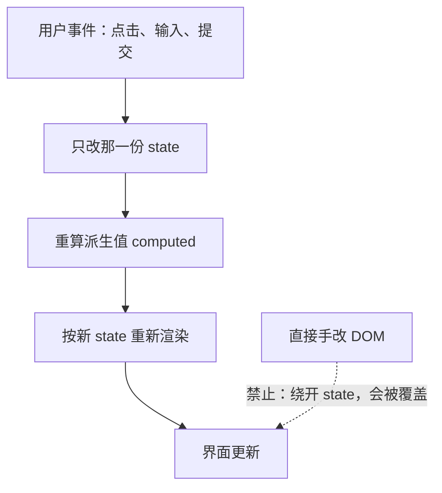
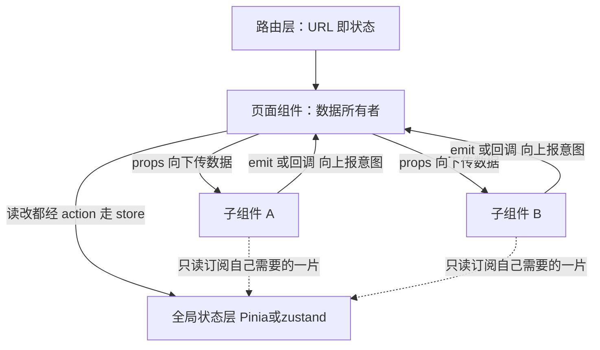
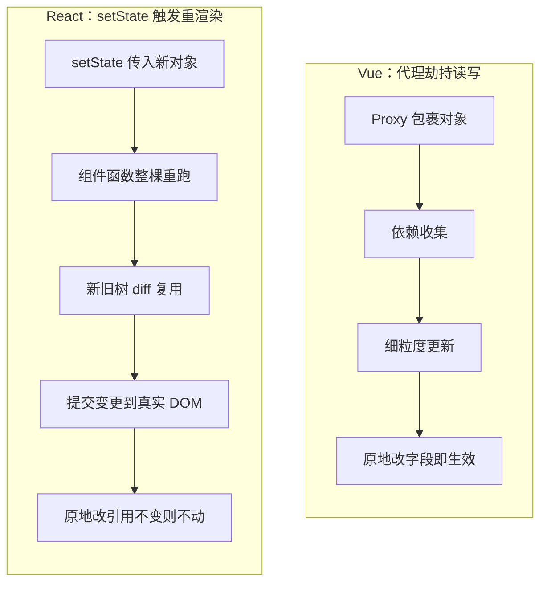

# 模块七 组件化与框架

> **一句话**：把界面写成"状态的函数"（UI = f(state)），用组件拆分复杂度、用单向数据流约束"谁来改数据"，再挑 Vue 3 或 React 19 一条路线，把它落成能跑、能测、能维护的工程。
> **自学时长**：建议 13 小时（可分 4–5 次学完） · **前置**：模块四 JavaScript 语言核心、模块五 浏览器原理与运行时、模块六 前端工程化
> **学完你能**：
> - 用"改界面之前先问是哪份状态变了"这条判据，排查界面不更新的问题；
> - 判断一段代码有没有违反单向数据流，并指出那份数据该由谁持有；
> - 用一条路线（Vue 3 或 React 19）独立交付一个"列表 + 筛选 + 详情"小应用，四种请求态齐全、列表 key 正确、筛选逻辑被两处复用。

## 1. 心智模型

在 M4–M6 里你写的是"把 DOM 当画布"的代码：`document.querySelector` 找元素、`innerHTML` 改内容、手工绑事件、手工清理节点。页面小的时候没问题，可一旦做到"表格 + 筛选 + 分页 + 弹窗"，同一份数据就会同时出现在五个地方——改一处、漏四处。这不是手笨，是这种写法的**信息流向本身就是散的**：谁来同步、什么时候同步，全压在人身上。

行业解决这件事花了十几年，有三条线索贯穿始终：**声明式取代命令式；组件化取代页面级脚本；单向数据流取代散乱的双向修改**。几条可核实的里程碑：AngularJS 起于 2009 年 Google 内部、2011 年发布首个正式版，让很多人第一次接受"在 HTML 里声明式地写绑定"；React 由 Jordan Walke 提出，2013 年 5 月 29 日在 JSConf US 首次公开，当时最刺眼的争议是 JSX——把类似 HTML 的语法写进 JavaScript，被大量人认为方向错了，今天回头看，被质疑的恰恰是它最核心的那句话"界面就是数据的函数"；Vue 由 Evan You 于 2014 年 2 月发布，做成"可以先在一片区域用、再慢慢扩到整个应用"的渐进式方案；2019 年 2 月 React 引入 Hooks，逻辑终于能按"用途"而不是按"生命周期"来组织；2020 年 9 月 Vue 3 用代理重写响应式并给出组合式 API；2024 年 12 月 React 19 发布并稳定 Server Components。

本模块的全部内容，就是把这三条线索挂到下面这张框架上。



> **图 1（全貌图）**：UI = f(state) 的数据流——事件只负责改状态，界面是状态重新算出来的结果，全程没有任何一步需要手工去碰 DOM。
> **这张图在说什么**：改界面的唯一合法入口是"改状态"。虚线那一支「直接手改 DOM」必须避免，它和"把同一份数据在组件里再存一份"是同一个病根——界面出现了两个真相，谁覆盖谁不可预测。

围绕这张图，本模块的知识点分成四层：**机制层**（2.1–2.3：UI = f(state)、单向数据流、key）两条路线共用；**语法层**（2.4–2.5 是 Vue 线，2.6–2.7 是 React 线）；**对照层**（2.8：同样是"发现数据变了"，两条线用了两套机制）；**工程层**（2.9–2.10：路由、状态管理选型、请求四态、性能边界与设计一致性）。看完这张图，你就知道后面每一节该往哪儿挂了。

## 2. 精讲（按节推进）

**先决定怎么走。** 本模块是全书学时最多、最饱的一块，两条主要路线摆在面前，你不需要两条都学到深。

- **只跟一条线（多数自学者该选这条）**：读 2.1–2.3（机制层，两条线共用）→ 读你选定的那条（Vue 走 2.4–2.5，React 走 2.6–2.7）→ 读 2.8–2.10（工程层）→ 做 §4 动手一、二、四，把另一条线只当"对照精读 + 差异清单"。**怎么挑**：想让模板和你在 M2/M3 练出的 HTML/CSS 直觉直接接上，选 Vue 3；更愿意"一切皆 JavaScript"、且乐意接受不可变更新与 Hooks 规则，选 React 19。
- **两条都学**：2.1–2.3 → 2.4–2.5（Vue）→ 2.6–2.7（React）→ 2.8。**先 Vue 后 React 的理由**：Vue 的"改数据即更新"更贴近直觉，先建立直觉、再学 React 的"换对象才更新"，正好形成一正一反的对照；顺序反过来也成立，但学 Vue 时要主动放下不可变更新的习惯。两条都学时，§4 动手一、二两条线都做，动手四挑一条线做透。

> 这条路径取舍是我的编排判断，不是官方规定，理由写在 §7。

### 2.1 从手改 DOM 到 UI = f(state)  ⏱ 约 50 分钟

**白话定义**：UI = f(state) 的意思是——"界面长什么样"是"数据是什么样"的函数；数据是输入，界面是输出，你想改界面，就去改数据。

- **命令式**：我自己找元素、自己改、自己负责"改全了"。**声明式**：我只声明"数据是什么样，界面就该是什么样"，改数据，由框架负责把界面同步过去。
- 由此推出三个必然结果：① 想改界面，先改数据；② 同一份数据不该在代码里存两份（状态冗余是 bug 温床）；③ 渲染过程应该是纯的——同样的输入得到同样的输出。
- **怎么用**：页面上一旦"某处数字/文本和列表对不上"，先别怀疑渲染逻辑，先问"这背后是哪份状态变了、是不是我漏改了状态"。答不出来，就是写法出了问题。
- **哪里会错**：在声明式组件里继续写 `document.querySelector` 去改 DOM（框架下一次重渲染会把它覆盖回去）；把"当前筛选关键词"这类临时状态存在模块级变量里而不是 state 里，界面当然不动。

> **自检**：原生写法里"删掉一项后计数不对"，是哪个函数写错了？（答案：不是某个函数错，是"同步责任被摊给了人"——声明式里计数由 `list.length` 现算，根本不存在"忘了同步"。）

### 2.2 组件化与单向数据流  ⏱ 约 45 分钟

**白话定义**：组件 = 一个可复用的界面单元 + 一份明确的对外契约（接收什么 props、发出什么事件、要不要插槽 / children）。

- **拆分原则**：先按"职责"拆，不按"格子"拆。判断标准是"这个组件能不能单独说清楚它是干什么的、能不能单独测"。
- **单向数据流的铁律**：数据只能从父组件往下传（props），子组件想改数据只能往上发事件（emit / 回调函数），由**数据的所有者**去改。
- **为什么不是双向**：如果谁都能改，那"谁在什么时候改的"就查不出来，调试成本随组件数一路飙升。
- **怎么用**：拿到一个"筛选框"组件，先问"这个关键词谁需要"——如果列表页也需要，就放共同父组件；如果只有它自己用（比如临时输入草稿），可以放它内部，但仍要通过事件把"最终值"报上去。
- **哪里会错**：直接改传入的对象（Vue 里 `props.obj.x = 1`，能跑但违约）；用 `watch` 把父数据抄一份进子组件局部变量，形成双份真相；事件命名混乱——在 Vue 里用 `@click` 代替自定义 `emit`，把子组件变成"只会点按钮的壳"。



> **图 2**：组件树与单向数据流——数据从父组件往下走（props），要改数据的意图从子组件往上报（emit / 回调），最终由数据的所有者执行修改。
> **这张图在说什么**：路由层在组件树之上，它管的是"当前是哪一页、参数是什么"（URL 即状态）；全局状态层在页面组件之上、生命周期长于任一棵组件树，跨页面共享的数据（登录用户、主题、购物车）住在这里，子组件只读订阅、不径直改写。

> **自检**：子组件为什么不能直接改 props？（答案：props 是父组件数据的引用，改它等于越权改别人的状态，会破坏"谁拥有谁修改"；在 React 里 props 只读，直接改会静默失效。）

### 2.3 条件与列表渲染：key 是身份  ⏱ 约 35 分钟

- Vue 用 `v-if` / `v-show` / `v-for`；React 用三元、`&&`、`map`。
- **白话定义**：`key` 不是"给框架看的编号"，而是**列表项的稳定身份**。框架靠 key 判断"这一项还是不是上一轮的那一项"，从而决定复用哪个组件实例、保留哪份内部状态。
- **怎么用**：列表会增删或重排时，key 必须是随数据走的业务 id。key 只需**在同一父节点的兄弟之间唯一**，不要求全局唯一。
- **哪里会错**：用索引当 key，列表前插或重排时身份错位，出现"输入框里的字跟着换行跑""动画播错元素""组件状态张冠李戴"；用 `Math.random()` 当 key，每轮渲染全变，等于每轮把所有组件重建一遍，焦点与状态全丢；忘记写 key，把控制台警告当成噪音忽略。

> **自检**：什么时候可以用索引当 key？（答案：当列表**只追加、不重排、不删除、每项没有内部状态**时，索引恰好稳定，勉强可接受；只要不满足任一条，就必须用业务 id。）

### 2.4 Vue 路线（上）：SFC、ref 与 reactive、computed 与 watch  ⏱ 约 55 分钟

- **单文件组件（SFC）**：`<script setup>` / `<template>` / `<style>` 三块，一个文件一个组件，编译期拆解（Vite 8.3.1 用 esbuild 0.28.2 快速转译，sass 1.105.1 处理样式预处理）。
- **ref 与 reactive 的分工**：`ref` 能包裹任意值（读的时候要写 `.value`），`reactive` 只能包裹对象且**不能整体替换**；`reactive` 一旦解构就会丢响应性——这是本模块必须自己动手验证一次的坑。
- **computed 与 watch**：`computed` 是派生值——有依赖追踪、有缓存、只做纯计算、不写副作用；`watch` / `watchEffect` 是副作用——因为值变了要去做别的事（发请求、存本地、同步标题）。一句判据：**"算出一个值"用 computed，"因为值变了去做事"用 watch。**
- **常用指令**：`v-bind`（`:src`）、`v-on`（`@click`）、`v-model`（表单双向糖）、`v-if` / `v-show`、`v-for`。
- **怎么用**：默认用 `ref`——它能包基本类型、能整体替换、传递时不丢引用；`reactive` 留给"天生就是一组固定字段、并且绝不解构"的局部状态。
- **哪里会错**：解构 `reactive` 后界面不更新，误以为是"Vue 的 bug"；忘了 `.value`（或在模板里多写了 `.value`）；在 computed 里改别的状态，引发循环更新；用 `watch` 去实现本可以直接算出来的派生值，代码又绕又容易不同步。

```js
// 仅示形态（演示用，不是可提交代码）
const state = reactive({ list: [] });
const { list } = state;          // ❌ 解构：丢响应性
const listRef = ref([]);         // ✅ ref：整体替换也安全
const kw = ref('');
const filtered = computed(() => listRef.value.filter(i => i.name.includes(kw.value)));
```

> **自检**：`computed` 里能不能发请求？（答案：不能。它应是纯计算、可能在渲染中被多次求值；发请求属于副作用，放 watch 或事件处理里。）

### 2.5 Vue 路线（下）：props 与 emit、插槽、生命周期、组合式函数  ⏱ 约 50 分钟

- `defineProps` / `defineEmits` 是组件的出入口契约：props 的命名、类型与默认值要写在定义处，别用注释代替校验。
- **插槽**：默认插槽做"内容占位"，具名插槽做"多个可填区域"，作用域插槽把子组件的数据反向提供给父组件的模板使用——注意，这是模板层面的数据传递，不违反单向数据流。
- **生命周期**：`onMounted` 做初始化（订阅、拉取、测量 DOM），`onUnmounted` **必须**做对称清理（解绑事件、取消定时器、中断请求），`onUpdated` 慎用。
- **白话定义**：组合式函数（composable）是以 `use` 开头的函数，内部可以拥有自己的响应式状态与生命周期，返回可用的状态与方法。它是 Vue 侧的"逻辑复用单元"，用来替代 mixin。
- **怎么用**：**谁挂谁摘**——在哪个 composable 或组件里 `addEventListener`，就由它在 `onUnmounted` 里对称地 `removeEventListener`，不要指望别人。
- **哪里会错**：组件卸载后定时器还在跑，回调里改已销毁组件的状态；把 composable 写成"必须按固定顺序调用、且只能调一次"，那其实是伪装成 composable 的普通工具函数；props 只写名字不写类型与默认值，组件被误用时静默出错。

> **自检**：组合式函数和普通工具函数的区别是什么？（答案：composable 内部可以用 `ref`、`computed`、生命周期钩子，因此它有自己的响应式状态与挂载 / 卸载时机；普通工具函数不能。）

### 2.6 React 路线（上）：JSX、useState 与不可变更新、受控组件  ⏱ 约 55 分钟

- **JSX** 是 `createElement` 的语法糖：属性写 `className`、表达式用 `{}`、必须有单一根（或用 Fragment 包起来）、注释写法与 HTML 不同。
- **白话定义**：React 的状态是**不可变**的——改数组 / 对象必须返回新对象（`[...arr]`、`{...obj, x: 1}`、`map` / `filter`），因为 React 靠**引用比较**判断"变了没有"。这是与 Vue 最大的体感差异。
- **函数式更新**：`setCount(c => c + 1)`——当新值依赖旧值时用它，避免闭包拿到过期值。
- **受控组件**：输入框的 `value` 来自 state，`onChange` 更新 state，state 是唯一真相。非受控用 `useRef` 读 DOM 值，但表单校验逻辑放 state 里更可测。
- **表单校验**：把"校验结果"做成派生值（每次渲染现算），不要另外存一份 `isValid` state 再手工同步。
- **哪里会错**：直接 `state.arr.push(...)`、`state.obj.x = 1` 之后再调 setter（引用没变，界面不动）；深层对象只做浅拷贝却改了内层，导致 memo 失效或另一处引用被连带改掉；把校验结果存成第二份 state 用 useEffect 同步，造成时序错乱。

```jsx
// 仅示形态（演示用，不是可提交代码）
const [list, setList] = useState([]);
list.push(newItem);              // ❌ 同一个数组引用，React 认为没变
setList([...list, newItem]);     // ✅ 新引用
setList(prev => prev.filter(i => i.id !== id)); // ✅ 函数式更新
```

> **自检**：`setCount(count + 1)` 连写三次会加几？（答案：加 1。三次读到的都是同一个渲染闭包里的旧 count；要改成函数式 `setCount(c => c + 1)` 三次才能得到 +3。）

### 2.7 React 路线（下）：useEffect 与清理、useRef、memo 边界、Context 与 Hooks 规则  ⏱ 约 55 分钟

- **useEffect 的心智模型**：它不是"生命周期"，而是"把渲染结果同步到外部系统"。副作用（订阅、请求、DOM 操作、日志）放这里，渲染函数里必须保持纯净。
- **清理函数**：`useEffect` 返回的函数会在下次执行前与卸载时各调一次，用来撤销上一次的副作用。**请求的清理就是"声明这次请求已作废"**，这是消除竞态的标准做法。
- **useRef**：跨渲染保存值但不触发渲染（计时器句柄、DOM 引用、上一次的值）。
- **useMemo / useCallback**：只在"确有性能证据"时使用。它们有内存与依赖比对成本，加错依赖反而引入 bug——默认先不加。
- **Context 与 useReducer**：Context 传的是"低频率变化的全局型数据"（主题、当前用户、语言）；useReducer 适合状态转移复杂、需要集中描述"有哪些动作"的场景。
- **Hooks 规则**：只能在组件或自定义 hook 的顶层调用，不能放进条件、循环里——因为 React 靠调用顺序匹配状态槽位。
- **useTransition**：把"不急的更新"标成可打断，让输入保持顺滑。
- **哪里会错**：用 `useEffect` 去"同步两个 state"，而不是把一个改成派生值；依赖数组写空 `[]` 却使用了外部变量，拿到过期闭包；在渲染函数里直接发请求 / 改 DOM / 写日志；把 Hooks 写在 `if` 里，或自定义 hook 忘了加 `use` 前缀。

> **自检**：既然 memo 能省渲染，为什么不默认全加？（答案：memo 的比较本身有成本，而且会掩盖"父组件传了不稳定引用"的真实问题；应先修数据流，再按测量结果决定加不加。）

### 2.8 两条线合流：代理追踪 vs 引用比较  ⏱ 约 40 分钟

- **Vue**：用 `Proxy` 包裹对象，**读的时候记依赖、写的时候通知**用到它的地方（细粒度追踪）。所以你写 `state.list[0].name = 'x'` 是有效的，界面会自动更新。
- **React**：不追踪你的写操作，只比较"这次渲染返回的树"和上次的差异（虚拟 DOM 比较 + 引用比较）。因此你必须**用新对象替换旧对象**来"告诉"React 变了。
- **一句话对照**：**Vue 你改数据它自己发现；React 你换对象它才知道。**这两边所有看起来矛盾的写法差异，都由这一点解释。
- **边界澄清**：两条线都要求"数据是唯一真相"；差别只在"变更的传播方式"，不在"要不要组件化"。
- **哪里会错**：把 React 的不可变更新习惯带到 Vue，多写一堆无意义的拷贝；把 Vue 的直接修改习惯带到 React，界面不更新；认为 React 比 Vue "慢"——差别在更新范围与调度策略，多数业务页面的瓶颈在别处（见 2.10）。



> **图 3**：两条路线的响应式机制对比——Vue 用 Proxy 劫持读写、按依赖细粒度更新；React 用 setState 换引用触发组件函数重跑，再 diff 出新树。
> **这张图在说什么**：两条链路都要求"数据只有一个真相"，差别只在**变更怎么被发现**：Vue 原地改字段就生效（但改 props、解构 reactive 依然违约）；React 原地改 state 会因引用没变被判为"没变"而界面不动，必须 `setObj({...obj, x: 1})` 这样换引用——这就是"Vue 改数据、React 换对象"的全部由来。

> **自检**：React 里为什么不能直接改数据？（答案：React 不做依赖追踪，只能靠引用变化判断；直接改引用不变，它认为什么都没发生。）

### 2.9 路由与状态管理选型  ⏱ 约 45 分钟

**路由解决的问题就是"URL 即状态"**：刷新能回到同一页、能分享链接、能后退前进。

- `vue-router 5.3.1` 与 `react-router 8.4.0` 的对应概念：路由表 / 嵌套路由（父级布局 + `<Outlet>`）、动态参数（`/user/:id`）、查询参数（`?kw=`）、编程式导航。
- **导航守卫**做登录拦截：判断"是否有登录态"，没有就重定向到登录页，并把原目标地址带上（登录后跳回去）。守卫里**只读判断、不做重活**，登录态应在应用启动时取一次并放进状态。
- **路由懒加载**：按路由拆包，首屏只下必需的代码，用动态 `import()` 实现。边界优先放在路由级，其次才是大体积、非首屏必需的组件（图表、编辑器）。
- **三类数据先分清**：**局部状态**（一个组件自己用）、**跨组件共享状态**（同一子树内，用 props / 事件或 Context 解决）、**全局应用状态**（多页面共享、生命周期长于某棵组件树，如登录用户、购物车、主题）。
- **上全局状态库的三个信号**：① 相距很远的组件要用同一份数据；② 这份数据要在路由跳转之间存活；③ 多个组件都要"改"它，且改动逻辑最好集中管理。**不满足就别上。**
- `Pinia 4.0.3` 在 `defineStore` 里分 state / getters / actions 三块，天然融入 Vue 响应式；`zustand 5.0.15` 用 `create` 定义一个 store，组件用选择器按需订阅、按需重渲染。共同纪律：store 里放"数据与数据操作"，不放 DOM 与请求实例细节；组件从 store 取"自己需要的那一小片"，避免整店订阅。
- **哪里会错**：一上手就装全局状态库、把弹窗开关和输入草稿也塞进去；在组件里直接改 store 的 state 字段（绕过 action），改动来源不可追踪；把请求函数、路由跳转也写进 store，造成耦合与难以测试。

> **自检**：一个只在列表页用的筛选条件，要不要放全局 store？（答案：不要。它只在那一页活着，放路由查询参数或页面局部状态更合适，还能分享链接。）

### 2.10 请求四态、性能边界与设计一致性  ⏱ 约 50 分钟

- **请求状态机**：任何一次远程请求，界面上都有四种形态——**加载中 / 成功（有数据）/ 成功但为空 / 失败**。只写前两种，就会出现"空列表看起来像还在加载""失败看起来像永远转圈"。
- **竞态**：快速切换条件时旧响应后到，覆盖新结果。做法是给每次请求编号或使用 `AbortController`，只接受"最新那次"的结果。
- **缓存与去重**：把"最近一次相同参数的请求结果"复用一小段时间；同一数据不要在多个组件里各请求一遍（提取到上层或共用缓存层）。
- **表单校验**：即时校验与提交校验分开；错误信息挂在字段上而不是整个表单；提交中禁用重复提交按钮。
- **性能**：渲染函数要保持"轻"——不要在里面做重计算、发请求、读布局属性。重活放到 computed / useMemo / 事件处理里。**性能排查顺序是"先测量、后优化"**：先用 DevTools Performance 录制找到真正的瓶颈（按 `F12` 打开开发者工具 → 按 `Ctrl+Shift+P` 打开命令菜单，输入 `Performance` 回车 → 录制一次操作 → 看火焰图里最宽的那条），再决定手段，不要凭感觉加 memo。
- **memo 的适用边界**：① 组件渲染成本确实高；② props 引用稳定（不稳定就先修上游）；③ 出现在频繁更新的父组件下。三者不满足，加了也没收益。
- **设计一致性**：颜色、间距、圆角、字号、交互态（hover / active / disabled / focus）应来自**同一套设计令牌**，而不是各组件各写一个色值。Tailwind CSS 4.3.3 通过主题变量维护令牌；自建组件库则把令牌导出为 CSS 变量。一致性不是为了好看，是为了降低认知成本与审查成本。
- **哪里会错**：在渲染里 `list.sort()`（原地改数组，还每次重算），引发顺序漂移与额外渲染；只优化"看起来慢"的地方、优化完没有前后对比数据；每个组件自己定义颜色与间距，最终全站十几种"差不多的蓝"。

> **自检**：空数组和"还没加载完"在界面上应该长得一样吗？（答案：不能一样。空态要明确告诉用户"这里确实没有内容"并给出下一步动作，加载态要给进度感。）

## 3. 关键概念讲透

下面五个点最容易"以为自己懂了"，逐个拆：先看你可能怎么误解，再给正确理解，最后一个反例。

### 3.1 用了框架就不用碰 DOM 了吗

- **常见误解**："日常视图同步都由框架做了，所以 DOM 跟我无关了。"
- **正确理解**：成立的边界只是"日常视图同步不必手写"。测量的 `getBoundingClientRect`、管理焦点的 `focus()`、集成需要真实节点的第三方库、`ref` 转发，仍然必须触碰 DOM，而且应放在副作用 / 生命周期里，而不是渲染过程中。
- **反例**：在渲染函数里调 `getBoundingClientRect` 读布局，再按结果改样式——形成"读布局 → 写样式 → 再读"的同步循环，强制浏览器反复重排。正确做法是把测量放到 `onMounted` / `useEffect`（并可对照 MDN 的 DOM 资料理解这些 API 的语义）。

### 3.2 变更怎么被"发现"：代理追踪 vs 引用比较

- **常见误解**："Vue 和 React 只是语法不同，会写一个就会写另一个。"
- **正确理解**：差别在**变更的发现方式**。Vue 用 `Proxy` 在读写时记依赖、发通知，改字段即生效；React 不追踪写操作，靠引用比较，必须换新对象。**两边都要求单一数据源**，区别只在"变更是怎么被发现的"。
- **反例**：把 Vue 的直接修改习惯带到 React——`list.push(item); setList(list);`。引用没变，React 判定"没变"，界面不动。改成 `setList([...list, item])` 才生效。

### 3.3 副作用、清理与竞态

- **常见误解**："`useEffect` 就是挂载后执行一次的钩子。"
- **正确理解**：它是"把渲染结果同步到外部系统"。返回的清理函数在下次执行前与卸载时各跑一次；渲染本身可重复、可中断、可丢弃，所以不能夹带副作用。`computed` / `useMemo` 是纯计算、不产生副作用；`watch` / `useEffect` 是副作用，不该返回业务数据（返回函数的位置被清理占用）。
- **反例**：`useEffect` 依赖数组写空 `[]` 却用了外部关键词，快速切换时先返回的慢请求覆盖后返回的结果，界面与输入框不一致；补上作废标记或 `AbortController` 后问题消失。

### 3.4 key 是列表项的身份

- **常见误解**："key 只是用来消除控制台警告的一个编号。"
- **正确理解**：key 是稳定身份，框架靠它决定"复用哪个组件实例、保留哪份内部状态"。它解决"身份"，不解决"排序"——排序要改数组顺序，而不是改 key。key 只需在同一父节点的兄弟之间唯一。
- **反例**：做一个可前插的输入行列表，用索引当 key，在最上方插入一行——输入框里的内容会跟着位置串行，错位到别的数据上。改成用业务 id 当 key，问题立刻消失。

### 3.5 能算出来的，就不要再存一份

- **常见误解**："筛选结果、校验结果存一份 state 更方便复用，需要时再同步一下。"
- **正确理解**：凡是可以从已有状态算出来的，就现算（computed / 渲染时计算）。存两份就有了两个真相，必然要花精力同步，而同步总有漏的时候。
- **反例**：表单把 `isValid` 存成 state，再用 `useEffect` 去更新它——两处更新的时序差会让校验结果慢一帧，出现"明明填对了却提示错误"。把 `isValid` 删掉、改成每次渲染现算，逻辑变短且不再时序错乱。

## 4. 动手（自学版实验）

四个动手任务对应本模块的三组实验。没有人在旁边搭手，所以每条都给了可自测的验收标准；建议按顺序做，前一个的产物就是后一个的起点。

### 动手一：起项目、拆组件、走通单向数据流（含对照线最小实现）

- **要做什么**：
  1. 用 Vite 8.3.1 + pnpm 12.8.1 起一条**主线**项目（自选 Vue 3.5.43 或 React 19.3.0），跑通开发服务器与热更新。
  2. 准备一份本地 JSON 数据源（约 30 条，字段至少含 id、名称、分类、日期），不联网。
  3. 把页面拆成"筛选条"与"列表"两个子组件：父组件持有数据，子组件通过 props 收数据、通过事件（emit / 回调）上报"筛选条件变了""要删除哪一行"这类意图；列表渲染的 key 用业务 id。
  4. 用**另一条线**做"列表 + 筛选 + 详情"的最小可用版（样式可粗糙），并在 `README.md` 写出**两线写法差异清单（≥5 条）**，至少覆盖：状态更新方式、key、取数依赖、清理方式、订阅粒度。
- **需要什么**：Node v26.7.0、npm 11.19.0、pnpm 12.8.1；两条线的 Vite 脚手架；命令都在项目根目录执行（`pnpm install` → `pnpm dev`）。
- **验收标准**（逐条勾）：
  - [ ] `pnpm dev` 起服务，首页可见列表；按 `F12` 打开开发者工具 → `Ctrl+Shift+J` 切到 Console，无 key 缺失警告。
  - [ ] 子组件代码里搜不到对 props / 父数据的直接赋值或原地修改（Vue 侧无 `props.x =`，React 侧无 `state.arr.push`）。
  - [ ] 列表 key 是业务 id，不是索引、不是随机数。
  - [ ] README 的两线差异清单 ≥5 条，且每条能指到具体代码位置。
- **卡住了看**：§2.1–2.3（机制基础）、§2.4 / 2.6（你选的那条线的语法）、§2.5 / 2.7（契约与清理）、图 1 与图 2。

### 动手二：把筛选逻辑抽成 useItemFilter()，并被两处复用

- **要做什么**：把"关键词 + 分类 + 组合结果 + 计数"这段筛选逻辑，从页面组件抽成 `useItemFilter()`——Vue 侧是 composable，React 侧是自定义 hook。抽完后**必须有两个不同组件**（"筛选摘要"与"列表"）通过它取得同一份派生结果，不得各写一份 filter 表达式。为它写 Vitest 5.0.3 单测。
- **需要什么**：动手一的项目；Vitest 5.0.3；一条用于验证"复用彻底"的全文搜索。
- **验收标准**（逐条勾）：
  - [ ] 抽出的函数输入是"数据源与筛选条件"，输出是"筛选结果与计数"，内部不依赖任何具体组件。
  - [ ] 改一个筛选条件，"筛选摘要"里的条数与列表实际行数**始终一致**。
  - [ ] 在项目里全文搜索 `filter(`：筛选表达式只出现在 `useItemFilter()` 内部。
  - [ ] 为该钩子写的单测 ≥3 个断言，覆盖"组合筛选"与"空结果"两个用例，全部通过。
- **卡住了看**：§2.5（composable）、§2.7（自定义 hook 与 Hooks 规则）、§3.5（派生值不要另存）。

### 动手三：请求四态 + 表单校验（+ 防重复提交）

- **要做什么**：
  1. 定义统一的数据取用形态：`{ status, data, error, retry }`，`status ∈ {loading, success, empty, error}`。
  2. 把这四种形态做成一个**可复用的组件 / 区域**：加载态给进度感；空态给明确文案与"新增一条"入口；错误态给可读原因与"重试"按钮。
  3. 加一个"新建记录"表单：必填校验（名称长度限制、分类必须选）、字段级错误信息、提交中禁用按钮。
  4. 用"模拟开关"分别触发慢网络、空结果、500 错误三种情形，逐条走验收。
- **需要什么**：动手一 / 二的项目；可选 Vitest 5.0.3 + Playwright 1.63.0 做回归。
- **验收标准**（逐条勾）：
  - [ ] 模拟 500 或断网时页面显示错误态（不是无限转圈），点"重试"能恢复。
  - [ ] 空结果时显示空态文案，且与"加载中"在视觉上明确可区分。
  - [ ] 表单不填点提交：字段级错误提示出现，焦点移到第一个错误字段。
  - [ ] 连续快速点提交三次，只产生一条记录；提交失败时按钮恢复可用且输入内容不丢失。
  - [ ] （可选）有一条 Playwright 1.63.0 脚本覆盖"空态"与"错误重试"两条路径并通过。
- **卡住了看**：§2.10（请求状态机与表单校验）、§3.3（清理与竞态）。

### 动手四：性能实测对照表（先测量，后优化）

- **要做什么**：
  1. 把列表扩大到 2000 条，并在渲染路径里放一段可调的重计算（例如对每条做一次字符串拼接与过滤）。
  2. 用 Performance 录制一次筛选操作（按 `F12` 打开开发者工具 → 按 `Ctrl+Shift+P` 输入 `Performance` 回车 → 点面板左上角录制按钮 → 在页面上做一次筛选 → 停止），截图火焰图，标出耗时最长的函数。
  3. 做四组对照并记录数据：① 重计算留在渲染里；② 抽到 computed / useMemo；③ 给子组件加 memo 且每次传入新函数（预期无收益）；④ 把 key 从业务 id 改成索引，观察重排 / 前插时的更新耗时与状态错位。
- **需要什么**：动手一到三的项目（任选一条线）；浏览器 DevTools Performance 面板 + React DevTools 或 Vue DevTools。
- **验收标准**（逐条勾）：
  - [ ] 有一张对照表：四组场景 × 至少两个指标（脚本耗时、更新耗时或帧数），数值来自实测而非估计。
  - [ ] 能指出第 ③ 组为什么收益为零（props 引用不稳定），并给出修复方向（稳定引用或用更细的订阅）。
  - [ ] 第 ④ 组能复现状态错位（输入框内容串行或高亮错位）。
  - [ ] 优化后功能不退化（重跑动手三的验收项仍通过）。
- **卡住了看**：§2.10（性能边界）、§3.2（引用比较）、§3.4（key 是身份）。

## 5. 自测

### 5.1 客观题（答案与解析在折叠块里）

读代码与简答题也一并放在这里，同样给折叠答案，便于自判。

**一、单项选择**

**1.** 下列关于 Vue 与 React 响应式实现的说法，正确的是：
A. React 通过代理追踪每个字段的读写，改对象属性即可触发更新
B. Vue 通过引用比较判断数据是否变化，因此必须返回新对象
C. Vue 用代理追踪访问，直接修改对象属性即可触发细粒度更新；React 依赖引用比较，需要返回新对象
D. 两者都必须使用不可变数据才能正确更新界面
> [!success]- 答案与解析
> **C**。A 把机制说反了：代理追踪是 Vue 的做法；B 也反了，引用比较是 React 的做法；D 过头了，Vue 原地改字段就能生效，不必不可变。

**2.** 在 React 中快速切换关键词时出现"旧请求结果覆盖新结果"，下列哪种做法**不能**解决该问题？
A. 在 `useEffect` 里设一个作废标记，并在清理函数里把它置为已作废
B. 用 `AbortController` 在清理时中断上一次请求
C. 给每次请求带上递增序号，只接受序号最大的响应
D. 把请求改到渲染函数里执行，保证每次渲染都拿到最新数据
> [!success]- 答案与解析
> **D**。在渲染里发请求本身就是误区（渲染可能被多次执行、可能被丢弃），而且它并不能消除竞态，慢响应照样后到。A、B、C 都是"只认最新那次"的等效做法。

**3.** React 中连续写三次 `setCount(count + 1)`，随后渲染显示的值是：
A. count + 1　B. count + 2　C. count + 3　D. 不确定，取决于父组件
> [!success]- 答案与解析
> **A**。三次回调读到的都是同一个渲染闭包里的旧 count，写三次也只相当于写一次。要用函数式更新 `setCount(c => c + 1)` 才能得到 +3。

**4.** 关于 `key`，下列说法正确的是：
A. `key` 是给框架看的渲染序号，用数组索引最稳定
B. `key` 是列表项的稳定身份；用 `Math.random()` 生成可以保证每项都唯一
C. `key` 只需在同一父节点的兄弟之间唯一，不要求全局唯一
D. `key` 只需全局唯一，与父节点无关
> [!success]- 答案与解析
> **C**。A 错，索引是位置不是身份；B 错，随机 key 每轮都变，等于每轮全部重建；D 与 B 一样过头——唯一性的范围是同一父节点下的兄弟。

**5.** 关于"界面是状态的函数"（UI = f(state)），下列说法**不正确**的是：
A. 想改界面，先改数据
B. 同一份列表数据不能再在组件里存一份用于渲染，要用派生值
C. 为了渲染快一点，可以额外存一份 `localList` 并用手工逻辑与源数据保持同步
D. 渲染过程应当是纯的：同样的输入得到同样的输出
> [!success]- 答案与解析
> **C**。这正是"两个真相"的病根：手工同步总会漏，而且没有任何机制能保证 `localList` 与源数据一致。要快就用派生值（computed / 现算），不要复制。

**6.** 下列哪种状态**不该**放进全局状态库（Pinia 4.0.3 / zustand 5.0.15）？
A. 登录用户信息，多个页面与路由跳转之间都要用
B. 购物车内容，页头与结算页都要读写
C. 只在某一个列表页使用的筛选关键词（刷新后不要求保留）
D. 主题色，全站组件都要读
> [!success]- 答案与解析
> **C**。它只在一页内活着，放路由查询参数或页面局部状态更合适（放查询参数还能分享链接）。A、B、D 分别命中"相距很远的组件共享""跨路由存活""多个组件都要改"等信号。

**7.** 关于 Vue 的计算属性与侦听器，判据正确的是：
A. `computed` 负责"因为值变了去做事"，`watch` 负责"算出一个值"
B. `computed` 负责"算出一个值"（纯计算、有缓存），`watch` 负责"因为值变了去做事"（副作用）
C. 两者可以互相替代，用哪个都行
D. `computed` 里可以安全地发请求，因为有缓存、只会执行一次
> [!success]- 答案与解析
> **B**。A 把职责说反了；C 错，二者定位不同，不该互替；D 错，computed 应该保持纯计算，"有缓存"不代表适合发请求，副作用要放 watch 或事件处理。

**8.** 关于组件间数据流，下列说法正确的是：
A. 子组件可以直接修改传入的 props 对象，只要不改变引用就没问题
B. props 是父组件数据的引用，子组件要改数据只能往上发事件，由数据的所有者去改
C. 双向绑定比单向数据流更好，因为少写一层事件
D. 子组件若需要父数据，应该用 `watch` 抄一份到自己的局部变量里
> [!success]- 答案与解析
> **B**。A 违约，改 props 等于越权改父状态；C 错，双向绑定省的是笔误、代价是"谁改的查不出来"；D 错，抄一份就是双份真相。

**9.** 从"详情 A"直接点进"详情 B"，页面数据不刷新、仍显示 A 的内容。最可能的根因是：
A. 路由没配好，两个详情页共用了同一个路径
B. 取数只写在挂载时（`onMounted` / 依赖数组为空的 `useEffect`），而同一路由仅参数变化时组件实例会被复用
C. 浏览器的后退缓存导致页面不更新
D. 数据源接口出了问题
> [!success]- 答案与解析
> **B**。同一路由仅参数变化时，组件实例会被复用，挂载钩子不再触发，于是数据停留在 A。修法是把"取数依赖"改成路由参数，而不是"挂载一次"。

**二、判断（先判正误，再说理由）**

**10.** `computed` 里可以发请求，因为它有依赖追踪与缓存，重复求值不会重复发请求。
> [!success]- 答案与解析
> **错**。computed 应当保持纯计算、可能在渲染中被多次求值；发请求是副作用，应放 watch 或事件处理里。"有缓存"不能成为让副作用混进计算的依据。

**11.** 给所有子组件无脑加上 `memo`（或 `useMemo` / `computed`），一定能降低渲染耗时。
> [!success]- 答案与解析
> **错**。当 props 每次都是新引用时，比较必然失败，白付比较成本；应先把上游引用稳定下来，或改用更细的订阅。优化是测量结论，不是风格偏好。

**12.** 空数组和"还没加载完"在界面上可以长得一样，都显示一个转圈即可。
> [!success]- 答案与解析
> **错**。二者是请求状态机里两个不同状态：空态要明确告诉用户"这里确实没有内容"并给出下一步动作；加载态要给进度感。混在一起会让用户对着空列表一直等。

**三、填空**

**13.** 在 Vue 里，"算出一个值"（纯计算、有缓存）用 `____`；"因为值变了去做事"（副作用）用 `____`。
> [!success]- 答案与解析
> **computed** / **watch**（或 `watchEffect`）。判据就是这句话本身；两者不可互替。

**14.** React 用 `____` 判断状态有没有变，因此更新数组必须传 `____`（而不是原地 `push`）。
> [!success]- 答案与解析
> **引用比较**（大致等价于 `Object.is`）/ **一个新数组，如 `[...arr]`**。原地 `push` 后引用不变，React 判定"没变"，界面不动。

**四、读代码与分析**

**15.** 下面这段 Vue 代码界面不更新，指出原因并给出两种修法（只写关键改动）。
```js
// 仅示形态
const state = reactive({ keyword: '', list: [] });
const { keyword, list } = state;
const shown = computed(() => list.filter(i => i.name.includes(keyword)));
```
> [!success]- 答案与解析
> **原因**：解构脱离了对 `reactive` 的代理读写追踪，`keyword` / `list` 取到的是一次性的普通值。**修法一**：改用 `ref` 包 keyword 与 list（访问时写 `.value`）。**修法二**：用 `toRefs(state)` 解构，或干脆始终写 `state.keyword` / `state.list`。

**16.** 下面这段 React 代码有两处问题（一处不更新、一处泄漏），指出并说明修法要点（只给关键改动方向）。
```jsx
// 仅示形态
function List({ id }) {
  const [data, setData] = useState([]);
  useEffect(() => {
    fetch(`/api/items/${id}`).then(r => r.json()).then(setData);
  }, []);
  return data.map(d => <Row data={d} />);
}
```
> [!success]- 答案与解析
> **① 不更新**：依赖数组为空，`id` 变化不重新取数，应把 `id` 放进依赖数组。**② 泄漏 / 竞态**：缺少清理，快速切换时旧响应会覆盖新结果、并可能对已卸载组件 setState，应在清理里作废这次请求（stale 标记或 `AbortController`）。**另可指出**：`map` 渲染缺 `key`。

**17.** 下面这段（仅示形态）写完以后，点击"添加"界面有时不动。指出根因，并给出正确的关键改动；再说明这条错误与"深层对象只做了浅拷贝"有什么区别。
```jsx
// 仅示形态
const [list, setList] = useState([]);
function add(item) {
  list.push(item);
  setList(list);
}
```
> [!success]- 答案与解析
> **根因**：`push` 原地改了同一个数组引用，`setList(list)` 传的还是那个引用，引用比较判为"没变"，不触发重渲染。**关键改动**：`setList(prev => [...prev, item])`（或 `setList([...list, item])`）。**区别**：这条是"引用根本没变"，React 完全无感；浅拷贝那条是"外层换了新引用、内层还是旧引用"，React 会重渲染外层，但子组件 memo 可能因内层引用没变而跳过，或另一处引用被连带改掉。

**18.** 下面这段（仅示形态）是最常见的写法。指出问题，说明会造成什么可观察现象，并给出修法。
```jsx
// 仅示形态
{rows.map((row, index) => <Row key={index} data={row} onPick={pick} />)}
```
> [!success]- 答案与解析
> **问题**：用索引当 key。索引是位置不是身份，列表一旦前插或重排，框架会按 key 复用错位的组件实例。**现象**：行内输入框的内容、局部展开状态、动画会"跟着位置走"而错位到别的数据上；不删不插时看不出问题，一动手就串行。**修法**：改用随数据走的业务 id，`key={row.id}`。

### 5.2 动手题（不给实现，只给验收标准与评分点）

**1.** 把一段写在组件里的筛选逻辑重构为 `useItemFilter()`（Vue composable 或 React 自定义 hook，自选一线）。
- **验收标准**：① 抽出的函数输入是数据源与筛选条件，输出是筛选结果与计数，内部不依赖任何具体组件；② 至少两个不同组件通过它取得同一份派生结果，改一个筛选条件时"摘要"与"列表行数"始终一致；③ 组件代码中不再出现重复的 filter 表达式（可用全文搜索验证）；④ 有一段 Vitest 5.0.3 测试覆盖"组合筛选"与"空结果"两个用例并通过。
- **评分点**：契约清晰 30%、复用彻底 30%、行为正确 25%、测试与命名规范 15%。**本题不提供参考实现**——重构之后你要能自己讲清数据是怎么流的。

**2.** 实现"列表 → 详情"的路由跳转，并保证详情页在四种请求状态下都有正确界面。
- **验收标准**：① 直接访问 `/items/:id` 能正确渲染该条，刷新不丢；② 从详情 A 直接切到详情 B 时数据会重新获取（参数变化验收）；③ 断网显示错误态且重试有效，空数据显示空态，两者与加载态可区分；④ 未登录时被导航守卫拦到登录页，登录后回到原目标。
- **评分点**：路由与参数处理 35%、四态完整 35%、守卫与回跳 20%、代码规范 10%。**只给判据，不给实现代码。**

**3.** 针对你实验中的列表页做一次性能测量并提交对比数据。
- **验收标准**：① 给出优化前后的实测指标（脚本 / 渲染 / 帧时间任选两项，必须来自 DevTools 录制）；② 说明改动内容与为何有效；③ 若加了 memo / useMemo，须说明 props 引用是否稳定，不稳定则给出替代方案。
- **评分点**：测量方法 40%、数据与结论一致 40%、表述准确 20%。**不提供参考实现。**

## 6. 自我检查清单

逐条勾选（全部勾上，再进入下一模块）：

- [ ] 我能不看笔记说出 UI = f(state) 的含义，并举一个"界面没更新是因为状态没变"的自查例子。
- [ ] 我能判断一段代码有没有违反单向数据流，并说明谁应该持有那份数据。
- [ ] 我的项目里没有任何一处子组件直接修改 props 或父组件状态。
- [ ] 我不会再解构 `reactive` 后继续期待响应式；要解构时我知道用 `toRefs` 或改用 `ref`。
- [ ] 我所有的列表渲染都有 key，且 key 是随数据走的业务 id（不是索引、不是随机数）。
- [ ] 我写的每一个 `useEffect` / `watch` 都能说出"它的清理是什么"，且确实写了清理。
- [ ] 我能在快速切换条件时复现并修复竞态（stale 标记或 `AbortController`）。
- [ ] 我的页面有加载中 / 成功 / 空 / 失败四种界面，且断网时能给用户可操作的重试入口。
- [ ] 我能说出我为数不多的 `memo` / `useMemo` 分别解决了什么实测问题，而不是"加了感觉快"。
- [ ] 我能在 30 秒内说明当前项目里哪些状态是局部、哪些是全局，以及全局那份为什么必须全局。
- [ ] 我能把一段业务逻辑抽成 composable / 自定义 hook，并在两个地方复用它。
- [ ] 我的项目 `lint` 与 `test` 全绿，且我至少为一个自定义 hook 写了测试。
- [ ] 我能说清 Vue 与 React 在"改数据的方式"上为什么不同，而不只是背下两套写法。
- [ ] 我在评审别人的代码时，能指出至少一个响应式 / 数据流层面的隐患。

## 7. 出处与依据说明

### 有官方依据的部分

- **Vue 侧语法与机制**（§2.4、§2.5、§2.8）：单文件组件、`ref` / `reactive` / `toRefs`、`computed` / `watch`、`defineProps` / `defineEmits`、插槽、生命周期钩子、组合式函数——依据 Vue 3 官方指南（`cn.vuejs.org`），与 Vue 3.5.43 的表述一致。
- **React 侧语法与机制**（§2.6、§2.7、§2.8）：`useState` 的不可变更新、`useEffect` 与清理、`useRef`、`useMemo` / `useCallback`、`useReducer` 与 Context、`useTransition`、Hooks 调用规则——依据 React 官方学习文档（`zh-hans.react.dev`），与 React 19.3.0 的表述一致。
- **路由**（§2.9）：嵌套路由、动态参数、查询参数、导航守卫、懒加载——依据 vue-router 官方指南（`router.vuejs.org`）。
- **状态管理**（§2.9）：`defineStore` 的 state / getters / actions——依据 Pinia 官方文档（`pinia.vuejs.org`）。
- **工具链与样式**（§2.4、§2.10、§4）：Vite 8.3.1 官方指南（`vite.dev`）、Tailwind CSS 4.3.3 官方文档（`tailwindcss.com`）；Vitest 5.0.3（`vitest.dev`）、Playwright 1.63.0（`playwright.dev`）、ESLint 10.11.0（`eslint.org`）用于测试与检查。
- **DOM 相关**（§3.1）：测量尺寸、管理焦点等仍须触碰 DOM，可对照 MDN 的 Document Object Model 资料（`developer.mozilla.org`）；DevTools 面板操作（Performance、Event Listeners、Console）参照 Chrome DevTools 官方文档（`developer.chrome.com`）。
- **历史年份与事件轮廓**（§1）：见库内 [[16-技术演进时间线]]，只采用已核实的年份与事件，不补未核实的人名、论文与标准编号。
- **版本号口径**（全篇）：Vue 3.5.43、React 19.3.0、Vite 8.3.1、pnpm 12.8.1、Node v26.7.0、npm 11.19.0、vue-router 5.3.1、Pinia 4.0.3、zustand 5.0.15、Vitest 5.0.3、Playwright 1.63.0、ESLint 10.11.0、Tailwind CSS 4.3.3、esbuild 0.28.2、sass 1.105.1，均在课程版本口径内。

### 属本人编排判断（无官方依据）

- **学习路径选择**：本模块"只跟一条线怎么走（先机制层 2.1–2.3、再选定路线的 2.4–2.5 或 2.6–2.7、最后工程层 2.8–2.10）、两条都学按"先 Vue 后 React"的顺序"——这是我的编排判断，官方资料没有规定该按什么顺序学两套框架。教案里"只选一条线学透、另一条做对照精读"的取向，与我这里的建议一致。
- **建议自学时长 13 小时、分 4–5 次、以及 §2 每节的 ⏱ 分配**：教学经验估计，不是官方规定。
- **把教案中面向讲授的动作说明改写成"你应该自己动手验证的最小实验"**：这是从自学场景出发的重写判断。
- **请求四态（加载中 / 成功 / 空 / 失败）被当作统一界面契约**：一个课程工程约定，具体项目的状态命名与文案策略可以不同。
- **"上全局状态库的三信号"与"反例清单"**、**"Vue 侧默认推荐 ref 而不是 reactive"**、**"memo 先测量后优化"的纪律**、**"设计系统与组件库读同一套令牌"**的说法：都是偏保守的工程偏好与课程取舍，不是唯一正确答案。
- **动手四里的造数方式**（2000 条数据、可调重计算、模拟出错开关）：为了自学时可控、可验收而设计，与真实项目条件不同。

### 不确定项

- 本模块只涉及 Vue 3 与 React 19 两条稳定线，不涉及服务端渲染框架（如 Nuxt）与尚未发布的下一代版本。若社区路线有变化，以各官方文档为准。
- `react-router 8.4.0` 与 `zustand 5.0.15` 的官方文档站点不在本课程的链接白名单内，因此这里只写资料名称、不给 URL，需要时按名称自行检索官方站点。
- 本模块的三张 mermaid 图沿用教案里已验证的结构，为满足"标签不含裸尖括号、控制在 14 个汉字以内"的宽度纪律，把原本写在节点标签里的长句精简后移到了图注中。

## 安全视角

本模块讲「UI = f(state)」让框架接管 DOM——但**框架默认只保证「插值安全」**，每个框架都留了一个「原样输出」的口子，用了它防御就回到手工。

- 安全边界在插值：`{{ }}`／JSX 文本子节点默认转义；一旦改用 `v-html`／`dangerouslySetInnerHTML` 这类口子，前面的自动保护全部失效（§3.1）。
- 最容易出洞的场景恰恰是「需要插 HTML」的功能（搜索关键词高亮、富文本）——这类只能走**经过考验的净化器**，不要自己写过滤。
- 机制、反例与防御见 [[22-前端安全专章（OWASP × ATT&CK）]] §3.1；速查见 [OWASP XSS 防护速查](https://cheatsheetseries.owasp.org/cheatsheets/Cross_Site_Scripting_Prevention_Cheat_Sheet.html)。

---

上一篇：[[06-模块六 前端工程化]] · 下一篇：[[08-模块八 网络与数据]] · 本模块教师版：[[07-教案 M7 组件化与框架]]
