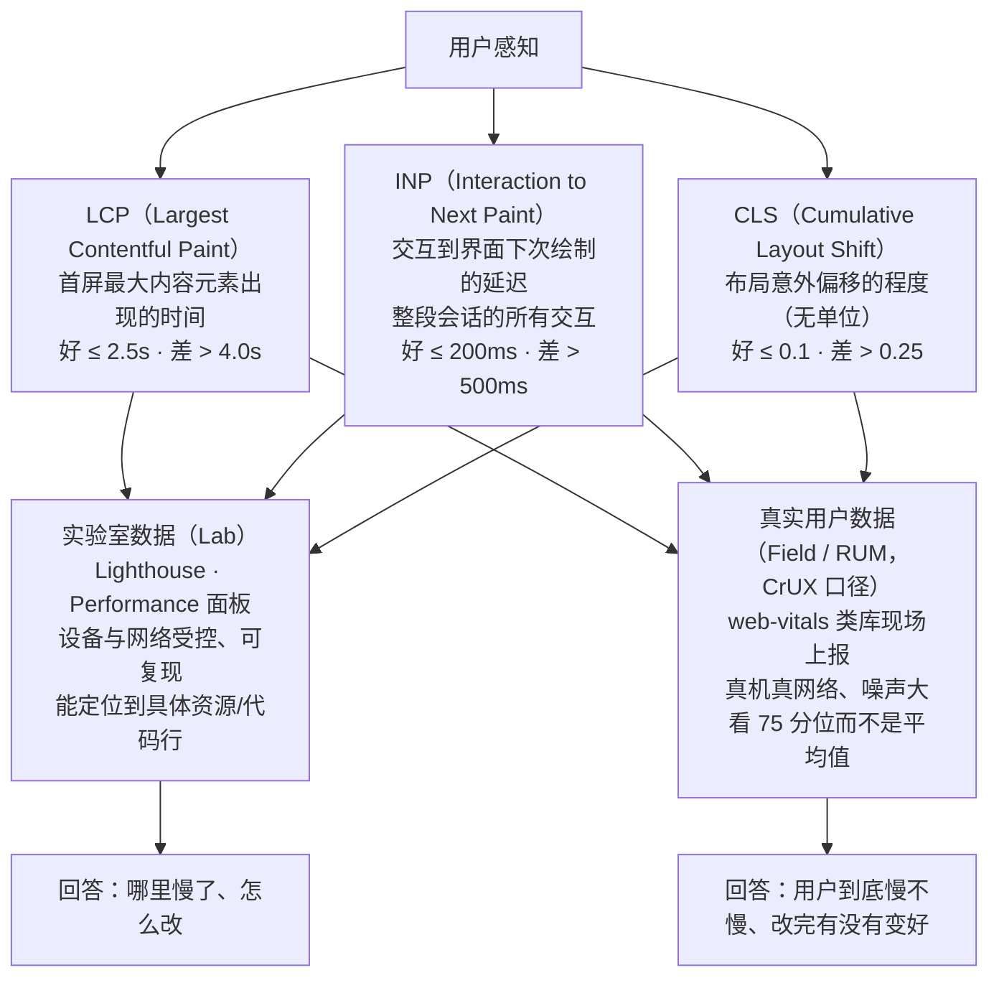
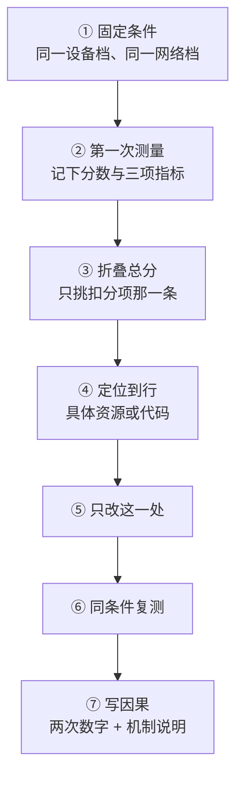
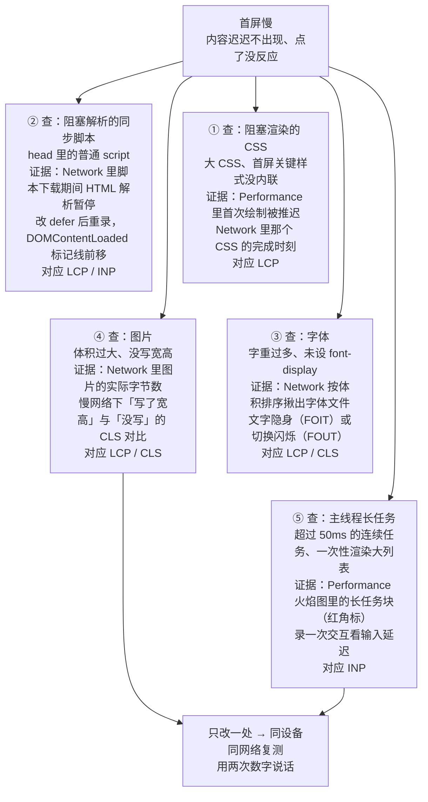
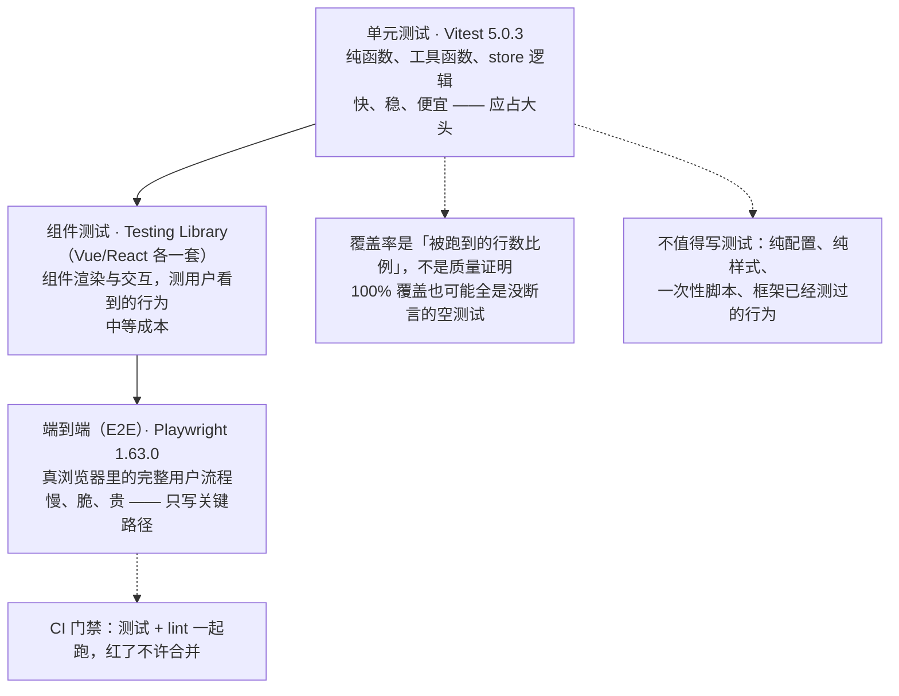

# 模块九 性能可访问性测试与部署

> **一句话**：前八个模块解决「做不做得出来」，本模块解决「做出来之后——快不快、人人用不用得上、坏了知不知道、上不上得去」。
> **自学时长**：建议 9–10 小时（可分 4 次学完：① 指标与测量 ② 优化手段 ③ 可访问性 ④ 测试与部署） · **前置**：模块六 前端工程化、模块七 组件化与框架
> **学完你能**：
> - 独立跑完一次性能体检：按「改前 → 定位到一个具体资源或代码行 → 只改这一处 → 改后复测」用两次数字说明改动有效，而不是只截一张总分；
> - 让页面过一轮可访问性基线：只用键盘走通关键流程、控件的语义与念法正确、正文对比度达标；
> - 给纯逻辑函数写出**会变红**的单元测试，用真浏览器跑一条端到端流程，把产物部署到公网、配好深层路由回退，并在手机非本机网络下验证通过。

---

## 1. 心智模型

先把这九个模块的位置摆正：前面所有工作都在回答「**能不能做出来**」，从本模块起回答的是四个上线问题——

1. **快不快**：用户有没有等太久？指标是 LCP / INP / CLS。
2. **人人能不能用**：只用键盘、用屏幕阅读器的人能不能走通？口径是 WCAG 与语义化。
3. **坏了知不知道**：改动有没有回归？靠测试金字塔与 CI 门禁挡住。
4. **上不上得去**：产物怎么托管、刷新深层路由会不会 404、出问题能不能回滚、密钥有没有漏。

这四问对应本模块八节内容，而它们共享同一条纪律：**先测量、再优化、改完再测量**。没有数字的优化不算优化，只是换了一种写法。

还有一条贯穿全模块的口径要提前记住：**指标是用来替用户说话的；当指标说不清用户感受时，指标本身就该被换掉。** Core Web Vitals 里有一项指标原本只测「第一次交互的延迟」（FID），后来发现它漏掉了「页面越用越卡」这种更常见的情况，于是被改成测**整段会话所有交互**延迟的新指标（INP），旧的就此淘汰。你在网上还会看到大量讲 FID 的教程——一律按过时处理。这一段不用记年份与人名，要记的是这个思路。

图 1 把三项指标和两类数据源挂在一张图上，这是本模块后面的总纲。



> **图 1**：用户感知 → Core Web Vitals 三项 → 实验室数据与真实用户数据两条取证路。
> **这张图在说什么**：三项指标各管一种感受，互不替代——LCP 管「内容多久出现」，INP 管「点了多久有反应」，CLS 管「画面稳不稳」。而同一个指标有两条取证路：实验室数据（Lighthouse、Performance 面板）用来回答「**哪里**慢了、怎么改」，现场数据（`web-vitals` 类库上报）用来回答「**用户**到底慢不慢、改完有没有变好」。缺了后者，你只能在实验室里自我感觉良好。

---

## 2. 精讲（按节推进）

### 2.1 性能是功能需求：LCP / INP / CLS 三项  ⏱ 约 40 分钟

**一句话定义**：Core Web Vitals 是浏览器与搜索平台共同采用的一组**以用户感知为中心**的性能指标，当前有三项。

先立一个判断：**性能不是「优化到极致」的锦上添花，而是上线门槛。** 页面加载慢、点了没反应、画面乱跳，功能就等于没交付——用户不会因为你代码架构漂亮就多等三秒。

三项指标分别在说什么、阈值是多少（这套阈值必须记准，不能自己编）：

| 指标 | 衡量什么 | 好 | 需改进 | 差 |
|---|---|---|---|---|
| LCP（Largest Contentful Paint） | 首屏最大内容元素出现的时间 | ≤ 2.5s | 2.5–4.0s | > 4.0s |
| INP（Interaction to Next Paint） | 交互到界面下次绘制的延迟（整段会话所有交互） | ≤ 200ms | 200–500ms | > 500ms |
| CLS（Cumulative Layout Shift） | 布局意外偏移的程度（**无单位**） | ≤ 0.1 | 0.1–0.25 | > 0.25 |

三个容易记错的地方，先钉住：

- INP 的单位是**毫秒**，量级在百毫秒（200ms），不是秒；把 200ms 记成 2s 是常见错误。
- CLS 是**无单位**的比值，不是毫秒，0.1 与 0.25 这两个数才是它的档位。
- 三项**互不替代**。一个页面 1.8 秒就把内容显示出来了（LCP 很好），但点按钮要 1 秒才反应（INP 很差）——这是完全可能同时发生的，因为两项测的根本不是同一件事。

再看 FID 为什么被淘汰：FID 只测**第一次**交互的输入延迟。第一次交互通常发生在页面刚加载完、一切还轻的时候，所以它经常很好看；而用户真正的抱怨是「用着用着越点越卡」。INP 覆盖**整段会话中的所有交互**，并且取一个有代表性的值，能反映后半程的状态，因此取代了 FID。**网上还在讲 FID 的教程，一律按过时处理。**

最后一条纪律：阈值不是永恒真理，它们是「当前口径的快照」。**引用前先看该页当前的值**，别把某一天的数值当公理。

> **自检**：某页面 LCP 为 1.2s，但你点按钮后 800ms 才有反应。它的 Core Web Vitals 算好吗？
> 答：不算。LCP 好只说明内容出现得快；INP 800ms 已经落在「差」（> 500ms）区间，用户会直接抱怨「点了没反应」。三项必须分开看。

### 2.2 怎么测量：实验室数据 vs 真实用户数据  ⏱ 约 50 分钟

**一句话定义**：实验室数据（Lab）是在你设定的设备与网络下跑出来的数据，真实用户数据（Field / RUM）是真实访客的页面里采集上报的数据。两者回答的问题不同。

| 维度 | 实验室数据（Lab） | 真实用户数据（Field / RUM） |
|---|---|---|
| 代表 | Lighthouse、Performance 面板 | `web-vitals` 类库上报的现场数据 |
| 环境 | 受控（你设定设备档、网络档） | 五花八门的真机、真网络 |
| 优点 | 可复现、能定位到具体资源 / 代码行 | 反映真实人群，能发现你测不到的慢 |
| 缺点 | 不反映真实分布，容易「自我感觉良好」 | 噪声大、难定位、需要样本量 |
| 回答的问题 | 「**哪里**慢了、怎么改」 | 「**用户**到底慢不慢、改完有没有变好」 |

一句纪律：**没有测量数据的优化等于没做。**「我觉得这样更快」不是证据，两次数字之间的差才是。

现场数据要看**分位数**（如 75 分位）而不是平均值：平均会被「一半极快、一半极慢」的分布骗过去，分位数更贴近「大多数用户」的体验。

#### 操作一：打开开发者工具并跑一次 Lighthouse

1. 在 Chrome 或 Edge 里打开你要测的页面（本地开发服务器、线上站点都可以）。
2. 按 **`F12`** 打开开发者工具；也可以按 **`Ctrl+Shift+I`**，两者等价。窗口出现在页面右侧或下方。
3. 看开发者工具的**顶部标签栏**：Elements、Console、Sources、Network、Performance、Application、Lighthouse……如果宽度不够，最右边有个 **`»`**（更多）按钮，点开就能看到被折叠进去的面板，Lighthouse 常常藏在这里。
4. 点 **Lighthouse** 标签，进入审计面板。面板上有三处要先确认：
   - **Mode**：默认 `Navigation`（导航模式），测一次完整页面加载，本模块用这个就够。
   - **Device**：`Mobile`（手机档）或 `Desktop`（桌面档）。**前后两次必须选同一档**，否则数字不可比。
   - **Categories**：勾选框列出 Performance、Accessibility、Best Practices、SEO。第一遍至少勾 Performance；做可访问性时再勾 Accessibility。
5. 想减少波动，点面板右上角的**齿轮（设置）**图标，可以开 Clear storage（清掉本地缓存再来）等选项。
6. 点 **Analyze page load** 按钮，等十几秒到几十秒，报告直接显示在面板里。
7. **报告怎么看**（这是本模块最关键的一步）：顶部是各项的总分。**第一件事是把总分区折叠起来、先别看**，直接往下找 **Opportunities**（机会）和 **Diagnostics**（诊断）两栏。这两栏里每一条就是一条扣分项，后面写着预计能省多少时间或多少字节。点开某一条右侧的箭头，它会列出**受影响的资源清单**，点资源名可以跳到那条请求或那段源码——「定位到具体一行」说的就是这个动作。

**一个必须养成的习惯**：报告交出来的东西不能只有「总分 62」，必须是「**扣分项 + 它指向的资源/代码行**」。说不出后半截，等于没测。

#### 操作二：用 Performance 面板看长任务

1. 按 `F12` 打开开发者工具，点顶部 **Performance** 标签。
2. 面板左上角有一个**圆形录制按钮**，也可以直接按 **`Ctrl+E`** 开始录制（再按一次 `Ctrl+E` 停止）。
3. 开始录制后，在页面上做一次真实交互（点击、输入、展开列表），然后按 `Ctrl+E` 停止。
4. **看哪一栏**：结果页从上到下是——顶部几条概览线（CPU、网络）；中间的 **Main** 轨道，横轴是时间，每个方块是一个任务；最底部是 Summary 与详情。
5. 在 Main 轨道里找**带红色小三角角标的方块**——那是长任务（占用主线程超过 50ms 的连续任务）。鼠标悬停可以看到它耗时多久；点中它，底部会显示这段时间里哪个函数、哪一行占得最多。这就是「长任务和 INP 的关系」：长任务期间主线程被占住，你的点击要排队等它跑完才轮到绘制。
6. 顺带记两个标记线：轨道上会出现 **First Contentful Paint** 和 **DOMContentLoaded** 的竖线。改完代码重录一次，看这些线有没有前移。

#### 操作三：用 Network 面板录制并找出最大的文件

1. 按 `F12`，点顶部 **Network** 标签。
2. **顺序很重要**：先让 Network 面板处于打开状态，再按 **`Ctrl+E`** 开始录制（面板左上角会出现录制中的提示），然后按 **`F5`** 刷新页面。**必须先开面板再刷新**，否则刷新时发的请求根本不会被记下来——这是新手最常白跑一遍的原因。
3. **看哪一栏**：Name 列是请求地址；Size 列是实际传输体积；Time 列是耗时；最底部状态栏显示本次共多少个请求、总共传了多少字节。
4. 点列头可以排序：点 **Size** 列头按体积从大到小排，最大的图片与字体文件立刻现形。
5. 面板上方有个筛选输入框，输入 `img`、`font`、`css`、`js` 可以只看某一类请求。
6. 鼠标悬停在某个请求的 Time 单元格上会弹出瀑布图，看清它是「等」了还是「传」了。点中请求，右侧（或下方）出现 Headers / Response / Timing 三个页签，Headers 里能看到它的缓存策略。
7. 做「改前改后对比」时，勾上面板上的 **Preserve log**（保留日志），跨刷新不丢记录；也可以用右键菜单把整次录制的请求存成 HAR 文件留档。

#### 操作四：现场数据的采集形态

实验室数据只能回答「哪里慢」。要让页面自己上报真实用户的体验，需要在页面里引入 `web-vitals` 类库，在回调里把指标上报到自己的端点（形态如下，仅示调用形态）：

```js
// 仅示形态：采集现场数据并上报，服务端再看分位数
import { onLCP, onINP, onCLS } from 'web-vitals';
const report = (m) => navigator.sendBeacon('/rum', JSON.stringify({ name: m.name, value: m.value }));
onLCP(report); onINP(report); onCLS(report);
```

上报之后，服务端要做的是**按指标统计分位数（如 75 分位）**，而不是算平均。

#### 把测量的闭环画出来

图 2 是自学者一个人也要走完的七步。它唯一的硬要求是：**一次只改一处，并且前后两次的测量条件完全一致。**



> **图 2**：一次性能体检的七步闭环——固定条件 → 第一次测量 → 折叠总分挑扣分项 → 定位到具体资源/代码 → 只改一处 → 同条件复测 → 写下两次数字与机制说明。
> **这张图在说什么**：顺序不能颠倒。「先改代码再测」得到的是两个互不可比的数字，说明不了任何因果；「改了三处一起测」即使变好了，你也说不出是哪一处起了作用。条件（设备档、网络档）在整条链上必须钉死不变。

> **自检**：为什么现场数据要按 75 分位看，而不是看平均值？
> 答：平均值会被极端分布拉平——一半人 0.5 秒、一半人 8 秒，平均出来是 4.25 秒，看着像「中等」，实际上有大量用户在受苦。分位数回答的是「大多数用户落在哪一档」，更贴近真实体验。

### 2.3 关键渲染路径：谁在阻塞  ⏱ 约 40 分钟

**一句话定义**：关键渲染路径是浏览器把 HTML 变成屏幕像素的必经链路——构建 DOM → 构建 CSSOM → 合成渲染树 → 布局（算位置尺寸）→ 绘制。**卡在这条链路上的任何资源，都会推迟「第一次有内容」的时间**，直接影响 LCP。

为什么它会阻塞？这不是浏览器的缺陷，是保证正确性的顺序约束：

- **CSS 阻塞渲染**：浏览器没有完整的样式信息时不敢画——画出来是错的，不如不画。所以它必须等 CSSOM 建好才敢上屏。
- **普通脚本阻塞解析**：脚本可能改 DOM、可能读样式，为了一致性，普通 `<script>` 会把 HTML 解析**暂停**，等它下载并执行完再继续；如果它又放在 `<head>` 里、还要等 CSS，就是雪上加霜。

注意这是**两种不同的卡点**：CSS 卡的是「渲染」，普通脚本卡的是「解析」。后面要讲的 `defer`/`async` 解决的是**解析阻塞**，它们并不会让 CSS 变快。

三种脚本写法的差别，用一张表钉死：

| 写法 | 何时下载 | 何时执行 | 执行顺序 | 适用 |
|---|---|---|---|---|
| `<script>` | 立刻（阻塞解析） | 下载完立即，阻塞解析 | 按出现顺序 | 极少用，非必要不用 |
| `<script async>` | 并行，不阻塞解析 | 下载完立即执行（**可能仍在解析中**） | **不保证顺序** | 独立、无依赖的脚本（统计、广告） |
| `<script defer>` | 并行，不阻塞解析 | **HTML 解析完成后、`DOMContentLoaded` 前** | **保证按顺序** | 需要 DOM、有依赖的业务脚本（多数首选） |
| `type="module"` | 并行 | 默认等价于 **defer** 的行为 | 保证顺序 | 现代 ES 模块，默认就该这样 |

这里有个高频误读要当场拆掉：**`defer` 不是「下载得更快」。** 它和 `async` 一样都是并行下载，二者差别只在**执行时机与顺序保证**。

CSS 那边对应的手段叫**关键 CSS**：把首屏真正需要的少量样式内联在 HTML 里，其余样式异步加载，避免一个大 CSS 文件卡住首屏。形态如下：

```html
<!-- 仅示形态：首屏关键样式内联，其余样式异步，脚本不阻塞解析 -->
<head>
  <style>/* 首屏关键样式，几行内联 */ body{margin:0;font-family:system-ui}</style>
  <link rel="stylesheet" href="/rest.css" media="print" onload="this.media='all'">
  <script src="/app.js" defer></script>
</head>
```

#### 动手验证：把阻塞看成一个暂停

1. 打开你的页面，按 `F12` → **Network** → 按 `Ctrl+E` 开始录制 → 按 `F5` 刷新。
2. 在瀑布图里找到那个普通 `<script>`，看它下载+执行的那一小段时间——HTML 解析在这段时间里是停着的。
3. 把代码里的这个 `<script src="…">` 改成 `<script src="…" defer></script>`，保存、刷新、重录一遍。
4. 对比两次的 `DOMContentLoaded` 标记线位置（Network 面板底部的时间轴，或改到 Performance 面板里看竖线）：改 `defer` 后，解析不再被这个脚本拦住，标记线会前移。

> **自检**：页面里有两个独立的 `async` 脚本 A 和 B，谁先执行？
> 答：**不确定**。`async` 不保证顺序，谁先下载完谁先执行。任何有先后依赖关系的脚本都不能用 `async`。

### 2.4 字体与图片优化  ⏱ 约 40 分钟

这一节的两个对象，恰好是 LCP 与 CLS 最常见的两个元凶。

**字体**，三件事：

- **`font-display: swap`**（或 `optional`）：字体文件还没到之前先用后备字体把文字显示出来，避免「文字隐身」（FOIT，页面一片空白）；代价是字体到了以后可能有一次形体切换（FOUT），通常比空白可接受。
- **只加载用得到的字重**：设计稿给你 5 个字重，页面往往只用得上 2 个；多出来的每一个都是首屏负担。
- **中文字体的工程约束**：常用汉字有数千个，中文字体文件体积通常是同类英文字体的**数倍到数十倍**，一个未经处理的中文字体动辄几百 KB 甚至更大，是首屏的隐形杀手。对策是**子集化**（只打包页面实际用到的字符）与按需加载，而不是整包引入。

**图片**，四件事：

- **改用现代格式**：WebP / AVIF 在同等观感下体积远小于传统格式；用 `<picture>` 或构建工具按需转换。
- **按显示尺寸出图**：手机上只显示 300px 宽的位置，不要塞一张 2000px 的大图；配 `srcset`/`sizes` 让浏览器按需挑。
- **懒加载只给首屏之外**：首屏之外的图片加 `loading="lazy"`；**首屏主图不要懒加载**，它要尽早出现才有好的 LCP。
- **必须写宽高**（`width`/`height` 属性或 CSS `aspect-ratio`）：让浏览器**提前预留**出这块空间。不写的话，图片一加载就把下面所有内容顶下去——这正是 CLS 最常见的成因。

#### 动手验证：把 CLS 看成一个抖动

1. 按 `F12` 打开开发者工具 → 按 **`Ctrl+Shift+M`** 切出 device toolbar（设备工具栏，页面上方会出现设备型号与网络档位的下拉框）。
2. 在设备工具栏里把网络档位调到慢速（如 Slow 4G / 慢速网络），让图片加载慢到能用肉眼追上。
3. 刷新页面，看图片位置的内容是不是在图片到达的瞬间「跳」了一下。这个跳就是你平时测不出来的 CLS。
4. 给图片代码补上 `width`/`height`（或 CSS `aspect-ratio`），同样条件下再刷新一次——这次位置是预留好的，不会再跳。
5. 想看数字证据：按 `F12` → **Network** → `Ctrl+E` → `F5`，点 Size 列头排序，把最大的图片与字体文件揪出来，看它们的实际字节数。

> **自检**：一张首屏主图，加不加 `loading="lazy"`？
> 答：不加。懒加载的意思是「等快滚到了再加载」，而首屏主图本来就要尽早出现，给它懒加载等于主动把 LCP 拖差。懒加载只留给首屏之外的图。

### 2.5 代码分割、预加载、缓存与主线程  ⏱ 约 35 分钟

**代码分割**：不要把整个站点的所有页面打进一个包。做**路由级懒加载**，让用户只下载当前用得到的代码——这就是你在模块六、七学的路由懒加载在性能上的落地。但也要有边界感：**拆得过碎会让请求数暴增**，不是拆了就一定更快。

**预加载**，两个指令、两种用途：

- `preload`：提前拉**当前页马上要用**的关键资源（字体、首屏大图、关键 JS）。
- `prefetch`：空闲时预取**下一步可能要用**的资源（预判用户会点的下一页）。
- 边界：预加载的本质是「**抢优先级**」。用在非关键资源上，它抢的是首屏关键资源的带宽与优先级，反而更慢。**要克制。**

**缓存与 CDN**：

- 带内容哈希文件名的静态资源（如 `app.a1b2c3.js`）→ **长缓存**：`Cache-Control: max-age=31536000, immutable`。文件名变了就是新资源，可以缓存一年。
- **HTML 短缓存或不缓存**，保证新版本发布后用户能及时拿到新的 HTML（否则它会继续引用已经不存在的旧哈希文件，页面白屏）。
- 静态资源交给 CDN 就近分发，减少物理距离造成的延迟。

**主线程与长任务**：

- 主线程既跑 JS 又负责渲染。**任何超过 50ms 的连续任务**都可能让交互「卡住」，直接拖差 INP。
- 把重计算移进 **Web Worker**。Worker 跑在另一个线程，不阻塞 UI；代价是它不能直接操作 DOM（要算完把结果传回主线程再画）。
- 大列表**不要一次性渲染**：用虚拟列表 / 分页 / 分批渲染，先给用户能看能点的部分。

```js
// 仅示形态：把重计算从主线程挪到 Worker
const worker = new Worker(new URL('./heavy.js', import.meta.url), { type: 'module' });
worker.postMessage({ rows: bigArray });
worker.onmessage = (e) => render(e.data.result);   // 主线程只负责渲染
```

一个容易混淆的边界：`setTimeout(fn, 0)` 把代码「推到下一轮」**并不等于并行**——它只是把长任务切碎了，总时长没变，而且每切一刀还多一次调度开销。真正把计算卸出去要用 Worker。另外，**虚拟列表治的是「渲染太多 DOM」，Worker 治的是「计算太久」**，两者治的不是同一种病。

图 3 把 2.3–2.5 这三节的诊断对象收在一张图上：遇到「首屏慢」，依次查这五类卡点，每类都配了取证的面板。



> **图 3**：首屏慢的五类卡点（并列关系，不分先后）、各自的取证面板与所对应的指标，最后回到「只改一处 + 同条件复测」。
> **这张图在说什么**：每条证据都必须落到**具体一个资源或一段代码**，而不是「总分扣了分」。括号里的面板是取证地点——Network 用来看资源体积与请求时序，Performance 用来看标记线与长任务；括号后的指标说明这条卡点会拖差哪一项。无论改了哪一类，最后都要同条件复测，用两次数字说话。

#### 动手验证：看长任务消失

1. 按 `F12` → **Performance** → 按 `Ctrl+E` 开始录制 → 在页面上触发一次重计算（比如点一次会渲染几千行的按钮）→ 按 `Ctrl+E` 停止。
2. 在 Main 轨道里找到那块带红角标的长任务，记下它的耗时。
3. 把这段计算挪进 Worker（或改成分批渲染），保存后重录一次。
4. 对比两次：长任务块是否被切碎或消失、交互到绘制之间的空档是否变小。

> **自检**：为什么把重计算放进 Web Worker 能改善 INP？
> 答：Worker 在独立线程跑，**不占用主线程**。主线程空出来就能立刻处理点击并绘制下一帧，用户感受到的「响应延迟」自然变短。要注意 Worker 不能碰 DOM，所以它是用来「算」的，不是用来「画」的。

### 2.6 可访问性：语义、键盘、屏幕阅读器与 ARIA 边界  ⏱ 约 50 分钟

**一句话定义**：可访问性（accessibility / a11y）是让**所有人**——包括只用键盘的人、用屏幕阅读器的人、对动效敏感的人——都能用你的页面。

先纠正一个定位：**它不是给「少数人」做的额外工作。** 结构清晰、语义正确的页面，天然对键盘用户、屏幕阅读器用户甚至搜索引擎都友好。换句话说，**语义写对，这一节已经完成大半**。

四条主干：

1. **优先原生语义**。能用 `<button>` 就别用 `<div onclick>`；能用 `<a href>` 就别用 JS 跳转的假链接。原生元素自带键盘行为、焦点能力、角色与状态，这些都是浏览器免费提供的。
2. **ARIA 的适用边界**。ARIA 是「当原生元素确实表达不了时才补的说明书」，**不是装饰**。老话讲得直白：能不用 ARIA 就不用；**用了半套 ARIA 比完全不用更糟**——错误的角色/状态会主动误导屏幕阅读器。而且，ARIA **不改变元素的实际行为**：给 `<div role="button">` 加上角色，它也不会自动支持回车/空格，你还得自己补键盘事件与焦点管理。
3. **键盘可达与焦点管理**：
   - 所有可操作控件都要能用 `Tab` 走到、能被激活。
   - **保留可见焦点**：不要用 `outline: none` 一删了事，那会让键盘用户「不知道自己在哪」；要给出清晰的焦点样式。
   - 弹窗/抽屉打开时，焦点要移进去并**限制在弹窗内**；关闭时，焦点还给触发它的那个元素。
4. **对比度与动效**：
   - 正文文字与背景的对比度至少 **4.5:1**，大字号可适当放宽。
   - 为对动效敏感的用户提供 `prefers-reduced-motion` 降级，关掉或减弱位移动画。

正确与错误写法的对照（仅示形态）：

```html
<!-- 好的写法：原生语义，键盘与屏幕阅读器天然可用 -->
<button type="button" aria-pressed="false">收藏</button>
<label for="q">搜索</label><input id="q" type="search">
<!-- 差的写法：div 冒充按钮，键盘用不了 -->
<!-- <div class="btn" onclick="fav()">收藏</div> -->
```

#### 操作一：只用键盘走查

把鼠标放下，全程只用键盘走一遍关键流程：登录 → 打开菜单 → 提交表单。

- `Tab` 往前走，`Shift+Tab` 往回走，`Enter` 激活，空格键激活按钮/勾选框，`Esc` 关弹窗。
- 一边走一边记两件事：**在哪里卡住了**（Tab 跳不过去、跳过去了但回车没反应）、**Tab 到底去了哪**（焦点顺序是不是和视觉顺序一致、当前焦点看得见吗）。
- 只要有一个控件 Tab 走不到，或者走得到但键盘激活不了，它就有问题。

#### 操作二：看无障碍树与念法

1. 按 `F12` 打开开发者工具，点 **Elements**（也可以先按 `Ctrl+Shift+C` 进入元素点选模式，直接点页面上那个控件）。
2. 看右侧面板：**Styles** 看命中的样式，**Computed** 看最终计算值。
3. 找 **Accessibility** 页签——它可能被折叠在右侧面板的 **`>>`** 更多按钮里。点开它，能看到**无障碍树**中这个节点的角色（role）、名称、状态，也就是屏幕阅读器会念出来的东西。
4. 拿一个用 `<div onclick>` 做的「按钮」和一个真正的 `<button>` 各看一次：前者的角色不是按钮、没有名称，屏幕阅读器念不出它的用途；后者角色明确、名称就是按钮文字。
5. 如果条件允许，打开操作系统自带的屏幕阅读器，戴上耳机真的听一遍关键流程。**不要「看着像对的」就算数**——念一遍才知道是不是真的对。

#### 操作三：自动扫描（只是底线）

1. 按 `F12` → **Lighthouse** 面板（找不到就点顶部的 `»`）。
2. 在 Categories 里勾选 **Accessibility**，Device 选一档，点 **Analyze page load**。
3. 报告会列出违规项与对应元素。修掉它。
4. 但必须清楚它的地位：**自动扫描只是底线**。它扫得出「对比度不够」「图片没有替代文本」这类可判定的问题，扫不出「焦点顺序乱不乱」「这段话有没有意义」。**过不了它不代表不可访问；过了它也不代表就好用。**

> **自检**：一个图标按钮，只有图标没有文字，屏幕阅读器会念什么？
> 答：什么也念不出来（或者只念出「按钮」而没有含义）。需要给它一个 `aria-label`，或者补一段可见文本/`title`，才能让含义被念出来。

### 2.7 测试：金字塔、Vitest、Playwright 与 CI 门禁  ⏱ 约 35 分钟

**一句话定义**：测试是**一组能失败的断言**——如果改坏代码它不会变红，那它就不是测试，只是跑了一遍代码。

测试金字塔（从下到上，**越多越靠下**）：

| 层次 | 测什么 | 工具（本模块口径） | 特点 |
|---|---|---|---|
| 单元测试 | 纯函数、工具函数、store 逻辑 | Vitest 5.0.3 | 快、稳、便宜，**应占大头** |
| 组件测试 | 组件渲染与交互 | Testing Library（Vue / React 各一套） | 中等成本，测「用户看到的行为」 |
| 端到端（E2E） | 真浏览器里的完整用户流程 | Playwright 1.63.0 | 慢、脆、贵，**只写关键路径** |

**覆盖率与性价比的取舍**：覆盖率是「**被跑到的行数比例**」，**不是质量证明**。100% 覆盖也可能全是没断言的空测试。按性价比写：纯逻辑函数值得写，关键用户路径值得写 E2E，**组件内部实现细节一般不值得写**（一重构就崩，维护成本高）。为了把覆盖率数字做漂亮而去补测试，结果就是写了一堆垃圾测试。

**哪些代码不值得写测试**：纯配置、纯样式、一次性脚本、框架已经测过的行为（别重复测框架）。

工具方面：Vitest 与 Vite 共用配置，装好即可运行，是 Vite 项目单元测试的默认选择；Playwright 用真浏览器跑完整流程，失败时会留下截图 / 录屏 / trace，定位方便。

**CI 门禁**：在持续集成里同时跑 `测试 + lint`，红了就不许合并。门禁的价值在于「**让问题在合并前暴露**」，而不是上线后补救。为什么两个都要跑？因为它们拦的是不同问题——lint 拦风格与易错写法，测试拦行为回归，缺哪个都会漏。



> **图 4**：测试金字塔——从下到上的层次、工具与成本，右侧三条虚线是取舍判据。
> **这张图在说什么**：越靠下越快、越稳、越便宜，所以数量应当越多（单元测试占大头）；越靠上越慢、越脆、越贵，只写关键用户路径。判断「这段代码要不要写测试」，就看它落在哪一层、以及右侧三条判据里中不中——覆盖率不是质量证明，组件内部实现细节不值得写，纯配置/纯样式/一次性脚本/框架已测过的行为不必重复测。

#### 核心验证动作：让测试真的变红

这是本模块最重要的一次动手，不许跳过：

1. 挑一个**纯逻辑函数**（过滤、排序、格式化、金额计算——无副作用、依赖少）。
2. 给它写测试，覆盖**边界**：空输入、缺字段、极端值、类型边界，而不是只测正常路径。
3. 跑一次，全绿。
4. **故意改坏这个函数**——改一个比较符、删掉一个分支——重跑，**必须至少有一条用例变红**。
5. 把红掉时那一条的输出原文记下来：是哪个输入、期望什么、实际得到什么。

如果第 4 步跑完还是全绿，说明这套测试**根本没在断言行为**，回去重写。

> **自检**：覆盖率 100%，是不是就说明这段代码没问题？
> 答：不是。覆盖率高只说明代码被**执行**过，不说明断言有效。一个满是 `expect(true).toBe(true)` 的测试也能把覆盖率刷到 100%，但函数改坏了它照样全绿。覆盖率是「被跑到的行数比例」，不是质量证明。

### 2.8 部署：上线、回退与监控  ⏱ 约 35 分钟

**一句话定义**：部署就是把 `npm run build` 产出的东西放到一台别人能访问的服务器上，并保证出问题时能退回来、坏了能收到告警。

**静态产物托管**。`npm run build` 产出的 `dist/` 是一堆**纯静态文件**（HTML/CSS/JS/图片），可以放到静态托管平台、对象存储 + CDN，或自己的 nginx/Caddy。因为它不需要服务端代码，托管成本很低。

**上线前必须先在本地用 `npm run preview` 验证**。开发服务器能跑不代表生产产物能跑——这两者加载方式完全不同（见模块六）。常见的坑全在产物阶段暴露：资源路径不对、`base` 配置不对、环境变量没注入。

**SPA 深层路由刷新 404**。这是每个用前端路由的人都会撞一次的问题：

- 你在站内点链接从首页走到 `/detail/123`，一切正常——因为路由是**前端**管的，没有发出新的页面请求。
- 但如果你直接把这个地址粘进地址栏、或者在 `/detail/123` 上按 `F5` 刷新，浏览器向服务器请求 `/detail/123` 这个**文件**。服务器上根本没有这个文件（它只有 `index.html` 和一堆静态资源），于是返回 404。
- 解法是配置一条回退规则：**找不到文件就返回 `index.html`**（nginx 里写作 `try_files $uri /index.html;`，各托管平台也有对应的设置项）。这不是框架的 bug——服务端并不知道 `/detail/xxx` 这条路径也归你的前端管，你得告诉它。

**环境与密钥管理**。记住一句话：**前端没有秘密。** 任何写进前端代码、前端环境变量的东西，构建之后都会**以明文出现在产物里**，任何访问者都能打开 DevTools 搜到。构建期注入变量是便利手段，**不是保密手段**。真正的密钥必须留在服务端，前端只通过接口调用它。

**发布与回滚**。每次发布带一个版本标识；带哈希的静态资源可以长缓存，再配合**保留上一版产物**，就能实现快速回滚——回滚往往只是把流量切回旧版本，几秒钟的事。只发一版、不留旧产物，出问题时你只能干等。

**错误上报与监控**。上线不是终点。接一个错误上报，页面崩溃或接口失败时能收到告警；性能方面也要有现场数据（见 2.2），否则改完你根本不知道有没有变好。

#### 亲手制造一次 404，再修好它

1. 在项目根目录执行构建命令：`npm run build`。看它产出的目录（通常是 `dist/`），里面只有静态文件和一个 `index.html`。
2. 执行 `npm run preview` 启动本地预览，它会用一个本地静态服务器托管 `dist/`。
3. 在浏览器里打开预览地址，点着链接走到一个深层路由（如 `/detail/123`）。这一步**不会** 404，因为是前端路由。
4. 现在按 **`F5`** 刷新。看看发生了什么——在预览服务器上你就能重现「找不到该文件」的错误。
5. 按 `F12` → **Network** → 按 `Ctrl+E` 录制 → 再按 `F5`，在请求列表里找到那条指向 `/detail/123` 的请求，看它的状态码。**这就是 404 的证据**：浏览器请求的是一个不存在的文件。
6. 改服务器的回退配置（自建服务器写 `try_files $uri /index.html;` 一类规则，托管平台在项目设置里开「SPA 回退 / 重写所有路径到 index.html」）。再按 `F5` 刷新，这次 200。
7. 演示「前端没有秘密」：随便设一个假的 API key 写进前端环境变量，构建一次，然后在产物的文本里搜这个 key 的名字——它明明白白躺在那里。

> **自检**：把 API 密钥写进前端的环境变量，安全吗？
> 答：不安全。构建之后它就是产物里的一段明文，任何人打开 DevTools 或下载产物都能翻出来。密钥只能放服务端，前端通过接口调用。

---

## 3. 关键概念讲透

以下四点最容易「以为自己懂了」。

### 3.1 关键渲染路径

- **常见误解**：「`defer`/`async` 能让脚本下载得更快，所以页面更快。」
- **正确理解**：`defer` 和 `async` 都是**并行下载**，下载速度没有任何差别。它们改变的是**执行时机与顺序保证**。而 CSS 是另一回事——它阻塞的是**渲染**，`defer`/`async` 管不着它，CSS 只能靠「关键样式内联 + 其余异步」来治。**「阻塞渲染」与「阻塞解析」是两种不同的卡点，不要混为一谈。**
- **反例**：把 `<head>` 里所有脚本都加 `defer`，页面首屏却没有任何变化——因为真正的瓶颈是那个几百 KB 的大 CSS，脚本本来就不是元凶。

### 3.2 以用户为中心的指标：为什么三项不可互相替代

- **常见误解**：「性能好 = 加载快，把 LCP 做上去就行了。」
- **正确理解**：LCP 管内容出现、INP 管交互响应、CLS 管视觉稳定，三件事互相独立。**LCP 好不代表 INP 好**（内容出来了但点了没反应）；**INP 好不代表 CLS 好**（反应很快但画面乱跳）。而且「加载时间」这类老指标虽然好采集，却常常和用户感受对不上——页面资源早下载完了，用户却觉得点什么都没反应，这正是指标口径转向用户感知的原因。
- **反例**：一个页面 LCP 1.0s、Lighthouse 分数很高，但内容区上方插了一条延迟加载的提示条，用户正要点击时元素位移了 30px，点错了按钮。LCP 漂亮，CLS 一塌糊涂，用户依然在骂。

### 3.3 主线程与长任务

- **常见误解**：「用 `setTimeout` 把重计算切碎就相当于并行了。」
- **正确理解**：`setTimeout(fn, 0)` 只是把任务推到下一轮，**并不真正并行**——总时长没变，每次切换还多一份调度开销，长任务只是被切碎了。要真正把计算从主线程卸出去，得用 **Web Worker**（它不能直接碰 DOM，算完把结果传回主线程渲染）。另外，**虚拟列表治「渲染太多 DOM」，Worker 治「计算太久」**，两者治不同的病，不能互相替代。
- **反例**：一个几千行的大列表，用 `setTimeout` 分批渲染，结果每批之间的间隔让滚动明显发涩，长任务总量一点没少；换成虚拟列表，DOM 数量降下来，问题才真正解决。

### 3.4 原生语义优先于 ARIA

- **常见误解**：「为了更可访问，应该给所有元素都加上 ARIA 角色。」
- **正确理解**：ARIA 是**原生表达不了时的补丁**，不是装饰。原生元素的键盘与无障碍行为由浏览器保证，一致且免费；手写 ARIA 要自己维护角色、状态、焦点，错一点就会**主动误导**屏幕阅读器——**用了半套 ARIA 比完全不用更糟**。而且 ARIA **不改变实际行为**：`<div role="button">` 加了角色也仍然不可聚焦、不响应回车与空格，你还得自己补 `tabindex`、键盘事件和焦点样式，成本反而更高。
- **反例**：一个 `<div class="btn" onclick="submit()">提交</div>`，鼠标点得动，看着像按钮。键盘用户 Tab 到不了它，屏幕阅读器也念不出它是按钮。改成 `<button type="button">提交</button>`，两个问题一起解决，一行代码都不用多写。

---

## 4. 动手（自学版实验）

四条动手任务覆盖本模块的 4 学时上机内容。**每一条的验收标准都是可勾选的**；卡住了看哪一节，都写在每条末尾。

### 动手一：用 Lighthouse 做一次可复现的性能体检

- **要做什么**：走完「改前跑一次 → 定位并只改一处 → 改后再跑一次」的完整闭环，能用数据说明因果。
  1. 选一个你自己写的、带路由且有若干图片/字体的页面，**固定设备与网络档**（同一档节流），按 `F12`（或 `Ctrl+Shift+I`）→ **Lighthouse** 面板 → 选 Mobile 或 Desktop → 点 **Analyze page load**，跑第一次，记下 Performance 分数与 LCP / CLS（INP 若可）以及 Accessibility 分项。
  2. **把总分折叠起来别看**，只在 Opportunities / Diagnostics 里挑**一条**扣分项，点开它，找到它指向的具体资源或代码。
  3. **只改这一处**：给图片补宽高治 CLS、把阻塞脚本改 `defer`、字体加 `font-display: swap`、路由改懒加载——四选一。
  4. 同设备同网络档再跑一次 Lighthouse，对比前后数字。
- **需要什么**：本机 Node v26.7.0 + npm 11.19.0；一个 Vite 8.3.1 项目；Chrome 或 Edge 浏览器；能跑起来的页面。操作步骤见 2.2（Lighthouse 面板）、2.4（图片与字体）、2.5（代码分割）。
- **验收标准**（逐条勾）：
  - [ ] 报告里写明了**改了哪一行代码**，并贴上那一段 diff。
  - [ ] 报告里写明了**为什么这一行会影响那个指标**（一句机制说明，不能写「优化了一下」）。
  - [ ] 前后两次测量的设备档与网络档一致，并写明是什么档。
  - [ ] 被改的那个指标有可见变化；如果没变好，也要能解释为什么。
  - [ ] 报告不堆无关结论，只讲这一处改动。
- **卡住了看**：定位不到具体资源，回到 2.2「操作一」第 7 步重新读报告；不知道该改什么，看 2.4 与图 3。

### 动手二：只用键盘和屏幕阅读器走查一遍可访问性

- **要做什么**：
  1. **放下鼠标**，全程只用 `Tab` / `Shift+Tab` / `Enter` / 空格 / `Esc`，走通一条关键流程（登录 → 打开菜单 → 提交表单），记下「在哪里卡住、Tab 去了哪、焦点看不看得见」。
  2. 按 `F12` → **Elements**（或 `Ctrl+Shift+C` 点选元素）→ 找右侧面板里被折叠在 **`>>`** 中的 **Accessibility** 页签，看一个控件的角色与名称，也就是屏幕阅读器会念什么。至少对比一次 `<div onclick>` 与 `<button>`。
  3. 打开系统自带的屏幕阅读器，戴上耳机听一遍同一流程，记录念错或念不出的地方。
  4. 按 `F12` → **Lighthouse** → 勾 **Accessibility** → 跑一次，把违规项修掉。
  5. 检查正文对比度是否达到 4.5:1，以及有没有为 `prefers-reduced-motion` 提供降级。
- **需要什么**：浏览器；一条你能自己操作的关键流程；系统自带屏幕阅读器（没有的话，第 2 步的无障碍树检查必须做）。
- **验收标准**（逐条勾）：
  - [ ] 键盘能独自走通关键流程，中途不需要鼠标救场。
  - [ ] 存在**可见的焦点样式**（没有用 `outline: none` 一删了事）。
  - [ ] 所有可操作控件的焦点顺序与视觉顺序一致，弹窗打开时焦点被限制在弹窗内、关闭后回到触发元素。
  - [ ] 至少修好一处屏幕阅读器念不出或念错的问题（如给图标按钮补名称）。
  - [ ] 正文对比度 ≥ 4.5:1。
  - [ ] 能说清「Lighthouse 的 Accessibility 分数只是底线」——列出至少一条它扫不出来的问题。
- **卡住了看**：2.6 的三段操作；ARIA 的边界看 3.4。

### 动手三：给纯逻辑函数写 Vitest 测试，并证明它会变红

- **要做什么**：
  1. 从自己的项目里挑一个**纯逻辑函数**（过滤、排序、格式化、金额计算——无副作用、依赖少）。
  2. 写单元测试，覆盖**边界情况**：空输入、缺字段、极端值、类型边界。
  3. 跑一次，全绿。
  4. **故意改坏该函数**（改一个比较符、删一个分支），重跑，**测试必须变红**。
  5. 记下红掉的那一条用例输出了什么。
- **需要什么**：本机 Node v26.7.0 + npm 11.19.0；Vitest 5.0.3（与 Vite 8.3.1 共用配置）。
- **验收标准**（逐条勾）：
  - [ ] 测试能全绿。
  - [ ] 改坏函数后，**至少一条用例变红**（若全绿则本任务不通过）。
  - [ ] 能说清红掉时「是哪个输入、期望什么、实际什么」。
  - [ ] 边界用例真实存在（空数组、缺字段、负数、极端大值），不是只测正常路径。
  - [ ] 用例克制、没有重复冗余。
- **卡住了看**：2.7 的「核心验证动作」五步；为什么覆盖率不算质量证明，看 3.1 之后的 2.7 正文。

### 动手四：Playwright 端到端 + 部署上线 + SPA 回退 + 真机验证

- **要做什么**：
  1. 用 Playwright 写**一条端到端流程**：打开首页 → 搜索 → 点第一项 → 断言详情页出现预期文本。
  2. `npm run build` + `npm run preview`，**在本地先验证产物能跑通**。
  3. 部署到任一静态托管平台或自有静态服务器，**配好 SPA 深层路由回退**：直接访问或刷新 `/detail/:id` 不 404。
  4. **用手机、走非本机网络（蜂窝数据，关掉本机 Wi-Fi）**打开公网链接，走通关键流程，并刷新一个深层路由。
  5. 接一个最小的错误上报/监控，并准备一次**回滚**演示（保留上一版产物或用平台的历史版本能力）。
  6. 最后确认：前端产物里搜不到任何密钥。
- **需要什么**：本机 Node v26.7.0 + npm 11.19.0；Playwright 1.63.0；任一静态托管平台或自有静态服务器；**一部手机 + 非本机网络**。
- **验收标准**（逐条勾）：
  - [ ] 本地一条命令能跑通 E2E，覆盖「首页 → 搜索 → 点第一项 → 断言详情文本」。
  - [ ] 失败时有截图 / 录屏 / trace 可用于定位。
  - [ ] 该流程与 lint 一起接进 CI 门禁，红了不许合并。
  - [ ] 公网链接可访问，**手机蜂窝数据下刷新深层路由不 404**，有截图（仅本机 Wi-Fi 截图不算数）。
  - [ ] 能演示一次回滚（把线上切回上一版）。
  - [ ] 前端产物里搜不到任何密钥。
- **卡住了看**：测试部分看 2.7，部署与回退看 2.8 的「亲手制造一次 404」七步。

---

## 5. 自测

### 5.1 客观题（答案与解析在折叠块里）

**1.** 下列关于 Core Web Vitals 阈值的表述，正确的一组是：
A. LCP 好 ≤ 2.5s；INP 好 ≤ 200ms；CLS 好 ≤ 0.1
B. LCP 好 ≤ 2.5s；INP 好 ≤ 2s；CLS 好 ≤ 0.1
C. LCP 好 ≤ 0.1s；INP 好 ≤ 200ms；CLS 好 ≤ 2.5
D. LCP 好 ≤ 4.0s；INP 好 ≤ 500ms；CLS 好 ≤ 0.25
> [!success]- 答案与解析
> **A**。LCP ≤ 2.5s、INP ≤ 200ms、CLS ≤ 0.1 才是「好」。B 把 INP 的 200ms 记成了 2s；C 把 LCP 与 CLS 的量级弄反了（LCP 是秒级、CLS 是无单位的小数）；D 给的其实是「差」档的边界（> 4.0s、> 500ms、> 0.25 才是差）。

**2.** 关于 FID 被 INP 取代，正确的解释是：
A. FID 的计算方式有误，被修正后改名
B. FID 只测第一次交互的输入延迟，漏掉了「页面越用越卡」；INP 覆盖整段会话的所有交互到下次绘制的延迟
C. INP 只是 FID 的新名字，测的东西没变
D. FID 仍在使用，只是被移出了 Core Web Vitals 的展示位置
> [!success]- 答案与解析
> **B**。这是口径的更换，不是改名也不是修正公式：FID 只看**第一次**交互，而第一次交互往往发生在页面最轻的时候，反映不出「越用越卡」；INP 覆盖整段会话里的**所有**交互并取代表性值。A、C 都当成了命名问题；D 与事实相反——FID 已被淘汰，网上还在讲它的教程属过时内容。

**3.** 关于 `defer` 与 `async`，下列说法正确的是：
A. `defer` 能加快下载速度，`async` 不能
B. 两个 `async` 脚本按在 HTML 中出现的顺序执行
C. 两者都是并行下载、不阻塞解析；`async` 下载完立即执行、不保证顺序；`defer` 在 HTML 解析完成后、`DOMContentLoaded` 前按顺序执行
D. `type="module"` 的脚本默认等价于 `async`
> [!success]- 答案与解析
> **C**。两者的差别只在**执行时机与顺序保证**，下载都是并行的，所以 A 错。`async` 谁先下载完谁先执行，顺序不确定，B 错。`type="module"` 默认等价于 **`defer`**（保证顺序），不是 `async`，D 错。

**4.** 下列哪项做法**最直接**地治疗 CLS？
A. 给首屏主图加上 `loading="lazy"`
B. 为图片写上 `width`/`height`（或用 CSS `aspect-ratio`）让浏览器提前预留空间
C. 把图片换成更大的分辨率，减少加载后的重排
D. 给页面所有资源加上 `preload`
> [!success]- 答案与解析
> **B**。CLS 的常见成因就是「图片没预留空间，加载时把下方内容顶走」，写宽高正是针对这一点。A 会把 LCP 拖差（首屏主图不该懒加载），而且不治 CLS；C 让图片更大，只会让跳动更明显；D 是预加载，抢的是带宽与优先级，与布局稳定性无关。

**5.** 关于实验室数据与真实用户数据，下列说法正确的是：
A. Lighthouse 分数高就说明真实用户的体验也好
B. Lighthouse 属实验室数据，受设备与网络设定影响大，回答「哪里慢了、怎么改」；现场数据（`web-vitals` 类库上报）回答「用户到底慢不慢、改完有没有变好」；现场数据应看分位数而非平均值
C. 现场数据噪声大，因此不如实验室数据可信，应以实验室数据为准
D. 现场数据用平均值即可，分位数是统计上的花架子
> [!success]- 答案与解析
> **B**。实验室数据受控、可复现、能定位到具体资源，但不反映真实分布，「我这儿很快」推不出「用户那儿很快」，所以 A 错。两者是分工而非高低，C 把可定位性和真实性混为一谈。平均值会被「一半极快、一半极慢」的分布骗过去，D 错。

**6.** 关于覆盖率与测试取舍，下列说法正确的是：
A. 覆盖率 100% 就说明代码质量过关
B. 覆盖率是被跑到的行数比例，不是质量证明；纯逻辑函数与关键用户路径值得写，组件内部实现细节一般不值得写
C. 为了达到覆盖率目标，应当给每个小组件都补测试
D. 框架已经测过的行为也应当由我们重复测一遍
> [!success]- 答案与解析
> **B**。覆盖率只说明代码**被执行过**，不说明断言有效——100% 覆盖也可能是满篇恒真断言，A 错。C 是「为数字写测试」的典型反模式，维护成本会爆炸；D 重复测框架已保证的行为，是浪费。

**7.** 判断正误并说明理由：为了优化性能，首屏主图也应该加上 `loading="lazy"`。
> [!success]- 答案与解析
> **错**。懒加载的含义是「等快滚到了再加载」，而首屏主图是 LCP 的候选元素，**要尽早出现**；给它加 `loading="lazy"` 等于主动把它的加载推迟，LCP 只会变差。懒加载应留给首屏之外、用户可能根本不会滚到的图片。

**8.** 判断正误并说明理由：把 API 密钥写进前端的环境变量（构建期注入）就算配置好了，是安全的做法。
> [!success]- 答案与解析
> **错**。构建期注入的变量不是保密手段——构建之后它会以**明文出现在产物里**，任何访问者都能打开 DevTools 或在下载的 JS 里搜到。密钥必须留在服务端，前端只通过接口调用。

**9.** 填空：Core Web Vitals 三项里，管「内容多久出现」的是 ______，其「好」的阈值是 ______；管「点了多久有反应」的是 ______，其「好」的阈值是 ______；管「画面稳不稳」的是 ______，其「好」的阈值是 ______。
> [!success]- 答案与解析
> 依次为：**LCP ≤ 2.5s**、**INP ≤ 200ms**、**CLS ≤ 0.1**。三项互不替代：内容出来得快不代表点得动，点得动也不代表画面不乱跳。注意 CLS 是**无单位**的小数，别填成毫秒。

**10.** 填空：占用主线程超过约 ______ 毫秒的连续任务叫长任务，它主要拖差 ______ 指标；阻塞**渲染**的是 ______，阻塞**解析**的是 ______。
> [!success]- 答案与解析
> **50ms**；**INP**；**CSS**；**普通 `<script>`（未加 defer/async 的脚本）**。这三种卡点要用不同手段治：长任务靠 Worker 或分批渲染，CSS 靠关键样式内联，解析阻塞靠 `defer`/`async`。

### 5.2 动手题（只给验收标准与评分点）

**1.** 说出 Core Web Vitals 三项各衡量什么、「好」与「差」的阈值，并说明为什么 FID 会被 INP 取代。
- **验收标准**：三项的定义与四档阈值都写对；明确点出「三项不可互相替代」；FID → INP 的替换理由落在「只测第一次交互反映不出越用越卡」上。
- **评分点**：三项定义与阈值是否准确（含 CLS 无单位）；换代理由是否说清「第一次交互」的局限（两项合计 6 分）；只答指标名不给阈值不给分。

**2.** 某项目 Lighthouse 得分 98，但运营反馈「用户嫌慢」。说明为什么会出现这种矛盾，并给出你会**增加采集**哪类数据、看哪个统计量。
- **验收标准**：指出 Lighthouse 是实验室数据、跑在受控设备与网络下，不反映真实用户的机型与网络；分数是多项审计的加权结果，可能与用户真正感知的那一项无关；增加采集现场数据（`web-vitals` 类库上报）；看**分位数（如 75 分位）**而非平均值。
- **评分点**：矛盾成因（实验室 vs 现场，2 分）；采集什么（现场指标，2 分）；看什么统计量（分位数，1 分）；能提到按设备/网络分桶加分（1 分）。

**3.** 说明「阻塞渲染的 CSS」与「阻塞解析的脚本」的区别；对下列需求分别选 `defer` 还是 `async` 并给理由：(a) 需要操作 DOM 且有依赖顺序的业务脚本；(b) 独立的第三方统计脚本。
- **验收标准**：区别说清——CSS 卡的是渲染（浏览器要先建好 CSSOM 才敢画），普通脚本卡的是解析（暂停 HTML 解析等它执行完）；(a) 选 `defer`（保证 DOM 就绪后按顺序执行）；(b) 选 `async`（独立无依赖，下载完即执行、不保证顺序）；并提一句「两者改变的是执行时机，不是下载速度」。
- **评分点**：两种阻塞的区分（2 分）；(a) 的选择与理由（1.5 分）；(b) 的选择与理由（1.5 分）；点明「不是下载速度」加分（1 分）。

**4.** 一个页面首屏中文字体加载很慢、图片区不断把下方内容顶下去。分别写出至少两条针对**字体**与**图片**的改法，并说明每条治的是 LCP 还是 CLS。
- **验收标准**：字体侧给 `font-display: swap`（或 `optional`）避免文字隐身、只加载用得到的字重、中文字体做子集化与按需加载；图片侧给写宽高或 `aspect-ratio` 预留空间、按显示尺寸出图并配 `srcset`/`sizes`、改 WebP/AVIF、首屏外才懒加载。**每一条都要标明治的是 LCP 还是 CLS**，不标明扣分。
- **评分点**：字体两条且标指标（3 分）；图片两条且标指标（3 分）；把首屏主图拿去懒加载的倒扣。

**5.** 解释为什么把重计算放进 Web Worker 能改善 INP；再说明「给所有资源都加 `preload`」为什么可能适得其反。
- **验收标准**：Worker 跑在独立线程、不占用主线程，交互能及时响应与绘制（并提到长任务超过约 50ms 就挡住绘制）；`preload` 的本质是抢占优先级，用在非关键资源上会挤占首屏关键资源的带宽与优先级，只该用于当前页马上要用的资源，`prefetch` 才是空闲预取。
- **评分点**：Worker 的机制（3 分）；`preload` 的边界（3 分）；能指出「预加载不是越多越好，要克制」加分。

**6.** 判断下列说法对错并说明理由：(a)「为了更可访问，应给所有元素都加 ARIA 角色」；(b)「页面结构语义写对了，可访问性就完成大半」；(c)「用 `<div onclick>` 也能做出按钮」。
- **验收标准**：(a) 错——ARIA 是原生表达不了时的补丁，不是装饰，错误的角色/状态会主动误导屏幕阅读器，用了半套比不用更糟；(b) 对——语义正确对键盘用户、屏幕阅读器乃至搜索引擎都天然友好；(c) 半对半错——视觉上像按钮，但 `div` 默认不可聚焦、不响应回车/空格、没有按钮角色，要真做成按钮必须补焦点、键盘事件与角色，成本更高，应优先用 `<button>`。
- **评分点**：三小题各 2 分，判断与理由都要给；只写对错不写理由不给分。

**7.** 说明 SPA 深层路由刷新 404 的成因与服务器回退配置的做法；解释「把密钥写进前端环境变量」为什么不安全；再写出你必须包含进上线前检查清单的三条。
- **验收标准**：成因——SPA 路由由前端管，服务器直接收到 `/detail/123` 时找不到同名文件；做法——配置「找不到文件就返回 `index.html`」（如 `try_files $uri /index.html;`）；不安全——前端没有秘密，构建期注入的变量会明文出现在产物里，任何访问者都能搜到；检查清单任写三条（如先跑 `preview` 验证产物、深层路由刷新不 404、产物里搜不到密钥；加分项：手机非本机网络验证、回滚预案、错误上报已接）。
- **评分点**：404 成因与回退做法（2 分）；密钥不安全且必须点出「产物里可搜到」（2 分）；检查清单三条（2 分）。

**8.** 读下面这段（仅示形态），指出至少三处性能或可访问性问题并给出改法：

```html
<!-- 仅示形态 -->
<head>
  <script src="/analytics.js"></script>
  <script src="/app.js"></script>
  <link rel="stylesheet" href="/huge.css">
</head>
<body>
  
  <div class="btn" onclick="submitForm()">提交</div>
</body>
```

- **验收标准**：至少答出三点，每点都要给出「问题 + 改法」两半。可用的点有：① `<head>` 里两个脚本都是阻塞解析的普通 `<script>`——业务脚本改 `defer`、独立的统计脚本改 `async`；② `huge.css` 是大 CSS 文件、阻塞渲染——抽出首屏关键样式内联，其余异步加载；③ 首屏主图 `hero-4000w.jpg` 用了 `loading="lazy"`——首屏主图不该懒加载，应尽早出现；④ 该图未写宽高——加载时会把下方内容顶走，要写 `width`/`height` 或 `aspect-ratio` 治 CLS；⑤ 图片是 4000w 的大图——应按显示尺寸出图并考虑 WebP/AVIF；⑥ `<div class="btn" onclick>` 冒充按钮——键盘不可用，应改 `<button>`。
- **评分点**：每条「问题 + 改法」各 1.5 分，答满三条即满分；只说问题不给改法，该条不给分；把「首屏主图不该懒加载」误判成「懒加载是对的」的，该条不得分。

**9.** 读下面这段测试（仅示形态），指出它为什么是「凑覆盖率」的写法，并给出改进方向：

```js
// 仅示形态
import { formatPrice } from './price';
test('formatPrice', () => {
  formatPrice(1000, 'CNY');
  expect(true).toBe(true);
});
```

- **验收标准**：指出它**没有对返回值做任何断言**（`expect(true).toBe(true)` 是恒真断言），函数被改坏它也不会变红，只让函数「被执行到」；改进方向：对具体输入断言具体输出，覆盖正数、零、负数、极端大值与缺参数等边界，断言数值与货币符号的格式，并确认改坏函数后至少一条用例变红。
- **评分点**：指出恒真断言、不会变红（4 分）；改进方向具体到「断言具体输出 + 边界」（4 分）；能区分「执行过」与「断言有效」加分。

**10.** 给纯函数 `formatPrice(cents, currency)` 写 Vitest 5.0.3 单元测试，覆盖正数、零、负数、极端大值、缺参数等边界；跑绿后**故意改坏该函数**（改一个比较符、删一个分支），重跑并记录哪条用例变红、报错原文是什么。**不提供可直接提交的完整实现。**
- **验收标准**：测试能全绿；改坏后**至少一条用例变红**；红掉时能说清「哪个输入、期望什么、实际什么」；边界用例真实存在（空输入、缺参数、负数、极端大值），不能只测正常路径。
- **评分点**：测试**是否真的能失败**（硬要求，40%）；边界覆盖（30%）；改坏后的诊断描述是否准确（20%）；用例克制无冗余（10%）。常见扣分：只写恒真断言、只测正常路径、改坏后不记录报错原文、把内部实现细节当断言对象。

**11.** 用 Playwright 1.63.0 写一条端到端流程（打开首页 → 搜索 → 点第一项 → 断言详情页出现预期文本），并把它接进 CI 门禁（与 lint 一起跑，红了不许合并）；要求失败时能留下截图或 trace。**不给完整代码。**
- **验收标准**：本地一条命令能跑通该流程；失败时有截图 / 录屏 / trace 可定位；该流程与 lint 一起接进 CI 门禁；能说清门禁的价值是「让问题在合并前暴露」。
- **评分点**：覆盖真实用户路径（35%）；失败可定位（25%）；CI 门禁接线正确（30%）；命名与提交规范（10%）。常见扣分：用 CSS 类名当选择器导致一改样式就崩（应优先按角色/文本定位）；依赖真实网络或执行顺序；只写断言不写等待条件造成偶发红；门禁只跑测试不跑 lint。

**12.** 把一个带路由的项目部署到静态托管或自有静态服务器，并完成：① 配好 SPA 深层路由回退；② 用**手机在非本机网络**（蜂窝数据，不开本机 Wi-Fi）走通关键流程并刷新一个深层路由；③ 接一个最小的错误上报/监控；④ 准备并演示一次回滚。最后确认前端产物里搜不到任何密钥。
- **验收标准**：公网链接可访问；直接访问/刷新深层路由不 404；**手机蜂窝数据下**刷新深层路由不 404 且有截图；能演示一次回滚；产物里搜不到任何密钥。
- **评分点**：SPA 回退正确（30%）；**手机非本机网络验证**（30%，仅本机 Wi-Fi 截图不给分）；回滚与监控（25%）；上线检查清单勾选完整（15%）。常见扣分：从没跑过 `preview` 就上线导致产物路径全 404；把 API key 写进前端 `.env`；用本机 Wi-Fi 截图冒充真机验证；只发一版、不留旧产物，无法回滚。

---

## 6. 自我检查清单

- [ ] 能说出 Core Web Vitals 三项，并写出各自的「好/差」阈值（含 CLS 无单位这一点）
- [ ] 能说明 FID 已被 INP 取代，以及为什么「只测第一次交互」不够
- [ ] 能区分实验室数据（Lighthouse）与真实用户数据（`web-vitals`），知道各自能回答什么问题
- [ ] 能独立用 Performance 面板定位到一个具体的长任务，用 Network 面板揪出最大的资源
- [ ] 会按「改前 → 只改一处 → 同条件复测」的闭环完成一次体检，并写出「改了哪一行 + 为什么影响该指标」
- [ ] 能正确区分并使用 `defer` 与 `async`，说得出顺序保证的差别；知道 `type="module"` 默认等价 `defer`
- [ ] 知道中文字体体积是英文的很多倍，并能说出至少两种字体优化手段
- [ ] 会为图片写宽高以治 CLS，且不会把首屏主图懒加载
- [ ] 能说出主线程长任务（> 50ms）与 INP 的关系，知道 Worker 与虚拟列表各治什么病
- [ ] 能用键盘独自走通登录/提交等关键流程，并保留可见焦点样式
- [ ] 能用无障碍树或屏幕阅读器验证一个图标按钮确实被正确念出
- [ ] 能说出为什么「能不用 ARIA 就不用」，并解释 `role="button"` 为什么不能替代 `<button>`
- [ ] 能给纯逻辑函数写 Vitest 测试，并演示改坏函数后测试变红
- [ ] 能写一条 Playwright 端到端流程并在 CI 里跑起来
- [ ] 能把 SPA 部署上线、配好深层路由回退、并**用手机非本机网络**验证
- [ ] 上线前会过一遍检查清单，能演示一次回滚，且产物里搜不到任何密钥

---

## 7. 出处与依据说明

### 有官方依据的部分

| 本模块小节 | 内容 | 出处（白名单域名） |
|---|---|---|
| 2.1 / 2.2 / 3.2 | Core Web Vitals 三项的定义与阈值、FID → INP 的演进 | [Core Web Vitals](https://web.dev/articles/vitals)（web.dev） |
| 2.3 / 3.1 | 关键渲染路径、阻塞渲染的 CSS 与阻塞解析的脚本 | [MDN 关键渲染路径](https://developer.mozilla.org/zh-CN/docs/Web/Performance/Guides/Critical_rendering_path)（developer.mozilla.org） |
| 2.6 / 3.4 | 可访问性基础、语义与键盘可达、ARIA 边界；对比度判据 | [MDN 无障碍](https://developer.mozilla.org/zh-CN/docs/Learn_web_development/Core/Accessibility)（developer.mozilla.org）、[WCAG 2.2](https://www.w3.org/TR/WCAG22/)（www.w3.org） |
| 2.2 / 5.2 | DevTools 各面板的用法（Lighthouse 面板、Performance、Network、Elements） | [DevTools 文档](https://developer.chrome.com/docs/devtools/)（developer.chrome.com）、[Lighthouse 概览](https://developer.chrome.com/docs/lighthouse/overview)、[Network 面板](https://developer.chrome.com/docs/devtools/network) |
| 2.7 / 5.2 | Vitest 单元测试指南（当前 5.0.3） | [Vitest 单元测试指南](https://vitest.dev/guide/)（vitest.dev） |
| 2.7 / 5.2 | Playwright 端到端测试（当前 1.63.0） | [Playwright 端到端测试](https://playwright.dev/docs/intro)（playwright.dev） |
| 2.5 / 2.8 | Vite 的构建与预览（当前 8.3.1） | [Vite 构建与部署](https://vite.dev/guide/)（vite.dev） |
| 2.4 / 2.6 | `font-display`、对比度、`prefers-reduced-motion` 等 CSS 特性 | [web.dev Learn CSS](https://web.dev/learn/css)（web.dev） |
| 2.8 / 5.2 | 本机运行环境（Node v26.7.0、npm 11.19.0）与版本口径 | [Node.js 中文站](https://nodejs.org/zh-cn)（nodejs.org）、[npm registry](https://registry.npmjs.org/)（registry.npmjs.org） |

**版本口径**（2026-10-01 实查 npm registry `latest` 与本机实测，与本套笔记其余篇一致）：Vite 8.3.1、Vitest 5.0.3、Playwright 1.63.0、ESLint 10.11.0、Node v26.7.0、npm 11.19.0。本模块未使用白名单外的任何版本号。

### 属本人编排判断（无官方依据）

- 第 1 节的「四问框架」（快不快 / 人人能不能用 / 坏了知不知道 / 上不上得去）与第 2 节八节的切分与排序，是本篇为自学路径编排的，官方材料分项介绍这些技术，不做此归类。
- 第 2.2 节的自绘流程图（图 2「体检七步闭环」）与 2.4 节「中文字体体积是同类英文字体的数倍到数十倍」这一**量级描述**，属经验性编排，未给出精确出处；引用时应自行实测。
- 第 2.5 节优化手段的「性价比排序」（图片/字体优先于代码分割与缓存）、2.2 节「看 75 分位」的建议，是课程组的经验编排。
- 第 3 节「关键概念讲透」的误区清单、第 5 节各题的验收标准与评分点、第 6 节自检清单，均为课程组设计，非官方清单。
- 第 4 节动手四「必须用手机**非本机网络**验证」这一硬性要求，是针对「本机好看、真实网络拉胯」定的自学纪律，无官方依据。
- 全篇代码片段均为「仅示形态」，不构成可直接提交的答案。

### 不确定项

- Core Web Vitals 的阈值会随官方口径调整（历史上 LCP、CLS 的数值与计算方式都改过）。本篇写作时与教案一致：LCP ≤ 2.5s / INP ≤ 200ms / CLS ≤ 0.1 算「好」。**引用前请核对来源页当前值**，本笔记不做「永久有效」的保证。
- 「长任务超过约 50ms」这个数字来自业界通用口径（源于主线程 60fps 下每帧约 16ms、连续占用 50ms 即明显可感），是量级判据而非规范条文，各工具的高亮阈值可能略有差别。
- DevTools 各面板的位置与按钮文案会随浏览器版本变动（如 Lighthouse 面板可能被折叠进 `»`、Accessibility 页签可能在 `>>` 里）。本篇按当前主流版本的常见位置描述，若你的浏览器里找不到，用面板搜索或 `»` / `>>` 两个更多按钮找。
- 中文字体与英文字体的体积倍数差异因字体与子集方案而异，未逐一实测，只作量级说明。

## 安全视角

本模块讲测试与部署——**上线这道门如果只过性能与可访问性、不过安全，前面所有的坑都会原样带到生产**。

- 安全头是一条可自动化、可核对的硬指标：CSP（先仅报告模式）、`frame-ancestors`、`X-Content-Type-Options: nosniff`、`Referrer-Policy`、HSTS。
- §2.7 的 CI 门禁可以再挂一道安全门：SCA（依赖扫描）+ 密钥扫描（提交即拦截）——红了不许合并（机制见 [[22-前端安全专章（OWASP × ATT&CK）]] §8.3、§6）。
- 上线前逐条勾选安全自检清单（§8.4）；生产不发布 sourcemap、产物里搜不到密钥与内网地址（§7）；验收层级参考 [OWASP ASVS](https://owasp.org/projects/asvs)。

---

上一篇：[[08-模块八 网络与数据]] · 下一篇：[[10-模块十 现代前端与前沿]] · 本模块教师版：[[09-教案 M9 性能可访问性测试与部署]]
