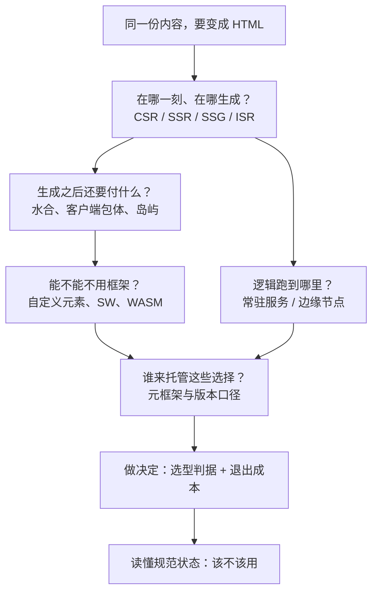
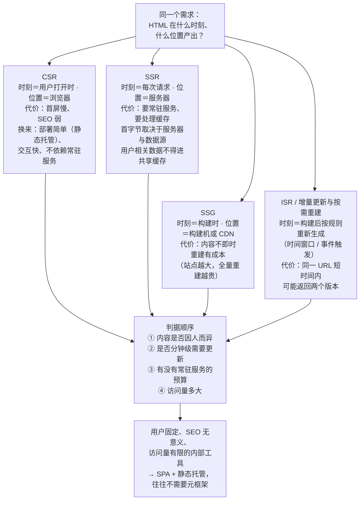
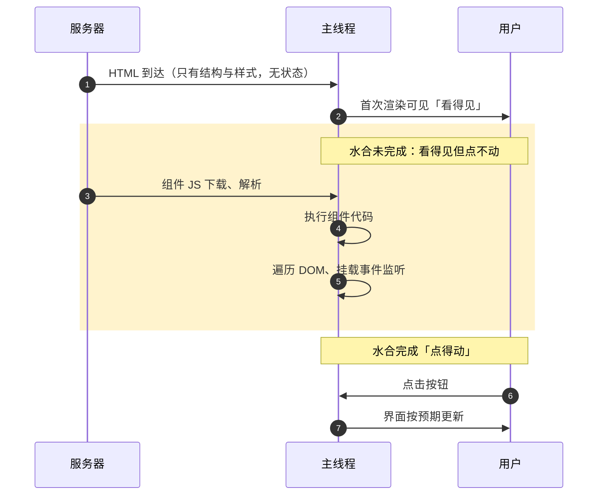
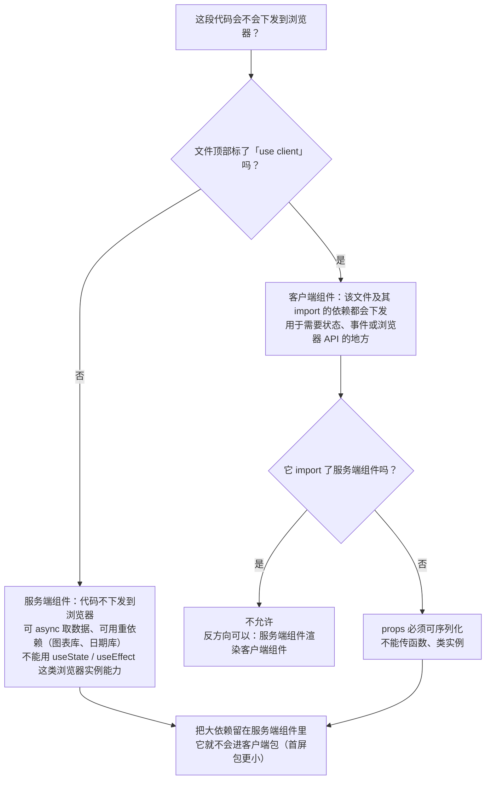

# 模块十 现代前端与前沿

> **一句话**：本模块回答的是「同一份内容，到底该在**什么时刻、什么位置**变成 HTML，为此要付什么**代价**」——会选，比会新更重要。
> **自学时长**：建议 6 小时（可分 3 次学完） · **前置**：[[07-模块七 组件化与框架]]、[[08-模块八 网络与数据]]、[[09-模块九 性能可访问性测试与部署]]
> **学完你能**：
> - 针对一个给定需求写出**渲染策略选型**，并为它写出一条**退出成本**判断；
> - 用 Lighthouse 做出两版实现的**可复现对比**（首屏指标 + 首屏 JS 体积），写出结论与**适用边界**；
> - 读懂一份规范页面的**状态字段**并提取一条可实施要求，同时写出**降级方案**。
>
> **另一条硬要求**：AI 可以参与，但你必须能说出它**能做什么、必须审什么**，并在提交物里说明使用范围与验证方式（见 §2.9、§4 动手四）。

> ⚠ **时效提醒（本模块特有，请先读）**：本模块含「前沿」内容，其中**版本号、规范状态、当前做法与走向**都会变。文中凡属这类陈述的句子，一律标注 **（截至 2026-10-01）**；凡属推断而非事实的，集中在 §7 的「不确定项」里，不写成结论。凡看到没有这样标注的句子，请把它当**已经稳定的概念/机制**读，而不是当时的市场状态。
> 版本号一律使用课程统一口径（22 项白名单，取自 2026-10-01 实测）：Vite 8.3.1 · React 19.3.0 · Vue 3.5.43 · Next.js 16.3.8 · Nuxt 4.5.2 · TypeScript 7.0.2 · Vitest 5.0.3 · Playwright 1.63.0 · ESLint 10.11.0 · Prettier 3.9.9 · Biome 2.5.15 · pnpm 12.8.1 · Node v26.7.0 · npm 11.19.0 · Pinia 4.0.3 · Vue Router 5.3.1 · React Router 8.4.0 · Zustand 5.0.15 · Tailwind CSS 4.3.3 · esbuild 0.28.2 · webpack 5.111.1 · sass 1.105.1。白名单外的工具只写名字、不给版本。

## 1. 心智模型

这个模块的线索，来自一段真实的历史：2015 年 ES2015 把 `import`/`export` 写进标准，浏览器随后支持原生模块——从此**你想写的源码**（模块化、类型化、拆得干干净净）和**浏览器/用户想要的东西**（请求少、加载快、缓存得住）就分家了。后面所有的现代方案，都是在补这道裂缝：元框架（Next.js 与 Nuxt 在 2016 年前后出现）把「渲染 + 路由 + 数据获取 + 构建」打包成约定；Vite（2020 年发布）把开发期换成基于原生 ES 模块的按需编译；React 19 在 2024 年 12 月发布并稳住了 Server Components，「哪些代码要下发到浏览器」第一次成为框架层面的默认议题。**本模块讲的是这条裂缝上要做的判断，不是「最新最潮」清单。**



> **图 1**：本模块的骨架——从「一份内容」到「一个可交付的选择」要过的五道关。
> **这张图在说什么**：它把全模块的十个知识点挂成了两条支线。上面一条（§2.1–2.3）是**渲染**：先决定内容在哪一刻、在哪生成，再为生成之后的后果（水合、包体）买单；下面一条（§2.6–2.7）是**运行位置与平台能力**：逻辑跑在常驻服务还是边缘节点，以及能不能干脆不引入框架。两条支线都汇到同一处——**元框架与版本口径**（§2.5、§2.8），最后落到**做决定并留下依据**（§2.9、§2.10）。读每一节时，先回答「我在这张图的哪一格」。

一句话概括全模块：**先问「内容何时变化、给谁看」，再问「用哪个框架」。**

## 2. 精讲（按节推进）

### 2.1 渲染策略谱系：HTML 在什么时刻、什么位置产出  ⏱ 约 35 分钟

**先立一个问题**：同一份内容，HTML 到底是在**什么时候**、**在哪里**被生成的？把答案写成四行，就是四种策略：

- **CSR（客户端渲染）**：服务器给一个空壳 + JS，脚本跑完才有内容。时刻＝用户打开时，位置＝浏览器。
- **SSR（服务端渲染）**：每次请求在服务器生成 HTML。时刻＝请求时，位置＝服务器。
- **SSG（静态生成）**：构建时一次性生成 HTML。时刻＝构建时，位置＝构建机或 CDN。
- **ISR / 增量更新与按需重建**：构建之后仍能按规则重新生成——按时间窗口复用，或由事件触发重建。

**关键是别背「优缺点词条」，要背「账单」。**同一种策略在不同项目上的成本结构完全不同，所以记账单比记形容词有用：

- **CSR 付的账**：首屏慢、SEO 弱。**换来的**：部署最简单（静态托管即可）、交互快、不依赖常驻服务。
- **SSR 付的账**：首字节取决于服务器与数据源，可能比 CSR 更慢；要常驻服务、要处理缓存；**用户相关数据不得进共享缓存**（这是安全与正确性双重问题，不只是性能）。
- **SSG 付的账**：内容不即时；重建有成本，站点越大全量重建越贵。
- **ISR 付的账**：一致性——**同一 URL 短时间内可能返回两个版本**。能接受最终一致才用。

**判据顺序**（照这个顺序问，不要从框架问起）：① 内容是否因人而异 → ② 是否分钟级需要更新 → ③ 有没有常驻服务的预算 → ④ 访问量多大。

**一个必须自己拿主的判断：内部工具往往不需要元框架。**依据是需求特征，不是技术强弱：用户是已知的一小群人、SEO 没有意义、首屏不必经过公网尽力而为；而元框架会带来常驻服务与运维、安全面、以及跟着大版本升级的持续成本。内部系统真正缺的是权限、表单、审批流，不是首屏指标。**SPA + 静态托管 + 接口鉴权**通常就够，把精力放回业务。



> **图 2**：CSR / SSR / SSG / ISR 各自「在什么时刻、在什么位置产出 HTML」与主要代价，以及据此的判据顺序。（复用本模块教案里已校验的图 1，标签未改。）
> **这张图在说什么**：四种策略是**并列**的（图中按两列排布，不分先后），箭头只表示「它们都是同一个问题的可能答案」「都汇入同一套判据」。四种策略**没有优劣排序，账单各不相同**：CSR 付首屏与 SEO，SSR 付常驻服务与缓存处理，SSG 付内容新鲜度与重建成本，ISR 付同一 URL 的短暂不一致。判据从「内容是否因人而异」问起，而不是从框架问起。

**你可以马上自己做的一次观察**（不需要任何框架）：找一个用 SPA 做的站点，按 `F12` → **Network** → `Ctrl+E` 开始录制 → `Ctrl+Shift+R` 强制刷新，在响应里找到那份 HTML 文档——你会看到正文并不在里面；再找一个静态生成的页面做同样的事，正文就在 HTML 里。用 `curl 页面地址` 抓到的原始 HTML 也能看出同一件事。这一步是后面所有判断的**事实基础**：不要靠印象说「它是 SSR」。

> **自检**：SSG 和 SSR 产出的 HTML 里都有内容，什么样的需求下**必须**用 SSR？
> （答案：内容因人而异、或依赖构建时无法确定的实时数据——例如登录后的个人面板。反过来，内容对所有人一样且变动不快，SSG 就够了。）

### 2.2 水合与水合代价  ⏱ 约 30 分钟

服务端已经把 HTML 发过来了，为什么浏览器还要再跑一遍脚本？因为**那份 HTML 只有样子，没有事件与状态**——它是一张写好的纸，点了不会有反应。浏览器执行组件代码把这批静态 DOM「认领」过来、绑定监听，这个过程叫**水合（hydration）**。

水合的代价要当成**可测量的三笔账**来记：

1. 组件代码要**下载、解析、执行**（这段字节本来可以不下发）。
2. 水合完成前，页面**看得见但点不动**——用户通常把它理解成「卡死」，这是最伤体验的一段。
3. 遍历 DOM 并挂载监听**占主线程**，耗时随组件数增长。

还有第四笔：**服务端与客户端渲染结果不一致时**会出现闪烁或控制台告警（常见来源是「服务端不知道客户端此刻的时间/随机值/本地存储」）。

减负的三条路（都是在缩短第二笔账那段时间）：

- **静态优先 + 局部水合**：只给需要交互的区块下发脚本。
- **岛屿架构**：见 §2.3。
- **Streaming SSR**：见 §2.3。

最小形态（只为看懂机制，不是要你这样写生产代码）：

```html
<!-- 服务端产出的：只有结构与样式，点了没反应 -->
<button class="counter">0</button>
<!-- 浏览器执行的脚本：认领这批 DOM，绑定之后才可交互 -->
<script type="module">
  document.querySelectorAll('.counter').forEach((el) => {
    let n = Number(el.textContent);
    el.addEventListener('click', () => { el.textContent = ++n; });
  });
</script>
```



> **图 3**：从 HTML 到达到可交互的水合时间线，阴影区间即「看得见但点不动」。（复用本模块教案里已校验的图 2；三条泳道按角色缩写：`S` 为服务器与网络、`B` 为浏览器主线程、`U` 为用户。）
> **这张图在说什么**：阴影区间的**长度就是水合的代价**，它由上面那几笔账构成；「看得见」与「点得动」是**两个不同时刻**，把前者当成后者是几乎所有相关误判的源头。减负的三条路（局部水合、岛屿架构、Streaming SSR）本质上都是把这段阴影缩短。

**动手测一次**（这是把概念变成数据的关键一步）：`F12` → **Performance** → 点圆形录制按钮（`Ctrl+E`）录制一次首屏加载 → 停止，找到「脚本执行」那一段——那段就是水合。再在 Performance 面板把 CPU 降速到 6× 重新录一次并点按钮，你会亲眼看到「点了没反应」。指标口径可查 [web.dev 的 Core Web Vitals 文章](https://web.dev/articles/vitals)，DevTools 各面板用法见 [Chrome DevTools 文档](https://developer.chrome.com/docs/devtools/)。

> **自检**：页面明显已经渲染出来了，按钮点了却没反应——最可能的成因是什么？为什么它和 CSS 或浏览器 bug 无关？
> （答案：组件 JS 还没下载执行完，水合未完成；页面「可见」早于「可交互」。这是机制问题，不是样式或浏览器缺陷。）

### 2.3 岛屿架构与 Streaming SSR  ⏱ 约 20 分钟

两条减负路线要分清，它们解决的是**不同**的问题：

- **岛屿架构（islands）**：把页面看成「**静态 HTML 的海洋 + 少量交互岛屿**」。海洋部分不下发脚本；每个岛屿各自加载脚本、独立水合，互不牵连。它减少的是**下发与执行的 JS 量**。代价：岛屿之间**默认不共享状态**，跨岛屿共享必须显式设计。
- **Streaming SSR**：服务端**分块输出**，先把已经就绪的部分发出去（按 Suspense 之类的边界切分），慢数据不再阻塞整页。它改善的是**首字节与首屏**；**总完成时间不一定缩短**。

一句判据：**一个页面 90% 是内容、10% 是可交互控件，那 90% 的部分不该付水合的钱。**

还要记住边界：岛屿是「**下发与执行的边界**」，不是组件切分方式——它不是把组件拆得更小，而是决定哪些组件值得为水合付费；而且它**不解决慢数据问题**（那是 Streaming 的事）。

最小形态：

```html
<!-- 海洋：静态，无水合 -->
<article><h1>标题</h1><p>正文…</p></article>
<!-- 岛屿：只有这块下发并执行脚本 -->
<my-counter data-start="0"></my-counter>
<script type="module" src="/islands/counter.js"></script>
```

> **自检**：岛屿架构减少了什么？又带来了什么新的设计问题？
> （答案：减少了下发与执行的 JS；带来的是岛屿间默认互相独立，跨岛屿共享状态必须显式设计。）

### 2.4 React Server Components 与客户端组件的边界  ⏱ 约 30 分钟

**RSC（React Server Components）把组件分成两类**：一类在服务端执行、**其代码不下发到浏览器**；一类需要浏览器上的状态、事件或浏览器 API，**必须下发**——叫客户端组件。这条边界是**显式标记**的（React 生态里是文件顶部的 `'use client'`）。

判定规则只有一条最关键：**下发的范围＝被标记为客户端的「文件及其 import 的依赖」**。这条规则直接决定包体大小——把一个约 300KB 的图表库留在服务端组件里用，它就不会进客户端包。

边界规则还有三条硬约束：

1. **客户端组件不能再 import 服务端组件**。反方向可以：服务端组件渲染客户端组件，并通过 props 传**可序列化**的数据。
2. **props 必须可序列化**——不能传函数、类实例。
3. **服务端组件里不能用 `useState`/`useEffect`** 这类依赖浏览器实例的能力。

代价与限制：需要框架与运行时支持（例如 Next.js 16.3.8 的 App Router，截至 2026-10-01 的当前形态）；心智模型更复杂，你必须能判断「这段代码在哪儿跑」；跨边界的报错有时不够直观。



> **图 4**：RSC 与客户端组件的边界，以及「一段代码会不会下发到浏览器」的判定路径。（复用本模块教案里已校验的图 3。）
> **这张图在说什么**：边界是**显式标记**的，标的是「这段代码需要能在浏览器执行」，**不是**「只在浏览器渲染」——客户端组件在服务端同样参与产出 HTML。下发的范围是「该文件及其 import 的依赖」，所以把大依赖留在服务端组件里，它就不会进客户端包；跨边界只能传可序列化数据。

两段最小形态（只为看懂「谁留在服务端、谁下发」）：

```tsx
// app/page.tsx —— 服务端组件：不下发，可直接取数据
import Chart from './Chart';                // Chart 顶部标了 'use client'
export default async function Page() {
  const data = await getStats();            // 只在服务端执行
  return <Chart points={data.points} />;    // props 必须可序列化
}
```

```tsx
// app/Chart.tsx
'use client';                               // 该文件及其依赖会下发到浏览器
import { useState } from 'react';
export default function Chart({ points }: { points: number[] }) {
  const [open, setOpen] = useState(false);
  return <button onClick={() => setOpen(!open)}>{open ? '收起' : '展开'}</button>;
}
```

入门依据可看 [React 官方文档](https://zh-hans.react.dev/learn)（React 19.3.0 语境）与 [Next.js App Router 入门](https://nextjs.org/docs/app/getting-started)。

> **自检**：`'use client'` 是不是表示「这个组件只在浏览器渲染」？
> （答案：不是。它标的是**边界**：该组件在服务端也要参与产出 HTML，同时它的代码要下发到浏览器以完成水合。）

### 2.5 元框架与版本口径：Next.js 与 Nuxt  ⏱ 约 25 分钟

**元框架（meta-framework）**＝把路由、渲染、数据获取、构建打包成一套约定的框架，分别长在 React 与 Vue 生态上。

**必须记住的一条版本口径（截至 2026-10-01）**：**Nuxt 3 已 EOL，不要再按 Nuxt 3 的教程建项目**——网上大量教程仍是 Nuxt 3 的，照抄会在配置与目录上踩坑。课程统一使用 **Nuxt 4.5.2**。同理，Next.js 侧按 **16.3.8** 的文档走。

对照维度（只对照，不要求双精通）：

| 维度 | React 一侧 | Vue 一侧 |
|---|---|---|
| 基础框架 | React 19.3.0 | Vue 3.5.43 |
| 路由 | React Router 8.4.0 | Vue Router 5.3.1 |
| 状态 | Zustand 5.0.15 | Pinia 4.0.3 |
| 渲染能力 | 都覆盖 CSR/SSR/SSG 与增量更新的思路；Next.js 以 RSC 为核心组织方式，Nuxt 是另一套服务端/客户端分离的思路 | 同左 |
| 工具链 | 都可与 Vite 8.3.1、TypeScript 7.0.2、ESLint 10.11.0、Prettier 3.9.9 或 Biome 2.5.15 配合；包管理统一用 pnpm 12.8.1（本机 Node v26.7.0、npm 11.19.0） | 同左 |

**选型判据（按顺序问）**：现有技能栈是什么 → 生态里有没有现成组件 → 招聘与上手成本 → **退出成本**（约定越深，搬走越贵）。

> ⚠ 上面这一节是**前沿里最容易过时的一节**：版本号、EOL 状态、默认渲染行为都可能在你读到的时候已经不同（本段全部为**截至 2026-10-01 的判断**）。正确习惯是——**先打开官方文档确认当前版本与入门路径**（[Nuxt 官方文档](https://nuxt.com/docs/getting-started/introduction)、[Next.js 官方文档](https://nextjs.org/docs/app/getting-started)），再决定照哪份教程做。

> **自检**：一份 2023 年的 Nuxt 教程还能照抄吗？为什么？
> （答案：不能。Nuxt 3 已 EOL，配置与目录与 4.x 线有差异；应按 Nuxt 4.5.2 的官方文档建项目。这是「版本口径」问题，不是环境问题。）

### 2.6 边缘运行时与 CDN 计算  ⏱ 约 20 分钟

**思路**：把逻辑放到**离用户近**的节点（CDN 边缘）执行，省掉网络往返，降低「服务器在远方」的延迟。静态资源天然走 CDN；更进一步是把一部分请求处理甚至 SSR 放到边缘。

**代价清单（记住这些限制，比记住收益有用）**：

- 边缘运行时的可用 API 是受限子集；
- 冷启动、内存与执行时长有上限；
- **常常不能像在常驻服务里那样连数据库**（长连接、原生模块可能不可用）；
- 可观测与调试工具不同，排错更难。

**分界线**：适合边缘的是——鉴权与重定向、按地区改写、A/B 分流、简单缓存与请求改写；不适合的是——长时间任务、重计算、依赖原生模块或长连接的逻辑。

一句判据：**「读请求头 → 判断 → 回一句话或改写」的逻辑放边缘；要连数据库跑事务、跑几秒 CPU 的，放回常驻服务。**所以「把 SSR 放边缘」并不等于更快：省了往返，但运行环境更受限、数据源可能更远。

可以自己量一次：用 `curl -w` 分别测本机服务与一个远距离节点的首字节时间，直观看到往返时间的影响。

> **自检**：把 SSR 放到 CDN 边缘节点执行，是不是一定更快？为什么不是？
> （答案：不一定。边缘运行时 API 受限、冷启动/内存/时长有上限、常常不能直连数据库，而且「数据在哪里」与「逻辑有多重」同样决定结果。）

### 2.7 Web 平台原生能力：四个子主题  ⏱ 约 40 分钟

**（a）自定义元素与 Shadow DOM**。自定义元素让浏览器原生支持「你自己定义的标签」（先登记、再使用）；Shadow DOM 提供 DOM 与样式的**隔离**，外部选择器默认进不来。用途：跨团队、跨框架复用同一个组件而不互相污染样式。代价：主题化要显式设计（通常用 CSS 自定义属性做可控穿透）；写法和框架不同；调试要多看一层 shadow 树。**它与框架可以共存**——不是「用了它就得放弃框架」。

自己试一次：写一个不超过 25 行的自定义元素，在页面里给它加一句外部 CSS（比如 `my-widget { color: red }`），然后 `F12` → **Elements**，展开 `#shadow-root` 看隔离的 DOM——你会发现外部样式确实进不去。

**（b）WASM**。把 C/C++/Rust 等编译成浏览器可执行的二进制。**适合**：已有高性能原生代码要复用，或确有 CPU 密集负载（编解码、图像/音视频处理）**并且能测出收益**。**不是万能药**：跨边界传数据有开销，字符串/对象要序列化；DOM 访问仍需经过 JS；小计算用 WASM 反而更慢；工具链与调试更复杂。

**（c）PWA 与 Service Worker**。用 Service Worker（简称 SW）拦截请求，实现离线与缓存。常见策略：仅缓存静态资源、网络优先、缓存优先、Stale-While-Revalidate。**更新陷阱（最容易吃亏的地方）**：SW 安装后**不会立刻接管**旧页面；「缓存优先」若不失效，会把旧版一直发给用户——用户看到的是旧页面。必须有**版本控制与更新提示**，且必须 HTTPS（localhost 例外）。

**（d）WebGPU 的边界定性**。面向 GPU 的图形与通用计算接口，用于渲染与并行计算类负载。**当前状态（截至 2026-10-01）**：各浏览器与平台的支持程度**不一致**，工具与生态仍在演进。所以这里只做定性介绍，**不承诺「现在就能全面替代 Canvas/WebGL」**——判断依据是你打开不同浏览器时看到的可用性差异，而不是某篇文章的口号。

> **自检**：你明明发布了新版本，用户却还看到旧页面——最可能的根因是什么？怎么改？
> （答案：Service Worker「缓存优先 + 缓存名固定不变」，旧缓存没失效。要让缓存名随版本变化并清理旧缓存，同时给更新提示、明确激活策略。）

### 2.8 编译前沿：原生编译器线与平台二进制分发  ⏱ 约 20 分钟

**TypeScript 7.0.2 属于「原生编译器」这条线**（截至 2026-10-01 的当前形态）：用原生语言实现编译器，动机是把大型项目的类型检查与编译时间压下来。要点是：**语言语义与类型规则不变**——升级要关注的是速度与诊断信息的差异，不是「语法变了」。文档入口见 [TypeScript 官方手册](https://www.typescriptlang.org/docs/handbook/intro.html)。

**npm 包按平台分发二进制**：带原生二进制的包会按操作系统与 CPU 架构（如 win32-x64、darwin-arm64）拆成不同的**可选依赖**，安装时只装当前平台那一份。由此产生几个你会真实遇到的现象：

- `package-lock.json` 里会出现「看起来用不到」的平台包；
- 在 Windows 上开发、在 CI 的 Linux 上安装，装出来的结果可能不同；
- 升级 Node 版本（本机 Node v26.7.0、npm 11.19.0）可能影响这些二进制包能否使用；
- 所以**锁文件必须提交，本地与 CI 要保持一致**。

同一动机还有一条工具线（截至 2026-10-01 的口径）：ESLint 10.11.0、Prettier 3.9.9 在「更快的检查与格式化」上持续改进，Biome 2.5.15 直接以 Rust 实现——都属于「缩短反馈回路」的路线。打包侧同理：esbuild 0.28.2 与 webpack 5.111.1 是两种不同取舍，sass 1.105.1 负责样式编译。

**重要的一句**：**「更快」不等于「更好」，不要因为速度快就整套替换工具链。**规则覆盖、插件生态、已有配置与迁移成本都在权衡里。

> **自检**：编译器用原生语言重写，对你自己写的业务代码有什么影响？为什么换一台机器装依赖会有差别？
> （答案：语义与类型规则不变，主要是编译更快、诊断可能有差异，业务代码不必改写；依赖里有按平台分发的二进制，锁文件记录了这些可选依赖，环境与锁文件不一致就会装出不同结果。）

### 2.9 AI 辅助开发：能做什么、必须审什么、诚信要求  ⏱ 约 25 分钟

**能做什么**（它确实省时间的地方）：生成样板代码、写测试骨架、解释报错、小范围重构与改写、补文档与注释、把一段设计描述翻成初版结构。

**必须人工审查什么（按风险排序）**：

1. **事实性错误**——编造不存在的 API、配置项、版本号（**最常见**）；
2. **安全**——注入、鉴权绕过、把密钥写进前端；
3. **许可与来源**——是否复用了有许可限制的代码；
4. **边界与错误处理**；
5. **性能**；
6. **是否符合本项目约定**。

**诚信要求（这条是硬要求）**：使用 AI 生成的代码要**说明来源与使用范围**，**不得把生成结果直接当作交付**——你必须能解释、能改、能在被追问时说出每一步为什么这么写。凡有 AI 参与，在提交说明里写清：哪些是生成的、你改了什么、你怎么验证的。

一句判据：**你能解释并验证的代码，才算你的代码。**

配套的另外三条工程纪律（与 AI 无关也必须做）：

- **来源标注**：代码、图片、数据、文案都标来源与获取日期；引用第三方代码要**看清许可**——宽松许可通常限制较少，带传染性的许可（要求衍生作品沿用同一许可）直接拷进项目，可能要求你把整个项目开源。不确定就去问，别默认「网上能搜到就能用」。
- **不确定就写不确定**：在报告与注释里写成「我不确定 X；我的依据是 Y；风险是 Z」。这比编一个自信的答案更专业。
- **数据**：不要使用真实用户隐私数据；采集数据要说明来源与使用范围。

自己演一遍最有效：让 AI 生成一段「配置某工具」的代码（例如一个 TypeScript 项目的配置），然后**逐条打开官方文档核对**，找出与当前版本不符的地方——这一步能让你亲眼看到「看起来很对」和「确实可用」之间的距离。

> **自检**：AI 给的代码能直接提交吗？如果你的产物里用了 AI，怎样才算合规？
> （答案：不能直接提交——要核对 API 与版本、审查安全与许可、自己跑通验证。合规的做法是说明来源与使用范围、自己理解并验证、能解释每一步。）

### 2.10 选型方法与持续跟进：怎么读规范  ⏱ 约 25 分钟

**按问题选工具，不按热度。**顺序是：先定需求与约束（用户是谁、内容更新频率、要不要 SEO、预算与运维能力、现有技能栈），再看候选，最后写**退出成本**。

**两个成本要分开算**：

- **学习成本**＝多久能熟练；
- **退出成本**＝以后能不能搬走（框架约定有多深、数据与状态能否导出、路由与构建是否可替换）。

**技术债的记录与偿还**：每做出一个「先这样、以后再改」的决定，就在仓库里记一条——**位置、原因、偿还条件、负责人**。不记账的技术债会变成「没人知道为什么这样写」，人一换就断线。

**读规范的姿势**（这是一项可以练的技能）：

| 来源 | 形态 | 你怎么认它 |
|---|---|---|
| [W3C 规范文档](https://www.w3.org/TR/) | 带**状态字段**（处于哪一阶段，如草案 / 候选推荐 / 正式推荐） | 标题附近找状态声明 |
| [WHATWG HTML Living Standard](https://html.spec.whatwg.org/multipage/) | 持续更新、**没有版本号** | 认「Living Standard」这几个字 |
| IETF RFC | 有**编号与状态** | 看编号与文档状态 |
| [ECMAScript 规范](https://tc39.es/ecma262/) | 按**年度版本**发布 | 看年份版本号 |

**判断一个特性该不该用的三步**：① 规范状态如何 → ② 目标浏览器支持面多大 → ③ 有没有降级方案。**没有降级方案，就不能当成「可以上线」。**

自己走一遍：打开一份规范页面，找到状态字段所在位置，再找出一条带「必须/应当」语气的可实施要求，并写出「如果目标浏览器不支持，用户会看到什么行为」。

> **自检**：怎么判断一个特性现在能不能用？「退出成本」怎么估？
> （答案：看规范状态 → 看浏览器支持面 → 必须有降级方案，三步缺一不可。退出成本看约定深浅、可替换性、数据与状态能否迁出。）

## 3. 关键概念讲透

这一节专门拆「最容易以为自己懂了」的五个点。每条都给：常见误解 → 正确理解 → 一个反例。

### 3.1 水合不是第三种渲染模式

- **常见误解**：「水合是一种渲染策略，跟 CSR/SSR 并列。」
- **正确理解**：水合是**服务端与客户端之间的桥**——服务端产出的是「只有样子」的 DOM，浏览器执行组件代码把这批 DOM **认领**过来、绑定事件与状态。它**不等于** SSR，也**不等于**重新渲染整页（是**复用现有 DOM 并绑定**）。
- **反例**：把「用了 SSR」当成「不需要 JS」。恰恰相反：SSR 页面几乎都要水合，否则按钮点不动；只有完全静态、零交互的页面才不需要。

### 3.2 SSR 不是性能开关

- **常见误解**：「SSR 一定比 CSR 首屏快，所以要上 SSR。」
- **正确理解**：SSR 的首字节取决于**服务器与数据源**——服务器慢、数据源远，SSR 可能比 CSR 更慢。它换来的主要是「HTML 里就有内容」带来的可见性与 SEO 收益，而不是无条件的速度。
- **反例**：一个内部报表页，改为 SSR 后加了常驻服务与数据源往返，桌面端首屏反而变慢——而它的用户根本搜不到它，SEO 收益为零。

### 3.3 `'use client'` 是边界标记，不是渲染开关

- **常见误解**：「标了 `'use client'` 的组件只在浏览器渲染，服务端不管它。」
- **正确理解**：它标的是**边界**——这段代码需要能在浏览器执行（因此它**及其 import 的依赖**会下发到浏览器），同时它在服务端也**参与产出 HTML**。
- **反例**：为了「性能」给一堆组件随手标 `'use client'`，结果把一个约 300KB 的图表库顺着边界带进了首屏包——首屏 JS 体积反而暴涨。

### 3.4 岛屿是「下发与执行的边界」

- **常见误解**：「岛屿架构就是把页面拆成很多小组件」，或者「岛屿能顺便解决慢接口导致的空白」。
- **正确理解**：它切的是**下发与执行的边界**——静态海洋不下发脚本，交互岛屿各自水合；岛屿之间**默认不共享状态**。它**不解决慢数据**，那是 Streaming SSR 的职责。
- **反例**：页面首屏空白，根因是接口要 3 秒才回——此时换成岛屿架构不会改善首屏，得先让已就绪的部分**流式**发出去。

### 3.5 边缘不是无条件免费加速

- **常见误解**：「逻辑放越靠用户就越快，所以整段服务端代码搬去边缘就行。」
- **正确理解**：省的是网络往返，付的是**受限运行时**：可用 API 是子集、冷启动/内存/时长有上限、常常不能直连数据库（长连接、原生模块可能不可用）、调试与可观测工具不同。还要看**数据在哪**。
- **反例**：把一段要连数据库跑事务的 Node 代码整段搬到边缘，卡在「连不上数据库」，最后又搬回去——白折腾一轮。

## 4. 动手（自学版实验）

这一节对应本模块的两次实验，拆成四个可以独立完成、独立验收的任务。**每个任务的验收标准都是逐条可勾的**：勾不上就说明没做完，不要自己给自己放行。

### 动手一：同一页面的 SPA 与静态生成对比（Lighthouse 首屏与包体）

- **要做什么**：
  1. 做一个内容页（例如「课程介绍 + 20 条公告列表」），两版**视觉与文案保持一致**。
  2. A 版：Vite 8.3.1 的纯前端 SPA，列表数据来自本地 JSON，不发接口。
  3. B 版：用元框架（Next.js 16.3.8 或 Nuxt 4.5.2，二选一，**不得使用 Nuxt 3**）的静态生成，产出同样内容的 HTML。
  4. 两版分别 build，用本地静态服务器打开；`F12` → **Lighthouse** → 点 Analyze page load 跑审计（移动端预设，**至少 3 次取中位数**），记录 FCP、LCP 与首屏所需 JS 体积；再 `F12` → **Network** → `Ctrl+E` 录制 → `F5` 刷新，按 Transfer Size 合计一目（说明见 [Lighthouse 概览](https://developer.chrome.com/docs/lighthouse/overview)、[Network 面板说明](https://developer.chrome.com/docs/devtools/network)）。
  5. 用 `curl` 抓两版首页 HTML，分别指出**正文是否已经在 HTML 里**。
  6. 写结论：数据表 + 差异原因 + **适用边界**。必须回答一个变体问题：**若该页改成「每 5 分钟更新一次的实时看板」，结论怎么变，依据是什么？**
- **需要什么**：Node v26.7.0、npm 11.19.0、pnpm 12.8.1、Vite 8.3.1、元框架二选一（Next.js 16.3.8 或 Nuxt 4.5.2）、Chrome、一个本地静态服务器（`curl` 在 Git Bash 里可用）。
- **验收标准**：
  - [ ] 两版首页 HTML 都能用 `curl` 抓到，且我能明确说出正文**在不在** HTML 里；
  - [ ] Lighthouse 有 3 次记录与中位数，并注明设备与网络预设；
  - [ ] 报告含 FCP、LCP、首屏 JS 体积三项数据，且能把差异**归因**（HTML 有无内容 + 下发脚本量）；
  - [ ] 结论含「适用边界」一节，且对「实时看板」变体给出策略变化与依据；
  - [ ] 版本号与命令齐全，换一台机器能复现。
- **卡住了看**：§2.1（四种策略与判据）、§2.2（水合与首屏 JS 体积的关系）、本节「要做什么」第 4 步里给出的两份 DevTools 说明。

### 动手二：读一份真实规范页面，写出状态、一条可实施要求与降级方案

- **要做什么**：
  1. 从 §7 的**一层来源**里选一份规范页面（HTML / CSS / Service Worker / PWA 方向任选其一），写清三件事：文档名；文档中标注的**状态字段**（处于哪一阶段，或 Living Standard 的持续更新说明；RFC 则写编号与状态）；**一条可实施要求**（原文摘录 + 你的转述 + 你会在代码里怎么满足它）。
  2. 定位这条要求的**浏览器支持面**（支持情况表或文档自身说明），写出支持范围。
  3. 写出**降级方案**：目标浏览器不支持时，**用户会看到什么行为**（不是「做好兼容」这种空话）。
- **需要什么**：浏览器（手工打开规范页即可）；一个文本编辑器写阅读笔记。
- **验收标准**：
  - [ ] 规范信息完整：文档名 + 状态字段（原文 + 你的解释）+ 一条可实施要求（原文 + 转述 + 落地方式）；
  - [ ] 支持面说明**有依据**（指出是取自支持情况表还是文档说明）；
  - [ ] 降级方案具体到「用户会看到什么行为」；
  - [ ] 我能说清自己**不确定**的地方是哪一处，以及为什么不确定。
- **卡住了看**：§2.10（规范类型与三步判断）、§7.1（可点的来源清单）。

### 动手三：用自定义元素 + Shadow DOM 封装一个样式隔离组件（或给静态页加 Service Worker）

- **要做什么（二选一）**：
  - **a)** 用自定义元素 + Shadow DOM 封装一个样式隔离的小组件（≤80 行，原生即可，不要求框架）；给它加一条外部 CSS 试图改内部样式，截图对比「进不去」。
  - **b)** 给一个静态页面加 Service Worker，实现「仅缓存静态资源」或「Stale-While-Revalidate」；然后**改动缓存版本号**，演示用户拿到的前后差异（旧版 → 新版）。
- **需要什么**：浏览器、编辑器；做 b) 时需要一个本地静态服务器（Service Worker 必须 HTTPS，localhost 例外）。
- **验收标准**：
  - [ ] a) 外部样式确实进不了 shadow root（附对比截图），`F12` → **Elements** 能看到 `#shadow-root` 与其内部 DOM；**或** b) 断网刷新仍能打开，且能演示「改版本号后用户才拿到新版」；
  - [ ] 每一行代码我都能口头解释它做了什么；
  - [ ] 我能说出这个方案的一个**代价**（a 的主题化与调试、b 的更新接管）；
  - [ ] 代码里标了来源（自己写 / 参考了哪份文档与获取日期）。
- **卡住了看**：§2.7 的 (a)(c) 两个子主题。

### 动手四：核查一次 AI 生成的「配置代码」

- **要做什么**：让 AI 生成一段配置某工具的代码（例如 TypeScript 7.0.2 项目的配置文件，或 ESLint 10.11.0 / Prettier 3.9.9 的配置）。然后**逐条打开官方文档核对**，在笔记里分三栏写：哪些是对的、哪些已过时或根本不存在、我是怎么验证的（文档链接或最小项目实测结果）。最后自己动手把配置改成可用状态，并写一句「如果我不改这一处，会发生什么」。
- **需要什么**：一个可以随意折腾的最小项目（Node v26.7.0、npm 11.19.0 或 pnpm 12.8.1），能访问 [TypeScript 官方手册](https://www.typescriptlang.org/docs/handbook/intro.html) 等官方文档。
- **验收标准**：
  - [ ] 三栏笔记齐全，且「已过时/不存在」的每一条都指得出**依据**（文档或用最小项目测出的报错）；
  - [ ] 改后的配置能真正跑通（类型检查或检查器通过）；
  - [ ] 我能回答「如果不改这一处会发生什么」；
  - [ ] 提交物里写明了 AI 参与的范围、我改了什么、我怎么验证的。
- **卡住了看**：§2.9（能做什么 / 必须审什么 / 诚信要求）、§2.8（版本与平台二进制这类最容易过时的地方）。

## 5. 自测

### 5.1 客观题（答案与解析在折叠块里）

> **先自己作答，再展开答案**。展开前，把理由写在纸上——不是为了对答案，是为了练「来源冲突时能说明为什么选这个」。

**1.** 下列关于渲染策略的说法，哪一项在当前状态下成立？
A. 用了元框架就一定是服务端渲染
B. SSG 产出的 HTML 里已含正文，适合构建后不变或变化不快的内容
C. SSR 一定比 CSR 首屏快
D. 增量更新意味着内容实时

> [!success]- 答案与解析
> **B**。SSG 在构建时就把正文写进了 HTML，所以「构建后不变或变化不快」的内容最合适。A 错：元框架默认行为要按配置与页面确认，不是「用了就是 SSR」。C 错：SSR 首字节取决于服务器与数据源，**不保证更快**。D 错：增量更新只是时间窗口内复用或按需重建，属于**最终一致**，不是实时。

**2.** 关于 RSC 模型里的 `'use client'`，哪一项正确？
A. 标记后该组件不会在服务端渲染
B. 标记后该文件及其 import 的依赖会下发到浏览器
C. 标记后使用 `useState` 不影响包体
D. 只要不标记，页面里所有组件都不会下发

> [!success]- 答案与解析
> **B**。下发范围就是「被标记的文件**及其 import 的依赖**」，记住这一条就能算包体。A 错：它标的是边界，该组件在服务端同样参与产出 HTML。C 错：`useState` 本身要求这份代码在浏览器执行，它所在的组件及其依赖都要下发。D 错：不标记只说明那些组件留在服务端，不代表「页面里所有组件都不下发」——客户端组件依然会下发。

**3.** 关于元框架的版本口径（截至 2026-10-01），下列正确的是：
A. 网上大量教程仍是 Nuxt 3，可以照抄
B. Nuxt 3 已 EOL，应按 Nuxt 4.5.2 的官方文档建项目，配置与目录差异会踩坑
C. 本课程统一使用 Next.js 16.3.8，与 Nuxt 无关
D. 「Next 等于 SSR、Nuxt 等于 SSG」是稳定的对应关系

> [!success]- 答案与解析
> **B**。A 错：旧教程的配置与目录与 4.x 线不一致，照抄会报错并把问题误判成环境问题。C 错：两条路线都在课程口径内（Next.js 16.3.8 与 Nuxt 4.5.2），不是二选一的关系。D 错：两者都覆盖 CSR/SSR/SSG 与增量更新思路，不存在「Next 等于 SSR」这种简单对应——默认行为要看配置与页面。

**4.** 关于 Web 平台原生能力，下列说法正确的是：
A. WASM 能加速一切 JavaScript，应当优先把所有计算迁过去
B. 自定义元素必须放弃框架才能使用
C. WASM 适合复用已有高性能原生代码、或确有 CPU 密集负载并能测出收益的场景；跨边界传数据有开销，DOM 访问仍需经过 JS
D. WebGPU 当前各浏览器与平台支持程度一致，可以直接全面替代 Canvas/WebGL

> [!success]- 答案与解析
> **C**。A 错：跨边界传数据有开销、小计算用 WASM 反而更慢，是否值得**要实测**。B 错：自定义元素与框架可以共存。D 错：截至 2026-10-01，各浏览器与平台的支持程度**不一致**、生态仍在演进，所以这里只做定性介绍。

**5.**（判断正误并说明理由）把 SSR 放到 CDN 边缘节点执行**一定**更快，因为省掉了网络往返。

> [!success]- 答案与解析
> **错误**。省的是网络往返，付的是受限运行时：可用 API 是子集、冷启动/内存/执行时长有上限、**常常不能像常驻服务那样连数据库**（长连接、原生模块可能不可用），可观测与调试工具也不同、排错更难。此外「数据在哪里」与「逻辑有多重」同样决定结果——重计算与长事务放边缘通常更慢。

### 5.2 动手题（不给实现，只给验收标准与评分点）

**1.**（简答，≤150 字）为什么会出现「页面已经看清内容，按钮却点了没反应」？再写出两个减少这段等待的手段。
- **验收标准**：① 出现「水合」或等价机制描述（服务端 HTML 只有结构与样式，事件与状态要等脚本下载执行完）；② 给出的两个手段**具体**，不是「优化性能」这类空话（可选：只给需要交互的区块下发脚本、岛屿架构、Streaming SSR 先发已就绪部分、减小客户端包体）。
- **评分点**：机制说清（这段等待是水合未完成，而不是画面没出来）占大头；手段具体、能说出它缩短的是上面哪一笔账。

**2.**（分析）某校园内部报修系统：用户为全校师生、需登录（约 5000 人），页面内容因人而异，访问集中在工作日白天。给出渲染策略建议，并写出一条**退出成本**判断。
- **验收标准**：① 识别出「内容因人而异 → 不能进共享缓存走静态产物」；② 说明是否需要常驻服务，并指出内部工具优先考虑 SPA + 接口、元框架不是必需（用户固定、SEO 无意义、缺的是权限与审批流）；③ 若提到用 SSR，必须同时说明**个性化数据不得进共享缓存**；④ 退出成本落到具体判断（路由与构建层能否替换、状态与数据能否导出、约定有多深）。
- **评分点**：判据顺序是否用对（从「内容是否因人而异」问起）；退出成本是不是**可执行的具体判断**，而不是「看情况」。

**3.**（读代码）下面这段（仅示形态）：

```tsx
// app/page.tsx —— 服务端组件
import Chart from './Chart';   // Chart.tsx 顶部标了 'use client'，且 Chart 内部 import 了一个约 300KB 的图表库
export default async function Page() {
  const data = await getStats();
  return <Chart points={data.points} />;
}
```

问：① 构建后客户端首屏包里会不会带上这个图表库？为什么？② 要避免，有哪两条可行做法？③ 可以用什么办法**验证**你的结论？
- **验收标准**：① 答「会带」，并说出依据——依赖会顺着客户端边界（`'use client'` 所在文件及其 import）进入浏览器包；② 两条做法具体（把重依赖留在服务端、把客户端组件切到最小交互壳、对该依赖做延迟加载，本质是把它挡在客户端边界之外）；③ 验证办法具体（构建产物体积对比、`F12` → **Network** 看下发了哪些 chunk）。
- **评分点**：归因是否落在「边界决定包体」这一条规则上；验证办法是不是**可复现的测量**而不是「应该不会」。

**4.**（编程）用 Nuxt 4.5.2 或 Next.js 16.3.8（二选一，**不得使用 Nuxt 3**）创建项目，实现一个含 3 个页面的静态站点（首页、列表页、详情页，内容固定），并产出静态生成产物。列表页不少于 10 条数据，详情页路由参数正确；至少一页含一处交互（如筛选或展开）且行为正常。
- **验收标准**：① 三页 build 后能从产物目录打开，且正文在 HTML 中（用 `curl` 验证）；② 列表页不少于 10 条数据，详情页路由参数正确；③ 至少一页含一处交互且行为正常；④ `README.md` 写明所用版本、命令，以及一段「选型理由 + 退出成本」；⑤ 若有 AI 参与，须说明使用范围与自己的修改（**不要**提交 AI 生成的完整答案）。
- **评分点**：可构建可运行；页面与路由正确；交互可用；README 的版本与理由；诚信说明与来源标注。
- **常见扣分点**：用了 Nuxt 3（版本口径不符，按未完成处理）；`curl` 抓到的 HTML 里没有正文（说明并没有真正产出静态 HTML）；只交代码不写选型与退出成本；README 里写了白名单之外的版本号；AI 参与但没说明。

**5.**（编程）在本机环境（Node v26.7.0、npm 11.19.0、pnpm 12.8.1）建一个 TypeScript 7.0.2 的最小项目，配好 ESLint 10.11.0 与 Prettier 3.9.9，并在锁文件里找出至少一个「按平台分发的二进制依赖」，记录其 `os`/`cpu` 字段。
- **验收标准**：① 项目可 typecheck 与 lint；② 能说明该依赖 `os`/`cpu` 字段的含义；③ 能说明「为什么在 CI 的 Linux 上装出来可能不同」；④ 写出对「更快的工具是否应立刻替换现有工具链」的判断并给出依据。
- **评分点**：环境与命令准确；锁文件字段解释正确（不要把它说成版本号）；平台差异解释到位；判断题有依据（规则覆盖、插件生态、迁移成本）。
- **常见扣分点**：不提交锁文件，或没找到平台包就编一个；把 `os`/`cpu` 解释成版本号；判断题只答「更快就换」。

## 6. 自我检查清单

进下一篇之前，逐条勾；勾不上就回 §2 对应小节重读（括号里是回读位置）。

- [ ] 我能说清 HTML 是在「构建时、请求时、还是浏览器里」生成的，并各举一个适用场景（§2.1）
- [ ] 我能解释「看得见但点不动」是水合未完成，而不是 CSS 或浏览器的问题（§2.2）
- [ ] 我能说出岛屿架构省掉了什么，又带来了什么新的设计问题；并知道它**不解决**慢数据（§2.3）
- [ ] 我能判断一段代码在 RSC 模型里会不会下发到浏览器，并说清依据（§2.4）
- [ ] 我知道 Nuxt 3 已 EOL、建项目会用 Nuxt 4.5.2，并能说出旧教程哪里不能照抄（§2.5）
- [ ] 我能说出把逻辑放到边缘的**两个收益与两个限制**（§2.6）
- [ ] 我能写出 Service Worker 的更新陷阱，并知道怎么让用户拿到新版本（§2.7）
- [ ] 我能说出 WASM 适合什么、不适合什么，而不是「能加速一切」（§2.7）
- [ ] 我能说出 WebGPU 是做什么的，并说明为什么这里只做定性介绍（§2.7）
- [ ] 我读一份规范页面时能指出状态字段和一条可实施要求，并写出降级方案（§2.10）
- [ ] 我在选型时能写出一条退出成本；引入临时方案时能记一条技术债（位置/原因/偿还条件/负责人）（§2.10）
- [ ] 我提交的产物里，引用的代码与资料都标了来源与许可；AI 参与的部分写清了范围与验证方式（§2.9）
- [ ] 遇到不确定的地方，我会写「不确定 + 依据 + 风险」，而不是编一个自信的答案（§2.9、§7）

## 7. 出处与依据说明

### 7.1 有官方依据的部分

| 出处（仅列可点的第一/第二层来源） | 对应小节 | 用它说明什么 |
|---|---|---|
| [WHATWG HTML Living Standard](https://html.spec.whatwg.org/multipage/) | §2.10、动手二 | HTML 的现行标准形态：持续更新、无版本号 |
| [W3C 规范列表](https://www.w3.org/TR/) | §2.10、动手二 | 规范文档带**状态字段**（草案 / 候选推荐 / 正式推荐）这一形态 |
| [ECMAScript 规范](https://tc39.es/ecma262/) | §1、§2.10 | 按年度版本发布；§1 提到的 ES2015 原生模块史实的标准侧依据 |
| [MDN Web Docs](https://developer.mozilla.org/zh-CN/docs/Learn_web_development) | §2.7、动手三 | 自定义元素 / Shadow DOM / Service Worker / WASM 的概念与 API 行为 |
| [Chrome DevTools 文档](https://developer.chrome.com/docs/devtools/) · [Network 面板](https://developer.chrome.com/docs/devtools/network) | §2.1、§2.2、动手一 | 打开的快捷键与面板用法：看 HTML 里有没有正文、看下发了哪些 chunk、录性能 |
| [Lighthouse 概览](https://developer.chrome.com/docs/lighthouse/overview) | 动手一 | 跑审计的操作口径与如何读结果 |
| [web.dev 的 Core Web Vitals](https://web.dev/articles/vitals) | §2.2、动手一 | FCP/LCP/INP 这类指标的口径，以及「用数据判断性能」的方法 |
| [Vite 官方文档](https://vite.dev/guide/) | 动手一 | Vite 8.3.1 的定位（开发服务器 + 构建命令） |
| [React 官方文档](https://zh-hans.react.dev/learn) | §2.4、§2.5 | React 19.3.0 的组件模型与客户端组件写法 |
| [Next.js 官方文档](https://nextjs.org/docs/app/getting-started) | §2.4、§2.5、动手一 | Next.js 16.3.8 App Router 的入门路径与项目结构 |
| [Nuxt 官方文档](https://nuxt.com/docs/getting-started/introduction) | §2.5、动手一 | Nuxt 4.5.2 的定位与入门（文档为 4.x 线） |
| [Vue 3 官方文档](https://cn.vuejs.org/guide/introduction) | §2.5 | Vue 3.5.43 的声明式渲染与响应式概念（用于对照） |
| [TypeScript 官方手册](https://www.typescriptlang.org/docs/handbook/intro.html) | §2.8、动手四 | TypeScript 7.0.2 的语言与工具链文档入口 |
| [Node.js 中文站](https://nodejs.org/zh-cn) | §2.8、动手一、动手四 | 本机运行环境的安装与版本口径（Node v26.7.0 / npm 11.19.0） |

白名单之外的资料（以及白名单之外的工具）一律只写名称、不给链接：各浏览器**支持情况表**、Vite 之外的**打包器官方文档**、CSS 与 Service Worker 规范的各个分册页面——需要时自行检索，并标注来源与获取日期。

### 7.2 属本人编排判断（无官方依据）

- **§1 的心智模型图（图 1）与「两条支线」的组织方式**，以及全篇的**节序与每节 ⏱ 建议时长**，都是自学编排，官方文档不规定一个人该怎么学。
- **「内部工具往往不需要元框架」**是一句**教学用判断**，依据是对需求特征的分析（用户固定、无 SEO 诉求、运维与安全成本），并非任何官方文档的表述；真实项目仍应逐项对照 §2.1 的判据顺序。
- **「先问内容何时变化、给谁看，再问用哪个框架」**这句判据，以及对四种策略「记账单而不是记优缺点词条」的讲法，是编排出来的读法。
- 动手一采用「移动端预设 + 至少 3 次取中位数」，是为了让你的数据与别人可比而定的自学口径，不是任何官方评测方法的要求。
- **「把大依赖挡在客户端边界之外」**是经验总结，落地时以你自己项目的产物实测为准。
- §3 的五个「常见误解」来自教学观察，属经验归纳，不是统计结论；「反例」是为了让判断力可练而构造的典型场景，不是某个项目的真实事故记录。
- 本模块只要求**读懂、能改、能选**，不要求双框架精通——这条深度口径是课程组编排。

### 7.3 不确定项（如实写，来自来源冲突或未验证）

1. **本模块的「前沿」内容有时效性。**文中所有关于版本号、EOL 状态、规范阶段、默认行为、支持面的陈述，都是**截至 2026-10-01 的判断**。特别是：Next.js 16.3.8 与 Nuxt 4.5.2 的**默认渲染行为**、Nuxt 3 的 EOL 状态、TypeScript 7.0.2 的诊断信息表现、WebGPU 各平台的支持面——这些在你读到的时候**可能已经变化**。**正确做法是先查官方文档，再采信本文。**
2. **规范的状态字段在不同来源间存在冲突。**同一份规范，规范页自标的状态与第三方资料（含部分百科与教程）的转述**不一定一致**；本文只教你**认状态字段的位置与含义**，不给「某规范现在处于哪一阶段」的结论。遇到冲突如实记录冲突，不要随便挑一个。
3. **「边缘是不是更快」没有统一答案。**它取决于数据源位置、逻辑轻重、运行时限制与你所用平台的具体实现，本文只给分界线（短、无状态、靠近用户的判断适合边缘），**不给量化结论**。
4. **交付物证据（Lighthouse 数字、包体积）会随环境变化。**不同机器、不同网络、不同版本工具跑出的绝对数值不可直接横向比较；本文只承诺「同一台机器、同一预设、取中位数」这种**内部可比**的做法。
5. **未验证项（本文没有实测，只按来源转述）**：本机 Node v26.7.0 / npm 11.19.0 与各工具版本的组合，本文未逐一实测兼容性；WebGPU 的可用性差异只按各浏览器官方说明转述，未在本机做过全覆盖矩阵测试。
6. **本文不对未来做预测。**凡是「趋势」「走向」性质的说法，本文一律不写成事实——如果哪一句话读起来像在预测，请把它当**不确定项**处理，并回到第一/第二层来源自行核实。

## 安全视角

本模块讲前沿与 AI 辅助开发——**AI 会把「看起来对的代码」与「看起来对的配置」一起交给你**，它既可能引入漏洞，也可能把你的密钥写进公开产物。

- §2.9 的诚信要求不只是「标注用了 AI」，还包括**必须审**：审安全边界（有没有用 `v-html` 这类口子）、审依赖（AI 可能编出真实存在的相似包名）、审凭据。
- 前端产物是公开的：密钥泄露渠道（`.env` 被提交、前缀变量进产物、sourcemap 随产物发布、CI 日志）与判断句式「这个值被任何人拿到会发生什么」见 [[22-前端安全专章（OWASP × ATT&CK）]] §7。
- 把安全当默认见 §10（安全应考判断力）与 [OWASP 主动控制](https://top10proactive.owasp.org/the-top-10/)；法律与伦理边界见 §9。

---

上一篇：[[09-模块九 性能可访问性测试与部署]] · 下一篇：无（M10 是本套自学版的最后一篇模块） · 本模块教师版：[[10-教案 M10 现代前端与前沿]] · 总入口：[[00-自学指南]]
