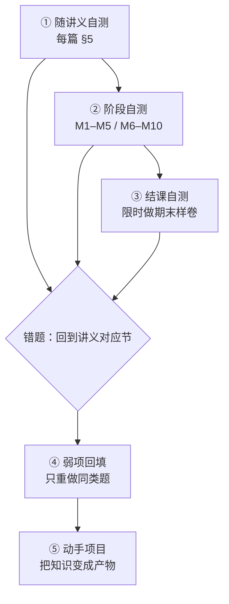

# 自测与进度检查：怎么知道"这遍学到位了"

> **一句话**：自学最大的风险不是学不会，是**以为自己学会了**。这份文件给你三把尺子——随讲义自测、阶段自测、结课自测——外加一份进度表，让"学到位"变成可判定的。
> **前置**：先看完 [[00-自学指南]] 的「怎么用（四步循环）」。

**图 1** —— 自测不是一个动作，是一个闭环：**做题 → 定位错因 → 回填弱项 → 再做同类题**。只做题不回填，等于把错的地方再错一遍。
这张图在说什么：**先用小尺子（随讲义自测）发现问题，再用大尺子（样卷）验收**；任何一步发现错题，都要回到讲义那一节，而不是往下硬走。

## 1. 三把尺子

| 尺子 | 用什么 | 什么时候用 | 过关线 |
|---|---|---|---|
| ① 随讲义自测 | 每篇讲义的 §5（客观题带折叠答案与解析，动手题给验收标准） | 学完一片就做 | 客观题**先答后看**；错题的解析你能自己讲出来；动手题验收标准**逐条勾满** |
| ② 阶段自测 | [[11-习题集 M1-M5]]（第一轮）、[[12-习题集 M6-M10]]（第二轮）——闭卷做，做完再对答案要点 | M1–M5 学完、M6–M10 学完各一次 | 客观题正确率 **≥ 80%**，且错题能说出**错在哪一步判断** |
| ③ 结课自测 | [[14-期末样卷与参考答案要点]]——按分值折算时间限时做；弱项用 [[19-加练题库与答案要点]] 补 | 十篇都走完后 | 会做的部分**能对到答案要点**；不会的能定位到"是哪一篇的哪一节没掌握" |

> 这三份题库属于课程的教师版材料，但**自学者拿来当自测卷是正当用法**：它们的答案要点本来就是给你核对用的。做的时候把答案那一段遮住（或用折叠标题先不看）。

## 2. 怎么判断"我真的会了"（四条可自检的信号）

1. **能不看材料写出最小例子**：不是"能看懂"，是**能默写**一个 10 行以内的例子。
2. **能说出"为什么不是另一种做法"**：每个选择都要能给出至少一个反例或代价。
3. **能自己制造并修好一个故障**：故意改坏，能预测现象、再用开发者工具定位。
4. **能把它讲给别人听**：讲不清的地方，就是你还没掌握的地方。

## 3. 三个"自欺信号"（出现任一条，说明该回头重学）

| 信号 | 真相 |
|---|---|
| 看着答案觉得"我本来也是这么想的" | 那是**识别**，不是**回忆**。合上答案再写一遍才算。 |
| 验收标准只勾了容易的几条 | 那几条恰好是不需要动脑的；**没勾的那条才是这门课要练的**。 |
| 代码"能跑"就往下走 | 能跑不是判据；**换个输入、换个屏幕宽度、键盘走一遍**还成立才是。 |

## 4. 十二模块进度表（自己填，与 [[00-自学指南]] 的表一起用）

| 模块 | 讲义自测 | 阶段/结课自测 | 动手产物（代码/截图） | 自查清单全勾 | 日期 |
|---|---|---|---|---|---|
| M1 | ☐ | ☐ | | ☐ | |
| M2 | ☐ | ☐ | | ☐ | |
| M3 | ☐ | ☐ | | ☐ | |
| M4 | ☐ | ☐ | | ☐ | |
| M5 | ☐ | ☐ | | ☐ | |
| M6 | ☐ | ☐ | | ☐ | |
| M7 | ☐ | ☐ | | ☐ | |
| M8 | ☐ | ☐ | | ☐ | |
| M9 | ☐ | ☐ | | ☐ | |
| M10 | ☐ | ☐ | | ☐ | |
| M11 | ☐ | ☐ | | ☐ | |
| M12 | ☐ | ☐ | | ☐ | |

## 5. 全部走完之后

- 用 [[12-动手项目（自学版大作业）]] 做一个真项目——**这是把这套讲义的知识粘成一体的唯一办法**；
- 拿 [[13-考核方案与评分量规]] 的**课程项目量规**给自己的项目打分（那是教师版的量规，但判据对自学同样成立）；
- 想继续深入：[[16-技术演进时间线]] 给你"为什么现在是这样"的出处，[[21-操作与资料速查（全可点）]] 是全套材料的可点索引。

## 6. 依据说明

- **有官方依据的部分**：各篇讲义的知识点与判据，出处见各篇 §7。
- **属本人编排判断（无官方依据）**：三把尺子的分级、80% 这条过关线、四条"我真的会了"的信号、三条自欺信号——都是学习编排，不是任何标准的规定。**过关线可以自己调**，但"先答后看""错题必须回填"这两条不要调。
