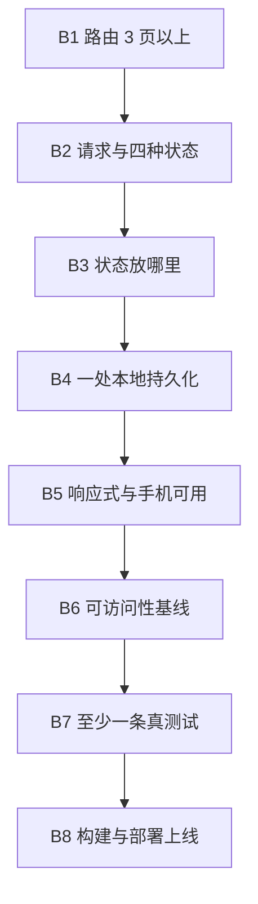

# 动手项目（自学版大作业）

> **一句话**：前面十篇给你零件，这个项目让你把它们装成一台能跑的车——**没有项目，知识会以周为单位流失**。
> **前置**：M1–M9 学完（M10 的内容可以在项目里顺手用上）。
> **规模**：建议一个人做，2–4 周（按每周 8 小时估）。人多了反而容易变成"每人做一小块、谁都没走通全流程"。

**图 1** —— 八条功能基线**是有顺序的**：先有能跳转的骨架（B1），再接数据（B2），然后才谈状态怎么放（B3）；持久化（B4）之后才是适配（B5）与可访问性（B6）；最后才是测试（B7）与上线（B8）。
这张图在说什么：**卡住的时候看你在哪一格**——在 B2 卡住却去调 B6 的对比度，就是没按顺序走。

## 1. 选题：什么能做、什么不能做

**能做**：一个真实、可用的中小型 Web 应用——工具类（记账、订阅管理、课程表、书签、待办看板）、数据看板类（读公开 JSON 做筛选与可视化）、内容类（带搜索与分类的阅读/笔记库）。

**必须避开**（这三类是"看着像作品、其实没做决定"）：
1. **成品模板站**：套现成后台/商城/博客主题只改文案；
2. **纯静态展示页**：没有路由、没有状态、没有请求、没有交互决策的"一页式作品集"；
3. **攀比复杂度**：为了显得高级堆库和架构，却说不清为什么用。

参考选题方向（选自课程任务书，判据要求不因选题而降低）：

| # | 题目 | 核心难点 |
|---|---|---|
| A | 个人作品集 / 学术主页 | 结构设计与视觉一致性、静态生成 |
| B | 课程笔记与资料库 | 搜索与筛选、本地持久化、Markdown 渲染 |
| C | 追番 / 追剧 / 读书清单 | 状态机（想看·在看·看过）、统计视图 |
| D | 校园二手交易 / 失物招领 | 表单校验、列表筛选与排序、图片处理 |
| E | 社团活动报名与签到 | 表单多步流程、名额限制、时间处理 |
| F | 数据展示看板 | 数据可视化、响应式、大列表性能 |

## 2. 功能基线：八条，逐条可自测

| 编号 | 基线 | 你自己怎么验 |
|---|---|---|
| B1 | 路由 ≥ 3 页（含列表页、详情页、一个辅助页） | 前进后退正常；**深链接直接刷新不白屏** |
| B2 | 请求与四种状态（加载中／成功有数据／成功但为空／失败） | 四种都能**人为触发**（Network 面板切 Offline 造失败）；失败可重试 |
| B3 | 状态管理说得出理由 | 状态放哪（组件内/提升/全局）能讲清；无直接改 props、无解构丢响应、列表不用索引当 key |
| B4 | 至少一处跨刷新保留的数据 | 筛选偏好/收藏/草稿任选一处，并说明存哪、为什么 |
| B5 | 响应式与手机可用 | 从窄到宽连续缩放不破版；**无横向滚动条**；手机宽度能走完核心流程 |
| B6 | 可访问性基线 | 语义地标完整、标题层级连续、表单控件有 `label`、**键盘能走完核心流程**、焦点可见 |
| B7 | ≥ 1 条真实可跑的测试 | **把被测代码改坏，测试必须变红**（不会变红说明它测的不是这个） |
| B8 | 构建与部署上线 | 一条命令出构建物；部署到可公开访问的地址；深链接刷新不 404；**产物里搜不到密钥** |

> 基线原文见 [[15-实验与大作业指导]] §2.2（教师版任务书），上表是**自学版的自我验收写法**。

## 3. 里程碑（按你自己的周次排）

| 里程碑 | 自学节奏建议 | 产出 | 自查方式 |
|---|---|---|---|
| 选题 | 第 0 周 | 一段话：解决什么问题、给谁用、范围到哪、为什么选这个技术栈 | 能不能用一句话说清"它替代了什么" |
| 骨架 | 第 1 周 | B1 完成：三页能跳、深链接刷新可用 | 换个浏览器再走一遍 |
| 数据链路 | 第 2 周 | B2 的四态齐全（先做两态也行，但别跳过失败态） | 制造一次真失败（Offline） |
| 完整功能 | 第 3 周 | B3、B4 完成 | 能对每条决策说出理由 |
| 打磨 | 第 4 周 | B5、B6 完成 | 手机宽度走核心流程 + 只用键盘走一遍 |
| 验收 | 第 4 周末 | B7、B8 完成 + 自评量规表 | 改坏代码看测试是否变红；产物里搜密钥 |

## 4. 自评方式（没有老师，就自己当评委）

1. 拿 [[13-考核方案与评分量规]] 的**课程项目量规**，给自己逐项打分，**每项必须写证据**（哪个文件、哪次提交、哪张截图）；
2. 做一次**三问对抗自评**：这个功能最坏的情况是什么？换个输入还成立吗？如果需求变了，哪一处最先崩？
3. 上线后隔一天再打开一次——**别人（包括明天的你）能不能自己看懂首页**。

## 5. 提交物清单

- 代码仓库（提交信息写清"为什么"，不是"改了什么"）；
- `README.md`：怎么跑起来、功能清单、**关键设计决策与理由**、已知限制；
- 上线地址（可公开访问）；
- 至少一条测试（含"改坏就变红"的证据）；
- 自评量规表（逐项 + 证据）。

## 6. 最常见的五种卡法（都是"顺序错了"）

| 卡法 | 症状 | 怎么出来 |
|---|---|---|
| 先做视觉 | 首页很漂亮，一点就白屏 | 回到 B1，把路由骨架走通 |
| 状态放错层 | 数据改了界面不动，或到处传 props | 回到 B3，先问"这个状态谁需要读" |
| 只有成功态 | 断网后一片空白、无限转圈 | 回到 B2，把失败态与空态补上 |
| 测试是摆设 | 改坏代码测试还是绿的 | 回到 B7，断言要落在行为上 |
| 把密钥写进前端 | 产物里能直接搜到 | 回到 B8，密钥只在服务端 |

## 7. 诚信与引用（自己学也要守）

- 引用他人代码、素材、数据必须标出处与许可；AI 生成的内容**必须自己审**（能做什么、必须审什么见 [[10-模块十 现代前端与前沿]]）；
- 不要把自己没读懂的东西当交付——**说不清为什么用，就等于没做决定**。

## 8. 依据说明

- **有依据的部分**：B1–B8 功能基线、A–G 选题方向与"必须避开"三类，取自课程任务书 [[15-实验与大作业指导]] §2.1–§2.2（口径一致，仅把"教师确认/现场答辩"改成自学版的自评方式）。
- **属本人编排判断（无官方依据）**：里程碑的周次建议、五种卡法清单、"三问对抗自评"——都是编排与经验判断，不是标准要求。
