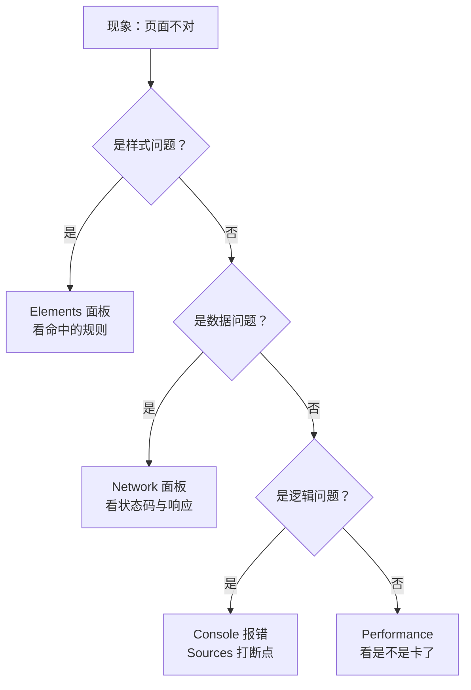

# 资料与操作速查（全可点）

> **一句话**：学到一半忘了某个操作怎么做，来这里查——**先查操作，再查资料，最后才去搜**。
> 更全的教师版索引见 [[21-操作与资料速查（全可点）]]。

**图 1** —— 遇到问题先分诊，别乱翻：**样式 → Elements；数据 → Network；逻辑 → Console / Sources；慢 → Performance**。
这张图在说什么：**四类问题有四个入口**，选错面板会让你在一堆无关信息里迷路。

## 1. 环境与命令

| 想干什么 | 命令 | 期望输出（本机实测 2026-10-01） |
|---|---|---|
| 看 Node 版本 | `node -v` | v26.7.0 |
| 看 npm 版本 | `npm -v` | 11.19.0 |
| 看 Git 版本 | `git --version` | 2.53.0 |
| 起一个前端项目 | `npm create vite@latest` | 按提示选框架（Vite 8.3.1） |
| 本地开发服务器 | `npm run dev` | 输出一个 `http://localhost:5173/` 之类的地址 |
| 构建产物 | `npm run build` | 生成 `dist/` |
| 跑单元测试 | `npx vitest` | Vitest 5.0.3 |
| 跑端到端测试 | `npx playwright test` | Playwright 1.63.0 |
| 直接跑一个脚本（Node） | `node 脚本.mjs` | 有输出即成功；`.mjs` 强制按 ESM 解析（为什么见 M12） |
| 跑 package.json 里的命令 | `node --run 脚本名` | 不必经 npm；本机实测可用 |

> 版本号一律在课程白名单内；**装包遇到网络慢是常态**，不要因此去装白名单外的工具。

## 2. 浏览器开发者工具（Windows 快捷键）

| 想干什么 | 怎么做 |
|---|---|
| 打开开发者工具 | **F12** 或 **Ctrl+Shift+I** |
| 直接开 Console | **Ctrl+Shift+J** |
| 用鼠标选页面元素 | **Ctrl+Shift+C**，再点页面上的元素 |
| 强制刷新（绕过缓存） | **Ctrl+Shift+R** |
| Network 开始/停止录制 | **Ctrl+E** |
| Network 里搜请求头 | **Ctrl+F** |
| 清空 Console | **Ctrl+L** |
| 命令面板（可截图/切主题） | **Ctrl+Shift+P** |
| 移动端视图 | Ctrl+Shift+M，或点工具栏的设备图标 |

## 3. 四个最常用的面板：去了看什么

| 面板 | 用来回答 | 关键动作 |
|---|---|---|
| **Elements** | 这条样式为什么生效/不生效？ | 选中元素 → 右侧 Styles 看**被划掉的**规则与命中的选择器；Computed 看最终值 |
| **Console** | 报了什么错？ | 红字第一条往往才是根因；点右侧文件行号可跳到源码 |
| **Network** | 请求发出去没有？回了什么？ | **先开面板再刷新**；看 Status / Type / Size / Time；Headers 看请求头与响应头；右键可 Copy as cURL |
| **Application** | 存了什么？ | Local Storage / Session Storage / Cookies / Service Workers |

## 4. 性能与可访问性

| 想干什么 | 怎么做 |
|---|---|
| 跑一次体检 | DevTools → **Lighthouse** 面板 → 勾 Performance / Accessibility / Best Practices / SEO → Analyze |
| 看性能（要测真机行为时） | **Performance** 面板 → 点录制 → 操作页面 → 停止；看红角标与长任务 |
| 关掉缓存测首屏 | Network 面板勾 **Disable cache**，再按 **Ctrl+Shift+R** |
| 键盘可访问性自测 | 只用 **Tab / Shift+Tab / Enter / 空格 / Esc** 走一遍核心流程；看焦点是否可见 |
| 语义与结构自测 | 在 Console 里 `document.querySelectorAll('main').length` 之类自查唯一性 |

## 5. 终端里的两个老工具

| 工具 | 有什么用 | 例子 |
|---|---|---|
| `curl` | 直接看一次原始的请求与响应（不经过页面） | `curl -i https://example.com` 看响应头；`curl -v` 看握手与请求头 |
| `git` | 留痕与回退 | `git log --oneline` · `git switch -c 分支名` · `git commit -m "为什么这么改"` |

> `curl` 的官方文档不在课程链接白名单内，需要时按名称自行检索官方站点。

## 6. 资料按模块索引

| 模块 | 主要资料（都在白名单内，详见该篇 §7 出处表） |
|---|---|
| M1–M2 | [MDN 学习 Web 开发](https://developer.mozilla.org/zh-CN/docs/Learn_web_development) · [WHATWG HTML 现行标准](https://html.spec.whatwg.org/multipage/) |
| M3 | [MDN 学习 CSS](https://web.dev/learn/css) · [MDN Flexbox 基本概念](https://developer.mozilla.org/zh-CN/docs/Web/CSS/Guides/Flexible_box_layout/Basic_concepts) · [MDN Grid 基本概念](https://developer.mozilla.org/zh-CN/docs/Web/CSS/Guides/Grid_layout/Basic_concepts) |
| M4–M5 | [MDN JavaScript 指南](https://developer.mozilla.org/zh-CN/docs/Web/JavaScript/Guide) · [ECMAScript 规范](https://tc39.es/ecma262/) · [MDN 关键渲染路径](https://developer.mozilla.org/zh-CN/docs/Web/Performance/Guides/Critical_rendering_path) |
| M6 | [Vite 官方文档](https://vite.dev/guide/) · [TypeScript 手册](https://www.typescriptlang.org/docs/handbook/intro.html) · [Vitest](https://vitest.dev/guide/) |
| M7 | [Vue 官方指南](https://cn.vuejs.org/guide/introduction) · [React 官方学习](https://zh-hans.react.dev/learn) |
| M8 | [MDN HTTP 指南](https://developer.mozilla.org/zh-CN/docs/Web/HTTP/Guides/Overview) · [MDN CORS](https://developer.mozilla.org/zh-CN/docs/Web/HTTP/Guides/CORS) · [RFC 9110（HTTP 语义）](https://www.rfc-editor.org/rfc/rfc9110.html) |
| M9 | [Chrome DevTools 文档](https://developer.chrome.com/docs/devtools/) · [Core Web Vitals](https://web.dev/articles/vitals) · [WCAG 2.2](https://www.w3.org/TR/WCAG22/) |
| M10 | [Next.js 文档](https://nextjs.org/docs/app/getting-started) · [Nuxt 文档](https://nuxt.com/docs/getting-started/introduction) |
| M12 | [Node.js 官方文档](https://nodejs.org/docs/latest/api/) · [Node 中文文档](https://nodejs.cn/api/) · [用户脚本文档](https://www.tampermonkey.net/documentation.php?locale=zh-CN) · [用户脚本仓库](https://greasyfork.org/zh-CN) |

> 二级站（[ES6 入门教程](https://es6.ruanyifeng.com/)、[现代 JavaScript 教程](https://zh.javascript.info/)）讲法友好，属**二手**：用来复习可以，**不要拿它裁定规范状态**。

## 7. 常见故障 → 去哪查

| 症状 | 先看 | 对应讲义 |
|---|---|---|
| 样式改了没生效 | Elements 看规则是否被划掉 → 是否被更高优先级覆盖；确认没被缓存（Ctrl+Shift+R） | [[03-模块三 CSS 与布局]] |
| 页面白屏 | Console 第一条红字 | [[04-模块四 JavaScript 语言核心]] |
| 请求发不出去 / 跨域报错 | Network 看是否发了 OPTIONS、响应头有没有 CORS 相关字段 | [[08-模块八 网络与数据]] |
| 改了文件但页面没变 | 是不是 `file://` 打开？是不是缓存？ | [[01-模块一 Web 的起源与技术基础]] |
| 构建后本地能跑、线上 404 | 深链接刷新配置（SPA 回退） | [[06-模块六 前端工程化]] |
| 首屏慢 | Lighthouse 跑一次 → Performance 找长任务 | [[09-模块九 性能可访问性测试与部署]] |
| 脚本跑了但结果不对 / 没有输出 | 是不是 `forEach(async …)` 没等待？相对路径是不是相对当前工作目录？ | [[16-模块十二 JavaScript 脚本实战]] |
| 想给某个网站加个功能 | 用用户脚本，`@match` 精确到域名，别写 `*://*/*` | [[16-模块十二 JavaScript 脚本实战]] |

## 8. 依据说明

- **有官方依据的部分**：工具与面板的功能、快捷键、命令行为，来自各工具官方文档（见上表链接）与 Chrome DevTools 官方快捷键表。
- **属本人编排判断（无官方依据）**：分诊图的四类划分、"先查操作再查资料"的顺序、常见故障表——都是编排经验。
