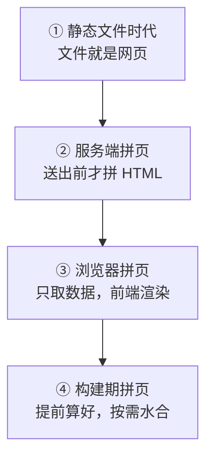
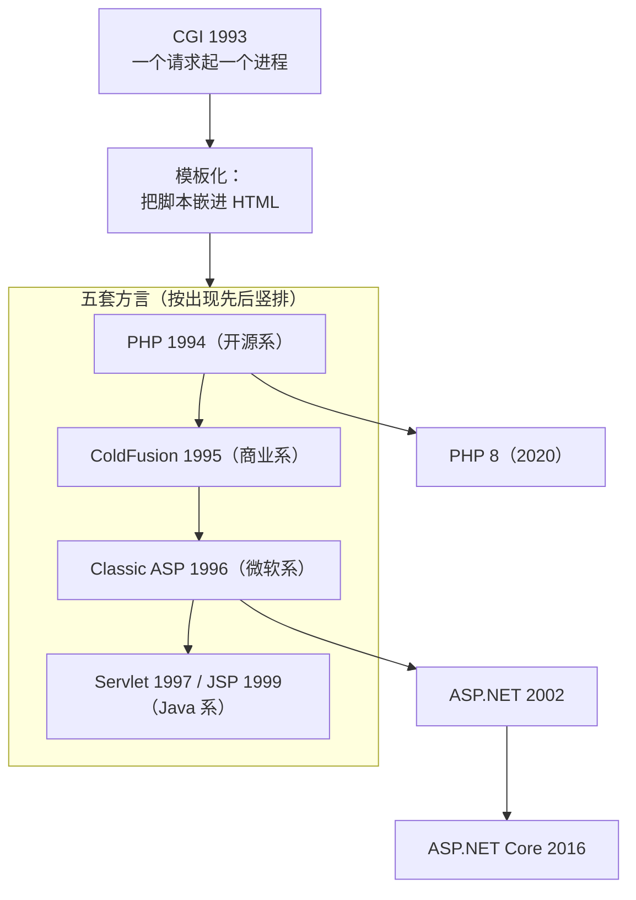
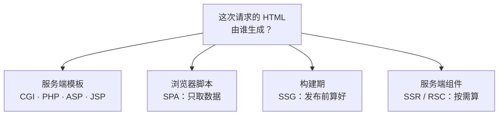

# 技术脉络：从静态页到前端工程

> **一句话**：网页的"动态"搬过三次家——**服务器现场拼 HTML** → **浏览器自己也拼**（前后端分离） → **构建期就拼好**（SSG/SSR）。每次搬家都是同一个矛盾的重新平衡：**交互性 vs 首屏速度与运维成本**。
> **读法**：先看 §1–§7 的故事线，每条约 3 分钟；再看 §8 的三条主线（那是"为什么"）；最后做 §9 自测。
> **配套**：浏览器与标准的年份见 [[16-技术演进时间线]]；本文补的是它没写的**服务端动态网页**与**工程化/类型**两条线。

**图 1** —— 动态的"三次搬家"。
这张图在说什么：**看箭头旁边的因果是下一节要讲的**——每一次搬家都不是审美变化，而是被上一代的代价逼出来的（改一个菜单要改一千个文件 → 交互只能整页刷新 → 首屏慢、包变大）。

## 1. 静态网页：文件即网页（1991–1995）

最早的 Web 服务器只做一件事：**把 URL 映射成文件，把文件原样递出去**。URL 是路径，页面是文件。这个模型今天仍然在——你打开的每个 `.html` 静态托管都是它。

它做不到三件事：**表单入库、登录态、个性化**。而且维护成本随页面数线性增长：站内菜单改一项，要改多少个文件就改多少个。

**第一个补丁是 SSI（服务端包含）**：在 HTML 里埋一行指令，服务器在送出前先把公共片段拼进去。

| 时间 | 事件 | 级别 | 出处 |
|---|---|---|---|
| 1994-01 | NCSA HTTPd 1.1 的发布公告里已出现 server-side include（旧式 `INC SRV` 指令） | 一手 | [www-talk 邮件列表存档](http://1997.webhistory.org/www.lists/www-talk.1994q1/0282.html) |
| 1994-04-11 | NCSA HTTPd 1.2 彻底重写 SSI 接口，改用 `<!--# ... -->` 注释语法，**与旧指令不兼容** | 一手 | [NCSA HTTPd 1.2 公告存档](http://www.krsaborio.net/internet/research/1994/0411.htm) |

> **注意**：该 1.1 公告只能证明 **1994-01 时 SSI 已存在**，不能证明它是哪个版本首次引入。至于"SSI 是 Rob McCool 在 1993–1994 年做的"这个常见说法，来源自称"关于 SSI 起源的确切信息很难找到"——**标存疑**。
> 但**思路本身**是确定的：**在内容里埋指令**，这个思路 ASP、PHP、JSP 全都在沿用——记住它，后面就顺了。

## 2. 服务端拼页：动态网页的第一代（1993–2005）

### 2.1 CGI：第一套通用做法

| 时间 | 事件 | 级别 | 出处 |
|---|---|---|---|
| 1993-11-17 | Rob McCool 在 www-talk 邮件列表发布 **CGP/1.0** 规范草案（原文："This is a preliminary specification of the Common Gateway Protocol, or CGP."）——这就是 CGI 的前身 | 一手 | [www-talk 存档](http://1997.webhistory.org/www.lists/www-talk.1993q4/0518.html) |
| 2004-10 | IETF 发布 **RFC 3875**（CGI/1.1, Informational）："该接口自 1993 年起就被 WWW 使用" | 一手 | [RFC 3875](https://www.rfc-editor.org/rfc/rfc3875.txt) |

CGI 的做法：服务器收到请求 → **启动一个外部程序** → 程序把生成的 HTML 打到标准输出 → 服务器转发。语言不限，这是它的优点；**一个请求起一个进程**，是它的致命代价——重、慢、容易被拖垮。

### 2.2 模板化：把脚本嵌进 HTML

CGI 太麻烦，于是各家都做了"**HTML 是外壳、脚本在里面生成内容**"的方言。它们同期出现、互相竞争，本质是同一件事：**页面还是 HTML，只是送出去之前才拼好**。

| 阵营 | 时间 | 事件 | 级别 | 出处 |
|---|---|---|---|---|
| 微软系 | 1996-12-10 | 微软随 **IIS 3.0** 发布 **Active Server Pages**（新闻稿原文："Active Server Pages enables rapid application development by allowing Web developers to combine HTML, scripting and components on the server."）| 一手 | [微软官方新闻稿](https://news.microsoft.com/source/1996/12/10/microsoft-ships-internet-information-server-3-0/) |
| 微软系 | 2002-02-13 | **.NET Framework 1.0 与 Visual Studio .NET** 正式发布活动（ASP.NET 随之而来；微软称 1 月已向 MSDN 订阅者提供最终版）| 一手 | [微软官方新闻稿](https://news.microsoft.com/source/2002/02/13/microsoft-launches-xml-web-services-revolution-with-visual-studio-net-and-net-framework) |
| 微软系 | 2002-01 | ASP.NET 1.0 首次发布的确切日期 | **存疑** | 微软一手仅能确认"1 月向订阅者提供 + 2 月 13 日发布活动"；另有资料记 1 月 5 日或 1 月 16 日 |
| 微软系 | 2016-06-27 | **ASP.NET Core 1.0** 发布（跨平台重写）| 一手 | [微软 .NET 官方博客](https://devblogs.microsoft.com/dotnet/announcing-asp-net-core-1-0/) |
| Java 系 | 1997-06 | **Java Servlet 1.0** 规范定稿 | 二手 | [维基百科](https://en.wikipedia.org/wiki/Jakarta_Servlet) |
| Java 系 | 1999-09-27 | **JSP 1.0** 规范 Final Release（规范封面自述 "Release: September 27th, 1999"）| 一手 | [JSP 1.0 规范 PDF](http://download.oracle.com/otn-pub/jcp/7322-jsp-1.0-fr-spec-oth-JSpec/jsp1_0-spec.pdf) |
| 开源系 | 1994 → 2020 | **PHP**：1994 雏形（CGI 二进制）· 1995-06 源码公开 · 1997-11 PHP/FI 2.0 · 1998-06 PHP 3.0 · 2000-05 PHP 4.0 · 2004-07 PHP 5.0 · 2015-12-03 PHP 7.0 · 2020-11-26 PHP 8.0 | 一手 | [php.net 历史页](https://www.php.net/manual/en/history.php.php) · [PHP 7.0 公告](https://www.php.net/archive/2015.php) · [PHP 8.0 公告](https://www.php.net/archive/2020.php) |
| 商业系 | 1995-07 | **ColdFusion** 首次发布（当时叫 Cold Fusion）| **存疑** | [维基百科](https://en.wikipedia.org/wiki/Adobe_ColdFusion) |

### 2.3 另一条支线：把 MVC 带进 Web（2004–2005）

模板化写大了就难维护，于是服务端框架开始引入模式与约定：

| 时间 | 事件 | 级别 | 出处 |
|---|---|---|---|
| 2004-07-24/25 | **Ruby on Rails 0.5.0** 首次公开发布（作者自述："Real Artists Ship"）| 一手 | [邮件列表公告存档](https://rubytalk.org/t/ann-rails-0-5-0-the-end-of-vaporware/12744) |
| 2005-07-13 | **Django** 公开仓库的首个提交（官方十周年回顾文："just before lunch on July 13, 2005"）| 一手 | [djangoproject.com 官方博客](https://www.djangoproject.com/weblog/2015/jul/13/happy-10th-birthday-django/) |

### 2.4 这一代留下的结构性问题

**图 2** —— 服务端模板的家族树：**一个根（CGI），五条方言，两条还活着并继续演化**（PHP、微软系）。
这张图在说什么：**ASP 和 JSP 不是"网页技术"，而是服务端模板语言的两个阵营代表**（微软系 vs Java 系）。它们的地位是被后面的**前后端分离**改变的，不是被 TypeScript 取代的——TS 和它们根本不在同一层（见 §6）。

1. **业务逻辑与展示逻辑长在同一个文件里**：公式是"一个页面 = 一段模板 + 一段 SQL"；
2. **前端只剩 HTML/CSS + 一点点表单校验**，写前端的人没有独立阵地；
3. **服务端必须把整页 HTML 算完再发**——所以交互只能整页刷新。第 3 条是后面所有故事的起点。

## 3. 浏览器接管：页面上的第二台"服务器"（1995–2006）

### 3.1 JavaScript 的仓促出身

| 时间 | 事件 | 级别 | 出处 |
|---|---|---|---|
| 1995 | Brendan Eich 在网景用**大约十天**做出原型（HOPL 论文原文："created at Netscape in a ten-day hack"；具体到 5 月某日是二手说法）| 二手 | [ACM HOPL 论文（站点反爬，正文未取到）](https://dl.acm.org/doi/10.1145/3386327) |
| 1995-09-18 | 以 **LiveScript** 之名随 Netscape Navigator 2.0 beta 首次出现 | 二手 | [Web Design Museum（反爬）](https://webdesignmuseum.org/software/netscape-navigator-2-0-in-1995) |
| 1995-12 | 网景与 Sun 联合宣布改名 **JavaScript**（**与 Java 没有语言血缘**，名字是配合当时市场宣传）| 二手 | [维基百科（ECMAScript 条目）](https://en.wikipedia.org/wiki/ECMAScript) |
| 1996 | 微软在 **IE 3.0** 里做出 **JScript**（同一语言的另一实现）| 二手 | [美国国会图书馆格式描述（反爬，正文未取到）](https://www.loc.gov/preservation/digital/formats/fdd/fdd000443.shtml) |
| 1997-06 | **ECMA-262 第 1 版**通过（规范封面自述 "adopted by the ECMA General Assembly of June 1997"；源头技术列为 JavaScript 与 JScript）| 一手 | [Ecma 官方 PDF](https://ecma-international.org/wp-content/uploads/ECMA-262_1st_edition_june_1997.pdf) |

> 关于"JS 与 Java 无血缘"：**能核到的是间接证据**——ECMA-262 第 1 版把源头技术写成 JavaScript（Netscape）与 JScript（Microsoft），没有 Java；另有 TC39 早期文件称 ECMAScript 语法"刻意模仿 Java 语法"（相似 ≠ 血缘）。网景或 ECMA 逐字声明"无血缘"的原句**未核到**。

### 3.2 DHTML：不刷新也能改页面

| 时间 | 事件 | 级别 | 出处 |
|---|---|---|---|
| 1997-03 | W3C 公开邮件列表里出现 "Dynamic HTML" 的公开用法（该邮件串标题为 "Re: FW: IE4.0 and W3C Standards"）| 一手（同期使用证据）| [lists.w3.org 存档](https://lists.w3.org/Archives/Public/www-talk/1997MarApr/0005.html) |
| 1997-06 | Netscape 4（含 Navigator 4.0）发布 | 二手 | 维基/第三方 |
| 1997-09 | 微软 **Internet Explorer 4.0** 发布，引入较完整的 DOM 访问 | **存疑** | **来源冲突**：维基记 1997-09-22，Web Design Museum 与 CNN 存档记 1997-09-30；微软官方发布说明未核到 |

**DHTML 不是一个规范**，而是"HTML + CSS + 脚本配合起来动页面"的俗称。它的历史意义在于：浏览器第一次能**精确地改页面的一部分**，而不必重来一遍。**但没有标准**，于是 Netscape 和 IE 各写各的，这直接催生了下一行。

| 时间 | 事件 | 级别 | 出处 |
|---|---|---|---|
| 1998-10-01 | **W3C DOM Level 1 成为 Recommendation**（规范封面："W3C Recommendation 1 October, 1998"）| 一手 | [w3.org 规范页](https://www.w3.org/TR/1998/REC-DOM-Level-1-19981001/cover.html) |

### 3.3 XMLHttpRequest：被忽视十年的能力

| 时间 | 事件 | 级别 | 出处 |
|---|---|---|---|
| 1999（随 IE5）| 微软在 MSXML 里以 ActiveX 形式提供 **XMLHTTP**（`ActiveXObject("Msxml2.XMLHTTP")`），用于 Outlook Web Access | 二手 | [维基百科](https://en.wikipedia.org/wiki/XMLHttpRequest) |
| 2002 | **Mozilla**（Gecko）把它实现为 `XMLHttpRequest` 对象（Gecko 0.6 起可访问、1.0/2002-06-05 起完全可用）| 二手 | [维基百科](https://en.wikipedia.org/wiki/XMLHttpRequest) |
| 2006-04-05 | W3C 发布 **XMLHttpRequest 规范首个工作草案**（自述"首次发布"、源自 WHATWG Web Applications 1.0）| 一手 | [w3.org 规范页](https://www.w3.org/TR/2006/WD-XMLHttpRequest-20060405/) |
| 2006-10-18 | 微软在 **IE7** 里加入原生 `XMLHttpRequest` 标识（IE7 发布日期）| 二手 | [维基百科](https://en.wikipedia.org/wiki/Internet_Explorer_7.0) |

**这段最值得记住**：能力在 **1999 年就有了**，但七年之后才被做成产品体验——**技术存在 ≠ 技术被使用**。

### 3.4 Ajax 与 jQuery：把能力变成日常

| 时间 | 事件 | 级别 | 出处 |
|---|---|---|---|
| 2004-04-01 | **Gmail** 预览版上线（官方新闻稿）| 一手 | [Google 官方新闻稿](https://googlepress.blogspot.com/2004/04/google-gets-message-launches-gmail.html) |
| 2005-02-08 | **Google Maps** 上线（官方博客原文 "we've designed Google Maps to simplify how to get from point A to point B"，现仅存档可访问）| 一手 | [官方博客存档](https://web.archive.org/web/20100525190011/http://googleblog.blogspot.com/2005/02/mapping-your-way.html) |
| 2005-02-18 | Jesse James Garrett 发表《Ajax: A New Approach to Web Applications》，**"Ajax" 一词诞生** | 一手 | [作者本人站](https://jessejamesgarrett.com/2025/02/18/ajax-at-20/) |
| 2006-01-14 | **jQuery 发布**（在 BarCampNYC 宣布）| 一手 | [jquery.com 官方历史页](https://jquery.com/history/) |
| 2006-08-26 | jQuery **1.0 首个稳定版** | 一手 | [jquery.com 官方历史页](https://jquery.com/history/) |

> 别把这两件事混了：**2006-01-14 是发布，2006-08-26 才是 1.0**。
> jQuery 统治十年的原因很实在：**浏览器差异 + DOM 难用**。它把"兼容各种浏览器"这件事收进了一个库——直到浏览器自己统一了 API，它才退场。

## 4. 数据与接口：让服务端只回数据（2000–2017）

这一节是"前后端分离"的**技术前提**：接口要有通用形态，前端才可能独立。

| 时间 | 事件 | 级别 | 出处 |
|---|---|---|---|
| 2000 | Roy Fielding 博士论文提交；其**第 5 章首次系统阐述 REST**（Representational State Transfer）| 一手 | [作者在 UCI 的论文页](https://www.ics.uci.edu/~fielding/pubs/dissertation/top.htm) |
| 2000-05-08 | W3C 发布 **SOAP 1.1**（W3C Note，非 Recommendation）——与 REST 对立的另一条路线 | 一手（**本机未复核**：该页两次取数均为空/403）| [w3.org 规范页（本机两次取数为空，未复核）](https://www.w3.org/TR/2000/NOTE-SOAP-20000508/) |
| 2001 | **JSON 首次在 JSON.org 公开**（Ecma 官方标准原文："JSON was first presented to the world at the JSON.org website in 2001."）| 一手 | [Ecma ECMA-404 官方 PDF](https://ecma-international.org/wp-content/uploads/ECMA-404_1st_edition_october_2013.pdf) |
| 2006-07 | IETF 发布 **RFC 4627**（`application/json`）| 一手 | [RFC 4627](https://www.rfc-editor.org/rfc/rfc4627.txt) |
| 2013-10 | Ecma 发布 **ECMA-404**（JSON 数据交换格式，第 1 版）| 一手 | [Ecma 官方 PDF](https://ecma-international.org/wp-content/uploads/ECMA-404_1st_edition_october_2013.pdf) |
| 2017-12 | IETF 发布 **RFC 8259**（STD 90，取代 RFC 7159/4627）| 一手 | [RFC 8259](https://www.rfc-editor.org/info/rfc8259/) |

## 5. 前后端分离与 SPA：前端成为独立工种（2010–2014）

| 时间 | 事件 | 级别 | 出处 |
|---|---|---|---|
| 2010-10-13 | **Backbone.js** 首次发布（"为构建单页应用提供最小数据结构与视图"）| 二手 | [维基百科](https://en.wikipedia.org/wiki/Backbone.js) |
| 2010-10-20 | **AngularJS** 开源发布（2009 年起在内部开发）| 二手 | [维基百科](https://en.wikipedia.org/wiki/AngularJS) |
| 2011-12-08 | **Amber.js** 公布（作者本人博客，后因重名改为 **Ember.js**）| 一手 | [作者博客](https://yehudakatz.com/2011/12/08/announcing-amber-js/) |
| 2013-05 / 2014-02 | React 开源 / Vue.js 出现（见 [[16-技术演进时间线]]）| 二手 | 库内既有口径 |

**"前后端分离"到底分开了什么**：从前是"服务端发页面、浏览器只做些点缀"；现在是**服务端只发数据，浏览器负责渲染和路由**。由此：

- **路由**从前端的 URL 变化负责（不再整页请求）；
- **状态**从前端自己管（因为页面不再重载）；
- **前端从"写页面的人"变成"独立工种"**——这直接催生了 §6 的整套工程化。

## 6. 工程化与类型：一门语言长出一个行业（2009–2021）

### 6.1 让 JS 跑在浏览器之外

| 时间 | 事件 | 级别 | 出处 |
|---|---|---|---|
| 2009-01-29 | Kevin Dangoor 发文《What Server Side JavaScript needs》，**ServerJS 项目启动**（同年更名 **CommonJS**）——"服务端 JS 需要什么"的讨论起点 | 一手 | [作者本人博客](https://www.blueskyonmars.com/2009/01/29/what-server-side-javascript-needs/) |
| 2009-11-08 | **Ryan Dahl 在 JSConf 首次公开 Node.js**（讲稿 PDF 题注 2009-11-08）| 一手 | [讲稿 PDF](https://tinyclouds.org/jsconf.pdf) · [JSConf 会务页](https://www.jsconf.eu/2009/video_nodejs_by_ryan_dahl.html) |
| 2009-05-27 | Node.js **v0.0.1** 首个发布版 | 二手 | 仅存于原项目页镜像；nodejs.org 的 dist 目录已无 v0.0.1，官方 changelog 最早为 v0.0.3 |
| 2010-01-12 | **npm 首版发布** | 二手 | 维基百科转引已失效的 npm 官方博文；作者访谈只精确到"2010 年初" |

**Node 的意义**不在"用 JS 写服务端"，而在于：**JS 从此能跑命令行**——依赖管理、构建、测试、脚本全都成为可能。前端工程化由此开始。

### 6.2 模块化与打包器：浏览器装不下那么多文件

| 时间 | 事件 | 级别 | 出处 |
|---|---|---|---|
| 2012-03-11 | **webpack 0.1.0** 发布（npm registry 显示包创建与首个版本同日）| 一手 | [registry.npmjs.org](https://registry.npmjs.org/webpack) |
| 2015-05-14 | **Rollup 0.1.0** 发布 | 一手 | [registry.npmjs.org](https://registry.npmjs.org/rollup) |
| 2017-09-05 | **Chrome 61 原生支持 `<script type="module">`**——浏览器终于认 ESM | 一手 | [Chrome 官方博客](https://developer.chrome.com/blog/new-in-chrome-61) |
| 2017-12-05 | **Parcel 1.0.0** 发布（零配置打包器）| 一手 | [registry.npmjs.org](https://registry.npmjs.org/parcel-bundler) |
| 2019-02-08 | **SWC 1.0** 发布（Rust 写的编译器）| 一手 | [官方博客](https://swc.rs/blog/swc-1) |
| 2020-04-13 | **esbuild 0.1.0** 发布（Go 写的打包器；仓库创建约在 2020-01）| 一手 | [registry.npmjs.org](https://registry.npmjs.org/esbuild) |
| 2020-04-21 | **Vite 0.1.0** 发布（开发期不打包、用浏览器原生 ESM；生产期仍打包）| 一手 | [registry.npmjs.org](https://registry.npmjs.org/vite) |
| 2021-02-16 | **Vite 2.0**——官方明确"这是 Vite 的首个稳定版"（跳过了 1.0 正式版）| 一手 | [官方博客](https://vite.dev/blog/announcing-vite2) |

### 6.3 TypeScript：迟到的类型层

| 时间 | 事件 | 级别 | 出处 |
|---|---|---|---|
| 2009-12-24 | **CoffeeScript 0.1.0**（编译成 JS 的语言，同期竞品）| 二手 | [维基百科](https://en.wikipedia.org/wiki/CoffeeScript) |
| 2012-10-01 | **TypeScript 0.8 首次公开**（微软官方十周年文："10 years ago today, on October 1st, 2012, TypeScript was unveiled publicly for the first time."）| 一手 | [微软 TypeScript 官方博客](https://devblogs.microsoft.com/typescript/ten-years-of-typescript/) |
| 2014-04-02 | **TypeScript 1.0 正式发布** | **存疑** | [官方博客](https://devblogs.microsoft.com/typescript/announcing-typescript-1-0/) |
| 2014-11-18 | Facebook 开源 **Flow**（另一个 JS 静态类型检查器）| 一手 | [Meta 工程博客](https://engineering.fb.com/2014/11/18/web/flow-a-new-static-type-checker-for-javascript/) |

**TS 的定位要说清**：它不是"替代 JavaScript"，而是**JS 之上的类型层**——浏览器只认 JS，TS 必须被编译掉。
它要解决的问题是：**JS 动态类型 + 浏览器差异，项目一大就崩**；TS 把一整类错误从"运行时"挪到"编译期"。同期竞争者是 CoffeeScript、Flow，它赢在"**JS 的超集**（存量代码能渐进迁移）+ 微软持续投入 + `@types` 生态"。

## 7. 静态的回归：从"发文件"到"提前算好"（2015– 现在）

| 时间 | 事件 | 级别 | 出处 |
|---|---|---|---|
| 2015 | **JAMstack** 一词出现 | **存疑** | [Netlify 官方博文](https://www.netlify.com/blog/the-jamstack-definition-evolved) |
| 2015-05-21 | **Gatsby 0.0.1** 发布（静态生成器；作者自述"2015 年 5 月下旬"）| 一手 | [registry.npmjs.org](https://registry.npmjs.org/gatsby) |
| 2016-10-25 | **Next.js 开源**（Vercel 官方博客；基于 React 的服务端渲染框架）| 一手 | [官方博客](https://vercel.com/blog/next) |
| 2016-10-26 | **Nuxt 0.0.1** 发布（Vue 阵营对应物）| 一手 | [registry.npmjs.org](https://registry.npmjs.org/nuxt) |
| 2019 / 2020-08-11 | **岛屿架构**：术语由 Etsy 的 Katie Sylor-Miller 于 2019 年提出，Preact 作者 Jason Miller 于 2020-08-11 撰文推广（作者本人在博文中自述）| 一手 | [jasonformat.com](https://jasonformat.com/islands-architecture/) · [Astro 官方文档](https://docs.astro.build/en/concepts/islands/) |
| 2020-12-21 | **React Server Components 首次公开**（当时定位为研发中功能）| 一手 | [React 官方博客](https://react.dev/blog/2020/12/21/data-fetching-with-react-server-components) |
| 2021-03-12 | **Astro 0.0.1** 发布 | 一手 | [registry.npmjs.org](https://registry.npmjs.org/astro) |
| 2021-11-22 | **Remix v1** 开源发布 | 一手 | [官方博客](https://remix.run/blog/remix-v1) |
| 2022-08-09 | **Astro 1.0** | **存疑** | [Astro 官方博客](https://astro.build/blog/astro-1/) |
| 2020-05-13 | **Deno 1.0** 发布（官方文："Finally on May 13, exactly two years after Ryan's original Deno presentation, we cut the 1.0."）| 一手 | [官方博客](https://deno.com/blog/v1) |
| 2022-07-05 / 2023-09-08 | **Bun** 公开发布（0.1.1）/ **Bun 1.0** | 一手 | [官方博客](https://bun.sh/blog/bun-v1.0) · [GitHub release](https://github.com/oven-sh/bun/releases/tag/bun-v0.1.1) |

**图 3** —— 同一个问题（"HTML 由谁生成"）的四种答案，也是本文 §2→§3→§5→§7 的全部内容。
这张图在说什么：**这四格不是替代关系，而是四种取舍**——今天一个真实项目里常常**同时存在**（静态页 + 若干动态接口 + 少量客户端组件）。

## 8. 三条主线：为什么会这样摆

1. **谁在渲染 HTML**（上面图 3）——从服务器 → 浏览器 → 构建期/服务端组件。摆动的动力始终是两个成本：**首屏速度**与**运维/包体积成本**。所以"静态回归"不是回头路，而是**主动选择**：能提前算的都提前算，把交互面积（要发的 JS）压到最小。
2. **数据和展示的分家**——CGI 时代"一个页面 = 一段模板 + 一段 SQL"；REST/JSON 让接口有了通用形态（§4），SPA 让浏览器接管渲染（§5）。**分家的前提是接口标准化，不是框架出现了**。
3. **类型与工程化是"项目变大"的产物**——Node（2009）让 JS 有了命令行，于是才有依赖管理、打包、测试；TypeScript（2012）是在"JS 项目规模超过人力记忆"之后才被接受的。**顺序不能颠倒**：先有规模，才有工具。

## 9. 自测（先答后看）

**Q1** 静态网页的最大维护问题是什么？SSI 用什么办法缓解？

答案与解析

维护成本随页面数线性增长（改一处公共内容要改所有页面）。SSI 的做法是**在 HTML 里埋指令**，由服务器在送出前把公共片段拼进去——这就是后来"模板化"的思路源头。

**Q2** CGI 的主要代价是什么？为什么后来变成"模板内嵌"而不是继续用 CGI？

答案与解析

CGI **一个请求启动一个进程**，重、慢、易被拖垮。模板内嵌（PHP/ASP/JSP）把"生成 HTML"留在服务器进程内完成，省掉进程启动开销，并且写起来更像"在页面里写脚本"。

**Q3** Classic ASP、JSP、PHP 属于同一类东西吗？它们后来分别变成了什么？

答案与解析

都属于**服务端模板语言**（同一类，不同阵营）：微软系（Classic ASP → ASP.NET 2002 → ASP.NET Core 2016）、Java 系（Servlet 1997 / JSP 1999）、开源系（PHP 一路到 2004 的 PHP 5、2020 的 PHP 8）。

**Q4** 为什么说"XMLHttpRequest 在 1999 年就有了，但 Ajax 要到 2005 年"？

答案与解析

能力在 IE5 的 MSXML（ActiveX）里就有了，但**技术存在不等于被使用**：还需要 Gmail、Google Maps 这类产品把体验做出来，再需要 2005-02-18 的命名把它变成"一个可以讨论的做法"。

**Q5** TypeScript 与 ASP/JSP 是同一层的东西吗？它替代了谁？

答案与解析

不是同一层。ASP/JSP 是**服务端模板语言**；TypeScript 是 **JavaScript 之上的类型层**（浏览器不认 TS，必须编译成 JS）。它要竞争的是 CoffeeScript、Flow 这类"写起来更好的 JS"，不是服务端模板。

**Q6** "静态回归"（SSG）跟 1990 年代的静态网页，差别在哪？

答案与解析

第一代静态页是**被动**的：服务器只会递文件。现在的静态是**主动选择**：构建期用框架把 HTML 算好，只给需要交互的部分发 JS。**同样是"静态"，前者受限于能力，后者是权衡的结果。**

## 10. 依据说明

- **有官方依据的部分**：§1–§7 各表中的日期与事件，凡标【一手】的均给出规范原文/官方新闻稿/官方博客/npm registry/邮件列表存档，URL 逐条列在表中；本文 **65 条外链**已由本代理逐条实测：**57 条直连返回 HTTP 200**；其余 8 条为站点反爬或本机 SSL 抖动，已用真浏览器（headless Chrome）复核正文——其中 ACM 数字图书馆、美国国会图书馆、Medium、Web Design Museum 四家确认为**反爬而非死链**；W3C 的 SOAP 1.1 Note 两次取数均失败，故该条标"未复核"。
- **属本人编排判断（无官方依据）**："三次搬家"的划分与命名、§2.4 的三条结构性问题、§8 的三条主线、"为什么这样摆"的全部解释、§9 自测题——都是**叙述与教学编排**，不是任何标准的规定。
- **标【存疑】的条目**（照写冲突，未自选）：ASP.NET 1.0 首发日（2002-01-05 / 01-16 / 微软口径）、Java Servlet 1.0（1997-06 / 1996-12）、JSP 1.0（1999-09-27 一手 / 1999-06 二手）、ColdFusion（1995-07-02 / 07-10）、IE 4.0（1997-09-22 / 09-30）、TypeScript 1.0（2014-04-02 / 04-12）、Astro 1.0（2022-08-09 / 08-10）、JAMstack 术语（2015 提出 / 2016 普及）、SSI 起源（无一手确证）。
- **未核到（本文相关）**：SSI 首次引入的精确版本；"JavaScript 与 Java 无血缘"的网景/ECMA 逐字原句（仅有源头技术清单与"语法刻意模仿 Java"的间接证据）；DHTML 概念的首次提出者与首次定义文档；Netscape 官方发布说明（原站已被 AOL 接管）；Node v0.0.1 与 npm 首版的现存官方一手页面（前者仅存镜像，后者官方博文已失效）。
