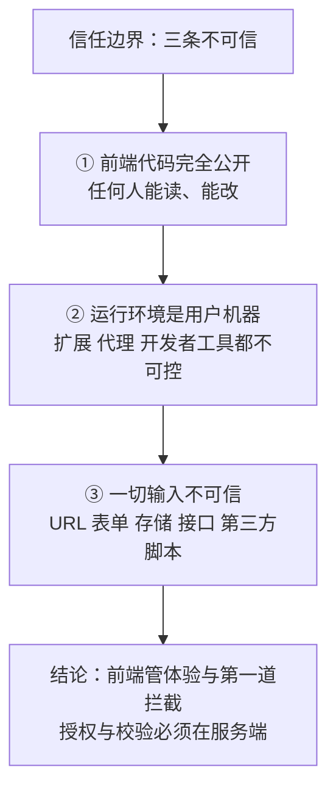
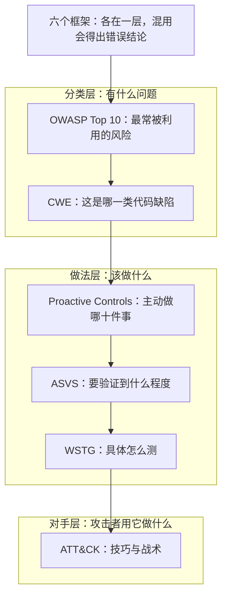
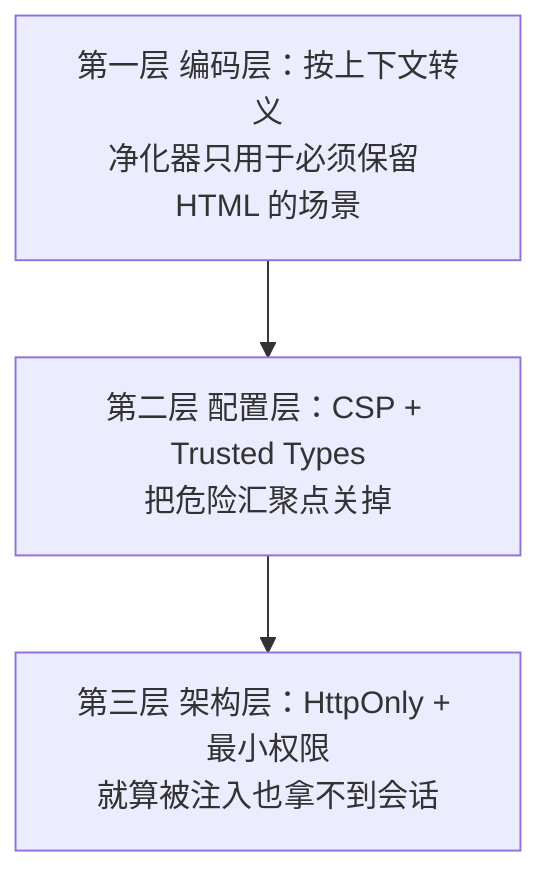
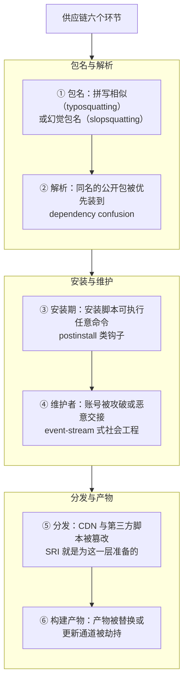
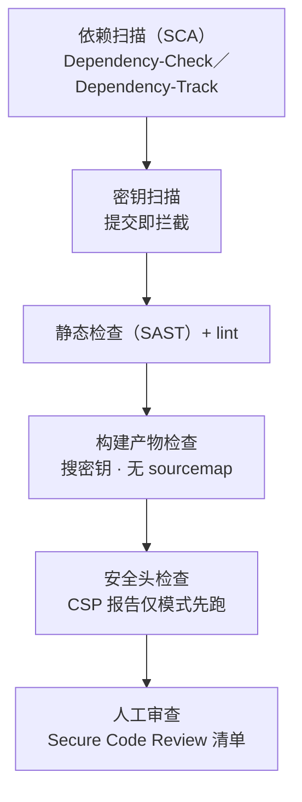

# 模块十一 前端安全

> **一句话**：前端代码本来就是公开的——这一模块教你分清「哪些东西本来就藏不住」「哪些防线是真的」「哪些校验必须由服务端自己再做一次」，并把安全变成开发流程里的一道门，而不是最后补的一课。
> **自学时长**：建议 8～10 小时（可分 3～4 次学完） · **前置**：模块一 ～ 模块九（能读 HTML／CSS／JS，知道同源策略）
> **怎么学**：§2.1 与 §2.2 打地基（信任边界 + 框架分层）；§2.3 ～ §2.7 是五类可各自独立阅读的防御；§2.8 把安全接进开发流程；**§2.9 是法律与伦理边界——它必须最先读**，后面每一节都建立在它的前提上。全篇**只讲机制与防御，不含任何可直接使用的攻击载荷或绕过步骤**；要练手，一律去合法靶场。
> **学完你能判断**：
> - **判断**一个值「被任何人拿到会发生什么」，并据此决定它能不能出现在前端产物里；
> - **判断**一次注入类问题的病根是不是「同一串字符在一个位置上被当成了代码」，并说出编码层／配置层／架构层各自负责什么；
> - **判断**一个漏洞属于 OWASP Top 10 的哪一类、该由 CWE 还是 ATT&CK 承载，并说清这两套编号为什么不能互相代替；
> - **判断**一条安全要求该由前端还是服务端负责，并为自己的小项目画出信任边界与上线自检清单。

## 1. 心智模型

前端安全里最反直觉的一件事是：**你花力气保护的「前端代码」本身没有保护价值**——它已经完整地躺在每个访问者的浏览器里，任何人都能读、能改、能替换。真正的保护对象不是代码，而是**代码能碰到的东西**。

把这句话拆成三条「不可信」和一条结论，本模块所有细节都挂在这四行上：

1. **前端代码不可信地公开**：你的 JS 在用户的机器上跑，规则由那台机器说了算；
2. **运行环境不可控**：浏览器扩展、代理、开发者工具，都在你够不着的地方；
3. **一切输入不可信**：URL、表单、本地存储、接口返回、第三方脚本，全都可能是别人塞进来的；
4. **结论**：前端只做「体验」与「第一道拦截」，**真正的授权与校验必须在服务端**。



**图 1** —— 前端安全的三条「不可信」与一条结论。
这张图在说什么：**只要有一处你把不可信的东西当成可信的（尤其是「前端已经校验过了」），后面所有防御都会漏**。

还要一次记住三个保护对象：**用户的数据与设备**、**用户的会话**、**你的服务端**——它们都不是你的前端代码。后面五节的防御，全部是在替这三个对象做事。

## 2. 精讲（按节推进）

### 2.1 信任边界：三个反直觉问题的正面回答  ⏱ 约 45 分钟

**白话定义**：**信任边界**就是「哪些数据从哪来、能不能信」的那条线。跨过这条线进来的东西，一律按「攻击者可控」处理——不能因为「它是从我的页面上发出来的」就放行。前端安全的所有判断都从这里出发。

**问题一：前端代码全公开，那还谈什么安全？**
保护对象不是代码，而是代码能碰到的东西。你的 JS 在用户浏览器里跑，它能读页面上的一切、能发请求带上用户的 cookie、能访问浏览器存储。所以攻击者一旦能让**你的代码之外的东西**混进来（一段被注入的脚本、一个被投毒的依赖），它就在「你的」页面里以「你的」身份行动。前端安全的全部工作就是回答两件事：**别让不该进来的东西进来**；**进来了也别让它拿到会话与数据**。

**问题二：我把按钮隐藏了，为什么说这不是权限控制？**
判断标准只有一句话：**这个请求换一个客户端发过来，服务端还认不认？** 服务端不校验身份与权限，前端藏得再深（隐藏按钮、前端路由守卫、`disabled` 属性）都只是**体验优化**。这也是 OWASP 长期把**失效的访问控制**排在第一位的含义：问题不在前端画得多好，而在服务端有没有每次校验。

**问题三：CSP 和输出转义，到底谁管谁？**
两者防的不是同一件事：**转义／净化管「数据被当成代码」**（数据不能变成可执行的东西）；**CSP 管「代码从哪来」**（就算是代码，也不许来自不该来的地方）。少了任何一层都有洞——只转义不上 CSP，一次转义疏漏就是完全失守；只上 CSP 不转义，遇到允许来源被攻破或被绕过的写法仍然失守。**它们是两条独立的防线，不是一条防线的两个档次。**

**怎么自己看到它**：在 DevTools 的 Console（`Ctrl+Shift+J`）里对任意页面执行 `document.cookie`，看你能读到哪些、读不到哪些（标了 `HttpOnly` 的读不到）；再到 Sources 面板打开任意站点的脚本文件，看它是不是原样可见。这两步会让你对「公开」两个字有实感。

> **自检**：前端做了表单校验，服务端是不是就可以不校验了？为什么？

### 2.2 框架分层：六个框架各答一个问题  ⏱ 约 55 分钟

**白话定义**：安全圈有多个框架，它们**不在同一层**——混用会得出错误结论。你只需要记住「每个框架回答哪个问题、我在什么场景下翻它」。

| 框架 | 它回答的问题 | 层次 | 本模块用法 |
|---|---|---|---|
| **OWASP Top 10** | 最常被利用的**风险类别**有哪些（按普遍性排序） | 风险分类（含统计） | §2.3～§2.7 的分类骨架 |
| **OWASP Proactive Controls 2024** | **开发者**该主动做哪十件事 | 正向做法（C1–C10） | §2.8 的流程骨架 |
| **OWASP ASVS 5.0.0** | 应该**验证到**什么程度（可核验要求清单） | 验收标准 | §2.8 的上线自检 |
| **OWASP WSTG** | 具体怎么**测**（含 15 项客户端测试） | 测试方法 | §2.8 的测试清单 |
| **MITRE CWE** | 这是**哪一类代码缺陷**（CWE-79／352／1321…） | 缺陷分类 | 每条漏洞的「学名」 |
| **MITRE ATT&CK** | 攻击者**用它来做什么行为**（技巧／战术） | 对手行为 | §2.3～§2.7 的「攻击者视角」列 |



**图 2** —— 六个安全框架各在哪一层。
这张图在说什么：**框架混用会得出错误结论**——「ATT&CK 里找不到 XSS」不是「XSS 不重要」，而是你问错了框架；缺陷类问题归 CWE，行为类问题归 ATT&CK。

#### 2.2.1 OWASP Top 10：2025 与 2021 的对照（**2025 版已正式发布**）

| 2021 | 2025 | 说明 |
|---|---|---|
| A01:2021 Broken Access Control | **A01:2025 Broken Access Control** | 连续第一 |
| A05:2021 Security Misconfiguration | **A02:2025 Security Misconfiguration** | 大幅上升 |
| A06:2021 Vulnerable and Outdated Components | **A03:2025 Software Supply Chain Failures** | **从「组件过期」升级为整条供应链**——这正是 §2.6 的由来 |
| A02:2021 Cryptographic Failures | A04:2025 Cryptographic Failures | |
| A03:2021 Injection | A05:2025 Injection | XSS 属这一类 |
| A04:2021 Insecure Design | A06:2025 Insecure Design | |
| A07:2021 Identification and Authentication Failures | A07:2025 Authentication Failures | |
| A08:2021 Software and Data Integrity Failures | A08:2025 Software or Data Integrity Failures | 对应在前端就是 SRI／lockfile |
| A09:2021 Security Logging and Monitoring Failures | A09:2025 Security Logging and Alerting Failures | |
| A10:2021 Server Side Request Forgery (SSRF) | **A10:2025 Mishandling of Exceptional Conditions** | 新增：异常处理不当（含失败信息泄露、错误状态处理） |

> 出处：[OWASP Top 10 项目页](https://owasp.org/www-project-top-ten/) ｜ [Top 10:2025 清单](https://owasp.org/Top10/2025/) ｜ [Top 10:2021 清单](https://owasp.org/Top10/2021/)。**两版并存**：2021 仍是大量企业合规的现行引用版本，写简历与做评估时说清版本。

#### 2.2.2 ATT&CK：怎么用，以及**它的边界**

ATT&CK 当前为 **v19.2**（v19 主版本 2026-04，v19.2 敏捷版本 2026-08-06）【版本页与更新页对 v19.2 起始日表述不一致，此处照写冲突】。v19 起企业矩阵把原来的 **Defense Evasion 拆成 Stealth（TA0005）与新增的 Defense Impairment（TA0112）**，企业战术总数为 15 条。

**怎么把前端问题映射上去**（每类都标出所属战术）：

| 前端常见问题 | 对应的对手行为（ATT&CK） | 战术 |
|---|---|---|
| 注入类漏洞被利用 | [T1190 利用公开面向的应用程序](https://attack.mitre.org/techniques/T1190/) | Initial Access |
| 用户「只是访问了一个网页」就中招 | [T1189 偷渡式入侵](https://attack.mitre.org/techniques/T1189/) | Initial Access |
| 依赖／开发工具被投毒 | [T1195.001 供应链侵害：软件依赖与开发工具](https://attack.mitre.org/techniques/T1195/001/) | Initial Access |
| 应用本体或更新通道被篡改 | [T1195.002 供应链侵害：软件供应链](https://attack.mitre.org/techniques/T1195/002/) | Initial Access |
| 恶意 JS 被执行（浏览器或宿主环境） | [T1059.007 命令与脚本解释器：JavaScript](https://attack.mitre.org/techniques/T1059/007/) | Execution |
| 服务器上被留下可复用的组件 | [T1505.003 服务器软件组件：Web Shell](https://attack.mitre.org/techniques/T1505/003/) | Persistence |
| 会话 cookie 被窃取（注入脚本或恶意代理） | [T1539 窃取 Web 会话 Cookie](https://attack.mitre.org/techniques/T1539/) | Credential Access |
| 反向代理钓鱼中继真实站点 | [T1557 中间人](https://attack.mitre.org/techniques/T1557/) | Credential Access / Collection |
| 登录页前端脚本被篡改以捕获凭据 | [T1056.003 输入捕获：Web 门户捕获](https://attack.mitre.org/techniques/T1056/003/) | Collection / Credential Access |
| 浏览器会话被接管 | [T1185 浏览器会话劫持](https://attack.mitre.org/techniques/T1185/) | Collection |
| 克隆／伪造登录站捕获 MFA 令牌 | [T1111 多因素认证拦截](https://attack.mitre.org/techniques/T1111/) | Credential Access |
| 把通信混进正常 Web 流量 | [T1071.001 应用层协议：Web 协议](https://attack.mitre.org/techniques/T1071/001/) | Command and Control |
| 数据外传到云存储 | [T1567.002 通过 Web 服务外泄：云存储](https://attack.mitre.org/techniques/T1567/002/) | Exfiltration |
| 前端侧隐藏／夹带（HTML 夹带、SVG 夹带、不可见 Unicode） | [T1027 混淆的文件或信息](https://attack.mitre.org/techniques/T1027/)（子技巧 .006／.017／.018） | Stealth |
| 应用层洪泛打垮服务 | [T1499 端点拒绝服务](https://attack.mitre.org/techniques/T1499/)（.003 应用层耗尽） | Impact |

**边界（必须写清，不许硬套）**：

1. **ATT&CK 不是漏洞清单**。官方在《Get Started》里明确：「**ATT&CK 矩阵只记录已观测到的真实对手行为**」，并把 Tactics 定义为「**为什么**」、Techniques 定义为「**怎么做**」。
2. 因此 **XSS、CSRF 这类「代码缺陷」本身在 ATT&CK 里没有对应条目**——承载它们的是 **CWE**（如 [CWE-79 XSS](https://cwe.mitre.org/data/definitions/79.html)、[CWE-352 CSRF](https://cwe.mitre.org/data/definitions/352.html)）。ATT&CK 承载的是**这些缺陷被利用后，攻击者做了什么行为**（如表中的 T1189／T1539／T1056.003）。
3. **这一点 ATT&CK 官方自己也承认**：T1190 页面正文直接写「对于网站与数据库，**OWASP Top 10 与 CWE Top 25** 列出了最常见的 Web 漏洞」——**官方就是让你去用 OWASP 与 CWE 补漏洞这一层**。
4. 官方未逐字声明「ATT&CK 不覆盖前端编码缺陷」，上述第 2 条属**分析判断**（依据是官方对 Tactics／Techniques 的定义与 T1190 页面那句指引），材料里按此标注。

> 出处：[ATT&CK 当前版本](https://attack.mitre.org/resources/versions/) ｜ [企业战术列表](https://attack.mitre.org/tactics/enterprise/) ｜ [Get Started（用法与「不该怎么用」）](https://attack.mitre.org/resources/) ｜ [T1190](https://attack.mitre.org/techniques/T1190/)

> **自检**：为什么说「ATT&CK 里找不到 XSS」这句话不算错？

### 2.3 注入类：数据被当成代码  ⏱ 约 60 分钟

**共同的病根**：**同一串字符，在一个位置是数据，在另一个位置是代码**。防御的通用动作是「按所处上下文做对应的转义／净化」，而不是「过滤掉危险字符」。

#### 2.3.1 XSS 的四种形态（不是一种）

| 形态 | 注入点在哪 | 前端能修的？ | 关键事实 |
|---|---|---|---|
| **反射型** | 服务端把请求参数直接拼进 HTML | 否（服务端） | 链接一点就触发 |
| **存储型** | 服务端把用户内容存库后原样输出 | 否（服务端） | 影响所有看到该内容的用户，危害最大 |
| **DOM 型** | **纯前端**：JS 把不可信数据写进「危险汇聚点」（`innerHTML`、`document.write`、`eval`、`location` 直赋 等） | **是** | CWE 把这一类称为 DOM-Based XSS／Type 0 XSS |
| **变异型（mXSS）** | 经过「清洗」后再被浏览器解析时发生突变，绕过净化器 | 是（用经过考验的净化器） | 说明**自己写「过滤」几乎必然出洞** |

**三个高频误解（每个都配一个反例）**：

- 误解：「框架默认转义，所以我安全。」→ 正确：框架**插值**安全，但每个框架都有「原样输出」的口子（`v-html`、`dangerouslySetInnerHTML`），一旦用了就回到手工防御。**反例**：搜索关键词高亮功能通常需要插 HTML，这里最容易出洞。
- 误解：「把 `script` 标签过滤掉就行。」→ 正确：注入不只有 script 标签、也不只有 HTML 上下文。**反例**：属性上下文、URL 上下文（`href` 指向 `javascript:` 这类协议）、CSS 上下文、JS 上下文字符串拼接，各有各的逃逸方式。
- 误解：「`innerHTML` 会执行脚本，所以它一定会被拦。」→ 正确：`innerHTML` **不执行**新插入的 script 标签，但**会**执行事件属性与 CSS 里的某些表达式类写法。**别把「某个具体行为没触发」当成「这条路是安全的」**。

#### 2.3.2 同族的另外几种（前端特有，容易被忽略）

| 漏洞类 | 一句话机制 | 学名 | 防御 |
|---|---|---|---|
| **DOM clobbering** | 用带 `id`／`name` 的 HTML 元素**覆盖**页面脚本依赖的全局变量或 DOM 引用，让后续逻辑走错分支 | [OWASP DOM Clobbering 防护](https://cheatsheetseries.owasp.org/cheatsheets/DOM_Clobbering_Prevention_Cheat_Sheet.html) | 不用裸全局名取元素；用 `document.getElementById`／显式保存引用；净化时限制 `id`／`name` |
| **原型污染** | 通过可控输入改到 `Object.prototype` 等原型上，之后**每一次属性读取**都可能被影响 | [CWE-1321](https://cwe.mitre.org/data/definitions/1321.html)（官方注明适用平台为 JavaScript）／[OWASP 防护](https://cheatsheetseries.owasp.org/cheatsheets/Prototype_Pollution_Prevention_Cheat_Sheet.html) | 合并／反序列化时拒绝 `__proto__`、`constructor`、`prototype` 键；必要时 `Object.freeze(Object.prototype)` |
| **客户端模板注入** | 前端模板引擎把用户输入**当模板**编译 | WSTG 4.11.15 | 模板只来自开发者；输入永远走插值 |
| **HTML 注入／CSS 注入** | 注入的不是脚本而是结构与样式（可做钓鱼式欺骗、界面覆盖） | WSTG 4.11.3／4.11.5 | 同上：按上下文转义；样式只允许受控值 |
| **开放重定向** | 把不可信目标塞进跳转参数，用你的域名把人送到别人的站点 | [CWE-601](https://cwe.mitre.org/data/definitions/601.html)／WSTG 4.11.4 | 目标地址用白名单；不要接受整串 URL |

#### 2.3.3 防御三层（每一条漏洞都按这三层检查）



**图 3** —— 注入类的三层防御。
这张图在说什么：**三层各自独立**——任何一层都不许被当成「已经防住了」；第三层的意义是**承认第一层会失手**。

#### 2.3.4 CSP 怎么「一步步」上

1. **先只观察，不拦截**：用**仅报告模式**下发策略，让浏览器把违规上报到你的收集端点——**这是把 CSP 真正用起来的唯一入口**，直接上强制模式会因为历史内联脚本把站点打死。
2. **消掉内联脚本**：把内联脚本外置，或对必须保留的加 `nonce`／`hash`。
3. **收窄来源**：脚本、样式、连接、图片、框架各自的白名单**显式列出**，**禁止通配符**（宽松跨域白名单本身就是一类弱点：[CWE-942](https://cwe.mitre.org/data/definitions/942.html)）。
4. **再加护栏**：`frame-ancestors` 防点击劫持；`base-uri`／`form-action` 限制被注入后能做的事。
5. **最后关汇聚点**：用 **Trusted Types** 让 `innerHTML` 这类赋值**只接受受信任类型**，从根上把 DOM 型 XSS 的注入汇聚点关掉（规范：[W3C Trusted Types](https://www.w3.org/TR/trusted-types/)）。

> 出处：[W3C CSP Level 3](https://www.w3.org/TR/CSP3/) ｜ [OWASP CSP 防护速查](https://cheatsheetseries.owasp.org/cheatsheets/Content_Security_Policy_Cheat_Sheet.html) ｜ [OWASP XSS 防护速查](https://cheatsheetseries.owasp.org/cheatsheets/Cross_Site_Scripting_Prevention_Cheat_Sheet.html) ｜ [OWASP DOM 型 XSS 防护](https://cheatsheetseries.owasp.org/cheatsheets/DOM_based_XSS_Prevention_Cheat_Sheet.html) ｜ [W3C SRI](https://www.w3.org/TR/sri-2/)（第三方脚本用哈希校验，算法集 sha256／sha384／sha512）

> **自检**：`innerHTML` 会执行新插入的 `script` 标签吗？那它为什么仍然危险？

### 2.4 会话与身份：XSS 真正的影响面在这里  ⏱ 约 40 分钟

**为什么这一节要紧**：注入类漏洞最常被用来干的事，就是**偷会话**。反过来，会话设计得好，注入造成的损失面就小得多。

| 机制 | 真正的语义 | 边界（别把它当万灵药） |
|---|---|---|
| `HttpOnly` | 让**脚本读不到**该 cookie | 只保这一条 cookie；`localStorage`／`sessionStorage`／页面里的其它数据**一样能被读走**；也拦不住「以用户身份发请求」 |
| `Secure` | 只在 HTTPS 下发送 | 不解决 XSS／CSRF，只解决明文信道 |
| `SameSite`（Strict／Lax／None） | 限制**跨站请求**是否携带 cookie，缓解 CSRF | **不是 CSRF 的完整解**：站内的 GET 副作用、同站子域、旧客户端行为都还在；官方立场也是「配合 CSRF 令牌等其它防御」（[RFC 6265bis 草案](https://datatracker.ietf.org/doc/draft-ietf-httpbis-rfc6265bis/)） |
| CSRF 令牌 + 校验 `Origin` | 让「被伪造的请求」缺一件东西 | 令牌放进 `localStorage` 由脚本读取，就会被 XSS 绕过；CWE 明确指出 CSRF 防御可被 XSS 绕过 |
| JWT 放哪里 | 放 `localStorage`：**XSS 直接读走**；放 `HttpOnly` cookie：**自动携带故需 CSRF 防御** | 这是一道**取舍题**，没有免费选项；无论放哪都要考虑撤销与过期 |

**一句话结论**：**先想清楚「被注入之后，攻击者最多能拿到什么」**，再决定把什么放在哪里。

**为什么 passkey／FIDO2 能挡住反向代理钓鱼（AiTM）**：恶意反向代理之所以能绕过一次性验证码，是因为它把**真实站点与受害者中继起来，顺手把会话 cookie 也收走**；而 WebAuthn 的凭据**与源（rpId）绑定、对挑战值签名**，中继站点的源对不上，凭据就不可被复用——这就是「抗钓鱼认证」的含义。

> 出处：[FIDO Alliance：passkey 与抗钓鱼（白皮书）](https://fidoalliance.org/white-paper-passkeys-the-journey-to-prevent-phishing-attacks/) ｜ [W3C WebAuthn Level 3](https://www.w3.org/TR/webauthn-3/) ｜ [OWASP 会话管理速查](https://cheatsheetseries.owasp.org/cheatsheets/Session_Management_Cheat_Sheet.html) ｜ [OWASP JWT 速查](https://cheatsheetseries.owasp.org/cheatsheets/JSON_Web_Token_Cheat_Sheet.html)

> **自检**：把会话令牌放进 `localStorage` 与放进 `HttpOnly` cookie，各自要额外防什么？

### 2.5 跨站与界面欺骗：借「用户的浏览器」去干坏事  ⏱ 约 50 分钟

**这一族的共同特点**：攻击者不直接打你的服务器，而是**让受害者的浏览器带着「用户的身份」去发请求或去点东西**。

| 问题 | 机制一句话 | 现代防御（最有效的那一层） |
|---|---|---|
| **CSRF** | 浏览器**自动**带上目标站 cookie，于是「跨站页面」能冒充用户发请求 | ① `SameSite`（Lax／Strict）限制跨站携带；② **CSRF 令牌**（服务端校验，且**不放进 `localStorage`**）；③ 校验 `Origin`／`Referer`；④ 敏感操作用非幂等方法且要求重新确认。**注意**：XSS 能绕过这些（[CWE-352](https://cwe.mitre.org/data/definitions/352.html) 明确指出） |
| **点击劫持** | 把你的页面嵌进 `iframe` 再蒙一层透明界面，骗用户点到你的按钮上 | 响应头 **`frame-ancestors`**（CSP 指令，推荐）或 `X-Frame-Options`；[CWE-1021](https://cwe.mitre.org/data/definitions/1021.html) 的官方主名就是「限制渲染的 UI 层或框架」（「Clickjacking」是它的别名） |
| **反向标签页劫持（reverse tabnabbing）** | 新标签页能通过 `window.opener` 反向控制原页面 | `rel="noopener"`；**现代浏览器对 `target="_blank"` 已隐式应用**（[MDN](https://developer.mozilla.org/en-US/docs/Web/HTML/Reference/Attributes/rel/noopener)），但仍要在代码审查中显式写 |
| **`postMessage` 源校验缺失** | 页面之间、页面与嵌入框之间互发消息时，接收方不校验发送方 | 接收侧**必须**校验 `event.origin` 且用白名单；发送侧指定具体 `targetOrigin`，不要用 `*`（[MDN postMessage](https://developer.mozilla.org/en-US/docs/Web/API/Window/postMessage)） |
| **CORS 误配** | `Access-Control-Allow-Origin` 写成 `*` 或「反射请求方来源」，配合凭据就等于把数据对外开放 | 带凭据时**必须是具体源**；白名单不能由请求头动态决定；不要回显请求来源（[WSTG 4.11 客户端测试](https://owasp.org/www-project-web-security-testing-guide/latest/4-Web_Application_Security_Testing/11-Client-side_Testing/)） |
| **XS-Leaks（跨站侧信道）** | 通过探测「资源能不能加载／状态码／耗时」来**推断**用户信息，而不需要读响应 | 统一响应差异（状态码／大小／时间）、限制跨站嵌入与缓存、`Cross-Origin-Resource-Policy`、`SameSite` 一起用（[XS-Leaks 官方项目站](https://xsleaks.dev/)） |
| **MIME 嗅探** | 服务器声明 `text/plain` 的响应被浏览器当 HTML 执行 | `X-Content-Type-Options: nosniff`（[MDN](https://developer.mozilla.org/en-US/docs/Web/HTTP/Reference/Headers/X-Content-Type-Options)） |
| **混合内容／降级** | HTTPS 页面里混入 HTTP 资源，或在明文信道被中间人改写 | 全站 HTTPS + **HSTS**（[MDN](https://developer.mozilla.org/en-US/docs/Web/HTTP/Reference/Headers/Strict-Transport-Security)） |

> 出处：[OWASP 点击劫持防御速查](https://cheatsheetseries.owasp.org/cheatsheets/Clickjacking_Defense_Cheat_Sheet.html) ｜ [OWASP CSRF 防御速查](https://cheatsheetseries.owasp.org/cheatsheets/Cross-Site_Request_Forgery_Prevention_Cheat_Sheet.html) ｜ [MDN CSP frame-ancestors](https://developer.mozilla.org/en-US/docs/Web/HTTP/Reference/Headers/Content-Security-Policy/frame-ancestors) ｜ [MDN CORS 指南](https://developer.mozilla.org/en-US/docs/Web/HTTP/Guides/CORS)

> **自检**：`SameSite` 已经设成 `Lax` 了，为什么还需要 CSRF 令牌？

### 2.6 供应链：你引用的每一行别人的代码都是攻击面  ⏱ 约 50 分钟

**为什么这一类必须单列**：OWASP Top 10:2025 把这一类从「组件过期」**升级为第 3 位**的「**Software Supply Chain Failures**」，MITRE ATT&CK 也有专门技巧 [T1195.001 软件依赖与开发工具](https://attack.mitre.org/techniques/T1195/001/)（官方正文点名「npm 与 pip 包常被作为目标」）。



**图 4** —— 供应链的六个环节。
这张图在说什么：**「我用的包很有名」不是安全论据**——上面六个环节里有四个与包本身写得好坏无关。

#### 2.6.1 真实事件（全部有官方或原始来源）

| 时间 | 事件 | 要点 | 出处 |
|---|---|---|---|
| 2018-11 | **event-stream** | 攻击者**通过社会工程取得维护权**，在依赖里注入恶意包 `flatmap-stream`；npm 随后移除相关版本并接管该包 | [npm 官方说明](https://blog.npmjs.org/post/180565383195/details-about-the-event-stream-incident) |
| 2021-02 | **dependency confusion** | 研究者向公开源上传与**内部包同名**的包，靠「公开源优先」的配置命中数十家公司的构建流水线；官方正文点明「安装时可自动执行任意代码」 | [研究者原始报告](https://medium.com/@alex.birsan/dependency-confusion-4a5d60fec610) |
| 2021-10 | **ua-parser-js** 被劫持 | 受影响版本内嵌恶意代码（高 severity），官方公告给出受影响与已修复版本号 | [GitHub 安全公告 GHSA-pjwm-rvh2-c87w](https://github.com/advisories/GHSA-pjwm-rvh2-c87w) |
| 2022-01 | **colors.js / faker.js** | 维护者**故意破坏**自己发布的库（protestware） | [Sonatype 分析（二手）](https://www.sonatype.com/blog/npm-libraries-colors-and-faker-sabotaged-in-protest-by-their-maintainer-what-to-do-now) |
| 2022-03 | **node-ipc** protestware | 版本内嵌破坏性代码（CWE-506 内嵌恶意代码） | [GitHub 安全公告 GHSA-97m3-w2cp-4xx6](https://github.com/advisories/GHSA-97m3-w2cp-4xx6) |
| 2024-03 | **xz-utils / liblzma** 后门 | 上游仓库与**发布的压缩包**被植入后门，威胁 SSH 服务；后门一部分**只在分发用的 tarball 里** | [oss-security 原始披露](https://www.openwall.com/lists/oss-security/2024/03/29/4) ｜ [CISA 警报](https://www.cisa.gov/news-events/alerts/2024/03/29/reported-supply-chain-compromise-affecting-xz-utils-data-compression-library-cve-2024-3094) |
| 2024-06 | **polyfill.io** | 域名易主后，通过该 CDN 分发的脚本被用于**向访问者浏览器注入恶意 JS**；官方建议移除引用 | [Cloudflare 官方博文](https://blog.cloudflare.com/automatically-replacing-polyfill-io-links-with-cloudflares-mirror-for-a-safer-internet/) ｜ [Sansec 研究](https://sansec.io/research/polyfill-supply-chain-attack) |
| **2025-09** | **npm 蠕虫 Shai-Hulud** | **自复制蠕虫**攻陷 500+ 个包：扫描环境**窃取凭据**（GitHub PAT、云服务密钥），再用被攻陷的开发者身份自动继续传播；官方建议把依赖固定到 2025-09-16 之前的安全版本 | [CISA 警报](https://www.cisa.gov/news-events/alerts/2025/09/23/widespread-supply-chain-compromise-impacting-npm-ecosystem) |

#### 2.6.2 你能马上做的六件事

1. **提交 lockfile**，CI 用 `npm ci`（不是 `npm install`）——「同样输入 → 同样输出」是可复现的地基；
2. **把依赖当代码审**：新增一个包前，看清它有多少传递依赖、最近一次发布是什么时候、有没有安装脚本；
3. **第三方脚本最小化**：能用本地打包就别用 CDN；必须用时上 **SRI**（[W3C SRI](https://www.w3.org/TR/sri-2/)）；
4. **跑 SCA 与 SBOM**：用 [OWASP Dependency-Check](https://owasp.org/www-project-dependency-check/)／[Dependency-Track](https://owasp.org/www-project-dependency-track/) 找已知漏洞；用 [CycloneDX](https://cyclonedx.org/)（已成为 **ECMA-424** 标准）产出物料清单——**出了事你得能回答「我用了哪个版本」**；
5. **锁住安装期的意外**：CI 里禁止生命周期脚本（或用 `--ignore-scripts`）并使用固定版本；
6. **别把「包很流行」当理由**：流行度是攻击者的目标，不是安全论据。

> 另有 OWASP 官方篇目：[第三方 JavaScript 管理速查](https://cheatsheetseries.owasp.org/cheatsheets/Third_Party_Javascript_Management_Cheat_Sheet.html) ｜ [HTML5 安全速查](https://cheatsheetseries.owasp.org/cheatsheets/HTML5_Security_Cheat_Sheet.html) ｜ [CWE-1104 使用无人维护的第三方组件](https://cwe.mitre.org/data/definitions/1104.html)

> **自检**：为什么「这个包下载量很大」不能当作安全的理由？

### 2.7 密钥与配置泄露：前端产物是公开的  ⏱ 约 30 分钟

**先把话说完**：把密钥放进前端**环境变量**、再打进产物，等于**公开发布**——前缀变量会被注入前端产物，产物对任何访问者都可见。真正要防的是**泄露渠道**，而不是「记得别写」：

| 渠道 | 怎么防 |
|---|---|
| `.env` 被提交 | `.gitignore` + **密钥扫描**接进 CI（提交即拦截） |
| 前端前缀变量进产物 | 只把「本来就公开」的配置（如统计站点 ID）用前缀变量；密钥一律留在服务端 |
| **sourcemap 随产物发布** | 生产环境不发布 sourcemap，或发布到需要鉴权的位置 |
| CI 日志 | 敏感值用 CI 的 secret 机制（自动打码），别 `echo` 出来 |
| 错误信息与调试端点 | 生产关掉调试模式；统一错误页，别把栈与路径吐给用户 |

**判断句式**（贴进代码审查清单）：**「这个值被任何人拿到，会发生什么？」**——如果答案是「他能冒充我／花我的钱」，它就不许出现在前端。

> **自检**：生产环境发布了 sourcemap，最坏会发生什么？

### 2.8 把安全接进开发流程  ⏱ 约 50 分钟

**这一节要解决的是**：安全不是加一次课，是**加一道门**——门红了就不许合并。

#### 2.8.1 开发者该主动做的十件事（OWASP Proactive Controls 2024，C1–C10）

| 编号 | 名称 | 前端最相关的落点 |
|---|---|---|
| C1 | Implement Access Control | 服务端逐请求校验；前端只做体验（默认拒绝） |
| C2 | Use Cryptography to Protect Data | 全站 HTTPS + HSTS；不在前端做「自创加密」 |
| C3 | Validate all Input & Handle Exceptions | 客户端校验是体验，服务端校验是安全；异常别泄露细节 |
| C4 | Address Security from the Start | 需求阶段就写威胁模型 |
| C5 | Secure By Default Configurations | 安全头、最小权限、默认关闭不必要功能 |
| C6 | Keep your Components Secure | §2.6 全节 |
| C7 | Secure Digital Identities | §2.4 会话与认证（含 passkey 的取舍） |
| C8 | Leverage Browser Security Features | CSP、Trusted Types、SRI、`SameSite`、`nosniff`、`frame-ancestors` |
| C9 | Implement Security Logging and Monitoring | 关键安全事件留痕；CSP 违规上报 |
| C10 | Stop Server Side Request Forgery | 涉及服务端拉取用户给的 URL 时必看 |

> 出处：[OWASP Proactive Controls 2024](https://top10proactive.owasp.org/the-top-10/)（**不是 2018 版**——ASVS 项目页仍链着 2018，属过时链接）

#### 2.8.2 该测什么：WSTG 的 15 项客户端测试

OWASP WSTG 最新稳定版 4.2（5.0 在研），其 **4.11 Client-Side Testing** 章节给了 15 项：DOM 型 XSS（含 Self DOM XSS）／JavaScript 执行／HTML 注入／客户端 URL 跳转／CSS 注入／客户端资源操控／**CORS**／Cross Site Flashing／**点击劫持**／WebSockets／Web Messaging／**浏览器存储**／Cross Site Script Inclusion／**反向标签页劫持**／**客户端模板注入**。

> 出处：[WSTG 4.11 客户端测试](https://owasp.org/www-project-web-security-testing-guide/latest/4-Web_Application_Security_Testing/11-Client-side_Testing/) ｜ 项目页 [WSTG](https://owasp.org/www-project-web-security-testing-guide/)

#### 2.8.3 门禁清单（接到 CI：红了不许合并）



**图 5** —— 五道自动化门 + 一道人工门。
这张图在说什么：**能被自动化的先自动化**（便宜、稳定、不靠人自觉），人工审查集中在「自动化工具看不到的逻辑与设计」上（[OWASP Secure Code Review 速查](https://cheatsheetseries.owasp.org/cheatsheets/Secure_Code_Review_Cheat_Sheet.html)）。

> 威胁模型的四个问题（做什么 → 会出什么错 → 怎么办 → 够不够）：[OWASP Threat Modeling 速查](https://cheatsheetseries.owasp.org/cheatsheets/Threat_Modeling_Cheat_Sheet.html)

#### 2.8.4 上线前安全自检（可勾选，接 ASVS 5.0）

- [ ] 全站 HTTPS，HSTS 已开；无混合内容
- [ ] 安全响应头齐备：CSP（先报告模式）／`frame-ancestors`／`X-Content-Type-Options: nosniff`／`Referrer-Policy`
- [ ] cookie：`HttpOnly` + `Secure` + 合适的 `SameSite`；会话 cookie 不放在 `localStorage`
- [ ] 输出按上下文转义；凡用 `innerHTML`／`v-html`／`dangerouslySetInnerHTML` 处**逐处有理由**
- [ ] 富文本走**经过考验的净化器**，不自己写过滤
- [ ] CORS 白名单是具体源；带凭据时不用 `*`
- [ ] 依赖：lockfile 已提交、CI 用 `npm ci`、SCA 无高危、已生成 SBOM
- [ ] 产物里搜不到密钥与内网地址；生产不发布 sourcemap
- [ ] 错误页不泄露栈与路径；日志不留敏感值
- [ ] 已跑一次 WSTG 客户端测试清单（§2.8.2）

> 验收标准层级参考：[OWASP ASVS 5.0.0](https://owasp.org/www-project-application-security-verification-standard/)（2025-05 发布）

#### 2.8.5 去哪练（**合法靶场**）

[OWASP Juice Shop](https://owasp.org/www-project-juice-shop/)（官方仓：[juice-shop/juice-shop](https://github.com/juice-shop/juice-shop)，MIT 许可）——**故意不安全的 Web 应用**，是「在自己的靶场里练」的标准答案；动态扫描用 [OWASP ZAP](https://www.zaproxy.org/)。

**不要在未授权的系统上做任何测试**——见下一节。

> **自检**：为什么 CSP 要先以「仅报告模式」上线，而不是直接强制？

### 2.9 法律与伦理边界（必读）  ⏱ 约 40 分钟

**这一节是全篇的前提，不是附录**：技术的边界由法律划定，越界之后「我只是学一下」不能免责。

#### 2.9.1 三条红线（条文要点，全部引自官方发布页）

| 法律 | 条文 | 要点 |
|---|---|---|
| 《网络安全法》 | 第二十九条 | 任何个人和组织**不得从事非法侵入他人网络、干扰他人网络正常功能、窃取网络数据**等危害网络安全的活动；**不得提供**专门用于侵入、干扰、窃取的程序工具；**明知他人从事**上述活动，不得提供技术支持、广告推广、支付结算等帮助 |
| 《网络安全法》 | 第二十三条 | 网络运营者应履行安全保护义务，**防止网络数据泄露或被窃取、篡改**，并**按规定留存网络日志不少于六个月** |
| 《数据安全法》 | 第二十七条、第二十九条 | 建立全流程数据安全管理制度；**发现数据安全缺陷、漏洞等风险时应立即采取补救措施**；发生安全事件应立即处置并按规定告知用户、报告主管部门 |
| 《个人信息保护法》 | 第十条、第五十一条 | 不得**非法收集、使用、加工、传输**他人个人信息，不得非法买卖、提供或公开；处理者应采取安全技术措施保障个人信息安全 |
| 《刑法》 | 第二百八十五条 | 非法侵入特定领域系统；**非法获取数据或非法控制**他人系统（情节严重的可判刑）；**提供**侵入、非法控制程序工具的也入罪 |
| 《刑法》 | 第二百八十六条 | 对系统功能或数据**删除、修改、增加、干扰**，后果严重即入罪；故意制作、传播破坏性程序同样入罪 |
| 《刑法》 | 第二百八十六条之一 | **网络服务提供者**不履行安全管理义务、经责令拒不改正，致使用户信息泄露等，可入罪 |
| 《刑法》 | 第二百八十七条／之二 | 利用计算机实施其它犯罪的按其规定定罪；**明知他人利用信息网络犯罪而提供技术支持、帮助**（如托管、传输、广告、结算）情节严重的入罪 |

> 出处：[网络安全法（国家网信办发布）](https://www.cac.gov.cn/2025-12/29/c_1768735112911946.htm) ｜ [数据安全法（中国人大网）](http://www.npc.gov.cn/npc/c2/c30834/202106/t20210610_311888.html) ｜ [个人信息保护法（国家网信办）](https://www.cac.gov.cn/2021-08/20/c_1631050028355286.htm) ｜ [刑法全文（国家法律法规数据库）](https://flk.npc.gov.cn/detail2.html?ZmY4MDgxODE3OTZhNjM2YTAxNzk4MjJhMTk2NDBjOTI=)。**网络安全法于 2025-10-28 修正**，引条文时注意版本。

#### 2.9.2 最需要记住的四句话

1. **「我只看了看」不是免责理由**：未授权访问本身就是「非法侵入」的起点；扫描、爆破、遍历接口都属于**测试行为**，需要授权。
2. **授权必须是明确的、有范围的**（谁的资产、什么时间、哪些动作）——靶场与 CTF 之所以可以练，就是因为**授权是显式的**。
3. **漏洞发现后的正确姿势是「报送，不是传播」**：联系资产方或平台、给最小必要的复现步骤、给修复时间；**不要在公开渠道贴可利用细节**。传播可能同时踩到上表多款条文。
4. **写代码的人也有责任**：处理个人信息要有依据、要最小化；出了事件要报告（《数据安全法》第二十九条）。

> **自检**：同学把某个真实网站的地址发到群里说「谁来试试」，你去做算不算有授权？

## 3. 关键概念讲透

### 3.1 「我把按钮隐藏了」不是权限控制

**常见误解**：界面上看不到的入口，攻击者就碰不到，所以隐藏就是权限控制。
**正确理解**：判据只有一句——**这个请求换一个客户端发过来，服务端还认不认？** 服务端不校验身份与权限，隐藏按钮、前端路由守卫、`disabled` 属性都只是**体验优化**。相反，只要服务端逐请求校验，前端画什么都不会改变安全边界。
**反例**：管理页面的「删除」按钮只对管理员显示，但删除接口不校验角色——任何登录用户自己发这个请求就能删。此时唯一有效的修法是**服务端加这一次校验**，而不是把按钮藏得更深。

### 3.2 CSP 与输出转义不是一条防线的两个档次

**常见误解**：上了 CSP 就可以不折腾转义了，反正脚本进不来。
**正确理解**：**转义／净化管「数据被当成代码」，CSP 管「代码从哪来」**。两者防的不是同一件事：只转义不上 CSP，一次转义疏漏就是完全失守；只上 CSP 不转义，遇到允许来源被攻破或被绕过的写法仍然失守。
**反例**：页面上本来就有一处 `innerHTML` 拼用户输入——CSP 再严也挡不住这一步把结构写坏（HTML 注入、CSS 注入照样成立）；反过来，只做转义而不给脚本来源设限，一旦你的第三方脚本被投毒，它就能在你页面里为所欲为。

### 3.3 `HttpOnly` 只干一件事

**常见误解**：设置了 `HttpOnly`，会话就安全了。
**正确理解**：`HttpOnly` 只让**脚本读不到这一条 cookie**。它拦不住「以用户身份发请求」，也管不了 `localStorage`／`sessionStorage`／页面里其它数据被读走——更不解决 CSRF（那是 `SameSite` + 令牌 + 校验 `Origin` 的事）。
**反例**：把访问令牌放进 `localStorage`、把会话标识放进 `HttpOnly` cookie，看起来两头都顾到了；但注入的脚本仍然能读走 `localStorage` 里的令牌、并以你的身份发请求。**正确的问法不是「哪个属性更强」，而是「被注入之后，攻击者最多能拿到什么」。**

### 3.4 「包很流行」不是安全论据

**常见误解**：这个包下载量几百万、GitHub 星标几万，肯定安全。
**正确理解**：供应链的六个环节里，有四个（包名、依赖解析、安装期、分发与构建产物）**与包本身写得好坏无关**。流行度恰恰让它成为更有价值的目标。
**反例**：`event-stream` 当年是广泛使用的包，维护权被社会工程取得后在依赖里注入恶意包；polyfill.io 是无数站点直接引用的 CDN，域名易主后分发出的脚本被用于在访问者浏览器里注入恶意 JS。**能做的判断是**：lockfile 提交了没有、CI 有没有用 `npm ci`、第三方脚本有没有上 SRI、依赖有没有跑过 SCA。

### 3.5 ATT&CK 里找不到 XSS，不等于 ATT&CK 没用

**常见误解**：在 ATT&CK 里搜 XSS 搜不到，说明这份框架跟前端无关。
**正确理解**：ATT&CK 描述的是**已观测到的对手行为**（Tactics＝为什么、Techniques＝怎么做），**XSS 是代码缺陷类别**，由 CWE 承载（CWE-79）。ATT&CK 里能找到的是「XSS 被利用之后干了什么」，例如 T1539（窃取 Web 会话 cookie）、T1189（偷渡式入侵）、T1056.003（篡改登录页脚本捕获凭据）。
**反例**：反过来也有个坑——**ATT&CK 里没有编号，不等于这件事在现实里没发生**；两套编号是两种视角，不是两套严重程度分级。ATT&CK 官方在 T1190 页面本身就写了「网站与数据库的常见漏洞看 OWASP Top 10 与 CWE Top 25」。

## 4. 动手（自学版实验）

总要求：**任何结论都要有证据**（截图、导出的记录、改前／改后两组数字），「我觉得应该没问题」不算结论。**全部练习只在自己的机器、自己的项目、或本地合法靶场上做**（见 §2.9）。

### 动手一：为自己的小项目画一张信任边界图

- **要做什么**：挑一个你写过的页面（有表单、有接口请求最好）。在一页纸上列出：① 页面用到的**每一个数据来源**（URL 参数、表单、`localStorage`、接口返回、第三方脚本、CDN 资源、构建时注入的环境变量）；② 每一项**能不能信**、**谁在一次请求里该做校验**（前端／服务端）；③ 划出**信任边界线**，写出「跨过这条线的数据一律按不可信处理」。最后写出三条**你自己项目里必须做、但现在没做**的事。
- **需要什么**：纸笔或一个文本文件；DevTools（`F12`）→ Network 面板，刷新页面，把**每一个**请求的来源列出来（自己发起／页面加载／第三方域名）。
- **验收标准**：
  - [ ] 数据来源至少 6 项，且每项写明来自哪里；
  - [ ] 每一项都明确标了「可信／不可信」，没有一项留空；
  - [ ] 至少 3 项明确写成「必须由服务端校验」，并说出服务端缺这一步会怎样；
  - [ ] 图里能看出信任边界线的位置，而不是把所有东西画成一堆；
  - [ ] 最后三条「现在没做的事」每条都能对应到本模块的某一节。
- **卡住了看**：§2.1 的三个反直觉问题；§2.2 的框架分层表。

### 动手二：读一个真实站点的安全响应头，逐条念

- **要做什么**：打开一个你自己常用的**公开网站**（只做**只读观察**，不发送任何测试请求）。用 DevTools 打开主文档请求的 Response Headers，把安全相关头逐条抄下来并判断：
  - `Content-Security-Policy` 有没有？是强制还是仅报告（看是不是 `Content-Security-Policy-Report-Only`）？
  - `Strict-Transport-Security` 有没有？`max-age` 多大？
  - `X-Content-Type-Options`、`Referrer-Policy`、`frame-ancestors`（或在 CSP 里）有没有？
  - cookie 上有没有 `HttpOnly`／`Secure`／`SameSite`（Application 面板 → Cookies）？
  然后列出**缺失项**，并为每一项写一句「缺了它，最坏会发生什么」。
- **需要什么**：浏览器 DevTools → Network → 点第一条（文档）请求 → Headers；Application → Cookies。
- **验收标准**：
  - [ ] 抄录的头至少 4 个（含 CORS 相关的不算，要安全头），每个都写出来源站点与你观察的时间；
  - [ ] 至少指出 2 个**缺失项**，且每项给出「缺了会发生什么」的一句话（指向机制，不是背名词）；
  - [ ] 能分清「仅报告模式」与「强制模式」在这两个头名上的差别；
  - [ ] 全程只有观察，没有任何针对该站点的测试动作（写下来承诺，这也是 §2.9 的一部分）。
- **卡住了看**：§2.3.4 的 CSP 五步；§2.5 的响应头表；§2.8.4 的自检清单。

### 动手三：用自己的静态服务，把 CSP 从「仅报告」走到「强制」

- **要做什么**：在你自己的本机页面上（用本地服务器访问 `http://127.0.0.1:<端口>/`，**不要用 `file://`**）做三件事：① 先不加 CSP，页面上放一段内联脚本，确认它正常执行；② 让服务端返回**仅报告模式**的 CSP（`Content-Security-Policy-Report-Only`，脚本来源只允许自身），刷新后看 Console 里的违规报告，记录违规的类型与来源；③ 把内联脚本外置成独立文件后，改成**强制模式**（`Content-Security-Policy`），确认页面功能不变、且不再有违规报告。
- **需要什么**：本机静态服务器（见 [[15-实验与大作业指导]] 的「操作前置速查」）＋一个能改响应头的小服务（Node 直接写入口即可，不引入额外框架）；DevTools → Console 与 Network。
- **验收标准**：
  - [ ] 三张证据齐全：不加 CSP 时脚本正常、仅报告模式下有违规报告、强制模式下功能正常且无违规；
  - [ ] 能说出仅报告与强制两个头名的差别，并解释**为什么不能一上来就强制**；
  - [ ] 强制模式下的策略里**没有通配符来源**；
  - [ ] 能指出「外置内联脚本」这一步为什么必须做（`nonce`／`hash` 是另一条路，说清其取舍即可）；
  - [ ] 能说清 CSP 由响应头下发、由浏览器强制执行，且**它不替代输出转义**。
- **卡住了看**：§2.3.3 的图 3；§2.3.4 的 CSP 五步；§2.5 的 `frame-ancestors` 一行。

### 动手四：在合法靶场里挑三个题，写出分类与防御建议

- **要做什么**：在本机跑起 **OWASP Juice Shop**（[项目页](https://owasp.org/www-project-juice-shop/)／[官方仓](https://github.com/juice-shop/juice-shop)，MIT 许可），**只做三件事**：① 在它自带的「记分板」里找到题目标题列表，挑 3 个**你有把握理解原理**的题，写出「它属于 OWASP Top 10 的哪一类（对照 §2.2.1）＋为什么」；② 用 DevTools 抓一次它产生的请求，写出「这个请求的授权是怎么被绕过的」；③ 写 5 行以内的**防御建议**（改哪里、为什么）。
- **需要什么**：本机 Node 环境 + Juice Shop（用官方文档里的本地运行方式）；DevTools → Network 与 Application。想选做动态扫描时用 [OWASP ZAP](https://www.zaproxy.org/)。
- **验收标准**：
  - [ ] 三个题的分类正确，且理由**指向机制**（不是背名词）；
  - [ ] 至少一处能指出「服务端缺的是哪一次校验」；
  - [ ] 防御建议落在**服务端或配置层**（若只写「前端隐藏」则不得分）；
  - [ ] 全程只在本机靶场做，没有对任何真实站点发过测试请求（写出你的运行方式作为证据）；
  - [ ] 三个题里至少一个能对应到 §2.3（注入类）或 §2.4（会话类）的某一节。
- **红线**：**只在本地靶场做；不得对任何未授权系统做任何测试。** 见 §2.9。
- **卡住了看**：§2.2.1 的 Top 10 对照表；§2.9.2 的四句话。

## 5. 自测

### 5.1 客观题（先答后看，答案与解析在折叠块里）

**1.** 判断题：前端做了表单校验，服务端就可以不校验。　（　　）
> [!success]- 答案与解析
> **错误**。前端校验是**体验**（少一次往返、即时反馈），服务端校验才是**安全**。攻击者可以直接发请求，绕开你的页面。

**2.** 单选：`HttpOnly` 能防住下面哪一项？
A. 页面里被注入的脚本以用户身份发请求　B. 脚本读取该条会话 cookie　C. CSRF　D. 原型污染
> [!success]- 答案与解析
> **B**。`HttpOnly` 只做一件事：让脚本**读不到这一条 cookie**——它拦不住「以用户身份发请求」（A 靠 CSRF 防御与授权）、也不管 CSRF（C）与原型污染（D）。

**3.** 填空：OWASP Top 10:2025 把 2021 版的「Vulnerable and Outdated Components」升级为「________」，并排在第 ____ 位。
> [!success]- 答案与解析
> **Software Supply Chain Failures**；第 **3** 位（A03:2025）。含义从「我的组件过期了」变成「整条供应链（包名、解析、安装期、维护者、分发、构建产物）都可能是攻击面」。

**4.** 简答：为什么说「ATT&CK 里找不到 XSS」这句话**不算错**？
> [!success]- 答案与解析
> 因为 ATT&CK 描述的是**对手行为**（Tactics＝为什么、Techniques＝怎么做），XSS 是**代码缺陷类别**，它由 CWE 承载（CWE-79）。ATT&CK 里能找到的是「XSS 被利用之后干了什么」，例如 T1539（窃取 Web 会话 Cookie）、T1189（偷渡式入侵）、T1056.003（输入捕获：Web 门户捕获）。**ATT&CK 官方在 T1190 页面本身就写了「网站与数据库的常见漏洞看 OWASP Top 10 与 CWE Top 25」。**

**5.** 多选：下列哪些属于「供应链攻击面」？
A. 公开源上与你内部包同名的包（dependency confusion）　B. 依赖的安装脚本　C. CDN 上的第三方脚本　D. 你自己的 CSS 命名规范
> [!success]- 答案与解析
> **A、B、C**。D 与安全无关。两个真实例子：event-stream（维护权被社会工程取得）、polyfill.io（域名易主后分发恶意 JS）。

**6.** 简答：为什么要用 **CSP 的仅报告模式**先上线？
> [!success]- 答案与解析
> 因为存量站点通常有内联脚本与历史来源，**直接强制会立刻打坏页面**。仅报告模式先把违规**收集起来**，据此逐步消掉内联脚本、收窄来源，最后才切强制。这也是把 CSP「真正用起来」的唯一可操作路径。

**7.** 判断并说明理由：**把会话令牌放进 `localStorage` 并给 cookie 加上 `HttpOnly`，会话就安全了。**
> [!success]- 答案与解析
> **错误**。`HttpOnly` 只保护**那一条 cookie**，管不到 `localStorage`——放进去的令牌照样能被注入的脚本读走，也照样能被用来以用户身份发请求。正确做法是**先问「被注入之后攻击者最多能拿到什么」**，再决定把什么放在哪里；无论放哪都要考虑撤销与过期。

**8.** 判断并说明理由：**`SameSite=Lax` 设好之后，CSRF 就完整解决了。**
> [!success]- 答案与解析
> **错误**。`SameSite` 只限制**跨站请求是否携带 cookie**，能大幅缓解 CSRF，但**不是完整解**：站内的 GET 副作用、同站子域、旧客户端行为都还在。官方立场也是「配合 CSRF 令牌等其它防御」（RFC 6265bis 草案），工程上通常还要服务端校验令牌与 `Origin`。

**9.** 填空：注入类问题的共同病根是「同一串字符，在一个位置是 ______，在另一个位置是 ______」；因此防御动作是**按所处上下文做对应的 ______**，而不是「过滤掉危险字符」。
> [!success]- 答案与解析
> **数据**；**代码**；**转义／净化**。这也解释了为什么「把某个标签过滤掉」永远不够——上下文不只有 HTML 一种。

**10.** 单选：ATT&CK v19 起，企业矩阵把原来的 Defense Evasion 拆成了哪两项？
A. Stealth（TA0005）与 Defense Impairment（TA0112）　B. Initial Access 与 Execution　C. Collection 与 Exfiltration　D. Credential Access 与 Impact
> [!success]- 答案与解析
> **A**。v19 起企业矩阵把 **Defense Evasion 拆成 Stealth（TA0005）与新增的 Defense Impairment（TA0112）**，企业战术总数为 15 条。B、C、D 都是矩阵里一直存在的其它战术，与这次拆分无关。

**11.** 简答：为什么「你的前端代码是公开的」并不等于「前端安全无从谈起」？
> [!success]- 答案与解析
> 因为**保护对象不是代码，而是代码能碰到的东西**：用户的数据与设备、用户的会话、你的服务端。前端安全的全部工作就是回答两件事——**别让不该进来的东西进来**（按上下文转义、CSP、依赖与第三方脚本管控），**进来了也别让它拿到会话与数据**（`HttpOnly`、最小权限、服务端逐请求校验）。

**12.** 判断并说明理由：**在自己的电脑上跑 OWASP Juice Shop 练手，不需要额外授权。**
> [!success]- 答案与解析
> **正确**。授权的前提是「谁的资产」——这台机器、这个靶场是你自己的（或官方提供的、明确允许练习的镜像），授权是**显式的**。反过来，对任何**不属于你、也没人明确授权给你测试**的系统做任何测试动作（扫描、爆破、遍历接口）都不成立，这正是 §2.9 第 1、2 条要守的边界。

### 5.2 动手题（不给实现，只给验收标准与评分点）

**1.** 给一个「用户可发帖」的小应用写一份**最小安全设计说明**（不超过一页）。
- **验收标准**：① 明确写出**信任边界**（哪些数据来自不可信来源）；② 列出至少 6 条与其功能相关的安全要求，每条**指明由哪一层负责**（编码层／配置层／架构层）；③ 说明**会话与令牌放哪里、为什么**；④ 给出**上线前的自检清单**（对应 §2.8.4）；⑤ 说明**发现漏洞后的处置流程**（对应 §2.9.2 第 3 条）；⑥ **不含任何攻击载荷**。
- **评分点**：判断力（第 ②、⑤ 条）＞ 完整性 ＞ 篇幅。

**2.** 给下面这段「渲染一条用户评论」的形态代码做一次**安全评审**，只写问题与改法（不写完整实现）。
```js
// 仅示形态：把接口返回的评论正文渲染到页面上
const box = document.getElementById('comment-box');
box.innerHTML = comment.content;
```
- **验收标准**：① 指出这一步属于注入类问题里的哪一种形态（对照 §2.3.1 的四形态表），并说明为什么；② 说出它落在三层防御里的哪一层、该层对应什么改法；③ 给出至少两条**配置层／架构层**的补充（例如 CSP、`HttpOnly`、最小权限）；④ 说明「换了框架的插值语法就安全了」这句话的适用边界（什么时候不成立）；⑤ 不写出任何可用于攻击的输入。
- **评分点**：形态判定与理由（30%）｜三层归属正确（25%）｜配置层／架构层补充是否指对机制（25%）｜对「框架插值 vs 原样输出」边界的说明（20%）。

**3.** 为自己已有的项目写一份**上线前安全自检表**，逐条自测并留证据。
- **验收标准**：① 覆盖 §2.8.4 的十个方面，缺项要写明「本项目不适用」并给出理由；② 每个「已通过」项都要有证据（响应头截图、cookie 列表、依赖扫描输出、产物里搜密钥的结果）；③ 至少找出 3 项**未通过**，并为每项写出「改哪里 + 预计影响」；④ 表里出现的第三方脚本，逐个说明是否可去掉、去不掉时靠什么手段校验。
- **评分点**：证据是否具体（40%）｜未通过项的定位是否准确（30%）｜对第三方脚本的处置是否有依据（20%）｜是否引用「判断句式」（§2.7）来判定敏感值能否进前端（10%）。

**4.** 用 OWASP WSTG 的 15 项客户端测试清单，给自己项目做一次**只读盘点**。
- **验收标准**：① 15 项逐条给出「本项目有／无对应实现」的判定；② 对至少 5 项写出「如果它出问题，现象会是什么」（要指向机制，不写名词）；③ 明确哪些项**本轮无法在本地验证**、为什么（例如依赖第三方服务），并写出下次验证的前置条件；④ 全程只做只读观察与自查，不包含任何对第三方的测试动作。
- **评分点**：15 项覆盖度（30%）｜「出问题的现象」是否指向机制（35%）｜诚实标注「无法验证」的部分（20%）｜边界意识（15%）。

## 6. 自我检查清单

- [ ] 我能一句话说清前端的三个保护对象，并解释为什么**不是**我的前端代码。
- [ ] 我能对任意一条数据判断「被任何人拿到会发生什么」，并据此决定它能不能出现在前端。
- [ ] 我能说出「按钮隐藏了 ≠ 权限控制」背后的那条判据。
- [ ] 我能背出六个安全框架各回答哪个问题，并解释 ATT&CK 里为什么找不到 XSS。
- [ ] 我能说出注入类问题的共同病根，并按「编码层／配置层／架构层」三层给出一条漏洞的防御清单。
- [ ] 我能解释 CSP 与输出转义为什么是两条独立防线，并说出 CSP 五步上线的顺序。
- [ ] 我能说清 `HttpOnly`／`Secure`／`SameSite` 各自**只**解决什么，以及它们各自**不**解决什么。
- [ ] 我能解释为什么 CSRF 防御会被 XSS 绕过，以及 passkey 为什么能挡住反向代理钓鱼。
- [ ] 我能说出供应链攻击面的六个环节，并列出至少三个真实事件及其出处。
- [ ] 我能在自己的项目里指出哪些地方引用了第三方脚本，并说明如何去不掉时用什么手段校验。
- [ ] 我能说出「仅报告模式」与「强制模式」的差别，并解释 CSP 为什么不能一上来就强制。
- [ ] 我能背出「报送，不是传播」这条处置原则，并说清未授权测试为什么违法。

> **小结**：这一模块其实只有一句话——**先分清「本来就公开的」「必须由服务端自己校验的」「借用户浏览器去干的」这三类东西，再对每一类用对应的那一层去防**。三个保护对象（用户的数据与设备、用户的会话、你的服务端）和三道防线（编码层、配置层、架构层）记住了，剩下的是把它们落到具体页面上。
>
> **自测入口**：§5.1 客观题共 12 条，**先答后看**（每条都有折叠的答案与解析）；§5.2 动手题共 4 条，只给验收标准与评分点、**不给参考实现**——请逐条自评。想要一套更系统的检查节奏，按 [[11-自测与进度检查]] 的三把尺子做一次阶段检查；把动手产物留在手边，它们就是下一份 [[12-动手项目（自学版大作业）]] 的底料。

## 7. 出处与依据说明

### 7.1 有官方依据的部分

- **框架名称、编号、版本与条目（§2.2）**：OWASP Top 10:2025／2021 的逐条名称（[项目页](https://owasp.org/www-project-top-ten/)／[2025 清单](https://owasp.org/Top10/2025/)／[2021 清单](https://owasp.org/Top10/2021/)）、Proactive Controls 2024 的 C1–C10（[项目页](https://top10proactive.owasp.org/the-top-10/)）、ASVS 5.0.0（[项目页](https://owasp.org/www-project-application-security-verification-standard/)）、WSTG 4.11 的 15 项客户端测试（[客户端测试章](https://owasp.org/www-project-web-security-testing-guide/latest/4-Web_Application_Security_Testing/11-Client-side_Testing/)）、ATT&CK v19.2 的技巧编号与战术（[版本页](https://attack.mitre.org/resources/versions/)／[企业战术列表](https://attack.mitre.org/tactics/enterprise/)）、CWE 编号与官方主名（如 [CWE-79](https://cwe.mitre.org/data/definitions/79.html)／[CWE-352](https://cwe.mitre.org/data/definitions/352.html)／[CWE-1021](https://cwe.mitre.org/data/definitions/1021.html)）。
- **机制与防御（§2.3～§2.5）**：均指向 W3C 规范（[CSP Level 3](https://www.w3.org/TR/CSP3/)／[Trusted Types](https://www.w3.org/TR/trusted-types/)／[SRI](https://www.w3.org/TR/sri-2/)／[WebAuthn Level 3](https://www.w3.org/TR/webauthn-3/)）、MDN 文档（[CORS 指南](https://developer.mozilla.org/en-US/docs/Web/HTTP/Guides/CORS)、[postMessage](https://developer.mozilla.org/en-US/docs/Web/API/Window/postMessage)、[nosniff](https://developer.mozilla.org/en-US/docs/Web/HTTP/Reference/Headers/X-Content-Type-Options)、[HSTS](https://developer.mozilla.org/en-US/docs/Web/HTTP/Reference/Headers/Strict-Transport-Security)、[rel=noopener](https://developer.mozilla.org/en-US/docs/Web/HTML/Reference/Attributes/rel/noopener)）或 OWASP 速查表（[XSS](https://cheatsheetseries.owasp.org/cheatsheets/Cross_Site_Scripting_Prevention_Cheat_Sheet.html)／[DOM 型 XSS](https://cheatsheetseries.owasp.org/cheatsheets/DOM_based_XSS_Prevention_Cheat_Sheet.html)／[CSP](https://cheatsheetseries.owasp.org/cheatsheets/Content_Security_Policy_Cheat_Sheet.html)／[CSRF](https://cheatsheetseries.owasp.org/cheatsheets/Cross-Site_Request_Forgery_Prevention_Cheat_Sheet.html)／[点击劫持](https://cheatsheetseries.owasp.org/cheatsheets/Clickjacking_Defense_Cheat_Sheet.html)／[会话管理](https://cheatsheetseries.owasp.org/cheatsheets/Session_Management_Cheat_Sheet.html)／[JWT](https://cheatsheetseries.owasp.org/cheatsheets/JSON_Web_Token_Cheat_Sheet.html)／[DOM Clobbering](https://cheatsheetseries.owasp.org/cheatsheets/DOM_Clobbering_Prevention_Cheat_Sheet.html)／[原型污染](https://cheatsheetseries.owasp.org/cheatsheets/Prototype_Pollution_Prevention_Cheat_Sheet.html)／[第三方 JavaScript 管理](https://cheatsheetseries.owasp.org/cheatsheets/Third_Party_Javascript_Management_Cheat_Sheet.html)／[HTML5 安全](https://cheatsheetseries.owasp.org/cheatsheets/HTML5_Security_Cheat_Sheet.html)／[Secure Code Review](https://cheatsheetseries.owasp.org/cheatsheets/Secure_Code_Review_Cheat_Sheet.html)／[威胁建模](https://cheatsheetseries.owasp.org/cheatsheets/Threat_Modeling_Cheat_Sheet.html)）；`SameSite` 的定位依据 [RFC 6265bis 草案](https://datatracker.ietf.org/doc/draft-ietf-httpbis-rfc6265bis/)，抗钓鱼认证依据 [FIDO Alliance 白皮书](https://fidoalliance.org/white-paper-passkeys-the-journey-to-prevent-phishing-attacks/)。
- **供应链事件（§2.6.1）**：全部给出官方公告或研究者原始报告——[event-stream（npm 官方）](https://blog.npmjs.org/post/180565383195/details-about-the-event-stream-incident)、[dependency confusion（研究者原始报告）](https://medium.com/@alex.birsan/dependency-confusion-4a5d60fec610)、[ua-parser-js（GitHub 安全公告）](https://github.com/advisories/GHSA-pjwm-rvh2-c87w)、[colors.js／faker.js（Sonatype 分析，二手）](https://www.sonatype.com/blog/npm-libraries-colors-and-faker-sabotaged-in-protest-by-their-maintainer-what-to-do-now)、[node-ipc（GitHub 安全公告）](https://github.com/advisories/GHSA-97m3-w2cp-4xx6)、[xz-utils（oss-security 原始披露）](https://www.openwall.com/lists/oss-security/2024/03/29/4)／[CISA 警报](https://www.cisa.gov/news-events/alerts/2024/03/29/reported-supply-chain-compromise-affecting-xz-utils-data-compression-library-cve-2024-3094)、[polyfill.io（Cloudflare 官方博文）](https://blog.cloudflare.com/automatically-replacing-polyfill-io-links-with-cloudflares-mirror-for-a-safer-internet/)／[Sansec 研究](https://sansec.io/research/polyfill-supply-chain-attack)、[Shai-Hulud（CISA 警报）](https://www.cisa.gov/news-events/alerts/2025/09/23/widespread-supply-chain-compromise-impacting-npm-ecosystem)；SBOM 标准 [CycloneDX](https://cyclonedx.org/)（**ECMA-424**）。
- **法律条文（§2.9.1）**：逐条引自官方发布页——[网络安全法](https://www.cac.gov.cn/2025-12/29/c_1768735112911946.htm)、[数据安全法](http://www.npc.gov.cn/npc/c2/c30834/202106/t20210610_311888.html)、[个人信息保护法](https://www.cac.gov.cn/2021-08/20/c_1631050028355286.htm)、[刑法全文](https://flk.npc.gov.cn/detail2.html?ZmY4MDgxODE3OTZhNjM2YTAxNzk4MjJhMTk2NDBjOTI=)。
- **靶场与工具**：[OWASP Juice Shop](https://owasp.org/www-project-juice-shop/)／[官方仓](https://github.com/juice-shop/juice-shop)（MIT 许可）、[OWASP ZAP](https://www.zaproxy.org/)、[Dependency-Check](https://owasp.org/www-project-dependency-check/)／[Dependency-Track](https://owasp.org/www-project-dependency-track/)。
- **外链实测**：本模块共 **78 条**外链，已逐条用 Python `urllib`（真实浏览器 UA `Mozilla/5.0 (Windows NT 10.0; Win64; x64) … Chrome/142.0.0.0 Safari/537.36`，带 `Accept-Language`，请求间隔 0.5–1.1 秒随机）实测：**73 条直连 HTTP 200；5 条返回 403**（`www.w3.org/TR/CSP3`、`sri-2`、`trusted-types`、`webauthn-3` 四个规范页与 `medium.com` 那篇研究者报告——均为站点反爬，非死链，已用第二条取数路径确认页面可达）；**真 404 为 0**。本文所有域名都落在 [[15-实验与大作业指导]] §1.2 的链接白名单之内（含第六层·安全框架与漏洞库、第七层·安全机构／原始披露／法规官方站），白名单外的站点**只写名称、不给 URL**。

### 7.2 属本人编排判断（无官方依据）

- **§1 的三条「不可信」与「三个保护对象」这个心智模型**、§2.1 的三个反直觉问题及其答法——是教学编排，不是任何标准的规定。
- **§2.2 的「分类层／做法层／对手层」三层归类**与框架分层图（图 2）的摆放——为方便自学而做的归纳；各框架本身有官方定义，分层归类是编排判断。
- **§2.3.3 的「编码层／配置层／架构层」三层防御归纳**、§2.3.4 的 CSP 五步上线顺序——是本文为自学方便而归纳的操作顺序，规范只规定指令语义，没有给出这套步骤。
- **§2.6.2 的六条动作、§2.8.3 的门禁流水线（图 5）、§2.8.4 自检清单的取舍**——工程惯例的整理，属编排判断。
- **§4 的四个动手任务及其验收标准、§5 的全部题目与评分点、§6 的清单**——课程组／本人设计，作为最低验收要求，不是任何标准的条文。
- **术语统一**：本模块统一称「信任边界」「危险汇聚点」「三层防御」，不使用「前端加固」等含义模糊的说法。

### 7.3 不确定项与照写冲突

- **ATT&CK 版本日期两处表述不一致**：版本页写 v19.2 起始为 2026-04-28，更新页写 v19.2 于 2026-08-06 发布。本模块**两处并列照写**，不替官方裁决。
- **「ATT&CK 里没有 XSS」这条判断**：官方**未逐字**声明「ATT&CK 不覆盖前端编码缺陷」，本文按**分析判断**标注（依据是官方对 Tactics／Techniques 的定义与 T1190 页面那句指引），见 §2.2.2 第 4 条。
- **`slopsquatting` 一词的一手出处未核到**：目前只有二手来源，故 §2.6 只写现象，不给出处链接。
- **「仅报告模式」与「强制模式」的具体指令写法**：不同浏览器/版本对上报指令的支持有差异，正文只作定性说明，不列指令清单。
- **动手二、动手四里的站点与靶场**：动手二只要求**只读观察**某个公开站点，站点由你自己选，因此观察结果本文无法预先给出；动手四的靶场需你在本机自行运行，运行方式请以该项目当日官方文档为准。

---

上一篇：[[10-模块十 现代前端与前沿]] · 下一篇：[[11-自测与进度检查]] · 本模块教师版：[[22-前端安全专章（OWASP × ATT&CK）]]
