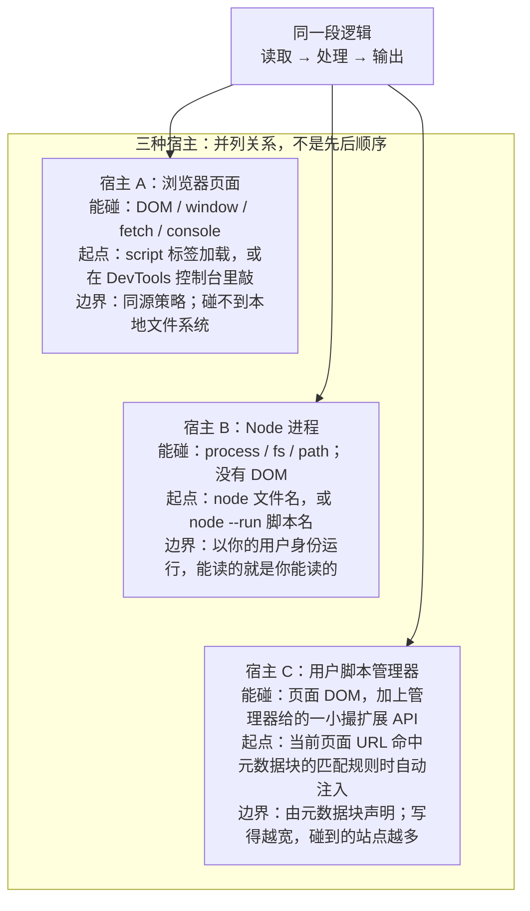
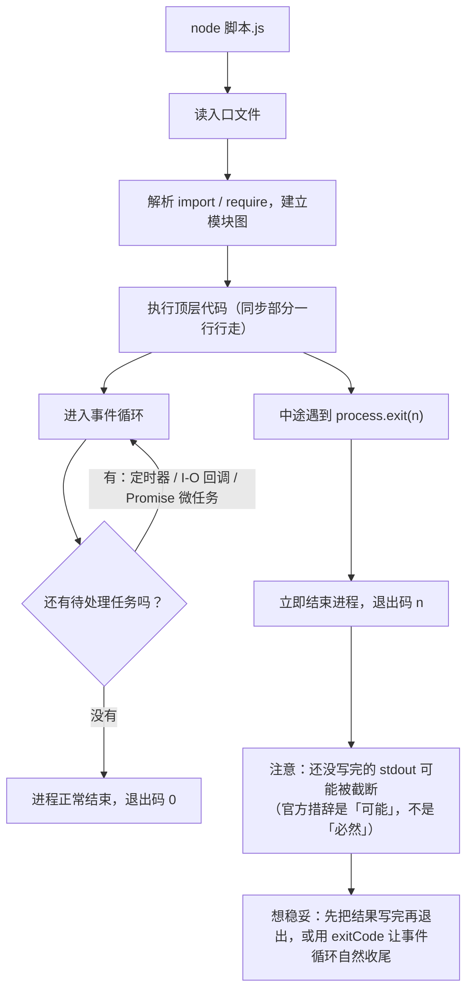
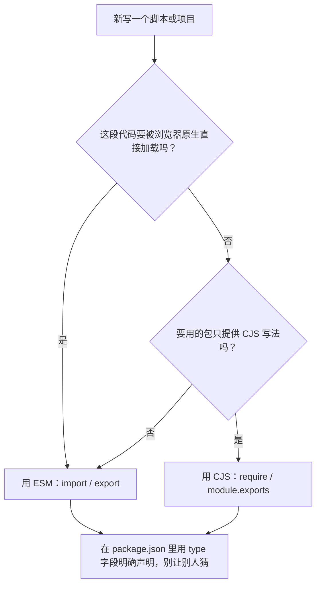

# 模块十二 JavaScript 脚本实战

> **一句话**：前面十一篇把语言、浏览器、工程化拆开讲过了——这一篇把它们合起来，只回答一个具体问题：**手里有一段逻辑，怎么让它真的在某个地方跑起来，并且能被你、被计划任务、被别的程序反复调用**。你会同时认识三种宿主（浏览器页面、Node 进程、用户脚本管理器），学会 Node 起步、两套模块系统、`process`／`fs`／`path` 三个接口、参数与退出码、用户脚本的元数据块与注入范围、抓取纪律，以及一张能自己查下去的排错表。
> **自学时长**：建议 8–10 小时（可分 3–4 次学完） · **前置**：模块四《JavaScript 语言核心》、模块六《前端工程化》
> **学完你能**：
> 1. 对同一个需求，判断它该跑在三种宿主里的哪一种，并说清另外两种为什么不行（要能指出**具体缺哪个 API 或哪项权限**，不是「感觉不合适」）。
> 2. 写出一个接受命令行参数、读一个文件、把结果写到另一个文件、用顶层退出码表示成败的 Node 脚本，并让它能被 `node --run` 一键调用。
> 3. 为一段页面增强逻辑写一个用户脚本，把注入范围收窄到具体域名，并说清它为什么**不该**写成 `*://*/*`。

## 1. 心智模型

把「写脚本」这件事拆开，你会发现它永远是两半：**一段逻辑** + **一个宿主**。

- **宿主**（host，白话：给这段逻辑提供运行环境、并且决定它能碰到什么的那一层）——浏览器页面、Node 进程、用户脚本管理器就是三种宿主。**不先问宿主会怎样**：你会写出「在 Node 里 `document.getElementById`」或「在页面里直接 `fs.readFile`」这种当下必然报错的代码，而且报错信息看起来很像语法错误，容易白白排查半天。
- **逻辑**（白话：纯粹的输入→处理→输出，不依赖任何宿主专有对象的那部分）——这是唯一可以跨宿主搬来搬去的东西。把「怎么算」和「从哪读、写到哪里」分开，你的脚本就从「一个只能这样跑的片段」变成「换个壳还能用的工具」。

所以这一篇的主线是：**先分清宿主，再在选定的宿主上把「读进来」「算」「写出去」三段接起来，最后给它接上调用方式（命令行参数、退出码、自动触发）**。

三种宿主最本质的差别只有三条：**能碰到什么对象**、**谁来决定它什么时候开始跑**、**权限边界画在哪**。



> **图 1**：同一个脚本逻辑在三种宿主里分别能碰到什么、由谁启动、边界画在哪。
> 这张图在说什么：选宿主从来不是口味问题，而是「我需要哪些对象」和「我需要什么权限」这两个问题一起决定的——先看图里三组「能碰」，答案通常一眼就出来。

再往下看，Node 这一侧还有一个必须建立的时间观念：**脚本不是「一行一行跑完就结束」，而是「同步部分跑完之后，事件循环还在替你把剩下的任务做完，只有队列真的空了才退出」**。



> **图 2**：Node 脚本从入口文件到进程退出的完整路径，以及事件循环为空才退出的那一步。
> 这张图在说什么：很多「脚本没输出完就断了」「脚本该退出却卡住不退出」的怪现象，答案都在图里的两个分叉上——要么是队列里还有东西，要么是提前 `process.exit` 把缓冲截断了。

一句话记住整个心智模型：**宿主决定你能碰什么，事件循环决定你什么时候结束，退出码决定别人怎么知道你成没成。**

## 2. 精讲（按节推进）

### 2.1 三种宿主：同一段逻辑，三种跑法　⏱ 约 40 分钟

先给每个宿主一句白话定义，并配上「只认它不认别人」的后果。

- **浏览器页面宿主**：把脚本交给一个已经打开的页面去跑，脚本能直接操作 DOM。你前面的十篇几乎都在这个宿主里。**混淆后果**：以为「浏览器里能 `fetch`，Node 里当然也能按一样的方式拿数据」——能拿，但页面 `fetch` 会受同源策略约束，Node 的 `fetch` 不受，两者失败原因完全不同。
- **Node 进程宿主**：把一个 `.js` 文件交给 Node 这个可执行程序去跑，它**没有 DOM**，但有文件系统、进程、环境变量这些页面里根本没有的东西。**混淆后果**：在 Node 里写 `document.querySelector`，报的是「`document` 未定义」，看起来像拼写错误，其实是宿主用错了。
- **用户脚本管理器宿主**：由浏览器扩展（比如 Tampermonkey 这类用户脚本管理器）在你**访问某个站点时**把一段脚本注入到该页面的环境里。它同时有页面的 DOM 和管理器额外给的一些能力，但是**由匹配规则决定它跑在哪些站点上**。**混淆后果**：把匹配规则写得很宽，等于让这段脚本在你访问的任何网站上都有执行权——见 §2.6 和「安全视角」。

三种宿主对照如下：

| 维度 | 浏览器页面 | Node 进程 | 用户脚本管理器 |
| --- | --- | --- | --- |
| 有没有 DOM | 有，核心就是它 | 没有 | 有（操作的是被注入的那个页面） |
| 能不能碰本地文件 | 不能 | 能（以你的身份） | 一般不能 |
| 谁启动它 | 页面加载或你在控制台里敲 | 你敲 `node 文件名`，或由别的程序调起 | 页面 URL 命中匹配规则时自动注入 |
| 典型用途 | 页面交互、可视化 | 批处理、本地小工具、自动化 | 给某个网站加自己需要的增强 |
| 失败的第一句话 | 控制台里一条红字 | 终端里一段堆栈 | 管理器面板里的错误列表 |
| 权限边界 | 同源策略 | 你的操作系统用户 | 元数据块的匹配规则 |

学习路径上，**先学 Node 进程**：它的反馈最直接（一条命令、一段输出、一个退出码），不需要浏览器参与，最适合建立「读进来→算→写出去」的手感。相关入门见 https://nodejs.org/en/learn/getting-started/introduction-to-nodejs 。

> **自检**：有个需求是「每天把公司内网某个页面的表格抓下来，存成 CSV」。它该跑在哪种宿主？另外两种为什么不行？（提示：从「谁来启动它」这一列入手。）

### 2.2 Node 起步：从敲命令到第一个能用的脚本　⏱ 约 50 分钟

**先把「脚本文件」和「交互命令行」分清。** 直接敲 `node` 会进入一个交互式环境（REPL，白话：读一行、算一行、打一行的临时小窗口），适合试一行表达式；但你要写的东西几乎一定是**文件**——因为文件才能被重复运行、被别人调用、被纳入版本管理。**只会在 REPL 里敲的后果**：你以为自己写了脚本，其实关掉窗口什么都没剩下，也没法交给计划任务。

Node 自带全局 `fetch`（白话：不用装任何库就能发 HTTP 请求的函数，用法和浏览器里的那个基本一致），所以「联网」这件事不需要额外依赖。这里有一条**必须尽早养成的习惯**：

- Node 的 `fetch` **默认 User-Agent 就是字符串 `node`**。User-Agent（白话：请求头里那句「我是什么客户端」，让服务端知道对面是谁）不带等于主动亮明「我不是浏览器」。这不是错误，但很多站点会因此给出不同的响应（甚至直接拒绝）。
- **你可以显式设置 `user-agent`，而且设置是有效的**——服务端收到的就是你所设的值。

所以要抓公开页面时，正确的做法是**把你自己浏览器的真实 UA 读出来填进去**：在本机浏览器地址栏访问 `chrome://version`，页面上有一行 User-Agent，原样复制。**不要写死某个浏览器版本号**——你自己浏览器是哪一串就填哪一串，别人的环境未必和你一样。**写死版本号的后果**：过一阵它就成了一个不存在的客户端标识，服务端要么认不出，要么当成可疑流量。

Node 还能**直接运行 `.ts` 文件**：`node 文件.ts` 可以直接跑通，不需要任何命令行开关，也不会有警告。但要记住它做了什么、没做什么——它**只剥掉类型标注，不做类型检查**。**以为「能跑就等于类型没问题」的后果**：类型写错了照样跑出错的结果，你要的是类型检查就得另外装工具（本机没有装这类工具）。类型相关的工程化背景见模块六。

第一段示意代码（**仅示形态，不要当成完整程序**）：

```js
// 示意：Node 自带 fetch，关键是显式带上身份标识
const url = '把你要请求的公开地址填在这里（要带协议头）';
const res = await fetch(url, {
  headers: {
    // 这里的 UA 请用你从 chrome://version 读到的那一串替换
    'user-agent': '把你浏览器 chrome://version 里的 UA 粘到这里',
  },
});
console.log(res.status); // 本机实测：对一个公开示例域名的请求返回 200
```

> **自检**：为什么「Node 能直接跑 `.ts`」这件事**不能**让你省掉类型检查这一步？说出它到底做了哪一件事、没做哪一件事。

再补一句关于「脚本长什么样」的判断：一个能长期留着的脚本，读起来应该像三段——**取参数与环境、做一件事、报告结果**。**把这三段揉在一起写的后果**：你要改「从哪读」时不得不动到「怎么算」那一段，改一次错一次。

### 2.3 模块系统：CJS 与 ESM　⏱ 约 50 分钟

**模块**（白话：把一段代码装进一个文件，让它自己管好内部变量，只把愿意对外的部分交给别人用）——不拆模块的后果是所有变量挤在一个全局作用域里，改一个地方崩一片。

JS 有两套模块语法，你必须都认识：

- **CJS**（CommonJS，Node 最早的模块写法）：用 `require(...)` 拿别人的东西，用 `module.exports` 交出自己。**它的形态特征**是「运行时按需加载」——`require` 就是一个普通函数调用，写在哪就在哪执行。
- **ESM**（ECMAScript 模块，语言标准的模块写法）：用 `import ... from '...'` 拿，用 `export` 交出。**它的形态特征**是「静态声明」——写在文件顶部，浏览器原生就认这套。浏览器侧要点见 https://developer.mozilla.org/zh-CN/docs/Web/JavaScript/Guide/Modules 与 https://developer.mozilla.org/zh-CN/docs/Web/JavaScript/Reference/Statements/import 。

怎么选，用一张图说清：



> **图 3**：给一个新脚本选模块系统的最小决策路径。
> 这张图在说什么：选择的第一问永远是「要不要给浏览器原生加载」，第二问才是「依赖长什么样」；而无论走哪条路，**最后一步都要显式声明**，因为「不声明」会让别人（以及 Node 自己）只能靠猜。

两个必须先记住的行为：

- **`.js` 文件里有 `import`、但 `package.json` 又没有声明模块类型时**，本机实测的表现是：Node **只给一条警告**（名为 `MODULE_TYPELESS_PACKAGE_JSON`）然后**自动按 ESM 重新解析，不报错**。这很重要，因为**老版本 Node 在同样的情况下会直接硬报** `Cannot use import statement outside a module`。**以为「反正能跑，不用管警告」的后果**：你的脚本在别的环境上可能直接跑不起来，而你在本机永远看不到那个错误。
- **`import.meta.dirname`**（白话：ESM 里拿到「当前这个脚本文件所在的目录」的写法）本机可用。它解决的是一个非常容易踩的坑：**脚本里的相对路径，相对的是当前工作目录（`process.cwd()`），不是脚本所在目录**。**不处理这个的后果**：你在项目根目录跑脚本时一切正常，换个目录用同样的命令跑，读的文件、写的文件全跑到别处去了。要固定基准，就用 `import.meta.dirname` 拼出绝对路径。

`package.json` 里的模块类型与包规则，见 https://nodejs.org/api/packages.html ；模块系统的接口细节见 https://nodejs.org/api/module.html 。

> **自检**：为什么同一个脚本在「项目根目录」跑得好好的，换到子目录下用同一句命令就跑出「文件找不到」？

### 2.4 process / fs / path：脚本与外界的三扇门　⏱ 约 60 分钟

Node 脚本跟外界打交道，主要就靠这三个内置模块。它们各自负责一类事，别混着用。

- **`process`**：白话就是「当前这个进程本身」。你从它这里拿到：命令行参数 `process.argv`、环境变量 `process.env`、当前工作目录 `process.cwd()`，以及决定退出方式的 `process.exit()` 和 `process.exitCode`。见 https://nodejs.org/api/process.html 。
- **`fs`**：文件系统。读、写、追加都在这里。见 https://nodejs.org/api/fs.html 。
- **`path`**：路径拼接与解析。跨平台拼路径要用它，别用字符串相加，因为不同系统的分隔符不一样。见 https://nodejs.org/api/module.html 的相邻页面与 https://nodejs.org/docs/latest/api/ 索引。

`fs` 上有三个必须分清的行为，全部是本机实测结论：

1. **`writeFile` 是整篇覆盖**。它不管目标文件原来有什么，一律从头写。**要接着后面写，必须用 `appendFile`**。**用错的后果**：你以为在往日志里追加，其实每跑一次就把之前的内容清光，而它**不会报错**——这是最难发现的一类错。
2. **`writeFile` 不传 `encoding` 时，读回来的东西是 `Buffer` 而不是字符串**（`Buffer`，白话：一段原始字节，不是给人读的文本）。**后果**：你打印它得到一串数字，做字符串比较永远不等，而代码本身没有语法错误。
3. **写中文要显式写 `'utf8'`**。不写就按字节处理，中文很可能变成乱码。**后果**：文件能生成，但打开全是问号，你会以为编辑器坏了。

示意代码（**仅示形态，每块都不完整**）：

```js
// 示意：读改写各一步，重点看三个参数名
import { readFile, writeFile, appendFile } from 'node:fs/promises';

const txt = await readFile('input.txt', 'utf8');   // 不写 'utf8' 会拿到 Buffer
await writeFile('out.txt', txt, 'utf8');           // 整篇覆盖
await appendFile('log.txt', '一行记录\n', 'utf8'); // 才是追加
```

```js
// 示意：用脚本自身目录当基准，而不是听凭当前工作目录
import { join } from 'node:path';

const base = import.meta.dirname;          // 脚本所在目录
const dataPath = join(base, 'data', 'in.txt'); // 稳定，不受你在哪敲命令影响
```

`process.argv` 的形态值得单独记一下：它是一个数组，**前两项是 Node 可执行文件和脚本文件自身的路径**，你真正关心的参数从第三项开始。**不记这件事的后果**：你会把 `argv[0]` 当成用户传的第一个参数，于是脚本永远解析错一位。

另外两个别忽略的门：**`process.env`**（环境变量，白话：操作系统或启动脚本时传给进程的一批键值对）适合放「不该写进代码的配置」，比如一个目录路径或一个开关；**`path.join` / `path.resolve`** 负责拼路径。**用字符串相加拼路径的后果**：在你本机看着好好的，换一个分隔符不同的系统就散架；而路径里混进 `..` 时，字符串相加不会替你归一化。

> **自检**：为什么「用 `writeFile` 往同一个文件反复写、期待它越长越长」是一个必然会让你困惑的错误？说出它实际做了什么、以及正确的替代是哪个函数。

### 2.5 参数、退出码，以及「被别人调用」　⏱ 约 50 分钟

一个脚本要能**被别人调用**，需要三件事：能接收参数、能用退出码汇报成败、能被一个固定的名字拉起。

**参数解析**：本机可用的 `node:util` 里的 `parseArgs` 能把 `--flag value` 这类命令行参数解析成对象，省得你自己切 `process.argv` 数组。**自己硬切数组的后果**：短参数、带等号的写法、布尔标志混在一起时，边界情况多到你会一个个踩。

**退出码**（白话：进程结束时交给操作系统的一个数字，约定 0 表示成功、非 0 表示失败）——这是脚本和调用方之间唯一的成功/失败约定。有两种给出方式：

- `process.exitCode = 1`：**设一个值，让事件循环自然收尾**。推荐用这种。
- `process.exit(1)`：**立刻结束进程**。

这里有一个**必须如实掌握的边界**：官方文档说 `process.exit()` **可能**不等未完成的异步 I/O 就结束进程，也就是说**输出可能被截断**。本机实测用 300 KB 直写**没有复现**这个现象——所以正确的表述是「**可能而非必然**」。**把它当成「反正一定截断」或「反正从来没截断」的后果**：前者让你不敢用 `exit`，后者让你在某个大输出的场景里丢数据还找不到原因。稳妥做法是**先把要输出的都写完，再退出**，或者干脆用 `process.exitCode` 让 Node 自己收尾。

**被名字拉起**：本机可用 `node --run 脚本名` 直接执行 `package.json` 里的 `scripts`，**不必经过 npm**。本机也支持 `node --test` 与 `--watch`。命令行选项见 https://nodejs.org/api/cli.html ，测试运行器见 https://nodejs.org/api/test.html 。**后果**：不会用固定入口，你的脚本每次都要靠记一长串命令来跑，别人接手第一件事就是问你「到底怎么跑」。

示意代码（**仅示形态**）：

```js
// 示意：参数解析 + 用 exitCode 汇报成败
import { parseArgs } from 'node:util';

const { values } = parseArgs({
  options: { out: { type: 'string' } }, // 允许 --out xxx
});
if (!values.out) {
  console.error('缺少 --out 参数');
  process.exitCode = 2; // 设值，让事件循环自然结束
}
```

> **自检**：为什么「用 `process.exitCode` 结束后再正常退出」通常比「用 `process.exit()` 立即退出」更稳妥？

### 2.6 用户脚本的元数据块与注入范围　⏱ 约 50 分钟

**用户脚本管理器**（白话：一个浏览器扩展，让你把一小段 JS 绑定到「访问某些网站时自动执行」）的核心机制是**元数据块**：脚本文件开头一段被特殊注释包裹的声明，告诉管理器「这段脚本叫什么、在哪些网站上跑、需要哪些额外权限」。文档见 https://www.tampermonkey.net/documentation.php?locale=zh-CN ，现成脚本可参考社区站点 https://greasyfork.org/zh-CN 。

元数据块里最重要的一个字段是**匹配规则**（一般写作 `@match`）：它决定这段脚本**在哪些 URL 上会被注入**。

- **写精确的域名**：只在你要增强的那个站点上跑。
- **写得很宽**，比如对所有站点生效——**后果是这段脚本在你访问的每一个网站上都有执行权：能读到每一个页面的内容、能在每一个页面里发起请求。** 你自己写的可能没恶意，但只要你的一处逻辑有漏洞，或者这个脚本将来被别的东西利用，影响面就是「你上过的所有网站」。「安全视角」会把这条展开。

另一个概念是 `@grant`（白话：声明「我需要管理器额外给我哪些能力」，不要时不声明）。**声明得越少越好的后果是**：权限越小，脚本出问题时的爆炸半径越小。

示意元数据块（**仅示形态，站点请换成你自己的**）：

```js
// ==UserScript==
// @name         只在某个站点生效的页面增强
// @namespace    local.study
// @version      0.1
// @description  只读地把某站点的一处显示改得更清楚
// @match        此处按「协议 + 域名 + 路径通配」的形态，只填你要增强的那一个站点
// @grant        none
// ==/UserScript==
```

`@match` 的值是一个 URL 匹配模式，形态是「协议 + 域名 + 路径通配」，**只覆盖一个域名**，**不要**写成对所有站点生效的那种全站通配（例如形如 `*://*/*` 的写法）。这里的 `*` 只在域名或路径内部当通配用，不代表「所有站点」。**用宽匹配省事的后果**：省下的是几秒钟，交出去的是你在全网的页面执行权。

> **自检**：为什么把 `@match` 从「只覆盖一个域名」改成对所有站点生效，**不是**「更通用、更方便」，而是「扩大了你自己脚本的攻击面」？

### 2.7 抓取纪律：只读、限速、留痕　⏱ 约 50 分钟

**抓取**（白话：用脚本把网页里公开显示的内容自动读下来、在本地整理）能做的事和不能做的事，必须一开始就划清：

- **只做只读采集与本地整理。** 脚本只负责「把公开可见的东西读下来，存到本地文件或本地库」。
- **登录、提交、发帖、下单这类「代表我在平台上做事」的动作，不写进脚本。** 这些动作要么涉及他人的账号安全，要么涉及平台规则与法律边界，不属于本篇练习范围。**把它们混进来的后果**：你分不清「我在读公开信息」和「我在以你的身份改变平台上的状态」这两件性质完全不同的事，一旦出事，责任全在脚本这一侧。
- **能走公开接口或 RSS 就不碰私有接口。** 公开接口/RSS 是站点主动给程序看的；私有接口是页面自己用的，**逆向私有接口的做法本篇不涉及，也不建议你做**。**碰私有接口的后果**：它随时会变、变了你也不知道为什么，而且大概率越过你本不该越的线。
- **带上真实浏览器 UA + 完整请求头。** 只改 UA 不改别的，请求看起来会很怪。UA 要你自己去 `chrome://version` 读，**不要写死版本号**。
- **请求之间随机间隔 1–3 秒。** 固定间隔看起来就像机器在打卡；随机间隔既是减轻对方压力，也让你的流量不显得异常。**不加间隔的后果**：几十条请求几秒内砸过去，对一个小站就是一次小型冲击——这既可能被直接封，也是不礼貌的。
- **遵守平台规则与法律边界。** 这一条最重，展开在 [[22-前端安全专章（OWASP × ATT&CK）]] 的法律一节。

`fetch` 要有超时，别让一个卡住的请求把整个脚本拖死。浏览器侧与 Node 侧都用 `AbortController`／`AbortSignal.timeout`（本机 Node 可用），文档见 https://developer.mozilla.org/zh-CN/docs/Web/API/AbortController ；`fetch` 见 https://developer.mozilla.org/zh-CN/docs/Web/API/Window/fetch 。

示意代码（**仅示形态，间隔与 UA 都要你自己填**）：

```js
// 示意：一次只读请求，重点是超时与自定义 UA
const ac = new AbortController();
const t = setTimeout(() => ac.abort(), 10000); // 10 秒超时
try {
  const res = await fetch(url, { signal: ac.signal, headers: { 'user-agent': MY_UA } });
  // ... 只读地处理 res，写进本地文件
} finally {
  clearTimeout(t);
}
```

> **自检**：为什么「能走公开接口就不碰私有接口」这条规则，第一条理由**不是**「技术上做不到」，而是「那本来就不是给程序看的」？

### 2.8 排错表：脚本报错时先看哪里　⏱ 约 40 分钟

脚本的错误比页面错误更单调，但也更容易被误读。下面这张表按「最常见的先写上面」排序（这是本篇的编排，见 §7.2）。**先查表再改代码的后果**：你能在两分钟内分辨出「是我写错了」还是「我用错宿主了」；不查表直接改，往往改的是没毛病的那一行。

| 现象 | 更可能的病根 | 先看哪里 |
| --- | --- | --- |
| `document is not defined` / `window is not defined` | 你在 Node 进程里用了页面宿主才有的对象 | 确认这段逻辑该不该跑在 Node；该跑页面就换宿主 |
| 读文件拿到一串数字、不是文本 | `readFile` 没传 `'utf8'`，拿到的是 `Buffer` | §2.4；给 `readFile` 补上 `'utf8'` |
| 中文写进文件变乱码 | 写入/读取没显式声明 `'utf8'` | §2.4；三处调用都补上 `'utf8'` |
| 往同一文件反复写，内容却总被清空 | 用了 `writeFile`（整篇覆盖），本该用 `appendFile` | §2.4；换成追加函数 |
| 打印出「全部完成」**之后**才逐项出现结果 | 对数组用了 `forEach(async ...)` | §3.3；`forEach` 不等异步，换 `for...of` 或 `Promise.all` |
| 脚本该退出却一直不退出 | 事件循环里还有定时器/未关闭的连接 | §1 图 2；找到并清掉那个还活着的任务 |
| 输出写到一半就没了 | 提前 `process.exit()` 截断了 stdout（**可能而非必然**） | §2.5；改用 `process.exitCode`，或先写完再退 |
| 同一条命令换个目录就报文件找不到 | 相对路径以 `process.cwd()` 为基准 | §2.3；用 `import.meta.dirname` 拼绝对路径 |
| 终端里一段堆栈、几乎指着字符串里某个字符 | 某行发起了 Promise 却没人接住它的失败 | §3.7；给那个 `await` 补上 `try/catch` |
| Node 只给一条 `MODULE_TYPELESS_PACKAGE_JSON` 警告却照样跑 | `.js` 里有 `import` 但 `package.json` 没声明模块类型 | §2.3；补上 `type` 字段，别依赖自动判定 |
| 权限错误 `EACCES` / `EPERM` | 以你的身份运行，但目标路径你没权限 | 确认路径归属；换到你有写权限的目录 |
| 直接报 `Cannot use import statement outside a module` | `.js` 里有 `import` 但 `package.json` 没声明模块类型，而这台机器**不会**自动判定（老版本 Node 的硬报错） | §2.3、§3.2；补上 `type` 字段，别依赖自动判定 |
| 命令能跑，但参数读出来是 `undefined` | `process.argv` 索引错位——前两项不是用户的参数 | §2.4；用户参数从第三项（下标 2）开始 |

> **自检**：看到「现象是乱码」，你为什么不先怀疑编辑器，而先看 `encoding`？（用「病根」这一列的思路回答。）

## 3. 关键概念讲透

### 3.1 「Node 就是浏览器里的 JS 换个地方跑」

**常见误解**：既然都是跑 JS，浏览器里会写，Node 里自然也会。
**正确理解**：语言核心一样，**宿主差别是根本性的**。Node **没有 DOM**，所以任何依赖页面结构的代码在 Node 里都是错的；反过来 Node 有文件系统与进程，页面里根本没有这些东西。判断标准只有一条：**这段代码要用到哪些对象？这些对象属于哪个宿主？**
**反例**：把一段「用 `document.querySelector` 抓表格再导 CSV」的代码原样丢给 Node 跑，报的是 `document is not defined`——这**不是语法错**，也不是拼写错，是宿主错。正确做法是把逻辑拆开：真的要用页面的 DOM，就让它在页面宿主里跑（例如用户脚本），Node 只负责接收数据、整理、落盘。

### 3.2 「用了 ESM 就再也不能 require 了」

**常见误解**：选了 `import`，`require` 就彻底作废。
**正确理解**：两套系统**方向不完全对称**——ESM 里不能直接用 `require`，但 Node 提供了在需要时获取它的手段；而 CJS 里想用 ESM 有一套专门的写法（本篇不给完整实现，需要时按 https://nodejs.org/api/module.html 现行文档来）。真正要养成的习惯不是「记住哪个不能」，而是**让入口文件明确声明自己属于哪一套**。
**反例**：`.js` 里写了 `import`、`package.json` 又没声明类型——本机实测**只警告、自动按 ESM 重解析、不报错**，看起来「没关系」；但老版本 Node 在同样的情况下会**硬报** `Cannot use import statement outside a module`。同一份代码，两台机器，一个提示一个崩溃，原因就在这个没写的字段上。

### 3.3 「写了 async 就是并发，forEach 会等我」

**常见误解**：给回调加上 `async`，`forEach` 就会等每一项跑完。
**正确理解**：`forEach` 是**同步遍历**，它对每一项调一次回调就继续下一项，**完全不理会回调返回的是不是一个 Promise**。本机实测：`数组.forEach(async …)` 会**先打印「全部完成」，再陆续打印各项**，而且**回调里抛出的异常不会外抛**（不会被外层的 `try/catch` 接住）。
**反例**：你以为「全部完成」是在所有项之后才打印的，于是把「结束后统一汇总」写在那里——结果每次汇总到的都是空数据，而且没有任何报错，因为异常被吞了。要按顺序等用 `for...of`，要并发等用 `Promise.all`。

### 3.4 「退出码只是个好看的数字」

**常见误解**：脚本能跑完、有输出就行，退出码无所谓。
**正确理解**：对交互使用，退出码确实看不见；但只要这个脚本**被别的程序、脚本或计划任务调用**，退出码就是对方唯一能读到的成败信号。不设它，等于告诉调用方「无论结果如何都算成功」。
**反例**：一个每天抓取并写文件的脚本，某天取到的是空数据，它照样写了个空文件然后正常退出——调用方看到退出码 0，以为一切正常。正确做法是**发现异常时把 `process.exitCode` 设成非 0**，让失败明确地传出去。同时记住 §2.5：汇报失败优先用设 `exitCode`，而不是立刻 `exit` 截断输出。

### 3.5 「匹配规则写得越宽越省事」

**常见误解**：`@match` 写成对所有站点生效，这样不管我上哪个网站都能用。
**正确理解**：匹配规则是**授权范围**，不是便利开关。范围越宽，这段脚本在你浏览器里的**执行面**越大——它能读到的页面内容越多，能替你发起的请求越多。
**反例**：一段本来只想给某个论坛加个「复制代码块」按钮的脚本，匹配规则写成了全网生效。它现在运行在你登录的**每一个**站点上，包括邮箱和后台。哪怕脚本本身干净，这也意味着它读到的每一个页面内容都在它的可及范围内——一处漏洞的影响面被白白放大了几十倍。正确做法是**精确到域名**，要用别的站点再加一行。

### 3.6 「抓得快才叫效率」

**常见误解**：脚本跑得快是本事，一秒几十个请求才显出自动化。
**正确理解**：这种场景下「快」不是效率，是**给别人制造压力**。抓取的目标是拿到公开数据，不是压测对方。真正的效率是「一次拿对、少重复、结果可复用」，而不是「秒级打满」。
**反例**：一个没有间隔、没有超时、没有重试上限的脚本，遇到一个响应慢的站点会把连接堆满，最后自己也被限流或封禁——你还得花时间排查「是不是我代码有问题」，实际原因只是你太急。

### 3.7 「脚本报错就是 Node 坏了」

**常见误解**：终端里那段看不懂的堆栈说明环境有问题。
**正确理解**：绝大多数 Node 报错都指向**你自己的某一行**。堆栈是自上而下读的：最上面通常是你调用处，往下是被调用的库；再配合「排错表」里那条「几乎指着字符串里某个字符」的现象，能快速定位到「某行发起了 Promise 却没人接住失败」。
**反例**：一个 `await` 上没写 `try/catch`，网络一抖就抛 `fetch failed`，堆栈信息看起来全在 Node 内部，你于是去重装 Node——重装三次也没用。正确做法是**在你自己发起的那个 Promise 处接住失败**，把可读的信息打印出来。

### 3.8 「能跑通就等于对不对」

**常见误解**：脚本没报错、命令没红字，说明结果是对的。
**正确理解**：脚本**不说话**是最危险的信号。异步没等待、异常被吞、编码写错、追加写成了覆盖——这四类错误全都**不产生报错**，只是安静地给出错的结果。判断「对不对」只能靠**核对结果本身**：读回来看看、打印条数对不对、中文有没有乱码。
**反例**：一段用 `forEach(async …)` 汇总数据的脚本，跑完打印「全部完成，共 0 条」，退出码 0，没有任何警告。你以为是数据源空了，其实是遍历没等异步。正确的验证动作是**让脚本自己报出「处理了多少条」**，并与你预期比——这就是动手二里要求「正常路径 / 失败路径各跑一遍」的原因。

## 4. 动手（自学版实验）

总要求：**每一步都要留下可见证据**（终端输出、生成的文件、管理器面板截图），「我跑过了」不算证据。**全部练习只在你自己的机器、你自己的项目、以及公开可读的站点上做**（见 §2.7 与「安全视角」）。

### 动手一：把同一个需求分配到三种宿主

- **要做什么**：拿到下面这个需求——「把一个页面上显示的列表读下来，在本地整理成一个文件」——分别回答：① 只用**浏览器页面**做得到吗？怎么做？② 只用 **Node 进程**做得到吗？缺什么？③ 用**用户脚本管理器**做得到吗？它靠什么触发？最后为每种宿主写一句「它最擅长的那一步」。
- **需要什么**：一个你想观察的公开页面；本机装好的浏览器与其用户脚本管理器；Node（本机为 v26.7.0）。能开 DevTools 控制台。
- **验收标准**：
  - [ ] 三条路径**都给出了具体做法**，每条都点出用到了哪个宿主专有对象（DOM？`fs`？匹配规则？）。
  - [ ] 至少指出**一条「换个宿主就做不到」的硬理由**，并指出缺的是哪个 API 或哪项权限。
  - [ ] 说明「谁来启动」在三条路径里分别是什么。
  - [ ] 全程**只读**，没有对被观察站点发出任何改变状态的动作。
- **卡住了看哪一节**：§2.1 的对照表；§2.6 的元数据块与匹配规则。

### 动手二：写一个能被反复调用的命令行小工具

- **要做什么**：写一个 Node 脚本，做到：接受一个 `--out` 参数指定输出文件；读一个输入文件；把处理结果写进 `--out` 指定的文件；**任何一个必需参数缺失或输入文件读不到时，用一个非 0 退出码结束**；成功时退出码为 0。再把它挂到 `package.json` 的 `scripts` 里，用 `node --run` 一键跑起来。
- **需要什么**：Node（本机 v26.7.0）；一个准备输入文件；`package.json`。参数解析参考 https://nodejs.org/api/cli.html ，进程与退出码参考 https://nodejs.org/api/process.html ，文件读写参考 https://nodejs.org/api/fs.html 。
- **验收标准**：
  - [ ] 正常路径：文件被生成，**内容正确**，退出码为 0（用一句读取 `$?` 的命令验证）。
  - [ ] 失败路径：故意不传 `--out`、故意指向不存在的输入文件，**两种情况都返回非 0**，并打印出人能看懂的一句原因。
  - [ ] 文件读写**显式写了 `'utf8'`**，中文内容不乱码。
  - [ ] 从**两个不同的目录**用同一句命令跑，结果文件都出现在你预期的位置（验证你没有依赖当前工作目录）。
  - [ ] `node --run` 能成功拉起它。
- **卡住了看哪一节**：§2.4（三个模块与 `encoding`）、§2.5（参数与退出码）、§2.3（路径基准）。

### 动手三：为一段页面增强写一个用户脚本，并把范围收窄

- **要做什么**：挑一个**你自己常用**的公开站点，写一个**只读**的用户脚本做一点小增强（例如让某个区域更显眼、把一段信息复制到剪贴板）。要求：元数据块里的匹配规则**精确到该域名**，`@grant` 声明**只需它真正用到的那一项**（用不到就写 `none`）。
- **需要什么**：浏览器与其用户脚本管理器；目标站点的公开页面；管理器文档 https://www.tampermonkey.net/documentation.php?locale=zh-CN 。
- **验收标准**：
  - [ ] 匹配规则**只覆盖一个域名**，里面**没有**全站通配的写法。
  - [ ] 脚本在当前站点生效；**打开别的站点，面板里显示它没有运行**（这是范围收窄的直接证据）。
  - [ ] `@grant` 里只出现脚本真正用到的能力；要复制到剪贴板就写清对应能力，用不到就写 `none`。
  - [ ] 脚本**不修改**任何与你无关的页面内容，**不发**任何改变站点状态的动作；全程只读 + 本地呈现。
  - [ ] 你能用一句话解释：如果这条匹配规则改成全站生效，影响面会扩大到什么程度。
- **卡住了看哪一节**：§2.6；「安全视角」第 1 条。

### 动手四：一次守规矩的只读采集

- **要做什么**：挑一个**允许被程序读取**的公开来源（优先公开接口或 RSS），用 Node 写一个脚本：带上**你自己从 `chrome://version` 读到的真实 UA**与完整请求头，请求之间**随机间隔 1–3 秒**，每条请求**带超时**，把结果**只读地**存到本地文件；同一条数据不重复抓，已经抓过的第二轮跳过。
- **需要什么**：Node（本机 v26.7.0）；一个公开可读的来源；你自己浏览器的 UA（从 `chrome://version` 复制）。`fetch` 与超时见 https://developer.mozilla.org/zh-CN/docs/Web/API/Window/fetch 与 https://developer.mozilla.org/zh-CN/docs/Web/API/AbortController 。
- **验收标准**：
  - [ ] 请求头里带的是**你本机实测出来的真实 UA**，而且**没有写死某个浏览器版本号**。
  - [ ] 两次请求之间的间隔落在 **1–3 秒**并且是**随机**的（给出至少两次实际间隔的记录）。
  - [ ] 每条请求都有**超时**；人为把超时设短一点，能观察到它按预期中断而不是一直挂着。
  - [ ] **第二轮运行跳过已抓过的条目**，输出文件没有重复。
  - [ ] 全程**没有任何**登录、提交、发帖、下单之类的动作；来源是公开接口或 RSS，**没有碰私有接口**。
  - [ ] 你写下一句「这个来源的规则允许我这样读吗」，并给出你的依据。
- **卡住了看哪一节**：§2.7（抓取纪律）、§2.2（UA）、§2.4（写文件）。

### 动手五：把一次真实报错写成一条排错记录

- **要做什么**：**故意**在你的脚本里制造两种「不报错但结果错」的情况——① 读文件时漏掉 `encoding`；② 用 `forEach` 配 `async` 汇总数据。分别运行，把观察到的现象、你判断的病根、你实际改了什么，写成三条记录（现象 / 病根 / 改法），并把它补进你自己的排错表。
- **需要什么**：动手二或动手四里已经写好的那个脚本；一个含中文的输入文件；Node（本机 v26.7.0）。
- **验收标准**：
  - [ ] 两种错误**都真的复现了**，且能贴出「改前」的输出（是乱码 / 是空的汇总）。
  - [ ] 每条记录里「病根」写的是**机制**（编码没声明 / 遍历不等异步），不是「我写错了」。
  - [ ] 「改法」给到**具体的那一行**：`readFile` 补 `'utf8'`；`forEach` 换成按顺序等或并发等。
  - [ ] 改后重跑，输出**正确**，并说明你用什么核对「正确」（例如打印处理条数）。
  - [ ] 你能说出这两类错误为什么**都不会报错**。
- **卡住了看哪一节**：§2.4（`encoding`）、§3.3（`forEach` 不等异步）、§3.8（不报错≠对）、§2.8（排错表）。

## 5. 自测

### 5.1 客观题（答案与解析在折叠块里）

**1.** 单选：下面哪个需求**只能**在 Node 进程宿主里做？
A. 读取本机某个目录下的所有文件并汇总　B. 让页面上的一个按钮变红　C. 给某个网站的页面加一个悬浮按钮　D. 在控制台里打印一段文字

> [!success]- 答案与解析
> **A**。文件系统只有 Node 进程宿主能碰。B、D 是页面 / 控制台的事；C 典型属于用户脚本管理器宿主（它给页面加东西）。注意 C「也不是不能由页面自己做」，但题面是「给**某个网站的**页面增强」，那正是用户脚本的定位。

**2.** 判断：Node 里的 `fetch` 和浏览器页面里的 `fetch` 行为完全一致。　（　　）

> [!success]- 答案与解析
> **错误**。用法接近，但**约束不同**：页面 `fetch` 受同源策略限制，Node 的不受。所以「同一个请求在浏览器里被拦、在 Node 里成功」是常见现象，失败原因也完全不同。

**3.** 填空：Node 的 `fetch` **默认** User-Agent 是字符串 `________`。要抓公开页面，应当用**你自己**从 `________` 读出的 UA 替换它，而**不要**写死某个浏览器版本号。

> [!success]- 答案与解析
> 第一个空：**`node`**（本机实测，不带 UA 等于主动报身份）。第二个空：**`chrome://version`**（把页面上那一行 User-Agent 原样复制）。写死版本号的后果是过一阵它就成了一个不存在的客户端标识。

**4.** 单选：`.js` 文件里有 `import`，但 `package.json` 没有声明模块类型。本机实测的行为是？
A. 直接报错 `Cannot use import statement outside a module`　B. 只给一条 `MODULE_TYPELESS_PACKAGE_JSON` 警告，并自动按 ESM 重新解析、不报错　C. 静默当成 CJS 执行　D. 什么都不发生，也不提示

> [!success]- 答案与解析
> **B**。本机实测就是「警告 + 自动按 ESM 解析、不报错」。A 是**老版本 Node** 在同样情况下的表现——这正是为什么你不能依赖「在我这儿能跑」。C、D 都不对，Node 不会静默替你选一套还不吭声。

**5.** 判断并说明理由：`node 文件.ts` 能直接跑通，说明类型没问题。　（　　）

> [!success]- 答案与解析
> **错误**。本机实测 `node 文件.ts` **直接跑通、不需要任何 flag、无警告**，但它**只剥掉类型标注，不做类型检查**。类型写错了照样能跑出错的结果。真要做类型检查得另装工具（本机没装）。

**6.** 单选：想让 `writeFile` 的输出带中文且不出乱码，必须做什么？
A. 什么都不用做，自动识别　B. 显式传 `'utf8'`　C. 把中文转成 unicode 转义　D. 用 `appendFile` 代替

> [!success]- 答案与解析
> **B**。不传 `encoding` 时拿到/写出的是 `Buffer` 而不是字符串，中文很可能乱码。C 是绕路且不必要；D 解决的是「追加 vs 覆盖」，与编码无关（`appendFile` 一样需要显式 `'utf8'`）。

**7.** 简答：为什么 `数组.forEach(async …)` 是脚本里最容易埋下的坑之一？说出它的**两个**特征。

> [!success]- 答案与解析
> 两个特征：① **不等**——本机实测，它会**先打印「全部完成」，再陆续打印各项**，也就是遍历**不会**等待异步回调；② **异常不外抛**——回调里抛出的异常不会被外层接住，于是出错时**连报错都没有**。要按顺序等用 `for...of`，要并发等待用 `Promise.all`。

**8.** 填空：脚本里的相对路径，相对的是**当前工作目录**（`process.cwd()`），**不是脚本所在目录**；要固定基准，应当用 `________` 拼出绝对路径。

> [!success]- 答案与解析
> **`import.meta.dirname`**（本机实测可用）。用了它之后，无论你在哪个目录敲命令，读写的都是同一个位置——这正是动手二里「从两个不同目录跑」那一条要验证的。

**9.** 判断并说明理由：`process.exit(1)` 一定会把还没写完的 stdout 截断。　（　　）

> [!success]- 答案与解析
> **错误**。官方文档的措辞是**可能**（不等未完成的异步 I/O 就结束进程），而本机实测用 300 KB 直写**没有复现**截断。所以正确表述是「**可能而非必然**」。稳妥做法是**先把要输出的写完再退出**，或者用 `process.exitCode` 让事件循环自然收尾。

**10.** 多选：下面哪些属于本篇要求守住的抓取纪律？
A. 只做只读采集与本地整理　B. 登录、提交、发帖这类「代表我在平台上做事」的动作不写进脚本　C. 能走公开接口或 RSS 就不碰私有接口　D. 把请求间隔设成固定 0 秒以提高效率

> [!success]- 答案与解析
> **A、B、C**。D 错得最典型：正确的做法是**随机间隔 1–3 秒**。理由不是「规矩好看」，而是固定 0 秒会在几秒内对一个站点形成小型冲击，既可能被封也不礼貌。另外记得：真实浏览器 UA + **完整**请求头，UA 自己去 `chrome://version` 读。

### 5.2 动手题（不给实现，只给验收标准与评分点）

**1.** 为「同一个需求」写一份宿主选型说明（不超过一页）：需求自选，但要涉及读数据、处理、写出去三段。
- **验收标准**：① 写出三种宿主各自能否胜任，**每条都给硬理由**（缺哪个 API / 哪项权限）；② 指出选定宿主里「谁来启动它」；③ 说明若换宿主，哪一段逻辑必须重写、哪一段可以原样搬；④ 给出该宿主下最可能遇到的**两个**失败现象（对照 §2.8 排错表）；⑤ **不含任何对被观察站点的写操作**。
- **评分点**：硬理由是否具体（35%）｜「哪段能搬、哪段要重写」的划分（30%）｜失败现象是否指向机制（25%）｜边界意识（10%）。

**2.** 给自己写的那个命令行小工具做一次**调用方视角**的验收。
- **验收标准**：① 只通过**退出码**和**输出文件**判断它成没成，全程不看源码；② 正常、缺参数、输入不存在三种情况各跑一遍，记录退出码；③ 从两个不同目录各跑一遍，验证输出位置稳定；④ 生成的中文文件不乱码，并说明你靠什么确认了这一点；⑤ 写一句「别人照这份说明能不能用起来」。
- **评分点**：退出码覆盖度（30%）｜工作目录无关性（25%）｜编码验证方式（25%）｜说明的可复用性（20%）。

**3.** 写一段用户脚本，并给它配一份**授权范围说明**。
- **验收标准**：① 匹配规则精确到**一个**域名，并解释为什么不多写一行；② `@grant` 与脚本实际用到的能力**完全对应**（用不到写 `none`）；③ 给出「在别的站点不生效」的证据（面板记录或截图）；④ 脚本全程**只读 + 本地呈现**，不改无关内容、不发改变状态的动作；⑤ 说明「若把范围放宽到全站，影响面会扩大成什么样」。
- **评分点**：范围收紧的自觉（30%）｜`@grant` 与实际能力一致（25%）｜证据是否具体（25%）｜对影响面的定性描述（20%）。

**4.** 做一次守规矩的只读采集，并留一份「我为什么可以这样做」的说明。
- **验收标准**：① 来源是公开接口或 RSS，**明确不是**私有接口；② 请求头用**你本机实测**的真实 UA，未写死版本号；③ 至少记录两次实际请求间隔，落在 **1–3 秒**且随机；④ 每条请求有超时，并演示一次超时触发；⑤ 第二轮跳过已抓条目，输出无重复；⑥ 说明里写清「这是只读采集与本地整理」，并给出你所依据的该来源规则或条款；⑦ **不含**任何登录/提交/发帖动作。
- **评分点**：只读边界与依据（35%）｜节流与超时的落实（30%）｜去重与可复现（20%）｜UA 是否为本机实测（15%）。

## 6. 自我检查清单

- [ ] 我能对任意需求说出它该跑在三种宿主里的哪一种，并指出缺哪个 API 或哪项权限。
- [ ] 我知道 Node 没有 DOM，遇到 `document is not defined` 会先想「是不是宿主用错了」。
- [ ] 我能说出 Node 的 `fetch` 默认 UA 是 `node`，并知道要用自己从 `chrome://version` 读到的 UA 替换。
- [ ] 我能解释 `node 文件.ts` 只剥类型标注、不做类型检查这层区别。
- [ ] 我能说清 CJS 与 ESM 各自的形态，并解释为什么要显式声明模块类型。
- [ ] 我知道本机 `.js` 里有 `import` 的实测行为（警告 + 自动按 ESM 解析），也记得老版本会硬报错。
- [ ] 我能区分 `writeFile`（覆盖）与 `appendFile`（追加），并记得显式写 `'utf8'`。
- [ ] 我知道 `process.argv` 前两项是什么，以及退出码为什么是调用方唯一能读到的成败信号。
- [ ] 我能解释「`process.exit()` 截断输出」是「可能而非必然」，并说出稳妥的替代做法。
- [ ] 我知道相对路径以 `process.cwd()` 为基准，并会用 `import.meta.dirname` 固定基准。
- [ ] 我能写一个匹配规则精确到单一域名的用户脚本，并说清为什么不用全站通配。
- [ ] 我能背出抓取纪律的六条，并知道 UA 要自己实测、间隔要 1–3 秒随机。
- [ ] 我能说出至少四种「不报错但结果是错的」情况，并知道该用什么动作去核对结果。
- [ ] 我能看着 §2.8 的表，把一条真实报错对到「病根」那一列，而不是先去改代码。

> **小结**：这一模块其实只有三句话——**宿主决定你能碰什么**，**事件循环决定你什么时候结束**，**退出码决定别人怎么知道你成没成**。三种宿主、两套模块系统、三个内置模块（`process`／`fs`／`path`）、六条抓取纪律，把这几件事理清，剩下就是照着 §2.8 那张表把报错一个个对上去。
>
> **自测入口**：§5.1 客观题共 10 条，**先答后看**（每条都有折叠的答案与解析）；§5.2 动手题共 4 条，只给验收标准与评分点、**不给参考实现**——请逐条自评。练完把产物留在手边，它们可以直接接进 [[12-动手项目（自学版大作业）]]；想按节奏检查进度，用 [[11-自测与进度检查]] 的三把尺子。

## 7. 出处与依据说明

### 7.1 有官方依据的部分

以下每条「本机实测事实」都能对到 Node 官方文档或 MDN 的页面（外链均取自课程链接白名单，由课程维护）：

- **Node v26.7.0 / npm 11.19.0** 为本机版本；全局未安装 `tsc`、`deno`、`bun`。依据：https://nodejs.org/docs/latest/api/ 、https://nodejs.org/api/cli.html 。
- **Node 内置 `fetch`**：真请求一个公开示例域名返回 200。依据：https://nodejs.org/docs/latest/api/ ；`fetch` 接口语义见 https://developer.mozilla.org/zh-CN/docs/Web/API/Window/fetch 。
- **`fetch` 默认 UA 为字符串 `node`**，且**显式设置 `user-agent` 有效**（服务端收到的就是所设的值）。依据：https://nodejs.org/docs/latest/api/ 与 https://developer.mozilla.org/zh-CN/docs/Web/API/Window/fetch （请求头语义）。
- **`node 文件.ts` 直接跑通、不需要任何 flag、无警告**，只剥类型标注、不做类型检查。依据：https://nodejs.org/api/cli.html 、https://nodejs.org/docs/latest/api/ 。
- **`import.meta.dirname`** 可用。依据：https://nodejs.org/api/module.html 、https://nodejs.org/api/packages.html 。
- **`node:util` 的 `parseArgs`**、`Object.groupBy`、`Promise.withResolvers` 可用。依据：https://nodejs.org/docs/latest/api/ 、https://nodejs.org/api/cli.html ；语言特性可参考 https://web.dev/learn/javascript 。
- **`AbortController`、`AbortSignal.timeout`** 可用。依据：https://developer.mozilla.org/zh-CN/docs/Web/API/AbortController 。
- **`node --run 脚本名`** 可用（直接跑 `package.json` 的 scripts，不必经 npm）；`node --test`、`--watch` 存在。依据：https://nodejs.org/api/cli.html 、https://nodejs.org/api/test.html 。
- **`数组.forEach(async …)` 不会等待**（先打印「全部完成」，再逐项打印；异常不外抛）。依据：https://web.dev/learn/javascript 、https://developer.mozilla.org/zh-CN/docs/Web/JavaScript/Guide/Modules （模块与异步语境）。
- **`.js` 里有 `import` 但未声明模块类型时**：本机只给一条 `MODULE_TYPELESS_PACKAGE_JSON` 警告并自动按 ESM 重解析、**不报错**；老版本 Node 在同样情况会硬报 `Cannot use import statement outside a module`。依据：https://nodejs.org/api/packages.html 、https://nodejs.org/api/module.html 。
- **`process.exit()` 可能截断 stdout**（官方措辞为「可能」；本机 300 KB 直写**未复现**）。依据：https://nodejs.org/api/process.html 。
- **脚本相对路径以 `process.cwd()` 为基准**。依据：https://nodejs.org/api/process.html 。
- **`writeFile` 整篇覆盖、追加要用 `appendFile`、不传 `encoding` 得到 `Buffer`、写中文要显式 `'utf8'`**。依据：https://nodejs.org/api/fs.html 。
- **用户脚本元数据块与匹配规则**的概念依据：https://www.tampermonkey.net/documentation.php?locale=zh-CN 、https://greasyfork.org/zh-CN 。
- **控制台输出与调试**：https://developer.mozilla.org/zh-CN/docs/Web/API/console 、https://developer.chrome.com/docs/devtools/console ；DOM 概念：https://developer.mozilla.org/zh-CN/docs/Web/API/Document_Object_Model 。
- **中文资料入口**：https://nodejs.org/zh-cn/docs/ 、https://nodejs.cn/api/ 。

### 7.2 属编排判断（无官方直接依据）

以下内容是本篇的组织方式，**不是官方规定**，你可以按自己的情况调整：

- **「三种宿主」的划法**：把浏览器页面 / Node 进程 / 用户脚本管理器并列成「宿主」，是本篇为了教学所做的归类。官方文档不会用这个三分法讲事情，但每个宿主对应的机制都有官方依据（见 §7.1）。
- **各小节的时长估计与总体进度安排**：§2 里每节的「约 N 分钟」、以及头部的「建议 8–10 小时、可分 3–4 次学完」，都是**经验性编排**，不代表任何官方标准，你可以按自己的节奏压缩或拉长。
- **§2.8 排错表的排序与选材**：按「最常见先写上面」排序、以及收录哪些现象，都是本篇基于自学场景的选择，不是官方清单。
- **§4 各条验收标准的数值与条数**（例如「间隔 1–3 秒」「至少记录两次间隔」，以及动手的条数与每条的勾选项）是为可勾选、可自评而设的门槛，不代表官方要求。
- **§2.1 表格里「失败的第一句话」一列**：为了让初学者一眼分辨宿主，属本篇编排。

### 7.3 不确定项

- **某个特性在别的 Node 版本上是否同样默认可用，本篇未验证**。「本机可用」只保证本机实测的那次；换版本、换平台前请按 https://nodejs.org/docs/latest/api/ 现行文档核对。
- **Node 文档页面标注的版本号可能高于本机**：官方文档会标出特性引入的版本，与本机 v26.7.0 未必一致；看到「更高版本才支持」的标注时，以你实际运行的行为为准。
- **`process.exit()` 截断 stdout 的触发条件不确定**：官方说「可能」，本机大输出未复现，所以本篇只写「可能而非必然」，不给确定的触发阈值。
- **用户脚本管理器的具体行为随实现与配置不同**：本篇只写「元数据块 + 匹配规则」这个共通机制，各管理器的字段支持与注入时机请以其当日官方文档为准。
- **§2.7 引用的平台规则与法律边界**：本篇只给纪律，不逐条解读条款；具体到某个来源是否允许采集，需你自己核对该来源的条款，法律层面的展开见 [[22-前端安全专章（OWASP × ATT&CK）]]。

## 安全视角

把「跑脚本」这件事和安全连起来，有六条：

1. **用户脚本的注入范围要精确到域名，不要写全站通配。** 匹配规则是**授权**：范围越宽，这段脚本能读到的页面内容越多，能替你发起的请求越多。一个只给某论坛加按钮的脚本，一旦写成全网生效，它就在你登录的每一个站点上都获得了执行权——脚本本身干净也没用，一处漏洞的影响面被放大了几十倍。见 §2.6 与 §3.5。

2. **脚本很可能碰到凭据与令牌，绝对不要把凭据写进代码或日志。** Cookie、`localStorage` 里的令牌、环境变量里的密钥，都是脚本顺手就能读到的东西。**把令牌写死在脚本里或打印进日志**，等于把它复制了一份到更不安全的地方——代码会分享、日志会外发。正确做法是让脚本**不接管**凭据，需要身份时走你自己的正常登录，别让脚本替你把令牌搬来搬去。

3. **抓取要守平台规则与法律边界。** 「技术上能读到」和「规则上允许你读」是两件事。只做**只读采集与本地整理**；能走公开接口或 RSS 就不碰私有接口；登录、提交、发帖这类「代表我在平台上做事」的动作**不写进脚本**。展开见 [[22-前端安全专章（OWASP × ATT&CK）]] 的法律一节。

4. **依赖别人的脚本，等于把代码执行权交出去。** 从社区站点直接装一个用户脚本，你交付给它的是「在我的浏览器里、到我浏览的这些站点上执行任意代码」的权力。**读源码再装**——至少看清它的匹配规则覆盖多大范围、它把数据发去了哪里；范围越宽、外部请求越多的脚本，越要谨慎。

5. **限速是为了对方，也是为了你自己。** 随机间隔 1–3 秒、带超时、跳过已抓条目，这些不只是礼貌：没有它们，一个慢站点就能把你的连接堆满，最后你自己被限流。这条纪律同时降低了「被当成异常流量」的风险。见 §2.7。

6. **脚本的权限边界要和它的用途对齐。** Node 脚本以**你自己的操作系统身份**运行，能读的就是你能读的；用户脚本的 `@grant` 应只声明真正用到的能力。**声明得越多，出事时的爆炸半径越大**——最小权限不是口号，是你写给未来自己的保险。

---

上一篇：[[15-模块十一 前端安全]] · 下一篇：（暂无，本模块是最后一篇） · 相关教师版：[[24-JavaScript 脚本实战专章（Node 与浏览器）]]
